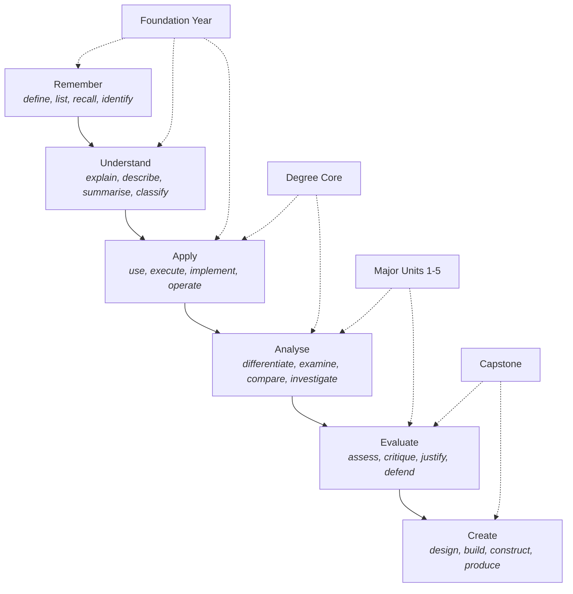
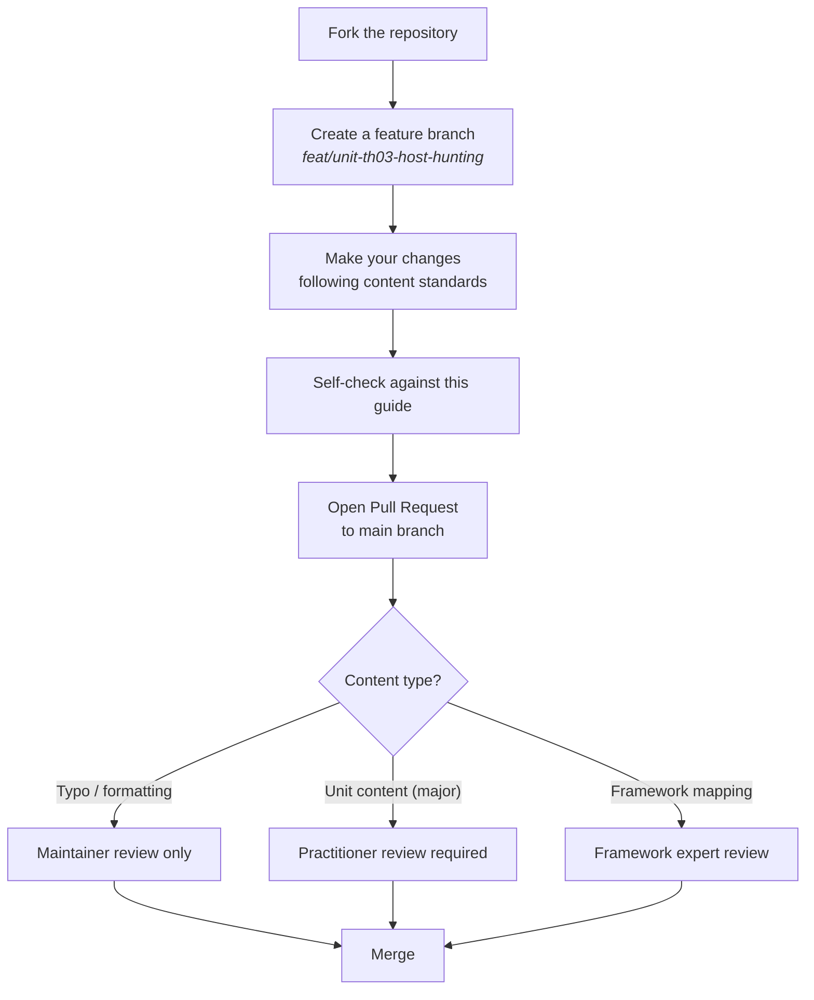

# Contributing Guide & Repository Rules

> This document defines the rules, standards, and processes for contributing to this project. All contributors — whether adding a lab, writing a unit, fixing a typo, or reviewing content — must follow these rules.

---

## Who Can Contribute

This project is open to contributions from:

- **Cybersecurity practitioners** — people working in roles relevant to the majors
- **Educators** — people with experience in tertiary cybersecurity or IT education
- **Students** — people currently learning who can identify gaps or errors
- **Framework experts** — people with deep knowledge of specific frameworks (NIST, MITRE, SFIA, etc.)
- **Anyone** — typos, broken links, and formatting improvements welcome from all

There is no application or membership required. Contributions are made via pull request.

---

## Core Rules

These rules are non-negotiable. Pull requests that violate them will not be merged.

### R1 — Framework Mapping is Mandatory
Every unit, lesson, or lab added must include a framework mapping in its frontmatter or in the relevant section of [docs/frameworks.md](docs/frameworks.md). If you can't map a contribution to at least one framework, reconsider whether it belongs.

### R2 — Practitioner Review for Major Content
Any new or substantially revised unit content within a major (not typos or formatting) must be reviewed by at least one person with active professional experience in that domain before merging. Reviewers should be identified in the pull request.

### R3 — No Vendor Lock-In in Core Content
Core unit content (Foundation Year, Degree Core) must not depend on proprietary tools or paid services. Labs and exercises must be completable using free or open-source tools. Major units may reference commercial tools for context but must not require them.

### R4 — Australian Context is Required
Any unit covering legal, regulatory, or compliance topics must include Australian-specific content. Generic international content is acceptable as background, but Australian law, regulators, and context must be present.

### R5 — Accuracy Over Speed
Do not add content you are not confident is accurate. Inaccurate content in a degree damages learners. If you are unsure, open an Issue or Discussion first.

### R6 — No Plagiarism
Do not copy-paste content from other sources without proper attribution. Summaries, restatements, and original explanations of concepts are fine. Verbatim copying of copyrighted material is not.

### R7 — Respectful Conduct
This project follows a standard Code of Conduct. Be respectful of other contributors, reviewers, and learners. Criticism should be of content, never of people.

---

## Content Standards

### Unit Structure

Every unit must follow this structure:

```
# Unit Title

## Unit Code
(e.g., TH03 — Host-Based Hunting)

## Overview
One paragraph description of the unit.

## Learning Outcomes
By the end of this unit, learners will be able to:
- LO1: [Verb] [object] — phrased as observable outcomes
- LO2: ...

## AQF Level 7 Alignment
Brief statement of how this unit addresses AQF Level 7 descriptors.

## Framework Mappings
| Framework | Reference | Notes |
|---|---|---|
| NIST NICE | K0XXX, S0XXX | ... |
| MITRE ATT&CK | TXX.XXX | ... |
| SFIA 9 | SKILL L3 | ... |

## Topics
### Topic 1 — [Title]
Content here.

### Topic 2 — [Title]
Content here.

## Labs & Exercises
### Lab 1 — [Title]
**Objective:** ...
**Tools:** ...
**Instructions:** ...

## Assessment
Description of how this unit is assessed.

## Further Reading
- [Title](URL) — brief annotation
```

### Learning Outcome Verbs

Learning outcomes must use action verbs from Bloom's Taxonomy, matched to the expected level:



Foundation Year outcomes should sit primarily at B1–B3. Majors should reach B4–B5. Capstone projects must address B5–B6.

---

## File & Naming Conventions

```
degrees/
  operational/
    [major-name]/
      README.md               ← Major overview, unit list, role alignment
      [unit-code]-[slug]/
        README.md             ← Unit content (follows unit structure above)
        labs/
          lab-01-[slug].md
        assets/               ← Images, diagrams (no large files)

core/
  units/
    [unit-code]-[slug]/
      README.md
      labs/

docs/
  [topic].md                  ← Governance and reference documents
```

**Naming rules:**
- All directories and file names: `lowercase-with-hyphens`
- Unit codes follow the pattern: `[PREFIX][NN]` where PREFIX is the major code (F, OC, SC, TH, DF, CT, DE, CE, SE, LD, GR)
- No spaces in file or directory names
- Images: `assets/[descriptive-name].[ext]` — PNG or SVG only; max 1MB per file

---

## Diagrams

Mermaid diagrams are the preferred format for all visual content in this repository. They render natively on GitHub and are version-controlled as text.

**Supported Mermaid diagram types for this project:**
- `graph` / `flowchart` — for process flows, hierarchies, relationships
- `mindmap` — for concept maps and framework overviews
- `timeline` — for roadmaps and phased plans
- `pie` — for coverage statistics
- `quadrantChart` — for positioning and comparison

External image files should only be used when a diagram cannot be expressed in Mermaid (e.g., screenshots of tool output in labs).

---

## Pull Request Process



### Pull Request Template

When opening a PR, use this template:

```markdown
## What does this PR do?
[Brief description]

## Type of change
- [ ] Typo / formatting fix
- [ ] New unit content
- [ ] Lab exercise
- [ ] Framework mapping update
- [ ] Structural / governance change

## Framework mapping included?
- [ ] Yes — see [section/file]
- [ ] N/A — typo or formatting only

## Practitioner review (required for major content)
- [ ] Reviewed by: [name / handle / LinkedIn]
- [ ] N/A — not major content

## Australian context included where relevant?
- [ ] Yes
- [ ] N/A

## Checklist
- [ ] Follows unit structure template
- [ ] Learning outcomes use Bloom's Taxonomy verbs
- [ ] No proprietary tool dependencies in core content
- [ ] Files named per naming conventions
```

---

## Issue Labels

| Label | Meaning |
|---|---|
| `content: new-unit` | Request or proposal for a new unit |
| `content: lab` | Request or proposal for a lab exercise |
| `framework: update` | A framework has been updated and content needs review |
| `major: threat-hunting` | Relates to the Threat Hunting major |
| `major: dfir` | Relates to the DFIR major |
| `major: cti` | Relates to the CTI major |
| `major: detection-engineering` | Relates to the Detection Engineering major |
| `major: cte` | Relates to the CTE major |
| `major: security-engineering` | Relates to the Security Engineering major |
| `major: leadership` | Relates to the Leadership major |
| `major: grc` | Relates to the GRC major |
| `major: foundation` | Relates to Foundation Year content |
| `governance` | Relates to structure, rules, or governance docs |
| `good first issue` | Suitable for first-time contributors |
| `needs: practitioner-review` | Blocked on practitioner review |
| `needs: framework-check` | Framework mapping needs verification |

---

## Versioning & Change Management

### Framework Updates
When a major framework (ATT&CK, NIST CSF, NICE, SFIA, etc.) releases a new version:

1. A maintainer opens an Issue labelled `framework: update`
2. The issue lists all units affected
3. Contributors are invited to update affected content
4. A PR with all framework-driven updates is merged as a batch

### Degree Structure Changes
Changes to the degree structure (adding/removing majors, changing prerequisites, modifying credit points) require:

1. An open Discussion for community input (minimum 14 days)
2. Approval from at least two maintainers
3. A PR that updates all affected files: README, docs/structure.md, docs/frameworks.md, and any affected unit READMEs

---

## Licensing

By submitting a contribution to this repository, you agree that your contribution is licensed under [Creative Commons Attribution 4.0 International (CC BY 4.0)](https://creativecommons.org/licenses/by/4.0/). You retain copyright in your contribution; you grant this project and its users the right to use, adapt, and redistribute your contribution with attribution.

Do not submit content that you do not have the right to licence under CC BY 4.0.

---

## Maintainers

Maintainers are responsible for:
- Reviewing and merging pull requests
- Enforcing content standards
- Managing the issue tracker
- Facilitating framework update cycles
- Coordinating practitioner review

To become a maintainer, make several quality contributions and express interest in a GitHub Discussion.
