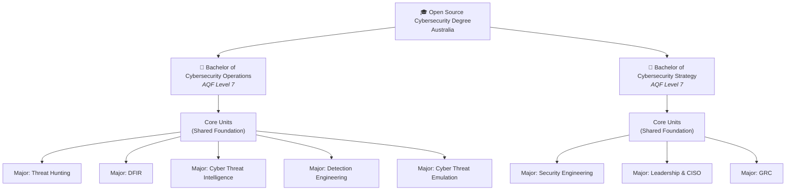
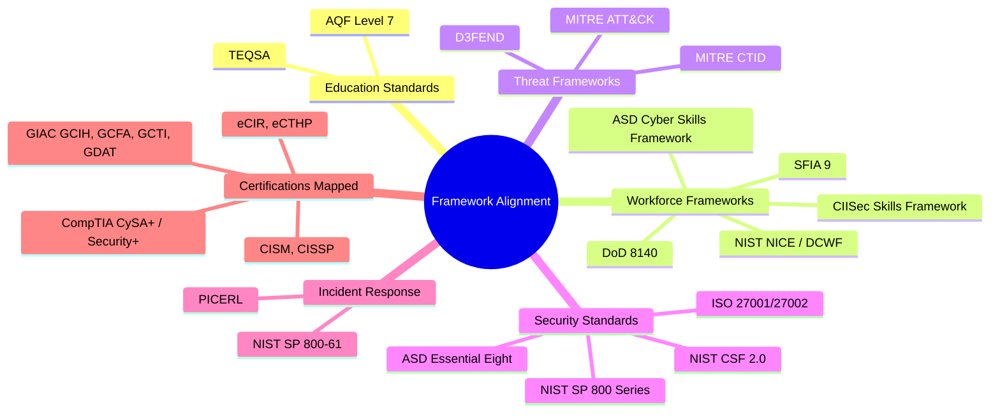

# Open Source Cybersecurity Degree — Australia

> A free, open-source cybersecurity education pathway aligned to Australian tertiary education standards (TEQSA/AQF) and recognised industry frameworks.

---

## Vision

Most open-source education is high quality but rarely accredited or professionally recognised. This project aims to close that gap — building a rigorous, freely available cybersecurity degree that maps directly to both Australian education standards and the frameworks that employers actually use to hire and evaluate practitioners.

The closest precedent is **CS50** — free, academically structured, and globally respected. This degree follows that model but goes further by explicitly mapping every unit of learning to industry workforce frameworks and Australian Qualifications Framework (AQF) standards.

---

## The Two Degrees



---

## Degree Map

```mermaid
flowchart LR
    subgraph FOUNDATION["Foundation — Year 1 (Shared)"]
        F1["Networking Fundamentals"]
        F2["Operating Systems & Administration"]
        F3["Scripting & Automation"]
        F4["Security Concepts & Principles"]
        F5["Legal, Ethics & Australian Compliance"]
        F6["Data & Log Analysis"]
    end

    subgraph OP_CORE["Operational Core — Year 2"]
        O1["Adversary Tradecraft & TTPs"]
        O2["Security Monitoring & SIEM"]
        O3["Malware Analysis Fundamentals"]
        O4["Incident Response Lifecycle"]
        O5["Threat Intelligence Fundamentals"]
        O6["Offensive Security Concepts"]
    end

    subgraph ST_CORE["Strategic Core — Year 2"]
        S1["Risk Management Frameworks"]
        S2["Security Architecture Principles"]
        S3["Governance, Policy & Compliance"]
        S4["Vendor & Supply Chain Risk"]
        S5["Security Program Management"]
        S6["Stakeholder Communication"]
    end

    subgraph MAJORS_OP["Operational Majors — Year 3"]
        M1["Threat Hunting"]
        M2["DFIR"]
        M3["CTI"]
        M4["Detection Engineering"]
        M5["Cyber Threat Emulation"]
    end

    subgraph MAJORS_ST["Strategic Majors — Year 3"]
        M6["Security Engineering"]
        M7["Leadership & CISO"]
        M8["GRC"]
    end

    FOUNDATION --> OP_CORE
    FOUNDATION --> ST_CORE
    OP_CORE --> MAJORS_OP
    ST_CORE --> MAJORS_ST
```



---

## Framework Alignment

Every unit and learning outcome in this degree maps to one or more recognised frameworks. This ensures graduates can demonstrate competency in terms employers understand.



---

## Majors at a Glance

### Operational Degree

| Major | Role Focus | Core Frameworks |
|---|---|---|
| **Threat Hunting** | Proactive detection of undetected threats | MITRE ATT&CK, ASD CSF, NIST NICE TH |
| **DFIR** | Digital forensics & incident response | PICERL, NIST SP 800-61, DCWF, DoD 8140 |
| **Cyber Threat Intelligence** | Producing & consuming finished intelligence | CTI lifecycle, MITRE CTID, STIX/TAXII |
| **Detection Engineering** | Building detection logic at scale | MITRE ATT&CK, Sigma, NIST CSF 2.0 DE |
| **Cyber Threat Emulation** | Adversary simulation & purple team ops | MITRE ATT&CK, C2 Frameworks, TIBER-AU |

### Strategic Degree

| Major | Role Focus | Core Frameworks |
|---|---|---|
| **Security Engineering** | Secure design, architecture & tooling | NIST SP 800-160, SABSA, Zero Trust |
| **Leadership & CISO** | Executive security leadership | NIST CSF 2.0 GV, CISM, SFIA Leadership |
| **GRC** | Governance, risk & compliance programs | NIST CSF 2.0, ISO 27001, ASD Essential Eight, APRA CPS 234 |

---

## Repository Structure

```
📁 Open-source-cybersecurity-degree-australia/
├── README.md                        ← This file
├── CONTRIBUTING.md                  ← Contribution rules and PR process
├── docs/
│   ├── goals.md                     ← Vision, objectives, and success criteria
│   ├── structure.md                 ← Full degree architecture & unit design
│   ├── frameworks.md                ← Framework-to-unit mapping tables
│   ├── accreditation.md             ← TEQSA/AQF alignment strategy
│   ├── governance.md                ← Governance model: roles, lifecycle, decisions
│   ├── content-standards.md         ← Mandatory content standards for all units
│   └── compliance/
│       ├── aqf-teqsa.md             ← AQF Level 7 + TEQSA HESF compliance
│       ├── workforce-frameworks.md  ← NICE/DCWF, SFIA 9, ASD mapping requirements
│       └── program-delivery.md      ← Delivery: accessibility, licensing, QA, versioning
├── templates/
│   ├── unit-template.md             ← Mandatory unit content template
│   └── review-checklist.md          ← Practitioner review sign-off checklist
├── core/
│   └── units/                       ← Shared foundation and core units
├── degrees/
│   ├── operational/
│   │   ├── threat-hunting/
│   │   ├── dfir/
│   │   ├── cti/
│   │   ├── detection-engineering/
│   │   └── cte/
│   └── strategic/
│       ├── security-engineering/
│       ├── leadership/
│       └── grc/
```

---

## Design Principles

1. **Open by default** — All materials are freely accessible, no paywalls
2. **Framework-native** — Every learning outcome maps to an industry or education framework
3. **Practitioner-led** — Content is authored or reviewed by working cybersecurity professionals
4. **Lab-first** — Practical exercises, not just theory
5. **Australian-context** — Legislation, regulators, and threat landscape are Australian where relevant
6. **Credential-bridging** — Completion maps to industry certifications so learners have external validation options
7. **Modular** — Units can be taken individually or as part of the full degree pathway

---

## University & Institutional Guide

For universities, delivery partners, and institutions seeking to adopt, recognise,
or benchmark this degree, the following documents provide the complete institutional
reference:

| Category | Documents |
|---|---|
| **Student-facing** | [Student Handbook](docs/student/handbook.md) · [Prospectus](docs/student/prospectus.md) · [Academic Integrity](docs/student/academic-integrity.md) · [Recognition of Prior Learning](docs/student/recognition-of-prior-learning.md) |
| **Educator-facing** | [Facilitator Guide](docs/educator/facilitator-guide.md) · [Assessment Moderation](docs/educator/assessment-moderation-guide.md) · [Capstone Supervision](docs/educator/capstone-supervision-guide.md) |
| **Institutional** | [Graduate Attributes](docs/institutional/graduate-attributes.md) · [Threshold Learning Outcomes](docs/institutional/threshold-learning-outcomes.md) · [External Benchmarking](docs/institutional/external-benchmarking.md) · [Equivalence Mapping](docs/institutional/equivalence-mapping.md) · [Pedagogy Statement](docs/institutional/pedagogy-statement.md) · [Industry Advisory Board Charter](docs/institutional/industry-advisory-board-charter.md) |
| **Curriculum** | [Curriculum Map](docs/curriculum/curriculum-map.md) · [Delivery Modes](docs/curriculum/delivery-modes.md) · [Micro-Credentials](docs/curriculum/micro-credentials-framework.md) · [Work-Integrated Learning](docs/curriculum/work-integrated-learning.md) |
| **Quality** | [Annual Review Schedule](docs/quality/annual-review-schedule.md) · [Equity & Inclusion](docs/quality/equity-and-inclusion.md) |

---

## Governance & Compliance

This degree operates under a formal governance model with compliance requirements
for both educational standards (AQF/TEQSA) and workforce framework alignment (NICE, SFIA, ASD).

### Key Documents

| Document | Purpose |
|---|---|
| [CONTRIBUTING.md](CONTRIBUTING.md) | Contribution rules, content standards, review process |
| [docs/governance.md](docs/governance.md) | Governance model: roles, content lifecycle, decision-making |
| [docs/content-standards.md](docs/content-standards.md) | Mandatory content standards for all units |
| [docs/compliance/aqf-teqsa.md](docs/compliance/aqf-teqsa.md) | AQF Level 7 + TEQSA HESF compliance requirements |
| [docs/compliance/workforce-frameworks.md](docs/compliance/workforce-frameworks.md) | NICE/DCWF, SFIA 9, ASD framework mapping compliance |
| [docs/compliance/program-delivery.md](docs/compliance/program-delivery.md) | Delivery standards: accessibility, licensing, QA cycles |
| [docs/goals.md](docs/goals.md) | Vision, objectives, and success criteria |
| [docs/accreditation.md](docs/accreditation.md) | TEQSA/AQF alignment strategy |

### Content Lifecycle

All unit content moves through a mandatory review lifecycle before publication:

```
Draft → Under Review → Practitioner Approved → Framework Verified → Published
```

Every unit requires sign-off from a **Domain Expert** (technical accuracy),
**Practitioner Reviewer** (workforce relevance), and **Framework Custodian**
(framework mapping accuracy) before it can be published.

### Templates

Contributors must use the templates in the `templates/` directory:
- [templates/unit-template.md](templates/unit-template.md) — mandatory unit content template
- [templates/review-checklist.md](templates/review-checklist.md) — PR review sign-off checklist

---

## Status

> This project is in active development. Structure and content are being defined. See [CONTRIBUTING.md](CONTRIBUTING.md) to get involved.

---

## Licence

All content in this repository is released under [Creative Commons Attribution 4.0 International (CC BY 4.0)](https://creativecommons.org/licenses/by/4.0/) unless otherwise noted. You are free to use, adapt, and share with attribution.
