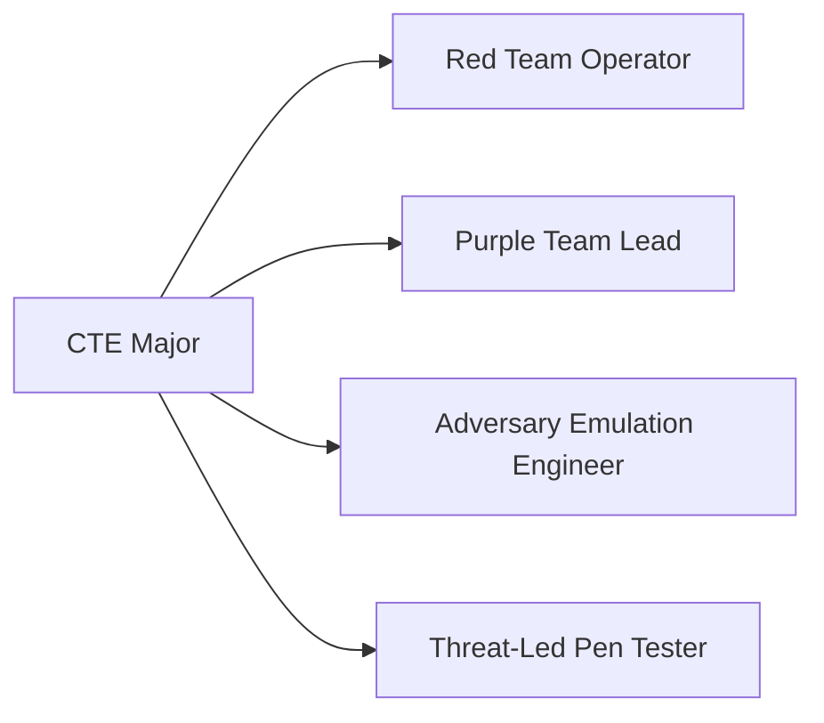
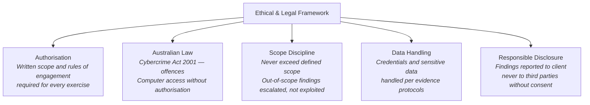
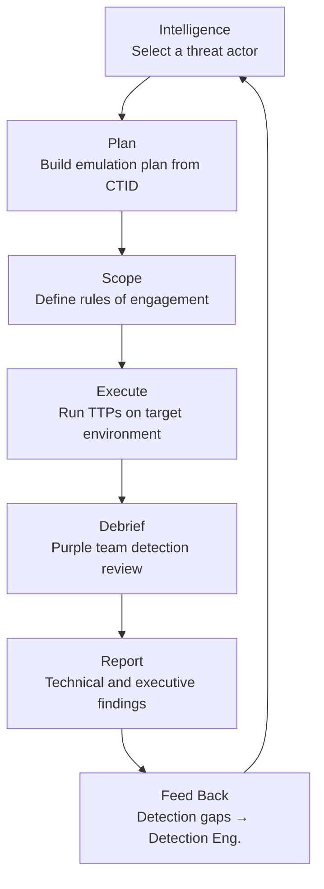

# Major: Cyber Threat Emulation (CTE)

**Degree:** Bachelor of Cybersecurity Operations
**Year:** 3
**Credit Points:** 48 CP (6 units × 8 CP) + 24 CP Capstone = 72 CP

---

## Overview

Cyber Threat Emulation (CTE) is the practice of simulating real-world adversary behaviour — based on known threat actor tradecraft — to test and improve defensive controls and team readiness. It is distinct from traditional penetration testing: where a pentest finds vulnerabilities, CTE asks "can our defenders detect and respond to this specific threat actor's behaviour?"

CTE encompasses red team operations (adversary simulation), purple team operations (collaborative detection and response testing), and the formal emulation frameworks used in financial sector threat-led testing (TIBER-AU).

> **Ethics and authorisation are foundational.** All offensive techniques covered in this major are taught strictly in the context of authorised, scoped engagements. CTE practitioners operate within legal and ethical boundaries at all times.

---

## Role Alignment

**Typical job titles in Australia:** Red Team Operator, Purple Team Analyst, Adversary Simulation Engineer, Threat-Led Penetration Tester, Security Assurance Analyst

---

## Units

| Code | Title | Status |
|---|---|---|
| CE01 | [Offensive Foundations & Ethics](CE01-offensive-foundations-ethics.md) | Draft |
| CE02 | [Red Team Operations](CE02-red-team-operations.md) | Draft |
| CE03 | [ATT&CK-Based Emulation](CE03-attack-based-emulation.md) | Draft |
| CE04 | [Purple Team Operations](CE04-purple-team-operations.md) | Draft |
| CE05 | [Reporting & Debrief](CE05-reporting-debrief.md) | Draft |
| CE06 | [Capstone — Emulation Exercise](CE06-capstone-emulation-exercise.md) | Draft |

---

## Framework Mappings

| Framework | References |
|---|---|
| MITRE ATT&CK | Emulation plan construction; TTP execution |
| MITRE CTID | Adversary emulation methodology and plans |
| TIBER-EU / TIBER-AU | Threat-led penetration testing framework (financial sector) |
| NIST NICE | PR-CDA-001 |
| DCWF | 711 (Exploitation Analyst) |
| SFIA 9 | PENT L4–L5 |
| CIISec | Penetration Testing & Red Teaming |

---

## Prerequisites

- Foundation Year: F01–F06
- Operational Core: OC01–OC06 (especially OC06 Offensive Security Concepts)

> **Prerequisite note:** Learners should also engage with the Detection Engineering major content (or take DE01–DE03 as electives) to understand the defender perspective. Effective threat emulation requires understanding what defenders can and cannot see.

---

## Certification Bridges

| Certification | Alignment |
|---|---|
| OSCP (OffSec) | Technical exploitation skills |
| GIAC GPEN | Penetration testing methodology |
| GIAC GRTOP | Red team operations professional |
| eCPTX (eLearnSecurity) | Advanced penetration testing |
| CREST CRT / CCT | Australian-relevant credentials for formal engagements |

---

## Tools Used in This Major

| Tool | Purpose |
|---|---|
| Cobalt Strike (trial) / Sliver / Havoc | C2 framework concepts |
| Atomic Red Team | Atomic TTP execution |
| MITRE CTID Adversary Emulation Plans | Structured emulation plans |
| MITRE ATT&CK Navigator | Emulation planning and coverage |
| BloodHound CE | Active Directory attack path analysis |
| Metasploit Community | Exploitation framework basics |
| Nmap | Reconnaissance |

> All primary lab work uses free/open-source tools. Cobalt Strike may be referenced for conceptual understanding but labs are completed without it.

---

## Ethical & Legal Framework

CTE is an offensive discipline and carries significant legal and ethical obligations:

---

## The Emulation Cycle

---

## Contributing

To contribute content to this major, see [CONTRIBUTING.md](../../../CONTRIBUTING.md). All new unit content requires practitioner review from someone with active red team or adversary emulation experience.
