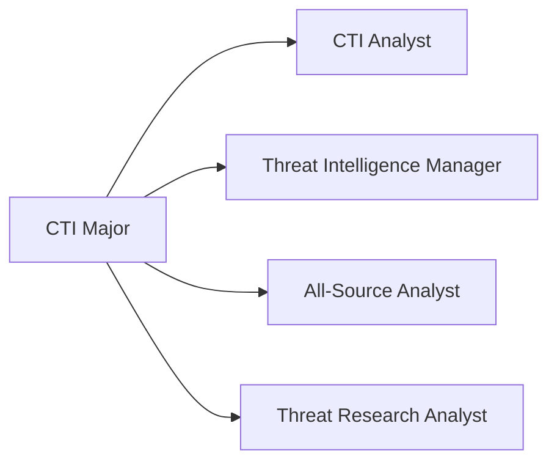
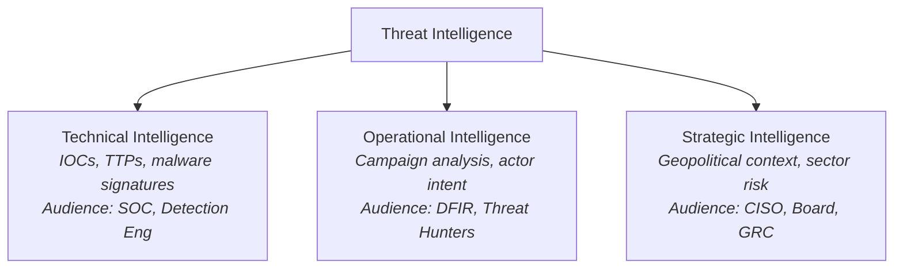

# Major: Cyber Threat Intelligence (CTI)

**Degree:** Bachelor of Cybersecurity Operations
**Year:** 3
**Credit Points:** 48 CP (6 units × 8 CP) + 24 CP Capstone = 72 CP

---

## Overview

Cyber Threat Intelligence is the discipline of collecting, processing, analysing, and disseminating information about adversaries and their capabilities to support decision-making. CTI is not simply collecting IOCs — it is the production of finished intelligence products that answer specific requirements for specific audiences.

This major trains learners to operate across the full intelligence cycle: from articulating priority intelligence requirements through collection and analysis to producing and disseminating finished intelligence at technical, operational, and strategic levels.

---

## Role Alignment

**Typical job titles in Australia:** Cyber Threat Intelligence Analyst, Threat Research Analyst, Intelligence Operations Analyst, CTI Lead

---

## Units

| Code | Title | Status |
|---|---|---|
| CT01 | [Intelligence Tradecraft](CT01-intelligence-tradecraft.md) | Draft |
| CT02 | [Threat Actor Research & Profiling](CT02-threat-actor-research-profiling.md) | Draft |
| CT03 | [Technical Intelligence](CT03-technical-intelligence.md) | Draft |
| CT04 | [Strategic Intelligence](CT04-strategic-intelligence.md) | Draft |
| CT05 | [CTI Platforms & Sharing](CT05-cti-platforms-sharing.md) | Draft |
| CT06 | [Capstone — Intelligence Product](CT06-capstone-intelligence-product.md) | Draft |

---

## Framework Mappings

| Framework | References |
|---|---|
| MITRE CTID | Center for Threat-Informed Defense methodology |
| MITRE ATT&CK | Actor-technique mapping, group profiles |
| Diamond Model of Intrusion Analysis | Core analytical model |
| STIX 2.1 / TAXII 2.1 | Structured threat intelligence sharing |
| NIST NICE | AN-TWA-001, AN-ASA-001 |
| DCWF | 621 (Threat/Warning Analyst), 611 (All-Source Analyst) |
| SFIA 9 | INAS L4–L5 |
| CIISec | Threat Intelligence & Investigation |

---

## Prerequisites

- Foundation Year: F01–F06
- Operational Core: OC01–OC06 (especially OC05 Threat Intelligence Fundamentals)

---

## Certification Bridges

| Certification | Alignment |
|---|---|
| GIAC GCTI | Direct — threat intelligence analysis |
| CREST CCTIM | Direct — threat intelligence management |
| eCTHP (eLearnSecurity) | Moderate — threat hunting and intelligence overlap |
| SANS FOR578 | Advanced CTI course alignment |

---

## Tools Used in This Major

| Tool | Purpose |
|---|---|
| OpenCTI | Open-source CTI platform |
| MISP | Malware Information Sharing Platform |
| MITRE ATT&CK Navigator | Actor-technique mapping |
| Maltego Community | Open-source intelligence pivoting |
| VirusTotal (free tier) | IOC enrichment |
| Shodan (free tier) | Infrastructure research |
| Python (stix2 library) | Programmatic STIX creation |

---

## Intelligence Levels

This major covers all three levels of intelligence:

---

## Contributing

To contribute content to this major, see [CONTRIBUTING.md](../../../CONTRIBUTING.md). All new unit content requires practitioner review from someone with active CTI experience.
