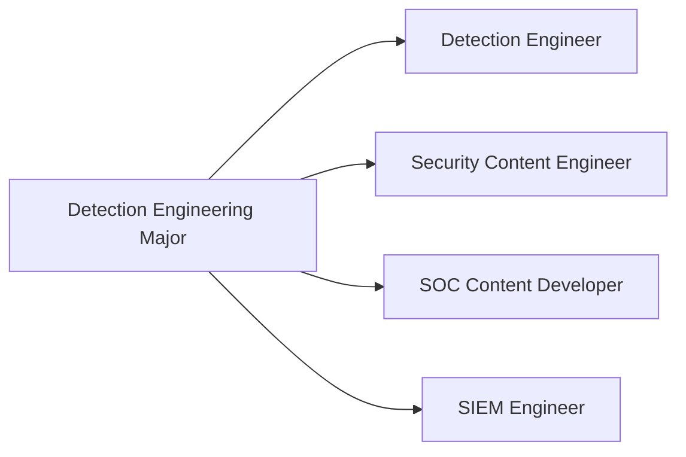
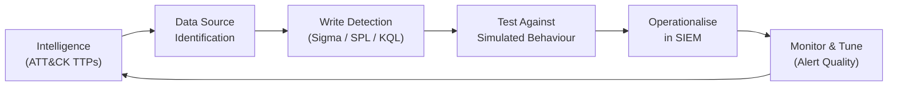

# Major: Detection Engineering

**Degree:** Bachelor of Cybersecurity Operations
**Year:** 3
**Credit Points:** 48 CP (6 units × 8 CP) + 24 CP Capstone = 72 CP

---

## Overview

Detection Engineering is the practice of designing, building, testing, and maintaining the detection logic that converts threat knowledge into actionable, reliable alerts. It sits at the intersection of threat intelligence, security operations, and software engineering — requiring both adversary knowledge and the technical ability to implement that knowledge as durable, maintainable detections.

This major trains learners to build and operate a detection capability: understanding data sources, writing detection logic in multiple languages (Sigma, SPL, KQL), testing detections against simulated adversary behaviour, and managing a detection library over time.

---

## Role Alignment

**Typical job titles in Australia:** Detection Engineer, Security Content Engineer, SIEM Engineer, SOC Content Developer, Threat Detection Analyst

---

## Units

| Code | Title | Status |
|---|---|---|
| DE01 | Detection Theory & Philosophy | Planned |
| DE02 | Data Sources & Log Engineering | Planned |
| DE03 | Writing Detection Logic | Planned |
| DE04 | Adversary Simulation for Detection | Planned |
| DE05 | Detection Operations & Management | Planned |
| DE06 | Capstone — Detection Library | Planned |

---

## Framework Mappings

| Framework | References |
|---|---|
| MITRE ATT&CK | Detection-per-technique, coverage mapping |
| NIST CSF 2.0 | DE.AE (Adverse Event Analysis), DE.CM (Continuous Monitoring) |
| Sigma | Detection rule language standard |
| NIST NICE | PR-INF-001, AN-TWT-001 |
| DCWF | 511 (Cyber Defense Analyst) |
| SFIA 9 | SCAD L3–L4 |
| CIISec | Cyber Operations |

---

## Prerequisites

- Foundation Year: F01–F06 (especially F06 Data & Log Analysis)
- Operational Core: OC01–OC06 (especially OC01 Adversary Tradecraft, OC02 Security Monitoring)

---

## Certification Bridges

| Certification | Alignment |
|---|---|
| GIAC GDAT | Direct — defending with ATT&CK |
| Splunk Core Certified Power User | Data source and SPL skills |
| Elastic Certified Engineer | Elastic/OpenSearch detection skills |
| CompTIA CySA+ | Moderate — detection analysis skills |

---

## Tools Used in This Major

| Tool | Purpose |
|---|---|
| Elastic / OpenSearch | SIEM and log platform |
| Splunk Free (Dev Edition) | Detection logic in SPL |
| Sigma | Vendor-agnostic detection rule format |
| SigmaHQ / pySigma | Rule management and conversion |
| Atomic Red Team | Adversary simulation for detection testing |
| MITRE ATT&CK Navigator | Coverage gap analysis |
| YARA | Malware and file-based detection rules |

---

## The Detection Engineering Cycle

---

## Contributing

To contribute content to this major, see [CONTRIBUTING.md](../../../CONTRIBUTING.md). All new unit content requires practitioner review from someone with active detection engineering experience.
