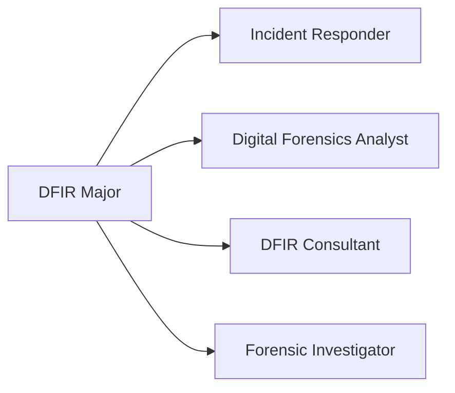

# Major: Digital Forensics & Incident Response (DFIR)

**Degree:** Bachelor of Cybersecurity Operations
**Year:** 3
**Credit Points:** 48 CP (6 units × 8 CP) + 24 CP Capstone = 72 CP

---

## Overview

DFIR encompasses two closely related disciplines: **digital forensics** (the systematic collection and analysis of digital evidence) and **incident response** (the structured process of detecting, containing, eradicating, and recovering from security incidents).

This major trains learners to operate across the full DFIR lifecycle — from receiving an incident alert through to producing a forensic report suitable for legal proceedings or executive briefing. The Australian legal context (Evidence Act 1995, chain of custody requirements) is integrated throughout.

---

## Role Alignment

**Typical job titles in Australia:** Incident Response Analyst, Digital Forensics Analyst, DFIR Consultant, Cyber Incident Manager

---

## Units

| Code | Title | Status |
|---|---|---|
| DF01 | [DFIR Process & Legal Foundations](DF01-dfir-process-legal-foundations.md) | Draft |
| DF02 | [Host Forensics](DF02-host-forensics.md) | Draft |
| DF03 | [Memory Forensics](DF03-memory-forensics.md) | Draft |
| DF04 | [Network Forensics](DF04-network-forensics.md) | Draft |
| DF05 | [Incident Response Operations](DF05-incident-response-operations.md) | Draft |
| DF06 | [Capstone — IR Simulation](DF06-capstone-ir-simulation.md) | Draft |

---

## Framework Mappings

| Framework | References |
|---|---|
| PICERL | Full lifecycle — Preparation through Lessons Learned |
| NIST SP 800-61 | Computer Security Incident Handling Guide |
| DCWF | 212 (Law & Policy), 221 (Cyber Investigation) |
| DoD 8140 | Cyber Investigation work role |
| SFIA 9 | SURE L4–L5 |
| CIISec | Digital Forensics; Cyber Operations |
| NIST NICE | IN-FOR-001, IN-INV-001 |

---

## Prerequisites

- Foundation Year: F01–F06
- Operational Core: OC01–OC06 (especially OC04 Incident Response Lifecycle)

---

## Certification Bridges

| Certification | Alignment |
|---|---|
| GIAC GCFE | Host forensics — Windows and browser artefacts |
| GIAC GCFA | Advanced forensics and malware investigation |
| GIAC GCIH | Incident handling lifecycle |
| eCIR (eLearnSecurity) | Incident response methodology |
| eCDFP (eLearnSecurity) | Digital forensics professional |

---

## Tools Used in This Major

| Tool | Purpose |
|---|---|
| Autopsy / Sleuth Kit | Disk image analysis |
| Volatility 3 | Memory forensics |
| FTK Imager (free) | Disk imaging and acquisition |
| Wireshark | Network packet capture analysis |
| Plaso / log2timeline | Timeline creation |
| Velociraptor | Live response and triage |
| TheHive | Incident case management |

> All tools in this major are free or have a free tier.

---

## Australian Legal Context

This major specifically covers the Australian legal context for digital forensics:

- **Evidence Act 1995 (Commonwealth)** — admissibility of electronic evidence
- **Chain of custody requirements** — documentation standards for evidence integrity
- **Notifiable Data Breaches (NDB) scheme** — obligations when an incident involves a data breach
- **Mandatory reporting timelines** — APRA, ASD notification requirements
- **Privacy Act 1988** — handling personal information during investigations

---

## Contributing

To contribute content to this major, see [CONTRIBUTING.md](../../../CONTRIBUTING.md). All new unit content requires practitioner review from someone with active DFIR experience.
