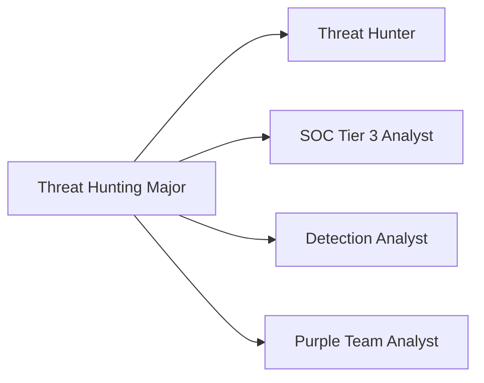

# Major: Threat Hunting

**Degree:** Bachelor of Cybersecurity Operations
**Year:** 3
**Credit Points:** 48 CP (6 units × 8 CP) + 24 CP Capstone = 72 CP

---

## Overview

Threat hunting is the proactive, analyst-driven search for threats that have evaded automated detection controls. Unlike reactive security operations, threat hunting starts with a hypothesis — based on adversary tradecraft, intelligence, or observed anomalies — and systematically tests that hypothesis across available data.

This major trains learners to operate as skilled threat hunters: people who can formulate evidence-based hunt hypotheses, execute structured hunt operations using host and network data, and feed findings back into detection engineering and intelligence cycles.

---

## Role Alignment

**Typical job titles in Australia:** Threat Hunter, Senior SOC Analyst (L3), Detection & Response Analyst, Security Operations Specialist

---

## Units

| Code | Title | Status |
|---|---|---|
| TH01 | Hunting Methodology & Process | Planned |
| TH02 | ATT&CK for Hunters | Planned |
| TH03 | Host-Based Hunting | Planned |
| TH04 | Network-Based Hunting | Planned |
| TH05 | Hunt Operations & Tooling | Planned |
| TH06 | Capstone — Hunt Operation | Planned |

---

## Framework Mappings

| Framework | References |
|---|---|
| MITRE ATT&CK | All 14 tactics; technique-level hunting |
| NIST NICE | SP-TEC-001, AN-TWT-001 |
| DCWF | 511 (Cyber Defense Analyst) |
| ASD Cyber Skills Framework | Cyber Defence domain |
| SFIA 9 | INAS L4–L5 |
| CIISec | Cyber Operations; Threat Intelligence |

---

## Prerequisites

- Foundation Year: F01–F06
- Operational Core: OC01–OC06

---

## Certification Bridges

| Certification | Alignment |
|---|---|
| GIAC GCIH | High — incident handling overlaps with hunt response |
| eCTHP (eLearnSecurity) | Direct — threat hunting professional |
| BTL2 (Blue Team Labs) | Moderate — detection and analysis skills |
| CompTIA CySA+ | Moderate — foundational analyst skills |

---

## Tools Used in This Major

| Tool | Purpose |
|---|---|
| Velociraptor | Endpoint hunt queries (VQL) |
| Elastic / OpenSearch | Log-based hunting |
| MITRE ATT&CK Navigator | Hunt planning and coverage mapping |
| Jupyter Notebooks | Hunt documentation and analysis |
| Sigma | Detection rule creation from hunt findings |
| Wireshark / Zeek | Network traffic analysis |

> All tools in this major are free or open-source.

---

## Contributing

To contribute content to this major, see [CONTRIBUTING.md](../../../CONTRIBUTING.md). All new unit content requires practitioner review from someone with active threat hunting experience.
