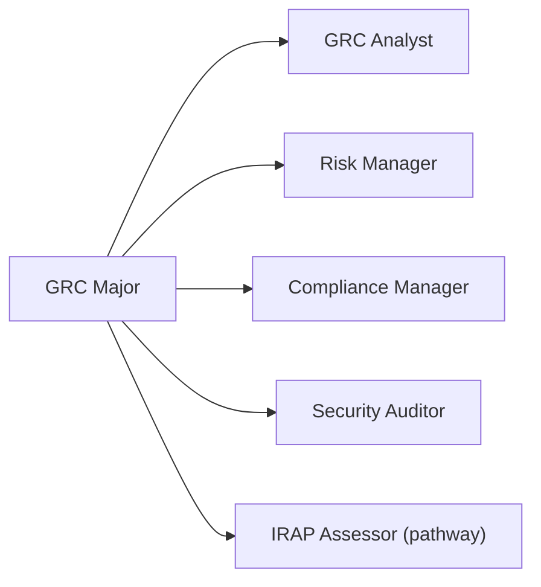
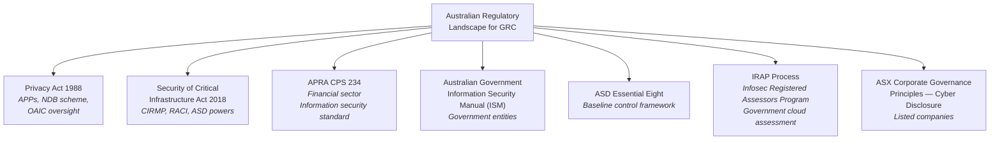

# Major: Governance, Risk & Compliance (GRC)

**Degree:** Bachelor of Cybersecurity Strategy
**Year:** 3
**Credit Points:** 48 CP (6 units × 8 CP) + 24 CP Capstone = 72 CP

---

## Overview

GRC — Governance, Risk, and Compliance — is the discipline of designing and managing the structures, processes, and controls that give an organisation confidence in its security posture and its ability to meet regulatory obligations.

Effective GRC is not a paper exercise. It requires deep understanding of the threat landscape, operational security realities, regulatory requirements, and organisational culture. This major trains learners to build GRC programs that are connected to operational reality and provide genuine value, not just compliance theatre.

---

## Role Alignment

**Typical job titles in Australia:** GRC Analyst, Cyber Risk Manager, Information Security Manager, Security Compliance Analyst, IRAP Assessor

---

## Units

| Code | Title | Status |
|---|---|---|
| GR01 | Security Governance Design | Planned |
| GR02 | Risk Management in Practice | Planned |
| GR03 | Compliance Frameworks | Planned |
| GR04 | Australian Regulatory Environment | Planned |
| GR05 | Audit & Assurance | Planned |
| GR06 | Capstone — GRC Program Design | Planned |

---

## Framework Mappings

| Framework | References |
|---|---|
| NIST CSF 2.0 | GV.* (full), ID.* (full) |
| ISO 27001:2022 | Full — all clauses and Annex A controls |
| ISO 27005 | Information security risk management |
| NIST SP 800-37 | Risk Management Framework (RMF) |
| ASD Essential Eight | Maturity model, assessment methodology |
| APRA CPS 234 | Information security — regulated entities |
| Privacy Act 1988 | Australian privacy obligations |
| SOCI Act 2018 | Critical infrastructure security obligations |
| SFIA 9 | IRMG L5–L6 |
| CIISec | Governance, Risk & Compliance |
| NIST NICE | OV-MGT-002, SP-RSK-001 |
| DCWF | 722 (Information Systems Security Manager) |

---

## Prerequisites

- Foundation Year: F01–F06
- Strategic Core: SC01–SC06 (especially SC01 Risk Management Frameworks, SC03 Governance)

---

## Certification Bridges

| Certification | Alignment |
|---|---|
| ISO 27001 Lead Implementer | Direct — GR01, GR03, GR05 |
| ISO 27001 Lead Auditor | Direct — GR05 |
| CISM (ISACA) | High — risk and governance domains |
| CRISC (ISACA) | Direct — Risk Management |
| IRAP Assessor (ASD) | GR03, GR04, GR05 provide the foundation |

---

## Australian Regulatory Focus

GRC in Australia operates in a distinctive regulatory environment. This major provides more depth on Australian regulation than any other major:

---

## Capstone — GRC Program Design

The GR06 capstone requires learners to design a complete GRC program for a defined scenario organisation. Deliverables include:

1. **Policy framework** — policy hierarchy, core policies drafted
2. **Risk register** — populated with plausible risks, assessed using a chosen methodology
3. **Compliance gap assessment** — against ISO 27001 or ASD Essential Eight (learner's choice)
4. **Audit plan** — internal audit schedule for one year
5. **Executive summary** — one-page risk posture summary for a board audience

---

## Contributing

To contribute content to this major, see [CONTRIBUTING.md](../../../CONTRIBUTING.md). All new unit content requires practitioner review from someone with active GRC, risk management, or compliance experience in a cybersecurity context.
