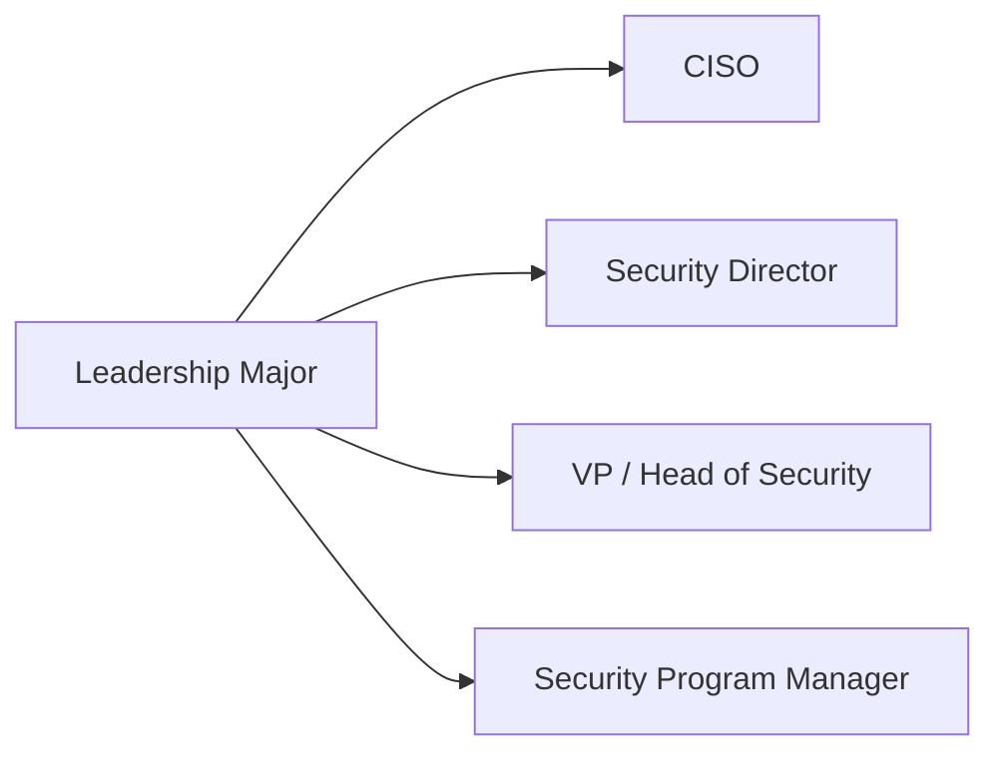
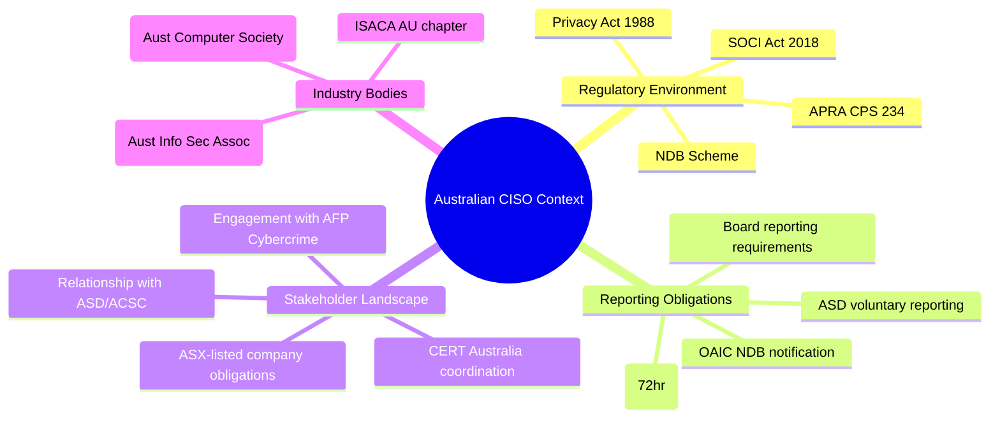

# Major: Leadership & CISO

**Degree:** Bachelor of Cybersecurity Strategy
**Year:** 3
**Credit Points:** 48 CP (6 units × 8 CP) + 24 CP Capstone = 72 CP

---

## Overview

The CISO role is one of the most complex in modern organisations — it requires technical literacy, strategic thinking, commercial acumen, political skill, and the ability to communicate risk clearly to audiences ranging from engineers to boards. Effective CISOs are in short supply in Australia, and there is no single structured pathway to the role.

This major provides a structured, practitioner-informed foundation for cybersecurity leadership. It is designed for practitioners who are building toward senior leadership roles, as well as current leaders who want to formalise and extend their capabilities.

---

## Role Alignment

**Typical job titles in Australia:** CISO, Head of Cyber Security, Security Director, Group Security Manager, Cyber Risk Executive

---

## Units

| Code | Title | Status |
|---|---|---|
| LD01 | [CISO Role & Function](LD01-ciso-role-function.md) | Draft |
| LD02 | [Security Strategy & Roadmapping](LD02-security-strategy-roadmapping.md) | Draft |
| LD03 | [Communicating Risk to Executives](LD03-communicating-risk-to-executives.md) | Draft |
| LD04 | [Building & Leading Security Teams](LD04-building-leading-security-teams.md) | Draft |
| LD05 | [Crisis Management & Communications](LD05-crisis-management-comms.md) | Draft |
| LD06 | [Capstone — CISO Simulation](LD06-capstone-ciso-simulation.md) | Draft |

---

## Framework Mappings

| Framework | References |
|---|---|
| NIST CSF 2.0 | GV.* (Govern function) — full coverage |
| NIST NICE | OV-MGT-001, OV-MGT-002 |
| DCWF | 901 (Executive Cyber Leadership) |
| SFIA 9 | MANA L6–L7; CNSL L6 |
| CIISec | Security Management |
| CISM Domains | All four CISM domains map to units in this major |
| CISSP Domains | Domain 1 (Security and Risk Management) |

---

## Prerequisites

- Foundation Year: F01–F06
- Strategic Core: SC01–SC06

> **Recommended:** Completion of or exposure to at least one other major (GRC or Security Engineering recommended) before attempting the CISO capstone.

---

## Certification Bridges

| Certification | Alignment |
|---|---|
| CISM (ISACA) | Direct — Information Security Management |
| GIAC GSLC | Security leadership and communication |
| CISSP (ISC²) | Broad security management domains |
| Australian Institute of Company Directors (AICD) — Cyber Governance course | Board-level engagement context |

---

## The Australian CISO Context

This major specifically addresses the Australian operating environment:

---

## Capstone — CISO Simulation

The LD06 capstone is a simulation exercise in which learners:

1. Are given a scenario organisation (industry, size, threat profile, current state)
2. Develop a 3-year security strategy and roadmap
3. Build an executive risk dashboard
4. Present a simulated board briefing (recorded or live with a reviewer)
5. Respond to a simulated media/regulatory inquiry following a breach

This capstone is the closest simulation of the actual CISO role achievable in an educational setting.

---

## Contributing

To contribute content to this major, see [CONTRIBUTING.md](../../../CONTRIBUTING.md). All new unit content requires practitioner review from someone with active senior security leadership experience (CISO, Head of Security, or equivalent).
