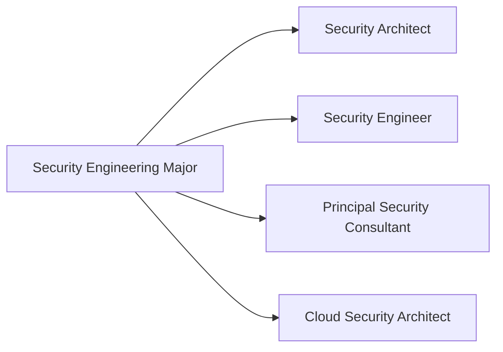

# Major: Security Engineering

**Degree:** Bachelor of Cybersecurity Strategy
**Year:** 3
**Credit Points:** 48 CP (6 units × 8 CP) + 24 CP Capstone = 72 CP

---

## Overview

Security Engineering sits at the intersection of the operational and strategic worlds: it is deeply technical but produces outputs that serve the entire organisation. Security engineers design secure systems and architectures, build and integrate security tooling, implement identity and access management, and embed security into development pipelines.

This major trains learners to think like security architects and build like security engineers — understanding how to translate threat and risk knowledge into robust, implementable security controls and platform designs.

---

## Role Alignment

**Typical job titles in Australia:** Security Architect, Security Engineer, Principal Consultant (Security), Cloud Security Engineer, Identity Architect

---

## Units

| Code | Title | Status |
|---|---|---|
| SE01 | [Secure System Design](SE01-secure-system-design.md) | Draft |
| SE02 | [Security Architecture](SE02-security-architecture.md) | Draft |
| SE03 | [Identity & Access Management](SE03-identity-access-management.md) | Draft |
| SE04 | [Detection & Response Engineering](SE04-detection-response-engineering.md) | Draft |
| SE05 | [Security in Cloud & DevSecOps](SE05-security-cloud-devsecops.md) | Draft |
| SE06 | [Capstone — Architecture Design](SE06-capstone-architecture-design.md) | Draft |

---

## Framework Mappings

| Framework | References |
|---|---|
| NIST SP 800-160 | Systems Security Engineering |
| NIST SP 800-207 | Zero Trust Architecture |
| SABSA | Sherwood Applied Business Security Architecture |
| NIST CSF 2.0 | PR.* (Protect function) |
| NIST SP 800-53 | Security and Privacy Controls |
| ASD Essential Eight | Implementation and architecture context |
| SFIA 9 | ARCH L5–L6 |
| CIISec | Security Architecture |
| NIST NICE | SP-ARC-001, SP-ARC-002 |
| DCWF | 651 (Enterprise Architect), 652 (Security Architect) |

---

## Prerequisites

- Foundation Year: F01–F06
- Strategic Core: SC01–SC06 (especially SC02 Security Architecture Principles)
- Recommended: OC01–OC02 from Operational Core (adversary tradecraft informs architecture decisions)

---

## Certification Bridges

| Certification | Alignment |
|---|---|
| SABSA SCF (Practitioner) | Direct — security architecture methodology |
| AWS Certified Security Specialty | Cloud security architecture |
| CISSP-ISSAP | Security architecture concentration |
| CompTIA SecurityX (formerly CASP+) | Advanced security engineering |
| Google Professional Cloud Security Engineer | Cloud platform security |

---

## Tools Used in This Major

| Tool | Purpose |
|---|---|
| draw.io / Lucidchart | Architecture diagram creation |
| Microsoft Threat Modelling Tool | Threat modelling |
| Terraform (free) | Infrastructure-as-code security concepts |
| HashiCorp Vault (free) | Secrets management concepts |
| Keycloak | Open-source IAM and federation |
| Trivy | Container and IaC security scanning |
| OWASP ZAP | Application security testing |

---

## Contributing

To contribute content to this major, see [CONTRIBUTING.md](../../../CONTRIBUTING.md). All new unit content requires practitioner review from someone with active security architecture or engineering experience.
