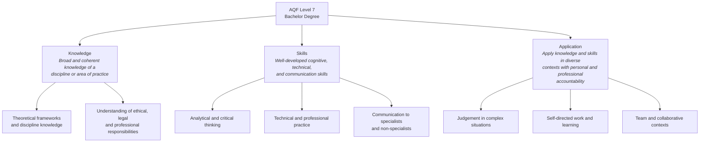
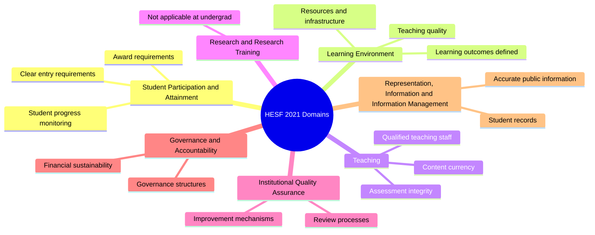
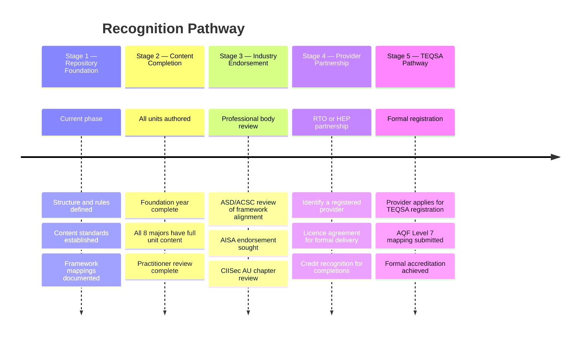

# Accreditation & Qualification Alignment

> This document explains how the degree aligns to the Australian Qualifications Framework (AQF) and the regulatory framework administered by the Tertiary Education Quality and Standards Agency (TEQSA). It also articulates the long-term pathway toward formal recognition.

---

## Overview

Australia's tertiary education system is governed by two key instruments:

| Body | Role |
|---|---|
| **TEQSA** | Tertiary Education Quality and Standards Agency — registers and regulates higher education providers in Australia |
| **AQF** | Australian Qualifications Framework — defines qualification types, levels, and volume of learning across all sectors |

This project is not currently registered with TEQSA. However, it is designed from the outset to align with AQF Level 7 (Bachelor Degree) standards, so that:

1. Learners understand what level of rigour they are engaging with
2. The content can be assessed against AQF descriptors if a registered provider wishes to formally licence or deliver it
3. Future formal accreditation pathways are not foreclosed

---

## AQF Level 7 — Bachelor Degree

AQF Level 7 qualifications require graduates to have:

### Volume of Learning

AQF specifies that a Bachelor Degree typically requires **3–4 years full-time** or the equivalent part-time volume of learning.

| AQF Guidance | This Degree |
|---|---|
| Minimum 3 years full-time equivalent | 3 years structured pathway |
| 144–192 credit points (typical) | 168 credit points |
| Increasing complexity across levels | Year 1 → 2 → 3 progression |
| Significant practical component | Lab-first design; capstone in every major |

---

## AQF Descriptor Mapping

Each unit in this degree is designed to address AQF Level 7 learning outcome descriptors. The table below maps the descriptor categories to how they are addressed in this degree.

| AQF Level 7 Descriptor | Degree Implementation |
|---|---|
| **Knowledge — breadth and depth** | Foundation year builds cross-domain breadth; major builds deep specialist knowledge |
| **Knowledge — ethical & professional** | F05 (Legal/Ethics) is a Foundation unit; ethical obligations in every operational major |
| **Skills — cognitive and creative** | Analysis tasks, investigation scenarios, and capstone projects in every major |
| **Skills — technical** | Lab-based exercises in every unit; tools are real-world professional tools |
| **Skills — communication** | Written reports, briefings, and documentation in every major |
| **Application — judgement** | Capstone projects require independent judgement under simulated conditions |
| **Application — knowledge transfer** | Cross-major electives and shared core units promote knowledge transfer |
| **Application — self-direction** | Learners are expected to pursue independent lab time and external resources |

---

## TEQSA Higher Education Standards Framework

The TEQSA regulatory framework (Higher Education Standards Framework, or HESF 2021) specifies requirements for registered higher education providers across seven domains:

### HESF Alignment Notes

This project, as an open-source repository, is not a registered provider and does not operate under HESF. However, the content is designed to be compatible with HESF standards so that a registered provider could formally deliver it with minimal modification.

Key design decisions made with HESF compatibility in mind:

- **Learning outcomes are explicitly stated** at the unit level — supports HESF Standard 3.1
- **Assessment tasks are described** for each unit — supports HESF Standard 3.3
- **Framework mappings are documented** — supports currency of content claims under HESF Standard 3.2
- **Practitioner review process** is defined in CONTRIBUTING.md — supports HESF teaching quality under Standard 3.2

---

## Supporting University Guide Documents

The following documents provide the complete institutional reference for universities,
delivery partners, and accreditation reviewers:

| Document | Purpose |
|---|---|
| [Graduate Attributes](institutional/graduate-attributes.md) | 7 graduate attributes with AQF Level 7 alignment |
| [Threshold Learning Outcomes](institutional/threshold-learning-outcomes.md) | 9 TLOs (8 universal + 1 pathway-specific) |
| [External Benchmarking](institutional/external-benchmarking.md) | Comparison to UNSW, Deakin, RMIT, CS50, SANS STI, CyBOK |
| [Equivalence Mapping](institutional/equivalence-mapping.md) | AQF, VET, and university credit recognition mapping |
| [Pedagogy Statement](institutional/pedagogy-statement.md) | Teaching philosophy and instructional design rationale |
| [Industry Advisory Board Charter](institutional/industry-advisory-board-charter.md) | IAB structure, functions, and membership criteria |
| [Curriculum Map](../curriculum/curriculum-map.md) | Single-view degree map (AQF, NICE, SFIA, Bloom's, assessment) |

---

## Pathway to Formal Recognition

The following staged pathway is proposed for moving toward formal recognition:

---

## Informal Recognition Pathway (Near-Term)

Formal TEQSA registration is a long-term goal. In the near term, the following recognition mechanisms are more achievable and valuable to learners:

| Recognition Type | How Achieved | Timeline |
|---|---|---|
| **Industry framework alignment** | Documented in this repo | Now |
| **Certification bridges** | Learners pursue mapped certifications | Now |
| **Employer recognition** | Employer engagement programme | Stage 3 |
| **Professional body endorsement** | AISA, ACS, CIISec review | Stage 3 |
| **Credit recognition at a university** | Negotiated with a partnered provider | Stage 4 |
| **Formal AQF qualification** | TEQSA-registered provider delivers content | Stage 5 |

---

## Comparison to Existing Australian Degrees

This degree is designed to address gaps identified in existing Australian cybersecurity education:

| Gap | How This Degree Addresses It |
|---|---|
| Lack of operational specialisation | 5 dedicated operational majors with practitioner-level depth |
| No explicit ATT&CK integration | ATT&CK is a core framework across all operational majors |
| Limited Australian regulatory context | Australian law and regulators covered in foundation and GRC major |
| Theoretical without practical grounding | Lab-first design; capstone projects in every major |
| Not free or accessible | Open source, CC BY 4.0, no paywalls |
| No workforce framework mapping | Explicit NICE/DCWF/SFIA mapping for every unit |

---

## Key References

- [AQF Level 7 Descriptor](https://www.aqf.edu.au/aqf-levels)
- [TEQSA Higher Education Standards Framework (Threshold Standards) 2021](https://www.teqsa.gov.au/higher-education-standards-framework-threshold-standards-2021)
- [NIST NICE Framework (SP 800-181r1)](https://csrc.nist.gov/publications/detail/sp/800-181/rev-1/final)
- [ASD Cyber Skills Framework](https://www.asd.gov.au/cyber-skills)
- [SFIA 9](https://sfia-online.org)
- [MITRE ATT&CK](https://attack.mitre.org)
- [NIST CSF 2.0](https://www.nist.gov/cyberframework)
