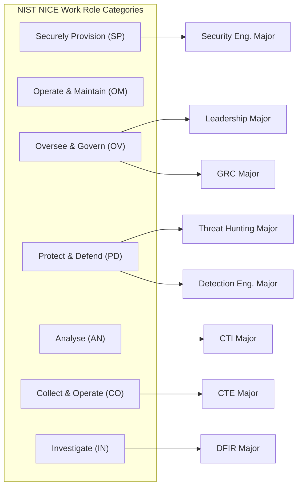
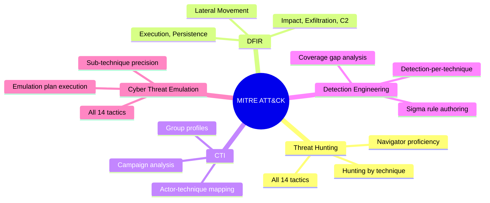
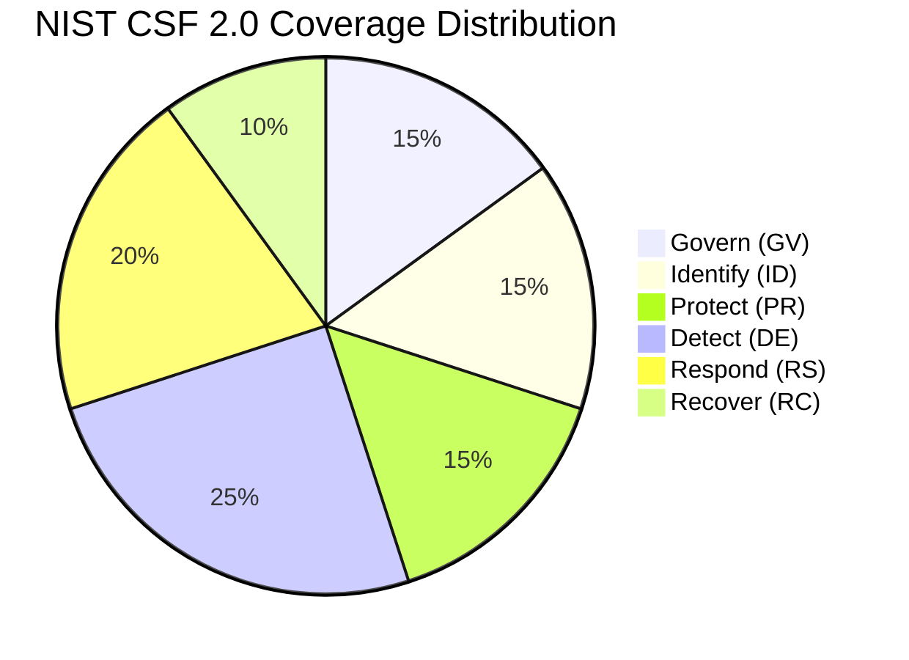

# Framework Alignment Reference

> This document maps every degree component to the industry and education frameworks it addresses. It is the primary reference for demonstrating that this degree produces workforce-ready graduates aligned to recognised standards.

---

## Framework Index

| Framework | Type | Relevance |
|---|---|---|
| **TEQSA / AQF Level 7** | Education standard | Governs the academic rigour and qualification level of all units |
| **NIST NICE / DCWF** | Workforce framework | Maps roles, tasks, knowledge, and skills to cybersecurity work categories |
| **DoD 8140 / DoD 8570** | Workforce framework | US DoD workforce qualification requirements; referenced by AU defence sector |
| **SFIA 9** | Skills framework | Skills Framework for the Information Age — professional skills and levels |
| **CIISec Skills Framework** | Skills framework | Chartered Institute of Information Security — practitioner competencies |
| **ASD Cyber Skills Framework** | Skills framework | Australian Signals Directorate workforce skills framework |
| **MITRE ATT&CK** | Threat framework | Adversary tactics, techniques, and procedures taxonomy |
| **MITRE CTID** | Threat framework | Center for Threat-Informed Defense — emulation and detection methodology |
| **NIST CSF 2.0** | Security framework | NIST Cybersecurity Framework — Govern, Identify, Protect, Detect, Respond, Recover |
| **NIST SP 800 Series** | Technical standards | NIST Special Publications — detailed security guidance |
| **NIST SP 800-61** | Incident response | Computer Security Incident Handling Guide |
| **PICERL** | Incident response | Preparation, Identification, Containment, Eradication, Recovery, Lessons Learned |
| **ISO 27001/27002** | Security standard | International information security management standard |
| **ASD Essential Eight** | Security controls | Australian Government baseline security controls |
| **APRA CPS 234** | Regulatory | Australian Prudential Regulation Authority — information security standard |

---

## NIST NICE / DCWF Mapping

The NIST Workforce Framework for Cybersecurity (NICE) and the DoD Cyber Workforce Framework (DCWF) both use Work Roles composed of Tasks, Knowledge (K), Skills (S), and Abilities (A).

### NICE Work Role to Major Mapping

| NICE Work Role | DCWF Code | Degree Major |
|---|---|---|
| Cyber Defense Analyst | 511 | Detection Engineering, Threat Hunting |
| Cyber Defense Incident Responder | 531 | DFIR |
| Threat/Warning Analyst | 621 | CTI |
| All-Source Analyst | 611 | CTI |
| Vulnerability Assessment Analyst | 541 | CTE |
| Exploitation Analyst | 711 | CTE |
| System Security Analyst | 461 | Security Engineering |
| Security Architect | 652 | Security Engineering |
| Cyber Policy & Strategy Planner | 752 | GRC, Leadership |
| Executive Cyber Leadership | 901 | Leadership |
| Information Systems Security Manager | 722 | GRC, Leadership |

---

## MITRE ATT&CK Coverage by Major

ATT&CK is structured as Tactics → Techniques → Sub-techniques. Each major engages with ATT&CK differently:

### ATT&CK Tactic Coverage by Major

| Tactic | TH | DFIR | CTI | DE | CTE |
|---|---|---|---|---|---|
| Reconnaissance | Partial | | Full | Partial | Full |
| Resource Development | Partial | | Full | Partial | Full |
| Initial Access | Full | Full | Full | Full | Full |
| Execution | Full | Full | Full | Full | Full |
| Persistence | Full | Full | Full | Full | Full |
| Privilege Escalation | Full | Full | Partial | Full | Full |
| Defense Evasion | Full | Full | Full | Full | Full |
| Credential Access | Full | Full | Partial | Full | Full |
| Discovery | Full | Full | Partial | Full | Full |
| Lateral Movement | Full | Full | Full | Full | Full |
| Collection | Partial | Full | Partial | Full | Full |
| C2 | Full | Full | Full | Full | Full |
| Exfiltration | Full | Full | Full | Full | Full |
| Impact | Partial | Full | Full | Full | Full |

---

## NIST CSF 2.0 Function Mapping

NIST CSF 2.0 organises controls into six functions: **Govern, Identify, Protect, Detect, Respond, Recover**.

| CSF 2.0 Function | Primary Coverage | Secondary Coverage |
|---|---|---|
| **GV — Govern** | GRC, Leadership | Security Engineering |
| **ID — Identify** | GRC, Security Engineering | CTI |
| **PR — Protect** | Security Engineering, GRC | Detection Engineering |
| **DE — Detect** | Detection Engineering, Threat Hunting | DFIR |
| **RS — Respond** | DFIR | Threat Hunting, CTI |
| **RC — Recover** | DFIR | GRC, Leadership |

---

## SFIA 9 Skills Mapping

SFIA (Skills Framework for the Information Age) defines 121 skills across 7 responsibility levels (1=Follow to 7=Set strategy).

| SFIA Skill Code | SFIA Skill Name | Degree Major | SFIA Level |
|---|---|---|---|
| INAS | Information Assurance | Threat Hunting, CTI | 3–5 |
| SCAD | Security Administration | Detection Engineering | 3–4 |
| PENT | Penetration Testing | CTE | 4–5 |
| SURE | Systems & Software Assurance | DFIR, Security Engineering | 4–5 |
| ARCH | Solution Architecture | Security Engineering | 5–6 |
| IRMG | Information Risk Management | GRC | 5–6 |
| MANA | Management | Leadership | 6–7 |
| PROG | Programming | Foundation | 3 |
| NTAS | Network Support | Foundation | 3 |
| ITOP | IT Operations | Foundation | 2–3 |
| CNSL | Consultancy | GRC, Leadership | 5–6 |

---

## ASD Cyber Skills Framework

The Australian Signals Directorate Cyber Skills Framework (ASD CSF) defines competencies specific to the Australian context.

> Note: The ASD CSF is aligned with but distinct from the NICE framework. It incorporates Australian legislative and regulatory context.

| ASD CSF Domain | Degree Coverage |
|---|---|
| Cyber Defence | Detection Engineering, Threat Hunting |
| Incident Management | DFIR |
| Threat Intelligence | CTI |
| Offensive Cyber | CTE |
| Security Architecture | Security Engineering |
| Cyber Governance | GRC, Leadership |
| Technical Foundations | Foundation Year |

---

## CIISec Skills Framework

The Chartered Institute of Information Security defines competency areas for information security professionals.

| CIISec Area | Degree Coverage |
|---|---|
| Cyber Operations | Threat Hunting, DFIR, Detection Engineering |
| Threat Intelligence & Investigation | CTI, Threat Hunting |
| Digital Forensics | DFIR |
| Penetration Testing & Red Teaming | CTE |
| Security Architecture | Security Engineering |
| Governance, Risk & Compliance | GRC |
| Security Management | Leadership |

---

## Australian Regulatory Framework Mapping

| Regulation / Standard | Unit Coverage |
|---|---|
| **Privacy Act 1988** | F05, GR04 |
| **Notifiable Data Breaches (NDB) scheme** | F05, DF05, GR04 |
| **Security of Critical Infrastructure Act 2018** | F05, GR04 |
| **APRA CPS 234** | GR04, SC03 |
| **ASD Essential Eight** | F04, DE02, GR03 |
| **Australian Government ISM** | GR03, SE02 |
| **IRAP assessment process** | GR05 |
| **Australian Evidence Act 1995** | DF01 |
| **Cybercrime Act 2001** | F05, CE01 |
| **TIBER-AU** | CE05 |

---

## Certification Alignment

This degree does not replace certifications — it prepares learners to pursue them with a structured foundation. Mapped certifications are recommended, not required.

```mermaid
graph TD
    subgraph ENTRY["Entry-Level Certifications"]
        C1["CompTIA Security+"]
        C2["CompTIA CySA+"]
        C3["BTL1 / BTL2"]
    end

    subgraph MID["Mid-Level Certifications"]
        C4["GIAC GCIH"]
        C5["GIAC GCFE / GCFA"]
        C6["GIAC GCTI"]
        C7["GIAC GDAT"]
        C8["eCIR / eCTHP"]
        C9["OSCP"]
    end

    subgraph SENIOR["Senior Certifications"]
        C10["GIAC GPEN / GRTOP"]
        C11["CISSP"]
        C12["CISM"]
        C13["CRISC"]
        C14["SABSA SCF"]
        C15["ISO 27001 Lead Impl."]
    end

    Foundation --> C1 & C2 & C3
    TH_DFIR["Threat Hunting / DFIR"] --> C4 & C5 & C8
    CTI_DE["CTI / Detection Eng."] --> C6 & C7
    CTE_M["CTE Major"] --> C9 & C10
    GRC_LD["GRC / Leadership"] --> C11 & C12 & C13 & C14 & C15
```

---

## Framework Currency & Maintenance

Industry frameworks are living documents. This repo must track version currency.
The table below is the canonical version reference; every unit's framework
mappings must use these versions until the Framework Custodian updates them.

| Framework | Version used in this repo | Last verified | Review frequency | Currency note |
|---|---|---|---|---|
| NIST CSF | 2.0 (2024) | 2026-06-21 | Major version change | Current. 2.0 introduced the **Govern** function (used in SC03/SC05). |
| NIST NICE | SP 800-181r1 (2020) + 2025 components data | 2026-06-21 | Major version change | NICE now maintains Tasks/Knowledge/Skills as versioned component data — re-verify against the live NICE site. |
| DCWF | 2023 | 2026-06-21 | Annual | DCWF work-role/T-code IDs in unit mappings must be re-confirmed against the current release at Framework Custodian sign-off. |
| SFIA | Version 9 (2023) | 2026-06-21 | Major version change | Current — SFIA 9 is the latest major version. |
| ASD Cyber Skills Framework | 2024 | 2026-06-21 | ASD revision | Used for the ASD CSF mapping in every unit. Re-verify domain/sub-domain labels against the current ASD publication. |
| ASD Essential Eight | November 2023 maturity model | 2026-06-21 | Quarterly ASD review | Confirm against the latest ACSC Essential Eight Maturity Model. |
| MITRE ATT&CK | v16 (2024) — ⚠️ likely superseded | 2026-06-21 | Bi-annual (April, October) | **Action required:** ATT&CK releases ~twice yearly, so a newer version (v17/v18+) is likely current. Raise an audit issue and update affected operational/major units. |
| ISO/IEC 27001 | 2022 edition | 2026-06-21 | Major version change | Current. Paywalled standard — referenced, not reproduced. |
| NIST SP 800-61 | Rev. 2 (with Rev. 3 in progress) | 2026-06-21 | Major version change | OC04 cites 800-61; check whether Rev. 3 has finalised and update if so. |

### Currency Review Log

| Date | Reviewer | Outcome |
|---|---|---|
| 2026-06-21 | _initial structural review_ | Versions reconciled across `docs/frameworks.md` and all 18 core units. Flagged MITRE ATT&CK (v16) as likely superseded and NICE/DCWF T-codes as requiring live re-verification at Framework Custodian sign-off. |

> When a framework releases a new major version, a GitHub Issue should be raised
> (use the **Framework Mapping Error** issue template) to audit and update affected
> units. The Framework Custodian initiates this within 90 days of release per
> [`docs/governance.md`](governance.md) §3. Record each review as a row in the
> log above.
