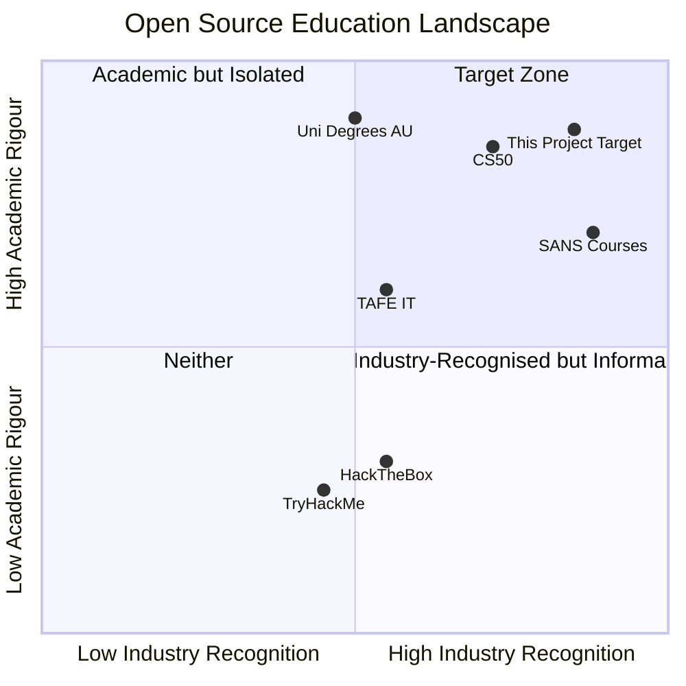
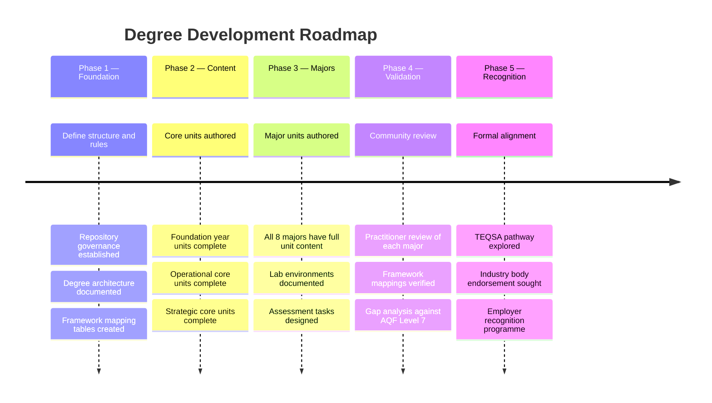

# Goals, Objectives & Success Criteria

---

## Problem Statement

Open-source education has produced some of the most effective learning materials in the world — but it is almost never formally recognised. The result is a systemic gap: a learner can complete thousands of hours of rigorous, industry-relevant cybersecurity training and still be invisible to Australian employers and education systems because no accredited institution has formally assessed them.

This project exists to close that gap.

---

## Primary Goal

> Build a free, open-source cybersecurity degree that is:
> 1. Aligned to Australian tertiary education standards (TEQSA / AQF Level 7)
> 2. Explicitly mapped to the frameworks Australian and international employers use to evaluate practitioners
> 3. Structured around the operational specialisations that exist in the real workforce

---

## Reference Model

**CS50 (Harvard / edX)** is the closest existing model: free to access, academically rigorous, globally respected, and used by employers as a signal of competence. This project follows that model for cybersecurity in an Australian context, with the additional goal of explicit industry framework mapping that CS50 does not provide.

---

## Objectives

### O1 — Educational Rigour
- All units are designed to AQF Level 7 descriptors (knowledge, skills, application of knowledge and skills)
- Learning outcomes are clearly stated, assessable, and graduated in complexity across the degree
- Assessment types include practical (lab-based), analytical (case study), and applied (capstone project)

### O2 — Framework Alignment
- Every unit maps to at least one industry workforce framework
- Framework mappings are explicit, documented, and maintained in [docs/frameworks.md](frameworks.md)
- Alignment covers: NIST NICE/DCWF, DoD 8140, SFIA 9, ASD Cyber Skills Framework, CIISec Skills Framework, MITRE ATT&CK, NIST CSF 2.0, PICERL, NIST SP 800 series

### O3 — Practitioner Relevance
- Content reflects the actual day-to-day work of practitioners in each specialty
- Each major is structured around the tasks, tools, and knowledge areas of real roles in Australia
- Guest contributions from active practitioners are prioritised

### O4 — Australian Context
- Australian legislation is incorporated: Privacy Act 1988, Security of Critical Infrastructure Act 2018, Notifiable Data Breaches scheme
- Australian regulators and bodies referenced: ASD, ACSC, APRA, OAIC, AFP Cybercrime
- Threat landscape context is Australian where possible (ASD Annual Cyber Threat Report)
- APRA CPS 234 covered in GRC major
- ASD Essential Eight covered across multiple majors

### O5 — Openness & Accessibility
- All content licensed CC BY 4.0 — free to use, adapt, and redistribute with attribution
- No paywalls, no required accounts, no proprietary tooling in core units
- Lab environments use free or open-source tools wherever possible
- Content is accessible in Markdown, viewable on GitHub without special software

### O6 — Credential Bridging
- Each major maps to relevant industry certifications so learners can pursue external validation
- Certification mappings are advisory, not prescriptive — the degree stands on its own
- This allows learners to benchmark themselves against industry standards

---

## Success Criteria

| Criterion | Measure |
|---|---|
| Framework Coverage | 100% of units have at least one documented framework mapping |
| Practical Depth | Every major has at least 8 lab-based exercises |
| Australian Context | Australian legislation and regulators covered in every major |
| Accessibility | All content readable on GitHub with no additional tooling |
| Community Validation | Content reviewed by at least one active practitioner per major |
| AQF Alignment | Unit learning outcomes drafted to AQF Level 7 descriptors |

---

## What This Project Is Not

- **Not a registered TEQSA provider** — at this stage. Long-term accreditation is a goal, not a pre-condition for publishing
- **Not a replacement for professional experience** — it is a structured learning pathway to build foundational and intermediate competency
- **Not a certification body** — the project does not issue qualifications; it maps to and supports pathways to external qualifications
- **Not vendor-specific training** — content teaches concepts and frameworks, not vendor products

---

## Long-Term Vision

---

## Governing Principles

These principles govern every decision about content, structure, and community:

1. **Openness first** — if a decision creates a barrier to access, it needs strong justification
2. **Framework-native** — if a learning outcome can't be mapped to a framework, question whether it belongs
3. **Practitioner-authored** — theory is anchored in how real practitioners work
4. **Australian-grounded** — the degree serves Australian learners and the Australian workforce
5. **Quality over speed** — it is better to have fewer, excellent units than many mediocre ones
6. **No gatekeeping** — the degree is for anyone who wants to learn, not just those already in industry
