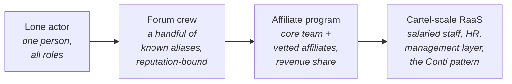
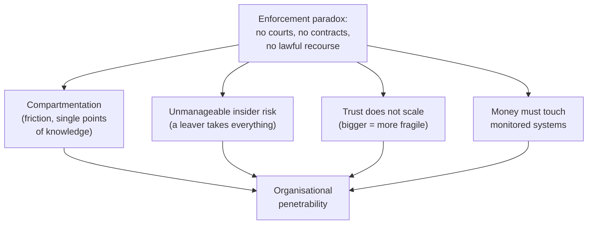
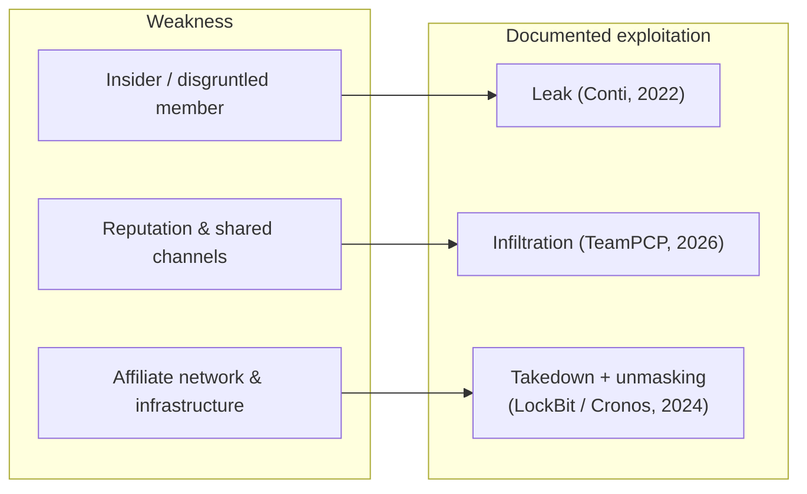

# CCI-01: The Cybercriminal Enterprise

> **Module type:** Extension module (counter-intelligence deep dive) — part of [EXT-CCI](index.md)
> **Status:** Draft
> **Version:** v0.1
> **Last Reviewed:** 2026-09-22
> **Domain Expert:** _Unassigned — required before Practitioner Approved (CTI or law-enforcement cyber background)_
> **Practitioner Reviewer:** _Unassigned — required before Practitioner Approved (adversary attribution, financial-crime intelligence, or government cyber programme experience)_

!!! warning "Not a credit-bearing unit"
    CCI-01 is the first module of the [EXT-CCI series](index.md), an optional extension that sits outside the 66-unit / 160 CP degree structure. It carries **0 CP** and does not appear in [`docs/ksat-coverage.md`](../../ksat-coverage.md) or the [Program Builder](../../program-builder/index.md), both of which are generated from credit-bearing units only. A delivery partner wanting to recognise it should use the Tier 1 badge mechanism in [`docs/curriculum/micro-credentials-framework.md`](../../curriculum/micro-credentials-framework.md).

!!! danger "Read the series ground rules first"
    This module is bound by the [series index](index.md) danger box. In one line each: it is **analysis of publicly documented adversaries, not a manual**; it contains **no operational tradecraft** (nothing that would help anyone recruit for, resource, or join a criminal enterprise — mechanisms appear only at the level an investigator or defender needs to *recognise* them); **legitimate security businesses, researchers and conferences are never presented as criminals** (they belong to the lawful dual-use economy studied in CCI-06); and **named individuals appear only where a government has publicly charged, sanctioned, or formally attributed them**, and are described as *alleged* / *attributed* — an indictment or a sanction is an allegation or an executive finding, not a court's verdict of guilt.

---

## Overview

A graduate who has finished [CT02](../../../degrees/operational/cti/CT02-threat-actor-research-profiling.md) can profile a threat actor: name its aliases, list its techniques, and place it on a diamond model. What that profiling usually does *not* do is treat the actor as an **organisation** — an entity with a division of labour, a hiring problem, a payroll, an internal-trust problem, and a management layer that cannot call the police when an employee steals from it. That organisational and economic view is the counter-intelligence analyst's view, and it is a different discipline from technique tracking.

This module teaches the cybercriminal group **as an enterprise**, reconstructed the way a counter-intelligence analyst reconstructs a target: from the public record — government indictments and sanctions, court filings, takedown announcements, blockchain-analysis reporting, and the occasional internal leak. It covers the spectrum of organisational forms from the lone actor to the cartel-scale ransomware-as-a-service (RaaS) operation; the roles and division of labour inside a mature operation; how such groups recruit and vet, *as reported*; how they resource themselves and try to run internal operational security; and — the point of the whole module — **where an illegal organisation is structurally penetrable**, and how law-enforcement and intelligence services have exploited exactly those weaknesses in cases that are now a matter of public record.

The unifying idea is a paradox the module returns to repeatedly: a criminal enterprise has the coordination problems of any firm — trust, contracts, insiders, disgruntled staff, key-person risk — but it **cannot use any legitimate institution to solve them**. It cannot enforce a contract in court, cannot sue a partner who absconds with the proceeds, cannot run a lawful background check, and cannot rely on the state to protect it from its own members. That is the fault line the discipline of counter-intelligence works along.

It deliberately does **not** re-teach attribution method (that is [CT02](../../../degrees/operational/cti/CT02-threat-actor-research-profiling.md) Topic 4 and [CT01](../../../degrees/operational/cti/CT01-intelligence-tradecraft.md)), the cybercrime ecosystem as vocabulary ([F04](../../../core/units/F04-security-concepts.md)), or the mechanics of criminal finance and laundering (that is CCI-02, later in this series). It stops at the boundary of the **organisation**: how a crime group is *built and run*, and how that construction gives investigators their openings.

---

## Where this module fits

| Unit / module | Relationship |
|---|---|
| [F04 — Security Concepts](../../../core/units/F04-security-concepts.md) | Introduces the cybercriminal ecosystem as vocabulary; CCI-01 takes the "organised criminal group" from a term to a structure read off the public record. |
| [CT01 — Intelligence Tradecraft](../../../degrees/operational/cti/CT01-intelligence-tradecraft.md) | Provides the collection-and-analysis discipline (sourcing, confidence, bias) this module applies to organisational reconstruction. |
| [CT02 — Threat Actor Research & Profiling](../../../degrees/operational/cti/CT02-threat-actor-research-profiling.md) | **Direct predecessor.** Topic 7 profiles the financially motivated organisation as an intelligence target; CCI-01 goes to enterprise design and organisational penetrability. |
| [CT04 — Strategic Intelligence](../../../degrees/operational/cti/CT04-strategic-intelligence.md) | The strategic lens; CCI-01 adds the counter-intelligence framing (penetration, insider risk, disruption). |
| [OC05 — Threat Intelligence Fundamentals](../../../core/units/OC05-threat-intelligence-fundamentals.md) | Operational-core grounding this module assumes. |
| CCI-02 — The Criminal Economy: Financing, Laundering & Cash-Out (later in this series) | **Successor.** Takes the revenue and money-movement side that CCI-01 only points at into blockchain-analysis depth. |
| CCI-03 — The Service Economy (later in this series) | RaaS, initial-access broking and other criminal services *as an industry*; CCI-01 establishes the affiliate-program form those services sit inside. |
| CCI-05 — Case Studies; CCI-06 — Counter-Intelligence Practice & the Dual-Use Economy (later in this series) | CCI-05 works the cases at length; CCI-06 treats the CI discipline in full and draws the lawful/criminal boundary. Neither file exists yet, so this module names them without linking. |

---

## Prerequisites

- **[CT02 — Threat Actor Research & Profiling](../../../degrees/operational/cti/CT02-threat-actor-research-profiling.md)** (strongly recommended; Topic 7 in particular)
- **[F04 — Security Concepts](../../../core/units/F04-security-concepts.md)** and **[OC05 — Threat Intelligence Fundamentals](../../../core/units/OC05-threat-intelligence-fundamentals.md)** (recommended: the ecosystem vocabulary and the intelligence cycle)
- **[CT01 — Intelligence Tradecraft](../../../degrees/operational/cti/CT01-intelligence-tradecraft.md)** (recommended: source evaluation and analytic confidence, used in both exercises)

No tooling is required. Every source used in this module and its exercises is a public web page: a government press release, a court filing, a regulator's site, or published research.

---

## Learning outcomes

On completion, a learner can:

1. **Distinguish** the principal organisational forms of a cybercriminal enterprise — lone actor, forum crew, affiliate program, and cartel-scale RaaS operation — and place a named, publicly documented group on that spectrum with justification.
2. **Reconstruct**, from named public records (an indictment, a sanctions designation, or a documented leak), the division of labour and role structure of a criminal operation, and represent it as an org chart with a stated confidence level per node.
3. **Explain** how such groups recruit, vet and resource themselves *as described in public reporting*, at the level required to recognise the pattern — without reproducing any operational detail.
4. **Analyse** the internal-trust, compartmentation and insider-risk problems intrinsic to an organisation that cannot use the legal system to enforce its arrangements, and identify where a specific named group is organisationally penetrable.
5. **Evaluate** how law-enforcement and intelligence services have exploited those organisational weaknesses in documented cases (leaks, informants, infiltration, takedowns, arrests), and assess the durability of a given disruption.
6. **Apply** the correct Australian legal and regulatory framing — the *Autonomous Sanctions Act 2011* cyber listings, the *Cyber Security Act 2024* reporting duty, and the roles of ASD/ACSC, the AFP and AUSTRAC — to a documented case, stating precisely what the public record supports and what it does not.

> Bloom's 4–6 (Analyse / Evaluate / Create). LO2 reaches Create because the org chart is *built* from primary documents, not described. This alignment statement is notional: CCI-01 is not credit-bearing and has not been through the AQF mapping process in [`docs/compliance/aqf-teqsa.md`](../../compliance/aqf-teqsa.md).

---

## Framework orientation

!!! note "Mappings are deferred to the Framework Custodian — no codes are asserted here"
    Consistent with the [series index](index.md), this extension module does not feed [ksat-coverage](../../ksat-coverage.md), and its framework mapping is **provisional pending Framework Custodian review**. To avoid asserting an identifier this author has not verified against a current release, the roles and skills below are named at the level this module confidently supports; the specific work-role codes, task IDs, SFIA skill codes and levels, and project-local KSAT IDs are **left to be assigned and verified**, not printed as fact. See the verification-status table.

    - **NIST Workforce Framework for Cybersecurity (NICE) — role families this module speaks to:** All-Source Analyst; Threat/Warning Analyst; Cyber Intelligence Planner; Cyber Crime Investigator. (Work-role and task codes: **to be assigned by the Framework Custodian.**)
    - **SFIA — skill families:** Threat intelligence; Information security. (Skill codes and proficiency levels: **to be assigned.**)
    - **ASD Cyber Skills Framework:** the Cyber Intelligence domain. (Sub-domain and proficiency: **to be assigned.**)
    - **MITRE ATT&CK:** ATT&CK describes *behaviours*, not organisational structure, and is therefore only lightly relevant here; where a technique is mentioned it is for recognition, and the framework version and technique IDs are a CT-series concern, flagged provisional in this project.

---

## Module structure

| Part | Topics | Exercises | Notional hours |
|---|---|---|---|
| A — The counter-intelligence lens | 1 | — | 1.5 |
| B — Organisational form and the division of labour | 2–3 | Exercise 1 | 4 |
| C — Recruitment, vetting and resourcing (recognition level) | 4–5 | — | 2.5 |
| D — Penetrability and disruption | 6–7 | Exercise 2 | 3 |
| E — Australian context and consolidation | — | — | 1 |
| | | | **12 hours** |

---

## Topics

### Topic 1: The Counter-Intelligence Lens — the Adversary as an Organisation

Most cyber teaching answers the question *what did they do?* Counter-intelligence asks a different set: *how is this thing built, who runs it, who could be turned, and where would it break if pushed?* The shift is from the attack to the **attacker as an institution**, and it changes what counts as evidence. A malware sample tells you about a capability; a leaked payroll spreadsheet, an unsealed indictment, or a plea agreement tells you about an *organisation* — its size, its hierarchy, its money, and its fault lines.

Three ideas frame the rest of the module.

**A criminal group is a firm with a coordination problem.** Any operation large enough to specialise faces the same problems a legitimate business faces: it must divide labour, hire and pay people, keep them productive, protect its assets, and manage the people who could hurt it. Economists call these transaction-cost and principal–agent problems. A crime group has all of them and one extra constraint, in Topic 5.

**The public record is a rich organisational source.** Governments, when they charge or sanction, publish. An OFAC designation names roles and relationships; a DOJ indictment lays out a conspiracy's structure to meet the legal elements of the charge; a takedown press release describes infrastructure and headcount; a court's statement of facts at sentencing is sworn. Read as organisational intelligence rather than as legal outcome, these documents are a counter-intelligence gift — with the caveat that they are written to win a case, not to draw an org chart, and must be read with that bias in mind ([CT01](../../../degrees/operational/cti/CT01-intelligence-tradecraft.md)).

**Attribution is a claim with a confidence and a caveat.** This module inherits the [CT02](../../../degrees/operational/cti/CT02-threat-actor-research-profiling.md) discipline: an indictment is an *allegation*; a sanction is an executive *finding*; a conviction is a court's *verdict*. The analyst records which of these a statement is, and never launders an allegation into a fact.

**Key concepts:** the organisational (not technique) view; public records as organisational intelligence; the bias in a document written to prosecute; allegation vs finding vs verdict.

---

### Topic 2: Organisational Forms Across the Spectrum

Cybercriminal enterprises are not one shape. They occupy a spectrum from the individual to the multinational, and where a group sits determines how it can be attacked. The four reference points below are drawn from publicly documented examples.

**Lone actor.** One person performs every function. Small, low-overhead, hard to infiltrate (there is no one else in the room), but with a single point of failure: the person. Their weakness is usually their own operational security over time — reused handles, credentials, or a cash-out that touches the regulated financial system.

**Forum crew.** A small number of individuals, known to each other by alias, cooperating on a marketplace or forum. Trust is enforced by **reputation** rather than contract (Topic 4). The alleged **TeamPCP** matter is instructive here: reporting around the August 2026 arrests described it not as a hierarchical firm but as **a peer community of individually skilled actors** drawn from several groups — a network, not a corporation. That form is resilient to a single arrest but exposed through its shared communication channels.

**Affiliate program.** A **core team** builds and maintains a product (most visibly ransomware) and recruits vetted **affiliates** who conduct the intrusions in exchange for a share of the proceeds. This is the RaaS model, and its economics are visible in the public record. When the U.S. Department of Justice seized 63.7 of the 75 bitcoin that Colonial Pipeline paid to the **DarkSide** group in 2021, it stated that the seized portion — about 85% — corresponded to the share going to the *affiliate* who carried out the attack, with roughly 15% going to DarkSide's *developers*. That single filing exposes the revenue-split architecture of the whole business model, which is why it anchors Exercise 1.

**Cartel-scale RaaS operation.** At the top of the spectrum, an operation is run like a company. The **Conti** internal materials leaked in early 2022 (widely reported by Check Point Research, Krebs on Security and others) are the canonical public example: reporting on the leak described an organisation with an **HR function, a hiring pipeline, salaried staff, bonuses, performance reviews, an "employee of the month," and a management hierarchy**, with reported average monthly salaries in the low thousands of US dollars and total monthly running costs (salaries, servers, infrastructure) in the six figures. Whether one calls this a gang or a mid-sized software company is precisely the point of the module.

**Key concepts:** the four reference forms; reputation-bound vs contract-like vs salaried coordination; why organisational form determines the mode of attack (arrest a person, seize a channel, turn an affiliate, or leak a payroll).

---

### Topic 3: Roles and the Division of Labour

Once an operation specialises, recognisable roles appear. The list below is a **synthesis of what public reporting on multiple groups describes**; not every group has every role, and titles vary. It is a recognition aid for reading an org chart out of a document, not a staffing plan.

| Role (as reported) | What the public record associates with it | Where it shows up in sources |
|---|---|---|
| **Management / leadership** | Direction, dispute resolution, deciding targets and splits; the "boss" node | Conti leak reporting (a top figure using the alias "Stern"); indictment "leaders and organisers" language |
| **Developers / coders** | Build and maintain the malware, the panel, the encryptor | Conti leak (dedicated coder teams); RaaS developer share in the DarkSide seizure |
| **Operators / affiliates** | Conduct intrusions and deployment; in RaaS, external partners on a revenue share | DarkSide affiliate share (DOJ); LockBit affiliate "builds" |
| **Access providers** | Sell or supply the initial foothold into a victim (a full CCI-03 subject) | Referenced across ransomware indictments; treated in CCI-03 |
| **Negotiators** | Handle victim communication and extortion; sometimes on commission | Conti leak reporting (negotiation staff, commission on paid ransoms) |
| **Testers / QA / reverse engineers** | Check that the malware evades detection before use | Conti leak (testers, reverse engineers, "crypters") |
| **Sysadmins / infrastructure** | Run servers, proxies, hosting; keep the operation online | Conti leak (sysadmins); Operation Cronos seized 34 servers |
| **Money laundering / cash-out** | Move and clean proceeds (a full CCI-02 subject) | Named in most sanctions packages; treated in CCI-02 |
| **HR / recruitment** | Hire, onboard, pay, run referral schemes | Conti leak reporting (an HR function and referral bonuses) |

Two analytical points matter more than the list itself. First, **specialisation is a signal of scale and of penetrability**: the more roles a group has, the more people who can be identified, turned, or arrested, and the more internal seams along which trust can fail. Second, **the roles are often filled by outsiders on contract** (affiliates, access providers, launderers), which means a "group" is frequently a *network of independent contractors* around a small core — a structure that is efficient but that multiplies the number of relationships an investigator can exploit.

**Key concepts:** the recurring role taxonomy; core team vs contracted network; specialisation as both a capability and an exposure.

---

### Topic 4: Recruitment and Vetting, as Reported

!!! warning "Recognition level only"
    This topic describes recruitment and vetting **only** as public reporting documents them, so that an investigator or defender can recognise the pattern. It names no channels, provides no access, and gives nothing that would help anyone recruit for or join such a group. That boundary is a series rule, not a stylistic choice.

Public reporting describes three broad, overlapping mechanisms by which these organisations bring in people:

- **Reputation systems.** On criminal forums and marketplaces, standing is accumulated over time — through vouches, transaction history, and demonstrated reliability — and functions as the substitute for a legal contract. A newcomer with no history is trusted with little; a long-standing alias with a good reputation is trusted with more. This is why reputation is simultaneously the group's trust mechanism and its biggest exposure: it ties a persona to a durable, observable history that an analyst can study and that an infiltrator can, over time, earn.
- **Referrals.** Reporting on the Conti leak described a **referral scheme**, including a bonus for a referred worker who stayed past an initial period — the same retention mechanism a legitimate firm uses. Referral-based hiring narrows the field to known contacts, which is good for trust but bad for compartmentation: it builds a social graph that, once one node is identified, can be walked outward.
- **The affiliate-application model.** RaaS operations vet prospective affiliates before granting access to the product, favouring applicants who can demonstrate prior results. The vetting is designed to keep out researchers and law enforcement — which tells you exactly what the operators fear, and therefore where the pressure is applied against them.

The counter-intelligence reading is the important one: **every vetting mechanism a criminal group uses is also a description of its threat model.** Reputation, referral and application vetting all exist to solve the same problem — *I cannot run a background check and I cannot sue you if you betray me* — and each leaves a trace (a history, a social graph, an application) that the other side can use.

**Key concepts:** reputation as a contract substitute; referral hiring and its social-graph exposure; affiliate vetting as an inadvertent statement of the group's fears.

---

### Topic 5: Resourcing and Internal OPSEC — the Enforcement Paradox

An enterprise needs resources — money, infrastructure, tooling, people — and it needs to protect them. A criminal enterprise must do all of this while operating under a constraint no legitimate firm faces, and that constraint is the heart of the module.

**The enforcement paradox.** A criminal organisation **cannot use the legal system to enforce its own arrangements.** It cannot sue an affiliate who takes the malware and disappears, cannot enforce a non-compete, cannot recover money from a launderer who keeps it, and cannot call the police when an insider steals or an associate turns violent. Everything a lawful business outsources to courts and contracts, a criminal business must solve with **reputation, escrow-like intermediaries, compartmentation, and the threat of retaliation** — all of which are weaker, costlier, and more exposed than a contract. This is the single most important structural fact about these organisations, and it is what makes them penetrable.

From the paradox flow the group's internal-security behaviours, all visible in the public record:

- **Compartmentation.** Members know only what they need to; roles are siloed; real identities are hidden behind aliases even internally. This limits the damage any one arrest can do — but it also creates friction, mistrust, and single points of knowledge.
- **Insider risk is existential and unmanageable.** A disgruntled member cannot be disciplined through lawful means, but *can* walk out with everything. The Conti leak itself is the archetype: reporting attributes it to an insider aligned with Ukraine who, after the 2022 invasion, published the group's chats and files. The organisation had no recourse. Later, in 2025, German federal police (the BKA) announced they had identified the Conti/TrickBot figure known as "Stern" as an alleged Russian national and obtained an Interpol Red Notice — an identification that the 2022 chat leak and subsequent takedowns helped make possible.
- **Trust does not scale.** The larger and more corporate the operation, the more people must be trusted, paid on time, and kept happy — and the more catastrophic a single betrayal becomes. Cartel-scale is efficient at generating revenue and fragile at protecting secrets.
- **The regulated financial system is the choke point.** Resourcing ultimately requires converting crypto proceeds to usable value, which repeatedly forces the organisation to touch systems that are monitored, sanctioned, and analysable (the CCI-02 subject). The DarkSide seizure — where the FBI recovered most of a paid ransom — is a public demonstration that "the money" is a weakness, not a strength.

**Key concepts:** the enforcement paradox as the master constraint; compartmentation's costs as well as benefits; insider risk that cannot be managed lawfully; trust that degrades with scale; the financial system as the durable choke point.

---

### Topic 6: Where These Organisations Are Penetrable — and How That Is Exploited

The organisational weaknesses in Topic 5 are not theoretical. The public record contains clear, attributable examples of each being turned into a disruption. This topic reads three of them as counter-intelligence outcomes.

**Leaks and insiders — Conti (2022).** The internal Conti materials became public because an insider chose to release them, and the organisation could do nothing about it. For defenders and researchers the leak was a windfall of organisational intelligence; for the group it was terminal, contributing to its rebrand and fragmentation. The lesson is that an organisation which cannot manage a disgruntled member cannot protect its secrets, however good its external tradecraft.

**Infiltration — TeamPCP (2026).** In September 2026, Google's Threat Intelligence Group (Mandiant) publicly disclosed that one of its analysts had, since about March 2026, been embedded undercover inside an internal TeamPCP communications channel. Google reported that the vantage let it warn targeted organisations, revoke stolen credentials to blunt attacks, and help patch a zero-day, and that the insight assisted the law-enforcement effort that led to the Australian arrests (below). This is a textbook exploitation of a reputation-and-channel-based crew: because trust was earned through participation rather than verified identity, a lawful analyst could earn a place inside. **Google, its Threat Intelligence Group and Mandiant are lawful actors here — the infiltrator, not the infiltrated** — and appear in this module only in that role.

**Takedown and unmasking — LockBit / Operation Cronos (2024).** On 20 February 2024, a task force led by the UK National Crime Agency and the FBI, with Europol and partners including Australia, seized control of LockBit's infrastructure (reported as 34 servers across multiple countries, including Australia), obtained more than 1,000 decryption keys, and — pointedly — repurposed LockBit's own leak site to publish the operation's findings and, later, to unmask the alleged leader "LockBitSupp." In May 2024 the US, UK and Australia jointly sanctioned and the DOJ indicted an alleged Russian national as that leader. The operation attacked the group at three organisational seams at once: its infrastructure (sysadmin function), its affiliates (arrests and indictments), and its leader's carefully guarded anonymity (a direct blow to the reputation on which the whole affiliate program depended).

A closing caution for the analyst: **disruption is not the same as elimination.** LockBit attempted to rebuild after Cronos; Conti's people reappeared under other brands. Assessing the *durability* of a disruption — did it remove capability, or only inconvenience it? — is part of Exercise 2.

**Key concepts:** leak, infiltration and takedown as the three documented exploitation modes; attacking multiple organisational seams at once; the lawful actor as infiltrator; disruption vs elimination.

---

### Topic 7: Reading Organisational Structure Off the Public Record

The skill this module builds is turning documents into an organisational picture with honest confidence. A short method:

1. **Inventory the sources and label each.** For every claim, record whether it comes from an *indictment* (allegation), a *sanctions designation* (executive finding), a *court statement of facts / plea* (sworn), a *takedown press release* (agency claim), a *leak* (unverified primary material, possibly manipulated), or *research reporting* (secondary analysis). The label sets the ceiling on your confidence.
2. **Extract entities and relationships, not adjectives.** Who is alleged to have done what, for whom, and in exchange for what? Split percentages, salaries, referral bonuses and role titles are the gold; rhetoric is not.
3. **Build the chart with per-node confidence.** Draw the organisation, and mark each node and edge with a confidence (e.g. high/moderate/low) tied to its source label. A node asserted only by a single leak is not the same as one named in a sworn plea.
4. **State the bias.** An indictment is written to establish a conspiracy; it may overstate coordination and understate the messiness of a loose network. A leak may be curated by the leaker. Name the distortion your sources push toward.
5. **Record what you cannot see.** Roles that must exist but are unnamed, money you cannot trace, members behind aliases you cannot resolve. The gaps are findings.

This is the [CT01](../../../degrees/operational/cti/CT01-intelligence-tradecraft.md) analytic discipline applied to organisational reconstruction, and it is exactly what both exercises assess.

**Key concepts:** source labelling and confidence ceilings; entities-and-relationships extraction; per-node confidence on the chart; naming source bias; treating gaps as findings.

---

## Exercises

Both exercises are **intelligence-analysis tasks over public reporting**. There is no lab, no tooling, and nothing operational. Each is completable from freely available web sources; the further-reading list is a starting point, not a limit.

!!! warning "Sourcing and conduct"
    Use only lawful, public sources: government sites, court records, regulator pages, and reputable reporting and research. Do **not** attempt to access criminal forums, marketplaces, leak sites or any criminal infrastructure — it is unnecessary for the exercise, may be unlawful, and is outside the authorisation of this module. Treat every named individual as **alleged** and cite the record that names them.

### Exercise 1 (Analytical): Reconstruct a RaaS Operation from the Public Record

**Objective:** Build a defensible org chart and a revenue-flow diagram for a ransomware-as-a-service operation, using only named public documents, with a confidence level on every element.

**Prerequisites:** Topics 2, 3, 7.

**Task:**

1. Choose **one** documented RaaS operation with a substantial public record — for example **LockBit** (Operation Cronos materials plus the 2024 US/UK/Australia sanctions and DOJ indictment), **DarkSide** (the 2021 DOJ Colonial Pipeline seizure filing), or **Conti** (the 2022 leak reporting plus the 2025 BKA identification of "Stern").
2. Assemble a source inventory of at least five items and label each by type (indictment, designation, plea/statement of facts, takedown release, leak, research), per Topic 7.
3. Draw the **org chart**: management, developers, operators/affiliates, negotiators, sysadmins, launderers, HR — including only roles your sources support. Mark each node with a confidence and cite the source.
4. Draw the **revenue-flow diagram**: how value moves from victim to the parties. If you chose DarkSide, reconstruct the affiliate/developer split from the DOJ seizure (the ~85% affiliate / ~15% developer division of the 63.7 seized of 75 paid bitcoin). If you chose another group, reconstruct whatever split, salary or commission structure the record supports.
5. Write a half-page **bias-and-gaps note**: which way your dominant source distorts the picture (Topic 7 step 4), and the three most important things you *cannot* see.

**Expected output:** the labelled source inventory; the org chart with per-node confidence and citations; the revenue-flow diagram; the bias-and-gaps note. Marked on discipline — every element traceable to a labelled source and honestly rated — not on how full the chart is.

**Reflection:**

1. Which role in your chart rests on the weakest source, and how would you raise your confidence in it without touching any criminal infrastructure?
2. Where did your chosen document's purpose (to prosecute, to sanction, to leak) most distort the organisational picture?
3. If this operation lost its single highest-confidence node tomorrow, would the organisation survive? What does that tell you about attacking it?

### Exercise 2 (Analytical): Penetrability Assessment of a Named Group

**Objective:** Produce a counter-intelligence assessment of where a named, government-attributed group is organisationally penetrable, and judge the durability of a real disruption against it.

**Prerequisites:** Topics 5, 6, 7.

**Task:**

1. Choose **one** group with a documented disruption: **TeamPCP** (the Google/Mandiant infiltration disclosed September 2026 and the August 2026 Australian arrests), **LockBit** (Operation Cronos, February 2024, and the May 2024 unmasking), or **Evil Corp** (the 2019 and 2024 US/UK/Australia sanctions, and the 2024 revelation that a senior member was also a LockBit affiliate).
2. Map the group to the Topic 2 spectrum and justify the placement from sources.
3. Using the Topic 5 weakness set (insider risk, compartmentation limits, trust-at-scale, the financial choke point), write a **penetrability assessment**: for each weakness, state whether the public record shows it present in this group, and rate it.
4. Describe the **actual documented exploitation** (leak / infiltration / takedown / unmasking / arrest) and map it onto the weakness it exploited.
5. Deliver a **durability judgement** with an explicit confidence level: did the disruption remove capability or only inconvenience the group? Cite the evidence (e.g. rebuild attempts, continued activity, arrests vs mere sanctions) and state what would change your assessment.

**Expected output:** the spectrum placement with justification; the per-weakness penetrability assessment with ratings; the exploitation-to-weakness mapping; the durability judgement with confidence and citations. Marked on analytic rigour and honest uncertainty, using the [CT01](../../../degrees/operational/cti/CT01-intelligence-tradecraft.md) discipline.

**Reflection:**

1. A sanction names and freezes; an arrest removes a person; an infiltration watches and warns. Which most reduced *your* group's capability, and why?
2. Your group cannot enforce contracts in court. Where in your assessment did that constraint most create the opening that was exploited?
3. What is the single thing this group could change to become materially harder to penetrate — and why is it costly for a criminal enterprise to do it?

---

## Australian context

Australia has moved from commentary to action against these organisations, and the instruments are specific.

**Autonomous cyber sanctions (Autonomous Sanctions Act 2011).** In January 2024 the Australian Government used its autonomous **cyber**-sanctions power for the first time, listing a Russian national in connection with the 2022 Medibank Private breach (the compromise of the personal information of about 9.7 million people), in a coordinated action with the United States and the United Kingdom. The listing makes it a criminal offence to deal with the person's assets or provide assets to them — a measure aimed squarely at the *financial* and *reputational* seams of a criminal enterprise. Australia (through DFAT) has since joined further coordinated designations: the alleged LockBit leader in May 2024, and, in October 2024, members of **Evil Corp** — including an individual the UK NCA identified as both a senior Evil Corp figure and a LockBit affiliate, a publicly documented crossover between two supposedly separate organisations that is itself an organisational-intelligence finding. Every one of these listings should be treated as an executive **finding**, and every named person as **alleged**, per due process; and, because sanction status can change, all are flagged for re-verification at delivery.

**The TeamPCP arrests (August 2026).** The Australian Federal Police, working with the Western Australia Police Force and the FBI, arrested two men in Perth in late August 2026 over their alleged roles in **TeamPCP** and its self-propagating "Shai-Hulud" supply-chain worm, which public reporting linked to the theft of large volumes of credentials from over a thousand organisations. The two were charged with a combined 14 offences and appeared in the Perth Magistrates Court. The matter is **before the courts**: the accused are alleged offenders and are entitled to the presumption of innocence, and nothing in this module should be read as asserting guilt. As a case study it is valuable precisely because it braids together the module's themes — a loose peer-network form (Topic 2), infiltration of a shared channel by a lawful analyst (Topic 6), and international law-enforcement coordination culminating in an Australian arrest.

**The Cyber Security Act 2024 reporting duty.** Australia's *Cyber Security Act 2024* introduced a mandatory **ransomware-payment reporting** obligation, which commenced on 30 May 2025. Reporting entities — broadly, businesses carrying on in Australia above a turnover threshold set in the rules (reported as A$3 million), plus responsible entities for critical-infrastructure assets regardless of turnover — must report a ransomware or cyber-extortion payment to the Australian Signals Directorate within 72 hours. The duty is an organisational-intelligence instrument as much as a compliance one: it converts private payments into a national dataset on who is being extorted and for how much. (Threshold, scope and penalty figures are drawn from the implementing rules and reputable legal summaries and are flagged for verification against the current instrument.)

**The agencies.** ASD/ACSC produces the threat reporting and co-sealed international advisories the analyst relies on; the **AFP** investigates and arrests; **AUSTRAC** is the financial-intelligence regulator whose data underpins the "follow the money" work that CCI-02 treats in depth; and DFAT administers the sanctions lists. Legal authority for teaching from this material rests on it already being public; this module directs no one to any criminal infrastructure.

---

## Verification status

This module has **not** had practitioner review (R2). It must not be presented to learners as verified content until a Domain Expert and Practitioner Reviewer have signed off. The items below are the specific things to confirm.

| Item | Status | Action required |
|---|---|---|
| Legal status of every named individual (Kovalev/"Stern", Khoroshev/"LockBitSupp", Vasinskyi/"Rabotnik", Yakubets, Turashev, Ryzhenkov/"Beverley", Ermakov, and the two TeamPCP accused) | **Must be re-verified at delivery** | Charges are dropped, convictions entered, sanctions lifted, and cases resolve over time. Re-confirm each against the primary record and keep the *alleged/attributed/convicted* wording exact |
| Attribution wording matches the attributing government's expressed confidence | **Provisional** | Do not upgrade an allegation (indictment) or an executive finding (sanction) to a verdict; check each verb against the source |
| Conti internal-structure details (HR, salaries, "employee of the month", referral bonus, monthly running costs, "Stern" as top alias) | **Reported, not independently verified** | Sourced to reporting on the 2022 leak (Check Point, Krebs, others). Leaked material may be partial or curated; present as "as reported" |
| BKA 2025 identification of "Stern" as a named individual | **Allegation / Red Notice** | German charge and Interpol Red Notice as reported; not a conviction. Re-verify status |
| DarkSide / Colonial Pipeline figures (75 BTC paid, 63.7 seized ≈ US$2.3m, ~85/15 affiliate/developer split) | **Verified against DOJ (June 2021) as reported** | Confirm against the DOJ press release / seizure warrant at delivery |
| Operation Cronos facts (20 Feb 2024; ~34 servers incl. Australia; 1,000+ decryption keys; site repurposed) | **Verified against NCA/partners as reported** | Confirm against the NCA announcement |
| TeamPCP: Google/Mandiant infiltration; the exact internal channel name; "Shai-Hulud" worm; credential/organisation counts; arrest date; 14 charges; court | **Reported; some specifics inconsistent across outlets** | The **internal channel name** is reported inconsistently across sources and is deliberately not stated here — verify before naming. Confirm counts, dates and charges against the AFP/court record |
| Ermakov / Medibank as Australia's *first* autonomous cyber-sanction listing (Jan 2024) | **Verified against ASD/DFAT/Minister releases as reported** | Confirm "first use" wording against the official releases |
| Ryzhenkov identified as senior Evil Corp figure **and** LockBit affiliate (Oct 2024) | **Reported (NCA)** | Confirm against the NCA statement; treat as attribution, not verdict |
| Cyber Security Act 2024 ransomware-payment reporting: 30 May 2025 commencement; A$3m turnover threshold; critical-infrastructure scope; 72-hour report to ASD | **Provisional** | Verify threshold, scope and timeframe against the Act and the Cyber Security (Ransomware Payment Reporting) Rules at delivery |
| Framework mapping (NICE work-role and task codes; SFIA skill codes and levels; ASD CSF sub-domain; project-local KSAT IDs) | **Deferred — not asserted** | Assign and verify with the Framework Custodian; this module intentionally prints no codes |
| MITRE ATT&CK relevance | **Out of scope here** | Structure, not behaviour, is this module's subject; ATT&CK version/technique IDs remain a project-wide provisional item in the CT series |
| Lawful/criminal boundary (no legitimate firm, researcher or conference named as criminal; Google/Mandiant framed only as the lawful disruptor) | **Blocking** | Requires the reviewer's explicit sign-off before publication |

---

## Further reading

Real, citable starting points. All are public; treat government pages as primary and reporting/research as reputable secondary. Australian sources are marked.

**U.S. Department of Justice (June 2021).** *Department of Justice Seizes $2.3 Million in Cryptocurrency Paid to the Ransomware Extortionists Darkside.* justice.gov.
> Relevance: The primary document behind the DarkSide affiliate/developer split used in Exercise 1.

**U.S. Department of the Treasury / OFAC (Dec 2019; Oct 2024).** Evil Corp designations. home.treasury.gov.
> Relevance: Executive findings naming Evil Corp roles and relationships; the 2024 package is the basis for the Evil Corp option in Exercise 2.

**National Crime Agency (UK) (Feb 2024; May 2024; Oct 2024).** *Operation Cronos* takedown; *LockBit leader unmasked and sanctioned*; Evil Corp / LockBit-affiliate identification. nationalcrimeagency.gov.uk.
> Relevance: The takedown, unmasking and cross-membership record for the LockBit and Evil Corp options.

**U.S. Department of Justice (2021–2024).** REvil/Sodinokibi indictments and the sentencing of Yaroslav Vasinskyi ("Rabotnik"). justice.gov.
> Relevance: An affiliate's journey from indictment to conviction — the clearest public arc of an individual within a RaaS operation.

**Krebs on Security (2022).** *Conti Ransomware Group Diaries* (multi-part, incl. "Part II: The Office"). krebsonsecurity.com.
> Relevance: Detailed reporting on the leaked Conti internal structure — HR, salaries, roles — for Exercise 1. Read as "as reported."

**Check Point Research (2022).** *Leaks of Conti Ransomware Group Paint a Picture of a Surprisingly Normal Tech Start-Up.* research.checkpoint.com.
> Relevance: A second independent read of the Conti leak's organisational picture.

**BleepingComputer / SecurityWeek (2025).** Reporting on the BKA's identification of "Stern" (alleged to be a named Russian national) and the Interpol Red Notice.
> Relevance: The insider-leak-to-identification arc for the Conti option in Exercise 1; treat as allegation.

**Google Threat Intelligence Group / Mandiant (Sept 2026).** Disclosure of the undercover analyst embedded inside TeamPCP.
> Relevance: The infiltration case for Exercise 2; the lawful actor as infiltrator. Verify the channel-name specifics.

**Chainalysis (annual and case reporting).** OFAC/Evil Corp analysis and *Crypto Crime Report.* chainalysis.com.
> Relevance: The money-side view that CCI-02 develops; used lightly here for the financial-choke-point argument.

**Australian Signals Directorate / ACSC (Jan 2024; annual).** *Cyber sanction imposed on Russian cybercriminal for 2022 Medibank Private compromise*; *Annual Cyber Threat Report.* cyber.gov.au (**Australian source**).
> Relevance: Australia's first autonomous cyber-sanction listing and the national threat picture.

**Minister for Foreign Affairs / DFAT (2024).** Media releases on the Medibank and LockBit cyber sanctions; the consolidated sanctions list. foreignminister.gov.au; dfat.gov.au (**Australian source**).
> Relevance: The Australian sanctions instruments and their wording.

**Department of Home Affairs (2024–2025).** *Cyber Security Act 2024*; ransomware-payment-reporting factsheet; *Cyber Security (Ransomware Payment Reporting) Rules 2025* (Federal Register of Legislation). homeaffairs.gov.au; legislation.gov.au (**Australian source**).
> Relevance: The reporting duty in the Australian-context section; verify the threshold and scope here.

**Australian Federal Police (Aug 2026).** Media release on the Perth TeamPCP arrests. afp.gov.au (**Australian source**).
> Relevance: The primary Australian record for the TeamPCP case study; matter before the courts.

---

## Module metadata

| Field | Value |
|---|---|
| Module Code | CCI-01 |
| Module Title | The Cybercriminal Enterprise |
| Series | EXT-CCI — Adversary Counter-Intelligence |
| Module Type | Extension module (elective; **not** credit-bearing) |
| Version | v0.1 |
| Status | Draft |
| Credit Points | 0 CP — outside the 160 CP degree structure |
| Notional Hours | 12 |
| Extends | CT02 (Threat Actor Research & Profiling) |
| Related Units | F04, OC05, CT01, CT04 |
| Prerequisites | CT02 recommended; F04, OC05, CT01 recommended |
| Domain Expert | _Unassigned — required before Practitioner Approved_ |
| Practitioner Reviewer | _Unassigned — required before Practitioner Approved_ |
| Last Reviewed | 2026-09-22 |
| Framework Mapping | Deferred to Framework Custodian (no codes asserted; see Framework orientation) |
| Bloom's Level (range) | 4–6 (Analyse, Evaluate, Create) |
| Australian Legislation Referenced | Autonomous Sanctions Act 2011 (Cth); Cyber Security Act 2024 (Cth) |
| Tooling Licence Position | No tooling required; both exercises are analysis over public sources (R3) |
| Licence | CC BY 4.0 |
