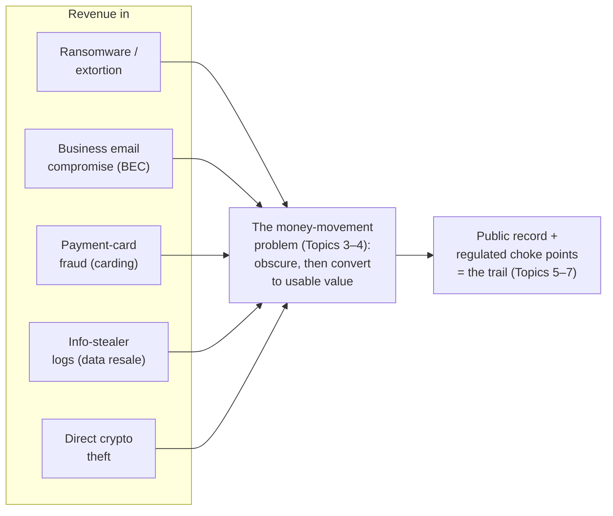
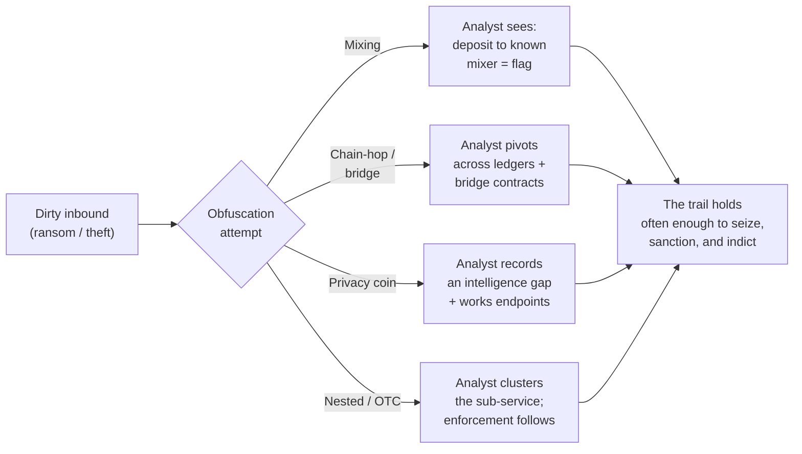
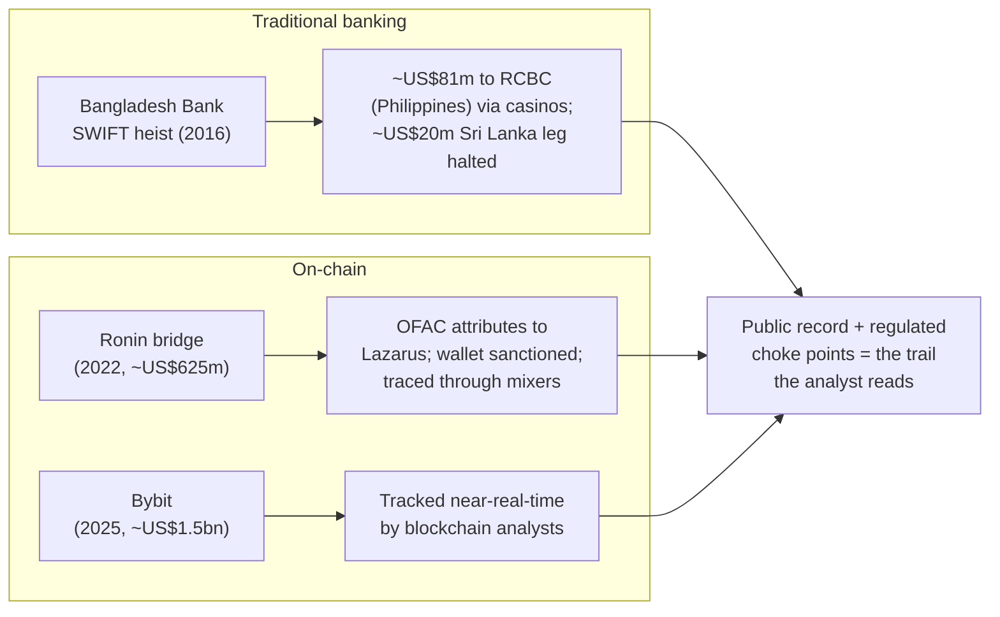

# CCI-02: The Criminal Economy — Financing, Laundering & Cash-Out

> **Module type:** Extension module (counter-intelligence deep dive) — part of [EXT-CCI](index.md)
> **Status:** Draft
> **Version:** v0.1
> **Last Reviewed:** 2026-09-22
> **Domain Expert:** _Unassigned — required before Practitioner Approved (financial-crime intelligence, blockchain-analysis, or law-enforcement cyber background)_
> **Practitioner Reviewer:** _Unassigned — required before Practitioner Approved (must have worked financial-crime intelligence, AML/CTF, asset tracing, or a government cyber programme)_

!!! warning "Not a credit-bearing unit"
    CCI-02 is the second module of the [EXT-CCI series](index.md), an optional extension that sits outside the 66-unit / 160 CP degree structure. It carries **0 CP** and does not appear in [`docs/ksat-coverage.md`](../../ksat-coverage.md) or the [Program Builder](../../program-builder/index.md), both of which are generated from credit-bearing units only. A delivery partner wanting to recognise it should use the Tier 1 badge mechanism in [`docs/curriculum/micro-credentials-framework.md`](../../curriculum/micro-credentials-framework.md).

!!! danger "Read the series ground rules first — and note that this is the money module"
    This module is bound by the [series index](index.md) danger box and by [CCI-01](cci-01-the-cybercriminal-enterprise.md). In one line each: it is **analysis of publicly documented adversaries, not a manual**; it contains **no operational tradecraft**; **legitimate businesses — exchanges, security firms, lawful privacy tools — are never presented as criminal** (a company is named only where a *government has taken enforcement action against it*, stated as the enforcement fact); and **named individuals appear only where a government has publicly charged, sanctioned, or formally attributed them**, described as *alleged* / *attributed* — an indictment or a sanction is an allegation or an executive finding, not a court's verdict of guilt.

    CCI-02 is the **single highest tradecraft-risk module in the series**, because its subject is money movement. It is written to one unbreakable test: **every mechanism is described only as an investigator or blockchain analyst *sees and traces* it — never as a set of instructions to *do* it.** Where a sentence could be read as a step in laundering money, structuring, evading AML, or cashing out, it has been cut. The organising claim of the whole module is the opposite of a how-to: **because most cryptocurrency runs on a public ledger, the money trail is a counter-intelligence *asset* — the adversary's biggest, most permanent evidentiary exposure — and this module teaches you to read it.**

---

## Overview

[CCI-01](cci-01-the-cybercriminal-enterprise.md) ended on a deliberate cliff-hanger: the recurring observation that a criminal enterprise's resources ultimately have to be converted into usable value, which repeatedly forces the organisation to touch systems that are *monitored, sanctioned, and analysable*. The [DarkSide / Colonial Pipeline seizure](#topic-6-the-counter-levers-sanctions-seizures-and-the-amlctf-net) — where the FBI recovered most of a paid ransom — was offered there as proof that "the money" is a weakness, not a strength. **This module is that argument developed in full.**

It teaches the cybercriminal economy the way a financial-crime intelligence analyst studies it: how the ecosystem earns (its revenue models), how it tries to move and clean proceeds, how it attempts to convert them to spendable value, and — the point of the module — **why the ledger that the adversary depends on is also the record that convicts them.** The counter-intelligence framing of CCI-01 carries straight over. There, the master constraint was that a criminal firm cannot use the courts to enforce its arrangements. Here, the master constraint is that a criminal firm **cannot move large sums of value without, at some point, writing that movement onto a permanent public record or handing it to a regulated institution that is watching.**

The module is built entirely from the public record: government indictments and forfeiture filings, sanctions designations, court statements of facts, agency reporting, United Nations sanctions-monitoring reports, and blockchain-analysis publications that describe — openly, in order to *expose* it — how illicit flows are laundered and how they are traced. It leans hardest on the cases where the money story is fully documented: the DarkSide/Colonial Pipeline clawback, the Bitfinex-hack forfeiture, and the DPRK ("Lazarus")-attributed [Bangladesh Bank SWIFT heist](#topic-5-digital-bank-heists-as-case-studies-bangladesh-bank-and-the-lazarus-crypto-thefts) and cryptocurrency thefts, whose laundering trails have been reconstructed in DOJ filings, UN Panel of Experts reporting, and Chainalysis case studies.

It deliberately does **not** re-teach the cybercrime ecosystem as vocabulary ([F04](../../../core/units/F04-security-concepts.md)), attribution method ([CT02](../../../degrees/operational/cti/CT02-threat-actor-research-profiling.md) Topic 4), or the organisational structure of the adversary (that is [CCI-01](cci-01-the-cybercriminal-enterprise.md)). It picks up exactly where CCI-01 stopped — at the boundary of the **money** — and treats financing, laundering, and cash-out as an intelligence and tracing subject, not an operational one.

---

## Where this module fits

| Unit / module | Relationship |
|---|---|
| [CCI-01 — The Cybercriminal Enterprise](cci-01-the-cybercriminal-enterprise.md) | **Direct predecessor.** CCI-01 establishes the organisation and names the financial choke point as its durable weakness; CCI-02 takes the money side into blockchain-analysis and financial-intelligence depth. |
| [F04 — Security Concepts](../../../core/units/F04-security-concepts.md) | Introduces the cybercriminal ecosystem and the idea of monetisation as vocabulary; CCI-02 turns "they get paid somehow" into a traceable economic and evidentiary subject. |
| [CT01 — Intelligence Tradecraft](../../../degrees/operational/cti/CT01-intelligence-tradecraft.md) | Provides the collection-and-analysis discipline (sourcing, confidence, bias) this module applies to reading a money trail off public records. |
| [CT02 — Threat Actor Research & Profiling](../../../degrees/operational/cti/CT02-threat-actor-research-profiling.md) | Topic 7 profiles the financially motivated organisation; CCI-02 supplies the financing-and-laundering half of that profile. |
| [CT04 — Strategic Intelligence](../../../degrees/operational/cti/CT04-strategic-intelligence.md) | Strategic-level analysis (e.g. sanctions as national-power instruments); CCI-02 adds the financial-crime lens. |
| [OC05 — Threat Intelligence Fundamentals](../../../core/units/OC05-threat-intelligence-fundamentals.md) | Operational-core grounding this module assumes. |
| CCI-03 — The Service Economy (later in this series) | **Successor.** The criminal-service *industry* (RaaS, initial-access broking, bulletproof hosting) whose fees and revenue splits flow through the money system CCI-02 describes. Not yet present; named without linking. |
| CCI-04 — State-Sponsored Operations & the State–Crime Nexus (later in this series) | Develops the DPRK state-revenue-theft model CCI-02 introduces through the Lazarus cases. Not yet present; named without linking. |
| CCI-05 — Case Studies; CCI-06 — Counter-Intelligence Practice & the Dual-Use Economy (later in this series) | CCI-05 works the cases at length; CCI-06 treats the CI discipline and the lawful/criminal boundary in full. Neither file exists yet, so this module names them without linking. |

---

## Prerequisites

- **[CCI-01 — The Cybercriminal Enterprise](cci-01-the-cybercriminal-enterprise.md)** (strongly recommended; this module is its direct continuation)
- **[CT02 — Threat Actor Research & Profiling](../../../degrees/operational/cti/CT02-threat-actor-research-profiling.md)** and **[F04 — Security Concepts](../../../core/units/F04-security-concepts.md)** (recommended: the actor-profiling and ecosystem vocabulary)
- **[CT01 — Intelligence Tradecraft](../../../degrees/operational/cti/CT01-intelligence-tradecraft.md)** and **[OC05 — Threat Intelligence Fundamentals](../../../core/units/OC05-threat-intelligence-fundamentals.md)** (recommended: source evaluation and analytic confidence, used in both exercises)

No tooling is required, and none may be built. Every source used in this module and its exercises is a public web page: a government press release or forfeiture filing, a court record, a sanctions list, a regulator's site, a UN report, or a published blockchain-analysis write-up. **Public blockchain explorers are themselves free, public reference sources**; the exercises use only the *published narratives* of already-documented cases and, at most, the public explorer view of addresses those narratives already name. Learners are never directed to any criminal service, market, or infrastructure.

---

## Learning outcomes

On completion, a learner can:

1. **Explain** the "public-ledger paradox" — why a permissionless blockchain is simultaneously a censorship-resistant payment rail *and* a permanent, public, analysable record — and articulate why this makes the money trail a counter-intelligence asset rather than the adversary's safe harbour.
2. **Distinguish** the principal revenue models of the cybercrime ecosystem (ransomware extortion, business email compromise, payment-card fraud, info-stealer-log trading, and direct cryptocurrency theft) at the level of *economics* — scale, margins, and where each model creates a traceable financial footprint — without reproducing any method of committing them.
3. **Recognise**, from public blockchain-analysis reporting, the obfuscation techniques criminals use to try to break a money trail (mixing/tumbling, chain-hopping and cross-chain bridging, privacy coins, and nested/OTC services), and explain *how the public reporting exposes each one* — that is, describe them as tracing problems, not procedures.
4. **Analyse** the cash-out problem and the money-mule economy as an investigative subject: why converting crypto to usable value is the choke point, how mule networks are recruited *as reported*, and the transaction patterns by which investigators recognise them.
5. **Reconstruct**, from named public documents, the laundering trail of a documented case — the [Bangladesh Bank heist](#topic-5-digital-bank-heists-as-case-studies-bangladesh-bank-and-the-lazarus-crypto-thefts), a Lazarus crypto theft, or a DOJ seizure — and assess, with confidence and caveats, why a given laundering attempt succeeded or failed.
6. **Evaluate** the counter-levers used against the criminal economy — sanctions (including OFAC designations of specific mixers and exchanges), asset seizures (e.g. the Colonial Pipeline clawback), and AML/CTF regimes — and judge the durability and limits of each.
7. **Apply** the correct Australian legal and regulatory framing — **AUSTRAC's** role as AML/CTF regulator and financial-intelligence unit, the *Cyber Security Act 2024* ransomware-payment reporting duty, and the *Autonomous Sanctions Act 2011* rule that **making an asset available to a designated person can itself be an offence** — to a documented case, stating precisely what the public record supports.

> Bloom's 4–6 (Analyse / Evaluate / Create). LO5 reaches Create because the laundering-trail reconstruction is *built* from primary documents, not described. This alignment statement is notional: CCI-02 is not credit-bearing and has not been through the AQF mapping process in [`docs/compliance/aqf-teqsa.md`](../../compliance/aqf-teqsa.md).

---

## Framework orientation

!!! note "Mappings are deferred to the Framework Custodian — no codes are asserted here"
    Consistent with the [series index](index.md), this extension module does not feed [ksat-coverage](../../ksat-coverage.md), and its framework mapping is **provisional pending Framework Custodian review**. To avoid asserting an identifier this author has not verified against a current release, the roles and skills below are named at the level this module confidently supports; the specific work-role codes, task IDs, SFIA skill codes and levels, and project-local KSAT IDs are **left to be assigned and verified**, not printed as fact. See the verification-status table.

    - **NIST Workforce Framework for Cybersecurity (NICE) — role families this module speaks to:** All-Source Analyst; Threat/Warning Analyst; Cyber Crime Investigator; Cyber Intelligence Planner. The financial-crime-analysis and asset-tracing competencies sit partly outside the cyber workforce frameworks (they belong to AML/financial-intelligence role sets); the module notes this rather than forcing a code. (Work-role and task codes: **to be assigned by the Framework Custodian.**)
    - **SFIA — skill families:** Threat intelligence; Information security; and (for the financial-tracing content) the governance/audit and specialist-advice families as the Custodian judges appropriate. (Skill codes and proficiency levels: **to be assigned.**)
    - **ASD Cyber Skills Framework:** the Cyber Intelligence domain. (Sub-domain and proficiency: **to be assigned.**)
    - **MITRE ATT&CK:** ATT&CK describes *technical behaviours*, not financial flows, and is therefore only marginally relevant here (e.g. impact techniques such as data-encrypted-for-impact sit *upstream* of the money story). Where a technique is mentioned it is for recognition; the framework version and technique IDs are a CT-series concern, flagged provisional in this project.

---

## Module structure

| Part | Topics | Exercises | Notional hours |
|---|---|---|---|
| A — The ledger as a counter-intelligence asset | 1 | — | 1.5 |
| B — How the ecosystem earns | 2 | — | 2 |
| C — How the trail is (attempted to be) broken, and how it is traced | 3–4 | Exercise 1 | 4 |
| D — The documented cases and the counter-levers | 5–6 | Exercise 2 | 4 |
| E — Method, Australian context and consolidation | 7 | — | 2.5 |
| | | | **14 hours** |

---

## Topics

### Topic 1: The Public-Ledger Paradox — Why the Money Trail Is a Counter-Intelligence Asset

Start with the fact that reframes everything else. A permissionless blockchain such as Bitcoin's or Ethereum's is a **public, append-only ledger**: every transaction that has ever settled is recorded, replicated across thousands of nodes, and readable by anyone with a web browser and a free block explorer. The system was designed to let value move without a trusted intermediary — but the price of removing the intermediary is *radical transparency*. There is no private banking channel; there is only the public ledger.

This produces the paradox at the centre of the module. Cryptocurrency is attractive to criminals because it is **borderless, fast, and does not require a bank's permission to send**. But the same properties that make it useful for receiving a ransom make it a **permanent, timestamped, globally visible record of that ransom** — one that, unlike a wire transfer buried in a correspondent bank's private systems, the whole world can inspect forever. Blockchain-analysis firms describe this openly: the ledger is *pseudonymous, not anonymous*. Addresses are not names, but they are consistent, and the moment one address is tied to a real identity — through an exchange's know-your-customer records, a seizure, an indictment, or an operational mistake — every transaction that address ever touched becomes evidence.

The counter-intelligence reading follows directly and echoes [CCI-01](cci-01-the-cybercriminal-enterprise.md)'s enforcement paradox. There, the criminal firm could not use lawful institutions to enforce its arrangements. Here, the criminal firm **cannot un-write the ledger.** It can try to obscure the trail (Topic 3), but it cannot delete it, and every obfuscation attempt is itself an entry on the record. For the analyst, this means the money is not a dead end — it is often the *richest and most durable* source available, more durable than any malware sample and less deniable than any forum post.

Two analytic disciplines frame the rest of the module:

**Clustering and attribution of addresses is a claim with a confidence.** Analysts group addresses that are probably controlled by one actor (for example, through the common-input-ownership heuristic that public research describes) and attribute clusters to named services or actors. Like all attribution ([CT02](../../../degrees/operational/cti/CT02-threat-actor-research-profiling.md)), this is a *probabilistic claim*, not a certainty, and the analyst records the confidence and the basis.

**Tracing is following value across a public record, not breaking cryptography.** Nothing in this module involves defeating encryption or accessing private data. Tracing is reading what is already public and correlating it with other public facts. That is precisely why it is teachable in an open, lawful course.

**Key concepts:** public append-only ledger; pseudonymity vs anonymity; the paradox (the property that attracts criminals is the property that exposes them); address clustering as a confidence-bearing claim; tracing as reading, not breaking.

---

### Topic 2: How the Ecosystem Earns — Revenue Models as Economics

Before you can trace money, you have to know where it enters the system. This topic surveys the ecosystem's principal revenue models **as an economist or intelligence analyst would — scale, margins, and financial footprint — not as an operator would.** Nothing here explains how to commit any of these offences; the interest is entirely in *where the money comes in and what trace it leaves.*

**Ransomware and cyber-extortion.** The highest-profile model: encrypt or steal a victim's data and demand payment, usually in cryptocurrency, often with a "double extortion" threat to leak stolen data as well. Economically it is a *negotiated* revenue stream with large, lumpy payments; the affiliate/developer revenue split (the ~85/15 division widely reported to correspond to the [DarkSide seizure](#topic-6-the-counter-levers-sanctions-seizures-and-the-amlctf-net)'s 63.7-of-75-BTC recovery) is visible in the public record. The financial footprint is a distinctive one: a large single inbound payment to an address the negotiation identified, which is where tracing usually begins.

**Business email compromise (BEC).** Documented by the FBI's Internet Crime Complaint Center as, in aggregate, one of the costliest categories of cybercrime by reported losses, BEC redirects legitimate business payments to attacker-controlled accounts. Economically it is *fraud against the traditional banking system*, so its footprint is often in **wire transfers and mule bank accounts** rather than on-chain — which is exactly why the mule economy (Topic 4) matters as much as the blockchain.

**Payment-card fraud ("carding").** The resale and use of stolen card data. Economically it is a *high-volume, low-unit-value* commodity trade, historically run through carding marketplaces; its footprint is in marketplace flows and in the conversion of fraud proceeds to goods or cash.

**Info-stealer logs.** A large modern data-resale market: malware harvests credentials, session tokens and system data from infected machines, and the resulting "logs" are traded as a commodity that *feeds* other crimes (account takeover, ransomware initial access). Economically it is a **wholesale input market** to the rest of the ecosystem — the "raw material" layer — and a major reason [CCI-03](index.md) treats the service economy separately.

**Direct cryptocurrency theft.** Intrusions into exchanges, bridges and wallets that steal crypto outright. Economically this is the model with the **largest single events** and the one most associated with state-revenue theft (the DPRK/Lazarus cases in Topic 5). Because the proceeds are *already on-chain*, the entire subsequent story is a laundering-and-cash-out story, which is why these cases are the richest tracing material available.

The analytic point is that **each model leaves a different footprint, and the footprint dictates the tracing approach.** On-chain-native crime (ransomware, crypto theft) is traced primarily on the ledger; fraud against the banking system (BEC, much carding) is traced primarily through bank records, mules and AML reporting; most real cases are hybrids. Chainalysis and comparable firms publish annual estimates of the scale of each category; those figures are **estimates with methodology and error bars**, and the analyst cites them as such, never as a precise national-accounts number.

**Key concepts:** five revenue models compared by economics not method; on-chain-native vs banking-system fraud and the different footprints; info-stealer logs as the wholesale input layer; crime-scale figures as estimates with uncertainty.

---

### Topic 3: How the Trail Is (Attempted to Be) Broken — and How the Reporting Exposes It

!!! danger "Recognition and tracing only — this is the highest-risk topic in the series"
    This topic describes obfuscation techniques **exclusively** as blockchain analysts and financial-crime investigators describe them in public reporting — that is, as *tracing problems to be recognised and solved*. It contains **no procedure**: no service names offered as options, no steps, no thresholds, nothing that would help anyone move or hide money. Each mechanism is presented in one frame only: *here is the pattern an investigator sees, and here is how the public reporting has repeatedly seen through it.* If a learner comes away able to *recognise* a laundering pattern in a case study, the topic has succeeded; if a sentence reads like an instruction, it is a defect and should be cut.

Once proceeds are on-chain, an actor who understands the [public-ledger paradox](#topic-1-the-public-ledger-paradox-why-the-money-trail-is-a-counter-intelligence-asset) will try to obscure the link between the "dirty" inbound funds and the eventual cash-out. Public blockchain-analysis reporting groups these attempts into a handful of recognisable patterns. In every case, the reporting exists *because the technique was seen through* — the write-up is the evidence that the trail held.

**Mixing / tumbling.** A mixing service pools funds from many users and pays out from the pool, so a given withdrawal is not trivially linked to a given deposit. What the analyst *sees* is highly distinctive: a known-illicit address deposits into a service that public reporting has already identified as a mixer, and the same pattern repeats. Chainalysis and government filings treat "funds sent to a mixer" not as the end of the trail but as a **flag** — a signal of intent to launder that itself narrows the investigation. The clearest public proof that mixing is not a safe harbour is enforcement: OFAC's designations of specific mixers (Topic 6) rest on tracing that tied those services directly to DPRK laundering.

**Chain-hopping and cross-chain bridging.** Converting one asset into another, or moving value across different blockchains via a bridge, to break a single-ledger trail. What the analyst *does* in response is pivot: follow the value onto the next ledger and through the public bridge contracts, which are themselves recorded. Public reporting on the Lazarus cases (Topic 5) is full of cross-chain hops that were nonetheless reconstructed end-to-end, precisely because each hop left records on both sides.

**Privacy coins.** Some cryptocurrencies (Monero is the most cited) are *designed* to obscure amounts and parties at the protocol level, and are a genuinely harder tracing problem than transparent chains. The honest analyst's treatment is important: a conversion into a strong privacy coin is often recorded as an **intelligence gap** — the point at which on-chain certainty drops and the investigation must rely on other evidence (the conversion event itself, the endpoints, off-chain records). Naming a gap as a gap is a finding, not a failure.

**Nested services and OTC brokers.** Accounts or desks that operate *inside* a larger, often legitimate, exchange, providing quasi-private conversion. Analysts recognise them by clustering — a set of addresses inside an exchange behaving as a distinct sub-business with an unusual share of illicit exposure. Where enforcement has followed (Topic 6), it has typically targeted the *complicit service*, not the host exchange, and the public designation states the tie.

The unifying lesson is the counter-intelligence one: **every obfuscation technique is also a recognisable signature.** A flow that touches a mixer, hops four chains in an hour, and lands at a high-risk nested desk does not *look clean* — it looks exactly like laundering, and that shape is itself intelligence. The adversary is trapped between two bad options: leave the money in plain sight, or perform the elaborate, patterned obfuscation that flags it. This is why the public reporting can describe these mechanisms in detail — the description helps investigators *see*, and seeing is the whole game.

**Key concepts:** mixing/chain-hopping/privacy coins/nested-OTC as *recognition signatures*, not procedures; "sent to a mixer" as a flag not an endpoint; privacy-coin conversions as honestly-recorded intelligence gaps; obfuscation as its own tell-tale pattern.

---

### Topic 4: Cash-Out and the Mule Economy as an Investigative Subject

Obscuring the trail is not the goal; **converting proceeds into usable value is.** Cash-out is where the on-chain world meets the regulated financial system, and it is the single most reliable choke point in the entire economy — because at the moment of conversion, the funds usually pass through an institution that is subject to AML/CTF obligations, identity checks, and reporting duties (Topic 6). This topic treats cash-out and the mule economy purely as an **investigative subject**: what the choke point is, and how investigators recognise the people and accounts that operate it.

**Why cash-out is the choke point.** Cryptocurrency is only useful to most criminals once it becomes fiat currency, goods, or spendable balances. That conversion typically requires a regulated exchange or a payment service — exactly the kind of entity that collects identity information and files reports. Criminals respond by seeking conversion points that ask fewer questions: complicit or lax exchanges, nested/OTC desks (Topic 3), high-risk jurisdictions, and human intermediaries. Each of those responses is, again, a *recognisable pattern* rather than a hiding place.

**The money-mule economy.** A money mule is a person who receives and forwards illicit funds — through a bank account, a crypto wallet, or by converting between the two — adding a layer of human distance between the criminal and the money. As public reporting and law-enforcement awareness campaigns (including the FBI's and Europol's) document, mules are frequently **recruited under false pretences**: fake "money-transfer agent" or "payment-processing" job advertisements, romance scams, and "get-rich-quick" schemes, with a substantial share of mules being unwitting victims who are themselves committing offences without realising it. This module names the recruitment vectors **only** at the level needed to recognise a victim and to understand the investigative subject — never as a recruitment channel.

**How investigators recognise mule activity.** The public-reporting signatures are consistent and are the reason mule networks are, over time, mappable:

- **Transaction shape.** Funds arrive and are forwarded almost immediately, often broken into smaller amounts, frequently just under reporting or verification thresholds — a shape banks' and exchanges' monitoring systems are specifically tuned to flag.
- **Account behaviour.** A personal account suddenly used as a pass-through for volumes inconsistent with its owner's profile.
- **Network structure.** Many mule accounts feeding a smaller number of consolidation accounts — a fan-in pattern that, once one node is identified, can be walked outward exactly as the social graph was walked in [CCI-01](cci-01-the-cybercriminal-enterprise.md) Topic 6.

**The counter-intelligence reading.** The mule economy is where the criminal enterprise is *most exposed to human intelligence and to the regulated system at once*. Mules are numerous, often unsophisticated, frequently identifiable, and sit precisely on the boundary the AML/CTF system monitors. For the investigator, the cash-out layer is not the end of a trail that has gone cold — it is often where a cold on-chain trail becomes a warm, human, arrestable one. The [Bangladesh Bank heist](#topic-5-digital-bank-heists-as-case-studies-bangladesh-bank-and-the-lazarus-crypto-thefts) is the archetype: the intrusion was sophisticated, but the operation was disrupted and partly recovered at the *cash-out* — casinos, accounts, and named intermediaries in the Philippines.

**Key concepts:** cash-out as the choke point where crypto meets the regulated system; the mule economy as recruitment-by-deception and as an investigative subject; the recognition signatures (rapid pass-through, sub-threshold structuring, fan-in networks); the cash-out layer as where a trail becomes human and arrestable.

---

### Topic 5: Digital Bank Heists as Case Studies — Bangladesh Bank and the Lazarus Crypto Thefts

This topic works two publicly and officially documented bodies of cases — one against the traditional banking system, one against the crypto economy — both attributed by governments to North Korean ("Lazarus"/APT38) actors, and both with laundering trails reconstructed in the public record. They are chosen because the *money story* is unusually complete.

!!! note "Attribution framing"
    "Lazarus Group" / "APT38" is the private-sector name for activity that the United States Government has, in indictments and sanctions, attributed to units of the DPRK's Reconnaissance General Bureau. Individuals named below appear because a US indictment or complaint charges them; those are **allegations**, and the individuals are entitled to the presumption of innocence. Attribution to the DPRK state is an **executive and prosecutorial finding**, recorded here as such.

**The Bangladesh Bank SWIFT heist (2016).** In February 2016, attackers used fraudulent SWIFT payment messages to attempt to move roughly **US$1 billion** out of Bangladesh Bank's account at the Federal Reserve Bank of New York. Most of the orders were stopped, but a set of transfers went through: widely reported as approximately **US$81 million routed to accounts at Rizal Commercial Banking Corporation (RCBC) in the Philippines** and about **US$20 million directed to Sri Lanka**. The US Department of Justice's 2018 criminal complaint against Park Jin Hyok, and its 2021 indictment of three alleged RGB/Lazarus members (Jon Chang Hyok, Kim Il, and Park Jin Hyok), place the Bangladesh Bank theft within a broader DPRK campaign. The **laundering trail is the lesson**: the Philippine funds were reported to have been moved through casinos — a sector then outside key parts of the AML reporting net — while the Sri Lanka leg was halted (Exercise 2 examines why). Recovery of the US$81 million was reported only after a **multi-year international legal effort**. The case is the definitive illustration of cash-out (Topic 4) as both the choke point and the recovery point.

**The Lazarus cryptocurrency thefts.** As the ecosystem moved on-chain, so did the DPRK's revenue theft, and these cases are the richest tracing material in the module:

- **The Ronin Bridge / Axie Infinity theft (March 2022).** Attackers stole cryptocurrency reported at approximately **US$625 million** (173,600 ETH plus 25.5 million USDC) from the Ronin bridge. On **14 April 2022, OFAC attributed the theft to the Lazarus Group** and added the receiving wallet address to the SDN list — a public demonstration that on-chain attribution can be specific enough to *sanction an address*. The subsequent laundering was traced through mixers (contributing to the mixer designations in Topic 6).
- **The Bybit theft (February 2025).** Reported as approximately **US$1.5 billion** in Ethereum stolen from the Dubai-based exchange Bybit and widely described as the largest single cryptocurrency theft on record, again attributed in public reporting to DPRK actors, with the laundering trail tracked in near-real time by blockchain-analysis firms. **Bybit is the victim here, a lawful exchange, and is named only in that capacity.**

**The documented laundering picture.** United Nations sanctions-monitoring reporting concluded that the DPRK stole an estimated **US$3 billion across dozens of cyber operations between 2017 and 2023**, and described the stolen funds as going "through a careful money-laundering process in order to be cashed out." (Note the institutional caveat: the UN Panel of Experts' mandate **lapsed on 30 April 2024** after a Security Council veto blocked renewal, so its formal reporting series ends there; later scale figures come from blockchain-analysis firms and successor monitoring efforts and should be cited to those sources, not to the Panel.) Chainalysis and DOJ filings supply the transaction-level detail: theft, obfuscation attempt, and cash-out, reconstructed from the public ledger.

**The counter-intelligence reading.** State-scale theft does not escape the paradox. A US$1.5 billion crypto theft is a US$1.5 billion *public-ledger event*; the larger the sum, the harder it is to cash out without touching a regulated institution, and the more analysts are watching. The DPRK cases show a sophisticated, state-resourced adversary running straight into the same choke point as a lone ransomware affiliate — which is exactly why the money trail is a strategic counter-intelligence asset, not merely a tactical one.

**Key concepts:** the Bangladesh Bank heist as the archetypal cash-out disruption-and-recovery; the Lazarus crypto thefts (Ronin, Bybit) as state-revenue theft that stays on the public ledger; sanctioning a *specific address*; the UN-vs-analytics sourcing caveat; state scale does not escape the choke point.

---

### Topic 6: The Counter-Levers — Sanctions, Seizures, and the AML/CTF Net

The public record does not just describe the criminal economy; it records the state's response to it. This topic reads three counter-levers as documented outcomes, each of which is also a source the analyst uses.

**Sanctions against the money infrastructure.** The United States, through OFAC, has moved from sanctioning *people* to sanctioning *money-laundering infrastructure*, and each designation is a public statement of traced facts:

- **Complicit exchanges.** In **September 2021, OFAC designated SUEX** — the first sanctions action against a cryptocurrency exchange — stating that a large share of its transactions were tied to illicit actors. Further exchange-related designations followed (including **Chatex** in November 2021 and **Garantex**, designated in 2022 and the subject of a 2025 international disruption).
- **Mixers.** In **May 2022, OFAC designated the mixer Blender.io**, its first designation of a virtual-currency mixer, tying it to DPRK laundering including Ronin proceeds. In **August 2022 it designated Tornado Cash**, and in **November 2023 the mixer Sinbad.io**, described as a successor tool used by Lazarus.
- **A live legal boundary (must be taught honestly).** The Tornado Cash designation was **challenged in court, and in November 2024 the US Court of Appeals for the Fifth Circuit held that OFAC had overstepped its statutory authority** in sanctioning the protocol's immutable smart contracts, which the court found were not "property" under the relevant statute; **OFAC delisted Tornado Cash in March 2025.** The lesson for the analyst is important and current: sanctions on novel financial technology are contested legal instruments whose status can change, and a designation must always be checked against the *current* list — not assumed permanent.

These are enforcement facts. Where this module names Blender.io, Tornado Cash, Sinbad.io, SUEX, Chatex or Garantex, it does so **solely to state that a government took the named enforcement action against them**, on the government's stated basis. The broader public-policy debate over whether privacy-preserving tools should be lawful is real and legitimate and is **not** resolved here; the module reports the enforcement events, not a verdict on the technology.

**Seizures — the money clawed back.** Two cases prove that the ledger enables recovery:

- **The Colonial Pipeline / DarkSide clawback (June 2021).** The DOJ announced it had seized **63.7 of the 75 bitcoin** (about US$2.3 million at the time) that Colonial Pipeline paid to DarkSide — the clearest public demonstration that a ransom paid on-chain can be traced and, in part, recovered. The 63.7-of-75 recovery is widely reported to correspond to the ~85% affiliate / ~15% developer split referenced in [CCI-01](cci-01-the-cybercriminal-enterprise.md) — an analytic inference from the recovered share, not a figure the seizure warrant itself declared.
- **The Bitfinex-hack forfeiture (February 2022).** The DOJ seized cryptocurrency then valued at about **US$3.6 billion** connected to the 2016 hack of the exchange Bitfinex, and arrested Ilya Lichtenstein and Heather Morgan; both later **pleaded guilty** (August 2023), with Lichtenstein — who admitted carrying out the original hack — sentenced to five years and Morgan to 18 months (both November 2024). The case is a landmark demonstration that a laundering operation running for years across many transactions can still be unwound from the public record.

**The AML/CTF net.** Underneath sanctions and seizures sits the regulatory system that makes cash-out (Topic 4) a choke point at all: anti-money-laundering / counter-terrorism-financing regimes that require regulated institutions — including, in many jurisdictions now, cryptocurrency exchanges — to verify customer identity, monitor transactions, and report suspicious activity and threshold transactions to a national financial-intelligence unit. This is the system that turns a cash-out attempt into a filed report, and it is the subject of the Australian-context section that follows.

**The durability caution (carried from [CCI-01](cci-01-the-cybercriminal-enterprise.md)).** As with organisational disruption, financial disruption is **not elimination**. A sanctioned mixer can be succeeded by another (Blender.io → Sinbad.io is the public example); a seizure recovers *some* funds, rarely all; a designation can be overturned in court (Tornado Cash). Assessing the *durability* of a counter-lever — did it remove capability, raise cost, or merely relocate the activity? — is part of Exercise 2.

**Key concepts:** OFAC designations of specific exchanges and mixers as public, traced enforcement facts; the Tornado Cash court reversal and delisting as a live, must-verify boundary; the Colonial Pipeline and Bitfinex seizures as proof the ledger enables recovery; AML/CTF as the system that creates the choke point; disruption ≠ elimination.

---

### Topic 7: Reading a Laundering Trail Off the Public Record

The skill this module builds is turning public documents and public-ledger data into an honest money-flow picture. A short method, mirroring [CCI-01](cci-01-the-cybercriminal-enterprise.md) Topic 7 and applying the [CT01](../../../degrees/operational/cti/CT01-intelligence-tradecraft.md) discipline:

1. **Inventory the sources and label each.** For every claim, record whether it comes from a *forfeiture filing or seizure warrant* (sworn, specific, but selective), an *indictment* (allegation), a *sanctions designation* (executive finding), a *UN or agency report* (institutional analysis, with its own mandate and caveats), a *blockchain-analysis publication* (expert secondary analysis, methodology-dependent), or a *public block explorer* (primary ledger data, but *un-attributed* until tied to something). The label sets the ceiling on your confidence.
2. **Separate the ledger fact from the attribution.** "This address received 75 BTC on this date" is a ledger fact of near-certainty. "This address is controlled by DarkSide" is an *attribution* with a confidence. Never let the certainty of the first launder into the second.
3. **Trace value, and mark every obfuscation as a labelled event, not a wall.** Follow the flow through the record; where it hits a mixer, a bridge, or a privacy-coin conversion (Topic 3), record it as a specific event with a specific effect on your confidence — a flag, a pivot, or a gap — not as "the trail went cold."
4. **State the bias of the dominant source.** A forfeiture filing describes only what was seized and only enough to justify the warrant; it is silent on what got away. A blockchain firm's report may emphasise what its tooling can show. A UN report reflects its mandate. Name the distortion each source pushes toward.
5. **Record what you cannot see, and rate it.** Funds that entered a privacy coin, cash-outs through jurisdictions with no public record, mule accounts behind names you cannot resolve. The gaps are findings, and an honest confidence level on the *whole trail* is the deliverable — not a false claim of a complete chain.

This is exactly what both exercises assess: not how complete a chain you can draw, but how honestly you can label, trace, caveat, and rate what the public record actually supports.

**Key concepts:** source labelling and confidence ceilings for money-trail evidence; ledger fact vs attribution; obfuscation events as labelled, confidence-affecting steps; naming source bias; gaps as rated findings.

---

## Exercises

Both exercises are **intelligence-analysis tasks over public reporting**. There is no lab, no tooling to build, and nothing operational. Each is completable from freely available web sources; the further-reading list is a starting point, not a limit.

!!! warning "Sourcing and conduct"
    Use only lawful, public sources: government press releases and court filings, sanctions lists, regulator and UN pages, reputable reporting, and published blockchain-analysis write-ups. A **public block explorer may be used only to view addresses that a published, lawful source already names** — as a way of confirming a ledger fact the reporting states. Do **not** attempt to access any mixer, exchange account, marketplace, or criminal service; it is unnecessary for the exercise, may be unlawful, and is outside the authorisation of this module. Treat every named individual as **alleged** and cite the record that names them. Do not attempt to trace, contact, or transact with any real funds.

### Exercise 1 (Analytical): Trace a Named Seizure's Public Blockchain Story

**Objective:** Reconstruct, from named public documents, the money trail of a documented seizure — from the crime to the recovery — with a confidence level on every element and an honest map of what could *not* be traced.

**Prerequisites:** Topics 1, 3, 6, 7.

**Task:**

1. Choose **one** documented seizure with a substantial public record — for example the **Colonial Pipeline / DarkSide clawback** (the June 2021 DOJ press release and, for the tracing narrative, the Chainalysis case study), or the **Bitfinex-hack forfeiture** (the February 2022 DOJ announcement, the 2023 guilty pleas, and the 2024 sentencings).
2. Assemble a **source inventory of at least five items** and label each by type (forfeiture filing, indictment/plea, designation, agency report, blockchain-analysis publication, block explorer), per Topic 7.
3. Draw the **money-flow diagram**: from the inbound crime proceeds, through any obfuscation events (mixing, chain-hops, consolidation), to the seizure. Mark each *ledger fact* with high confidence and each *attribution* with its own, lower, sourced confidence (Topic 7 step 2).
4. Annotate every **obfuscation event** as a labelled step (flag / pivot / gap), per Topic 3 — and state, for each, what the public reporting says allowed the trail to be followed anyway.
5. Write a half-page **bias-and-gaps note**: which way your dominant source distorts the picture (a forfeiture filing shows only what was seized), and the three most important things the public record does *not* let you see (e.g. funds that were never recovered, the real identities behind an address).

**Expected output:** the labelled source inventory; the money-flow diagram with per-element confidence and citations; the annotated obfuscation events; the bias-and-gaps note. Marked on discipline — every element traceable to a labelled source, ledger fact kept separate from attribution, gaps honestly rated — **not** on how complete a chain you draw.

**Reflection:**

1. Which single public document did the most to make this trail traceable, and what would the picture look like without it?
2. Where did an obfuscation attempt (a mixer, a chain-hop) end up *helping* the investigation by flagging intent, rather than hiding the money?
3. If the same crime happened today with the proceeds converted immediately into a strong privacy coin, where exactly would your traced chain break — and what off-chain evidence would you need to bridge the gap?

### Exercise 2 (Analytical): Assess Why a Named Laundering Attempt Failed

**Objective:** Produce a financial-crime intelligence assessment of *why* a documented laundering or cash-out attempt failed — or was disrupted or reversed — and judge the durability of the counter-lever that stopped it.

**Prerequisites:** Topics 4, 5, 6, 7.

**Task:**

1. Choose **one** documented failure/disruption with a public record — for example: the **Sri Lanka leg of the Bangladesh Bank heist** (the ~US$20 million that was halted rather than cashed out); the **partial recovery of the Colonial Pipeline ransom**; the **court reversal and 2025 delisting of the Tornado Cash designation** (a counter-lever that was itself partially undone); or the **Bitfinex laundering operation** that ran for years before the 2022 seizure and 2023–24 convictions.
2. State, from sources, **what the actor was trying to achieve** (obscure, convert, cash out) and **at which layer it failed** — the ledger (traced), the obfuscation (flagged), the cash-out/mule layer (Topic 4), the AML/CTF net (reported), or the legal/sanctions layer (seized or, conversely, overturned).
3. Using the module's framework, write a **failure analysis**: for each relevant choke point (public-ledger traceability, the cash-out chokepoint, the AML/CTF reporting net, the sanctions/seizure levers), state whether the public record shows it as the decisive factor, and rate your confidence.
4. Map the failure onto the **counter-intelligence lesson**: which property of the money system — permanence of the ledger, the regulated cash-out choke point, an operational error, or an enforcement action — actually caused it, and cite the evidence.
5. Deliver a **durability judgement** with an explicit confidence level: did this outcome remove the adversary's capability, merely recover some funds, or (as with a court-overturned designation) prove *reversible*? State what would change your assessment.

**Expected output:** the objective-and-failure-layer statement; the per-chokepoint failure analysis with ratings; the counter-intelligence mapping; the durability judgement with confidence and citations. Marked on analytic rigour and honest uncertainty, using the [CT01](../../../degrees/operational/cti/CT01-intelligence-tradecraft.md) discipline.

**Reflection:**

1. A seizure recovers money; a sanction freezes and names; an AML report generates a lead; an arrest removes a person. Which most reduced *your* chosen actor's future capability, and why?
2. Where did the *human* layer — a mule, a named launderer, an operational mistake like a mistyped beneficiary — matter more than the technology?
3. Your chosen counter-lever might be reversible or evadable (a successor mixer, an overturned designation). What is the single most durable thing the state did in your case, and why is it hard for the adversary to undo?

---

## Australian context

Australia's role in the criminal-finance story is specific, and it is where a graduate working here will actually operate.

**AUSTRAC — the AML/CTF regulator and financial-intelligence unit.** The Australian Transaction Reports and Analysis Centre (**AUSTRAC**) is Australia's anti-money-laundering / counter-terrorism-financing regulator *and* its financial-intelligence unit — the agency that both supervises regulated businesses and collects and analyses the financial-transaction reporting that underpins "follow the money" work. Under the *Anti-Money Laundering and Counter-Terrorism Financing Act 2006* (Cth), reporting entities must conduct customer due diligence, monitor transactions, and report suspicious matters and threshold transactions to AUSTRAC. Since 2018, **digital currency exchange (DCE) providers operating in Australia must register with AUSTRAC** and meet AML/CTF obligations; operating an unregistered DCE is an offence. This is the Australian instantiation of the cash-out choke point (Topic 4): AUSTRAC is where an Australian exchange's suspicious-matter report goes, and its data is the "follow the money" resource CCI-01 pointed at. (The AML/CTF regime has been the subject of significant reform legislation extending obligations to further sectors; the current scope should be verified against the Act and AUSTRAC guidance at delivery.)

**The *Cyber Security Act 2024* ransomware-payment reporting duty.** As introduced in [CCI-01](cci-01-the-cybercriminal-enterprise.md), Australia's *Cyber Security Act 2024* (Cth) created a mandatory **ransomware-payment reporting** obligation, reported to have commenced on **30 May 2025**: reporting business entities (broadly, those above a turnover threshold set in the rules — reported as A$3 million — plus responsible entities for critical-infrastructure assets regardless of turnover) must report a ransomware or cyber-extortion payment to the Australian Signals Directorate **within 72 hours**. Read through this module's lens, the duty is a **criminal-finance intelligence instrument**: it converts private extortion payments into a national dataset on who is paying, how much, and to whom — feeding exactly the kind of revenue-model and victimology analysis Topic 2 describes. (Commencement date, threshold, scope and timeframe are drawn from the implementing rules and reputable legal summaries and are flagged for verification against the current instrument.)

**The *Autonomous Sanctions Act 2011* — paying a sanctioned actor can itself be an offence.** This is the sharpest Australian point in the whole module and a direct consequence of Topic 6. Under the *Autonomous Sanctions Act 2011* (Cth) and its regulations, it is an offence to **make an asset available, directly or indirectly, to or for the benefit of a designated person or entity** without authorisation. Because Australia has used its autonomous **cyber**-sanctions power to designate named cybercriminals (the January 2024 Medibank-related listing and the 2024 LockBit and Evil Corp designations discussed in [CCI-01](cci-01-the-cybercriminal-enterprise.md)), **paying a ransom to a sanctioned ransomware actor could itself breach Australian sanctions law** — quite apart from the *Cyber Security Act* reporting duty. The two instruments interact: a payment might have to be reported *and* be unlawful. This mirrors the long-standing US position, where OFAC has publicly advised that facilitating ransomware payments to sanctioned actors risks sanctions liability. The analyst's job is to know that the *sanctions status of the payee* is a legal question with criminal consequences, and that sanctions lists change — so it must be checked against the current DFAT Consolidated List at the time.

**The agencies.** **AUSTRAC** is the financial-intelligence hub; the **AFP** investigates and arrests (including the cash-out and mule layer); **ASD/ACSC** produces the threat reporting and co-sealed advisories and receives ransomware-payment reports; and **DFAT** administers the sanctions lists that make a payee's status a legal question. Legal authority for teaching from all of this rests on the material already being public; this module directs no one to any criminal or financial infrastructure.

---

## Verification status

This module has **not** had practitioner review (R2). It must not be presented to learners as verified content until a Domain Expert and Practitioner Reviewer have signed off. Because this is the money module, the sourcing bar is at its highest: every named case, amount, date and designation below was checked against primary or reputable reporting during authoring, but each must be re-verified at delivery, and the *legal status* items are the most time-sensitive in the whole series.

| Item | Status | Action required |
|---|---|---|
| Bangladesh Bank heist figures (Feb 2016; ~US$1bn attempted; ~US$81m to RCBC/Philippines; ~US$20m Sri Lanka leg; casino laundering; multi-year recovery of the US$81m) | **Verified against reputable reporting as reported** | Confirm the exact figures, the Sri Lanka-leg failure mechanism, and recovery totals against the primary court/agency record; keep "as reported" wording |
| DPRK/Lazarus attribution of the Bangladesh Bank heist (DOJ 2018 Park Jin Hyok complaint; 2021 three-defendant indictment; RGB/APT38) | **Verified against DOJ as reported; allegation framing** | Confirm against the DOJ complaint/indictment; keep *alleged/attributed*, not *convicted* |
| Ronin Bridge theft (Mar 2022; ~US$625m; 173,600 ETH + 25.5m USDC; OFAC Lazarus attribution and wallet designation 14 Apr 2022) | **Verified against OFAC/reputable reporting as reported** | Confirm the amount and the OFAC attribution/date against the Treasury release |
| Bybit theft (Feb 2025; ~US$1.5bn ETH; "largest crypto theft on record"; DPRK-attributed in public reporting) | **Reported; attribution is analytic/agency, verify** | Confirm amount, "largest" claim, and the attribution's source and confidence |
| UN Panel of Experts: ~US$3bn stolen 2017–2023; "careful money-laundering process"; **Panel mandate lapsed 30 Apr 2024** | **Verified as reported** | Confirm the figure and the mandate-lapse date; ensure post-2024 scale figures are cited to blockchain-analysis firms/successor bodies, **not** to the Panel |
| OFAC mixer designations: Blender.io (May 2022, first mixer designation, Ronin/DPRK link); Tornado Cash (Aug 2022); Sinbad.io (Nov 2023, "successor" to Blender, Lazarus) | **Verified against Treasury/reputable reporting as reported** | Confirm each date and stated basis against the OFAC press releases |
| Tornado Cash: **Fifth Circuit ruled OFAC overstepped (Nov 2024); OFAC delisted (Mar 2025)** | **Verified as reported** | Confirm the ruling and delisting; this status is live and must be re-checked — do **not** present Tornado Cash as currently sanctioned |
| OFAC exchange designations: SUEX (Sept 2021, first exchange designation); Chatex (Nov 2021); Garantex (2022 designation; 2025 international disruption) | **Verified against Treasury/reputable reporting as reported** | Confirm each; state Garantex's 2025 disruption/re-designation precisely against the current record |
| Colonial Pipeline / DarkSide seizure (June 2021; 63.7 of 75 BTC ≈ US$2.3m; ~85/15 affiliate/developer split) | **Verified against DOJ as reported** | Confirm against the DOJ press release / seizure warrant (consistent with CCI-01) |
| Bitfinex forfeiture (Feb 2022; ~US$3.6bn seized; Lichtenstein & Morgan arrested; guilty pleas Aug 2023; Lichtenstein 5 yrs, Morgan 18 months, Nov 2024; ~119,754 BTC stolen in 2016) | **Verified against DOJ/reputable reporting as reported** | Confirm the seizure value, plea and sentencing details; keep the convicted/sentenced wording exact |
| BEC as one of the costliest cybercrime categories by reported loss (FBI IC3) | **Reported; cited generally, no specific figure asserted** | If a figure is added at delivery, cite the specific IC3 annual report and year |
| Crypto-crime *scale* figures generally (annual estimates) | **Estimates with methodology/error, not precise totals** | Present all such figures as sourced estimates with the firm and year; never as exact national totals |
| Money-mule recruitment vectors (fake job ads, romance scams) and recognition signatures | **Recognition level only, from law-enforcement awareness reporting** | Confirm framing stays at victim-recognition/investigative level; cite FBI/Europol/AFP awareness material |
| AUSTRAC role; AML/CTF Act 2006; DCE registration required since 2018; AML/CTF reform extending scope | **Verified as reported; reform scope provisional** | Verify current obligations and DCE/registration scope against the Act and AUSTRAC guidance at delivery |
| Cyber Security Act 2024 ransomware-payment reporting (commenced 30 May 2025; A$3m threshold; critical-infrastructure scope; 72-hour report to ASD) | **Provisional** | Verify commencement, threshold, scope and timeframe against the Act and the Ransomware Payment Reporting Rules (consistent with CCI-01) |
| Autonomous Sanctions Act 2011: making an asset available to a designated person is an offence; paying a sanctioned ransomware actor may breach it | **Verified as to the legal principle; apply carefully** | Confirm the offence provision and current cyber designations against the Act, regulations, and the DFAT Consolidated List at delivery; sanctions status changes |
| Legal status of every named individual (Park Jin Hyok, Jon Chang Hyok, Kim Il; Lichtenstein, Morgan) | **Must be re-verified at delivery** | Charges, pleas and convictions change over time; keep *alleged/attributed/pleaded guilty/sentenced* wording exact per the current record |
| Every named company (Blender.io, Tornado Cash, Sinbad.io, SUEX, Chatex, Garantex) is named **only** as the subject of a stated government enforcement action; victims (Bybit, Bitfinex, Ronin/Sky Mavis, RCBC) named only as victims/lawful entities | **Blocking** | Requires the reviewer's explicit sign-off that no lawful firm is implied criminal and every enforcement statement matches the government record |
| All laundering/cash-out mechanisms described at recognition/tracing level only, never as procedure | **Blocking** | Requires the reviewer's explicit sign-off against the series' highest-risk standard before publication |
| Framework mapping (NICE work-role and task codes; SFIA skill codes and levels; ASD CSF sub-domain; project-local KSAT IDs) | **Deferred — not asserted** | Assign and verify with the Framework Custodian; this module intentionally prints no codes |

---

## Further reading

Real, citable starting points. All are public; treat government and court pages as primary, UN and regulator pages as institutional, and reporting/analysis as reputable secondary. Australian sources are marked.

**U.S. Department of Justice (June 2021).** *Department of Justice Seizes $2.3 Million in Cryptocurrency Paid to the Ransomware Extortionists Darkside.* justice.gov.
> Relevance: The primary seizure document for Exercise 1 and the affiliate/developer split; the clearest proof that an on-chain ransom is recoverable.

**U.S. Department of Justice (February 2022; 2023–2024).** Bitfinex-hack seizure announcement; the 2023 guilty pleas and 2024 sentencings of Ilya Lichtenstein and Heather Morgan. justice.gov.
> Relevance: The landmark forfeiture and the full crime-to-conviction arc for Exercise 1/2.

**Chainalysis (case studies and annual *Crypto Crime Report*).** DarkSide/Colonial Pipeline tracing case study; DPRK/Lazarus analyses; annual crypto-crime reporting. chainalysis.com.
> Relevance: The transaction-level tracing narratives and the scale estimates (cited as estimates) for Topics 2, 3, 5, 6 and both exercises.

**U.S. Department of the Treasury / OFAC (2021–2025).** Designations of SUEX (Sept 2021), Chatex (Nov 2021), Blender.io (May 2022), Tornado Cash (Aug 2022), Garantex (2022/2025) and Sinbad.io (Nov 2023); and the March 2025 Tornado Cash delisting. home.treasury.gov.
> Relevance: The primary enforcement records behind Topic 6; each states the traced basis for the action.

**U.S. Court of Appeals for the Fifth Circuit (Nov 2024) — *Van Loon v. Department of the Treasury*.** The decision holding OFAC overstepped in sanctioning Tornado Cash's immutable smart contracts.
> Relevance: The live legal boundary in Topic 6 and an Exercise 2 option; proof that a counter-lever can be reversed.

**U.S. Department of Justice (2018; 2021).** The Park Jin Hyok criminal complaint (2018) and the three-defendant Lazarus/APT38 indictment (2021), covering Bangladesh Bank, WannaCry and virtual-currency thefts. justice.gov.
> Relevance: The attribution records for the Bangladesh Bank and Lazarus cases in Topic 5.

**United Nations Security Council — Panel of Experts established pursuant to resolution 1874 (DPRK).** Final reports through early 2024 (mandate lapsed 30 April 2024). un.org.
> Relevance: The institutional estimate of DPRK crypto theft and its laundering; cite as institutional analysis and note the mandate lapse.

**Federal Bureau of Investigation — Internet Crime Complaint Center (IC3).** Annual reports (BEC and cybercrime loss statistics) and money-mule awareness material. ic3.gov / fbi.gov.
> Relevance: The BEC economics in Topic 2 and the mule-recognition material in Topic 4 (cite the specific year).

**AUSTRAC.** Guidance for digital currency exchange providers; the AML/CTF Act 2006 overview; the FIU role. austrac.gov.au (**Australian source**).
> Relevance: The Australian AML/CTF regime and the cash-out choke point; the "follow the money" resource for the Australian-context section.

**Department of Home Affairs / Australian Signals Directorate (2024–2025).** *Cyber Security Act 2024*; the ransomware-payment-reporting factsheet and Rules (Federal Register of Legislation). homeaffairs.gov.au; cyber.gov.au; legislation.gov.au (**Australian source**).
> Relevance: The payment-reporting duty as a criminal-finance intelligence instrument; verify threshold and scope here.

**Department of Foreign Affairs and Trade (DFAT).** The *Autonomous Sanctions Act 2011* framework and the Consolidated List. dfat.gov.au (**Australian source**).
> Relevance: The offence of making assets available to a designated person, and the current cyber designations; the sanctions-status check in the Australian-context section.

**Australian Signals Directorate / ACSC (annual).** *Annual Cyber Threat Report.* cyber.gov.au (**Australian source**).
> Relevance: The Australian threat and victimology picture for Topic 2 and consolidation.

---

## Module metadata

| Field | Value |
|---|---|
| Module Code | CCI-02 |
| Module Title | The Criminal Economy — Financing, Laundering & Cash-Out |
| Series | EXT-CCI — Adversary Counter-Intelligence |
| Module Type | Extension module (elective; **not** credit-bearing) |
| Version | v0.1 |
| Status | Draft |
| Credit Points | 0 CP — outside the 160 CP degree structure |
| Notional Hours | 14 |
| Extends | CCI-01 (The Cybercriminal Enterprise); CT02 (Threat Actor Research & Profiling) |
| Related Units | F04, OC05, CT01, CT04 |
| Prerequisites | CCI-01 strongly recommended; CT02, F04, OC05, CT01 recommended |
| Domain Expert | _Unassigned — required before Practitioner Approved_ |
| Practitioner Reviewer | _Unassigned — required before Practitioner Approved_ |
| Last Reviewed | 2026-09-22 |
| Framework Mapping | Deferred to Framework Custodian (no codes asserted; see Framework orientation) |
| Bloom's Level (range) | 4–6 (Analyse, Evaluate, Create) |
| Australian Legislation Referenced | Anti-Money Laundering and Counter-Terrorism Financing Act 2006 (Cth); Autonomous Sanctions Act 2011 (Cth); Cyber Security Act 2024 (Cth) |
| Tooling Licence Position | No tooling required; both exercises are analysis over public sources, incl. free public block explorers used only against already-named addresses (R3) |
| Risk Note | Highest tradecraft-risk module in the series; all money-movement mechanisms described at recognition/tracing level only (blocking review item) |
| Licence | CC BY 4.0 |