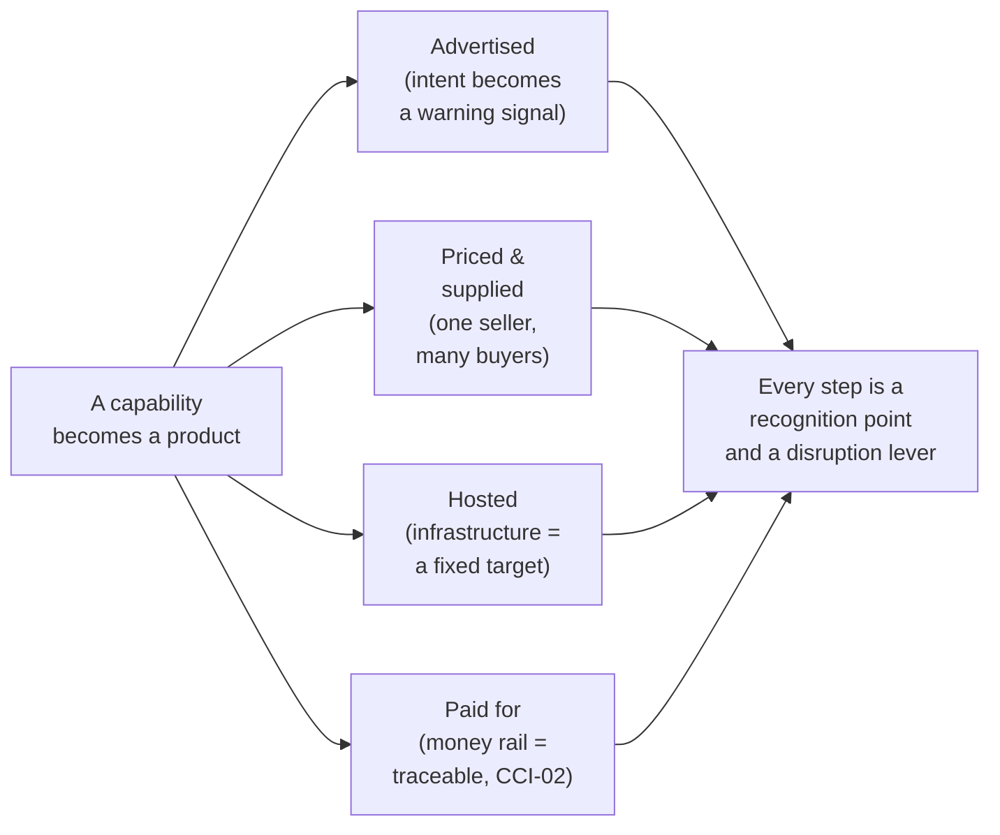
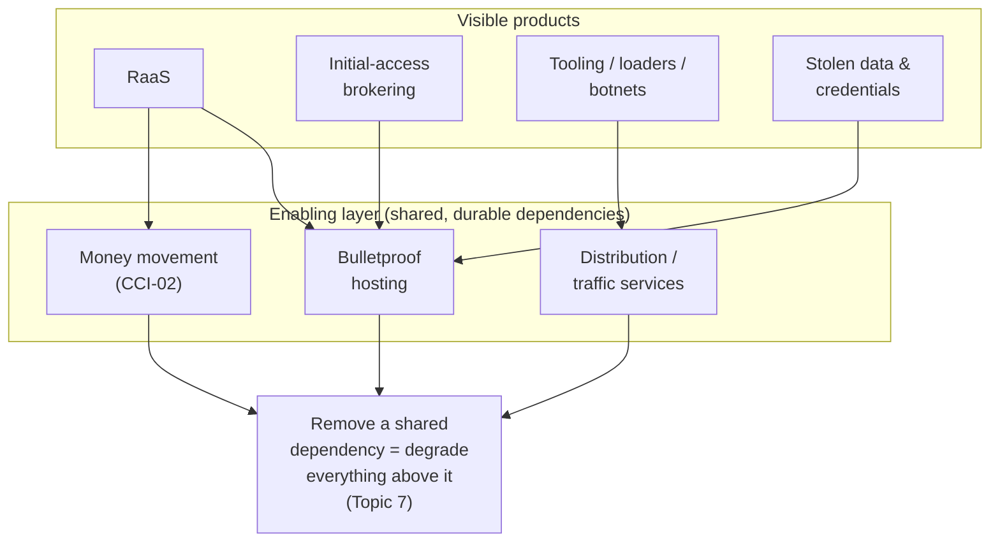
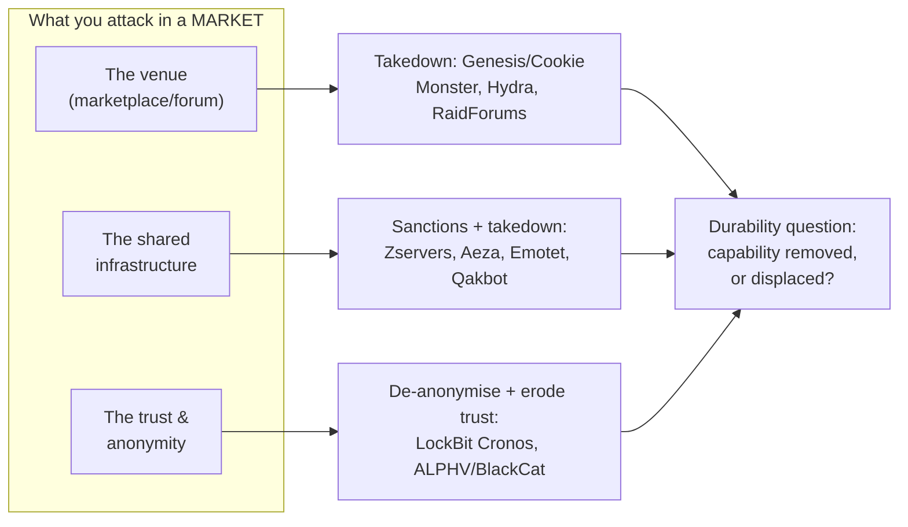

# CCI-03: The Service Economy — Cybercrime-as-a-Service as an Industry

> **Module type:** Extension module (counter-intelligence deep dive) — part of [EXT-CCI](index.md)
> **Status:** Draft
> **Version:** v0.1
> **Last Reviewed:** 2026-09-22
> **Domain Expert:** _Unassigned — required before Practitioner Approved (CTI, law-enforcement cyber, or threat-actor-tracking background)_
> **Practitioner Reviewer:** _Unassigned — required before Practitioner Approved (must have worked adversary attribution, criminal-marketplace monitoring, or a government cyber programme)_

!!! warning "Not a credit-bearing unit"
    CCI-03 is the third module of the [EXT-CCI series](index.md), an optional extension that sits outside the 66-unit / 160 CP degree structure. It carries **0 CP** and does not appear in [`docs/ksat-coverage.md`](../../ksat-coverage.md) or the [Program Builder](../../program-builder/index.md), both of which are generated from credit-bearing units only. A delivery partner wanting to recognise it should use the Tier 1 badge mechanism in [`docs/curriculum/micro-credentials-framework.md`](../../curriculum/micro-credentials-framework.md).

!!! danger "Read the series ground rules first — and note that this is the marketplace module"
    This module is bound by the [series index](index.md) danger box and by [CCI-01](cci-01-the-cybercriminal-enterprise.md) and [CCI-02](cci-02-the-criminal-economy.md). In one line each: it is **analysis of publicly documented adversaries, not a manual**; it contains **no operational tradecraft**; **legitimate security businesses, researchers and conferences are never presented as criminals** — lawful penetration-testing, red-team, exploit-research and vulnerability-brokering firms, and bug-bounty and vulnerability markets, are the *lawful contrast*, and the ethics of the grey market are a **CCI-06** subject, not resolved here; and **named individuals and groups appear only where a government has publicly charged, sanctioned, or formally attributed them**, described as *alleged* / *attributed* — an indictment or a sanction is an allegation or an executive finding, not a court's verdict of guilt.

    CCI-03's subject is the criminal **service industry**, so its specific risk is turning into a buyer's or seller's guide. It is written to one test: **every service is described only at the level a CTI analyst or investigator needs to recognise, attribute, and disrupt it — as a market structure and an intelligence target, never as a directory or a how-to-procure.** This module **names no marketplace, forum or vendor as a place to go to procure anything**, gives no prices as a shopping guide, and provides no step to gain access to, buy, sell, or broker any service. Where it explains that a class of service exists and how it advertises itself, it does so because that is exactly what public reporting and indictments already describe and what defenders must be able to read. If a sentence would help a buyer or seller more than an investigator, it has been cut.

---

## Overview

[CCI-01](cci-01-the-cybercriminal-enterprise.md) taught the adversary as an **organisation**; [CCI-02](cci-02-the-criminal-economy.md) taught the **money** that organisation earns, moves, and cashes out. Both kept running into the same structural fact: a modern criminal operation is rarely self-sufficient. The affiliate who deploys ransomware did not write it; the operator who encrypted a hospital did not always find the way in; the group that stole the data did not build the server it was staged on, and did not launder its own proceeds. Each of those functions is increasingly bought from **someone else who specialises in it.** This module is about that division of labour turned into a market — the **cybercrime-as-a-service ("as-a-service", or CaaS) economy** — studied as an industry and as an intelligence target.

The organising idea is one that changes how a defender reads the whole ecosystem: **specialisation and outsourcing lower the skill floor, but they also create chokepoints and leave market signals.** When a capability becomes a product — access sold by a broker, ransomware rented as a platform, hosting bought for its takedown-resistance, stolen credentials traded as a commodity — a non-expert can assemble a sophisticated operation from parts. That is the threat. But a product must be *advertised, priced, supplied, hosted, and paid for*, and every one of those steps is a place where the market becomes **visible** to a monitoring analyst and **attackable** by law enforcement. The service economy is simultaneously what makes the adversary dangerous and what gives the defender warning and leverage.

The module is built entirely from the public record: government indictments and forfeiture filings, sanctions designations, coordinated-takedown announcements, agency and regulator reporting, and industry-CTI and blockchain-analysis publications that describe the market openly, in order to disrupt it. It leans on cases where the *market structure* is officially documented — the RaaS affiliate model exposed in the [DarkSide](#topic-2-ransomware-as-a-service-raas-as-a-business) seizure and the [LockBit](#topic-7-disrupting-the-service-economy-how-law-enforcement-and-cti-attack-the-market) Operation Cronos materials; the credential-market shape revealed by the [Genesis Market takedown](#topic-7-disrupting-the-service-economy-how-law-enforcement-and-cti-attack-the-market); the bulletproof-hosting model named in OFAC's [Zservers](#topic-6-enabling-infrastructure-and-supply-chains) and Aeza designations; and the botnet-as-distribution model behind the [Emotet](#topic-7-disrupting-the-service-economy-how-law-enforcement-and-cti-attack-the-market) and [Qakbot](#topic-7-disrupting-the-service-economy-how-law-enforcement-and-cti-attack-the-market) disruptions.

It deliberately does **not** re-teach organisational form ([CCI-01](cci-01-the-cybercriminal-enterprise.md)), money movement ([CCI-02](cci-02-the-criminal-economy.md)), attribution method ([CT02](../../../degrees/operational/cti/CT02-threat-actor-research-profiling.md) Topic 4), or the cybercrime ecosystem as vocabulary ([F04](../../../core/units/F04-security-concepts.md)). It picks up where CCI-01's affiliate-program form and CCI-02's fee-and-revenue-split flows meet: the **services** those fees pay for, treated as a market to be recognised, mapped, and dismantled — and it draws, but does not resolve, the line between this criminal market and the **lawful** offensive-security and vulnerability economy that CCI-06 studies.

---

## Where this module fits

| Unit / module | Relationship |
|---|---|
| [CCI-01 — The Cybercriminal Enterprise](cci-01-the-cybercriminal-enterprise.md) | **Direct predecessor.** CCI-01 establishes the affiliate-program and cartel-scale forms and names access providers, developers and launderers as roles; CCI-03 treats those roles *as external services and a market* that firms buy from each other. |
| [CCI-02 — The Criminal Economy](cci-02-the-criminal-economy.md) | **The money system these services' fees flow through.** Affiliate revenue splits, broker fees, hosting subscriptions and data-market payments are exactly the flows CCI-02 teaches you to trace; CCI-03 supplies the products those payments buy. |
| [F04 — Security Concepts](../../../core/units/F04-security-concepts.md) | Introduces the cybercriminal ecosystem and "as-a-service" as vocabulary; CCI-03 turns "you can rent it" into a market structure with recognition points and disruption levers. |
| [CT01 — Intelligence Tradecraft](../../../degrees/operational/cti/CT01-intelligence-tradecraft.md) | Provides the collection-and-analysis discipline (sourcing, confidence, bias) this module applies to reading a criminal market off public reporting. |
| [CT02 — Threat Actor Research & Profiling](../../../degrees/operational/cti/CT02-threat-actor-research-profiling.md) | Topic 7 profiles the financially motivated organisation; CCI-03 adds the *supply-chain and market* view — the actor as buyer, seller, and dependency in a service ecosystem. |
| [CT04 — Strategic Intelligence](../../../degrees/operational/cti/CT04-strategic-intelligence.md) | Strategic-level analysis (market ecosystems, sanctions on infrastructure as instruments of national power); CCI-03 adds the criminal-industry lens. |
| [OC05 — Threat Intelligence Fundamentals](../../../core/units/OC05-threat-intelligence-fundamentals.md) | Operational-core grounding this module assumes. |
| CCI-04 — State-Sponsored Operations & the State–Crime Nexus (later in this series) | Develops how state programmes buy, tolerate, or overlap with the criminal service economy. Not yet present; named without linking. |
| CCI-05 — Case Studies; CCI-06 — Counter-Intelligence Practice & the Dual-Use Economy (later in this series) | CCI-05 works the cases at length; **CCI-06 treats the CI discipline in full and resolves the lawful/criminal boundary — the lawful offensive-security industry, conferences, bug-bounty and vulnerability markets, and the ethics of the exploit grey market that this module only flags.** Neither file exists yet, so this module names them without linking. |

---

## Prerequisites

- **[CCI-01 — The Cybercriminal Enterprise](cci-01-the-cybercriminal-enterprise.md)** and **[CCI-02 — The Criminal Economy](cci-02-the-criminal-economy.md)** (strongly recommended; this module is their continuation — the service *industry* whose fees flow through the money system CCI-02 traces)
- **[CT02 — Threat Actor Research & Profiling](../../../degrees/operational/cti/CT02-threat-actor-research-profiling.md)** and **[F04 — Security Concepts](../../../core/units/F04-security-concepts.md)** (recommended: the actor-profiling and ecosystem vocabulary)
- **[CT01 — Intelligence Tradecraft](../../../degrees/operational/cti/CT01-intelligence-tradecraft.md)** and **[OC05 — Threat Intelligence Fundamentals](../../../core/units/OC05-threat-intelligence-fundamentals.md)** (recommended: source evaluation and analytic confidence, used in both exercises)

No tooling is required, and none may be built. Every source used in this module and its exercises is a public web page: a government press release, indictment or forfeiture filing, a sanctions designation, a regulator or agency page, or a published industry-CTI or blockchain-analysis write-up. **Learners are never directed to any criminal marketplace, forum, broker, or service, and must not attempt to reach one** — it is unnecessary for every task here, may be unlawful, and is outside the authorisation of this module.

---

## Learning outcomes

On completion, a learner can:

1. **Explain** why the "as-a-service" turn matters for defence — how specialisation and outsourcing lower the skill floor for offenders while simultaneously creating chokepoints and market signals that give CTI teams warning and disruption points — and articulate the counter-intelligence reading that *a product must be advertised, supplied, hosted and paid for, and each step is visible and attackable*.
2. **Distinguish** the principal service categories of the criminal economy — ransomware-as-a-service, initial-access brokering, exploitation-development and access/loader/botnet-as-a-service, information and credential brokering, and enabling infrastructure (bulletproof hosting, distribution) — at the level of *market structure* (who supplies whom, how a listing is described, how value flows), without reproducing any means of procuring or providing them.
3. **Recognise**, from public reporting and indictments, the market signals a monitoring analyst reads — how initial-access brokers advertise footholds by victim sector, geography, revenue and access type as a *leading indicator*; how a RaaS "brand" and affiliate portal are structured; how a data or credential listing is shaped — and explain each strictly as a recognition-and-warning signal, not a purchasing route.
4. **Analyse** a documented criminal service as a market and a supply chain: its role in enabling other crime, its dependencies (the [CCI-02](cci-02-the-criminal-economy.md) money rail, the hosting layer, the distribution layer), and where it is structurally exposed.
5. **Evaluate** how law enforcement and CTI attack the service economy — takedowns of infrastructure and marketplaces, sanctions on operators and enabling infrastructure, seller and administrator de-anonymisation, and trust erosion — using government-documented examples, and judge the *durability* of each disruption.
6. **Apply** the correct Australian legal and regulatory framing — ASD/ACSC reporting on the CaaS and access-broker ecosystem, the *Criminal Code Act 1995* (Cth) computer offences and the dealing-in-identification-information offences, the *Security of Critical Infrastructure Act 2018* (Cth) supply-chain exposure, and documented AFP and Australian-coordinated action against markets and infrastructure — to a documented case, stating precisely what the public record supports.
7. **Distinguish** this criminal market from the **lawful** offensive-security and vulnerability economy (penetration testing, red teaming, exploit research, vulnerability brokering, bug bounties) without conflating them or implying criminality of any lawful actor, and correctly flag the grey-market ethics question as a CCI-06 subject.

> Bloom's 4–6 (Analyse / Evaluate / Create). LO4 reaches Create because the market-structure reconstruction is *built* from primary documents, not described. This alignment statement is notional: CCI-03 is not credit-bearing and has not been through the AQF mapping process in [`docs/compliance/aqf-teqsa.md`](../../compliance/aqf-teqsa.md).

---

## Framework orientation

!!! note "Mappings are deferred to the Framework Custodian — no codes are asserted here"
    Consistent with the [series index](index.md), this extension module does not feed [ksat-coverage](../../ksat-coverage.md), and its framework mapping is **provisional pending Framework Custodian review**. To avoid asserting an identifier this author has not verified against a current release, the roles and skills below are named at the level this module confidently supports; the specific work-role codes, task IDs, SFIA skill codes and levels, and project-local KSAT IDs are **left to be assigned and verified**, not printed as fact. See the verification-status table.

    - **NIST Workforce Framework for Cybersecurity (NICE) — role families this module speaks to:** All-Source Analyst; Threat/Warning Analyst; Cyber Crime Investigator; Cyber Intelligence Planner; and, for the supply-chain-exposure content, the Cyber Defense / risk role sets. (Work-role and task codes: **to be assigned by the Framework Custodian.**)
    - **SFIA — skill families:** Threat intelligence; Information security; and (for the criminal-market monitoring and supply-chain-risk content) the specialist-advice and risk-management families as the Custodian judges appropriate. (Skill codes and proficiency levels: **to be assigned.**)
    - **ASD Cyber Skills Framework:** the Cyber Intelligence domain. (Sub-domain and proficiency: **to be assigned.**)
    - **MITRE ATT&CK:** ATT&CK describes *technical behaviours*, not market structure. It is relevant here only at the recognition level — for example, the tactic names *Initial Access* and *Resource Development* describe the phases the initial-access-broker and infrastructure markets serve, and technique *names* such as supply-chain compromise and drive-by / phishing distribution are the behaviours the distribution market sells into. Where such a name is used it is in prose only, for recognition; specific technique IDs and the framework version are a CT-series concern, flagged provisional in this project and not asserted here.

---

## Module structure

| Part | Topics | Exercises | Notional hours |
|---|---|---|---|
| A — The market lens | 1 | — | 1.5 |
| B — The service categories | 2–5 | Exercise 1 | 6 |
| C — Infrastructure, supply chains and disruption | 6–7 | Exercise 2 | 4.5 |
| D — Australian context and consolidation | — | — | 2 |
| | | | **14 hours** |

---

## Topics

### Topic 1: The Market Lens — Why "as-a-Service" Matters for Defence

Start with the shift that produced the modern ecosystem. Twenty years ago, a sophisticated intrusion required an actor who could do most of it themselves: find the way in, build or obtain the tooling, run the infrastructure, and monetise the result. Today, each of those functions can be a **product bought from a specialist.** Public reporting from agencies and industry-CTI firms describes an economy in which access, malware, hosting, distribution, stolen data, and even negotiation and laundering are supplied as discrete services. This is the "as-a-service" turn, and it is the single most important structural change in cybercrime since the arrival of cryptocurrency.

For the defender, the turn cuts two ways, and holding both halves at once is the whole discipline of this module.

**It lowers the skill floor.** When a capability is a product, the buyer no longer needs the skill to build it. A person who could never write a working encryptor can rent a ransomware platform; a person who could never breach an enterprise can buy the access from someone who did. Specialisation makes each part better *and* puts the assembled whole within reach of far more people. That is why the volume and reach of serious intrusions have grown even as the number of genuinely elite developers has not.

**It creates chokepoints and leaves signals.** A product is not free-floating. It has to be **advertised** (so buyers can find it), **priced**, **supplied** (delivered from seller to buyer), **hosted** (it runs somewhere), and **paid for** (the money moves, per [CCI-02](cci-02-the-criminal-economy.md)). Every one of those is a point where the market becomes *visible* to a monitoring analyst and *attackable* by law enforcement:

- **The advertisement is intelligence.** A broker listing a foothold, a RaaS operator recruiting affiliates, a data seller describing a fresh breach — each is a public (to the market) statement of intent that CTI teams read to *warn the likely victim before the follow-on attack*.
- **The supplier is a single point serving many.** One access broker may feed dozens of downstream operations; one hosting provider may carry hundreds of criminal services. Removing the supplier degrades everyone it served at once — which is why infrastructure is such a durable target (Topic 7).
- **The money is a shared rail.** Fees and revenue splits flow through the same monitored, sanctionable, traceable systems CCI-02 describes.

**The dual-use caution, stated once and up front.** Several of the *capabilities* this economy trades in — finding vulnerabilities, developing exploits, testing defences, brokering vulnerability information — are also the daily work of **lawful** businesses: penetration testers, red teams, exploit researchers, vulnerability brokers, and the bug-bounty and vulnerability-disclosure markets. Those are legitimate, and this module never presents any lawful firm, researcher or conference as criminal. The line between the lawful market and the criminal one — and the genuinely hard ethical questions of the grey market in the middle — is the subject of **CCI-06**. This module studies the criminal side and simply *marks* the boundary where it runs; it does not resolve it.

**Key concepts:** the "as-a-service" turn; specialisation lowers the skill floor *and* creates chokepoints; the advertise–price–supply–host–pay chain as five recognition-and-disruption points; the criminal market vs the lawful dual-use economy (boundary marked, resolution deferred to CCI-06).

---

### Topic 2: Ransomware-as-a-Service (RaaS) as a Business

Ransomware is the most visible service in the economy, and the RaaS model is the clearest illustration of how a criminal capability becomes a *platform business*. This topic treats RaaS **at the recognition level of a market analyst** — what the model is, how the public record exposes its structure, and why that structure is both its strength and its exposure. It contains nothing about how to obtain, operate, or affiliate with such a platform.

**The affiliate/operator split.** In the mature RaaS model documented across indictments and takedowns, a **core operator team** builds and maintains the product — the encryptor, the affiliate portal, the negotiation and leak infrastructure, and often a "builder" that generates customised ransomware — while **affiliates** conduct the actual intrusions and deployments in exchange for a share of any ransom. The economics are visible in the public record: when the U.S. Department of Justice seized 63.7 of the 75 bitcoin that Colonial Pipeline paid to the **DarkSide** group in 2021, the seized portion — about 85% — corresponded to the affiliate's share, with roughly 15% going to the developers. That single filing exposes the revenue-split architecture of the whole model. (This is the same DarkSide figure used in [CCI-01](cci-01-the-cybercriminal-enterprise.md) and [CCI-02](cci-02-the-criminal-economy.md); it is verified against the June 2021 DOJ release.)

**Brand, portal, and builder.** A RaaS operation behaves like a software vendor with a reputation to protect. Public reporting on groups that governments have attributed and charged — **Conti** (whose 2022 internal leaks revealed a company-like structure), **LockBit**, **REvil/Sodinokibi**, and **ALPHV/BlackCat** — describes recognisable business features: a "brand" that affiliates want to be associated with because it commands ransom leverage; an affiliate **portal** for managing victims and negotiations; a **builder** for producing ransomware payloads; published affiliate "rules"; and a data-leak site used to pressure victims. These are named here strictly as **group-level, government-attributed** examples of a market form — not as options and with no operational detail.

**Reputation and the rebrand cycle.** Because a RaaS brand is an asset, damaging it is a form of disruption (Topic 7), and because a damaged brand can be abandoned, **rebranding after a takedown or a burnt reputation is a recurring, documented pattern.** Affiliates migrate between platforms; operators relaunch under new names; personnel reappear. For the analyst this is a double-edged signal: a rebrand is evidence of pressure working, but it also warns that a disruption may have displaced rather than destroyed a capability (the durability question in Exercise 2).

**Why the model is exposed.** The RaaS structure multiplies the number of people and relationships an investigator can exploit, exactly as [CCI-01](cci-01-the-cybercriminal-enterprise.md) Topic 3 argued: affiliates must be recruited and vetted (leaving a trail), the portal and builder are infrastructure that can be seized, the negotiation and leak sites are public-facing, and the money must move through the [CCI-02](cci-02-the-criminal-economy.md) rail. The [LockBit Operation Cronos](#topic-7-disrupting-the-service-economy-how-law-enforcement-and-cti-attack-the-market) takedown and the [ALPHV/BlackCat](#topic-7-disrupting-the-service-economy-how-law-enforcement-and-cti-attack-the-market) disruption (both in Topic 7) are the public demonstrations that each of these seams is real.

**Key concepts:** the operator/affiliate split and the DarkSide-documented revenue share; brand, portal, builder and leak site as business features; the rebrand cycle as both a pressure signal and a displacement warning; RaaS structure as inherently multi-seam and penetrable — all at recognition level.

---

### Topic 3: Initial-Access Brokering (IAB) — Access as a Commodity

If RaaS is the most visible service, **initial-access brokering** is the one whose recognition matters most for *prevention*, because it is a leading indicator: it often precedes the damaging attack. This topic describes the IAB market **as the shape a monitoring analyst sees**, not as a door anyone is shown how to open.

**Access as a commodity.** An initial-access broker is a specialist who obtains a foothold into a victim organisation — and then **sells that foothold** to another actor (frequently a ransomware affiliate) rather than exploiting it themselves. The division of labour is efficient: the broker is good at getting in; the buyer is good at what comes next. This is precisely the "access provider" role that [CCI-01](cci-01-the-cybercriminal-enterprise.md) Topic 3 named as a contracted function; CCI-03 treats it as a market.

**How listings are described — and why that is a warning signal, not a shopping guide.** Public industry-CTI reporting consistently describes broker advertisements as characterising accesses by a small set of attributes: the victim's **sector**, **geography**, and approximate **revenue** (proxies for how much ransom the access could yield), and the **type of access** on offer (its general level and nature). The reason this is worth teaching is entirely defensive: **these attributes are what CTI teams monitor so they can warn a likely victim before the follow-on intrusion.** An analyst who recognises that accesses matching a particular sector-and-geography profile are being traded can raise the alarm for organisations that fit that profile. This module describes the *attributes of a listing* at exactly this recognition level and **names no marketplace, broker, or listing as somewhere to go, and gives no access levels, prices, or means of contact** — because those would serve a buyer, not a defender.

**Why IAB feeds RaaS.** The two markets interlock. A ransomware affiliate short on access can buy it; a broker with access but no interest in the follow-on can sell it. This is why access-broker activity is treated as a **leading indicator of ransomware risk**: a rise in listings for a sector can foreshadow a wave of intrusions against it. The counter-intelligence reading is the familiar one — the broker's need to *advertise* in order to sell is the same need that makes the broker *visible*.

**The disruption levers.** Because a broker is a supplier serving many downstream operations, disrupting one broker degrades many operations at once. And because the broker's advertisement is a public statement, monitoring it produces **victim warning** (the highest-value defensive output) and **attribution leads**. Where law enforcement has de-anonymised and charged administrators of access-selling forums (Topic 7), it has removed a supply node for the whole market.

**Key concepts:** access sold as a commodity by a specialist broker; listings characterised by sector/geo/revenue/access-type as a *victim-warning signal*, not a purchasing route; IAB as a leading indicator that feeds RaaS; the broker's need to advertise as its exposure; supplier removal as a high-leverage disruption.

---

### Topic 4: Exploitation-Development and Access/Loader/Botnet-as-a-Service

Beneath access-brokering sits a layer of **tooling-as-a-product**: the malware, loaders, botnets and exploit capabilities that are supplied, rented or sold as priced products and that feed the rest of the economy. This topic treats that layer as a market and a **criminal supply chain**, at recognition level, and then draws — without resolving — the line to the lawful exploit and vulnerability economy.

**Priced products in a criminal supply chain.** Public reporting and indictments describe several recurring product classes in this layer. Described only as market roles (never as options, capabilities to acquire, or operational detail):

- **Malware- and loader-as-a-service** — malicious software, and the "loaders" that deliver and install further payloads, offered on a rental or sale basis so that a buyer need not build their own.
- **Botnet-as-a-service** — access to a network of already-compromised machines, used as a **distribution and delivery platform** for other malware. The **Emotet** and **Qakbot** botnets (both disrupted in law-enforcement operations covered in Topic 7) are the canonical government-documented examples: each functioned as a *service to the wider ecosystem*, delivering other actors' payloads — which is exactly why dismantling them degraded many downstream operations at once.
- **Exploit/access capabilities** — the means of taking advantage of a vulnerability, supplied as a product to actors who cannot develop it themselves.

**The vulnerability lifecycle as an economy.** A vulnerability has a life: discovered, weaponised into an exploit, used, eventually disclosed and patched, and — as the [EXT-CCI index](index.md) case list notes for EternalBlue — sometimes leaked and reused by new actors. Around that lifecycle sit *markets*: the criminal one that trades exploits for offence, and the **lawful** ones that pay for the same discovery work for defence. The two consume the same raw material (a vulnerability) for opposite purposes.

!!! note "The lawful contrast — flagged here, resolved in CCI-06"
    Finding vulnerabilities and developing exploits is also the work of **lawful** businesses and researchers: penetration-testing and red-team firms, exploit-research companies, legitimate vulnerability brokers, and the **bug-bounty and coordinated-disclosure markets** that pay researchers to report flaws so they can be fixed. These are legitimate and are **not** part of the criminal service economy; this module names them only as the lawful contrast and implies wrongdoing by no lawful firm, researcher, or conference. The genuinely difficult questions — where lawful exploit sales shade into a grey market, and the ethics of who may buy an exploit — are a **CCI-06** subject and are *not* resolved here. The analyst's job in *this* module is only to recognise the criminal supply role, and to keep the lawful market firmly on the other side of the line.

**Key concepts:** malware/loader/botnet/exploit capabilities as priced criminal products; the botnet as a distribution service to the wider ecosystem (Emotet, Qakbot); the vulnerability lifecycle as an economy consumed for opposite purposes; the lawful exploit/vuln and bug-bounty market as the flagged contrast (resolution deferred to CCI-06).

---

### Topic 5: Information and Intelligence Brokering — Stolen-Data and Credential Markets

The service economy does not only trade *capabilities*; it trades *information*. Stolen data, credentials, and access-enabling artefacts are commodities in their own right, and — as [CCI-02](cci-02-the-criminal-economy.md) Topic 2 noted of info-stealer logs — they form a **wholesale input layer** that feeds account takeover, fraud, and ransomware initial access. This topic treats the information market at the recognition-and-monitoring level.

**Stolen-data and credential markets.** Public reporting and DOJ actions describe markets and forums whose product is *data*: breached databases, combolists (compiled username-and-password sets), payment-card data ("carding"), and the credential-and-session artefacts harvested by info-stealer malware. The economics are the low-unit-value, high-volume commodity trade CCI-02 described; the significance for CTI is that this layer is where the **raw material** for downstream crime is aggregated and sold. The **Genesis Market** takedown (Topic 7) is the government-documented archetype: reporting and the DOJ action described a marketplace organised around stolen credentials and the browser artefacts that let a buyer impersonate a victim — a market whose *shape* (an aggregator of stolen access-enabling data) is what the defender must recognise. As with every other service here, the module describes the market's **structure and its role as an input layer**, and **names no market as a place to obtain anything, gives no listings, prices, or access routes.**

**"Intelligence brokering" among criminal groups.** Beyond raw data, groups trade *intelligence about targets and about each other*: which organisations are vulnerable, which have paid before, which accesses are fresh. This is the criminal mirror of legitimate threat intelligence, and it matters to the analyst because it means the adversary ecosystem has its own information economy — one whose signals (a target being discussed, a breach being advertised) are, again, readable as **warning**.

**The recognition/monitoring view.** For the defender, the value of understanding this market is early warning and incident scoping. Recognising that an organisation's credentials or data are being *aggregated and offered* — from public breach-notification and industry-CTI reporting, never by touching a market — supports two defensive actions: warning and credential resets before the data is weaponised (the ALPHV and Genesis operations both involved *revoking or neutralising* stolen access, per Topic 7), and scoping the true blast radius of a breach. The counter-intelligence reading is consistent with the whole module: the data must be *advertised to be sold*, and the advertisement is the signal.

**Key concepts:** stolen-data, credential and carding markets as a wholesale input layer feeding downstream crime; info-stealer logs and combolists as commodities (link to CCI-02); "intelligence brokering" as the adversary's own information economy; monitoring as early warning and blast-radius scoping — described at recognition level, no market named as a source.

---

### Topic 6: Enabling Infrastructure and Supply Chains

Every service so far has to *run somewhere* and be *paid for somehow*. Underneath the visible products sits an enabling layer — hosting, money movement, and distribution — that the whole economy depends on. Because dependencies are shared and durable, this layer is where the market is most exposed to a decisive, one-to-many disruption.

**Bulletproof hosting (BPH).** A bulletproof host sells one thing above all: **takedown-resistance.** It provides servers and network infrastructure while deliberately ignoring abuse complaints and law-enforcement requests, often operating from, or fronting through, jurisdictions chosen to frustrate cooperation. It is described here as a *market role* — the supplier of criminal uptime — and the public record now names specific BPH operations as the subjects of government enforcement:

- **Zservers.** In **February 2025**, in a **joint action by the United States, the United Kingdom and Australia**, OFAC and partners sanctioned **Zservers**, a Russia-based bulletproof-hosting provider, for supporting **LockBit** ransomware operations, naming administrators and, in the UK action, the front company **XHOST**. This is a rare, clean, government-documented example of the BPH role — and, because Australia was a joint actor, a direct Australian-context anchor.
- **Aeza Group.** On **1 July 2025**, OFAC, coordinating with the UK NCA, sanctioned the Russia-based BPH provider **Aeza Group** and its leaders, stating it had provided hosting to malware and ransomware operations (including info-stealer operators) and to a darknet marketplace.

Each of these is named **only** as the subject of a stated government enforcement action, on the government's stated basis, framed as an executive finding with individuals *alleged*.

**Money-movement services.** The financing, laundering and cash-out services that move the economy's fees and proceeds are a service layer in their own right — and they are the subject of [CCI-02](cci-02-the-criminal-economy.md), which treats them at blockchain-analysis depth. This module simply records that they *are* a service the ecosystem buys, and points to CCI-02 for the tracing.

**Traffic and distribution services.** Getting malware in front of victims is itself a service: the botnet-as-distribution model (Topic 4), and traffic-direction and delivery services that route victims to malicious payloads. The distribution layer is where the criminal supply chain meets the victim, and it maps to the ATT&CK *Initial Access* behaviours (drive-by, phishing, supply-chain) — named for recognition only.

**Criminal supply-chain dependencies and the SOCI angle.** Two supply-chain ideas meet here. First, the *criminal* supply chain has dependencies — a RaaS operation depends on access brokers, hosting and distribution — and removing a dependency degrades the dependent (the disruption logic of Topic 7). Second, the criminal economy increasingly *targets* legitimate supply chains: a **supply-chain compromise** turns one vendor's breach into access to that vendor's many customers, and the [EXT-CCI index](index.md) case list's "Shai-Hulud" worm and the credential-theft-at-scale it enabled are the series' running example. For Australia this is squarely a **Security of Critical Infrastructure Act 2018** concern (the Australian-context section develops it): a critical-infrastructure entity's exposure runs through its suppliers, and the service economy is what arms an attacker to exploit that exposure.

**Key concepts:** bulletproof hosting as the supplier of takedown-resistance (Zservers, Aeza as government-documented examples, incl. a US/UK/Australia joint action); money-movement as a service (pointer to CCI-02); distribution/traffic services and the botnet-as-distribution model; criminal supply-chain dependencies vs supply-chain compromise of legitimate targets (SOCI relevance); shared infrastructure as the durable, one-to-many disruption target.

---

### Topic 7: Disrupting the Service Economy — How Law Enforcement and CTI Attack the Market

The public record does not only describe the service economy; it records the state's and industry's attacks on it. This topic reads the disruption levers as documented outcomes, each of which is also a source and a lesson. The unifying idea is that **you disrupt a market differently from how you disrupt a single group**: you go after the *shared* things — the infrastructure many depend on, the trust the market runs on, and the anonymity of the suppliers.

**Marketplace and forum takedowns.** Removing the venue where a service is traded degrades the whole market it hosted:

- **Genesis Market — "Operation Cookie Monster" (April 2023).** An international operation, **led by the FBI and the Dutch National Police** with coordination through Europol/Eurojust and involvement across 17 countries, seized the Genesis Market credential marketplace and made about 120 arrests. **Australia's arm, "Operation Zinger," was run by the AFP**, which reported executing 24 search warrants and 10 arrests, identifying around 36,000 compromised Australian devices offered on the market and estimating potential harm to the Australian community in the tens of millions of dollars. This is the archetypal *credential-market* takedown and a direct Australian anchor.
- **Hydra Market (April 2022).** German authorities (the BKA), acting with U.S. law enforcement, seized the servers and cryptocurrency of Hydra, then described as the largest darknet marketplace; the DOJ charged an alleged administrator and, the same day, OFAC sanctioned the exchange **Garantex** (the money-service tie CCI-02 discusses).
- **RaidForums — "Operation TOURNIQUET" (April 2022)** and its successor forum's disruption. A Europol-coordinated action with the DOJ seized the RaidForums data-trading forum and charged its alleged founder; the successor forum **BreachForums** was in turn disrupted with the 2023 arrest of its alleged administrator. The pattern — *seizure, successor, seizure* — is the market-level version of the RaaS rebrand cycle, and a caution about durability.

**Sanctions on operators and enabling infrastructure.** As Topic 6 showed, governments increasingly sanction the *infrastructure* the market depends on, not only its people: the **Zservers** (February 2025, US/UK/Australia) and **Aeza Group** (July 2025, US/UK) bulletproof-hosting designations attack the hosting dependency directly, and the LockBit designations attack a brand. A sanction does not seize a server, but it poisons the operator's ability to be paid and dealt with — a **trust-and-money** lever.

**Infrastructure takedowns of distribution botnets.** Dismantling a botnet that served the ecosystem as a distribution platform degrades every operation that relied on it:

- **Emotet — "Operation Ladybird" (January 2021).** A Europol/Eurojust-coordinated operation across eight countries took control of Emotet's infrastructure (reported as hundreds of servers) and redirected infected machines to law-enforcement-controlled systems. Emotet had functioned as a *delivery service* for other actors' malware, so its takedown hit the wider market, not one group.
- **Qakbot — "Operation Duck Hunt" (August 2023).** An FBI-led multinational operation disrupted the Qakbot botnet, seizing servers and cryptocurrency and using its control of the infrastructure to push a removal to infected machines; officials described it as, at the time, the largest U.S.-led disruption of a botnet used to enable ransomware and fraud. (The publicly named Duck Hunt partners were the United States, France, Germany, the Netherlands, Romania, Latvia and the United Kingdom; Australia was **not** among them — its documented role in this module's disruption set is in Cronos, Zinger and the Zservers sanctions.)

**RaaS-platform disruption, seller de-anonymisation, and trust erosion.** The most sophisticated operations attack the market's *trust*:

- **LockBit — "Operation Cronos" (February 2024).** A task force led by the UK NCA and the FBI, with Europol and partners including Australia, seized LockBit's infrastructure (reported as 34 servers across countries including Australia), obtained decryption keys, froze cryptocurrency accounts, and **repurposed LockBit's own leak site** to publish the operation's findings and later to unmask the alleged leader — a deliberate, public act of **trust erosion** against an affiliate program that ran on reputation. (Covered as an organisational case in [CCI-01](cci-01-the-cybercriminal-enterprise.md); here it is the *market-trust* lever.)
- **ALPHV/BlackCat (December 2023).** The FBI, having gained access to the operation's infrastructure — reportedly with the assistance of a confidential human source who acted as an affiliate — obtained hundreds of decryption key pairs, helped victims recover data, and briefly seized the leak site. Beyond the immediate rescue, the operation **eroded affiliate trust** in the platform's safety, which for a service that must recruit affiliates is itself a durable blow.

**The durability caution (carried from [CCI-01](cci-01-the-cybercriminal-enterprise.md) and [CCI-02](cci-02-the-criminal-economy.md)).** Market disruption is **not** market elimination. Marketplaces are succeeded (RaidForums → BreachForums); RaaS brands rebrand; sanctioned hosts can be replaced; a sinkholed botnet can attempt to rebuild. The analyst's job is to judge *which* lever, in a given case, actually removed capability rather than displacing it — the explicit subject of Exercise 2. The strongest disruptions tend to be those that attack a **shared, hard-to-replace dependency** (unique infrastructure, an irreplaceable administrator, or the market's trust) rather than a single, easily-substituted participant.

**Key concepts:** attack the *shared* things (venue, infrastructure, trust) to disrupt a market; venue takedowns (Genesis/Cookie Monster incl. AFP Operation Zinger, Hydra, RaidForums→BreachForums); infrastructure sanctions and botnet takedowns (Zservers, Aeza, Emotet, Qakbot); de-anonymisation and trust erosion (LockBit Cronos, ALPHV/BlackCat); disruption vs displacement and the shared-dependency test for durability.

---

## Exercises

Both exercises are **intelligence-analysis tasks over public reporting**. There is no lab, no tooling to build, and nothing operational. Each is completable from freely available web sources; the further-reading list is a starting point, not a limit.

!!! warning "Sourcing and conduct"
    Use only lawful, public sources: government press releases, indictments and forfeiture filings, sanctions designations, regulator and agency pages, and reputable reporting and industry-CTI publications. Do **not** attempt to access, register with, browse, or contact any criminal marketplace, forum, broker, hosting service, or other criminal service — it is unnecessary for every task here, may be unlawful, and is outside the authorisation of this module. Treat every named individual as **alleged** and cite the record that names them. Where the analysis touches the lawful offensive-security or vulnerability market, keep it firmly on the lawful side of the line and defer the grey-market ethics to CCI-06.

### Exercise 1 (Analytical): Reconstruct a Service's Market Structure and Its Disruption Lever

**Objective:** From named public documents, reconstruct **one** criminal service as a *market* — who supplies whom, how the product is described, how value flows — and identify the single disruption lever that the public record shows worked (or would work) best against it. **Not** a task that involves accessing, pricing, or procuring anything.

**Prerequisites:** Topics 1, and one of 2–5, plus Topic 7.

**Task:**

1. Choose **one** documented service with a substantial public record — for example: the **RaaS affiliate model** via a RaaS-affiliate indictment or the DarkSide seizure filing; the **credential market** via the Genesis Market / "Operation Cookie Monster" DOJ and AFP materials; or the **bulletproof-hosting** role via the Zservers or Aeza OFAC designations.
2. Assemble a **source inventory of at least five items** and label each by type (indictment, forfeiture filing, sanctions designation, takedown press release, agency report, industry-CTI publication), per the [CT01](../../../degrees/operational/cti/CT01-intelligence-tradecraft.md) discipline and [CCI-02](cci-02-the-criminal-economy.md) Topic 7.
3. Draw the **market-structure diagram**: the supplier, the buyers/downstream operations it serves, how a listing or offering is *characterised* in the reporting (e.g. a RaaS revenue split; a credential market's product; a BPH's takedown-resistance role), and how the money flows (pointer to [CCI-02](cci-02-the-criminal-economy.md)). Mark each *documented fact* with high confidence and each *inference* with its own, lower, sourced confidence. **Include nothing that would function as a price list, access route, or procurement step** — if an element would help a buyer or seller, replace it with the analyst-level recognition point instead.
4. Identify the **disruption lever**: from Topic 7, state which lever (venue takedown, infrastructure sanction/seizure, de-anonymisation, trust erosion) the public record shows was used or would bite hardest, and *why* — tie it to a shared, hard-to-replace dependency.
5. Write a half-page **bias-and-gaps note**: which way your dominant source distorts the picture (a takedown release advertises success; an indictment is written to prove a conspiracy), and the three most important things the public record does *not* let you see.

**Expected output:** the labelled source inventory; the market-structure diagram with per-element confidence and citations; the identified disruption lever with justification; the bias-and-gaps note. Marked on discipline — every element traceable to a labelled source, documented fact kept separate from inference, and **no element that reads as a procurement or operational step** — not on how detailed a market map you draw.

**Reflection:**

1. Which single public document did the most to expose this market's structure, and what would the picture look like without it?
2. Where does the *advertising* the service depends on (a broker listing, a RaaS recruitment, a data offering) become the very thing that exposes it to monitoring or attribution?
3. If your chosen service's single most important dependency were removed tomorrow, would the market survive — and what does that tell you about where to aim a disruption?

### Exercise 2 (Analytical): Assess the Durability of a Named Infrastructure or Market Disruption

**Objective:** Produce a CTI assessment of *how durable* a documented disruption of a criminal service actually was — did it remove capability, or merely displace it? — and judge which property of the disruption made the difference.

**Prerequisites:** Topics 6, 7, and [CCI-02](cci-02-the-criminal-economy.md) Topic 7.

**Task:**

1. Choose **one** documented disruption with a public before-and-after record — for example: **Emotet / Operation Ladybird** (2021) and any subsequent rebuild attempts; **Qakbot / Operation Duck Hunt** (2023) and later reporting on its return; **Hydra** (2022) and the successor-market landscape; **RaidForums → BreachForums** (the seizure-successor-seizure pattern); the **Zservers** or **Aeza** bulletproof-hosting sanctions (2025); or **LockBit / Operation Cronos** (2024) as a market-trust disruption.
2. State, from sources, **what was disrupted** (the venue, the shared infrastructure, or the trust/anonymity) and **which lever** was used (Topic 7).
3. Using the module's framework, write a **durability analysis**: did the disruption attack a *shared, hard-to-replace dependency* (which tends to remove capability) or an *easily-substituted participant* (which tends only to displace)? For each relevant factor — infrastructure uniqueness, administrator/operator irreplaceability, market trust, and the [CCI-02](cci-02-the-criminal-economy.md) money rail — state whether the public record shows it as decisive, and rate your confidence.
4. Map the outcome onto the **counter-intelligence lesson**: which property of the service economy — a shared dependency, a public advertisement, a de-anonymised supplier, or a poisoned trust relationship — actually caused the result, and cite the evidence.
5. Deliver a **durability judgement** with an explicit confidence level: capability removed, capability displaced (rebrand/successor/rebuild), or merely inconvenienced? State what evidence would change your assessment.

**Expected output:** the what-and-which-lever statement; the per-factor durability analysis with ratings; the counter-intelligence mapping; the durability judgement with confidence and citations. Marked on analytic rigour and honest uncertainty, using the [CT01](../../../degrees/operational/cti/CT01-intelligence-tradecraft.md) discipline.

**Reflection:**

1. A marketplace seizure removes a venue; a sanction poisons an operator's money and dealings; a botnet takedown removes a distribution platform; a de-anonymisation removes anonymity. Which most reduced *your* chosen market's capability, and why?
2. Where did a **successor or rebrand** (RaidForums→BreachForums, a relaunched RaaS, a replacement host) show that the disruption displaced rather than destroyed — and what would a *durable* version of the same disruption have had to attack instead?
3. What is the single hardest-to-replace dependency in your chosen market, and why is attacking it more durable than arresting any one participant?

---

## Australian context

Australia is not a bystander in the service economy — it is a monitored victim market, a regulator, and a documented participant in the international actions that disrupt it. This section anchors the module's legal and regulatory material to where an Australian graduate will actually work.

**ASD/ACSC reporting on the CaaS and access-broker ecosystem.** The Australian Signals Directorate and its Australian Cyber Security Centre produce the national threat picture — the *Annual Cyber Threat Report* and co-sealed international advisories — that repeatedly identify the cybercrime-as-a-service ecosystem, ransomware, and access brokering as material threats to Australian organisations. For the analyst, ASD/ACSC reporting is the authoritative Australian baseline against which market signals (Topic 3) are contextualised and victims warned. (The specific findings and figures should be cited to the current report at delivery.)

**The *Criminal Code Act 1995* (Cth) — computer offences and dealing in identification information.** Two parts of the Commonwealth Criminal Code are directly relevant. The **computer offences** in **Part 10.7** (the serious-computer-offence provisions, sections 477–478) criminalise unauthorised access to, modification of, or impairment of data and computers — the conduct an access broker's foothold and much of the tooling market enable. Separately, **Division 372** (dealing in identification information) criminalises **dealing in identification information** with intent that it be used to commit an offence (section 372.1, and section 372.1A where a carriage service is used), along with related possession offences — the provisions most directly engaged by the **credential and carding markets** and the info-stealer-log trade of Topic 5. The precise sections, elements and penalties should be verified against the current consolidated Act at delivery; they are cited here to identify the applicable offences, not as legal advice.

**The *Security of Critical Infrastructure Act 2018* (Cth) — supply-chain and critical-infrastructure exposure.** The SOCI Act imposes obligations on responsible entities for critical-infrastructure assets, including risk-management-program duties that expressly reach **supply-chain hazards**. Read through this module's lens, the service economy is what *arms* an attacker to exploit a critical-infrastructure entity's supply-chain exposure (Topic 6): a supply-chain compromise turns one supplier's breach into access to that supplier's many customers, some of which may be regulated critical infrastructure. The SOCI regime is therefore the Australian instrument most directly concerned with the *downstream* consequence of the criminal supply chain. (Scope, asset classes and the current obligation set should be verified against the Act and the relevant rules at delivery.)

**Documented AFP and Australian-coordinated action.** Australia is a named participant in the international disruption of the service economy:

- The **AFP's "Operation Zinger"** was the Australian arm of the **Genesis Market** takedown ("Operation Cookie Monster," April 2023), with the AFP reporting search warrants, arrests, and the identification of tens of thousands of compromised Australian devices offered on the market.
- Australia was a **joint sanctioning party** with the United States and United Kingdom in the **February 2025 Zservers** bulletproof-hosting designations, administered domestically through the DFAT-run autonomous-sanctions framework introduced in [CCI-01](cci-01-the-cybercriminal-enterprise.md) and [CCI-02](cci-02-the-criminal-economy.md) — meaning dealing with the sanctioned host or its operators can itself be an offence under the *Autonomous Sanctions Act 2011* (Cth).
- Australia was among the partners in the **LockBit Operation Cronos** takedown (February 2024, with servers reported in Australia) and among the countries cooperating in the broader ecosystem actions.

**The agencies.** **ASD/ACSC** produces the threat reporting and receives incident and ransomware-payment reporting; the **AFP** investigates and arrests, including at the marketplace and broker layer; **AUSTRAC** is the financial-intelligence regulator whose data underpins the money-rail tracing of [CCI-02](cci-02-the-criminal-economy.md); and **DFAT** administers the sanctions lists that make dealing with a designated host or operator a legal question. Legal authority for teaching from all of this rests on the material already being public; this module directs no one to any criminal marketplace, broker, or infrastructure.

---

## Verification status

This module has **not** had practitioner review (R2). It must not be presented to learners as verified content until a Domain Expert and Practitioner Reviewer have signed off. Because the module's subject is a *market*, the two highest-risk review items are the recognition-not-procurement boundary and the lawful/criminal dual-use line; both are marked blocking. Every named operation, date, and attribution below was checked against primary or reputable reporting during authoring, but each must be re-verified at delivery.

| Item | Status | Action required |
|---|---|---|
| **No procurement how-to / recognition-level only** — every service described at the level an analyst needs to recognise, attribute and disrupt it; no marketplace, forum, broker or vendor named as a place to procure anything; no prices, access routes, or buy/sell/broker steps | **Blocking** | Requires the reviewer's explicit sign-off that no sentence would help a buyer or seller more than an investigator |
| **Lawful/criminal dual-use boundary** — lawful pen-test, red-team, exploit-research, vulnerability-brokering firms and bug-bounty/vuln markets named only as the lawful contrast, never as criminal; no lawful firm, researcher or conference implied to be criminal; grey-market ethics explicitly deferred to CCI-06 | **Blocking** | Requires the reviewer's explicit sign-off before publication |
| **Every named entity currently/correctly subject to a public action** — every group, marketplace, host and operation named is currently and correctly the subject of a public charge, sanction, or government attribution/takedown | **Must be re-verified at delivery** | Legal and sanction status changes (charges dropped, convictions entered, sanctions lifted, delistings); keep *alleged/attributed* framing exact |
| DarkSide / Colonial Pipeline RaaS split (75 BTC paid, 63.7 seized, ~85% affiliate / ~15% developer) | **Verified against DOJ (June 2021) as reported** | Confirm against the DOJ release (consistent with CCI-01/02) |
| RaaS group-level examples (Conti 2022 leaks; LockBit; REvil/Sodinokibi; ALPHV/BlackCat) named as government-attributed | **Verified as reported; group-level, attributed framing** | Confirm each attribution against the DOJ/OFAC/NCA record; keep group-level and *alleged/attributed* |
| Initial-access-broker market shape (listings characterised by sector/geo/revenue/access type; leading indicator) | **Recognition level from industry-CTI reporting** | Confirm framing stays at victim-warning/recognition level; cite the specific CTI publications used and assert no prices/access |
| Genesis Market / "Operation Cookie Monster" (April 2023; FBI + Dutch National Police lead; ~17 countries; ~120 arrests; Europol/Eurojust) and **AFP "Operation Zinger"** (24 warrants, 10 arrests, ~36,000 AU devices, ~A$46m potential harm) | **Verified against reputable reporting/AFP as reported** | Confirm the AFP figures against the AFP release and the lead-agency wording against DOJ/Europol |
| Hydra Market seizure (April 2022; German BKA + US; DOJ charge of alleged admin; ~US$25m BTC; Garantex sanctioned same day) | **Verified as reported** | Confirm against DOJ/BKA/Treasury records |
| RaidForums "Operation TOURNIQUET" (April 2022; Europol-coordinated; DOJ seizure; alleged founder charged) and BreachForums admin arrest (2023) | **Verified as reported** | Confirm against DOJ/Europol; keep *alleged* for named individuals |
| Emotet "Operation Ladybird" (Jan 2021; Europol/Eurojust; 8 countries; ~700 servers; sinkholing) | **Verified as reported** | Confirm agencies, date and server figure against the Europol/DOJ record |
| Qakbot "Operation Duck Hunt" (Aug 2023; FBI-led; multinational; servers + ~US$8.6m crypto seized; removal pushed to infected hosts) | **Verified as reported** | Confirm figures and the "largest U.S.-led botnet disruption" wording against the DOJ/FBI record |
| ALPHV/BlackCat FBI disruption (Dec 2023; access to infrastructure reportedly via a confidential human source acting as affiliate; hundreds of key pairs; victims helped) | **Verified as reported** | Confirm the key-pair and victim figures and the CHS characterisation against the DOJ record |
| LockBit "Operation Cronos" (Feb 2024; NCA/FBI + Europol and partners incl. Australia; ~34 servers incl. Australia; decryption keys; leak site repurposed; leader unmasked) | **Verified as reported (consistent with CCI-01)** | Confirm against the NCA announcement |
| Zservers bulletproof-hosting sanctions (Feb 2025; **US/UK/Australia joint**; LockBit support; admins named; UK front XHOST) | **Verified against Treasury/reputable reporting as reported** | Confirm the joint US/UK/Australia action and named parties against the OFAC/DFAT/NCA releases |
| Aeza Group bulletproof-hosting sanctions (1 July 2025; OFAC + UK NCA; malware/ransomware and darknet-market hosting; leaders named) | **Verified against Treasury as reported** | Confirm date, coordinating agencies and stated basis against the OFAC release |
| Criminal Code Act 1995 (Cth): Part 10.7 computer offences (ss 477–478); Division 372 dealing in identification information (ss 372.1, 372.1A) | **Verified as to the applicable provisions; apply carefully** | Confirm the exact sections, elements and penalties against the current consolidated Act at delivery |
| Security of Critical Infrastructure Act 2018 (Cth): supply-chain-hazard obligations for responsible entities | **Verified as to the principle; scope provisional** | Verify current asset classes, obligation set and rules against the Act at delivery |
| ASD/ACSC reporting on the CaaS/access-broker ecosystem | **Verified as a general baseline** | Cite the specific current Annual Cyber Threat Report/advisory and findings at delivery |
| Framework mapping (NICE work-role and task codes; SFIA skill codes and levels; ASD CSF sub-domain; project-local KSAT IDs) | **Deferred — not asserted** | Assign and verify with the Framework Custodian; this module intentionally prints no codes |
| MITRE ATT&CK tactic/technique references (Initial Access, Resource Development; supply-chain / phishing / drive-by distribution) | **Names used for recognition only; IDs not asserted** | Technique IDs and framework version remain a project-wide provisional item in the CT series |

---

## Further reading

Real, citable starting points. All are public; treat government and court pages as primary, agency and regulator pages as institutional, and reporting and industry-CTI analysis as reputable secondary. Australian sources are marked.

**U.S. Department of Justice (June 2021).** *Department of Justice Seizes $2.3 Million in Cryptocurrency Paid to the Ransomware Extortionists Darkside.* justice.gov.
> Relevance: The primary document behind the RaaS affiliate/developer revenue split in Topic 2 and an Exercise 1 option.

**U.S. Department of Justice / Europol (April 2023) — Genesis Market / "Operation Cookie Monster."** Seizure announcement and coordinated-action reporting. justice.gov; europol.europa.eu.
> Relevance: The archetypal credential-market takedown for Topics 5 and 7 and Exercise 1.

**Australian Federal Police (April 2023).** Media release on "Operation Zinger," the Australian arm of the Genesis Market takedown. afp.gov.au (**Australian source**).
> Relevance: The Australian arrest-and-victim figures for the Australian-context section and Exercise 1.

**U.S. Department of Justice (April 2022) — RaidForums / "Operation TOURNIQUET"; and (2023) BreachForums.** Seizure and charging announcements. justice.gov; europol.europa.eu.
> Relevance: The data-forum takedown and the seizure-successor pattern for Topics 5 and 7 and Exercise 2.

**Europol / U.S. Department of Justice (January 2021) — Emotet "Operation Ladybird."** Takedown announcements. europol.europa.eu; justice.gov.
> Relevance: The botnet-as-distribution disruption for Topics 4 and 7 and an Exercise 2 option.

**U.S. Department of Justice / FBI (August 2023) — Qakbot "Operation Duck Hunt."** Takedown announcement and CISA advisory. justice.gov; fbi.gov; cisa.gov.
> Relevance: A second botnet-as-distribution disruption and an Exercise 2 option.

**National Crime Agency (UK) (February 2024) — LockBit "Operation Cronos."** Takedown, decryption-key recovery, and leader unmasking. nationalcrimeagency.gov.uk.
> Relevance: The RaaS-platform and market-trust disruption in Topics 2 and 7 (consistent with CCI-01).

**U.S. Department of the Treasury / OFAC (February 2025; July 2025).** Zservers (US/UK/Australia joint) and Aeza Group bulletproof-hosting designations. home.treasury.gov.
> Relevance: The bulletproof-hosting enforcement records for Topic 6, the sanctions lever in Topic 7, and an Australian-context anchor.

**Europol — Internet Organised Crime Threat Assessment (IOCTA).** Annual assessment of the cybercrime-as-a-service ecosystem, access brokering, and criminal markets. europol.europa.eu.
> Relevance: The authoritative European market-structure overview for Topics 1–6; cite the specific year.

**Chainalysis — annual *Crypto Crime Report* and case studies.** Ransomware, market and infrastructure analyses. chainalysis.com.
> Relevance: The money-rail and market-scale view (as estimates) linking this module to CCI-02; used across Topics 2–7.

**Australian Signals Directorate / ACSC (annual).** *Annual Cyber Threat Report* and co-sealed advisories. cyber.gov.au (**Australian source**).
> Relevance: The Australian threat and victimology baseline for the market lens and the Australian-context section.

**Australian Government — Federal Register of Legislation.** *Criminal Code Act 1995* (Cth) (Part 10.7 computer offences; Division 372 identity offences); *Security of Critical Infrastructure Act 2018* (Cth). legislation.gov.au (**Australian source**).
> Relevance: The primary legal instruments for the Australian-context section; verify the current provisions here.

**Academic and institutional work on the cybercrime service economy.** Peer-reviewed and think-tank research on cybercrime-as-a-service, access brokering, and criminal markets (e.g. ransomware task-force reports and academic studies of the underground economy).
> Relevance: The scholarly grounding for the market lens in Topic 1; cite specific works at delivery.

---

## Module metadata

| Field | Value |
|---|---|
| Module Code | CCI-03 |
| Module Title | The Service Economy — Cybercrime-as-a-Service as an Industry |
| Series | EXT-CCI — Adversary Counter-Intelligence |
| Module Type | Extension module (elective; **not** credit-bearing) |
| Version | v0.1 |
| Status | Draft |
| Credit Points | 0 CP — outside the 160 CP degree structure |
| Notional Hours | 14 |
| Extends | CCI-01 (The Cybercriminal Enterprise); CCI-02 (The Criminal Economy) |
| Related Units | F04, OC05, CT01, CT02, CT04 |
| Prerequisites | CCI-01 and CCI-02 strongly recommended; CT02, F04, OC05, CT01 recommended |
| Domain Expert | _Unassigned — required before Practitioner Approved_ |
| Practitioner Reviewer | _Unassigned — required before Practitioner Approved_ |
| Last Reviewed | 2026-09-22 |
| Framework Mapping | Deferred to Framework Custodian (no codes asserted; see Framework orientation) |
| Bloom's Level (range) | 4–6 (Analyse, Evaluate, Create) |
| Australian Context | ASD/ACSC CaaS and access-broker reporting; Criminal Code Act 1995 (Cth) computer offences (Pt 10.7) and dealing-in-identification-information offences (Div 372); Security of Critical Infrastructure Act 2018 (Cth); AFP "Operation Zinger" (Genesis Market); Australian participation in international takedowns and sanctions (Zservers, LockBit Cronos) |
| Tooling Licence Position | No tooling required; both exercises are analysis over public sources (R3) |
| Risk Note | Market module — highest risks are the recognition-not-procurement boundary and the lawful/criminal dual-use line; both are blocking review items; no marketplace/forum/vendor named as a place to procure anything |
| Licence | CC BY 4.0 |
