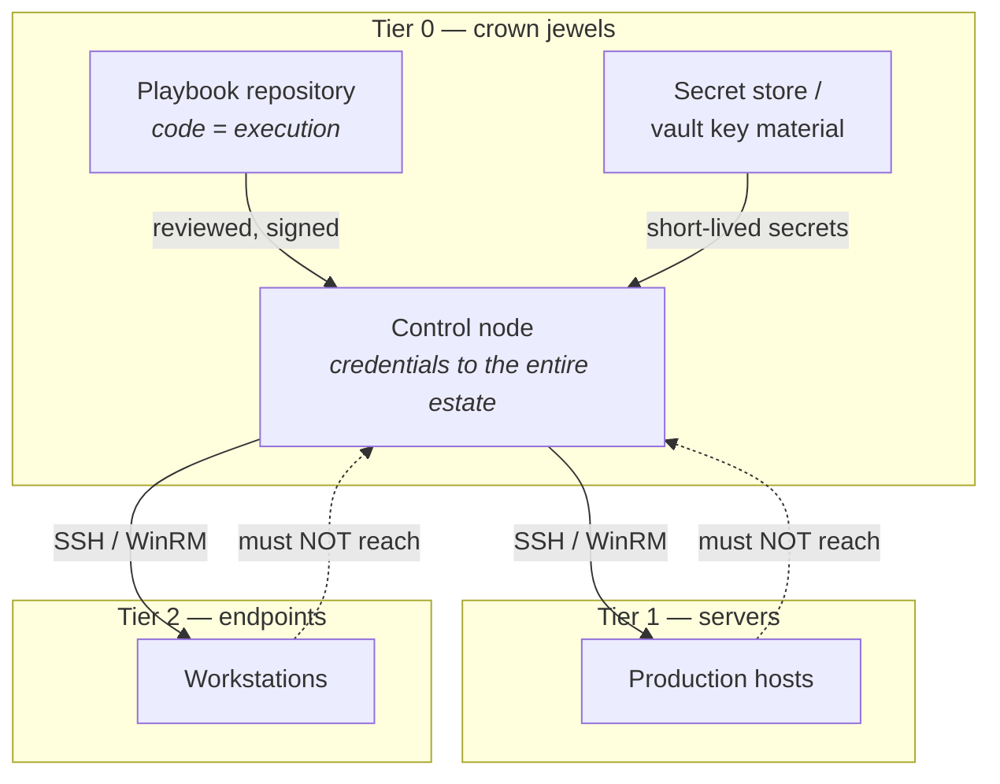
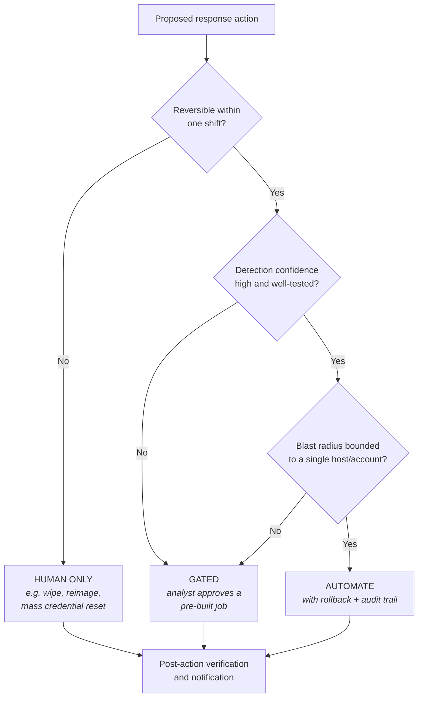
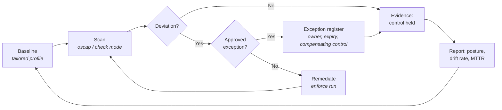

# EXT-ANS: Ansible for Security Operations & Continuous Compliance

> **Module type:** Extension module (elective deep dive)
> **Status:** Draft
> **Version:** v0.1
> **Last Reviewed:** 2026-08-13
> **Domain Expert:** _Unassigned — required before Practitioner Approved (security/platform engineering)_
> **Practitioner Reviewer:** _Unassigned — required before Practitioner Approved_

!!! warning "This is an extension module, not a credit-bearing unit"
    The degree is **66 units / 160 CP** and that structure is fixed (see
    [`docs/structure.md`](../structure.md); structural changes require the
    process in [`CONTRIBUTING.md`](../../CONTRIBUTING.md)). EXT-ANS sits
    **outside** that structure as an optional deep dive that extends
    [F03](../../core/units/F03-scripting-automation.md) and
    [SE05](../../degrees/strategic/security-engineering/SE05-security-cloud-devsecops.md).
    It carries no credit points and does not appear in
    [`docs/ksat-coverage.md`](../ksat-coverage.md) or the
    [Program Builder](../program-builder/index.md), both of which are generated
    from credit-bearing units only. If a delivery partner wants to award
    recognition for it, use the Tier 1 badge mechanism in
    [`docs/curriculum/micro-credentials-framework.md`](../curriculum/micro-credentials-framework.md).

---

## Overview

Most security teams already own the tooling that would let them harden ten thousand
hosts, contain a compromised endpoint in ninety seconds, and prove to an auditor that
a control has held continuously for a year. What they usually lack is the operating
model that makes using it safe. This module is about that gap.

Ansible is the worked example because it is free, agentless, readable, and already
present in most Australian enterprises — but the transferable content is the
**discipline**: how to express a security control as code, how to run that code
against production without becoming the incident, and how to turn every run into
evidence. The module treats configuration management as three things at once: a
**deployment** mechanism, a **response** mechanism, and a **continuous compliance**
mechanism. The same playbook that hardens a host can, in check mode, detect that the
host has drifted — and drift is either a change-management failure or an intruder.

F03 introduces Ansible in about a page: playbooks, idempotency, a two-run lab. SE05
introduces IaC scanning and pipeline gates. Neither has room for what practitioners
actually spend their time on — the containment playbook that must not cut off its own
SSH session, the STIG profile that is 400 rules long and 60 of which are wrong for
your estate, the exception register the auditor will ask for, and the uncomfortable
fact that the automation control node is the single most valuable target in the
organisation. That is this module.

---

## Where This Module Fits

| Unit | Relationship |
|---|---|
| [F03 — Scripting & Automation](../../core/units/F03-scripting-automation.md) | **Direct prerequisite.** Topic 4 and Lab 2 introduce Ansible, Terraform and Docker; EXT-ANS starts where they stop. |
| [F02 — Operating Systems & Administration](../../core/units/F02-operating-systems.md) | Linux/Windows administration assumed throughout. |
| [SE05 — Security in Cloud & DevSecOps](../../degrees/strategic/security-engineering/SE05-security-cloud-devsecops.md) | **Direct extension.** SE05 scans IaC for misconfiguration; EXT-ANS operates the remediation and drift loop behind it. |
| [SE04 — Detection & Response Engineering](../../degrees/strategic/security-engineering/SE04-detection-response-engineering.md) | Parts C and E — automated response, and detecting abuse of the automation platform. |
| [OC04 — Incident Response Lifecycle](../../core/units/OC04-incident-response-lifecycle.md) | Part C maps response actions onto the PICERL containment/eradication/recovery phases. |
| [DE02 — Data Sources & Log Engineering](../../degrees/operational/detection-engineering/DE02-data-sources-log-engineering.md) | Lab 7 deploys and verifies the telemetry DE02 depends on. |
| [DF05 — Incident Response Operations](../../degrees/operational/dfir/DF05-incident-response-operations.md) | Lab 6 — evidence collection at fleet scale, and its forensic limits. |
| [SC04 — Vendor & Supply Chain Risk](../../core/units/SC04-vendor-supply-chain-risk.md) | Topic 4 — Galaxy collections as a software supply chain. |
| [GR03 — Compliance Frameworks](../../degrees/strategic/grc/GR03-compliance-frameworks.md) · [GR05 — Audit & Assurance](../../degrees/strategic/grc/GR05-audit-assurance.md) | Part D — continuous compliance as auditable evidence. |

---

## Prerequisites

- **F03 — Scripting & Automation** (required; Topic 4 and Lab 2 in particular)
- **F02 — Operating Systems & Administration** (required)
- **F01 — Networking Fundamentals** (assumed: SSH, firewalls, routing)
- Working comfort with YAML, Git, and a Linux shell
- **OC04** or **DF05** recommended before Part C (automated response)

---

## Learning Outcomes

By the end of this module, students will be able to:

1. **Explain** the trust model of an agentless push-based automation platform and
   justify treating the control node as a Tier 0 asset.
2. **Implement** idempotent, check-mode-safe roles that function simultaneously as
   configuration enforcement and drift detection.
3. **Apply** blast-radius controls — inventory limits, canary rings, `serial`,
   assertions, and rollback paths — to automation that touches production.
4. **Analyse** a SCAP/STIG benchmark result to distinguish genuine control failures
   from tailoring artefacts, and produce a defensible exception register.
5. **Design** automated incident response actions with an explicit
   automate / gate / human-only decision boundary and a reversal path for each.
6. **Evaluate** the residual risk of an automation control plane against adversary
   abuse, and recommend hardening and detection controls.
7. **Assess** what an automated compliance programme can genuinely evidence against
   the ASD Essential Eight and the ISM — and state honestly what it cannot.
8. **Recommend** an operating model — ownership, review, testing, metrics and change
   control — for security automation in an Australian enterprise.

> **Bloom's note.** Outcomes span L3–L5 because the module bridges a Foundation unit
> (F03, L1–3) and a Major unit (SE05, L4–5). A delivery partner using this for Tier 1
> recognition against F03 should assess LO1–LO3; against SE05, LO4–LO8.

---

## AQF Level 7 Alignment

**Knowledge (AQF 7.1):** Develops specialised knowledge of configuration-as-code as a
security control surface — its enforcement, detection, evidentiary and adversarial
dimensions.

**Skills (AQF 7.2):** Develops technical skills (authoring roles, SCAP tooling,
response playbooks) and cognitive skills (judging what may be automated, interpreting
benchmark results against organisational context).

**Application (AQF 7.3):** Applies these to a realistic Australian estate with
initiative and judgement, under the accountability expectations of change management
and audit — including the judgement to *not* automate an irreversible action.

> This alignment statement is notional. EXT-ANS is not credit-bearing, so it has not
> been through the AQF mapping process in
> [`docs/compliance/aqf-teqsa.md`](../compliance/aqf-teqsa.md).

---

## Framework Mappings

### NIST NICE DCWF

| Framework | Version | Work Role | Code | T-Code | Task Description | Demonstrated In |
|---|---|---|---|---|---|---|
| NIST NICE DCWF | 2023 | System Administrator | OM-ADM-001 | T0431 | Automate system administration tasks across platforms | Lab 1 — Control Plane & Inventory; Lab 2 — Hardening Role |
| NIST NICE DCWF | 2023 | Security Control Assessor | SP-RSK-002 | T0177 | Assess controls against frameworks and identify gaps | Lab 3 — SCAP Baseline; Lab 9 — Essential Eight Evidence Pack |
| NIST NICE DCWF | 2023 | Cyber Defense Incident Responder | PR-CIR-001 | T0041 | Coordinate and perform incident handling across the lifecycle | Lab 5 — Automated Containment |
| NIST NICE DCWF | 2023 | Cyber Defense Incident Responder | PR-CIR-001 | T0278 | Collect and preserve evidence and establish an incident timeline | Lab 6 — Triage Collection at Scale |
| NIST NICE DCWF | 2023 | Cyber Defense Analyst | PR-CDA-001 | T0166 | Engineer correlation and automated response | Lab 7 — Telemetry Deployment; Lab 8 — Detecting Automation Abuse |
| NIST NICE DCWF | 2023 | Security Architect | SP-ARC-002 | T0050 | Design secure cloud/IaC configuration | Lab 4 — Continuous Compliance Pipeline; Summative Assessment |

### SFIA 9

| Skill | Code | Level | Demonstrated In |
|---|---|---|---|
| Configuration management | CFMG | Level 4 | Lab 1, Lab 2 |
| Security operations | SCAD | Level 4 | Lab 5, Lab 6 |
| Continuity management / service resilience | COPL | Level 4 | Lab 5 (rollback and recovery paths) |
| Conformance review | CORE | Level 4 | Lab 3, Lab 4, Lab 9 |
| Systems & software life cycle / assurance | SURE | Level 4 | Lab 8, Summative |

> SFIA code/level assignments here are the module author's reading and are
> **provisional** pending Framework Custodian review, consistent with the treatment of
> mappings elsewhere in the repository.

### ASD Cyber Skills Framework

| Domain | Sub-domain | Proficiency | Demonstrated In |
|---|---|---|---|
| Secure Systems | Secure Configuration & Hardening | Practitioner–Advanced | Lab 2, Lab 3, Lab 9 |
| Defensive Operations | Incident Response | Practitioner | Lab 5, Lab 6 |
| Security Architecture | Automation & Platform Security | Practitioner–Advanced | Lab 1, Lab 8 |

### MITRE ATT&CK

Techniques relevant to **abuse of** the automation platform (Topic 13, Lab 8):

| Technique | ID | Relevance |
|---|---|---|
| Software Deployment Tools | T1072 | The core technique: adversary uses a legitimate configuration-management or deployment system to execute at scale. |
| Valid Accounts | T1078 | Compromised automation service accounts, which are typically highly privileged and rarely rotated. |
| Remote Services: SSH | T1021.004 | The transport Ansible uses; adversary reuse of the same key material. |
| Unsecured Credentials: Credentials In Files | T1552.001 | Vault passwords, `ansible.cfg`, and plaintext `group_vars` in repositories. |
| Supply Chain Compromise: Compromise Software Supply Chain | T1195.002 | Malicious or typosquatted Galaxy collections and roles. |
| Scheduled Task/Job: Cron | T1053.003 | Persistence commonly deployed — and commonly removed — via automation. |
| Create or Modify System Process: Systemd Service | T1543.002 | As above, for service-based persistence. |

> ATT&CK technique IDs are stated against **v19** for consistency with the rest of the
> repository. Both the version pin and these specific IDs are **provisional pending
> Framework Custodian verification**.

### NICE/DCWF KSATs

> Knowledge, Skills, Abilities and Tasks developed in this module, each tied to
> evidence. IDs are project-local and provisional. **These do not feed
> [`docs/ksat-coverage.md`](../ksat-coverage.md)** — that map is generated from
> credit-bearing units only.

| Type | ID | Statement | Demonstrated In |
|---|---|---|---|
| Knowledge | EXT-ANS-K01 | Knowledge of agentless push-based automation trust models and control-node risk | Topic 1; Lab 1 |
| Knowledge | EXT-ANS-K02 | Knowledge of idempotency, check mode, and configuration drift as a security signal | Topic 3; Lab 2 |
| Knowledge | EXT-ANS-K03 | Knowledge of SCAP components (XCCDF, OVAL, data streams) and STIG/benchmark structure | Topic 10; Lab 3 |
| Knowledge | EXT-ANS-K04 | Knowledge of automated response action taxonomy and reversibility | Topic 6; Lab 5 |
| Knowledge | EXT-ANS-K05 | Knowledge of ASD Essential Eight and ISM expectations for automated enforcement and evidence | Topic 12; Lab 9 |
| Skill | EXT-ANS-S01 | Skill in authoring idempotent, check-mode-safe hardening roles | Lab 2 |
| Skill | EXT-ANS-S02 | Skill in running SCAP scans and generating/applying benchmark remediation | Lab 3; Lab 4 |
| Skill | EXT-ANS-S03 | Skill in building guarded containment playbooks with rollback paths | Lab 5 |
| Skill | EXT-ANS-S04 | Skill in collecting forensic artefacts at scale with chain-of-custody integrity | Lab 6 |
| Ability | EXT-ANS-A01 | Ability to constrain blast radius when automating against production | Topic 2; Lab 5 |
| Ability | EXT-ANS-A02 | Ability to distinguish genuine control failure from benchmark tailoring artefact | Lab 3; Formative 2 |
| Ability | EXT-ANS-A03 | Ability to threat-model and defend an automation control plane | Topic 13; Lab 8 |
| Ability | EXT-ANS-A04 | Ability to produce auditor-ready compliance evidence and an honest gap statement | Lab 9; Summative |
| Task | T0431 | Automate system administration tasks across platforms | Lab 1; Lab 2 |
| Task | T0177 | Assess controls against frameworks and identify gaps | Lab 3; Lab 9 |
| Task | T0041 | Coordinate and perform incident handling across the lifecycle | Lab 5 |
| Task | T0278 | Collect and preserve evidence and establish an incident timeline | Lab 6 |
| Task | T0166 | Engineer correlation and automated response | Lab 7; Lab 8 |
| Task | T0050 | Design secure cloud/IaC configuration | Lab 4; Summative |

---

## Module Structure

| Part | Topics | Labs | Notional hours |
|---|---|---|---|
| **A — Trustworthy automation** | 1–3 | 1, 2 | 12 |
| **B — Deployment & supply chain** | 4–5 | 2 | 8 |
| **C — Security operations** | 6–9 | 5, 6, 7 | 20 |
| **D — Continuous compliance** | 10–12 | 3, 4, 9 | 20 |
| **E — Governing the platform** | 13 | 8 | 10 |
| | | | **~70 hours** |

---

## Safety, Authorisation & Blast Radius

Read this before any lab. Everything in Parts C–E is dual-use.

Automation multiplies intent. A playbook that disables one account disables ten
thousand just as easily, and a containment action that severs network access is
functionally a denial-of-service attack that you have authorised against yourself.
Several of the highest-impact IT outages on public record were configuration or
deployment changes pushed at scale, not intrusions.

**Rules for this module:**

1. **Labs run only against infrastructure you own or have written authorisation to
   test.** Lab 8 in particular simulates adversary abuse of a control node — run it
   only inside your isolated lab. This is the same authorisation boundary as
   [F05](../../core/units/F05-legal-ethics-compliance.md) and
   [CE01](../../degrees/operational/cte/CE01-offensive-foundations-ethics.md); the
   *Criminal Code Act 1995* (Cth) Part 10.7 offences turn on unauthorised access and
   impairment, and "it was a playbook" is not a defence.
2. **Default to `--check --diff`.** Every lab is written so that the detection pass
   precedes the enforcement pass.
3. **Always bound the target set.** `--limit` is not optional in this module. An
   unbounded `hosts: all` in a response playbook is treated as a defect in
   assessment.
4. **Every destructive action needs a documented reversal** before it is written.
5. **Never commit real credentials, keys or vault passwords.** Lab repositories are
   checked for this at assessment.

---

## Topics

### Topic 1: The Automation Control Plane as a Security System

Ansible's design decisions have direct security consequences. It is **agentless** —
no persistent daemon on the target to be exploited, no agent fleet to patch — but
that only relocates the risk. To manage a host without an agent, the control node
must hold credentials that can reach it and escalate on it. Aggregate that across an
estate and the control node holds, in one place, the ability to execute arbitrary
code as root on everything.

That makes it a **Tier 0 asset**: in the same trust class as a domain controller or a
certificate authority, and it is very frequently not treated that way. It commonly
lives on a shared jump box, is administered by whoever needed it most recently, and
authenticates to production with a passphrase-less key that has existed since the
platform was stood up.

The **push** model has a second consequence. Nothing happens unless someone runs it,
which means configuration is only as current as the last run. A host that missed the
last three runs is silently non-compliant, and "silently" is the operative word: pull
agents report their own absence, push systems do not. Tracking *coverage* — which
hosts have actually been converged, and when — is therefore itself a security control.

**Key concepts:**

- Agentless push architecture: what it removes from the attack surface, and what it
  concentrates
- The control node as Tier 0; administrative tiering and separation of duties
- Convergence coverage and staleness as a security metric, not an ops metric
- Transport trust: SSH host keys, WinRM/Kerberos, and the jump-host pattern



---

### Topic 2: Inventory as Security Truth

The inventory decides who gets changed. In practice, most automation incidents are
not bad tasks — they are good tasks pointed at the wrong hosts.

A security-grade inventory is **generated, not typed**. Static INI files drift from
reality within weeks; dynamic inventory sourced from a CMDB, cloud API or directory
stays current, and — critically — makes the *absence* of a host visible. Groups
should encode the properties security decisions depend on: exposure (internet-facing
or not), data classification, criticality, patch ring, and platform. `group_vars` and
`host_vars` then let one role express one control while the *values* vary by risk
tier — a jump host and a developer laptop can share a hardening role and disagree
about what an acceptable SSH cipher list is.

Blast-radius control is inventory control. `--limit` narrows the target set;
`serial:` converts a fleet-wide change into a rolling one; `max_fail_percentage`
stops a rollout when a canary batch fails; `any_errors_fatal: true` refuses to
continue past an error on a play where partial application would be worse than none.

**Key concepts:**

- Dynamic inventory as the security source of truth; staleness detection
- Grouping by exposure, classification, criticality and patch ring
- `group_vars`/`host_vars`: one control, risk-tiered values
- Blast radius: `--limit`, `serial`, `max_fail_percentage`, `any_errors_fatal`,
  `run_once`
- Canary rings and progressive rollout as safety, not just as devops practice

---

### Topic 3: Idempotency, Check Mode, and the Detect/Enforce Duality

This is the central idea of the module, and it is worth stating plainly:

> A correctly written idempotent role is simultaneously a **compliance scanner** and
> a **remediation tool**. Run it with `--check --diff` and it reports every deviation
> from the intended state without changing anything. Run it normally and it corrects
> them.

That duality is what makes configuration-as-code a *continuous* compliance mechanism
rather than a point-in-time deployment mechanism. It also produces a genuinely useful
security signal: a host that reports `changed` on a role that was applied last week
has drifted. That drift has exactly three causes — an authorised change that bypassed
automation, an unauthorised change by an administrator, or an intruder. All three are
worth an alert; the third is worth a page.

Getting this right requires discipline. `command` and `shell` tasks are not
idempotent by default and are invisible to check mode unless you tell them what
"changed" means. Every raw command in a hardening role needs `changed_when`,
`check_mode: false` where it is a read-only probe, and `failed_when` where a non-zero
exit is expected. A role full of unqualified `shell:` tasks reports "changed" on
every run, which trains everyone to ignore the signal.

**Key concepts:**

- Idempotency as a security property, not a tidiness property
- `--check` / `--diff` as detection; the same code as enforcement
- Drift triage: authorised bypass vs unauthorised change vs compromise
- Taming `command`/`shell`: `changed_when`, `failed_when`, `check_mode`
- Handlers, tags, and why `--tags audit` should be safe to run at any time

---

### Topic 4: Roles, Collections, and the Automation Supply Chain

Ansible content is downloaded code that runs as root on everything. That framing is
usually missing from the conversation.

`ansible-galaxy` pulls roles and collections from public sources. A `requirements.yml`
without pinned versions resolves to "whatever was published this morning". Names are
typosquattable, maintainership transfers quietly, and a collection can execute
arbitrary Python on the control node during a run. This is the same class of risk that
[SC04](../../core/units/SC04-vendor-supply-chain-risk.md) treats for software
dependencies, applied to a dependency with root on the estate.

Practical controls: pin to explicit versions or commit SHAs; verify checksums or
signatures where the source supports it; vendor critical collections into your own
repository and update them deliberately; run an internal Galaxy mirror or Automation
Hub so builds do not reach the internet; and review third-party role diffs on upgrade
the way you would review application dependencies. Prefer `ansible.builtin` and the
well-maintained core collections over a bespoke role from an unmaintained GitHub
account.

**Key concepts:**

- Roles, collections, FQCNs and `requirements.yml`
- Version pinning, vendoring, checksum/signature verification, internal mirrors
- Typosquatting and maintainer-transfer risk (ATT&CK T1195.002)
- Testing content before it reaches production: Molecule, `ansible-lint`, CI
- Reviewing a third-party hardening role rather than trusting its README

---

### Topic 5: Secrets, Privilege, and Least-Privilege Automation

The most common serious finding in an automation review is a single shared
`root`-capable key, used by everything, held by everyone, and never rotated.

`ansible-vault` encrypts variables and files at rest, which solves the "secrets in
Git" problem and nothing else — the vault password itself must then be protected, and
`--vault-password-file` pointing at a world-readable file on a shared box is a common
own-goal. Better patterns pull short-lived secrets from an external store at run time,
so nothing long-lived sits in the repository or on disk.

Privilege should be scoped per purpose. A compliance-scanning identity needs read
access and nothing else. A patching identity needs package management and reboot. A
containment identity needs firewall and account control. Splitting these means a
compromised scanning credential cannot contain — or ransom — the estate. On Linux,
express this through narrowly scoped `sudo` rules rather than blanket `NOPASSWD: ALL`;
prefer SSH certificates from a short-lived CA over distributed static public keys, so
revocation is possible.

`no_log: true` prevents secrets being echoed into job output and logs — and job output
is frequently shipped to a SIEM that many more people can read than can read the vault.

**Key concepts:**

- `ansible-vault`, and where it stops helping
- External secret stores and run-time secret injection
- Purpose-scoped automation identities (scan / patch / deploy / contain)
- `become`, scoped `sudo`, and avoiding `NOPASSWD: ALL`
- SSH certificate authorities and revocation; `no_log` and log hygiene

---

### Topic 6: Automated Response Actions — Taxonomy and Decision Boundary

Automated response is where security automation earns its reputation, in both
directions. Containing a host in ninety seconds instead of ninety minutes materially
changes an incident's outcome. Containing the *wrong* host — or every host — during a
false positive at 3am creates one.

Map response actions to the PICERL phases from
[OC04](../../core/units/OC04-incident-response-lifecycle.md):

| Phase | Representative automated actions | Typical reversibility |
|---|---|---|
| **Containment** | Host network isolation; disable account; kill process; block hash/IP; revoke tokens/sessions | High — usually reversible in minutes |
| **Eradication** | Remove persistence (cron, systemd unit, run key, scheduled task); remove implant; rotate credentials | Medium — removal is easy, but destroys evidence |
| **Recovery** | Reapply baseline; re-enable access; verify telemetry restored | High |
| **Lessons learned** | Deploy new detection; harden the exploited control; close the drift that allowed it | High |

The decision that matters is not *can* this be automated but *should* it be, and the
useful axis is **reversibility × confidence × blast radius**:



Three engineering requirements follow. **Every automated action needs a paired
reversal playbook, written first.** **Every action needs an audit trail** that records
who or what triggered it, against which target, with which parameters, and what
changed — this is what the post-incident review and the regulator will ask for.
**Every action needs a guard**: an `assert` block that refuses to run without an
incident reference and refuses to touch a protected-host list. Guards are cheap and
they are the difference between a bad night and a resume-generating event.

Triggering is normally either an analyst launching a pre-built job template with a
constrained survey, or a SOAR/SIEM webhook invoking a job via API. The AWX/Ansible
Automation Platform workflow **approval node** is the standard mechanism for the
"gated" class: the job is fully built and queued, and waits for a human to press
approve.

**Key concepts:**

- Containment/eradication/recovery action taxonomy
- The automate / gate / human-only boundary and how to justify it to a CISO
- Paired reversal playbooks; guards via `assert`; protected-host lists
- Audit trail requirements for post-incident and regulatory review
- Trigger paths: analyst-launched job templates, SOAR webhooks, approval nodes
- **Containment destroys evidence** — sequence collection before eradication (Topic 7)

---

### Topic 7: Evidence Collection at Scale — and Its Limits

Automation is excellent at collecting the same triage artefacts from four hundred
hosts in five minutes. It is a poor substitute for forensic imaging, and confusing
the two damages investigations.

The honest framing: **running Ansible against a host changes that host.** It
authenticates (writing auth logs), spawns processes, writes temporary files, and
updates access timestamps. For a triage sweep — "which of these hosts show this
persistence mechanism?" — that is an acceptable and well-understood cost. For a host
that will be the subject of legal proceedings, it is contamination, and the correct
answer is to isolate the host and image it properly per
[DF01](../../degrees/operational/dfir/DF01-dfir-process-legal-foundations.md).

Where automation *does* fit DFIR:

- **Broad triage sweeps** — hash a file across the estate, look for a registry key,
  enumerate scheduled tasks, list listening sockets. Read-only, `changed_when: false`.
- **Structured artefact collection** — pull auth logs, shell histories, systemd unit
  files, browser artefacts to a central collection point with `fetch`.
- **Integrity preservation** — hash on the target *before* transfer, hash again after,
  and record both. That comparison is the chain-of-custody evidence that the artefact
  you analysed is the artefact that existed on the host.
- **Order of volatility** — collect volatile data (connections, processes, memory)
  before non-volatile, and collect *before* containment where the containment action
  would destroy it.

Memory acquisition is possible via automation (AVML on Linux, WinPmem on Windows) but
should be a deliberate, per-host decision, not a fleet sweep — the transfer volume
alone will be noticed.

**Key concepts:**

- Triage sweep vs forensic acquisition — when automation is and is not appropriate
- Read-only task discipline; `changed_when: false`, `check_mode: false`
- `fetch`, central collection, and hash-before/hash-after chain of custody
- Order of volatility, and sequencing collection before containment
- Documenting automation's own footprint in the incident record

---

### Topic 8: Deploying and Verifying Detection Telemetry

Detection engineering ([DE02](../../degrees/operational/detection-engineering/DE02-data-sources-log-engineering.md),
[SE04](../../degrees/strategic/security-engineering/SE04-detection-response-engineering.md))
assumes the telemetry arrives. Configuration management is how it arrives — and, more
importantly, how you find out when it stops.

**Telemetry drift is a silent detection failure.** An agent that stopped, a log
shipper whose config was reverted by a rebuild, an auditd ruleset overwritten by a
package upgrade, a Sysmon configuration two versions behind the detections written
against it — none of these generate an alert. They generate *silence*, which looks
exactly like safety. A fleet where 6% of hosts stopped forwarding is a fleet with a 6%
blind spot that nobody chose.

So deployment is only half the job. The role should deploy the configuration **and
verify the telemetry is observable downstream** — emit a canary event and confirm it
lands in the platform. That closes the loop from "the config file is correct" to "the
detection would actually fire", which are very different claims.

**Key concepts:**

- Deploying auditd rules, Sysmon configuration, osquery packs, log shippers
- Configuration validation before restart (`auditctl -R`, `sshd -t`, shipper `--dry-run`)
- Telemetry drift as a silent blind spot; coverage as a reported metric
- Canary-event verification: proving the pipeline end to end, not just the file
- Versioning detection content alongside the roles that deploy it

---

### Topic 9: Patch and Vulnerability Response at Fleet Scale

Patching is the most automatable Essential Eight strategy and the one where automation
most often fails politically rather than technically — because the first unscheduled
reboot of a production database ends the programme.

The engineering pattern is **rings**: canary → non-production → low-criticality
production → the rest, with a soak period between rings and automatic halt on failure.
Reboots are coordinated, not incidental: detect whether one is required, respect
maintenance windows, drain the node from its load balancer or cluster first, reboot,
wait for the host to return, and verify the service is healthy before proceeding to
the next. `serial:` plus `max_fail_percentage:` plus a health-check task is the whole
mechanism.

Emergency patching — the ACSC advisory on a Friday afternoon for an internet-facing
appliance — is a different playbook with a different risk calculus, and it should
already exist and already have been rehearsed. Writing it during the incident is how
mistakes happen.

Finally, patching must **report back**. The vulnerability management process needs to
know which hosts were patched, which failed, which are pending a maintenance window,
and which are exceptions. An automated patch run that produces no machine-readable
result has not closed the loop.

**Key concepts:**

- Patch rings, soak periods, canaries, automatic halt
- Reboot coordination: detection, draining, health verification, `serial`
- Emergency patch playbooks — pre-built and rehearsed
- Reporting results back into vulnerability management
- Where automation cannot reach: appliances, OT, unmanaged and BYO devices

---

### Topic 10: STIGs, SRGs, Benchmarks and SCAP

A **STIG** (Security Technical Implementation Guide) is a hardening standard published
by the US Defense Information Systems Agency for a specific product — an operating
system, browser, or database. An **SRG** (Security Requirements Guide) is the
technology-class-level document a STIG is derived from. Findings carry severity
categories **CAT I** (highest — direct loss of confidentiality, integrity or
availability), **CAT II**, and **CAT III**. **CIS Benchmarks** are the other widely
used corpus, community-developed, usually with Level 1 (broadly safe) and Level 2
(defence-in-depth, more likely to break things) profiles.

**SCAP** (Security Content Automation Protocol) is what makes these machine-readable:

| Component | Role |
|---|---|
| **XCCDF** | The checklist — rules, groups, profiles, and their descriptions |
| **OVAL** | The assessment logic — how to actually test whether a rule passes |
| **CPE** | Platform identification — does this content apply to this host |
| **Data stream** (`*-ds.xml`) | The bundle that ships all of the above together |

**OpenSCAP** (`oscap`) is the free scanner. The **SCAP Security Guide** (SSG), built by
the open-source **ComplianceAsCode** project, ships data streams for common Linux
distributions with profiles including STIG and CIS — and, crucially for this module,
can *generate Ansible remediation content directly from a profile*. That is the
mechanism that turns a benchmark into an enforceable role.

Two honest caveats. First, **a benchmark is not your policy.** Profiles are written for
a generic system; a meaningful fraction of rules will be inapplicable, already
satisfied by a compensating control, or actively harmful in your environment. Applying
a STIG profile wholesale to a running estate is a reliable way to break it.
**Tailoring** — documented, reviewed selection and parameterisation of rules — is
mandatory professional practice, not laziness. Second, **STIGs are a US Department of
Defense artefact.** They are an excellent, freely available hardening corpus, but no
Australian entity is assessed against them (see Topic 12).

**Key concepts:**

- STIG vs SRG vs CIS Benchmark; CAT I/II/III severities
- SCAP components: XCCDF, OVAL, CPE, data streams
- OpenSCAP scanning; SSG/ComplianceAsCode profiles and generated Ansible remediation
- Tailoring, and why an untailored profile is a production incident waiting to happen
- Free STIG/CIS role collections (e.g. the `ansible-lockdown` project) as an alternative
  to generated content

---

### Topic 11: The Continuous Compliance Loop

Point-in-time compliance is a photograph of a system that has since changed. The
purpose of automation here is to convert an annual assertion into a continuous one.



Two mechanisms produce the "scan" step, and mature programmes use both. `oscap`
against a data stream gives you an externally recognised, auditor-legible result tied
to a published benchmark. Your own roles in `--check --diff` mode give you a result
tied to *your* policy, including controls no benchmark covers. The first is better
evidence; the second is better coverage.

The **exception register** is where compliance programmes are won or lost. Every
accepted deviation needs a named owner, a documented business justification, a
compensating control, and — non-negotiably — an **expiry date**. Exceptions without
expiry become permanent, and a register full of permanent exceptions is how a
"compliant" system ends up breached.

Useful metrics, all of which fall out of the loop for free: percentage of fleet
converged in the last N days, drift rate per control (which controls keep breaking, and
why), mean time to remediate, exception count and age distribution, and scan coverage
(what fraction of the estate is even being assessed — usually the most alarming number).

**Key concepts:**

- Scan → tailor → remediate → re-scan → evidence, as a scheduled loop
- Benchmark scanning vs check-mode scanning: evidence quality vs coverage
- The exception register: owner, justification, compensating control, expiry
- Compliance metrics: convergence, drift rate, MTTR, exception ageing, scan coverage
- **Compliant ≠ secure** — the map is not the territory, and auditors know it

---

### Topic 12: The Essential Eight, the ISM, and What Automation Can Actually Prove

Australian entities are not assessed against STIGs. They are assessed against the
**ASD Essential Eight Maturity Model**, the **Information Security Manual (ISM)**, and
— for non-corporate Commonwealth entities — the **Protective Security Policy Framework
(PSPF)**. Systems handling government data may be assessed by an **IRAP** assessor,
who will want evidence, not assertions. This is the practical Australian framing of
everything in Part D.

The Essential Eight comprises eight mitigation strategies, assessed at Maturity Levels
ML0–ML3: application control; patch applications; configure Microsoft Office macro
settings; user application hardening; restrict administrative privileges; patch
operating systems; multi-factor authentication; and regular backups. The higher
maturity levels prescribe patching timeframes measured in days for internet-facing
services with known exploits — timeframes that are difficult to meet manually at fleet
scale and straightforward to meet with rings and automation. That is the strongest
business case for this entire module.

Being precise about what automation delivers per strategy matters, because overclaiming
to an assessor is worse than a known gap:

| Essential Eight strategy | Automation can **enforce** | Automation can **evidence** | Residual gap |
|---|---|---|---|
| Application control | Policy deployment (AppLocker/WDAC, fapolicyd) and its configuration state | Policy present, correct and unchanged; ruleset version | Whether the ruleset is *effective* — needs testing, not configuration |
| Patch applications | Package/app updates on managed platforms; ring rollout | Patch level per host, time-to-patch, exceptions | Unmanaged, BYO, appliance and OT devices |
| Office macro settings | Registry/policy enforcement of macro configuration | Setting state across the fleet, continuously | User-level workarounds; unmanaged tenancies |
| User application hardening | Browser/PDF/runtime configuration and feature removal | Configuration state and drift history | Third-party apps outside the managed set |
| Restrict admin privileges | Local group membership, `sudo` policy, JIT integration hooks | Who holds privilege, and when it changed | Directory-level and cloud role assignment (partially) |
| Patch operating systems | OS patching with coordinated reboot | Patch level, currency, reboot compliance | Systems that cannot take a reboot window |
| Multi-factor authentication | Client/agent config and enforcement settings on managed hosts | Configuration state; enrolment where queryable | MFA is largely an IdP control — automation evidences the edge, not the core |
| Regular backups | Backup agent configuration and schedule | Configuration and job state | **Restore testing** — the part that actually matters, and the part configuration state cannot prove |

Two lines from that table are worth internalising. Automation proves **configuration
state** extremely well and **control effectiveness** hardly at all. A backup job
configured correctly is not a backup that restores. An application control policy
deployed correctly is not an application control policy that blocks the thing you care
about. Mature programmes pair configuration evidence with **effectiveness testing** —
which is precisely the purple-team work in
[CE04](../../degrees/operational/cte/CE04-purple-team-operations.md).

The ISM is a large, regularly updated control catalogue; ASD publishes it in
machine-readable form, which makes mapping roles to control identifiers tractable —
but the identifiers change between releases, so any mapping needs a maintenance owner.
Under the **Security of Critical Infrastructure Act 2018 (Cth)**, responsible entities
for critical infrastructure assets carry risk-management-programme and mandatory cyber
incident reporting obligations on short statutory timeframes, which raises the value of
pre-built, rehearsed response automation considerably.

> **Verify before relying on any of this.** E8 maturity-level requirements, ISM control
> identifiers, PSPF requirements and SOCI reporting timeframes all change. Students must
> check the current published sources rather than this table. See *Verification Status*
> below.

**Key concepts:**

- E8 / ISM / PSPF / IRAP as the Australian assurance context; STIGs as a hardening
  corpus rather than a local requirement
- Per-strategy honesty about enforce vs evidence vs gap
- Configuration state ≠ control effectiveness; pairing with purple-team testing
- Mapping roles to ISM controls, and owning that mapping through ISM releases
- SOCI Act obligations as a driver for rehearsed response automation

---

### Topic 13: Governing and Defending the Automation Platform

The final topic inverts the module: what happens when the adversary gets the control
node.

The answer is that they get everything, immediately, using entirely legitimate
tooling. ATT&CK calls this **T1072 — Software Deployment Tools**, and it is attractive
precisely because it is quiet: the traffic is expected, the credentials are valid, the
process tree is normal, and the resulting mass change looks like a Tuesday deployment.
Several significant real-world intrusions have used deployment and management systems
as the distribution mechanism for exactly this reason.

Defending it needs three layers. **Prevent**: tier the control node, restrict inbound
administrative access, use short-lived credentials and scoped identities (Topic 5),
require code review and CI on the playbook repository so no one can push a change that
runs unreviewed, and separate the authority to *write* automation from the authority to
*run* it in production. **Detect**: alert on runs outside change windows, on unusually
broad target sets, on new or modified job templates, on direct execution bypassing the
platform, and on control-node authentication anomalies. Job-run telemetry belongs in the
SIEM with the same seriousness as domain controller logs. **Limit**: assume compromise
and constrain what a single run can do — protected-host lists, approval gates for
high-impact templates, and rate limits on fleet-wide execution.

Governance closes it. Playbooks are production code and belong under the same change
control as application deployments: version-controlled, peer-reviewed, tested
(`ansible-lint`, Molecule), promoted through environments, and owned by a named team.
The operating-model questions — who may write, who may approve, who may run, who
reviews the audit trail, and how emergency bypass works — are the ones a CISO will
actually ask, and the ones this module expects students to answer.

**Key concepts:**

- Automation platform compromise as a mass-execution vector (T1072 and related)
- Prevent: tiering, scoped identities, code review, write/run separation
- Detect: job telemetry in the SIEM, out-of-window and broad-target alerting
- Limit: protected-host lists, approval gates, execution rate limits
- Governance: playbooks as production code — review, test, promote, own
- Metrics that a CISO will act on; emergency bypass and its audit

---

## Labs & Exercises

All labs run locally on free/open-source tooling within the project's standard lab
specification (8 GB RAM, 4-core CPU, 50 GB disk). No cloud account and no commercial
licence is required at any point.

---

### Lab 1: Build a Trustworthy Control Plane

**Objective:** Stand up a control node and a small managed estate, establish
least-privilege access and encrypted secrets, and prove the detect/enforce duality
before writing any security content.

**Prerequisites:** Topics 1–3; F03 Lab 2

**Environment:**

- Operating System: Ubuntu 22.04 LTS VM (control node)
- Managed nodes: 3 × containers or lightweight VMs (Docker, LXD, Multipass or Vagrant)
- Tools: `ansible-core`, `ansible-lint`, `git`, `ssh-keygen` — all free/OSS
- Minimum hardware: 6 GB RAM / 2 vCPU / 25 GB disk

**Instructions:**

1. Create three managed nodes representing different risk tiers — `web01`
   (internet-facing), `db01` (internal, sensitive), `jump01` (administrative).
2. Create a dedicated `automation` account on each managed node. Grant it `sudo` via a
   **scoped** rule permitting only package management and service control — do **not**
   use `NOPASSWD: ALL`. Record the rule you used.
3. Generate a passphrase-protected SSH key pair for the control node and distribute the
   public key. Confirm password authentication is disabled for the automation account.
4. Write an inventory that groups hosts by exposure and criticality, for example:

    ```yaml
    all:
      children:
        internet_facing:
          hosts: { web01: {} }
        internal_sensitive:
          hosts: { db01: {} }
        tier0:
          hosts: { jump01: {} }
      vars:
        ansible_user: automation
    ```

5. Add `group_vars/internet_facing.yml` and `group_vars/internal_sensitive.yml` that set
   the *same* variable (e.g. `ssh_allowed_ciphers`) to different values. This proves one
   role can serve multiple risk tiers.
6. Create an `ansible-vault` encrypted file holding a dummy secret. Confirm it is
   unreadable in the repository and that `git log -p` never exposes it.
7. Write a minimal play that sets a banner file. Run it three ways and record the
   output of each:
   `--check --diff` (expect: reports the change, makes none) → normal run
   (expect: `changed`) → normal run again (expect: `ok`, zero changed).
8. Deliberately break idempotency: add a `shell:` task with no `changed_when`. Re-run
   and observe it reports `changed` forever. Then fix it with `changed_when:` and
   re-run. Explain in your notes why the broken version destroys the drift signal.
9. Run `ansible-lint` over the repository and resolve the findings.

**Expected Output:**

A Git repository containing a risk-tiered inventory, tiered `group_vars`, a vault-
encrypted secret, and a lint-clean play. Evidence of the three-run sequence showing
check mode reporting without changing, first run changing, and second run reporting
zero changes. A written explanation of the broken-vs-fixed `shell` task and its effect
on drift detection. No secrets, keys or vault passwords in Git history.

**Reflection Questions:**

1. Your control node can now execute as root on three hosts. List the three controls you
   would add first if this were three thousand production hosts, and justify the order.
2. Why is a scoped `sudo` rule meaningfully better than `NOPASSWD: ALL`, given the
   automation account can already change service configuration?
3. What would tell you that a managed host had stopped being converged, and how long
   would it take you to notice today?

---

### Lab 2: A Hardening Role That Detects and Enforces

**Objective:** Build a hardening role that functions as both compliance scanner and
remediation tool, then use it to detect injected drift.

**Prerequisites:** Lab 1; Topics 3–5

**Environment:** As Lab 1

**Instructions:**

1. Create a role `baseline_hardening` with the standard structure
   (`tasks/`, `handlers/`, `defaults/`, `templates/`, `meta/`).
2. Implement at least six controls across these areas, each parameterised through
   `defaults/main.yml` so risk tiers can differ: SSH daemon configuration
   (root login, password authentication, ciphers); password/lockout policy; unnecessary
   service removal; kernel parameters via `sysctl`; file permissions on sensitive paths;
   and audit logging enabled.
3. Every file-modifying task must use a validator where one exists, so a bad template can
   never take down the service:

    ```yaml
    - name: Enforce SSH daemon configuration
      ansible.builtin.template:
        src: sshd_config.j2
        dest: /etc/ssh/sshd_config
        owner: root
        group: root
        mode: "0600"
        validate: /usr/sbin/sshd -t -f %s
      notify: Restart sshd
    ```

4. Add an audit-only entry point (`--tags audit`) that is guaranteed safe to run at any
   time. Any command-based check within it must set `changed_when: false` and
   `check_mode: false`.
5. Apply the role to all three hosts. Confirm a second run reports zero changes.
6. **Inject drift** on `web01` by hand: re-enable `PermitRootLogin`, loosen permissions
   on a sensitive file, and start a service you removed.
7. Run the role with `--check --diff --limit web01`. Capture the output. Confirm it
   identifies all three deviations and changes nothing.
8. Write a short drift-triage note for each finding, classifying it as authorised
   bypass, unauthorised administrative change, or possible compromise — and state what
   additional evidence would let you decide.
9. Enforce, re-scan, and confirm the estate returns to zero-drift.

**Expected Output:**

A parameterised, lint-clean, idempotent role; evidence of zero-change convergence; the
`--check --diff` output identifying all three injected deviations; and the drift-triage
note. The role must behave differently on `internet_facing` and `internal_sensitive`
hosts purely through `group_vars`.

**Reflection Questions:**

1. You now have a control that detects unauthorised change on every managed host. What
   would you have to build to turn that into an alert a SOC analyst receives, and why is
   the frequency of that scan a security decision?
2. One of your injected changes might have been a legitimate emergency fix. How should
   the process handle that without either ignoring drift or punishing responders?
3. Which of your six controls would be genuinely dangerous to enforce automatically
   across production without a canary, and why?

---

### Lab 3: SCAP Baseline — Scan, Tailor, Remediate, Re-scan

**Objective:** Run a benchmark scan against a published profile, generate Ansible
remediation from it, tailor it defensibly, apply it, and produce a before/after delta.

**Prerequisites:** Lab 2; Topic 10

**Environment:**

- Ubuntu 22.04 LTS VM plus at least one managed node
- Tools: `openscap-scanner` (`oscap`), `ssg-base` / SCAP Security Guide content,
  `ansible-core` — all free/OSS
- Minimum hardware: 6 GB RAM / 2 vCPU / 30 GB disk
- *Note:* SSG content path and available profiles vary by distribution and version.
  List what is actually present before assuming a profile name.

**Instructions:**

1. Locate the SSG data stream for your distribution (commonly under
   `/usr/share/xml/scap/ssg/content/`, e.g. `ssg-ubuntu2204-ds.xml`).
2. Enumerate the available profiles — do not assume:

    ```bash
    oscap info /usr/share/xml/scap/ssg/content/ssg-ubuntu2204-ds.xml
    ```

3. Run a baseline evaluation, keeping both machine-readable results and a human report:

    ```bash
    sudo oscap xccdf eval \
      --profile <profile_id_from_step_2> \
      --results  /var/log/scap/baseline-results.xml \
      --report   /var/log/scap/baseline-report.html \
      /usr/share/xml/scap/ssg/content/ssg-ubuntu2204-ds.xml
    ```

    **Note the exit code.** `oscap xccdf eval` returns `0` when everything passes, `1` on
    error, and `2` when at least one rule fails. A CI job that treats `2` as failure will
    stop on any finding — record which behaviour you want and why.
4. Record the pass/fail counts. Open the HTML report and read ten failed rules properly,
   including their rationale and remediation text.
5. Generate Ansible remediation content directly from the profile:

    ```bash
    oscap xccdf generate fix \
      --profile <profile_id> \
      --fix-type ansible \
      /usr/share/xml/scap/ssg/content/ssg-ubuntu2204-ds.xml \
      > generated-remediation.yml
    ```

6. **Do not run it yet.** Read it. Identify at least five rules you would *not* apply to
   this host, and for each record: the rule, why it is inapplicable or harmful here, and
   what compensating control exists. This is your tailoring rationale.
7. Produce a tailored playbook that excludes your five rules (by tag, by task removal, or
   via a tailoring file), and apply it in `--check --diff` mode first, then for real,
   against a **snapshot you can roll back**.
8. Re-scan with the same profile. Produce a delta table: rules passed before, passed
   after, still failing, and excluded-by-tailoring.
9. Write the exception register entries for your five tailored-out rules — each with an
   owner, justification, compensating control and expiry date.

**Expected Output:**

Baseline and post-remediation SCAP results and reports; the generated remediation
content; a tailored playbook; a delta table accounting for **every** rule that changed
state or was excluded; and an exception register with five complete entries. A student
who cannot explain why a rule was excluded has not completed the lab.

**Reflection Questions:**

1. Several rules almost certainly failed for reasons that are not security problems in
   your environment. What does that tell you about a compliance score presented to a
   board as a percentage?
2. The generated remediation would have applied all rules. What is the worst realistic
   outcome of running it unmodified against a production fleet, and how would you have
   found out?
3. Australian entities are assessed against the ISM and Essential Eight, not STIGs.
   What is the argument for using a STIG profile here anyway — and what is the argument
   against presenting the result to an IRAP assessor as-is?

---

### Lab 4: The Continuous Compliance Pipeline

**Objective:** Convert the point-in-time scan of Lab 3 into a scheduled loop that
produces trend data, machine-readable evidence, and a CI gate.

**Prerequisites:** Lab 3; Topic 11

**Environment:** As Lab 3, plus a Git repository with CI (GitHub Actions, GitLab CI, or a
local runner — all have free tiers or run locally)

**Instructions:**

1. Wrap the Lab 3 scan in a role that runs on a schedule (systemd timer or cron),
   writes timestamped results to a central location, and never fails the host it runs on.
2. Add a parser that converts the XCCDF results XML into a machine-readable summary
   (JSON or CSV): host, profile, timestamp, pass count, fail count, and the list of
   failed rule IDs.
3. Run it against all managed hosts and aggregate. Produce a fleet posture summary.
4. Add a **check-mode drift scan** using your Lab 2 role in parallel with the SCAP scan,
   and merge both into one report. Document which controls are covered by the benchmark,
   which only by your role, and which by both.
5. Inject drift on one host. Confirm the next scheduled run detects it, and record the
   detection latency — this is a real security metric.
6. Add a CI job that runs `ansible-lint` and a Molecule or check-mode verification against
   an ephemeral container on every pull request to the repository, so a change that breaks
   the baseline cannot merge.
7. Build the exception register as a version-controlled data file consumed by the
   reporting step, so an exception with a **past expiry date** re-appears as a finding.
8. Produce a one-page posture report containing: fleet scan coverage, pass rate trend,
   drift rate per control, mean time to remediate, and exception ageing.

**Expected Output:**

A scheduled, non-disruptive scanning role; machine-readable results; a merged
benchmark + check-mode report; a CI gate that blocks non-conforming changes; an
expiry-aware exception register; and a posture report with all five metrics. Evidence
of a detected injected drift with a measured detection latency.

**Reflection Questions:**

1. Your scan coverage number is probably lower than your pass rate. Which of the two
   would you show a board first, and what does it mean that the instinct is usually the
   other way around?
2. An exception has expired and re-appeared as a finding. Walk through what should happen
   next, and who decides.
3. What does this pipeline give an IRAP assessor or internal auditor that a quarterly
   manual review does not — and what does the manual review still provide that this
   cannot?

---

### Lab 5: Automated Containment with Guards and Rollback

**Objective:** Build a containment capability that a SOC could actually be trusted with:
guarded, bounded, reversible, audited, and rehearsed.

**Prerequisites:** Labs 1–2; Topic 6; OC04 or DF05 recommended

**Environment:** As Lab 1. **Run only against your lab estate.**

**Instructions:**

1. Write the **rollback playbook first**: `uncontain.yml`, which restores network access,
   re-enables the account, and verifies the host is reachable and healthy. You may not
   write the containment playbook until this exists.
2. Write `contain.yml` with a guard block that refuses to run without an incident
   reference and refuses to touch protected hosts:

    ```yaml
    - name: Contain a suspected compromised host
      hosts: "{{ target_host | mandatory }}"
      serial: 1
      any_errors_fatal: true
      gather_facts: true
      pre_tasks:
        - name: Refuse to run without incident context and outside protected scope
          ansible.builtin.assert:
            that:
              - incident_ref is defined
              - incident_ref | length > 0
              - target_host not in protected_hosts
              - ansible_play_hosts | length == 1
            fail_msg: >-
              Containment requires an incident reference, a single non-protected
              target, and an explicit --limit. Refusing to proceed.
    ```

    Note the `ansible_play_hosts | length == 1` assertion — it makes an accidental
    fleet-wide containment structurally impossible.
3. **Collect before you contain.** Add a pre-containment task set that captures volatile
   state (network connections, process list, logged-on users) and fetches it centrally.
   Containment destroys exactly this evidence.
4. Implement a **self-healing safety net** before any network change: schedule an
   automatic revert (an `at` job or systemd timer running `uncontain`) some minutes in the
   future, so a mistake — or a lockout — repairs itself without a console session.
5. Implement network isolation. **Order matters:** add the allow rule for the responder
   network *before* the default-deny, or you will sever your own control connection
   mid-play. Document this ordering explicitly in the playbook comments.
6. Implement account disablement and session revocation for the suspected user, and
   process termination for a named suspicious process.
7. Add a post-action task that writes a structured audit record — who triggered it, the
   incident reference, target, timestamp, every action taken and its result — to a central
   location, and set `no_log: true` on any task handling credentials.
8. **Rehearse:** run the whole sequence in `--check --diff` mode, then for real against
   one lab host, then run `uncontain.yml` and verify full restoration. Time each phase.
9. **Now break it deliberately.** Attempt to run `contain.yml` without `--limit`, without
   an incident reference, and against a host on the protected list. Confirm all three are
   refused. Capture the output as evidence the guards work.
10. Write the one-page runbook a tier-1 analyst would follow at 3am, including what to do
    when containment fails halfway.

**Expected Output:**

A rollback playbook, a guarded containment playbook with evidence collection sequenced
before containment, a scheduled self-revert safety net, a structured audit record, timed
rehearsal evidence, proof that all three guards refuse invalid invocations, and an
analyst runbook. The containment must be demonstrably reversible.

**Reflection Questions:**

1. You isolated a host and destroyed some volatile evidence in doing so. Justify that
   trade-off to an incident manager — and describe the case where you would decide the
   other way.
2. The self-reverting safety net means containment expires. Argue for and against that
   design, then state which you would ship and why.
3. Which single action in your playbook would you refuse to let a SOAR platform trigger
   without a human approving it, and what changes about your answer if the organisation
   is a hospital?

---

### Lab 6: Triage Collection at Scale with Chain of Custody

**Objective:** Sweep an estate for indicators and collect artefacts with defensible
integrity — while documenting the limits of automation as a forensic tool.

**Prerequisites:** Lab 1; Topic 7; DF01 recommended

**Environment:** As Lab 1, plus `sha256sum` and a central collection directory

**Instructions:**

1. Write a **read-only** sweep playbook that answers a hunting question across all hosts —
   for example, "does any host have a file with this SHA-256, a cron entry matching this
   pattern, or this listening port?" Every task must set `changed_when: false`, and the
   play must be safe to run at any time.
2. Return results as structured data rather than console text, and aggregate into a single
   findings file.
3. Write a collection playbook that, for a matched host, gathers a defined artefact set
   (auth logs, shell history, systemd units, cron tables, listening sockets).
4. **Hash on the target before transfer**, `fetch` the artefacts, then **hash again after
   transfer** and compare. Record both hashes and the timestamp in a manifest.
   Non-matching hashes must fail the play loudly.
5. Structure the collection directory by incident reference and host, and generate a
   manifest listing every artefact, its source path, both hashes, and collection time.
6. **Document automation's own footprint:** run the collection against a host and identify
   what the collection itself changed — new auth log entries, temporary files, access
   timestamps. Write this into the incident record as a contamination note.
7. Write a one-paragraph statement on when you would stop using this playbook and image
   the host instead, referencing the evidentiary standards from DF01.

**Expected Output:**

A read-only sweep with structured findings; a collection playbook with before/after
hashing and a complete manifest; demonstrated hash-mismatch failure behaviour (test it by
corrupting a file mid-transfer); a documented contamination note; and the escalation
statement. 

**Reflection Questions:**

1. Your manifest shows matching hashes before and after transfer. What does that prove,
   and — more importantly — what does it not prove?
2. Automation touched every host in the sweep. How would you explain that to a court, or
   to an insurer disputing a claim?
3. The sweep found the indicator on 40 of 400 hosts. What is your next automated action,
   and what is the risk of taking it before scoping is complete?

---

### Lab 7: Deploy and Verify Detection Telemetry

**Objective:** Deploy detection telemetry as code and prove end-to-end that it is
actually arriving — then prove you can detect when it stops.

**Prerequisites:** Lab 2; Topic 8; DE02 recommended

**Environment:**

- As Lab 1, plus a log collector (Fluent Bit, Vector, or an OpenSearch/Elastic single
  node — all free/OSS)
- Minimum hardware: 8 GB RAM / 4 vCPU / 30 GB disk

**Instructions:**

1. Write a role that deploys an `auditd` ruleset targeting a small number of
   security-relevant events, and a log shipper configured to forward them centrally.
2. **Validate configuration before restarting anything** — a bad audit ruleset or shipper
   config that takes the service down is a self-inflicted blind spot. Use the tool's own
   validation (e.g. `auditctl -R <file>` against a test load, or the shipper's dry-run
   flag) as a task with `changed_when: false`.
3. Deploy to all managed hosts and confirm idempotency.
4. **Close the loop:** add a verification task that generates a distinctive canary event
   on the host, waits, then queries the central collector to confirm the event arrived.
   Fail the play if it did not. This is the difference between "the config is right" and
   "the detection would fire".
5. Build a coverage report: for every host in inventory, is the agent running, is the
   config current (compare a hash of the deployed ruleset), and has an event been received
   in the last N minutes?
6. **Break it three ways** on different hosts: stop the shipper; revert the audit ruleset
   by hand; and block the collector's port at the firewall. Run your coverage report and
   confirm all three appear as gaps — the third is the one most monitoring misses.
7. Version your detection content alongside the role, and demonstrate rolling out a
   ruleset change and detecting a host that did not receive it.

**Expected Output:**

An idempotent telemetry role with pre-restart validation; canary-event verification that
fails when telemetry does not arrive; a fleet coverage report; and evidence that all three
injected failure modes were detected. A short note on which failure mode took longest to
detect and why.

**Reflection Questions:**

1. Your SIEM shows no alerts from `web01` this week. Name three benign explanations and
   three alarming ones, and describe the single check that best distinguishes them.
2. Why is a canary event a stronger control than checking that the agent process is
   running?
3. A detection engineer writes a rule assuming a field your ruleset does not collect. Where
   in this pipeline should that mismatch be caught, and whose job is it?

---

### Lab 8: Adversary in the Automation — Abuse, Detect, Harden

**Objective:** Demonstrate why the control node is Tier 0 by compromising it in a lab,
then build the detections and hardening that would have stopped or surfaced it.

**Prerequisites:** Labs 1–7; Topic 13; F05 and CE01 for the authorisation framing

!!! danger "Authorisation boundary"
    This lab simulates adversary abuse of a legitimate management platform. Run it
    **only** inside your own isolated lab environment. Executing any part of it against
    infrastructure you do not own or have written authorisation to test is a criminal
    offence under Part 10.7 of the *Criminal Code Act 1995* (Cth). Isolate the lab
    network before starting.

**Environment:** As Lab 7. Snapshot everything before starting.

**Instructions:**

1. **Model the threat.** Before touching anything, write the attack paths: how would an
   adversary reach the control node, and what would they do with it? Map each step to
   ATT&CK techniques (Topic 13 lists the likely set).
2. **Simulate compromise.** Assume the adversary has obtained the automation account's
   private key and vault password from the control node — a realistic outcome of a single
   phished administrator. Demonstrate, in your lab, mass execution across the estate using
   only legitimate tooling.
3. Note what this looked like from the target's perspective: valid credentials, expected
   source, normal process ancestry, ordinary SSH sessions. Explain why host-based
   detection alone struggles here.
4. **Build detections.** Using the Lab 7 pipeline, create alerts for: runs outside declared
   change windows; a run whose target set exceeds a threshold; execution that bypasses the
   platform's job records; creation or modification of job templates; and authentication
   to the control node from an unexpected source. Test each with a true positive and at
   least one benign case.
5. **Harden.** Implement at least four controls from Topic 13 — for example: separate the
   authority to write playbooks from the authority to run them; require review before a
   playbook can be run in production; move secrets to short-lived run-time injection;
   enforce a protected-host list at the platform level; add approval gates on high-impact
   templates.
6. **Re-run the simulation** and document which of your controls stopped it, which only
   detected it, and which the adversary bypassed. Be honest — the bypasses are the finding.
7. Write a half-page risk statement for a CISO: what the control node can do today, what
   the residual risk is after your hardening, and what you would fund next.

**Expected Output:**

A documented threat model with ATT&CK mapping; evidence of the simulated mass-execution;
at least five tested detections with true-positive and benign cases; at least four
implemented hardening controls; an honest prevent/detect/bypass assessment of the re-run;
and the CISO risk statement.

**Reflection Questions:**

1. Which of your detections would a competent adversary evade first, and what would you
   need in order to catch that evasion?
2. Separating "write" from "run" authority adds friction to a team already stretched. Make
   the case for it in terms a CISO with a fixed budget would accept.
3. Your organisation uses this platform to deploy Essential Eight controls. What does its
   compromise do to every compliance assertion in Lab 9 — and how should that be reflected
   in the risk register?

---

### Lab 9: Essential Eight Evidence Pack

**Objective:** Turn the module's technical output into the artefact an auditor, IRAP
assessor or board actually consumes — including an honest statement of what it does not
prove.

**Prerequisites:** Labs 2–4; Topic 12; GR03 or GR05 recommended

**Environment:** No new tooling — this lab consumes the output of Labs 2, 3, 4 and 7

**Instructions:**

1. Retrieve the **current** Essential Eight Maturity Model from the ACSC. Do not work from
   this module's summary — confirm the current maturity level requirements yourself.
2. For each of the eight strategies, map your existing roles and scans to what they
   enforce and what they evidence, using the Topic 12 table as a starting structure but
   populated with **your actual repository**.
3. For each strategy, produce concrete evidence drawn from your labs: the role or profile
   that enforces it, the scan output showing current state, the drift history showing it
   has *held*, and the exception register entries against it.
4. Identify every gap honestly, in three classes: (a) not enforceable by this platform
   (e.g. identity-provider-side MFA), (b) enforceable but not yet implemented, and
   (c) **enforced but not proven effective** — the backup that has never been restore-
   tested, the application control policy never tested against a real payload.
5. Design an effectiveness test for at least two class (c) gaps. Reference
   [CE04](../../degrees/operational/cte/CE04-purple-team-operations.md) — configuration
   evidence and purple-team evidence answer different questions.
6. Assess your estate against a specific maturity level and state your assessed level per
   strategy, with the evidence that supports it and the gap that caps it.
7. Write the two-page evidence pack: assessed maturity per strategy, evidence index,
   gap register with owners and dates, and a plain-English statement of limitations.
8. Add a maintenance note: which parts of this pack break when the Maturity Model or ISM is
   next revised, and who owns re-validating them.

**Expected Output:**

A two-page evidence pack with per-strategy assessed maturity, an evidence index pointing
at real artefacts from Labs 2–4 and 7, a three-class gap register, effectiveness test
designs for two class (c) gaps, and an explicit limitations statement. A pack that claims
maturity it cannot evidence fails this lab.

**Reflection Questions:**

1. Your pack proves configuration state continuously. Write the sentence you would say to
   an assessor who asks "so are your backups working?" — without overclaiming.
2. Which strategy was hardest to evidence, and is that a tooling limitation or a genuine
   control gap?
3. A board asks for a single Essential Eight maturity number. What is lost in that
   number, and what would you insist accompanies it?

---

## Assessment

### Formative Assessment 1: The Automation Decision Boundary

**Type:** Scenario exercise with answer key

**Description:** Students receive twelve proposed automated response actions — ranging
from "block a hash on one endpoint" through "disable all accounts flagged by a UEBA rule"
to "reimage any host matching this signature". For each, they classify it as **automate**,
**gate**, or **human-only**, and justify the classification against the reversibility ×
confidence × blast radius axes from Topic 6. Several scenarios are deliberately
ambiguous, and several change answer depending on sector — the same action is defensible
in a retailer and reckless in a hospital or a distribution network operator.
Self-marked against a key that argues both sides where the answer is genuinely contested.

**Learning Outcomes Assessed:** LO3, LO5

**Feedback mechanism:** Answer key with reasoning for each, explicitly flagging the four
scenarios where practitioners legitimately disagree and explaining the trade-off rather
than asserting a single answer.

---

### Formative Assessment 2: Read the Diff

**Type:** Self-check exercise with answer key

**Description:** Students are given eight `--check --diff` and `oscap` outputs from a
fictional fleet and must, for each: state what changed, classify it as benign drift,
compliance failure, tailoring artefact, or possible compromise, and identify the single
piece of additional evidence that would resolve the ambiguity. Two of the eight are
benchmark artefacts rather than real findings; one is an intruder's persistence hiding
among genuine drift.

**Learning Outcomes Assessed:** LO2, LO4

**Feedback mechanism:** Answer key with the reasoning chain for each output, and a note on
why the compromise case is easy to miss when drift volume is high — the practical argument
for keeping baseline drift near zero.

---

### Summative Assessment: Automated Security Operations & Compliance Programme

**Type:** Practical build with design report

**Description:** Students design and build an automation programme for a fictional
Australian organisation supplied as a scenario brief — a mid-sized entity with a mixed
Linux/Windows estate, an internet-facing service, a regulated data holding, and a
credible reason to care about the Essential Eight (for example, a critical infrastructure
supplier or a Commonwealth service provider).

Deliverables:

1. **A Git repository** containing: a risk-tiered inventory structure; at least one
   hardening role serving multiple risk tiers; a continuous compliance scanning and
   reporting pipeline; a guarded containment playbook with its paired rollback; a
   telemetry deployment role with end-to-end verification; CI configuration; and an
   exception register. No secrets in history.
2. **A design report (2,500–3,000 words)** covering: the trust model and control-plane
   threat assessment; the automate/gate/human-only decision boundary with justification;
   the tailoring rationale for the chosen benchmark; the Essential Eight evidence and gap
   position; the operating model (ownership, review, testing, change control, emergency
   bypass); and a limitations section.
3. **A one-page executive summary** suitable for a board: current posture, the risk the
   programme reduces, the risk it introduces, and the investment recommendation.

The limitations section is assessed as heavily as the build. A student who claims their
programme proves more than it does will not reach Proficient.

**Learning Outcomes Assessed:** LO1, LO2, LO3, LO4, LO5, LO6, LO7, LO8

**Assessment–Learning Outcome Mapping:**

| Assessment Task | Learning Outcomes |
|---|---|
| Inventory, roles, idempotency and blast-radius controls | LO2, LO3 |
| Continuous compliance pipeline, tailoring and exception register | LO2, LO4 |
| Containment playbook, guards, rollback and decision boundary | LO3, LO5 |
| Control-plane threat assessment and hardening | LO1, LO6 |
| Essential Eight evidence pack and limitations statement | LO7 |
| Operating model and executive summary | LO8 |

**Rubric:**

| Criterion | Exemplary | Proficient | Developing | Beginning |
|---|---|---|---|---|
| **Automation engineering** | Idempotent, check-mode-safe, parameterised, lint-clean and tested; risk tiers served by shared roles | Idempotent and working with minor quality gaps | Works but reports spurious changes; drift signal degraded | Non-idempotent or non-functional |
| **Blast-radius control** | Guards, limits, canaries, rollback and protected-host enforcement throughout; invalid invocations provably refused | Bounded targets and rollback present and adequate | Some controls present; an unbounded or irreversible path remains | Unbounded `hosts: all`; no reversal path |
| **Compliance rigour** | Defensible tailoring with documented rationale; expiry-aware exception register; complete delta accounting | Sound scanning and remediation; register present | Untailored profile applied; exceptions undocumented or undated | Scan run without interpretation |
| **Response design** | Decision boundary justified and sector-aware; evidence sequenced before containment; audit trail complete | Reasonable boundary with adequate justification | Boundary asserted without reasoning; evidence/containment order wrong | Automates irreversible actions without gate |
| **Platform threat assessment** | Rigorous control-plane threat model with tested detections and honest bypass findings | Identifies key risks and implements sound hardening | Recognises the risk; controls thin or untested | Control plane treated as trusted infrastructure |
| **Australian assurance framing** | Precise E8/ISM positioning; enforce vs evidence vs effectiveness clearly separated; limitations stated plainly | Correct mapping with mostly sound evidence claims | Superficial mapping; some overclaiming | Absent, or claims maturity with no evidence |
| **Communication** | Clear, professional, audience-appropriate; board summary genuinely usable | Clear with minor lapses | Disorganised or overly technical for the audience | Unclear or inaccurate |

---

## Australian Context

This module incorporates the following Australian context:

- **ASD Essential Eight Maturity Model** — the organising framework for Part D. Topic 12
  and Lab 9 map automation capability to each of the eight strategies and to maturity
  levels, separating what automation enforces, what it evidences, and what remains a gap.
  The short patching timeframes at higher maturity levels are the module's core business
  case for automation.
- **ASD Information Security Manual (ISM)** — the control catalogue Australian entities
  are assessed against. Topic 12 covers mapping roles to ISM controls and the maintenance
  burden created by regular ISM revisions.
- **Protective Security Policy Framework (PSPF)** — the governing framework for
  non-corporate Commonwealth entities, providing the accountability context for the
  operating model in Topic 13.
- **IRAP** — assessors require evidence rather than assertion; Lab 9 produces exactly the
  artefact class an assessment consumes, including its stated limitations.
- **Security of Critical Infrastructure Act 2018 (Cth)** — risk management programme
  obligations and short mandatory cyber incident reporting timeframes for responsible
  entities, which materially strengthen the case for pre-built, rehearsed response
  automation (Topic 6, Lab 5).
- **Criminal Code Act 1995 (Cth), Part 10.7** — the authorisation boundary for Lab 8 and
  for all response automation. Unauthorised access, modification or impairment is an
  offence regardless of the tooling used.
- **Privacy Act 1988 (Cth) — Notifiable Data Breaches scheme (OAIC)** — secrets committed
  to repositories remain a recurring breach cause, motivating the secrets discipline in
  Topic 5 and the repository checks in the summative assessment.
- **STIGs in the Australian context** — Topic 10 is explicit that STIGs are a US
  Department of Defense artefact. They are a valuable, freely available hardening corpus,
  but Australian entities are assessed against the ISM and Essential Eight, and presenting
  a raw STIG score to an Australian assessor misrepresents the position.

---

## Verification Status

Consistent with **R5 (accuracy over speed)**, the following are flagged as requiring
verification against primary sources before this module is relied upon for delivery or
promoted beyond Draft:

| Item | Status | Action required |
|---|---|---|
| Essential Eight maturity-level requirements and patch timeframes | **Provisional** | Confirm against the current ACSC Maturity Model; Lab 9 Step 1 requires students to do this themselves |
| ISM control identifiers and publication formats | **Provisional** | ISM is revised regularly; identifiers change between releases and need a named maintenance owner |
| SOCI Act reporting timeframes and obligated entity classes | **Provisional** | Confirm current obligations; thresholds and scope have been amended since the Act's commencement |
| MITRE ATT&CK technique IDs (Topic 13 table) | **Provisional** | Pending Framework Custodian verification, consistent with the repository-wide ATT&CK v19 pin |
| SFIA 9 skill codes and levels | **Provisional** | Author's reading; pending Framework Custodian review |
| NICE DCWF work role and T-code assignments | **Provisional** | T-codes reused from existing repository units; pending Framework Custodian verification |
| SSG/SCAP profile IDs, content paths and available profiles | **Environment-dependent** | Vary by distribution and package version — Lab 3 Step 2 requires students to enumerate rather than assume |
| DISA STIG availability for specific platforms | **Verify at time of use** | STIG releases are added, revised and retired; check the current DISA release list |
| Ansible collection FQCNs for Windows/AD modules | **Verify at time of use** | Module locations have moved between collections; check current collection documentation |

This module has **not** had practitioner review (R2). It should not be presented to
learners as verified content until a Domain Expert and Practitioner Reviewer have signed
off per [`docs/governance.md`](../governance.md).

---

## Further Reading

**Red Hat / Ansible Community (2024).** *Ansible Documentation.* https://docs.ansible.com
> Relevance: The authoritative, free reference for every module, plugin and pattern used in
> this module. The "playbook best practices" and "check mode" pages underpin Topics 2–3.

**Geerling, J. (2023).** *Ansible for DevOps.* Midwestern Mac.
> Relevance: The practical grounding in roles, idempotency and inventory assumed from F03
> Lab 2 and extended in Labs 1–2. Available free to read online.

**ComplianceAsCode Project (2024).** *ComplianceAsCode / content (SCAP Security Guide).* https://github.com/ComplianceAsCode/content
> Relevance: The open-source project that produces the SCAP profiles and generated Ansible
> remediation used throughout Lab 3. Reading its Ansible output is the fastest way to learn
> how benchmark rules become enforceable tasks.

**OpenSCAP Project (2024).** *OpenSCAP Documentation.* https://www.open-scap.org/resources/documentation/
> Relevance: The free scanner used in Labs 3–4, including the exit-code semantics that
> matter when wiring `oscap` into CI.

**Defense Information Systems Agency (2024).** *Security Technical Implementation Guides (STIGs).* https://public.cyber.mil/stigs/
> Relevance: The primary source for STIG content, severity categories and release currency.
> Note this is a US DoD publication — see Topic 10 and the Australian Context section for
> how it applies here.

**Center for Internet Security (2024).** *CIS Benchmarks.* https://www.cisecurity.org/cis-benchmarks
> Relevance: The alternative benchmark corpus, freely available in PDF form, and the source
> of the Level 1 / Level 2 profile distinction discussed in Topic 10.

**Ansible-Lockdown Project (2024).** *STIG and CIS Ansible Roles.* https://github.com/ansible-lockdown
> Relevance: Free, openly licensed hardening roles for common platforms — a practical
> alternative to `oscap`-generated remediation, and a good corpus for the third-party role
> review exercise in Topic 4.

**Australian Signals Directorate (2024).** *Essential Eight Maturity Model.* ACSC. https://www.cyber.gov.au/resources-business-and-government/essential-cyber-security/essential-eight
> Relevance: The primary source for Topic 12 and Lab 9, and the framework Australian
> entities are actually assessed against (**Australian source**).

**Australian Signals Directorate (2024).** *Information Security Manual (ISM).* ACSC. https://www.cyber.gov.au/resources-business-and-government/essential-cyber-security/ism
> Relevance: The Australian control catalogue to which hardening roles should be mapped;
> published in machine-readable formats that make that mapping tractable
> (**Australian source**).

**Department of Home Affairs (2024).** *Protective Security Policy Framework (PSPF).* https://www.protectivesecurity.gov.au
> Relevance: The governance and accountability context for Commonwealth entities, informing
> the operating model in Topic 13 (**Australian source**).

**MITRE (2024).** *ATT&CK Technique T1072 — Software Deployment Tools.* https://attack.mitre.org/techniques/T1072/
> Relevance: The anchor technique for Topic 13 and Lab 8 — adversary abuse of legitimate
> deployment and configuration-management systems for mass execution. CC BY 4.0.

**AWX Project (2024).** *AWX Documentation.* https://github.com/ansible/awx
> Relevance: The free, open-source upstream of the commercial automation platform, providing
> the job templates, surveys, RBAC and workflow approval nodes referenced in Topics 6 and 13
> without requiring a commercial licence.

---

## Module Metadata

| Field | Value |
|---|---|
| Module Code | EXT-ANS |
| Module Title | Ansible for Security Operations & Continuous Compliance |
| Module Type | Extension module (elective; **not** credit-bearing) |
| Version | v0.1 |
| Status | Draft |
| Credit Points | 0 CP — outside the 160 CP degree structure |
| Notional Hours | ~70 |
| Extends | F03 (Scripting & Automation); SE05 (Security in Cloud & DevSecOps) |
| Related Units | F02, OC04, SC04, DE02, DF05, SE04, CE04, GR03, GR05 |
| Prerequisites | F03, F02 (F01 assumed; OC04 or DF05 recommended for Part C) |
| Domain Expert | _Unassigned — required before Practitioner Approved_ |
| Practitioner Reviewer | _Unassigned — required before Practitioner Approved_ |
| Last Reviewed | 2026-08-13 |
| Framework Version — NICE DCWF | 2023 |
| Framework Version — SFIA | SFIA 9 (2023) |
| Framework Version — ASD CSF | 2024 |
| Framework Version — MITRE ATT&CK | v19 (provisional) |
| Bloom's Level (range) | 3–5 (Apply, Analyse, Evaluate) |
| Australian Legislation Referenced | Security of Critical Infrastructure Act 2018 (Cth); Criminal Code Act 1995 (Cth) Pt 10.7; Privacy Act 1988 (Cth) — NDB scheme |
| Tooling Licence Position | All tooling free/open-source; no commercial licence required (R3) |
| Licence | CC BY 4.0 |
