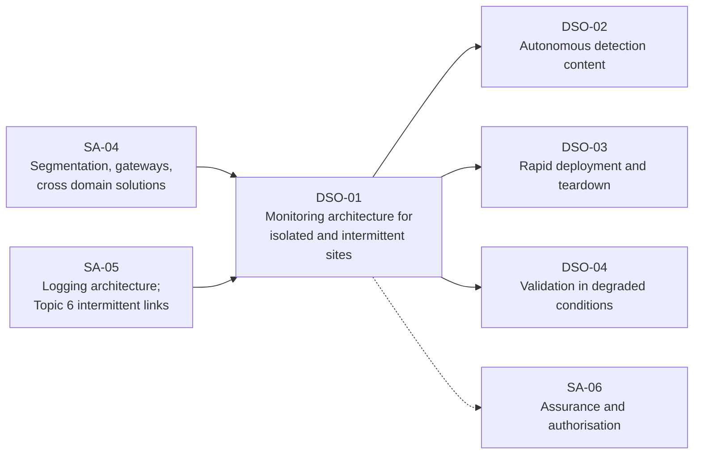
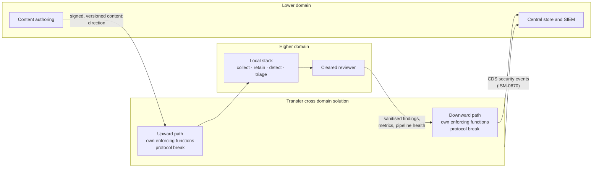

# DSO-01: Monitoring Architecture for Isolated and Intermittently Connected Sites

> **Module type:** Extension module (elective deep dive) — part of [EXT-DSO](index.md)
> **Status:** Draft
> **Version:** v0.1
> **Last Reviewed:** 2026-09-13
> **Domain Expert:** _Unassigned — required before Practitioner Approved_
> **Practitioner Reviewer:** _Unassigned — required before Practitioner Approved (must have designed or operated monitoring across a cross domain solution or an isolated network)_

!!! warning "Not a credit-bearing unit"
    DSO-01 is one module of the [EXT-DSO series](index.md). It carries **0 CP**, sits outside the 160 CP degree structure, and does not appear in [`docs/ksat-coverage.md`](../../ksat-coverage.md), which is generated from credit-bearing units only. Recognition, if any, is via the Tier 1 badge mechanism in [`docs/curriculum/micro-credentials-framework.md`](../../curriculum/micro-credentials-framework.md).

!!! danger "Cross domain solutions are not a self-service design"
    Where a cross domain solution connects a SECRET or TOP SECRET domain to any other, the ISM requires ASD to be consulted and its directions followed (ISM-0597). This module teaches how to design the *monitoring that lives around* such a boundary. It does not teach how to build the boundary, and nothing in it substitutes for that consultation.

---

## Overview

[SA-05](../security-architecture/sa-05-logging-and-monitoring-architecture.md) designs a logging estate on the assumption that every site eventually reaches the central tier. Topic 6 of that module relaxes the assumption for a site whose link drops: size the local buffer, bound the queue, choose a synchronisation order, record the visibility gap. That is enough for a regional office on a satellite link. It is not enough for a site that is isolated *by policy*: a classified enclave whose only exit is a cross domain solution, an operational-technology plant that must never route to the corporate network, a site with no link at all whose logs leave on media, or a temporary site stood up for a fortnight in a place with no infrastructure.

For those sites the question is no longer "how long can the buffer hold?" It is "what monitoring capability must exist *inside* the boundary so that the site can detect and respond on its own, and what crosses the boundary, in which direction, under whose authority?" DSO-01 answers that question as one design. It defines four classes of isolation and the release-point pattern that matches each; specifies the minimum local stack; designs log and finding flow across a cross domain solution under the ISM's controls; treats the path *into* the site (detection content, parsers, updates) as an attack surface in its own right; adapts the design to operational technology under NIST SP 800-82 and IEC 62443; sets the operating model for a site nobody central can reach; and provides time, identity and trust anchors that survive without a link.

Everything a connected site already has — the tier model, source selection, forwarding, retention, validation — is assumed from SA-05 and not repeated.

---

## Where this module fits

| Existing unit or module | Relationship |
|---|---|
| [SA-04](../security-architecture/sa-04-network-gateway-and-access-architecture.md) Topics 1, 2, 6 | Hard prerequisite. The boundary ladder, zoning by criticality and the cross domain solution controls are taken as read; DSO-01 designs what sits inside and beside them. |
| [SA-05](../security-architecture/sa-05-logging-and-monitoring-architecture.md) Topics 6, 9; Lab 3 | Hard prerequisite. DSO-01 Topic 2 starts from the Topic 6 sizing table; Topic 6 here extends the Topic 9 OT pattern; Lab 2 here extends Lab 3 there. |
| [OC02](../../../core/units/OC02-security-monitoring-siem.md), [OC04](../../../core/units/OC04-incident-response-lifecycle.md) | Assumed. Monitoring and incident-response fundamentals are not retaught. |
| [DE01](../../../degrees/operational/detection-engineering/DE01-detection-theory-philosophy.md) | Assumed. Which detections must run locally is DSO-02, not this module. |
| [EXT-ANS](../ansible-security-automation.md) | Recommended. The telemetry-deployment and evidence patterns are reused by DSO-03. |
| [SA-06](../security-architecture/sa-06-assurance-maturity-and-authorisation.md) | Forward. Every topic names the evidence it contributes to the assurance pack. |

---

## Prerequisites

- **SA-04** and **SA-05** (hard). A learner who cannot draw the SA-05 three-tier model for a connected site and name the SA-04 cross domain solution controls from memory should not start here.
- **OC02** and **OC04** (hard). SIEM operations and incident response fundamentals.
- **EXT-ANS** (recommended) for the deployment patterns DSO-03 relies on.
- Comfortable with Linux containers, `rsyslog` or `syslog-ng`, and a scripting language for the labs.

---

## Learning outcomes

On completion, a learner can:

1. **Analyse** a site against four classes of isolation — intermittently connected, policy-isolated behind a cross domain solution, physically disconnected, and operational-technology zoned — identifying which class applies, what it forbids and which release-point pattern fits.
2. **Design** the minimum local monitoring stack for an isolated site — collection, normalisation, retention, local detection, local triage and time — sized from stated outage, ingest and staffing constraints.
3. **Design** log, finding and command flow across a cross domain solution that respects isolated upward and downward paths, independent security-enforcing functions and protocol breaks, stating what crosses, in which direction, at what latency and under which control.
4. **Evaluate** the content-import path of an isolated site as an attack surface, specifying versioning, signing, inspection and quarantine so that detection content and updates can enter without becoming the intrusion.
5. **Adapt** the design to an operational-technology site using zones and conduits, passive collection and one-way transfer, stating the safety constraints that override monitoring convenience.
6. **Justify** the operating model, trust anchors and residual risk of an isolated site to an authorising officer in terms the assurance pack can carry.

> Bloom's 3–6 (Apply / Analyse / Evaluate / Create), consistent with the strategic-layer expectations in [`docs/content-standards.md`](../../content-standards.md). LO5 sits at Apply–Analyse because OT specifics are adapted from a reference, not created.

---

## AQF Level 7 Alignment

**Knowledge (AQF 7.1):** specialised knowledge of isolation classes, cross domain solution controls as they bear on monitoring, one-way transfer, OT zoning and the trust anchors a disconnected site requires. **Skills (AQF 7.2):** cognitive skills to select a release-point pattern from stated constraints and design flow across it; communication skills to state, to an authorising officer, what the site cannot see and who acts when nobody central can. **Application (AQF 7.3):** applies these with initiative and judgement to a realistic Australian site, taking responsibility for the residual risk stated.

> This alignment statement is notional. DSO-01 is not credit-bearing and has not been through the AQF mapping process in [`docs/compliance/aqf-teqsa.md`](../../compliance/aqf-teqsa.md).

---

## Framework mappings

> **Provisional pending Framework Custodian review.** These do **not** feed [ksat-coverage](../../ksat-coverage.md).

### NIST NICE DCWF

| Version | Work Role | Code | T-Code | Task | Demonstrated in |
|---|---|---|---|---|---|
| 2023 | Security Architect | SP-ARC-002 | T0050 | Design system security architecture and supporting infrastructure | Lab 1, Lab 3, Summative |
| 2023 | Cyber Defense Infrastructure Support | PR-INF-001 | T0335 | Build and maintain monitoring infrastructure | Lab 2 |
| 2023 | Cyber Defense Analyst | PR-CDA-001 | T0258 | Provide timely detection, identification and alerting of possible attacks | Lab 2, Formative 1 |
| 2023 | Security Control Assessor | SP-RSK-002 | T0177 | Assess controls against frameworks and identify gaps | Lab 3, Summative |
| 2023 | Systems Security Manager | OV-MGT-001 | T0264 | Oversee security operations under degraded conditions and escalate accordingly | Topic 7, Summative |

### SFIA 9

| Skill | Code | Level | Demonstrated in |
|---|---|---|---|
| Solution architecture | ARCH | Level 5 | Lab 1, Lab 3, Summative |
| Infrastructure design | IFDN | Level 5 | Lab 2, Summative |
| Network design | NTDS | Level 4 | Lab 1, Lab 3 |
| Information security | SCTY | Level 5 | Topic 4, Topic 5, Lab 3 |
| Information assurance | INAS | Level 4 | Topic 8, Summative |
| Specialist advice | TECH | Level 5 | Summative (authorising-officer brief) |

### ASD Cyber Skills Framework

| Domain | Sub-domain | Proficiency | Demonstrated in |
|---|---|---|---|
| Security Architecture | Monitoring and logging architecture | Advanced | Lab 1, Lab 2, Summative |
| Security Architecture | Secure network design | Practitioner–Advanced | Lab 1, Lab 3 |
| Defensive Operations | Monitoring Infrastructure | Advanced | Lab 2 |
| Governance, Risk and Compliance | Security Governance | Practitioner | Topic 7, Summative |

### Project-local KSATs

| Type | ID | Statement | Demonstrated in |
|---|---|---|---|
| Knowledge | DSO-01-K01 | Knowledge of the four isolation classes, what each forbids and the release-point pattern that matches each | Topic 1; Lab 1 |
| Knowledge | DSO-01-K02 | Knowledge of the minimum local monitoring stack and how each element is sized from outage, ingest and staffing | Topic 2; Lab 2 |
| Knowledge | DSO-01-K03 | Knowledge of the ISM cross domain solution controls that constrain monitoring flow: isolated upward and downward paths, independent functions, protocol breaks, central logging of CDS events, quarterly sampled transfer review | Topic 4; Lab 3 |
| Knowledge | DSO-01-K04 | Knowledge of the content-import path as an attack surface and the versioning, signing, inspection and quarantine expectations that apply to it | Topic 5; Lab 2 |
| Knowledge | DSO-01-K05 | Knowledge of zones, conduits and passive collection as the OT monitoring pattern, and the safety constraints that override monitoring convenience | Topic 6 |
| Knowledge | DSO-01-K06 | Knowledge of the trust anchors — time holdover, offline certificate authority and revocation, local identity — an isolated site needs and the drift each accepts | Topic 8 |
| Skill | DSO-01-S01 | Skill in classifying a site's isolation and selecting a release-point pattern from stated constraints | Lab 1 |
| Skill | DSO-01-S02 | Skill in building a local stack that retains, detects and releases a bounded, filtered, integrity-protected bundle through a modelled release point | Lab 2 |
| Skill | DSO-01-S03 | Skill in drawing and defending a monitoring data-flow across a cross domain solution, including the sanitisation rule set and the quarterly sample query | Lab 3 |
| Ability | DSO-01-A01 | Ability to specify who watches, who decides and who acts at a site nobody central can reach, and how authority is handed back on reconnection | Topic 7; Summative |
| Ability | DSO-01-A02 | Ability to state to an authorising officer what an isolated site's monitoring cannot see and the residual risk accepted | Summative |
| Ability | DSO-01-A03 | Ability to adapt the design to an OT site without violating its safety and determinism constraints | Topic 6; Summative |

---

## Module structure

| Part | Topics | Labs | Notional hours |
|---|---|---|---|
| A — Isolation classes and the release point | 1, 3 | 1 | 4 |
| B — The local stack | 2, 8 | 2 | 6 |
| C — Flow across the boundary, in both directions | 4, 5 | 3 | 6 |
| D — Operational technology and the operating model | 6, 7 | — | 3 |
| E — Assessment | — | Formatives, Summative | 3 |
| | | | **22 hours** |

---

## Topics

### Topic 1: Four Classes of Isolation and What Each Forbids

"Disconnected" hides four different design problems. Naming the class first prevents the commonest error: designing a buffered relay for a site whose policy forbids any relay at all.

| Class | Defining property | What it forbids | Typical examples | Release-point pattern (Topic 3) |
|---|---|---|---|---|
| **I — Intermittently connected** | A link exists, is trusted for the traffic, and drops for hours or days | Nothing by policy; the constraint is physical | Regional office on satellite; vessel; field survey team; disaster-response site | Buffered relay (SA-05 Topic 6) |
| **II — Policy-isolated** | The site is in a different security domain; the only exit is a gateway or cross domain solution | Any direct forwarding; any path not through the enforced boundary; for SECRET and above, any solution ASD has not been consulted on (ISM-0626, ISM-0597) | Classified enclave; provider-hosted environment of a higher classification than the corporate network | Transfer cross domain solution, or unidirectional diode |
| **III — Physically disconnected** | No link exists, or none is permitted, at any time | Any network path; the boundary is a person carrying media | Standalone test range; sealed evidence network; site where the policy is "no cables leave the room" | Media transfer with inspection at both ends |
| **IV — OT-zoned** | The site is an industrial control system whose zones and conduits are defined by safety and availability, not by data classification | Active scanning, agent installation on controllers, any traffic that can perturb deterministic messaging; any inbound path from the IT side that the conduit does not explicitly permit | Water, power, manufacturing, building management, port and rail control | Passive collection inside the zone; one-way transfer outward |

Two classes often coexist. An OT plant (IV) at a remote site (I) needs both patterns stacked: passive collection inside the zone, one-way out to a site relay, the relay buffered against the link. A classified enclave (II) with no permanent link (I) needs its cross domain solution to tolerate the outage, which is a question for the solution's designer, not the monitoring architect. Record the stack explicitly; the summative marks it.

**The release point.** Whatever the class, every site has exactly one kind of place where data leaves and content enters: this module calls it the *release point*. The release point has a direction (out, in, or both, on isolated paths), a latency (seconds, hours, or the next courier), a capacity, an inspection regime and an owner. Everything in Topics 2 to 5 is designed relative to it. A site with two release points has two designs.

**Australian framing.** The ISM's boundary ladder (SA-04 Topic 1) decides the class: same security domain, segment (ISM-1181); different domains, gateway with an evaluated firewall and never a VLAN as the separator (ISM-0628, ISM-0529); provider networks segregated with independent firewalls each side (ISM-1577); SECRET or TOP SECRET on either side, a cross domain solution (ISM-0626). Class IV adds IEC 62443's zone-and-conduit model, which the ISM does not restate; the two ladders are reconciled in Topic 6.

### Topic 2: The Minimum Local Stack

SA-05 Topic 6 establishes that a cut-off site must still generate, keep and be able to inspect its own logs. For Classes II to IV that is not a fallback but the primary design, because the central tier either never sees raw events or sees them hours late. This module's position, stated as design reasoning rather than a source requirement: **every isolated site runs a complete, small, three-tier instance of the SA-05 model**, and the release point connects instances, not sources to a centre.

| Element | Minimum | Sizing rule | Why it cannot be omitted |
|---|---|---|---|
| **Collection** | Every source class SA-05 Topic 4 would onboard for this site, at the site's own priority order | Per-source rate measured, not estimated | A source that only forwards centrally is invisible during isolation |
| **Normalisation** | Parsers for every local source, versioned (Topic 5) | Same parsers as the centre, same version | Findings released to the centre must be comparable with the centre's own |
| **Local retention** | Outage × peak rate + margin (SA-05 Topic 6), *and* long enough to investigate an incident found on reconnection | Longest expected isolation, plus the investigation dwell time the site's incident history shows | The centre cannot pull what the site overwrote |
| **Local detection** | The subset of the organisation's rules that DSO-02 classifies as must-run-locally, plus the site's own | Bounded by local compute; measured in DSO-04 | An alert that fires only at the centre fires after the outage |
| **Local triage** | A console a site operator can use without a link; a case record that survives reconnection | One trained person per shift the site is occupied (Topic 7) | Detection without a watcher is retention |
| **Time** | A local holdover source with recorded drift (Topic 8) | Drift budget set from the correlation window of local detections | Correlation across sources fails when their clocks disagree |
| **Pipeline health** | The stack monitors itself: silent sources, queue depth, disk, release-point status | Same thresholds as the centre (SA-05 Lab 4) | The first thing an intruder disables is the thing that would notice |

**Compute budget.** Sizing this stack is usually the design's hardest constraint, not its data. A site with ten operators does not run a cluster; it runs one node, and the node's failure model is "the site is blind until it is rebuilt" unless a second node is justified. Record the decision and its rationale; DSO-03 makes the rebuild fast enough that a single node is often the correct answer.

**What the centre still does.** Cross-site correlation, threat-intelligence enrichment, long-term retention, content authoring and the organisation-wide incident picture. None of that moves to the site. The site releases *findings and a bounded sample of raw events*, not its whole store; the centre releases *content and direction*, not commands into the site's controllers. Topic 3 makes the split concrete.

### Topic 3: Release-Point Patterns

Four patterns, one per class, each with the same design questions: what crosses, which direction, at what latency, inspected how, logged where, owned by whom.

| Question | I — Buffered relay | II — Transfer CDS or diode | III — Media | IV — OT one-way |
|---|---|---|---|---|
| **What leaves** | Everything the SA-05 policy forwards, in the Topic 6 synchronisation order | Findings, summaries and a sanitised sample of raw events that the CDS security policy allows; never the whole store unless the policy says so | A signed, bounded bundle: findings, summaries, pipeline health, and raw events only for open cases | Contextual logs from a monitoring sensor, or historian and error-code data, never controller traffic itself (ASD *Best practices* via SA-05 Topic 9) |
| **What enters** | Configuration and content over the same link, versioned against stale rules | Content only through the downward path, isolated from the upward path (ISM-0635); each path with its own security-enforcing functions (ISM-1522) | Content on separate media from data leaving; inspected at the site (Topic 5) | Nothing, by default; content for the sensor enters through a defined conduit with change control |
| **Latency** | Seconds while up; outage length while down | Determined by the CDS's transfer cadence and filter; minutes to hours | The courier's schedule; hours to weeks | Near real time outward; content inward on maintenance windows |
| **Inspection** | TLS transport, filter at the relay (SA-05 Lab 3) | Protocol break at each layer (ISM-1521); the content-filtering pipeline of SA-04 Topic 5; filter tested for bypass (ISM-1524) | Media scanned and content verified at both ends; write-once media preferred for data leaving | The diode or one-way gateway; evaluated product, high-assurance where the source is SECRET or above (ISM-0643, ISM-0645) |
| **Logged where** | Relay and receiver daemon logs to the centre | CDS security events, including configuration changes, centrally logged (ISM-0670); transfer-policy events sampled quarterly (ISM-1523) | A transfer register: who carried what, when, digests both ends | Sensor health to the site stack; conduit changes to the change record |
| **Owner** | The site's network owner | The CDS operating authority; ASD consulted for SECRET and above (ISM-0597) | A named custodian per transfer, trained before access (by analogy with ISM-0610) | The OT engineering authority, not the security team |

**The asymmetry rule.** In every pattern except I, the outward path carries *less* than the site holds, and the inward path carries *only content and direction*. This module's reasoning: an isolated site is isolated because something on one side must not reach the other. A monitoring design that makes the boundary transparent to itself has defeated the boundary. Design the release point as narrow as the operating model (Topic 7) can tolerate, then widen it only with a written reason.

**A worked selection.** A water utility's treatment plant is Class IV at a Class I site. Inside the zone: passive sensor on a span port, historian export, controller error codes. Out of the zone: a diode to the site's IT segment, where a relay buffers against the satellite link. From the relay: the SA-05 synchronisation order, findings first. Into the zone: nothing over the network; sensor rule updates by the engineering team on a maintenance window from inspected media. Two release points, two designs, one page each.

### Topic 4: Monitoring Across a Cross Domain Solution

Class II is where SA-04 Topic 6 and this module meet. SA-04 teaches the controls; this topic applies them to the specific flows a monitoring capability needs. The ISM's requirements as they bear on those flows:

- **Isolated upward and downward paths (ISM-0635).** Data going from the lower domain to the higher, and from the higher to the lower, travel on separate network paths. A monitoring design therefore has two flows to specify, never one bidirectional "SIEM integration".
- **Independent security-enforcing functions (ISM-1522).** Each direction is enforced by its own functions. The filter that lets a finding go down is not the filter that lets content come up.
- **Protocol break at each layer (ISM-1521).** No session crosses intact. Agent-to-server protocols, database replication, cluster gossip and search federation do not cross a CDS. What crosses is a file, or a message the CDS reassembles.
- **Central logging of CDS security events (ISM-0670)** and **quarterly sampled review of transfer-policy events (ISM-1523).** The CDS is itself a top-priority log source, and the monitoring design must make the quarterly sample trivial to pull.
- **ASD consulted for SECRET and above (ISM-0597).** Anything below is a gateway (ISM-0628), for which SA-04 Topic 4 applies and this topic's flow questions still hold.

**Which way do findings go?** The question every Class II design must answer, and one the sources do not decide. This module's reasoning, offered as a decision rule rather than a rule:

| Situation | Design | Reasoning |
|---|---|---|
| Higher domain has its own security operations capability | Monitor at the higher domain; release **only** sanitised findings and metrics downward, through the downward path's filter | Raw events from a higher domain carry its classification; the lower SIEM cannot hold them without becoming a higher-domain system |
| Higher domain is small and cannot staff a capability | Monitor at the higher domain with a local stack (Topic 2); a **person** cleared for the higher domain reviews there; release summaries downward | Same classification argument; the stack replaces the missing staff for detection, not for judgement |
| Lower domain must be monitored from the higher | Forward lower-domain events upward through the upward path; the higher SIEM holds both | Upward flow is the easier case: lower-classified data is admissible in the higher domain, subject to the CDS's filter and the higher domain's capacity |
| Both domains need the organisation-wide picture | Two capabilities; each releases metrics and de-identified findings to the other through the appropriate path; correlation across the pair happens by *people*, not by federation | Federation requires a session that ISM-1521 forbids |

The rule underneath all four rows: **monitor at the highest classification the data carries, and release downward only what the transfer policy allows.** This is architectural inference from ISM-0635, ISM-1521 and ISM-1522; it is not a stated ISM position, and the Practitioner Reviewer must confirm that it matches current ASD direction for the domains in question.

**What the CDS itself must give the monitoring design.** A security-event feed that reaches the central store (ISM-0670); a transfer-policy event record that a quarterly sample can be drawn from (ISM-1523); the results of bypass testing (ISM-1524) as assurance evidence; and a documented content filter, so that the site's outward bundle can be *designed to pass* it rather than discovered to fail it in the first week. Ask the CDS operating authority for those four artefacts before drawing anything.

### Topic 5: The Content-Import Path as an Attack Surface

Every isolated site needs things to *enter*: detection rules, parsers, threat-intelligence indicators, software and signature updates, configuration, and direction from the centre. SA-05 Topic 6 notes that content reaches the site by the same intermittent path or offline media, versioned against stale rules. For Classes II to IV that path is the site's largest inbound attack surface, because it is the only one that exists by design.

This module's position: **treat the import path exactly as SA-04 Topic 5 treats a gateway's content-filtering pipeline**, whichever physical form it takes.

| Step | On a relay (I) | Through a CDS (II) | On media (III, IV) |
|---|---|---|---|
| **Identity of the sender** | Mutual TLS from a named content repository | The upward path's enforcing function verifies origin | The custodian is named, trained and recorded; the media is labelled and its origin logged |
| **Integrity and authenticity of the content** | Every bundle signed by the content authority's key; the site verifies before it unpacks | Same signature, verified *after* the protocol break, so the CDS's own reassembly is not trusted for authenticity | Same signature; verified on a scanning host, not on the production stack |
| **Version discipline** | Monotonic version; the site refuses older than current and records the gap | Same; the gap is a metric released downward | Same; the transfer register records the version delivered |
| **Inspection** | Content-type allow-list: rules, parsers, indicator lists, packages; nothing executable outside the package manager's verified path | The CDS's filter, then the site's own allow-list; two filters, independently owned | Media scanned for malicious content on a dedicated host; content allow-listed; media then quarantined or destroyed per DSO-03 |
| **Quarantine before activation** | New content staged; DSO-02's activation test runs before it is live | Same | Same |
| **Evidence** | Import log with signature result, version, activator, timestamp — itself a top-priority local log source | Plus the CDS's transfer-policy event for the import | Plus the transfer register entry with digests at both ends |

**Threat model for the import path**, stated so learners can test their design against it in Lab 2: a malicious rule that suppresses a true alert; a parser that drops a field; an indicator list that adds the site's own management address so its own traffic is blocked; a package with a valid signature from a compromised authority; a bundle replayed from months ago to roll the site's detections back; media carrying something other than the content it claims. Each row above defends against at least one of these; a design that cannot say which row defeats which threat is incomplete.

**Direction is content too.** An instruction from the centre ("isolate host X", "preserve these logs", "stand down the site") travels the same path and needs the same signature, version and evidence. Whether it may be *executed automatically* at the site is the automation-boundary question of [EXT-ANS](../ansible-security-automation.md) Topic 6 and EXT-IRP; this module requires only that it arrive authenticated and be logged.

### Topic 6: Operational-Technology Sites

Class IV differs in kind, not in degree. The site's zones are drawn by the engineering authority for safety and availability, and the monitoring design fits inside them.

**The reference sources.** NIST SP 800-82 Rev. 3 (September 2023) is the United States guide to operational technology security; its scope covers industrial control systems, building automation, transportation, physical access control, physical environment monitoring and measurement systems, and it provides an overview of OT, typical topologies, threats and vulnerabilities, and recommended countermeasures — the publication's own description, verified on the NIST page. The ISA/IEC 62443 series is the international standard family for industrial automation and control system security, structured in general, policies-and-procedures, system and component parts; the *zones and conduits* model and the *security level* concept belong to its system parts (3-2 and 3-3). The Purdue reference model, which layers a plant from physical process (Level 0) through control, supervision and site operations to the enterprise (Levels 4 and 5), is the vocabulary both use for placement. The zones-and-conduits, security-level and Purdue statements here are from the author's knowledge and are flagged in the verification table; the Practitioner Reviewer must confirm them against the standard texts before this topic is taught in depth.

**Design rules this module draws from those references and from ASD's OT logging guidance (SA-05 Topic 9).**

1. **Passive first.** Collection inside a zone is by network tap or span port to a monitoring sensor that parses OT protocols and emits contextual logs. No agents on controllers; no active scanning of anything that talks to a physical process. ASD's guidance that direct logging from OT assets must be conservative and tested because of safety-critical deterministic messaging is the governing constraint.
2. **Historian and error codes are log sources.** Where a device cannot log, the historian's record of what it did and the error codes it raised are the closest substitute, and ASD names them as such. Onboard them as sources with the same register discipline as SA-05 Topic 4.
3. **One conduit out, none in by default.** Logs leave the zone through a conduit the engineering authority has defined, ideally a diode or one-way gateway into the site's IT segment; the diode is an evaluated product and high-assurance where the zone is SECRET or above (ISM-0643, ISM-0645). No path from the IT side into the control zone exists for monitoring purposes; content for the sensor arrives through the engineering change process.
4. **Zone-level detection, site-level correlation.** The sensor detects within its zone; correlation across zones and with IT happens in the site stack (Topic 2), outside the control zones.
5. **Safety overrides monitoring.** Any monitoring change that could affect a controller's timing, bandwidth or availability is an engineering change, with the engineering authority's approval, tested on a representative system first. Where the two authorities disagree, the engineering authority's safety case wins and the security team records the visibility lost as residual risk.
6. **Time from the plant, not the corporate network.** OT sites commonly have their own time distribution; the monitoring stack takes time from the same source the controllers do, so that sensor events and historian records correlate (this module's reasoning; Topic 8 covers holdover).

**What DSO-01 does not do for OT.** It does not teach OT protocols, controller hardening or the engineering safety case; it does not choose a sensor product; it does not design the zones. It places monitoring inside zones others have drawn. Learners who need the rest go to SP 800-82 Rev. 3 directly.

### Topic 7: The Operating Model for a Site Nobody Central Can Reach

Architecture that assumes a watcher must specify the watcher. For an isolated site the central SOC cannot be that watcher during isolation, and the design has to say who is.

**Three roles, minimum, per occupied shift** (this module's reasoning, drawn from how the degree's OC04 incident-response roles collapse onto a small site):

| Role | Holds | Cannot be |
|---|---|---|
| **Site watcher** | The local triage console; the first read on any alert; the authority to open a case and preserve evidence | The person whose own activity generates most of the site's alerts (the site's administrator), unless a second person co-signs closures |
| **Site decider** | The authority to isolate a host, disable an account, stop a service or invoke the site's incident plan, within limits written *before* isolation | Absent from site; the design must name a deputy for every hour the site is occupied |
| **Release-point custodian** | The transfer register, the media or relay, the import path (Topic 5); trained before access (by analogy with ISM-0610) | The same person as the site watcher for the *same* transfer, so that no one both creates and carries an outward bundle unchecked |

One person can hold two roles on a small site if the separation stated in the last column holds; the summative marks whether the candidate saw the conflict.

**Authority, written down before isolation.** The central SOC's playbooks assume escalation; the site's cannot. Each site carries a pre-authorised action list: what the decider may do alone, what needs a second person on site, what waits for reconnection, and what may *never* be done locally (for example, altering the release point). This is the isolated-site form of the incident response plan's roles section in [OC04](../../../core/units/OC04-incident-response-lifecycle.md), and the EXT-IRP playbook-engineering approach applies to writing it.

**Out-of-band communication.** A site may have voice or messaging when it has no data link, or nothing at all. The design records which, and what a "we have an incident" message contains when it can carry twenty words: site, time, class of incident, action taken, help needed. If there is nothing, the design records the maximum time the centre will be unaware and treats it as residual risk.

**Handover on reconnection.** The site releases its findings in synchronisation order (SA-05 Topic 6); the centre reviews the site's *case record*, not just its alerts, and either takes over open cases or confirms the site's closures. Authority to act returns to the central playbooks only when the centre says so, and the moment is logged. A site that reconnects mid-incident with two teams acting on the same host is the failure this paragraph prevents.

**Skills and fatigue.** The site watcher needs OC02-level competence and knowledge of the local content; the site decider needs OC04-level competence and the organisation's authority; both need rest. A design that assumes one person watches a console for a fortnight has assumed a person who is not watching by day three. State the roster or state the gap.

### Topic 8: Time, Identity and Trust Anchors Without a Link

Everything in Topics 2 to 5 rests on three things an isolated site cannot fetch from the centre.

**Time.** SP 800-92 has administrators ensure each system's clock is synchronised to a common source, and ASD's logging guidance wants trustworthy time in UTC from more than one source (SA-05 Topic 7). Isolated, the site needs a *holdover* source: a local time server disciplined by a receiver where one is permitted, or by a stable local oscillator where not. The design sets a **drift budget** from the tightest correlation window in the local detection set (if the site's rules join events within five seconds, drift across sources must stay well inside that), records the holdover source's expected drift per day, and therefore the isolation length after which local correlation is no longer trustworthy. That length goes in the residual-risk register with the others. On reconnection, the site's clock offset is measured and recorded before any events are released, so the centre can correct timestamps rather than trust them.

**Identity and keys.** Signatures on content (Topic 5) and on outward bundles need keys the site can verify without asking. This module's design: an offline root, an issuing authority whose certificate the site holds, and revocation delivered *as content* through the import path on a stated cadence, with the site recording how stale its revocation information is. Site operators authenticate to a local identity store that is provisioned before isolation and reconciled after; privileged access on site follows SA-04 Topic 8 as written, with the break-glass credential sealed, its use logged locally and released first on reconnection. Where the site is a Class II enclave, the higher domain's own PKI and identity apply and this paragraph is a description of what they must provide, not a design of them.

**Integrity anchors.** The digest chain on retained logs (SA-05 Topic 7) is only as good as the place the first digest is kept. On an isolated site, keep the daily digest in two places the same intruder cannot reach together: the local store and the outward bundle, so that the centre holds the site's digests even when it does not hold the site's logs. On reconnection, the centre's copy checks the site's.

**Software trust.** Package updates enter through the import path (Topic 5) and are verified against a signing key held before isolation. The site records the version of everything it runs so that DSO-03's rebuild and DSO-04's drills start from a known state.

Everything in this topic is design reasoning consistent with the cited sources; none of it is a stated requirement in them, and the verification table says so.

---

## Labs & exercises

> Labs use only free tooling. Lab 2 builds on the SA-05 Lab 3 relay pattern; the repository's `labs/` relay estate (delivered with the SA-05 lab guide) is the intended substrate and any equivalent rsyslog or syslog-ng setup works.

### Lab 1: Classify Sites and Select Release-Point Patterns

**Objective:** Apply Topics 1 and 3 to a fictional estate, producing for each site its isolation class (or stacked classes), the matching release-point pattern, and the one-page release-point design.

**Prerequisites:** Topics 1–3; SA-04 Topic 1; SA-05 Topic 6

**Environment:** Paper or a diagramming tool. No software.

**Instructions:**

1. Read the estate brief: a fictional Australian organisation with a head office, three regional offices (one on satellite), a water-treatment plant, an environmental research station with no permitted link, and an enclave hosting a higher-classification system for a government customer, connected by a transfer cross domain solution operated by a third party. Volumes, staffing and outage histories are given.
2. For each site, state its class using Topic 1's table. Where two classes stack, state the order and draw the two release points.
3. For each release point, complete Topic 3's six questions (what leaves, what enters, latency, inspection, logged where, owner) in one page, citing the ISM control that constrains each answer where one does.
4. For the enclave, apply Topic 4's decision table: which row applies, which way findings go, and what four artefacts you will request from the CDS operating authority.
5. Identify the one site where the *cheapest* correct design is "no local stack; accept the blind period", and defend it with the SA-05 Topic 6 arithmetic.
6. Produce the residual-risk register entries: one per site, stating the visibility lost and the maximum time the centre is unaware.

**Expected output:** A classification table; a one-page release-point design per release point; the Topic 4 selection with the artefact request; the "no local stack" argument; the residual-risk entries.

**Reflection questions:**

1. Which site did you nearly classify wrongly, and what feature of the brief corrected you?
2. Your enclave design releases findings downward. List three fields a finding carries that the downward filter would have to strip, and say what the centre loses without them.
3. The research station's custodian is also its only administrator. Which Topic 7 separation is violated, and what is the smallest change that restores it?

### Lab 2: Build an Isolated Site Stack With a Modelled Release Point

**Objective:** Extend SA-05 Lab 3 into a Class III design: a site node that collects, retains, detects locally and releases a bounded, filtered, signed bundle through a directory that models a media transfer, with a central node that verifies and imports; and the reverse path, in which signed content enters the site, is verified, quarantined and activated.

**Prerequisites:** SA-05 Lab 3 completed; Topics 2, 3, 5, 8

**Environment:**

- Two Linux containers or VMs (`site`, `central`), Ubuntu 22.04 LTS or similar; the SA-05 Lab 3 relay estate is a suitable starting point
- `rsyslog` or `syslog-ng`; `auditd` on the site; `openssl` and `gpg` (or `minisign`) for signing; a scripting language of the learner's choice; `tar`, `sha256sum`
- A shared directory, or a copied tarball, standing in for removable media. **No network path between the two nodes** for the duration of steps 3–8: prove it with a failed connection attempt
- Minimum hardware: 4 GB RAM / 2 vCPU / 20 GB disk across both nodes

**Instructions:**

1. On `site`, configure local collection of `auditd` and system logs to an append-only local store with daily rotation and a per-file digest (SA-05 Lab 3 pattern). Size the store for a 14-day isolation at the peak rate you measure in step 2, and record the arithmetic.
2. Generate a realistic load, then a burst of 50,000 events, and measure peak rate.
3. Implement **one** local detection as a script or rsyslog rule set: repeated failed authentications followed by a success from the same source within five minutes. Trigger it. Confirm the alert is written to a local alert file and shown on a local console (a `tail`, a text UI or a small web page — the point is that a site watcher can see it without a link).
4. Write the **release script**: it assembles a bundle containing all alerts since the last release, the daily digests, pipeline-health metrics (source silence, disk, queue), and raw events *only* for the sources named in a small allow-list; caps the bundle at a stated size; signs it; records the bundle's digest, size and contents summary in a transfer register; and writes it to the "media" directory. Run it.
5. On `central`, write the **import script**: verify the signature, compare the digest with the register entry the courier "carries" (copy the register line by hand), reject anything failing either check, and import the alerts and digests into the central store. Deliberately tamper with one bundle and prove rejection.
6. Write the **content bundle** on `central`: a new version of the step 3 rule with a tighter threshold, a parser change, and a small indicator list; version it monotonically; sign it.
7. On `site`, write the **content import**: verify the signature and version, refuse an older version (prove it by replaying the first bundle), stage the content in a quarantine directory, run an activation test that fires the rule against a known sample, and only then activate. Log every step to a local import log that is itself a source in the next release bundle.
8. Simulate clock drift: set `site` forward by ninety seconds, generate events, and release. On `central`, show how the offset is detected from the bundle's metadata and corrected before the events are stored.
9. Reconnect the nodes at the end and diff the central copy of the site's digests against the site's own store.

**Expected output:** Configurations and scripts committed to a repository (no private keys); the retention arithmetic; the burst measurement; the local alert and console evidence; a transfer register with at least three entries including the rejected tamper; the content bundle, the refused replay and the activation-test log; the clock-offset correction record; the final digest diff.

**Reflection questions:**

1. Your bundle cap is a *policy*: what happens to alerts that do not fit, and where is that recorded as a blind spot?
2. The activation test in step 7 ran against a known sample. Name one malicious rule from Topic 5's threat model that would pass that test, and what additional check would catch it.
3. Your site verified content with a key it held before isolation. How does a revocation of that key reach the site, and how stale can the site's revocation knowledge be before you would refuse to activate content?
4. Convert this Class III design into Class II: which script becomes the CDS's job, which stays the site's, and which ISM control decides?

### Lab 3: Design Monitoring Across a Cross Domain Solution

**Objective:** Produce a defensible monitoring data-flow across a transfer cross domain solution for a fictional two-domain scenario, including the sanitisation rule set for downward findings, the upward content path, the CDS's own logging, and the quarterly sample query.

**Prerequisites:** Topics 3–5; SA-04 Topics 5–6; Lab 1

**Environment:** Diagramming tool; a text editor; optionally the Lab 2 nodes to prototype the sanitisation rules against real alert records.

**Instructions:**

1. Read the scenario: a lower domain running the organisation's SIEM and content authoring; a higher domain hosting a customer system with its own small operations team; a transfer CDS between them whose operating authority has supplied a written transfer policy, a content-filter description, a security-event feed specification and the date of its last bypass test.
2. Draw the flow using Topic 4's diagram as the template. Mark every crossing with direction, path (upward or downward), the enforcing function that owns it, and the protocol break.
3. Write the **downward sanitisation rule set** for findings: for each field in the higher domain's alert record, state *release*, *generalise* (for example a host name to a host class) or *strip*, with the reason. Prototype it against Lab 2's alert file if available.
4. Write the **upward content path** specification: what content types cross, how they are signed and versioned, where the site's own allow-list applies *after* the CDS's filter, and what evidence the import produces.
5. Specify the **CDS as a log source**: which of its security events reach the lower domain's store, how configuration changes are represented, and how a quarterly sample of transfer-policy events is pulled. Write the sample query in plain words or in the query language of a platform the learner knows.
6. Test the design against Topic 5's threat model and against three additional threats: a compromised higher-domain reviewer who releases too much; a lower-domain content author who pushes a rule that blinds the higher domain; a CDS misconfiguration that briefly joins the paths. State which control or design element catches each and what the evidence would look like.
7. Write the half-page **request to the operating authority** for anything your design needs that the four artefacts do not provide.

**Expected output:** The flow diagram; the sanitisation rule set with rationale; the upward path specification; the CDS logging and sample specification; the threat test table; the request letter.

**Reflection questions:**

1. Your rule set generalised host names. What can the lower-domain SIEM no longer correlate, and is that loss acceptable to the organisation-wide picture?
2. ISM-1521 forbids the session your SIEM vendor's "federated search" feature needs. Describe the vendor conversation in three sentences.
3. Which of your design's assumptions would change if the higher domain were TOP SECRET rather than SECRET, and which ISM control tells you where to look?

---

## Assessment

### Formative 1: Which Class, Which Release Point?

Ten short site descriptions — a mine site on a microwave link that fails in storms, a hospital's building-management network, a contractor's test range, a provider-hosted enclave, a ship, a customs inspection facility with a one-way feed, and so on. For each, state the isolation class or stack, the release-point pattern, what the outward path carries, and the single ISM control or reference that constrains the choice. Self-marked against a key that argues both sides for the three contested cases. **Assesses LO1, LO3.**

### Formative 2: Critique the Site Design

A two-page draft monitoring design for a fictional isolated site containing at least six defects: a bidirectional "integration" across a CDS; content imported without version checks; local retention sized for the average outage; a watcher role assigned to the site administrator with no co-signer; a drift budget wider than the correlation window; and an OT sensor deployed as an agent on a controller. Identify each defect, cite the topic, control or reference it violates, and propose the revision. Marked on whether the revision keeps the site operable rather than merely compliant. **Assesses LO2, LO4, LO5, LO6.**

### Summative: Isolated-Site Monitoring Architecture Package

For a described Australian organisation with at least one site in each of three isolation classes, including one OT site and one Class II enclave, produce:

1. A **classification and release-point set**: each site's class or stack, each release point's one-page design, and the residual-risk entry per site (Lab 1 pattern).
2. A **local stack specification** for the two most constrained sites: every Topic 2 element sized with arithmetic, the compute decision and its rationale.
3. A **cross domain monitoring flow** for the enclave: diagram, sanitisation rule set, upward content path, CDS logging and quarterly sample (Lab 3 pattern).
4. An **import-path specification** applying Topic 5's table to each release point, with the threat-model test.
5. An **OT adaptation** for the OT site applying Topic 6's six rules, naming the engineering authority's decisions the design depends on.
6. An **operating model**: the three roles per site with the Topic 7 separations, the pre-authorised action list, the out-of-band message format and the reconnection handover.
7. A **trust-anchor plan**: time holdover with drift budget, offline PKI and revocation cadence, integrity anchors, software version record.
8. A **one-page brief to the authorising officer** stating what each site cannot see, for how long, and the residual risk accepted, in the form SA-06 carries into authorisation.

**Assesses LO1–LO6.**

**Rubric:**

| Criterion | Exemplary | Proficient | Developing | Beginning |
|---|---|---|---|---|
| **Classification and release points** | Every site classed correctly including stacks; each release point answers all six questions with the constraining control named | Classes correct; release points mostly complete | Classes correct but release points treated as generic forwarding | Sites treated as connected |
| **Local stack** | Every element sized with arithmetic; compute decision defended; what the centre still does stated | Elements present and sized | Elements listed without sizing | SIEM assumed to be central |
| **Cross domain flow** | Paths isolated, functions independent, protocol breaks marked; sanitisation rule set complete with rationale; CDS logged and sampled; ASD consultation acknowledged | Flow correct; rule set mostly complete | Bidirectional integration or federation assumed | CDS ignored |
| **Import path** | Every Topic 5 step specified per release point; threat model tested with named defeats | Steps specified; threat model partial | Content "pushed" without verification | Import path absent |
| **OT adaptation** | Six rules applied; engineering-authority dependencies named; safety precedence stated | Rules applied with minor gaps | Agent-based or active collection proposed | OT treated as IT |
| **Operating model and trust anchors** | Roles with separations, pre-authorised actions, handover, drift budget, revocation cadence all present and consistent | Present with minor inconsistency | Roles named without authority or separation | Absent |
| **Candour to the authorising officer** | Blind periods and residual risk stated plainly in SA-06 form; inference flagged | Stated with minor imprecision | Risk implied, not stated | No brief |

**Assessment-to-LO mapping:**

| Assessment task | Learning outcomes addressed |
|---|---|
| Formative 1: Which Class, Which Release Point? | LO1, LO3 |
| Formative 2: Critique the Site Design | LO2, LO4, LO5, LO6 |
| Summative items 1 and 2: classification, release points, local stack | LO1, LO2 |
| Summative item 3: cross domain flow | LO3 |
| Summative item 4: import path | LO4 |
| Summative item 5: OT adaptation | LO5 |
| Summative items 6, 7 and 8: operating model, trust anchors, brief | LO6 |

---

## Australian context

**The ISM decides the class.** The boundary ladder that puts a site in Class I, II or III is the ISM's own: segmentation within a domain (ISM-1181), gateways with evaluated firewalls between domains (ISM-0628, ISM-0529), segregation from provider networks (ISM-1577), and a cross domain solution wherever a SECRET or TOP SECRET domain is on either side (ISM-0626), with ASD consulted (ISM-0597). The cross domain solution controls this module applies to monitoring flow — isolated paths (ISM-0635), independent functions (ISM-1522), protocol breaks (ISM-1521), central logging (ISM-0670), trained users (ISM-0610) and quarterly sampled review (ISM-1523) — are transcribed from the September 2026 *Guidelines for gateways* and cited by identifier so that a reviewer can check each; the ISM is updated quarterly and identifiers must be re-verified before delivery. ASD's own *Introduction to Cross Domain Solutions* and *Fundamentals of Cross Domain Solutions* are named by the ISM as required reading; they were not read for this draft and are flagged.

**OT and critical infrastructure.** ASD's event-logging guidance addresses critical-infrastructure providers directly and supplies the OT logging pattern Topic 6 builds on (passive sensors, historians and error codes, diodes to the IT SIEM; SA-05 Topic 9). Responsible entities under the *Security of Critical Infrastructure Act 2018* (Cth) carry risk-management and incident-reporting obligations that an isolated OT site's monitoring must be able to satisfy; the connection is this module's inference and [SE04](../../../degrees/strategic/security-engineering/SE04-detection-response-engineering.md) covers the reporting side. The engineering authority's safety case is, in Australian practice as elsewhere, the document that overrides monitoring convenience; this module does not restate work health and safety obligations and [GR04](../../../degrees/strategic/grc/GR04-australian-regulatory-environment.md) is the regulatory home.

**Classification and handling.** Where a Class II enclave holds security-classified information, the Protective Security Policy Framework governs its handling, and the classification of a finding released downward is a handling decision the transfer policy must make, not the monitoring architect. This module cites no PSPF policy numbers; the current PSPF release should be confirmed before teaching.

**Sovereignty at the release point.** A courier crossing a border, a satellite ground station abroad, or a provider-operated cross domain solution all place the release point somewhere, and SA-05's principle of *residency before topology* applies to the release point with particular force. Naming the instruments that bite — the *Privacy Act 1988* (Cth) for personal information in logs, and the Hosting Certification Framework for government hosting — is inference consistent with SA-05 and flagged there.

**Reporting.** ASD asks for incidents to be reported to cyber.gov.au and 1300 CYBER1 (SA-05 Australian context). An isolated site cannot report during isolation; the out-of-band message format in Topic 7 exists partly so that the organisation can, and the residual-risk entry records the delay.

---

## Verification status

| Item | Status | Action required |
|---|---|---|
| ISM cross domain solution controls: ISM-0626, 0597, 0635, 1522, 1521, 0610, 0670, 1523, 1524 | Transcribed from the September 2026 *Guidelines for gateways*; identifiers and intent as stated in SA-04 Topic 6 | Re-verify against the live ISM before delivery |
| ISM gateway and networking controls: ISM-0628, 0529, 1181, 1577, 0643, 0645 | Transcribed from the September 2026 *Guidelines for gateways* and *for networking* | Re-verify against the live ISM before delivery |
| ASD *Introduction to Cross Domain Solutions* and *Fundamentals of Cross Domain Solutions* | Named by the ISM; **not read** | Obtain and read; revise Topic 4 if they state a position on where monitoring sits |
| "Monitor at the highest classification the data carries; release downward only what the transfer policy allows" (Topic 4) | **Architectural inference** from ISM-0635, 1521, 1522 | Practitioner Reviewer with current assurance experience to confirm against ASD direction |
| NIST SP 800-82 Rev. 3 scope and description | Verified against the NIST publication page, 2026-09-13 | Read the architecture and countermeasures chapters; revise Topic 6 rule set if they differ |
| ISA/IEC 62443 series structure | Verified against the ISA landing page, 2026-09-13 | — |
| Zones and conduits, security levels as concepts of 62443-3-2 and 3-3; Purdue model levels | **Author's knowledge** | Verify against the standard texts or SP 800-82 Rev. 3 |
| ASD OT logging guidance (passive sensors, historians, error codes, diodes) | Cited via SA-05 Topic 9, which read the source | — |
| Topic 2 minimum stack, Topic 3 asymmetry rule, Topic 5 import-path table, Topic 7 roles, Topic 8 trust anchors | **This module's design reasoning**, consistent with sources but not stated in them | Practitioner Reviewer to confirm they match field practice |
| NICE T-codes | Paraphrased from the 2023 DCWF; T0264 wording is this module's paraphrase | Framework Custodian to confirm codes and wording |
| SFIA 9 codes and levels | Codes from the verified EXT-SA set; levels are the author's judgement | Framework Custodian |
| ASD CSF sub-domains and proficiencies | Provisional | Framework Custodian |
| Project-local KSAT IDs | Provisional | Framework Custodian |
| PSPF, *Security of Critical Infrastructure Act 2018* (Cth), *Privacy Act 1988* (Cth), Hosting Certification Framework references | **Inference**, not stated in the sources | Confirm current instruments before teaching |

---

## Further reading

- [ASD — Information Security Manual: Guidelines for gateways](https://www.cyber.gov.au/resources-business-and-government/essential-cyber-security/ism/cyber-security-guidelines/guidelines-gateways) — the cross domain solution section every Topic 4 decision cites (**Australian source**).
    > Relevance: primary source for the controls that constrain monitoring flow across a CDS.
- [ASD — Information Security Manual: Guidelines for networking](https://www.cyber.gov.au/resources-business-and-government/essential-cyber-security/ism/cyber-security-guidelines/guidelines-networking) — segmentation and segregation controls that decide a site's class (**Australian source**).
    > Relevance: Topic 1's boundary ladder.
- [ASD — Best practices for event logging and threat detection](https://www.cyber.gov.au/resources-business-and-government/maintaining-devices-and-systems/system-hardening-and-administration/system-monitoring/best-practices-event-logging-threat-detection) — the OT logging guidance Topic 6 builds on (**Australian source**).
    > Relevance: passive sensors, historians, error codes and the diode pattern.
- [NIST — SP 800-92, Guide to Computer Security Log Management](https://csrc.nist.gov/pubs/sp/800/92/final) — the three-tier model and the local-management positions the minimum stack instantiates.
    > Relevance: Topic 2's claim that every site runs a complete small instance of the model.
- [NIST — SP 800-82 Rev. 3, Guide to Operational Technology (OT) Security](https://csrc.nist.gov/pubs/sp/800/82/r3/final) — OT topologies, threats and countermeasures.
    > Relevance: Topic 6's reference for OT placement; read before teaching the topic in depth.
- [ISA — ISA/IEC 62443 series of standards](https://www.isa.org/standards-and-publications/isa-standards/isa-iec-62443-series-of-standards) — the industrial automation and control system security family.
    > Relevance: the zones-and-conduits and security-level vocabulary of Topic 6 (standard texts are paid; the landing page is free).
- [NIST — SP 800-207, Zero Trust Architecture](https://csrc.nist.gov/pubs/sp/800/207/final) — the reference for treating every path, including an import path, as untrusted until verified.
    > Relevance: Topic 5's stance on the content-import path.
- [SA-05 — Logging, Monitoring and Detection Architecture](../security-architecture/sa-05-logging-and-monitoring-architecture.md) — Topic 6 and Lab 3, which this module extends.
    > Relevance: the sizing arithmetic and the relay pattern DSO-01 assumes.

---

## Module metadata

| Field | Value |
|---|---|
| Module Code | DSO-01 |
| Module Title | Monitoring Architecture for Isolated and Intermittently Connected Sites |
| Module Type | Extension module (elective; **not** credit-bearing) |
| Version | v0.1 |
| Status | Draft |
| Credit Points | 0 CP — outside the 160 CP degree structure |
| Notional Hours | 22 |
| Extends | SA-04 (Topics 1, 2, 6); SA-05 (Topics 6, 9; Lab 3) |
| Related Units | OC02, OC04, DE01, SE04, GR04, SA-06, EXT-ANS, EXT-IRP |
| Prerequisites | SA-04, SA-05, OC02, OC04 (EXT-ANS recommended) |
| Domain Expert | _Unassigned — required before Practitioner Approved_ |
| Practitioner Reviewer | _Unassigned — required before Practitioner Approved_ |
| Last Reviewed | 2026-09-13 |
| Framework Version — NICE DCWF | 2023 |
| Framework Version — SFIA | SFIA 9 (2023) — verified code set |
| Framework Version — ASD CSF | 2024 |
| Bloom's Level (range) | 3–6 (Apply, Analyse, Evaluate, Create) |
| Australian Legislation Referenced | Security of Critical Infrastructure Act 2018 (Cth) (inference, flagged); Privacy Act 1988 (Cth) (inference, flagged); PSPF (inference, flagged) |
| Tooling Licence Position | All lab tooling free/open-source (rsyslog or syslog-ng, auditd, openssl, gpg or minisign, coreutils); no commercial licence required (R3). No cross domain solution product is used or named |
| Licence | CC BY 4.0 |
