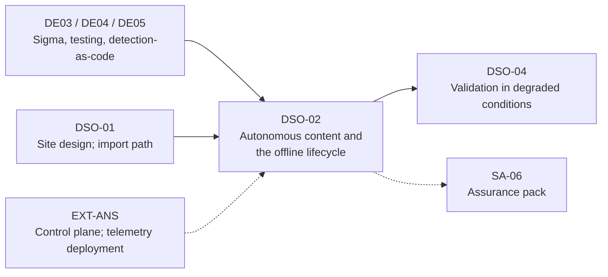

# DSO-02: Autonomous Detection Content and the Offline Content Lifecycle

> **Module type:** Extension module (elective deep dive) — part of [EXT-DSO](index.md)
> **Status:** Draft
> **Version:** v0.1
> **Last Reviewed:** 2026-09-13
> **Domain Expert:** _Unassigned — required before Practitioner Approved_
> **Practitioner Reviewer:** _Unassigned — required before Practitioner Approved (must have run detection-as-code for sites that receive content offline)_

!!! warning "Not a credit-bearing unit"
    DSO-02 is one module of the [EXT-DSO series](index.md). It carries **0 CP**, sits outside the 160 CP degree structure, and does not appear in [`docs/ksat-coverage.md`](../../ksat-coverage.md), which is generated from credit-bearing units only. Recognition, if any, is via the Tier 1 badge mechanism in [`docs/curriculum/micro-credentials-framework.md`](../../curriculum/micro-credentials-framework.md).

---

## Overview

The degree's detection-engineering units teach detection-as-code on one unstated assumption: the pipeline that reviews, converts and deploys a rule can reach the place the rule runs. [DE05](../../../degrees/operational/detection-engineering/DE05-detection-operations-management.md) Topic 4 puts rules in a repository, reviews them, converts them in continuous integration and pushes them to the platform. For a site of the kind [DSO-01](dso-01-monitoring-isolated-and-intermittent-sites.md) designs, the push has nowhere to go. Content reaches the site through a release point — a relay that is sometimes up, a cross domain solution's upward path, or media in a custodian's hand — and comes back the same way, later, with whatever the site changed while nobody could see it.

DSO-02 is the content lifecycle for that site. It decides which detections must run locally and which may stay central; treats the Sigma rule, its lineage fields and its correlation rules as the versioned artefact the lifecycle moves; makes per-site conversion a central, reproducible step whose output is shipped rather than recomputed; carries threat intelligence as STIX bundles because TAXII needs a network; defines the content bundle, its manifest, its activation tests and its rollback; measures drift when the site returns; and sets the governance — who authors, who approves, at what cadence, and how the site's own tuning flows back upstream.

Rule writing, conversion and testing as skills are [DE03](../../../degrees/operational/detection-engineering/DE03-writing-detection-logic.md) and [DE04](../../../degrees/operational/detection-engineering/DE04-adversary-simulation-detection.md) and are not retaught. The import path's authentication, inspection and quarantine are DSO-01 Topic 5 and are assumed.

---

## Where this module fits

| Existing unit or module | Relationship |
|---|---|
| [DE01](../../../degrees/operational/detection-engineering/DE01-detection-theory-philosophy.md) Topic 4, [DE05](../../../degrees/operational/detection-engineering/DE05-detection-operations-management.md) Topics 3–4 | Hard prerequisite. Detection-as-code, the lifecycle and coverage management are taken as read; DSO-02 changes only what must change when the pipeline cannot reach the site. |
| [DE03](../../../degrees/operational/detection-engineering/DE03-writing-detection-logic.md) Topics 1, 3 | Hard prerequisite. The Sigma standard and conversion. DSO-02 adds the lineage fields, correlation rules and pipelines as *lifecycle* objects. |
| [DE04](../../../degrees/operational/detection-engineering/DE04-adversary-simulation-detection.md) Topic 4 | Assumed. The detection-testing pipeline becomes the bundle's activation test. |
| [DSO-01](dso-01-monitoring-isolated-and-intermittent-sites.md) Topics 2, 5 | Hard prerequisite. The local stack the content runs on and the import path it enters by. |
| [EXT-ANS](../ansible-security-automation.md) Topics 4, 8 | Recommended. Supply-chain discipline for automation content and telemetry deployment; DSO-02 applies the same discipline to detection content. |
| DSO-04 | Forward. DSO-04 measures whether the content this module ships actually fires under failure. |

---

## Prerequisites

- **DE03** and **DE05** (hard); **DE04** (recommended). Learners must already write, convert and test Sigma rules.
- **DSO-01** (hard), in particular Lab 2's import path.
- Comfortable with Git, YAML, a scripting language, and either `sigma-cli` with a backend for a platform they can run, or the willingness to write a small matcher.

---

## Learning outcomes

On completion, a learner can:

1. **Classify** every rule in a detection set as local-mandatory, local-optional or central-only for a given site, from its level, log source availability, enrichment dependencies and the response it enables.
2. **Apply** the Sigma rule and correlation specifications' lineage and maturity fields — `id`, `status`, `level`, `related` and the correlation `type`, `group-by` and `timespan` — so that content history survives without a network.
3. **Design** a per-site conversion step — processing pipeline, backend, output format — that runs centrally, is reproducible, and ships its outputs with their inputs.
4. **Design** a threat-intelligence distribution for a site with no feed, using STIX 2.1 bundles, validity windows and staleness measurement in place of a TAXII connection.
5. **Create** a content bundle with manifest, activation tests, signatures and rollback, and the release cadence and emergency path for each isolation class.
6. **Evaluate** content drift on a site's return — versions, coverage, tests, indicator age, site-authored changes — and decide what merges upstream, with lineage recorded.

> Bloom's 3–6 (Apply / Analyse / Evaluate / Create), consistent with [`docs/content-standards.md`](../../content-standards.md).

---

## AQF Level 7 Alignment

**Knowledge (AQF 7.1):** specialised knowledge of the Sigma rule and correlation specifications as lifecycle objects, of STIX and TAXII as content and transport, and of the drift a disconnected site accumulates. **Skills (AQF 7.2):** cognitive skills to classify a rule set for a site and to design a reproducible, offline-capable release; communication skills to record lineage and merge decisions a stranger can audit. **Application (AQF 7.3):** applies these with judgement to a site whose content cannot be pushed, taking responsibility for what the site will not detect.

> This alignment statement is notional. DSO-02 is not credit-bearing and has not been through the AQF mapping process in [`docs/compliance/aqf-teqsa.md`](../../compliance/aqf-teqsa.md).

---

## Framework mappings

> **Provisional pending Framework Custodian review.** These do **not** feed [ksat-coverage](../../ksat-coverage.md).

### NIST NICE DCWF

| Version | Work Role | Code | T-Code | Task | Demonstrated in |
|---|---|---|---|---|---|
| 2023 | Cyber Defense Analyst | PR-CDA-001 | T0258 | Provide timely detection, identification and alerting of possible attacks | Lab 1, Lab 2 |
| 2023 | Cyber Defense Infrastructure Support | PR-INF-001 | T0335 | Build and maintain monitoring infrastructure | Lab 2 |
| 2023 | Security Architect | SP-ARC-002 | T0050 | Design system security architecture and supporting infrastructure | Topic 8, Summative |
| 2023 | Security Control Assessor | SP-RSK-002 | T0177 | Assess controls against frameworks and identify gaps | Lab 3 |

### SFIA 9

| Skill | Code | Level | Demonstrated in |
|---|---|---|---|
| Information security | SCTY | Level 5 | Lab 1, Summative |
| Methods and tools | METL | Level 4 | Topic 4, Lab 2 |
| Data management | DATM | Level 4 | Topic 5, Lab 3 |
| Solution architecture | ARCH | Level 4 | Topic 6, Topic 8 |
| Specialist advice | TECH | Level 4 | Summative (governance note) |

### ASD Cyber Skills Framework

| Domain | Sub-domain | Proficiency | Demonstrated in |
|---|---|---|---|
| Defensive Operations | Threat Detection | Advanced | Lab 1, Lab 2 |
| Defensive Operations | Monitoring Infrastructure | Practitioner–Advanced | Lab 2 |
| Security Architecture | Monitoring and logging architecture | Practitioner | Topic 6, Summative |

### Project-local KSATs

| Type | ID | Statement | Demonstrated in |
|---|---|---|---|
| Knowledge | DSO-02-K01 | Knowledge of the criteria that make a detection local-mandatory for an isolated site and of the consequence of running it centrally | Topic 1; Lab 1 |
| Knowledge | DSO-02-K02 | Knowledge of the Sigma rule specification's `id`, `status`, `level` and `related` semantics and of when a rule must receive a new identifier | Topic 2; Lab 2 |
| Knowledge | DSO-02-K03 | Knowledge of the Sigma correlation rule types and mandatory fields and of why backend support determines whether a correlation can run at a site | Topic 3; Lab 1 |
| Knowledge | DSO-02-K04 | Knowledge of processing pipelines (field mapping, added conditions, log source rewrites, priorities) as versioned per-site content | Topic 4; Lab 2 |
| Knowledge | DSO-02-K05 | Knowledge of STIX 2.1 bundles as the transport-agnostic container and of TAXII 2.1's dependence on HTTPS | Topic 5 |
| Knowledge | DSO-02-K06 | Knowledge of the content bundle's contents, manifest fields, activation test and rollback | Topic 6; Lab 2 |
| Skill | DSO-02-S01 | Skill in classifying a rule set for a site and recording the reason per rule | Lab 1 |
| Skill | DSO-02-S02 | Skill in producing a signed, versioned, tested content bundle centrally and importing it at a site through the DSO-01 path | Lab 2 |
| Skill | DSO-02-S03 | Skill in producing a drift report on a site's return and proposing site-authored content upstream with lineage | Lab 3 |
| Ability | DSO-02-A01 | Ability to set a release cadence and emergency content path per isolation class and defend it | Topic 8; Summative |
| Ability | DSO-02-A02 | Ability to state, for a site, what its content will not detect and for how long, as an assurance-pack entry | Summative |

---

## Module structure

| Part | Topics | Labs | Notional hours |
|---|---|---|---|
| A — Which content runs where | 1, 3 | 1 | 4 |
| B — Content as a versioned artefact | 2, 4, 5 | — | 3 |
| C — The bundle and its lifecycle | 6, 8 | 2 | 6 |
| D — Return and drift | 7 | 3 | 3 |
| E — Assessment | — | Formatives, Summative | 2 |
| | | | **18 hours** |

---

## Topics

### Topic 1: Which Detections Must Run Locally

A connected site runs whatever the central platform runs. An isolated site runs what fits its local stack (DSO-01 Topic 2) and what its watcher can act on. The first lifecycle decision is therefore a triage of the whole rule set, per site, recorded per rule.

| Class | Criterion | Consequence of getting it wrong |
|---|---|---|
| **Local-mandatory** | The rule's log source exists at the site; a true positive requires a response the site decider (DSO-01 Topic 7) is authorised to take; the rule's `level` is `high` or `critical` in the Sigma sense (an internal alert or an incident); the rule needs no enrichment the site lacks | Run centrally, it fires after the outage and the site's decider never knew |
| **Local-optional** | Source exists at the site; `level` is `medium` or below; useful for local triage context but not for local response | Omitting it costs context, not response; include when compute allows |
| **Central-only** | Needs cross-site correlation, organisation-wide baselines, enrichment the site cannot hold, or a log source the site does not have; or the response is one only the centre may take | Run locally, it either cannot fire (missing source) or fires on a baseline of one site and drowns the watcher |
| **Unsupported at site** | The site's backend cannot execute it (Topic 3), or its `status` is `unsupported` or `deprecated` | Shipped anyway, it silently never fires and the coverage map lies |

Three refinements this module adds, as design reasoning:

- **Level is necessary, not sufficient.** The Sigma `level` scale runs `informational`, `low`, `medium`, `high`, `critical`, with `high` meaning an event that should trigger an internal alert and `critical` one that indicates an incident. A `critical` rule for a source the site does not have is central-only; a `medium` rule that is the only warning the site's watcher gets for a locally reversible attack may be local-mandatory. Record the override and the reason.
- **Correlation changes the class.** A correlation rule that joins two local rules is local only if the site's backend supports the correlation type (Topic 3); otherwise the constituent rules run locally and the correlation runs centrally on the released findings, later.
- **Response authority is part of the criterion.** A rule whose only useful response is one the pre-authorised action list forbids on site is central-only however severe, because a local alert nobody may act on is a local distraction.

The output is a **site content profile**: the list of rule identifiers in each class with a one-line reason, versioned with the content (Topic 6). [DE05](../../../degrees/operational/detection-engineering/DE05-detection-operations-management.md) Topic 5's coverage map is then produced *per site profile*, not per organisation, so that the summative's coverage statement is honest about each site.

### Topic 2: The Rule as a Lifecycle Object

The Sigma rules specification (version 2.1.0, 2 August 2025) requires only `title`, `logsource` and `detection`. Everything the offline lifecycle depends on is optional in the specification and **mandatory in this module's profile**:

| Field | Specification | Why the offline lifecycle needs it |
|---|---|---|
| `id` | A randomly generated version-4 UUID; a new `id` is written for major changes, derivation and merging | The site and the centre must agree what "the same rule" means without talking; a stable UUID with a new one on major change is that agreement |
| `status` | `stable` (may be used in production), `test` (mostly stable, may need slight adjustment), `experimental` (could lead to false positives), `deprecated` (replaced or covered by another), `unsupported` (cannot be used in its current state) | An isolated site's watcher cannot ask whether an alert is trustworthy; `status` is the answer that travelled with the rule. This module ships only `stable` and `test` to Class II and III sites by default |
| `level` | `informational` through `critical` as in Topic 1 | Drives the Topic 1 triage and the local console's ordering |
| `related` | A list of `{id, type}` where `type` is `derived`, `obsolete`, `merged`, `renamed` or `similar` | Lineage without a repository: the site can tell that rule B obsoletes rule A even though it never saw the commit that did it |
| `date`, `modified` | ISO 8601 dates | Drift arithmetic (Topic 7) needs both |
| `tags` | Categorisation, including ATT&CK technique tags | Per-site coverage maps |
| `falsepositives` | Known false positives | The watcher's first tuning reference when nobody central can be asked |

**The rule this module adds.** Every content change that would, under the specification, warrant a new `id` — a major change to the logic, a derivation, a merge — *must* get one, and the old rule must be shipped once more with `status: deprecated` and the new rule's `related` entry pointing back with `obsolete` or `renamed`. A site that receives the new rule without the deprecation still runs the old one; a site that receives the deprecation without the new rule has a gap. The bundle (Topic 6) carries both, and the activation test checks the pair.

**Names as well as identifiers.** The specification allows a unique human-readable name to be used instead of the `id` as a reference. This module uses the `id` in manifests and `related` fields and the name only in reports, because a renamed rule keeps its `id` history through `related` and loses its name history entirely.

### Topic 3: Correlation Rules and Their Limits Offline

The Sigma correlation rules specification (also version 2.1.0, 2 August 2025) defines a `correlation` attribute with mandatory `type`, `rules`, `group-by`, `timespan` and `condition`, and optional `aliases` and `generate`. The types are `event_count`, `value_count`, `temporal`, `temporal_ordered`, `value_sum`, `value_avg` and `value_percentile`; `rules` may reference other correlation rules, so correlations chain; `timespan` is a number and a unit (seconds, minutes, hours, days); `condition` compares with `gt`, `gte`, `lt`, `lte`, `eq` or `neq`.

Two properties of the specification decide what an isolated site can run:

1. **Backends must raise an error for a mandatory feature they cannot convert**, and warn for optional ones such as temporal ordering. A correlation the site's backend cannot execute is therefore *known* to be unrunnable at conversion time, centrally, before it ships — provided conversion is done per site (Topic 4). This module's rule: a correlation that fails conversion for a site's backend is recorded in the site profile as **Unsupported at site**, its constituent rules are classified on their own merits, and the correlation is scheduled centrally on released findings.
2. **`timespan` is a wall-clock window**, and the site's clock has a drift budget (DSO-01 Topic 8). A `temporal_ordered` correlation with a five-second window across two sources whose clocks may differ by ten seconds cannot be trusted at the site. This module's rule: the site profile records the tightest `timespan` in the local set, and the drift budget must be smaller by a stated margin; otherwise the correlation is central-only.

**What runs where, for a typical local set** (this module's reasoning): `event_count` and `value_count` over one local source with windows of minutes are the local workhorses — repeated failures, distinct destinations, distinct accounts from one host. `temporal` across two local sources is local when both sources are reliably timestamped by the same clock. Anything with a `timespan` in days or a `group-by` that expects organisation-wide cardinality is central-only, because the site's baseline is one site.

### Topic 4: Pipelines and Per-Site Conversion

A Sigma rule is generic; the query that runs at a site is not. In the Sigma toolchain a **processing pipeline** is a YAML file listing ordered transformations applied before backend conversion: field mapping (a rule's `CommandLine` to a site's `process`), added conditions (an index or stream selector), and log source rewrites from generic categories to what the site actually collects. Pipelines carry a `priority`; the convention places log source pipelines at 10 and backend pipelines at 50, and several may be chained. `sigma-cli` converts with a target backend and one or more pipelines, writes to a file or a directory, and offers backend-specific output formats; backends are installed as plugins.

For a connected estate the pipeline is a build detail. For an isolated site this module makes three decisions:

| Decision | Position | Reason |
|---|---|---|
| **Where conversion runs** | Centrally, per site, in the release build | The site's stack is compute-constrained (DSO-01 Topic 2) and may not carry the toolchain; the centre has the backends installed and can fail the build when a rule does not convert (Topic 3) |
| **What ships** | The source rule, the site's pipeline(s) with their version, the converted query, and the converter's version, all in the bundle | A site that receives only queries cannot audit them against the rule; a site that receives only rules cannot run them; the pipeline version is what changed when a query silently changed |
| **Who owns the pipeline** | The site, reviewed by the centre | The pipeline encodes the site's field names and indexes; only the site knows them; the centre reviews so that two sites do not drift into different meanings of the same rule |

The consequence for the content profile: every rule has, per site, a conversion result (converted, converted with warnings, failed) that is part of the bundle's manifest (Topic 6). A rule that failed conversion for a site is Unsupported at that site, whatever its class elsewhere.

**Site-specific field names in this repository.** The lab dataset used across the degree's Splunk and Elastic modules uses CIM-aligned names (`process_name`, `parent_process_name`, `process`, `user`, `dest`, `EventCode`), so a pipeline for it maps Sigma's Windows process-creation fields (`Image`, `ParentImage`, `CommandLine`, `User`, `ComputerName`) onto those. Lab 2 writes that pipeline.

### Topic 5: Threat Intelligence Without a Feed

STIX Version 2.1 (OASIS Standard, 10 June 2021) defines the objects — indicators, malware, attack patterns, intrusion sets, reports and thirteen others — and a **Bundle**, "a wrapper mechanism for packaging arbitrary STIX content together", explicitly for transporting bulk content over non-TAXII mechanisms. TAXII Version 2.1 (OASIS Standard, 10 June 2021) is "an application layer protocol for the communication of cyber threat information" over HTTPS, with discovery, API root, collection, objects and manifest endpoints; it defines no offline exchange.

The design follows directly: **the site consumes STIX bundles delivered through the import path; TAXII is how the centre collects, not how the site receives.** What the centre must do that a feed would otherwise do for the site:

- **Select.** Not the whole feed. The site profile (Topic 1) names the indicator types and sources the local stack can match — domains and addresses against the site's DNS and proxy logs, hashes against its process logs — and the bundle carries only those.
- **Bound validity.** An indicator carries a validity window and can be revoked. The bundle's manifest states, for the whole indicator set, the latest `modified` timestamp it contains and the date after which the centre considers the set stale. The precise field names for validity and revocation are not restated here: they are in the STIX specification's Indicator object and are flagged in the verification table as not re-read for this draft.
- **Measure staleness at the site.** The local stack records the age of its indicator set as a pipeline-health metric (DSO-01 Topic 2) and releases it with findings. A Class III site whose courier is monthly runs on indicators up to a month old and the residual-risk entry says so.
- **Age out locally.** Indicators past the manifest's stale date stop generating alerts and start generating `informational` context, so that a stale match is visible but does not drive response. This is this module's design reasoning; no source states it.
- **Return matches.** Indicator hits at the site are findings; they go back through the release bundle with the indicator `id`, so the centre can close the loop with its own sources.

**Sightings and site-authored intelligence.** Something first observed at an isolated site is intelligence the centre lacks. The site records it locally as a STIX object with the site as `created_by` and it travels upstream with the findings, subject to the release point's sanitisation (DSO-01 Topic 4). Topic 7 covers the merge.

### Topic 6: The Content Bundle

Everything Topics 1 to 5 produce for a site is one signed, versioned artefact. This module's bundle, which Lab 2 builds:

| Part | Contents | Purpose |
|---|---|---|
| **Manifest** | Bundle version (monotonic integer); site identifier; build timestamp; converter and pipeline versions; for each rule: `id`, `title`, `status`, `level`, class (Topic 1), conversion result, test result; indicator set latest `modified` and stale date; digests of every file; the manifest itself signed | Everything the site needs to decide whether to activate, and everything the drift report (Topic 7) needs later |
| **Rules** | Sigma source rules for the site profile, including the deprecated ones still in transition (Topic 2) | Audit; local re-conversion if the site has the toolchain |
| **Queries** | Converted per-site queries, one per rule, plus correlation queries where supported | What the local stack actually loads |
| **Pipelines** | The site's processing pipeline(s), versioned | Explains the queries; reused by the site's own authoring (Topic 7) |
| **Parsers and field mappings** | Any normalisation the rules depend on (DE02) | A rule that arrives before its parser silently never fires |
| **Indicators** | A STIX 2.1 bundle | Topic 5 |
| **Tests** | For each rule: at least one event that must match and one that must not, in the site's field names; for each correlation: a short sequence | The activation test the site runs before going live |
| **Exceptions** | The suppression and tuning list the site had at last return, merged with the centre's | Without it, activation reverts the site's tuning |
| **Notes** | What changed since the last bundle for this site, in prose | The watcher reads this; the manifest is for machines |

**Activation** (extending DSO-01 Topic 5's quarantine step): verify signature and version; stage; load queries into a staging instance or a dry-run mode; run every test; compare the rule inventory with the manifest; only then swap. A test failure blocks the whole bundle by default, because a partially activated bundle is a state the centre cannot reason about later; the site may override for a named rule with the override logged and released.

**Rollback.** The previous bundle stays on the site until the next one activates successfully. Rollback is a swap back, logged, and the reason is released with the next findings. A site that cannot roll back is a site whose content is one bad release from silence.

**Size.** Bundles for Class III sites cross on media with a cap (DSO-01 Lab 2). The manifest is small; queries and tests are small; indicator sets and parsers are what grow. The centre ships indicator deltas after the first full set, with the manifest naming the base version the delta applies to.

### Topic 7: Drift, Return and the Site as an Author

When the site reconnects or its media returns, two things have diverged: the centre's content moved on, and the site changed things. The **drift report** is the artefact that makes both visible, and this module's position is that it is produced *before* any new bundle goes to the site.

| Measure | How | What it drives |
|---|---|---|
| **Version gap** | Site's active bundle version against the centre's current for that site | How many releases the site missed; whether a delta chain or a full bundle is needed |
| **Rule delta** | Rule `id` sets: added, deprecated, changed `status` or `level`; `related` chains resolved | The notes for the next bundle; whether any local-mandatory rule was missing for the whole isolation |
| **Coverage delta** | Per-site technique coverage from `tags`, before and after, in the form DE05 Topic 5 uses | The residual-risk entry: which techniques the site could not detect, for how long |
| **Test delta** | Activation-test results the site logged during isolation against the centre's expectations | Whether something at the site broke a rule the centre thinks is running |
| **Indicator age** | Site's indicator set date against the centre's | How stale the site ran; whether any hit at the site was on an indicator the centre had since revoked |
| **Site-authored content** | Rules, exceptions, indicators and sightings created at the site, with the site's identifier as author | The merge decision below |
| **Clock offset at return** | From DSO-01 Topic 8 | Whether the site's `timespan`-based findings are trustworthy |

**Merge policy** (this module's reasoning). The site is an author with a narrower view. Its exceptions are usually correct for the site and wrong elsewhere: they merge into the *site profile*, not the global rule. Its rules are proposals: they enter the central repository as `experimental` with `related: derived` where they came from an existing rule, go through the DE05 review, and return to the site in a later bundle as `test` or `stable` under a new central `id` with `related: renamed` pointing at the site's. Its sightings and indicators merge as intelligence with the site as source. Nothing site-authored is discarded silently; a rejected proposal goes back in the next bundle's notes with the reason.

**Two-way, not push.** The lifecycle for an isolated site is therefore a loop with the site as one of its authors, and the summative marks whether the candidate designed the return path with the same care as the outbound one.

### Topic 8: Governance and Cadence

Detection content is code that decides what an organisation sees. For an isolated site it is also the only thing that decides, for as long as the isolation lasts. The governance this module specifies, extending DE05 Topic 4's review and EXT-ANS Topic 4's supply-chain discipline:

- **Authoring authority.** Central detection engineering authors global content; sites author site content under Topic 7's merge policy; nobody authors directly on a production site outside the emergency path below.
- **Approval.** Global content follows DE05 review. A site profile change (a rule moving between classes) is approved by the site decider and the central lead jointly, because it changes what the site will and will not act on.
- **Release cadence, per isolation class** (DSO-01 Topic 1): Class I, on every merge while the link is up, with the site pulling on reconnection; Class II, on the cross domain solution's transfer cadence, which the content team does not control and must design around; Class III, on the courier's schedule, with the bundle built the day before departure; Class IV, on the engineering maintenance window and no other.
- **Emergency path.** A signed hotfix bundle containing one or a few rules and their tests, with the same activation discipline and no shortcut on signature or test, but a shorter review. For Class III the emergency path is an unscheduled courier; the design states who can call one and what it costs.
- **Deprecation propagation.** A rule deprecated centrally is shipped once more as deprecated to every site profile that had it, and the drift report confirms it stopped running everywhere. Until then it is counted as still live.
- **Evidence for the assurance pack** (SA-06): the site profile with reasons; the bundle manifests with test results; the drift reports; the merge decisions; the residual-risk entry per site stating what the content cannot detect and the longest period it ran stale.

---

## Labs & exercises

> Labs use only free tooling: the SigmaHQ public rule repository, `sigma-cli` with a free backend where the learner has a platform (the degree's Splunk or Elastic lab environments), or a small stdlib matcher for rules using only equality, `contains`, `startswith` and `endswith`, the repository's lab dataset generator, `gpg` or `minisign`, and a scripting language.

### Lab 1: Triage a Rule Set for a Site

**Objective:** Produce a site content profile (Topic 1) for a fictional site from thirty public Sigma rules, including the correlation rules the site cannot run.

**Prerequisites:** Topics 1–3; DE03 Lab 1

**Environment:** A clone of the public SigmaHQ rule repository; a text editor; the fictional site brief (log sources present, backend, drift budget, pre-authorised action list).

**Instructions:**

1. Select thirty rules across process creation, authentication, DNS and proxy log sources, including at least three with `status: experimental`, two with `status: deprecated`, and five correlation rules of at least three different `type` values.
2. For each rule, record `id`, `title`, `status`, `level`, `logsource` and the ATT&CK tags.
3. Apply Topic 1's table: classify each rule for the site, with a one-line reason. Apply the three refinements explicitly where they change the answer.
4. For each correlation rule, decide from the site brief's backend and drift budget whether it is runnable at the site (Topic 3). Record the constituent rules' classes separately.
5. For each `deprecated` rule, resolve its `related` chain and state which rule replaces it and whether that replacement is in your set.
6. Produce the per-site coverage map from the local-mandatory and local-optional rules' tags, and the list of techniques the site will *not* detect locally.

**Expected output:** The site content profile as a table; the correlation runnability decisions; the resolved deprecation chains; the per-site coverage map and the not-detected list.

**Reflection questions:**

1. Which rule did the "response authority" refinement move from local-mandatory to central-only, and what would the site's watcher have done with its alert otherwise?
2. A `temporal_ordered` correlation with a two-minute window: runnable at a site with a thirty-second drift budget? At five minutes?
3. Your not-detected list is the residual-risk entry. Write it in two sentences an authorising officer would accept.

### Lab 2: Build and Deliver a Content Bundle Offline

**Objective:** Build the Topic 6 bundle centrally for the DSO-01 Lab 2 site, deliver it through that lab's import path, run the activation tests against the lab dataset, activate, then ship a second bundle that deprecates one rule and renames another, and prove the site handles the lineage.

**Prerequisites:** DSO-01 Lab 2 completed and its `site` and `central` nodes available; Topics 2, 4, 6; DE03 Lab 2

**Environment:**

- The DSO-01 Lab 2 nodes, still with no network path between them
- The lab dataset: `python3 labs/generator/generate.py` from the repository, giving JSON events per index with the field names in `labs/docs/data-model.md`
- On `central`: `sigma-cli` with a backend for a platform the learner runs, **or** a stdlib matcher the learner writes for the four modifiers named above; `gpg` or `minisign`
- On `site`: whatever executes the converted queries — the learner's platform, or the same matcher

**Instructions:**

1. On `central`, create a Git repository with ten Sigma rules from Lab 1's local-mandatory set that target `process_creation` and authentication sources, plus one `event_count` correlation over repeated authentication failures.
2. Write the site's processing pipeline: map `Image` → `process_name`, `ParentImage` → `parent_process_name`, `CommandLine` → `process`, `User` → `user`, `ComputerName` → `dest`, and rewrite the generic Windows process-creation log source to `EventCode: 1` in the `sysmon` index. Version it.
3. Convert every rule for the site with the pipeline. Record each conversion result. If the correlation fails to convert for your backend, mark it Unsupported at site and keep the constituent rule.
4. Write tests: for each rule, one event from the lab dataset (or edited from one) that must match and one that must not, in the site's field names.
5. Build the bundle (Topic 6's parts) with a manifest listing every field in the table. Sign the manifest. Record the bundle's digest in the DSO-01 transfer register.
6. Deliver through the DSO-01 Lab 2 content-import path. On `site`: verify, stage, run every test against the staged queries, compare inventory with manifest, activate. Log each step.
7. Build bundle version 2: change one rule's logic materially (new `id`, old rule shipped as `deprecated`, new rule `related: obsolete` to the old), rename another (`related: renamed`), and tighten the correlation threshold. Deliver and activate. Prove from the site's inventory that the old rule is no longer live and that the renamed rule kept its history.
8. Replay bundle version 1. Prove refusal. Then break one test in a version 3 and prove the whole bundle is blocked and version 2 stays active.

**Expected output:** The rule repository and pipeline (committed); conversion results; the tests; two signed bundles and the transfer-register entries; the site's activation logs for versions 1 and 2; the inventory evidence for the deprecation and rename; the refused replay; the blocked version 3 with version 2 still active.

**Reflection questions:**

1. Your pipeline rewrote the log source to one index. What happens to a rule whose `logsource.category` your site does not collect, and does the manifest make that visible?
2. The site overrode a failing test for one rule. Where is that override recorded, and when does the centre learn of it?
3. Estimate the bundle's size with a 50,000-indicator STIX set. Does it fit the DSO-01 Lab 2 media cap? Design the delta.

### Lab 3: The Drift Report and the Site as Author

**Objective:** Simulate a fortnight of isolation using the lab dataset's fourteen-day window, have the site author an exception and a rule, and on return produce the Topic 7 drift report and merge decisions.

**Prerequisites:** Lab 2; Topics 5, 7, 8

**Environment:** The Lab 2 nodes; the lab dataset with the instructor truth labels enabled (`--with-truth`) so that site-authored detections can be scored.

**Instructions:**

1. On `site`, run the version 2 content against the full fourteen-day dataset. Record activation-test results daily (a script is fine) and indicator-set age daily.
2. Author on `site`: one exception suppressing a recurring benign match for one rule (record the rule `id`, the field, the value and the reason), and one new rule for a behaviour the dataset contains that the shipped set misses (use the truth labels to find one). Give the rule a site `id`, `status: experimental`, and `author` set to the site identifier.
3. Meanwhile on `central`, advance the repository: deprecate one shipped rule, add two new ones, revoke one indicator the site has, and change the pipeline version.
4. "Return": copy the site's release bundle (findings, activation logs, site-authored content, clock offset) to `central` through the DSO-01 outward path.
5. Produce the drift report with every row of Topic 7's table. For the coverage delta, produce before-and-after technique lists from `tags`.
6. Apply the merge policy: the exception into the site profile; the site rule into the central repository as `experimental` with `related` lineage; the indicator hit on the revoked indicator flagged. Write the merge decision for each in two lines.
7. Build bundle version 3 for the site incorporating the merges, with notes that tell the watcher what happened to their proposal.

**Expected output:** The daily test and indicator-age records; the site-authored exception and rule; the drift report; the merge decisions; bundle version 3's notes.

**Reflection questions:**

1. The site's rule scored well on truth labels for this site. Argue why it still enters the centre as `experimental`.
2. Which drift measure would have told you first if the site had been silently blind for a week?
3. Your indicator revocation reached the site fourteen days late. What did the site do with the hit in the meantime, and was that the right default?

---

## Assessment

### Formative 1: Classify the Rule

Fifteen short rule descriptions with `status`, `level`, `logsource` and, where relevant, correlation `type` and `timespan`, against a stated site brief. For each, give the class, and where a refinement or Topic 3 rule changes the answer, name it. Self-marked against a key that argues both sides for four contested cases. **Assesses LO1, LO2.**

### Formative 2: Critique the Bundle

A manifest and notes for a fictional bundle containing at least six defects: a rule changed materially without a new `id`; a deprecation shipped without its replacement; a converted query with no source rule; a correlation whose `timespan` is inside the site's drift budget; an indicator set with no stale date; and an exceptions file missing, so activation would revert the site's tuning. Identify each defect, cite the topic or specification clause it violates, and state the fix. **Assesses LO2, LO3, LO4, LO5.**

### Summative: Offline Content Lifecycle Design

For a described Australian organisation with three sites in different isolation classes (DSO-01's summative estate or the one provided), produce:

1. A **site content profile** for each site, with reasons per rule for a supplied rule set of at least forty rules including correlations (Lab 1 pattern), and the per-site not-detected list.
2. A **conversion and bundle design**: pipelines per site, what ships, the manifest schema, activation test policy, rollback and size handling for the Class III site.
3. A **threat-intelligence distribution design** per site: selection, validity bounding, staleness measurement, age-out and return of matches.
4. A **governance note**: authoring, approval, cadence per site, emergency path, deprecation propagation.
5. A **drift and merge procedure**, with the drift report template and the merge policy applied to two worked examples.
6. An **assurance-pack entry** per site stating what the content cannot detect, the longest period it may run stale, and the residual risk accepted.

**Assesses LO1–LO6.**

**Rubric:**

| Criterion | Exemplary | Proficient | Developing | Beginning |
|---|---|---|---|---|
| **Site profiles** | Every rule classed with a reason; refinements and correlation limits applied; not-detected list honest | Classes correct with reasons; minor gaps in correlations | Classes by `level` alone | One profile for all sites |
| **Lineage and specification use** | `id`, `status`, `level`, `related` used exactly as the specification defines; deprecations paired with replacements | Correct with minor lapses | `related` unused; names used as identifiers | Rules unversioned |
| **Conversion and bundle** | Per-site conversion central and reproducible; bundle complete with manifest, tests, exceptions, rollback; size handled | Bundle complete; one part weak | Queries shipped without sources or tests | Rules pushed by hand |
| **Threat intelligence** | STIX bundle design with selection, validity, staleness, age-out and return; TAXII correctly placed at the centre | Design present; staleness handled | Feed assumed | Absent |
| **Governance and drift** | Cadence per class, emergency path, deprecation propagation, drift report and merge policy with worked examples | Present with minor gaps | Push-only lifecycle | No return path |
| **Candour** | Assurance entries state blindness and staleness plainly | Stated with imprecision | Implied | Absent |

**Assessment-to-LO mapping:**

| Assessment task | Learning outcomes addressed |
|---|---|
| Formative 1: Classify the Rule | LO1, LO2 |
| Formative 2: Critique the Bundle | LO2, LO3, LO4, LO5 |
| Summative item 1: site content profiles | LO1 |
| Summative item 2: conversion and bundle design | LO2, LO3, LO5 |
| Summative item 3: threat-intelligence distribution | LO4 |
| Summative items 4 and 5: governance, drift and merge | LO5, LO6 |
| Summative item 6: assurance-pack entries | LO6 |

---

## Australian context

**Detection strategy is an ASD logging factor.** ASD's *Best practices for event logging and threat detection* names a detection strategy as one of its four key factors alongside the logging policy, centralised correlation and secure storage (SA-05 Australian context). For an isolated site the detection strategy *is* the site content profile of Topic 1, and this module treats that profile as the artefact ASD's factor asks for at site scale. The connection is this module's reading; the guidance does not discuss disconnected sites.

**Content crossing a cross domain solution.** Where the site is a Class II enclave, the content bundle enters through the cross domain solution's upward path and is subject to its content filter, protocol break and independent enforcing functions (ISM-0635, ISM-1521, ISM-1522, as applied in DSO-01 Topic 4). The bundle's file-based design — YAML, JSON, signatures, no session — is chosen partly so that it *can* cross a protocol break; a content-delivery mechanism that needs a live connection to a repository cannot. The site's findings and site-authored content returning downward are subject to the transfer policy and its quarterly sample (ISM-1523). Which of a rule's fields may leave a higher domain is a handling decision the transfer policy makes; this module does not decide it and flags the question.

**Critical infrastructure.** For an OT site of a responsible entity under the *Security of Critical Infrastructure Act 2018* (Cth), content for the monitoring sensor changes only on the engineering maintenance window (Topic 8), and the sensor's rule set is part of what the entity can show it monitors. The connection to the Act's risk-management obligations is this module's inference; [GR04](../../../degrees/strategic/grc/GR04-australian-regulatory-environment.md) is the regulatory home.

**Sharing and sightings.** Site-authored intelligence and sightings are, once merged, candidates for sharing through the channels [DE05](../../../degrees/operational/detection-engineering/DE05-detection-operations-management.md) and the threat-intelligence units describe. This module names no Australian sharing programme; ASD's reporting channel (cyber.gov.au and 1300 CYBER1) applies to incidents, and the delay an isolated site imposes on reporting is recorded in DSO-01's residual-risk entry.

---

## Verification status

| Item | Status | Action required |
|---|---|---|
| Sigma rules specification: version 2.1.0 (2025-08-02); required fields; `status`, `level`, `related` values and meanings; new `id` on major change, derivation, merge; name as alternative reference | Verified against the specification on GitHub, 2026-09-13 | Check for a later release before delivery |
| Sigma correlation rules specification: version 2.1.0 (2025-08-02); mandatory and optional fields; types; chaining; backend error and warning behaviour | Verified against the specification on GitHub, 2026-09-13 | — |
| Processing pipelines: transformations, priorities 10 and 50, `sigma convert -t … -p …`, plugins installed separately | Verified against the pySigma pipelines documentation and the sigma-cli README, 2026-09-13 | `sigma check` behaviour not read in detail; Lab 2 does not depend on it |
| STIX 2.1 and TAXII 2.1: OASIS Standards, 10 June 2021; Bundle definition and purpose; TAXII is HTTPS-only and defines no offline exchange; 18 domain object types | Verified against the OASIS specification pages, 2026-09-13 | — |
| STIX Indicator validity and revocation fields | **Not re-read**; referenced generically in Topic 5 | Confirm field names in the Indicator object before Lab 2's indicator work is taught |
| Lab dataset field names (`process_name`, `parent_process_name`, `process`, `user`, `dest`, `EventCode`; index `sysmon`) | Verified against `labs/docs/data-model.md` in this repository | — |
| Topic 1 classes and refinements; Topic 3 drift-budget rule; Topic 5 age-out; Topic 6 bundle; Topic 7 merge policy; Topic 8 cadence | **This module's design reasoning** | Practitioner Reviewer to confirm against field practice |
| Coverage-map form "as DE05 Topic 5 uses" | Referenced by unit; the exact Navigator layer format not restated | — |
| NICE T-codes, SFIA levels, ASD CSF sub-domains, KSAT IDs | Provisional | Framework Custodian |
| ISM control identifiers (0635, 1521, 1522, 1523) | Transcribed via DSO-01 from the September 2026 *Guidelines for gateways* | Re-verify against the live ISM |
| *Security of Critical Infrastructure Act 2018* (Cth) connection | **Inference** | Confirm before teaching |

---

## Further reading

- [SigmaHQ — Sigma Rules Specification](https://github.com/SigmaHQ/sigma-specification/blob/main/specification/sigma-rules-specification.md) — the rule attributes, `status`, `level` and `related` semantics Topic 2 turns into lifecycle rules.
    > Relevance: primary source for every field this module makes mandatory.
- [SigmaHQ — Sigma Correlation Rules Specification](https://github.com/SigmaHQ/sigma-specification/blob/main/specification/sigma-correlation-rules-specification.md) — correlation types, mandatory fields, chaining and backend obligations.
    > Relevance: Topic 3's runnability decisions.
- [SigmaHQ — Processing pipelines](https://sigmahq.io/docs/digging-deeper/pipelines.html) — field mapping, added conditions, log source rewrites, priorities.
    > Relevance: Topic 4's per-site conversion design.
- [SigmaHQ — sigma-cli](https://github.com/SigmaHQ/sigma-cli) — `convert`, `list`, `plugin`, output files and formats.
    > Relevance: the tool Lab 2 uses centrally.
- [OASIS — STIX Version 2.1](https://docs.oasis-open.org/cti/stix/v2.1/os/stix-v2.1-os.html) — objects and the Bundle.
    > Relevance: Topic 5's container for offline intelligence.
- [OASIS — TAXII Version 2.1](https://docs.oasis-open.org/cti/taxii/v2.1/os/taxii-v2.1-os.html) — the HTTPS transport that the site cannot use.
    > Relevance: why the centre collects by TAXII and the site receives bundles.
- [ASD — Best practices for event logging and threat detection](https://www.cyber.gov.au/resources-business-and-government/maintaining-devices-and-systems/system-hardening-and-administration/system-monitoring/best-practices-event-logging-threat-detection) — detection strategy as a logging factor (**Australian source**).
    > Relevance: the Australian framing of the site content profile.
- [ASD — Information Security Manual: Guidelines for gateways](https://www.cyber.gov.au/resources-business-and-government/essential-cyber-security/ism/cyber-security-guidelines/guidelines-gateways) — the cross domain solution controls content must cross (**Australian source**).
    > Relevance: why the bundle is file-based and session-free.
- [DE05 — Detection Operations & Management](../../../degrees/operational/detection-engineering/DE05-detection-operations-management.md) — the connected lifecycle this module adapts.
    > Relevance: Topics 3–5 of DE05 are the baseline every DSO-02 decision departs from.

---

## Module metadata

| Field | Value |
|---|---|
| Module Code | DSO-02 |
| Module Title | Autonomous Detection Content and the Offline Content Lifecycle |
| Module Type | Extension module (elective; **not** credit-bearing) |
| Version | v0.1 |
| Status | Draft |
| Credit Points | 0 CP — outside the 160 CP degree structure |
| Notional Hours | 18 |
| Extends | DE05 (Topics 3–5); DE03 (Topics 1, 3); DSO-01 (Topics 2, 5) |
| Related Units | DE01, DE02, DE04, SA-05, SA-06, EXT-ANS, EXT-SPL, GR04 |
| Prerequisites | DE03, DE05, DSO-01 (DE04 and EXT-ANS recommended) |
| Domain Expert | _Unassigned — required before Practitioner Approved_ |
| Practitioner Reviewer | _Unassigned — required before Practitioner Approved_ |
| Last Reviewed | 2026-09-13 |
| Framework Version — NICE DCWF | 2023 |
| Framework Version — SFIA | SFIA 9 (2023) — verified code set |
| Framework Version — ASD CSF | 2024 |
| Framework Version — Sigma | Rules and correlation specifications v2.1.0 (2025-08-02) |
| Framework Version — STIX / TAXII | 2.1 (OASIS Standards, 2021-06-10) |
| Bloom's Level (range) | 3–6 (Apply, Analyse, Evaluate, Create) |
| Australian Legislation Referenced | Security of Critical Infrastructure Act 2018 (Cth) (inference, flagged) |
| Tooling Licence Position | All lab tooling free/open-source (SigmaHQ rules and sigma-cli, or a stdlib matcher; the repository's lab dataset generator; gpg or minisign); a platform backend is optional and the degree's free Splunk or Elastic lab environments suffice (R3) |
| Licence | CC BY 4.0 |
