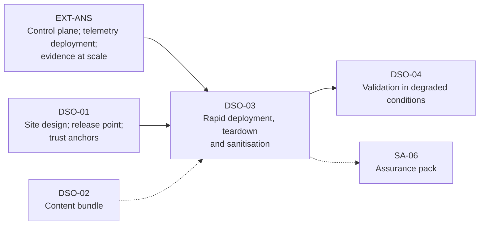

# DSO-03: Rapid Deployment, Teardown and Sanitisation

> **Module type:** Extension module (elective deep dive) — part of [EXT-DSO](index.md)
> **Status:** Draft
> **Version:** v0.1
> **Last Reviewed:** 2026-09-13
> **Domain Expert:** _Unassigned — required before Practitioner Approved_
> **Practitioner Reviewer:** _Unassigned — required before Practitioner Approved (must have stood up and torn down a monitoring capability at a temporary or classified site, including media sanitisation under the ISM)_

!!! warning "Not a credit-bearing unit"
    DSO-03 is one module of the [EXT-DSO series](index.md). It carries **0 CP**, sits outside the 168 CP degree structure, and does not appear in [`docs/ksat-coverage.md`](../../ksat-coverage.md), which is generated from credit-bearing units only. Recognition, if any, is via the Tier 1 badge mechanism in [`docs/curriculum/micro-credentials-framework.md`](../../curriculum/micro-credentials-framework.md).

!!! danger "Sanitisation controls are restated by intent; the lab models them, it does not certify anything"
    The ISM's media, IT equipment and data-transfer controls are cited by identifier from the September 2026 edition and paraphrased. The ISM changes quarterly, several controls apply only at SECRET and TOP SECRET, and destruction equipment and outsourcing are governed by lists this module has not read. The labs sanitise loop files and container volumes to teach the procedure and its evidence. Nothing in them sanitises real media to any standard.

---

## Overview

A permanent site's monitoring stack is built once and maintained. A temporary site's is built many times: stood up in hours for a survey season, a construction phase, a disaster response, a short project inside a customer's classified enclave, then torn down, its media sanitised or destroyed, its equipment redeployed. [DSO-01](dso-01-monitoring-isolated-and-intermittent-sites.md) designs what such a site runs while it exists. [DSO-02](dso-02-autonomous-detection-content-offline-lifecycle.md) keeps its content current. Neither says how the site comes into being fast enough to be useful, or how it stops existing without leaving data behind.

DSO-03 treats the site's whole lifecycle — stand-up, operation with removable media, teardown, sanitisation, destruction and disposal — as one architectural object with evidence at every phase. It builds the local stack as a reproducible image with pre-staged configuration and trust anchors, and verifies it live with a canary before handing it to the operating model; it applies the ISM's media and data-transfer controls to the site's daily traffic of removable media; it specifies a teardown runbook whose first act is the last release bundle and whose last act is a signed sanitisation record; and it uses NIST SP 800-88 Rev. 2's clear, purge and destroy methods and the ISM's per-media-type sanitisation controls to argue that *the choice of media is a stand-up decision*, because it determines whether a clean teardown is possible at all.

Configuration management, automation control planes and evidence collection at scale are [EXT-ANS](../ansible-security-automation.md) and are not retaught.

---

## Where this module fits

| Existing unit or module | Relationship |
|---|---|
| [EXT-ANS](../ansible-security-automation.md) Topics 4, 7, 8; Lab 7 | Hard prerequisite. Supply-chain discipline for automation content, evidence collection and its limits, and deploy-and-verify with a canary are taken as read; DSO-03 applies them to a site that must be built in hours and unbuilt without residue. |
| [DSO-01](dso-01-monitoring-isolated-and-intermittent-sites.md) Topics 2, 3, 7, 8 | Hard prerequisite. The local stack, release-point patterns, operating model and trust anchors are what DSO-03 stands up and tears down. |
| [DSO-02](dso-02-autonomous-detection-content-offline-lifecycle.md) Topic 6 | Recommended. The content bundle is pre-staged at stand-up and exported at teardown. |
| [SA-04](../security-architecture/sa-04-network-gateway-and-access-architecture.md) Topic 6 | Assumed. Cross domain solution controls that govern media crossing a classified boundary. |
| [OC04](../../../core/units/OC04-incident-response-lifecycle.md) | Assumed. Evidence preservation at teardown follows incident-response fundamentals. |
| [SA-06](../security-architecture/sa-06-assurance-maturity-and-authorisation.md) | Forward. Every phase names the evidence it contributes. |

---

## Prerequisites

- **EXT-ANS** (hard) and **DSO-01** (hard); **DSO-02** recommended.
- **OC04** (hard) for evidence preservation.
- Comfortable with Linux, containers or virtual machines, `cryptsetup`, `dd`, `sha256sum`, and either Ansible or a scripting language for the build.

---

## Learning outcomes

On completion, a learner can:

1. **Design** a site lifecycle — stand-up, operation, teardown, sanitisation, disposal — as one object with the ISM system documentation, registers and evidence each phase requires.
2. **Create** a reproducible site build: image, pre-staged configuration, trust anchors, content bundle and registers, with digests, an acceptance test and a measured time to operational.
3. **Apply** the ISM's media usage and data-transfer controls to a site's removable-media traffic, including labelling, classification and reclassification, encryption, write-once transfer, import scanning, export checks and transfer logging.
4. **Design** a teardown runbook whose order of operations preserves evidence, releases the final bundle, revokes trust, and leaves nothing on site that the sanitisation plan cannot account for.
5. **Evaluate** sanitisation options for each media type at a site using SP 800-88 Rev. 2's clear, purge and destroy methods and the ISM's per-media controls, and show how that evaluation constrains the stand-up media choice.
6. **Justify** the site's lifecycle evidence — build digests, acceptance record, transfer logs, teardown checklist, sanitisation certificates, destruction and disposal decisions — as an assurance-pack contribution with the residual risk stated.

> Bloom's 3–6 (Apply / Analyse / Evaluate / Create), consistent with [`docs/content-standards.md`](../../content-standards.md).

---

## AQF Level 7 Alignment

**Knowledge (AQF 7.1):** specialised knowledge of reproducible builds, the ISM's media, IT equipment and data-transfer controls, and NIST's sanitisation methods and assurance model. **Skills (AQF 7.2):** cognitive skills to sequence a stand-up and a teardown so that evidence is preserved and residue eliminated; communication skills to record each phase in a form a stranger can audit. **Application (AQF 7.3):** applies these with judgement to a temporary site, taking responsibility for media that cannot be reclassified and for what the evidence does not prove.

> This alignment statement is notional. DSO-03 is not credit-bearing and has not been through the AQF mapping process in [`docs/compliance/aqf-teqsa.md`](../../compliance/aqf-teqsa.md).

---

## Framework mappings

> **Provisional pending Framework Custodian review.** These do **not** feed [ksat-coverage](../../ksat-coverage.md).

### NIST NICE DCWF

| Version | Work Role | Code | T-Code | Task | Demonstrated in |
|---|---|---|---|---|---|
| 2023 | Cyber Defense Infrastructure Support | PR-INF-001 | T0335 | Build and maintain monitoring infrastructure | Lab 1, Lab 2 |
| 2023 | Security Architect | SP-ARC-002 | T0050 | Design system security architecture and supporting infrastructure | Topic 1, Summative |
| 2023 | Security Control Assessor | SP-RSK-002 | T0177 | Assess controls against frameworks and identify gaps | Lab 3, Summative |
| 2023 | Systems Security Manager | OV-MGT-001 | T0264 | Oversee security operations under degraded conditions and escalate accordingly | Topic 5 |

### SFIA 9

| Skill | Code | Level | Demonstrated in |
|---|---|---|---|
| Infrastructure design | IFDN | Level 5 | Lab 1, Summative |
| Information assurance | INAS | Level 5 | Topic 6, Topic 7, Lab 2 |
| Information security | SCTY | Level 4 | Topic 4, Lab 3 |
| Methods and tools | METL | Level 4 | Lab 1 |
| Specialist advice | TECH | Level 4 | Summative (assurance entry) |

### ASD Cyber Skills Framework

| Domain | Sub-domain | Proficiency | Demonstrated in |
|---|---|---|---|
| Security Architecture | Monitoring and logging architecture | Practitioner–Advanced | Lab 1, Summative |
| Defensive Operations | Monitoring Infrastructure | Advanced | Lab 1, Lab 2 |
| Governance, Risk and Compliance | Security Governance | Practitioner | Topic 8, Summative |

### Project-local KSATs

| Type | ID | Statement | Demonstrated in |
|---|---|---|---|
| Knowledge | DSO-03-K01 | Knowledge of the site lifecycle phases and the ISM system documentation, registers and evidence each requires | Topic 1; Topic 8 |
| Knowledge | DSO-03-K02 | Knowledge of build-to-image with pre-staged configuration and trust anchors, and of deploy-and-verify with a canary as the acceptance test | Topic 2; Topic 3; Lab 1 |
| Knowledge | DSO-03-K03 | Knowledge of the ISM media usage and data-transfer controls as they apply to a site's removable media | Topic 4; Lab 3 |
| Knowledge | DSO-03-K04 | Knowledge of SP 800-88 Rev. 2's clear, purge and destroy methods, cryptographic erase, the confidentiality-first decision flow and the verification/validation distinction | Topic 6; Lab 2 |
| Knowledge | DSO-03-K05 | Knowledge of the ISM's per-media-type sanitisation, retained-classification, destruction, supervision and disposal controls | Topic 6; Topic 7 |
| Skill | DSO-03-S01 | Skill in producing a reproducible site build with digests and measuring time to operational | Lab 1 |
| Skill | DSO-03-S02 | Skill in executing a teardown runbook that preserves evidence, releases the final bundle, revokes trust and sanitises with a validated, certificated record | Lab 2 |
| Skill | DSO-03-S03 | Skill in writing a site's media transfer procedure and its monthly log verification | Lab 3 |
| Ability | DSO-03-A01 | Ability to choose stand-up media so that the teardown sanitisation path exists, and to state where it does not | Topic 6; Summative |
| Ability | DSO-03-A02 | Ability to present a site's lifecycle evidence and residual risk as an assurance-pack entry | Topic 8; Summative |

---

## Module structure

| Part | Topics | Labs | Notional hours |
|---|---|---|---|
| A — The lifecycle and the build | 1–3 | 1 | 6 |
| B — Media in operation | 4 | 3 | 3 |
| C — Teardown, sanitisation, destruction, disposal | 5–7 | 2 | 6 |
| D — Evidence | 8 | — | 1 |
| E — Assessment | — | Formatives, Summative | 2 |
| | | | **18 hours** |

---

## Topics

### Topic 1: The Site Lifecycle as an Architectural Object

A temporary site passes through five phases, and the ISM expects documentation that most stand-ups skip because they are in a hurry.

| Phase | What happens | ISM expectation | Evidence produced |
|---|---|---|---|
| **Stand-up** | The image is deployed, configuration and trust anchors applied, content activated, acceptance test passed, operating model handed over | A system security plan with system boundary and controls annex (ISM-0041); a change and configuration management plan with authorised baseline configurations (ISM-0912); an incident response plan (ISM-0043); registers of networked and non-networked IT equipment (ISM-0336, ISM-1869) and removable media (ISM-1713) | Build digests; acceptance record; time to operational; registers populated |
| **Operation** | DSO-01's stack runs; media crosses the release point; content arrives (DSO-02) | Media and data-transfer controls (Topic 4); equipment and media secured when not in use (ISM-0161) | Transfer logs; monthly verification; pipeline health |
| **Teardown** | Final release, evidence preservation, trust revocation, media removal, equipment packed | Incident response plan's evidence-integrity steps (ISM-0043); equipment handled per classification (ISM-1599) | Teardown checklist, signed; final bundle digest; revocation record |
| **Sanitisation** | Each medium is cleared, purged or destroyed per its type and classification | Sanitisation processes and procedures (ISM-0348, ISM-0313); per-media controls (Topic 6) | Certificate per medium with verification and validation |
| **Disposal or redeployment** | Media released, or equipment re-imaged for the next site | Labels removed (ISM-0378); formal administrative decision to release (ISM-0375); registers updated | Disposal decision; register closure; next stand-up's baseline |

Two design consequences this module draws. First, **the site is built from the plan, not documented after**: the system security plan and the configuration baseline are inputs to the image (Topic 2), so that stand-up produces evidence by construction. Second, **teardown is designed at stand-up**: the media chosen on day one determines what sanitisation is possible on the last day (Topic 6), and a site whose teardown plan cannot account for every medium in its register is not ready to stand up.

### Topic 2: Build to Image with Pre-Staged Configuration

The site's local stack (DSO-01 Topic 2) is a small, complete instance of the monitoring model. Building it by hand at each site takes days and produces a different stack every time. This module's position: **the stack is an image plus a pre-staged configuration, both reproducible, both digested, both under the site's configuration baseline.**

| Layer | Content | Source of truth | How it is verified |
|---|---|---|---|
| **Base image** | Hardened operating system and the collection, storage, detection and console components, with no site-specific data | The organisation's approved configuration for IT equipment (ISM-1913), hardened per ASD and vendor guidance with the most restrictive precedence (ISM-1858); EXT-ANS Topic 4's supply-chain discipline for everything in it | Image digest recorded in the equipment register; rebuild from source yields the same digest |
| **Site configuration** | Site identifier, release-point definition, source list and parsers, retention sizing, roles and pre-authorised actions (DSO-01 Topic 7) | The site's system security plan | Configuration digest; validated before any service starts (EXT-ANS Topic 8: validate, then restart) |
| **Trust anchors** | Issuing certificate, revocation state, content-signing public keys, time holdover configuration, sealed break-glass credential (DSO-01 Topic 8) | The organisation's PKI and key management, staged before departure | Anchor digests; the site can verify a content bundle before it has a link |
| **Content** | The current DSO-02 bundle for this site profile, already activation-tested centrally | The content build | Bundle manifest signature; activation test rerun on site as part of acceptance |
| **Registers** | Pre-populated networked and non-networked equipment registers and removable-media register, with every serial number that leaves the depot | Property management | Register digest; reconciled at teardown |

**What is deliberately not in the image**: private keys other than the site's own, sealed at staging; any data from a previous site; any credential that would let the image reach the centre if stolen in transit. Media that carries the image is sanitised before first use (ISM-1600) and, if it has been used in another security domain, before reuse (ISM-1642).

**Time to operational** is the metric. Measure it from power-on to acceptance passed, record it in the stand-up record, and treat regression as a defect. A site that takes two days to become operational has been blind for two days, and the residual-risk entry says so.

### Topic 3: Deployment Verification and Handover

Configuration that is correct on disk is not a monitoring capability. EXT-ANS Topic 8 makes the point for a fleet: deploy, then emit a canary and confirm it lands, because telemetry drift is silence and silence looks like safety. For a site the canary is the acceptance test, and this module specifies it:

1. **Every source emits, every source lands.** For each source class in the site configuration, a synthetic event is generated at the source and observed in the local store with the expected fields (DSO-01 Topic 2's normalisation).
2. **Every local-mandatory detection fires.** The DSO-02 bundle's activation tests run against the live stack, not the staging one.
3. **The release point works in both directions.** A minimal outward bundle is produced, signed and registered; a signed inward test bundle is verified and refused for version, then accepted.
4. **Pipeline health is visible.** Silence one source deliberately and confirm the silent-source alert appears within the configured window.
5. **Time is trustworthy.** The holdover source is disciplined and the drift budget recorded.
6. **The roles exist.** The site watcher, decider and release-point custodian (DSO-01 Topic 7) are named on the stand-up record and have logged into their roles.

Only when all six pass does the stand-up record close and the operating model take over. A failed step is a defect against the image or the site configuration, fixed centrally and redeployed, never patched by hand on site; hand-patching is the drift EXT-ANS warns against and the reason the next site would differ from this one.

### Topic 4: Removable Media in Operation

A temporary site with a Class III release point (DSO-01 Topic 3) lives on removable media, and most of the ISM's media chapter applies daily. The controls, grouped as the site's custodian meets them:

| Moment | ISM expectation | Design consequence |
|---|---|---|
| **Before a medium leaves the depot** | Registered (ISM-1713); labelled with protective markings reflecting sensitivity or classification (ISM-0332); classified to the highest sensitivity of data it stores (ISM-0323); used only with systems authorised for that classification (ISM-0337); sanitised before first use (ISM-1600); encrypted with approved cryptography, full-disk or write-restricted partitions (ISM-1059, ISM-0459), with pre-boot authentication or managed key release for encrypted system volumes (ISM-2109) | The register is part of the build (Topic 2); labels and encryption are applied at staging, not at the site |
| **When it is connected to a system** | A medium connected to a system of higher sensitivity is reclassified to that sensitivity unless it is read-only or the system enforces read-only access (ISM-0325) | The site's import host enforces read-only access for inbound media so that content media does not take the site's classification; outward media does, and is planned for (Topic 6) |
| **When data crosses domains on it** | Write-once media unless the destination enforces read-only access (ISM-0347); rewritable media sanitised after each transfer (ISM-0947) | Outward bundles go on write-once media where the site's classification allows; otherwise the sanitise-after-transfer step is in the custodian's procedure and its time is budgeted |
| **On import** | Scanned for malicious and active content (ISM-0657); anything failing checks quarantined until reviewed (ISM-1778) | This is DSO-01 Topic 5's inspection and quarantine, restated as ISM controls |
| **On export** | Checked for unsuitable protective markings (ISM-1187); failures quarantined (ISM-1779); from SECRET and TOP SECRET systems, reviewed and authorised by a trustworthy source beforehand and digitally signed by that source (ISM-0664, ISM-0675), with trustworthy sources limited to those the chief information security officer has verified and authorised (ISM-0665), and digital signatures validated and keyword checks performed on textual data (ISM-0669) | The DSO-01 release script's signing step is the ISM's signature; the site decider or a named delegate is the trustworthy source; the marking check is an explicit step before signing |
| **Always** | Human users are held accountable for the transfers they perform (ISM-0661); data transfer logs record all imports and exports (ISM-1586); logs partially verified at least monthly, fully for SECRET and TOP SECRET systems (ISM-1294, ISM-0660) | DSO-01 Lab 2's transfer register is the data transfer log; the monthly verification is a query the site can run and release |
| **When not in use** | Equipment and media secured (ISM-0161) | The site design names the container or the method (no hard drives and memory sanitised at shutdown, encrypted drives and memory sanitised, or drives removed and secured, per the ISM's listed approaches) |

**Lowering a medium's classification** requires sanitising or destroying it and a formal administrative decision (ISM-0330). For non-volatile flash memory that has held SECRET or TOP SECRET data, the ISM states that reclassification after sanitisation is not possible (ISM-0360); the custodian's procedure therefore never plans on reusing such media across domains, and Topic 6 makes the same point for the site's fixed storage.

### Topic 5: The Teardown Runbook

Teardown is an incident-shaped activity done deliberately: the site stops existing, and everything that mattered about it must already be somewhere else. The order matters, and this module fixes it:

| Step | Action | Why here | Evidence |
|---|---|---|---|
| 1 | **Freeze content and configuration.** No changes after this point; record the active bundle version and configuration digest | Drift arithmetic (DSO-02 Topic 7) needs a known final state | Freeze record |
| 2 | **Preserve evidence for open cases.** For each open case, image or export the relevant sources in a forensically defensible way *before* any automation touches the host; EXT-ANS Topic 7 is explicit that running automation against a host changes it | Evidence integrity is a required element of the incident response plan (ISM-0043) | Case evidence with digests and custody record |
| 3 | **Produce the final release bundle.** Findings since last release, all daily digests, the full transfer log, pipeline-health history, site-authored content, clock offset (DSO-01 Lab 2, DSO-02 Lab 3) | The centre's copy of the site's digests is its only way to check the site's story later (DSO-01 Topic 8) | Bundle digest in the transfer log |
| 4 | **Reconcile the registers.** Every serial number in the equipment and media registers is physically located; anything missing is an incident, now, while people are still on site | Registers are regularly verified (ISM-0336, ISM-1869, ISM-1713) | Reconciled registers, signed |
| 5 | **Revoke trust.** Site certificates and keys revoked at the centre on receipt of the bundle; the break-glass credential's seal checked and its use, if any, released with the bundle; local identity store exported for reconciliation and then included in sanitisation | A stolen site image after teardown must be worthless | Revocation record |
| 6 | **Sanitise or remove media per the plan.** Topic 6, one certificate per medium; media that cannot be sanitised marked for destruction (ISM-1735) | The plan was made at stand-up; this is execution | Certificates |
| 7 | **Pack equipment per classification.** Handled per its sensitivity (ISM-1599); if it has media that could not be sanitised in situ it travels as classified; off-site maintenance only at approved facilities (ISM-0310); inspected on return for approved configuration and unauthorised modification (ISM-1598) | Equipment in transit is the site's last exposure | Transport record |
| 8 | **Close the stand-up record.** Time to sanitised, from freeze to last certificate, recorded beside time to operational | The two durations are the site lifecycle's cost | Closed record |

Two failure modes the runbook is designed against: **automation before evidence**, which contaminates the one host that would have mattered in court; and **media before bundle**, which sanitises the site's findings before the centre has them. The summative marks the order.

### Topic 6: Sanitisation as an Architectural Obligation

NIST SP 800-88 Rev. 2 (September 2025) defines three sanitisation methods. **Clear** "applies logical techniques to sanitize data in all user-addressable storage locations" for protection against simple, non-invasive recovery through the user interface. **Purge** applies "physical or logical techniques that make the recovery of target data infeasible using state-of-the-art laboratory techniques but preserves the ISM in a potentially reusable state" and "should be used instead of the clear sanitization method" when possible. **Destroy** techniques "render target data recovery infeasible using state-of-the-art laboratory techniques and results in the subsequent inability to use the ISM for the storage of data". Rev. 2 states that the decision "is based on the confidentiality of the information rather than the type of media", puts an initial decision point on whether the media will be reused, replaces its old technique details with references to IEEE 2883 and NSA specifications, clarifies that multi-pass overwrite is not needed for clear, and limits degaussing: not for flash media, and not currently a destroy technique even when it renders media inoperable. **Cryptographic erase** is a purge technique based on sanitising the keys that encrypt the data; it "can be performed with high assurance much faster than with other sanitization techniques", is subject to conditions on the strength and management of the cryptography, and "may be the only viable purge sanitization technique option" for logical or virtual storage.

The ISM supplies the Australian per-media-type controls, several of which are stricter than Rev. 2's clear method and one class of which has no reuse path at all:

| Media type | ISM sanitisation | After sanitisation at SECRET and TOP SECRET |
|---|---|---|
| Volatile memory | Power removed for at least 10 minutes (ISM-0351); at SECRET and TOP SECRET, also overwritten once with a random pattern and read back (ISM-0352) | TOP SECRET volatile media retains its classification if it held static data or repeatedly wrote to the same location for an extended period (ISM-0835) |
| Non-volatile magnetic | Overwritten at least once (three times if pre-2001 or under 15 GB) with a random pattern and read back (ISM-0354); host-protected area and device configuration overlay reset first (ISM-1065); ATA secure erase used in addition, for the growth defects table (ISM-1067) | Retains its classification (ISM-0356) |
| Non-volatile EPROM / EEPROM | Three times the ultraviolet erasure time then overwrite and read back (ISM-0357); EEPROM overwrite once and read back (ISM-0836) | Retains its classification (ISM-0358) |
| Non-volatile flash (including solid-state drives) | Overwritten at least twice with a random pattern and read back, because of wear levelling (ISM-0359) | Retains its classification (ISM-0360) |
| Media that cannot be sanitised or whose sanitisation fails | Destroyed before disposal (ISM-1735, ISM-0350: microform, optical discs, ROM and PROM, and others) | — |
| IT equipment | Sanitised by removing its media or sanitising it in situ (ISM-0311); if it cannot be, destroyed (ISM-1742); high assurance equipment destroyed before disposal (ISM-0315); equipment overseas that has held AUSTEO or AGAO data sanitised in situ or returned to Australia for destruction (ISM-1218, ISM-0312) | — |

**The architectural argument.** Read the two sources together and the stand-up media decision writes itself:

- At OFFICIAL and PROTECTED, a **self-encrypting or full-disk-encrypted drive** (which the ISM already requires, ISM-1059) gives the site a purge path by cryptographic erase in minutes, with the key sanitisation as the evidence; the overwrite-and-read-back controls remain available as the fallback when the cryptography's pedigree is in doubt.
- At SECRET and TOP SECRET, **every non-volatile medium retains its classification after sanitisation**, so the teardown plan is not "sanitise and reuse" but "sanitise, keep as classified, and either redeploy within the same domain or destroy". A site that stands up SECRET on cheap flash it intended to reuse elsewhere has already made its teardown impossible; the correct design chooses removable, registered, destroyable media from the start and budgets for destruction.
- **Logical or virtual storage** at a site, if any is used, has cryptographic erase as its only purge option per Rev. 2; the site design therefore keeps the keys where the site can destroy them.
- **Degaussing** has narrowed: not for flash, not a destroy technique in Rev. 2, and in the ISM requires suitable strength and orientation, manufacturer directions and physical deformation of platters afterwards (ISM-0361, ISM-0362, ISM-1641). A site with only flash media does not carry a degausser.

**Verification and validation are different steps.** Rev. 2 separates *verification* — inspecting the outcome of the technique, checking the tool's completion status, errors and the media's health, without elaborate sampling unless policy requires — from *validation* — deciding, against the sensitivity of the data, whether the sanitisation is accepted or must be repeated with a different technique or escalated to a stronger method. The ISM's "read back for verification" is the verification step; the validation decision is the custodian's, recorded per medium. The lab does both.

### Topic 7: Destruction, Supervision and Disposal

Where the sanitisation plan ends in destruction, the ISM is specific about equipment, method, particle size, supervision and outsourcing, and Rev. 2 about what counts:

- **Approved equipment.** Destruction uses equipment approved by the Security Construction and Equipment Committee or ASIO (ISM-1361); degaussers evaluated by the United States National Security Agency (ISM-1160). This module has not read those lists.
- **Method per media type.** Magnetic hard disks by furnace or incinerator, hammer mill, disintegrator, grinder or sander, or degausser (ISM-1724); semiconductor memory by furnace or incinerator, hammer mill or disintegrator (ISM-1727); optical by the same plus cutting (ISM-1726); electrostatic memory devices likewise (ISM-1722); particles no larger than 9 mm where a mill, disintegrator, grinder or cutting is used (ISM-0368). Rev. 2 warns that bending, cutting or drilling may only partly damage media, and that pulverise and shred should be avoided for anything but the lowest security categories as data density rises.
- **Waste particles keep a classification.** From SECRET media, OFFICIAL at 3 mm or less, PROTECTED to 6 mm, SECRET to 9 mm (ISM-1728); from TOP SECRET, OFFICIAL at 3 mm or less, SECRET to 9 mm (ISM-1729).
- **Supervision.** At least one cleared person supervises destruction and its handling to the point of destruction (ISM-0370, ISM-0371); media storing accountable material needs two, who sign a destruction certificate (ISM-0372, ISM-0373).
- **Outsourcing.** Destruction of media storing accountable material is not outsourced (ISM-0839); non-accountable material may go to a National Association for Information Destruction AAA certified service with endorsements as specified by ASIO (ISM-0840).
- **Disposal.** Labels and markings that could associate the media with its prior use are removed (ISM-0378), and a formal administrative decision releases media or its waste into the public domain (ISM-0375).

**The certificate.** Rev. 2's sample certificate of sanitisation records the person performing sanitisation; media make, type, model, serial and property numbers, source and classification; the method (clear, purge or destroy), technique and tools with versions; verification status and validation; disposition (internal reuse, external reuse, recycling facility, manufacturer, other); an attestation signature; and a concurrence signature. This module adopts those fields as the site's per-medium record, adds the ISM supervision signatures where destruction applies, and keeps the record electronic and searchable, as Rev. 2 recommends, so that the assurance pack can answer "what happened to serial X" years later.

### Topic 8: Evidence for the Assurance Pack

Each phase produced evidence; this topic lists what SA-06 receives and what it cannot receive.

| Evidence | Phase | Proves | Does not prove |
|---|---|---|---|
| Image, configuration, anchor and bundle digests; rebuild reproduction | Stand-up | The site ran a known build | That the build was correct for the threat |
| Acceptance record with the six checks; time to operational | Stand-up | The stack worked on day one | That it kept working (DSO-04) |
| Registers, reconciled at stand-up and teardown | Both | Nothing was lost or added | Nothing was copied |
| Transfer logs and monthly verification | Operation | Every import and export was recorded and reviewed | That the content of every export was appropriate; that is the export check and the trustworthy source's signature |
| Final release bundle digest held centrally | Teardown | The site's findings and digests survived the site | What the site did not detect |
| Teardown checklist with order preserved; evidence custody records | Teardown | Evidence was taken before automation touched hosts | Evidence quality; that is a forensic question outside this module |
| Sanitisation certificates with verification and validation; destruction certificates; disposal decisions | Sanitisation, disposal | Each medium's fate, method, tool and decision | Effectiveness beyond the validation decision's stated confidence |
| Residual-risk entries: media retaining classification; time to operational; time to sanitised; any medium unaccounted for | All | The organisation accepted what could not be closed | — |

EXT-ANS Lab 9's evidence-pack pattern is the format: an index, then the artefacts, then the statement of what is claimed and what is not. The summative asks for it.

---

## Labs & exercises

> Labs use only free tooling: containers or virtual machines, Ansible or a scripting language, `cryptsetup`, `dd`, `sha256sum`, `gpg` or `minisign`. Sanitisation is performed on loop files and container volumes to teach procedure and evidence; it does not sanitise physical media to any standard.

### Lab 1: Build the Site Image and Measure Time to Operational

**Objective:** Express the DSO-01 Lab 2 site node as a reproducible build with pre-staged configuration, trust anchors, content bundle and registers; deploy it; run the Topic 3 acceptance test; record digests and time to operational.

**Prerequisites:** DSO-01 Lab 2; DSO-02 Lab 2 (for a content bundle); EXT-ANS Lab 7; Topics 1–3

**Environment:**

- A build host and a fresh target (container or VM) with no prior state
- Ansible (as EXT-ANS) or a build script; the DSO-01 Lab 2 configuration; the DSO-02 Lab 2 bundle; `gpg` or `minisign`
- Minimum hardware: 4 GB RAM / 2 vCPU / 20 GB disk

**Instructions:**

1. Separate the DSO-01 site node into the five layers of Topic 2's table: base image, site configuration, trust anchors, content, registers. Anything site-specific in the base image is a defect; move it.
2. Build the base image from source with a script or playbook; record its digest; rebuild it and confirm the digest matches. If it does not, find and remove the non-determinism.
3. Stage the site configuration, anchors (issuing certificate, content-signing public key, time configuration, a sealed break-glass credential), the bundle and pre-populated registers as a signed staging package. Record its digest.
4. Start a timer at first power-on of the fresh target. Apply the image and staging package. Validate configuration before starting any service.
5. Run the six acceptance checks of Topic 3 as a script: synthetic event per source, activation tests, release point out and in (including a refused stale bundle), silent-source alert, time discipline and drift budget, roles logged in. Stop the timer at the last pass.
6. Write the stand-up record: digests, acceptance results, time to operational, named roles, register status.
7. Introduce one defect into the staging package (a wrong field name in the site configuration) and repeat from step 4. Show which acceptance check catches it, and fix it centrally, not on the target.

**Expected output:** Build source and staging package structure (no private keys); two identical image digests; the staging package digest; the acceptance script and its output; the stand-up record with time to operational; the defect run and its central fix.

**Reflection questions:**

1. Which layer took longest to make reproducible, and what in it wanted to be site-specific?
2. Your time to operational is a blind period. Write the residual-risk sentence for it.
3. The break-glass credential was sealed at staging. Who unseals it, how is unsealing logged offline, and how does the centre learn of it?

### Lab 2: Teardown Drill With Sanitisation Certificates

**Objective:** Execute the Topic 5 runbook against the running Lab 1 site, including evidence preservation for one open case, the final bundle, trust revocation, and sanitisation of two modelled media — one encrypted (cryptographic erase) and one plain (overwrite and read back) — with Rev. 2 certificates and validation decisions.

**Prerequisites:** Lab 1; Topics 5–7

**Environment:**

- The Lab 1 site and the DSO-01 `central` node
- Two loop-file block devices on the site: one formatted with `cryptsetup` (LUKS) holding the local store, one plain holding the transfer staging area
- `dd`, `sha256sum`, `cryptsetup`, and a hex viewer

**Instructions:**

1. Open a case on the site (any local alert from DSO-02 Lab 2 will do) and leave it open.
2. **Freeze**: record the active bundle version and configuration digest.
3. **Preserve**: export the case's source files with digests and a custody record *before* running anything else against the host. Then, deliberately, run a routine automation task against the host and show, from the host's own logs and file timestamps, what it changed. Write two sentences on why the order mattered.
4. **Final bundle**: produce and sign the final release bundle; register its digest; deliver it to `central`; verify there.
5. **Reconcile registers**: list every device and medium; mark one as "not found" and write the incident entry that would follow.
6. **Revoke**: on `central`, revoke the site's certificate; on the site, export the identity store for reconciliation.
7. **Sanitise the encrypted medium** by cryptographic erase: destroy the key material (erase all key slots), attempt to open the volume, and show it cannot be; record the tool, version and result. This is the *verification*. Then make the *validation* decision in writing: for what classification would you accept this outcome, and why.
8. **Sanitise the plain medium** by the ISM pattern for its modelled type: overwrite the whole device with a random pattern (twice if you model flash), read back and compare a sample of blocks against the pattern, and record the result. Then inspect a region with the hex viewer and confirm no recognisable structure remains.
9. Complete a certificate of sanitisation per medium with every field in Topic 7's list, plus a modelled supervision signature where you decide destruction would have applied.
10. Record time to sanitised and close the stand-up record.

**Expected output:** The freeze record; the case evidence with custody record and the automation-contamination demonstration; the final bundle and its central verification; reconciled registers with the "not found" incident entry; the revocation record; two certificates with verification and validation; the closed stand-up record with both durations.

**Reflection questions:**

1. Your cryptographic erase took seconds. Name the two conditions Rev. 2 places on trusting it, and state which one you could not evidence in this lab.
2. If the plain medium had modelled SECRET flash, what would its classification be after step 8, and what does that do to your redeployment plan?
3. The "not found" medium was encrypted. Does that change the incident's severity, and which ISM handling principle governs the answer?

### Lab 3: The Site's Media Transfer Procedure

**Objective:** Write and test the removable-media procedure for a fictional site from the ISM's media usage and data-transfer controls, including the reclassification event, the write-once decision, the export check and signature, the monthly log verification, and the destruction plan for media that cannot be reclassified.

**Prerequisites:** Topics 4, 6, 7; DSO-01 Lab 2

**Environment:** The DSO-01 Lab 2 transfer register; a text editor; optionally the site node to script the checks.

**Instructions:**

1. Read the site brief: classification of the site system, classification of the depot system, media types available (write-once optical, rewritable flash, an encrypted removable drive), courier cadence, and whether the site is overseas.
2. Write the procedure as a checklist a custodian follows, one section per row of Topic 4's table, citing the control each step satisfies.
3. Decide, for outward bundles, between write-once media and rewritable media with sanitise-after-transfer; state the ISM basis and the time cost per transfer.
4. Walk a rewritable medium through the reclassification event: connected to the site system, reclassified; sanitised after transfer; the formal decision to lower its classification, or the conclusion that it cannot be lowered. State the classification at each step.
5. Write the export check: the marking check, the trustworthy source's review and signature (name the role), and the quarantine path on failure. Script it against the transfer register if the site node is available.
6. Write the monthly verification: which register fields are checked, what "partial" versus "full" verification means for this site's classification, and what anomaly would indicate exfiltration by media.
7. Produce the destruction plan for every medium in the brief that cannot be reclassified: method per type, particle size, supervision, who signs, and whether outsourcing is permitted.

**Expected output:** The procedure; the write-once decision with cost; the reclassification walk-through; the export check (and script, if done); the monthly verification specification; the destruction plan.

**Reflection questions:**

1. Which single control, if the custodian skipped it, would let a stale content bundle enter the site unnoticed?
2. Your site is overseas in one variant of the brief. Which two controls change, and what does "sanitised in situ" require the site to carry?
3. Rev. 2 decides sanitisation on confidentiality, not media type; the ISM's controls are per media type. Reconcile the two in three sentences for your custodian.

---

## Assessment

### Formative 1: Which Method, Which Control?

Twelve short media descriptions — a self-encrypting drive at PROTECTED to be reused internally, SECRET flash from a returned site, a failed magnetic drive at OFFICIAL, volatile memory in equipment being shipped, an optical disc used for an export, a cloud volume holding site logs, and so on. For each, state the Rev. 2 method, the ISM control that sets the technique, whether the medium retains its classification afterwards, and the disposition. Self-marked against a key that argues both sides for three contested cases. **Assesses LO5.**

### Formative 2: Critique the Runbook

A one-page teardown runbook for a fictional site containing at least six defects: automation run before evidence is preserved; media sanitised before the final bundle is released; registers reconciled after the team has left; a degausser planned for flash media; cryptographic erase claimed for a drive whose encryption pedigree is unknown; no validation decision recorded. Identify each defect, cite the topic, control or Rev. 2 statement it violates, and reorder or correct the runbook. **Assesses LO4, LO5, LO6.**

### Summative: Site Lifecycle Package

For a described temporary site of an Australian organisation — classification, duration, media on hand, courier cadence, one open case at teardown, and a constraint that makes one medium unsanitisable in situ — produce:

1. A **lifecycle design** with the phase table of Topic 1 completed for this site, including the ISM documentation and registers.
2. A **build specification**: the five layers, what is excluded from the image and why, digests plan, acceptance test, target time to operational.
3. A **media procedure** for operation (Lab 3 pattern) with the write-once decision and the monthly verification.
4. A **teardown runbook** in Topic 5's order, adapted to the open case and the unsanitisable medium.
5. A **sanitisation and disposal plan** per medium: method, technique, control, classification afterwards, destruction and supervision where needed, certificate fields.
6. An **evidence pack index** (Topic 8) and the residual-risk entries, including the stand-up media decision you would change next time and why.

**Assesses LO1–LO6.**

**Rubric:**

| Criterion | Exemplary | Proficient | Developing | Beginning |
|---|---|---|---|---|
| **Lifecycle and documentation** | All phases with ISM documentation and registers; teardown designed at stand-up | Phases complete; minor gaps | Stand-up and teardown treated separately | No lifecycle view |
| **Build and acceptance** | Five layers separated; exclusions justified; six-check acceptance; time to operational as a metric | Build reproducible; acceptance present | Image includes site data; acceptance is "it started" | Hand-built |
| **Media in operation** | Every Topic 4 moment covered with the control cited; reclassification handled; export check with signature | Procedure complete; one moment weak | Controls listed without procedure | Media unmanaged |
| **Teardown order** | Evidence before automation, bundle before media, registers before departure; open case handled | Order correct; minor gaps | One ordering error | Unordered |
| **Sanitisation and disposal** | Rev. 2 method and ISM technique per medium; retained classification handled; verification and validation distinguished; destruction supervised | Per-medium plan; one distinction blurred | Single method for all media | Sanitisation asserted |
| **Evidence and candour** | Index complete; each artefact's limits stated; residual risk and the next-time decision plain | Index present; limits partial | Evidence listed without limits | Absent |

**Assessment-to-LO mapping:**

| Assessment task | Learning outcomes addressed |
|---|---|
| Formative 1: Which Method, Which Control? | LO5 |
| Formative 2: Critique the Runbook | LO4, LO5, LO6 |
| Summative items 1 and 2: lifecycle and build | LO1, LO2 |
| Summative item 3: media procedure | LO3 |
| Summative item 4: teardown runbook | LO4 |
| Summative item 5: sanitisation and disposal plan | LO5 |
| Summative item 6: evidence pack and residual risk | LO6 |

---

## Australian context

**The ISM is the spine of this module.** Its media chapter (usage, sanitisation, destruction, disposal), its IT equipment chapter (usage, maintenance and repairs, sanitisation and destruction), its data-transfers chapter and its physical security section on securing equipment and media are cited by control identifier throughout, from the September 2026 edition. Several controls apply only at SECRET and TOP SECRET (retained classification after sanitisation, trustworthy-source export authorisation and signing, full monthly log verification, high assurance equipment destruction), and the module says so at each point. The ISM is updated quarterly; identifiers must be re-verified before delivery.

**Where the ISM defers to other bodies.** Approved destruction equipment is listed by the Security Construction and Equipment Committee and in ASIO security equipment guides; outsourced destruction of non-accountable material is to a National Association for Information Destruction AAA certified service with the endorsements ASIO specifies; the protection of media and equipment, security zones and containers are matters for the Protective Security Policy Framework. None of those lists or the PSPF were read for this draft and the module cites none of their contents.

**Equipment overseas.** The ISM's controls on IT equipment located overseas that has held AUSTEO or AGAO data — sanitised in situ, or returned to Australia for destruction (ISM-1218, ISM-0312) — are the reason Lab 3 carries an overseas variant. What AUSTEO and AGAO markings mean is a PSPF matter and is not restated.

**NIST alongside, not instead.** SP 800-88 Rev. 2 supplies the international vocabulary (clear, purge, destroy, cryptographic erase, verification and validation, the certificate) and the confidentiality-first decision flow. Where Rev. 2 and the ISM differ in technique — Rev. 2 no longer requires multi-pass overwrite for clear, the ISM specifies overwrite counts and read-back per media type — an Australian Government system follows the ISM, and this module's Topic 6 table is ordered that way. Rev. 2 defers technique detail to IEEE 2883, which this module has not read.

**Critical infrastructure and privacy.** A temporary OT site's equipment and media fall under the same controls; the connection to obligations under the *Security of Critical Infrastructure Act 2018* (Cth) is inference and [GR04](../../../degrees/strategic/grc/GR04-australian-regulatory-environment.md) is the regulatory home. Logs on site media routinely contain personal information, so the *Privacy Act 1988* (Cth) applies to their disposal as to every other copy; that is the same inference SA-05 makes and flags.

---

## Verification status

| Item | Status | Action required |
|---|---|---|
| ISM media chapter controls (ISM-1549, 1359, 1713, 0332, 0323, 0337, 0325, 0330, 1059, 0459, 2109, 0831, 1600, 1642, 0347, 0947, 0348, 0351, 0352, 0835, 0354, 1065, 1067, 0356, 0357, 0836, 0358, 0359, 0360, 1735, 0363, 0350, 1361, 1160, 1517, 1722–1727, 0368, 1728, 1729, 0361, 0362, 1641, 0370–0373, 0839, 0840, 0374, 0378, 0375) | Transcribed from the September 2026 ISM, read in full for this draft | Re-verify against the live ISM before delivery |
| ISM IT equipment chapter controls (ISM-1551, 1913, 1858, 0336, 1869, 0294, 0296, 0293, 1599, 1079, 0305, 0307, 0306, 0310, 1598, 0313, 1741, 0311, 1742, 1218, 0312, 0315) | Transcribed from the September 2026 ISM, read for this draft; the printer and multifunction device section was not read | Re-verify; read the remainder |
| ISM data transfers controls (ISM-0663, 1535, 0661, 0657, 1778, 0664, 0675, 0665, 1187, 0669, 1779, 1586, 1294, 0660) and physical security (ISM-0161) and system documentation (ISM-0041, 0043, 0912) | Transcribed from the September 2026 ISM | Re-verify |
| NIST SP 800-88 Rev. 2 (September 2025): method definitions, decision basis, cryptographic erase, verification and validation, documentation and certificate fields, change log | Read from the publication PDF, 2026-09-13 | — |
| IEEE 2883 and NSA/CSS Policy Manual 9-12, named by Rev. 2 for techniques | **Not read** | Obtain if technique-level teaching is wanted |
| SCEC and ASIO equipment lists, ASIO Protective Security Circular-167, PSPF | **Not read**; named by the ISM | Confirm before teaching destruction and outsourcing in depth |
| Topic 2 five-layer build, Topic 3 six-check acceptance, Topic 5 runbook order, Topic 6 architectural argument, Topic 8 evidence limits | **This module's design reasoning**, consistent with the sources | Practitioner Reviewer |
| Lab 2's LUKS key-slot erase as a model of cryptographic erase | Pedagogical model only; not a sanitisation of physical media to any standard | Say so when teaching |
| NICE T-codes, SFIA levels, ASD CSF sub-domains, KSAT IDs | Provisional | Framework Custodian |
| *Security of Critical Infrastructure Act 2018* (Cth), *Privacy Act 1988* (Cth) | **Inference** | Confirm before teaching |

---

## Further reading

- [ASD — Information Security Manual: Guidelines for media](https://www.cyber.gov.au/resources-business-and-government/essential-cyber-security/ism/cyber-security-guidelines/guidelines-media) — usage, sanitisation, destruction and disposal controls (**Australian source**).
    > Relevance: Topics 4, 6 and 7 restate this chapter by intent.
- [ASD — Information Security Manual: Guidelines for information technology equipment](https://www.cyber.gov.au/resources-business-and-government/essential-cyber-security/ism/cyber-security-guidelines/guidelines-ict-equipment) — equipment registers, hardening, maintenance, sanitisation and destruction (**Australian source**).
    > Relevance: Topics 2, 5 and 6.
- [ASD — Information Security Manual: Guidelines for data transfers](https://www.cyber.gov.au/resources-business-and-government/essential-cyber-security/ism/cyber-security-guidelines/guidelines-data-transfers) — manual import and export, trustworthy sources, transfer logs (**Australian source**).
    > Relevance: Topic 4's export check and logging.
- [ASD — Information Security Manual](https://www.cyber.gov.au/resources-business-and-government/essential-cyber-security/ism) — the full manual, including the physical security and system documentation sections cited (**Australian source**).
    > Relevance: ISM-0161, ISM-0041, ISM-0043, ISM-0912.
- [NIST — SP 800-88 Rev. 2, Guidelines for Media Sanitization](https://csrc.nist.gov/pubs/sp/800/88/r2/final) — methods, cryptographic erase, decision flow, verification and validation, certificate.
    > Relevance: Topic 6's vocabulary and Topic 7's certificate.
- [IEEE — IEEE 2883, Standard for Sanitizing Storage](https://standards.ieee.org/ieee/2883/10156/) — the technique standard Rev. 2 defers to (paid; not required).
    > Relevance: where technique detail lives now that Rev. 2 removed it.
- [EXT-ANS — Ansible for Security Operations](../ansible-security-automation.md) — supply chain, evidence at scale and its limits, deploy and verify.
    > Relevance: the patterns Topics 2, 3 and 5 apply.
- [DSO-01 — Monitoring Architecture for Isolated and Intermittently Connected Sites](dso-01-monitoring-isolated-and-intermittent-sites.md) — the stack, release point and trust anchors this module builds and unbuilds.
    > Relevance: every layer in Topic 2 is defined there.

---

## Module metadata

| Field | Value |
|---|---|
| Module Code | DSO-03 |
| Module Title | Rapid Deployment, Teardown and Sanitisation |
| Module Type | Extension module (elective; **not** credit-bearing) |
| Version | v0.1 |
| Status | Draft |
| Credit Points | 0 CP — outside the 168 CP degree structure |
| Notional Hours | 18 |
| Extends | EXT-ANS (Topics 4, 7, 8; Lab 7); DSO-01 (Topics 2, 3, 7, 8); DSO-02 (Topic 6) |
| Related Units | OC04, SA-04, SA-06, GR04, DE02 |
| Prerequisites | EXT-ANS, DSO-01, OC04 (DSO-02 recommended) |
| Domain Expert | _Unassigned — required before Practitioner Approved_ |
| Practitioner Reviewer | _Unassigned — required before Practitioner Approved_ |
| Last Reviewed | 2026-09-13 |
| Framework Version — NICE DCWF | 2023 |
| Framework Version — SFIA | SFIA 9 (2023) — verified code set |
| Framework Version — ASD CSF | 2024 |
| Framework Version — ISM | September 2026 edition |
| Framework Version — NIST SP 800-88 | Rev. 2 (September 2025) |
| Bloom's Level (range) | 3–6 (Apply, Analyse, Evaluate, Create) |
| Australian Legislation Referenced | Security of Critical Infrastructure Act 2018 (Cth) (inference, flagged); Privacy Act 1988 (Cth) (inference, flagged) |
| Tooling Licence Position | All lab tooling free/open-source (containers or VMs, Ansible or scripts, cryptsetup, dd, coreutils, gpg or minisign); no sanitisation product or destruction equipment is used or named (R3) |
| Licence | CC BY 4.0 |
