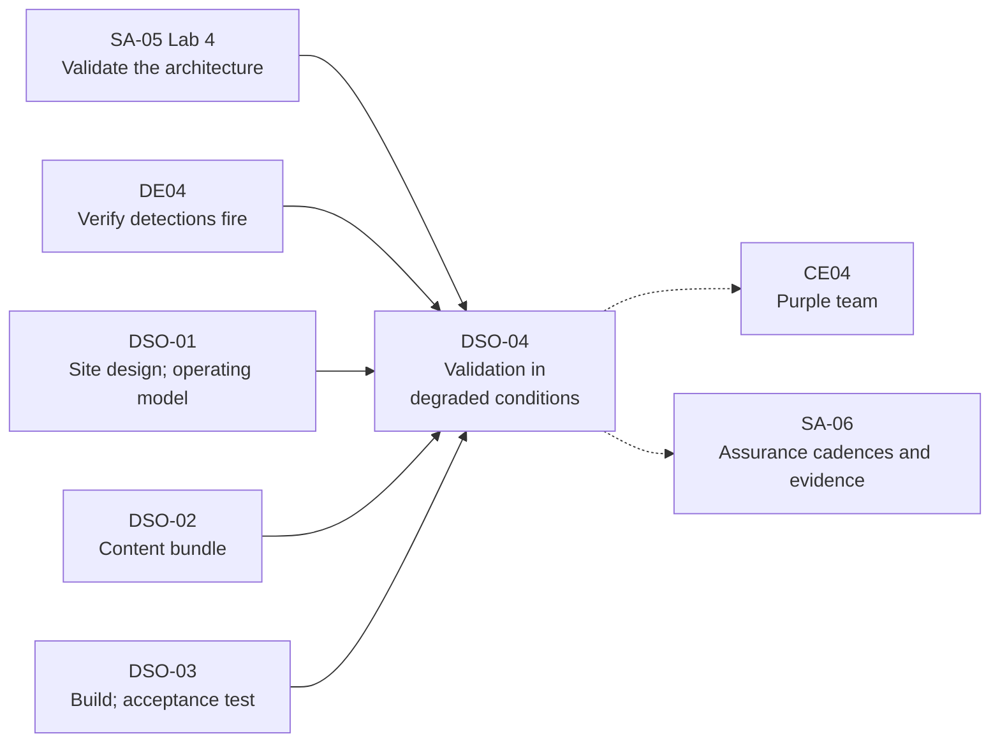

# DSO-04: Validation in Degraded Conditions

> **Module type:** Extension module (elective deep dive) — part of [EXT-DSO](index.md)
> **Status:** Draft
> **Version:** v0.1
> **Last Reviewed:** 2026-09-13
> **Domain Expert:** _Unassigned — required before Practitioner Approved_
> **Practitioner Reviewer:** _Unassigned — required before Practitioner Approved (must have run failure drills against a live monitoring pipeline and written the after-action reports)_

!!! warning "Not a credit-bearing unit"
    DSO-04 is one module of the [EXT-DSO series](index.md). It carries **0 CP**, sits outside the 168 CP degree structure, and does not appear in [`docs/ksat-coverage.md`](../../ksat-coverage.md), which is generated from credit-bearing units only. Recognition, if any, is via the Tier 1 badge mechanism in [`docs/curriculum/micro-credentials-framework.md`](../../curriculum/micro-credentials-framework.md).

!!! danger "Failure injection on a live site needs authority"
    Every drill in this module breaks something on purpose. On a real site that is a change with an owner: the site decider for the monitoring stack, the engineering authority for anything in an operational-technology zone (DSO-01 Topic 6), and never during an open case without the decider's explicit approval. The labs run on the lab nodes only.

---

## Overview

[SA-05](../security-architecture/sa-05-logging-and-monitoring-architecture.md) Lab 4 validates a logging path passively and actively and breaks it four ways. [DE04](../../../degrees/operational/detection-engineering/DE04-adversary-simulation-detection.md) verifies that detections fire when a technique runs. [CE04](../../../degrees/operational/cte/CE04-purple-team-operations.md) runs the collaborative exercise that finds detection gaps. All three assume the pipeline underneath is up. For the sites [DSO-01](dso-01-monitoring-isolated-and-intermittent-sites.md) designs, the pipeline being *down, partial, late or wrong* is the normal case for hours or weeks at a time, and the question nobody has yet answered is whether the site still detects and records during those hours, by how much less, and how anyone would know.

DSO-04 is that validation. It defines the site's *steady state* as a small set of measurable outputs and every drill as a falsifiable hypothesis about them, following the chaos-engineering principles; it catalogues the failures an isolated site actually suffers — link loss in its several shapes, collector loss, time drift, release-point and content failures, and people failures — with an injection method and an expected recovery for each; it specifies how to measure detection latency and data loss when there is no central truth to compare against; it designs the drills as tests, tabletop and functional exercises in the form NIST SP 800-84 gives them, with a master scenario events list and an after-action report; it makes the drills prove the degraded-mode *decisions* of the operating model, not just the plumbing; and it automates the subset that can run continuously on site and be released with the findings. What the drills cannot prove — adversary behaviour, detection logic — stays with CE04 and DE04, and the module says so.

---

## Where this module fits

| Existing unit or module | Relationship |
|---|---|
| [SA-05](../security-architecture/sa-05-logging-and-monitoring-architecture.md) Lab 4; Topic 11 | Hard prerequisite. Passive and active validation and the four pipeline failures are taken as read; DSO-04 extends the failure set to an isolated site and adds measurement under failure. |
| [DE04](../../../degrees/operational/detection-engineering/DE04-adversary-simulation-detection.md) Topics 3–4 | Hard prerequisite. Verifying that a detection fires and the simulate–collect–detect–verify pipeline. DSO-04 assumes the detection logic is right and asks whether the pipeline delivers it when degraded. |
| [CE04](../../../degrees/operational/cte/CE04-purple-team-operations.md) | Assumed. Purple teaming finds detection gaps; DSO-04 finds pipeline and decision gaps. The two are scheduled together, not confused. |
| [DSO-01](dso-01-monitoring-isolated-and-intermittent-sites.md) Topics 2, 7, 8; [DSO-02](dso-02-autonomous-detection-content-offline-lifecycle.md) Topic 6; [DSO-03](dso-03-rapid-deployment-teardown-and-sanitisation.md) Topic 3 | Hard prerequisites. The stack, the operating model, the trust anchors, the content bundle and the acceptance test are what DSO-04 degrades and measures. |
| [EXT-ANS](../ansible-security-automation.md) Topic 8; Lab 7 | Assumed. Canary events and breaking forwarding three ways are not repeated. |
| [SA-06](../security-architecture/sa-06-assurance-maturity-and-authorisation.md) Topics 4, 9 | Forward. Drill cadence and evidence join the continuous-assurance cadences and the evidence pack. |

---

## Prerequisites

- **SA-05** (including Lab 4), **DE04**, **DSO-01**, **DSO-02** and **DSO-03** (hard). DSO-04 is the last module of the series and assumes all of it.
- **EXT-ANS** Lab 7 (recommended).
- Comfortable with shell scripting, a plotting or tabulation tool for distributions, and the lab nodes from the earlier DSO labs.

---

## Learning outcomes

On completion, a learner can:

1. **Define** an isolated site's monitoring steady state as a small set of measurable outputs, and express each validation as a falsifiable hypothesis about them.
2. **Analyse** the failures an isolated site suffers — link, collector, time, release point, content, power and people — into a catalogue with injection method, measurable effect and expected recovery for each.
3. **Design** the measurement of detection latency, time to notice, data loss, reordering and time to recover under failure, using local ground truth where no central truth exists, and reported as distributions.
4. **Create** a drill programme of tests, tabletop and functional exercises in the NIST SP 800-84 form, with a master scenario events list, injects, an after-action report and a cadence tied to the site lifecycle.
5. **Evaluate** whether the drills prove the operating model's degraded-mode decisions — pre-authorised actions, drop policy, synchronisation order, rollback, handover on reconnection — and revise the decisions and residual-risk entries from the results.
6. **Justify** which validations run continuously on site, with what blast-radius limits and authority, and which findings the assurance pack can and cannot draw from them.

> Bloom's 3–6 (Apply / Analyse / Evaluate / Create), consistent with [`docs/content-standards.md`](../../content-standards.md).

---

## AQF Level 7 Alignment

**Knowledge (AQF 7.1):** specialised knowledge of steady-state measurement, failure injection, latency and loss metrics, and the test–training–exercise programme model. **Skills (AQF 7.2):** cognitive skills to turn a design claim into a hypothesis and a drill into evidence; communication skills to write an after-action report that changes a decision. **Application (AQF 7.3):** applies these with judgement and authority to a live site, taking responsibility for the blast radius of a deliberate failure and for what the drills did not test.

> This alignment statement is notional. DSO-04 is not credit-bearing and has not been through the AQF mapping process in [`docs/compliance/aqf-teqsa.md`](../../compliance/aqf-teqsa.md).

---

## Framework mappings

> **Provisional pending Framework Custodian review.** These do **not** feed [ksat-coverage](../../ksat-coverage.md).

### NIST NICE DCWF

| Version | Work Role | Code | T-Code | Task | Demonstrated in |
|---|---|---|---|---|---|
| 2023 | Security Control Assessor | SP-RSK-002 | T0177 | Assess controls against frameworks and identify gaps | Lab 2, Summative |
| 2023 | Cyber Defense Infrastructure Support | PR-INF-001 | T0335 | Build and maintain monitoring infrastructure | Lab 1, Lab 2 |
| 2023 | Cyber Defense Analyst | PR-CDA-001 | T0258 | Provide timely detection, identification and alerting of possible attacks | Lab 2, Lab 3 |
| 2023 | Systems Security Manager | OV-MGT-001 | T0264 | Oversee security operations under degraded conditions and escalate accordingly | Lab 3, Summative |

### SFIA 9

| Skill | Code | Level | Demonstrated in |
|---|---|---|---|
| Information assurance | INAS | Level 5 | Topic 7, Summative |
| Infrastructure design | IFDN | Level 4 | Lab 1, Lab 2 |
| Methods and tools | METL | Level 4 | Topic 5, Lab 3 |
| Information security | SCTY | Level 4 | Topic 6, Lab 3 |
| Specialist advice | TECH | Level 4 | Summative (assurance entry) |

### ASD Cyber Skills Framework

| Domain | Sub-domain | Proficiency | Demonstrated in |
|---|---|---|---|
| Defensive Operations | Monitoring Infrastructure | Advanced | Lab 1, Lab 2 |
| Security Architecture | Monitoring and logging architecture | Practitioner–Advanced | Topic 2, Summative |
| Governance, Risk and Compliance | Security Governance | Practitioner | Topic 7, Lab 3 |

### Project-local KSATs

| Type | ID | Statement | Demonstrated in |
|---|---|---|---|
| Knowledge | DSO-04-K01 | Knowledge of steady state as measurable output and of the hypothesis form of a validation | Topic 2; Lab 1 |
| Knowledge | DSO-04-K02 | Knowledge of the failure catalogue for an isolated site and the injection method for each entry | Topic 3; Lab 2 |
| Knowledge | DSO-04-K03 | Knowledge of detection latency, time to notice, data loss, reordering and time to recover, and of local ground truth as the basis for measuring them | Topic 4; Lab 2 |
| Knowledge | DSO-04-K04 | Knowledge of tests, tabletop and functional exercises, the master scenario events list, injects and the after-action report as SP 800-84 defines them | Topic 5; Lab 3 |
| Knowledge | DSO-04-K05 | Knowledge of the degraded-mode decisions a drill must prove and the guard rails on continuous validation | Topics 6, 8 |
| Skill | DSO-04-S01 | Skill in instrumenting a site for steady-state measurement and producing a baseline report of distributions | Lab 1 |
| Skill | DSO-04-S02 | Skill in injecting catalogued failures one at a time, measuring the five metrics and writing the after-action report | Lab 2 |
| Skill | DSO-04-S03 | Skill in running a tabletop and a functional exercise against the operating model and revising its decisions | Lab 3 |
| Ability | DSO-04-A01 | Ability to decide, with authority and blast-radius limits, which validations run on a live site and when | Topic 8; Summative |
| Ability | DSO-04-A02 | Ability to state what a drill programme proved, what it did not test, and how the residual-risk entries change | Topic 7; Summative |

---

## Module structure

| Part | Topics | Labs | Notional hours |
|---|---|---|---|
| A — Scope, steady state, hypotheses | 1–2 | 1 | 4 |
| B — Failures and measurement | 3–4 | 2 | 6 |
| C — Drills and decisions | 5–6 | 3 | 5 |
| D — Evidence and continuous validation | 7–8 | — | 1 |
| E — Assessment | — | Formatives, Summative | 2 |
| | | | **18 hours** |

---

## Topics

### Topic 1: What Validation Means for an Isolated Site

Three kinds of validation already exist in the degree, and DSO-04 is a fourth that must not be confused with them.

| Validation | Asks | Home | DSO-04's relationship |
|---|---|---|---|
| **Architecture validation** | Does the path generate, forward, retain and protect what the policy mandates? | SA-05 Lab 4: passive and active checks; four pipeline failures | Extended: the same method, a longer failure catalogue, and measurement rather than observation |
| **Detection validation** | Does the detection fire when the technique runs, on the right event, with an actionable alert? | DE04 Topics 3–4 | Assumed: DSO-04 uses a known-good detection as its probe and never judges the logic |
| **Adversarial validation** | Where are the gaps an adversary would use? | CE04 | Separate: scheduled alongside, never merged, because a purple-team finding and a pipeline finding have different owners |
| **Degraded-condition validation** | While the site is cut off, partial, late or wrong, how much does it still detect and record, how long until it notices, and do the people do what the plan says? | **DSO-04** | — |

NIST SP 800-84 gives the programme its shape. A test, training and exercise programme for a single organisation validates plans and capabilities through *tests* — "evaluation tools that use quantifiable metrics to validate the operability of an IT system or system component in an operational environment", conducted "in as close to an operational environment as possible", with removing power from a component given as an example — *training*, and *exercises* of two widely used types: *tabletop*, discussion-based, in which a facilitator presents a scenario and participants discuss roles, responsibilities, coordination and decisions without deploying equipment; and *functional*, in which personnel "validate their operational readiness for emergencies by performing their duties in a simulated operational environment", exercising the roles, procedures and assets of one or more aspects of a plan. Events are conducted periodically and after organisational change, plan updates or new guidance, and each produces an after-action report. DSO-04 maps its work onto those types in Topic 5.

**Scope statement, fixed here.** DSO-04 validates the *site's monitoring pipeline and the operating model's decisions under failure*. It does not validate detection logic, adversary coverage, the cross domain solution (which has its own testing regime under the ISM, SA-04 Topic 6), or the engineering safety case of an OT zone. A drill plan that claims more than that is marked down in the summative.

### Topic 2: Steady State and the Hypothesis Form

The chaos-engineering principles define the discipline as "experimenting on a system in order to build confidence in the system's capability to withstand turbulent conditions in production" and give the method: define steady state as measurable output; hypothesise that it continues in both a control and an experimental group; introduce variables reflecting real-world events; try to disprove the hypothesis by finding a difference. The advanced principles add: build the hypothesis around measurable output rather than internal attributes; vary real-world events prioritised by impact or frequency; prefer to run in production; automate and run continuously; minimise blast radius.

Two of those need translation for an isolated site. There is usually one node, so there is no control group in the statistical sense; the control is the *baseline distribution* measured in Lab 1 and the experimental group is the same node under injection. And "production" is the only environment the site has, so experiments run at the stand-up acceptance test (DSO-03 Topic 3), in scheduled windows the site decider owns, and continuously only for the small automated subset of Topic 8.

**The site's steady state**, this module's proposed set, each a measurable output rather than an internal state:

| Output | Definition | Baseline form |
|---|---|---|
| **Source throughput** | Events per source class per interval, at the local store | Distribution per source per hour of day and day of week; heavy-tailed and seasonal, so never a single mean (the repository's lab dataset is built to make that lesson unavoidable) |
| **Ingest latency** | Generation timestamp to local-store timestamp | Distribution; percentiles, not mean |
| **Detection latency** | Generation timestamp of the triggering event to alert timestamp, for a known-good probe detection | Distribution |
| **Release-point latency** | Finding timestamp to confirmed receipt at the centre | Distribution per release-point pattern; for a courier this is measured in days and is still a distribution |
| **Queue depth and disk headroom** | At the relay and the local store | Time series with the configured bound marked |
| **Silent-source count** | Sources past their silence threshold (SA-05 Lab 4) | Zero, with the time-to-notice distribution from Lab 2 |
| **Clock offset** | Site holdover against the centre, measured at each reconnection (DSO-01 Topic 8) | Drift rate; the drift budget marked |
| **Content and indicator age** | Active bundle version against the centre's; indicator set age (DSO-02) | Days behind; the stale date marked |

**The hypothesis form.** Every validation in this module is written as: *under failure F, output O stays within bound B for duration D, and the pipeline-health telemetry reports F within time T.* The drill tries to disprove it. A hypothesis without a bound is not a hypothesis, and "the site keeps working" is not a bound.

### Topic 3: The Failure Catalogue

SA-05 Lab 4 breaks the path four ways (queue full, clock skew, certificate expiry, rotation failure) and EXT-ANS Lab 7 breaks forwarding three ways. An isolated site adds the failures below. Each entry names the injection, the outputs it should move, and the recovery the design claims; the summative marks whether the candidate can add a site-specific row.

| Failure | Shapes | Injection (lab) | Outputs expected to move | Design claim to disprove |
|---|---|---|---|---|
| **Link loss** | Clean loss; flapping (up and down every few minutes); partial (one direction, or one port); degraded (high loss, low bandwidth) | Block the relay's egress; toggle it on a timer; drop one direction; shape bandwidth | Release-point latency; queue depth; nothing else | Local throughput, ingest and detection latency unchanged; queue bounded; synchronisation order honoured on return (SA-05 Topic 6) |
| **Collector loss** | Process crash; disk full at the collector; configuration reverted by a rebuild or package upgrade (EXT-ANS Topic 8's drift) | Kill the daemon; fill its disk; restore an old configuration file | Source throughput to zero for affected sources; silent-source count | Silence noticed within T; sources buffer locally (SA-05 Topic 5); no loss within the source's buffer |
| **Time drift** | Holdover failure (free-running clock); step change; source clocks disagreeing | Stop the time daemon; step the clock; step one source's clock only | Clock offset; detection latency for windowed correlations (DSO-02 Topic 3); apparent reordering | Drift stays within budget for the stated isolation; windowed correlations are disabled or flagged past budget |
| **Release-point failure** | Media rejected at import; cross domain solution filter change; courier missed; relay certificate expired | Corrupt a bundle's signature; tighten the modelled filter; skip a scheduled release; expire the certificate | Release-point latency; content age | Rejection is logged and visible both ends; findings are retained locally until a later release succeeds; nothing is dropped to make the bundle fit without a record |
| **Content failure** | Bundle blocked by a failed test; rule silently unsupported at site; parser change drops a field | Ship a bundle with a failing test; ship a rule the site backend cannot run; ship a parser that drops a field the probe detection needs | Content age; detection latency (to infinity for the probe) | Previous bundle stays active (DSO-02 Topic 6); unsupported rules are in the manifest; the probe detection's failure is noticed by the continuous test (Topic 8) |
| **Power loss** | Clean shutdown; hard loss | Stop the node; kill it | Everything, for the outage; volatile buffers lost | Local store consistent on restart; digests intact; loss bounded by the last flush; volatile media consequences per DSO-03 |
| **People failure** | Watcher absent; decider unreachable; custodian unavailable for a courier | Scripted into the tabletop and functional exercises (Topic 5), not injected technically | Time to decision; whether the pre-authorised action list is followed | The deputy acts; the action list is followed; nothing waits for reconnection that the list says may be done locally |

Prioritise by impact and frequency, as the principles say: for most sites, link loss and collector loss are frequent and low-impact if the design is right; time drift and content failure are rare and high-impact because they corrupt what the site *believes*, not just what it holds.

### Topic 4: Measuring Latency and Loss Without a Centre

A connected estate measures loss by comparing the centre's count with the source's. An isolated site has no centre during the failure, so the measurement must be self-contained. This module's method:

**Local ground truth.** A *probe generator* on the site emits synthetic events at a known rate with a monotonic sequence number, a generation timestamp and a signature, into each source class (or a dedicated probe source when a real source cannot be written to, as in an OT zone). The repository's lab dataset generator, with its truth labels, is the lab's generator; on a real site the probe is a small scheduled script. Because the probe's sequence is known, the local store can compute at any moment:

| Metric | Computed as | Reported as |
|---|---|---|
| **Data loss** | Sequence numbers generated minus sequence numbers present in the local store, over the window | Count and fraction, per source, per window; plus the *loss location* (source buffer, relay queue, store) from the pipeline-health telemetry |
| **Reordering** | Sequence numbers present out of order | Count; maximum displacement |
| **Duplication** | Sequence numbers present more than once | Count |
| **Ingest latency** | Store timestamp minus generation timestamp | Percentiles (50, 95, 99) and maximum |
| **Detection latency** | Alert timestamp minus generation timestamp of the probe event that the known-good detection matches | Percentiles and maximum; *undetected* counted separately, never folded into the mean |
| **Time to notice** | Failure injection time to the first pipeline-health alert naming the failure | Per failure; the SA-05 Lab 4 question "which failure took longest to surface" made quantitative |
| **Time to recover** | Injection end to the moment all outputs are back inside their baseline bounds | Per failure |

**Rules for the numbers.** Report distributions, not means; SA-05 and the Splunk detection-analytics module both show why a mean over heavy-tailed, seasonal data misleads. Report undetected and lost events as counts in their own column. Keep the probe rate low enough not to be the site's main load and high enough that a five-minute failure produces a measurable gap; state the arithmetic. Timestamp everything at generation with the site's own clock, so that clock drift shows up as a *shift* in latency rather than as a mystery; the Lab 2 clock-step injection is designed to show that.

**Digests as the loss detector of last resort.** When the probe is not running, the daily digest chain (SA-05 Topic 7, DSO-01 Topic 8) still proves *integrity* of what was retained, never *completeness* of what was generated. Say which of the two each piece of evidence proves.

### Topic 5: Drills in the SP 800-84 Form

The programme uses the three event types deliberately, because each proves something the others cannot:

| Event type | What it validates at an isolated site | Frequency | Artefacts |
|---|---|---|---|
| **Test** (quantifiable metrics, operational environment) | The Topic 3 failure catalogue against the Topic 2 hypotheses, one failure at a time, measured per Topic 4 | At stand-up acceptance; after any image or configuration change; scheduled per site lifecycle | Test plan with hypotheses; results with distributions; deviations |
| **Tabletop exercise** (discussion-based, no equipment) | The operating model's decisions: does the site decider know the pre-authorised action list, does the deputy step in, what goes in the twenty-word out-of-band message, what happens on reconnection mid-incident (DSO-01 Topic 7) | Before the site stands up; after any change to roles or the action list | Facilitator guide; scenario; participant decisions; after-action report |
| **Functional exercise** (roles performed in a simulated operational environment) | The people and the pipeline together: an injected failure sequence while the site team performs its roles on the real stack, with communications, notifications and the release point exercised | At stand-up where duration allows; at least once per long isolation period; after significant change | Master scenario events list; injects and inject tracking; observer notes; after-action report |

**The master scenario events list** is the functional exercise's spine: a timed sequence of injects (a link loss at hour zero; a probe-detected event at hour one; the decider unreachable at hour two; a courier due at hour six; reconnection at hour nine with the case still open), each with the expected action and the observable evidence that it happened. Lab 3 writes one.

**The after-action report** records, for each inject, what was expected, what happened, the metric values, the deviation, the root cause where known, and the change proposed to design, content, action list or training. It is the document that makes the drill worth running; a drill without one is an outage the site chose. The report's proposed changes flow to the owners: design changes to the DSO-01 package, content changes to the DSO-02 bundle, build changes to the DSO-03 image, action-list changes to the site decider, and residual-risk changes to SA-06.

**Cadence.** SP 800-84 has events run periodically and after organisational change, plan updates or new guidance. This module ties the cadence to the site lifecycle instead of the calendar: a test set and a tabletop before stand-up, a functional exercise at stand-up where the site's duration justifies it, a test set after every image or bundle change, a functional exercise at least once per long isolation, and everything again on any change to roles. SA-06 Topic 4's ISM cadences (six-monthly gateway testing, quarterly transfer-policy sampling) are separate obligations that this programme schedules beside, not instead of.

### Topic 6: The Decisions the Drills Must Prove

A pipeline that survives a failure while its people freeze has not survived. Each degraded-mode decision from the earlier modules is a drill objective here, with the evidence that proves it was made:

| Decision | Made in | Drill objective | Evidence |
|---|---|---|---|
| **Drop policy at the queue bound** | SA-05 Topic 6; DSO-01 Topic 2 | Under prolonged link loss the bound is reached; the documented policy (drop oldest, drop newest, block) is what actually happens; the blind spot is recorded | Queue telemetry; the written policy; a residual-risk entry with the measured loss |
| **Synchronisation order on reconnection** | SA-05 Topic 6 | Alerts and summaries reach the centre before bulk raw; measured by release-point latency per class | Central receipt timestamps by class |
| **Content rollback** | DSO-02 Topic 6 | A blocked bundle leaves the previous one active; the site knows which is active; the centre learns why | Activation log; the next bundle's notes |
| **Pre-authorised actions** | DSO-01 Topic 7 | The decider isolates a host, disables an account or invokes the incident plan within the list, and does not do what the list forbids | Tabletop record; functional-exercise observer notes; local case record |
| **Deputy succession** | DSO-01 Topic 7 | When the decider is unreachable, the deputy decides within the same list, and the decision is logged as the deputy's | Case record; roster |
| **Out-of-band message** | DSO-01 Topic 7 | The twenty-word message is sent, contains site, time, class, action, need, and the centre acts on it | Message log both ends |
| **Handover on reconnection** | DSO-01 Topic 7 | The centre reviews the site's case record before acting; authority returns only when the centre says so; no two teams act on one host | Handover log; the absence of conflicting actions |
| **Drift budget enforcement** | DSO-01 Topic 8; DSO-02 Topic 3 | Past the drift budget, windowed correlations are flagged or disabled and the offset is measured before release | Correlation state; the release bundle's offset record |

A drill that exercises the pipeline and skips this table has validated the easy half.

### Topic 7: Evidence, Limits and the Assurance Pack

What DSO-04 hands to SA-06, and what it does not:

| Evidence | Proves | Does not prove |
|---|---|---|
| Baseline report (Lab 1) | The site's steady state on a stated date | That the baseline is still current after the next change |
| Test results per failure with distributions and deviations (Lab 2) | The pipeline's behaviour under each catalogued failure, bounded | Behaviour under uncatalogued failures, or two failures at once unless tested |
| Tabletop and functional after-action reports (Lab 3) | The people made the decisions the plan requires, on the day | That different people, tired, on day twelve, would |
| Continuous validation records (Topic 8) | The probe detection fired and the release point worked, daily, while isolated | Anything about detections other than the probe |
| Revised residual-risk entries | The organisation accepted the measured loss, latency and blind periods | — |
| The "not tested" section | Candour | — |

The limits column is not modesty; it is what keeps an authorising officer from reading a drill report as a guarantee. Adversary coverage is CE04's evidence; detection quality is DE04's; the cross domain solution's own testing (ISM-1523, ISM-1524, via SA-04 Topic 6) is the operating authority's. DSO-04's report names each and points to it.

### Topic 8: Continuous Validation on Site

The principles say automate and run continuously. On an isolated site the automated subset is small, cheap and released with the findings:

- **Probe detection, daily.** The probe generator emits an event that the known-good detection must match; the alert's presence and its latency are recorded. Absence is a pipeline-health alert to the site watcher, and a finding in the next release bundle. This is EXT-ANS Topic 8's canary applied to detection rather than telemetry.
- **Silent-source check, continuous.** SA-05 Lab 4's specification, running.
- **Digest check, daily.** Yesterday's digest recomputed and compared; a mismatch is an integrity incident.
- **Drift check, daily.** Holdover offset against the last reconnection measurement, with the budget marked.
- **Release-point self-test, per release.** A signed test bundle round-trips through the outward path's own checks before the real bundle is built; a rejection stops the release and alerts the custodian.
- **Content age, daily.** Active bundle version and indicator set age against the manifest's stale date.

**Guard rails.** Continuous tests never inject failures; they only observe. Failure injection is a scheduled test with an owner. No injection during an open case without the site decider's approval; none in an OT zone without the engineering authority (DSO-01 Topic 6); none against the cross domain solution at all. The blast radius of any injection is stated before it runs, with the rollback: how the failure is reversed if the site needs to be whole immediately. A site with one node has a blast radius of the whole site, and the schedule says so.

**What is released.** The continuous records travel with the findings, so the centre sees, for every day of isolation, whether the site could still detect, whether its store was intact, how far its clock had drifted and how stale its content was. That is the difference between a site that was blind and a site that can prove it was not.

---

## Labs & exercises

> Labs use only free tooling: the DSO-01 to DSO-03 lab nodes, the repository's lab dataset generator, shell and a scripting language, and any free tabulation or plotting tool. No failure is injected outside the lab nodes.

### Lab 1: Define Steady State and Build the Measurement Harness

**Objective:** Instrument the site node from DSO-03 Lab 1 for the eight steady-state outputs of Topic 2, run a probe generator with sequence numbers, and produce a baseline report of distributions.

**Prerequisites:** DSO-03 Lab 1 (a stood-up site); DSO-02 Lab 2 (an active bundle with a known-good detection); Topics 2, 4

**Environment:**

- The DSO-03 Lab 1 site node and the DSO-01 `central` node
- The lab dataset generator (`python3 labs/generator/generate.py`) as the background load; a small probe script the learner writes (sequence number, generation timestamp, signature) emitting into two source classes
- A tabulation or plotting tool; minimum hardware as DSO-03 Lab 1

**Instructions:**

1. Write the probe generator: one event per minute per source class, with a monotonic sequence number, a generation timestamp from the site clock and a signature. Choose the rate and justify it against the site's real load.
2. Instrument the local store to compute, per window, the Topic 4 metrics from the probe: loss, reordering, duplication, ingest latency percentiles.
3. Instrument detection latency: the known-good rule from DSO-02 Lab 2 must match a probe event once per hour; record alert minus generation.
4. Record queue depth, disk headroom, silent-source count, clock offset (against `central`, via a manual measurement, since the link is modelled as absent) and content age hourly.
5. Run for at least four hours with the lab dataset as load (compress the fourteen-day dataset's timestamps if needed, and say so). Produce the baseline report: distributions, not means, for every output; the bounds you propose for each hypothesis.
6. Write three hypotheses in the Topic 2 form for three failures you will inject in Lab 2.

**Expected output:** The probe script; the metric computations; the baseline report with distributions and proposed bounds; three written hypotheses.

**Reflection questions:**

1. Which output's distribution surprised you, and what in the lab dataset's deliberate statistics caused it?
2. Your probe rate: what is the smallest failure duration it can detect, and is that good enough for the site's real risk?
3. Detection latency has an "undetected" column. What would make you move an event from "late" to "undetected"?

### Lab 2: The Failure Catalogue Drill

**Objective:** Inject six catalogued failures one at a time, measure time to notice, data loss, reordering, detection latency and time to recover against Lab 1's hypotheses, and write the after-action report.

**Prerequisites:** Lab 1; Topics 3–5

**Environment:** As Lab 1, with the ability to block the relay's egress, kill and restart daemons, fill a disk, step the clock, and deliver a content bundle through the DSO-01 Lab 2 import path.

**Instructions:**

For each failure below: state the hypothesis and bound; record the injection time; inject; observe until recovery; record the five metrics; end the injection; record time to recover; compare with the hypothesis.

1. **Clean link loss** for thirty minutes at the relay.
2. **Flapping link**: up and down every three minutes for thirty minutes.
3. **Collector crash** for ten minutes on one source class, then a **configuration revert** to an old collector configuration for ten minutes.
4. **Disk queue full** at the relay (reuse SA-05 Lab 4's method), observed until the documented drop policy acts; record which events were dropped by sequence number.
5. **Clock step** of ten minutes forward on the site node; then a step on one source only. Record how detection latency and reordering *appear* to change, and explain the appearance.
6. **Content failure**: deliver a bundle whose activation test fails, then one containing a parser change that drops the field the known-good detection needs. Confirm the first leaves the previous bundle active and the second is caught by the daily probe detection, and record how long that took.
7. Write the after-action report: per failure, expected, observed, metrics, deviation, root cause, proposed change and its owner (design, content, build, action list, residual risk).

**Expected output:** Six hypothesis statements with bounds; six measurement records with distributions and the dropped-sequence list for failure 4; the after-action report.

**Reflection questions:**

1. Which failure took longest to notice, and would the silent-source check alone have caught it?
2. Failure 5 moved detection latency without touching the pipeline. Which residual-risk entry from DSO-01 Topic 8 does that measurement quantify?
3. Two of these failures together — which pair would you test next, and why that pair?

### Lab 3: Tabletop and Functional Exercise for the Operating Model

**Objective:** Write a master scenario events list, run it first as a tabletop with the three site roles, then as a functional exercise on the lab nodes with injected failures, and revise the pre-authorised action list and residual-risk entries from the after-action report.

**Prerequisites:** Lab 2; DSO-01 Topic 7; Topics 5–6

**Environment:** Three participants for the roles (site watcher, site decider, release-point custodian), a facilitator or observer, the lab nodes, and a timer. Solo learners run the tabletop as a written decision log and the functional exercise against the nodes, playing each role in turn and saying so in the report.

**Instructions:**

1. Write the master scenario events list: hour 0 link loss; hour 1 a probe-detected event that the action list classifies as "isolate host"; hour 2 the decider becomes unreachable; hour 4 a second alert the list classifies as "wait for reconnection"; hour 6 the courier is due and the outward bundle must be produced; hour 9 reconnection with the hour-1 case still open. For each inject, write the expected action and the observable evidence.
2. Run the tabletop: the facilitator presents each inject; participants state what they would do, citing the action list; the observer records decisions and hesitations. Note every place the action list did not answer the question.
3. Run the functional exercise on the nodes with the Lab 2 injections timed to the list: participants perform their roles on the real stack; the custodian builds the hour-6 bundle under the DSO-03 media procedure; at hour 9 restore the link and perform the DSO-01 handover, with `central` reviewing the case record before acting.
4. Measure: time to decision per inject; whether every action was within the list; whether the deputy's decision was logged as the deputy's; the out-of-band message contents; whether the handover prevented conflicting action on the hour-1 host.
5. Write the after-action report, and from it revise the pre-authorised action list, the roster, and the residual-risk entries, stating for each change which inject caused it.

**Expected output:** The master scenario events list with expected actions and evidence; the tabletop decision log with gaps; the functional exercise observer notes and measurements; the after-action report; the revised action list and residual-risk entries with traceability to injects.

**Reflection questions:**

1. Where did the tabletop and the functional exercise disagree about what the team would do, and which one do you believe?
2. The hour-9 handover: what would have happened without the "review the case record first" rule?
3. If the site were an OT zone, which of your injects could not be run, and what replaces them?

---

## Assessment

### Formative 1: Which Metric, Which Failure?

Twelve short observations from a fictional site's telemetry — a step in ingest latency with no change in loss; a silent-source alert for one class while others continue; queue depth flat at the bound; detection latency to infinity for the probe only; release-point latency doubling with no other change; and so on. For each, name the most likely catalogue entry, the metric that discriminates it from its nearest neighbour, and the drill that would confirm it. Self-marked against a key that argues both sides for three contested cases. **Assesses LO2, LO3.**

### Formative 2: Critique the Drill Plan

A two-page drill plan for a fictional site with at least six defects: hypotheses without bounds; means reported for latency; an injection scheduled in an OT zone without the engineering authority; an injection during an open case; no after-action report step; and a functional exercise that exercises the pipeline but no decision from Topic 6's table. Identify each defect, cite the topic or source it violates, and correct the plan. **Assesses LO1, LO4, LO5, LO6.**

### Summative: Validation Programme for an Isolated Site

For a described site (the DSO-01 or DSO-03 summative site, or one provided), produce:

1. A **steady-state definition**: the eight outputs with proposed bounds and the arithmetic behind the probe rate.
2. A **failure catalogue** for this site, Topic 3's table plus at least two site-specific rows, each with injection, outputs and design claim.
3. A **measurement plan** (Topic 4) stating ground truth, metrics, reporting form and what digests do and do not prove.
4. A **drill programme** in SP 800-84 form: tests, tabletop and functional exercises with cadence tied to the site lifecycle, a master scenario events list for the functional exercise, and the after-action report template.
5. A **decision coverage matrix**: Topic 6's table completed for this site, showing which drill proves each decision.
6. A **continuous validation specification** with guard rails, blast radius and authority.
7. An **assurance-pack entry** with the evidence, its limits, the revised residual-risk entries and the "not tested" section.

**Assesses LO1–LO6.**

**Rubric:**

| Criterion | Exemplary | Proficient | Developing | Beginning |
|---|---|---|---|---|
| **Steady state and hypotheses** | Eight outputs with bounds and probe arithmetic; every validation in hypothesis form | Outputs and bounds present; hypotheses mostly formed | Outputs listed without bounds | "It works" |
| **Failure catalogue** | Full table plus site-specific rows; injection and design claim per row; prioritised by impact and frequency | Table complete; site rows thin | Generic failures only | Absent |
| **Measurement** | Local ground truth; distributions; undetected and lost counted separately; digests' limits stated | Method sound; one reporting lapse | Means; no ground truth | No measurement |
| **Drill programme** | Three event types used for what each proves; lifecycle cadence; scenario list and report template usable | Programme present; cadence calendar-bound | Tests only, or tabletop only | No programme |
| **Decision coverage** | Every Topic 6 decision proved by a named drill with evidence | Most decisions covered | Pipeline validated; decisions assumed | Absent |
| **Continuous validation and guard rails** | Observe-only set specified; injection authority, blast radius and rollback stated; OT and CDS exclusions explicit | Present; one guard rail missing | Continuous injection proposed | Absent |
| **Candour** | Limits and "not tested" plain; residual risk revised from results | Stated with imprecision | Implied | No limits |

**Assessment-to-LO mapping:**

| Assessment task | Learning outcomes addressed |
|---|---|
| Formative 1: Which Metric, Which Failure? | LO2, LO3 |
| Formative 2: Critique the Drill Plan | LO1, LO4, LO5, LO6 |
| Summative items 1 and 3: steady state and measurement | LO1, LO3 |
| Summative item 2: failure catalogue | LO2 |
| Summative items 4 and 5: drill programme and decision coverage | LO4, LO5 |
| Summative items 6 and 7: continuous validation and assurance entry | LO6 |

---

## Australian context

**Where this sits in the ISM's cadences.** The ISM requires a continuous monitoring plan covering security assessment activities, analysis of identified vulnerabilities and risk-based mitigation (ISM-1163), and a cyber security incident response plan that names the expected response to likely incident types and the steps that preserve evidence (ISM-0043). This module's drill programme is one input to the first and the exercise of the second at site scale; the reading is this module's, and the ISM does not describe failure drills for monitoring pipelines. The cadences the ISM fixes elsewhere — six-monthly gateway configuration testing and quarterly sampled review of cross domain solution transfer-policy events (SA-04 Topic 6; SA-06 Topic 4) — are obligations of the gateway and CDS operating authorities that this programme is scheduled beside and never substitutes for.

**Exercising incident response.** ASD publishes guidance on preparing for and exercising cyber security incident response; cyber.gov.au did not respond on the authoring date, so no title or URL is cited and the item is flagged. When confirmed, that guidance is the Australian companion to SP 800-84 for the tabletop and functional exercises here.

**Critical infrastructure.** For an OT site of a responsible entity under the *Security of Critical Infrastructure Act 2018* (Cth), the exclusion of injection from control zones without the engineering authority is a safety position first and a regulatory one second; the connection is inference and [GR04](../../../degrees/strategic/grc/GR04-australian-regulatory-environment.md) is the regulatory home.

**Reporting.** An isolated site's delay in reporting to ASD (cyber.gov.au, 1300 CYBER1) is a residual-risk entry from DSO-01; the out-of-band message drill in Lab 3 is how the organisation tests whether that delay is as short as the design claims.

---

## Verification status

| Item | Status | Action required |
|---|---|---|
| NIST SP 800-84 (September 2006): definitions of tests, tabletop and functional exercises; programme elements (policy, roles, methodology, after-action reports); periodic conduct and triggers | Read from the publication PDF, 2026-09-13 | Confirm the publication is still current (it is old); check for a successor |
| Chaos-engineering principles (principlesofchaos.org, last updated March 2019): definition, method, advanced principles | Read, 2026-09-13 | — |
| SA-05 Lab 4's four failures; EXT-ANS Lab 7's three; DE04 Topics 3–4; CE04 scope | In-repository | — |
| ISM-1163 and ISM-0043 | Transcribed from the September 2026 ISM | Re-verify against the live ISM |
| ASD incident-response exercise guidance | **Not read**; cyber.gov.au did not respond | Obtain title and URL; add to Further reading |
| Topic 2 steady-state set, Topic 3 catalogue, Topic 4 method, Topic 6 decision table, Topic 8 guard rails | **This module's design reasoning** | Practitioner Reviewer |
| Heavy-tailed and seasonal statistics of the lab dataset | Verified against `labs/docs/data-model.md` | — |
| NICE T-codes, SFIA levels, ASD CSF sub-domains, KSAT IDs | Provisional | Framework Custodian |
| *Security of Critical Infrastructure Act 2018* (Cth) | **Inference** | Confirm before teaching |

---

## Further reading

- [NIST — SP 800-84, Guide to Test, Training, and Exercise Programs for IT Plans and Capabilities](https://csrc.nist.gov/pubs/sp/800/84/final) — tests, tabletop and functional exercises, programme elements, sample documentation.
    > Relevance: the form of Topic 5's drill programme and Lab 3's scenario list and report.
- [Principles of Chaos Engineering](https://principlesofchaos.org/) — steady state, hypotheses, real-world events, automation, blast radius.
    > Relevance: Topic 2's method and Topic 8's guard rails.
- [ASD — Information Security Manual](https://www.cyber.gov.au/resources-business-and-government/essential-cyber-security/ism) — continuous monitoring plan and incident response plan controls (**Australian source**).
    > Relevance: where this programme's evidence lands in Australian assurance.
- [ASD — Best practices for event logging and threat detection](https://www.cyber.gov.au/resources-business-and-government/maintaining-devices-and-systems/system-hardening-and-administration/system-monitoring/best-practices-event-logging-threat-detection) — the logging expectations the steady state measures against (**Australian source**).
    > Relevance: Topic 2's outputs are the measurable form of its expectations.
- [NIST — SP 800-92, Guide to Computer Security Log Management](https://csrc.nist.gov/pubs/sp/800/92/final) — the operational processes SA-05 Lab 4 validates.
    > Relevance: the passive and active validation this module extends.
- [SA-05 — Logging, Monitoring and Detection Architecture](../security-architecture/sa-05-logging-and-monitoring-architecture.md) — Lab 4 and Topic 11.
    > Relevance: the validation method and the first four failures.
- [DE04 — Adversary Simulation & Detection Validation](../../../degrees/operational/detection-engineering/DE04-adversary-simulation-detection.md) — verifying detections fire; the testing pipeline.
    > Relevance: the known-good detection this module uses as its probe.
- [DSO-01 — Monitoring Architecture for Isolated and Intermittently Connected Sites](dso-01-monitoring-isolated-and-intermittent-sites.md) — the operating model and trust anchors whose decisions Topic 6 proves.
    > Relevance: every row of the decision table originates there.

---

## Module metadata

| Field | Value |
|---|---|
| Module Code | DSO-04 |
| Module Title | Validation in Degraded Conditions |
| Module Type | Extension module (elective; **not** credit-bearing) |
| Version | v0.1 |
| Status | Draft |
| Credit Points | 0 CP — outside the 168 CP degree structure |
| Notional Hours | 18 |
| Extends | SA-05 (Lab 4; Topic 11); DE04 (Topics 3–4); DSO-01 (Topics 2, 7, 8); DSO-02 (Topic 6); DSO-03 (Topic 3) |
| Related Units | CE04, SA-04, SA-06, EXT-ANS, GR04 |
| Prerequisites | SA-05, DE04, DSO-01, DSO-02, DSO-03 (EXT-ANS Lab 7 recommended) |
| Domain Expert | _Unassigned — required before Practitioner Approved_ |
| Practitioner Reviewer | _Unassigned — required before Practitioner Approved_ |
| Last Reviewed | 2026-09-13 |
| Framework Version — NICE DCWF | 2023 |
| Framework Version — SFIA | SFIA 9 (2023) — verified code set |
| Framework Version — ASD CSF | 2024 |
| Framework Version — NIST SP 800-84 | September 2006 |
| Bloom's Level (range) | 3–6 (Apply, Analyse, Evaluate, Create) |
| Australian Legislation Referenced | Security of Critical Infrastructure Act 2018 (Cth) (inference, flagged) |
| Tooling Licence Position | All lab tooling free/open-source (the earlier DSO lab nodes, the repository's lab dataset generator, shell and scripts, any free tabulation or plotting tool); no commercial product is used or named (R3) |
| Licence | CC BY 4.0 |
