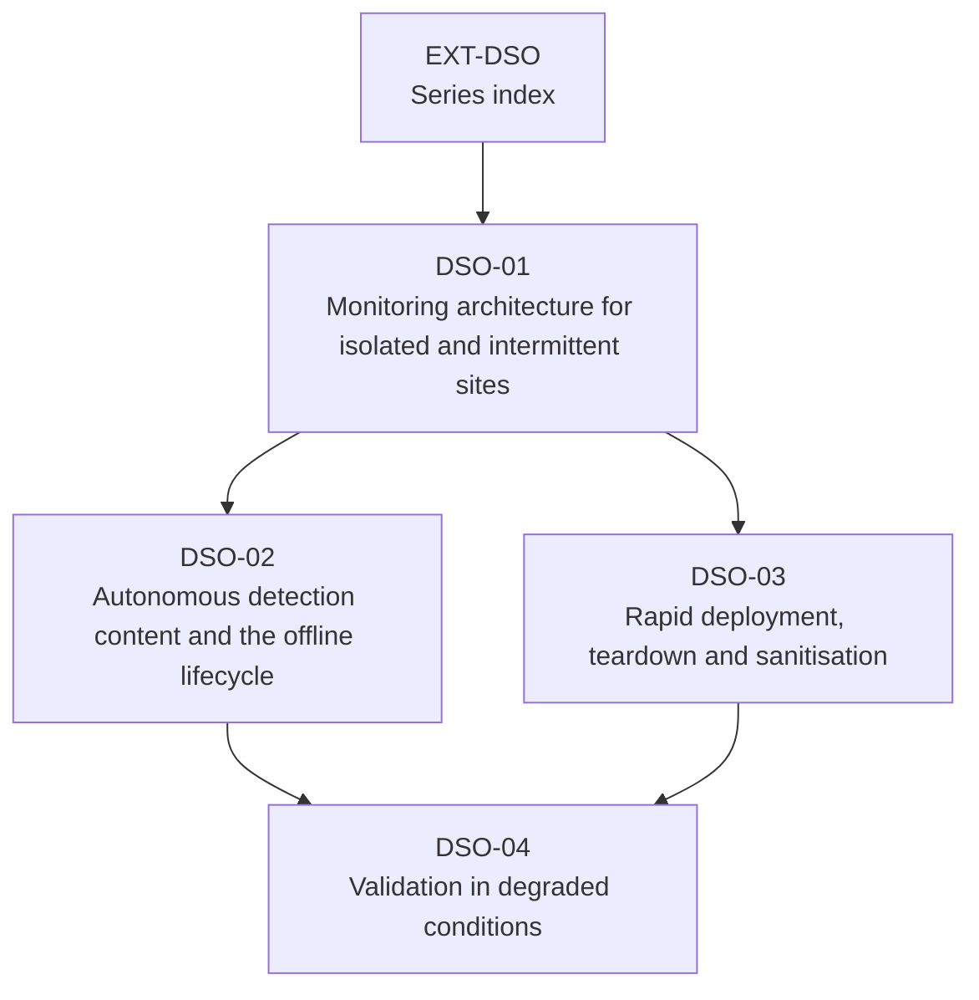

# EXT-DSO: Security Operations in Constrained and Disconnected Environments

> **Module type:** Extension module series (method-and-practice elective)
> **Status:** Draft
> **Version:** v0.1
> **Last Reviewed:** 2026-09-13
> **Domain Expert:** _Unassigned — required before Practitioner Approved (security operations in segmented, classified or operational-technology environments)_
> **Practitioner Reviewer:** _Unassigned — required before Practitioner Approved (must have designed or operated monitoring across a cross domain solution or an isolated network)_

!!! warning "This is an extension series, not credit-bearing units"
    The degree is **66 units / 168 CP** and that structure is fixed (see
    [`docs/structure.md`](../../structure.md); structural changes require the process in
    [`CONTRIBUTING.md`](../../../CONTRIBUTING.md)). EXT-DSO sits **outside** that
    structure. It carries no credit points and does not appear in
    [`docs/ksat-coverage.md`](../../ksat-coverage.md) or the
    [Program Builder](../../program-builder/index.md). If a delivery partner wants to award
    recognition for it, use the Tier 1 badge mechanism in
    [`docs/curriculum/micro-credentials-framework.md`](../../curriculum/micro-credentials-framework.md).

!!! danger "Do not teach the Australian regulatory content from this draft"
    The modules restate ISM controls by intent and cite them by identifier from the
    September 2026 guideline chapters. The ISM is updated quarterly and cross domain
    solutions are a domain in which ASD expects to be consulted directly (ISM-0597). A
    Practitioner Reviewer with current Australian Government assurance experience must
    confirm every cited control before delivery.

!!! note "Delivered in stages"
    Added one module per pull request, in order, on top of this index. Modules are linked
    from the table below only once their file is in the repository.

---

## Purpose

The degree's architecture and operations units assume a network that is connected. Most
of the time that is true, and most of the time it is the wrong assumption for exactly the
sites that matter most: the regional office on a satellite link, the operational-technology
plant that must never touch the corporate network, the classified enclave whose only
exit is a cross domain solution, the temporary site stood up for a week and torn down.
[SA-04](../security-architecture/sa-04-network-gateway-and-access-architecture.md) teaches
the structure the ISM expects — segmentation, gateways, cross domain solutions.
[SA-05](../security-architecture/sa-05-logging-and-monitoring-architecture.md) Topic 6
designs logging for a site whose link drops. Neither designs the *whole* monitoring and
response capability for a site that is isolated by policy, nor the content, deployment
and validation practices that keep it working when nobody can reach it.

EXT-DSO does. Four modules, each built on named primary documents:

- **DSO-01 — Monitoring Architecture for Isolated and Intermittently Connected Sites.**
  One end-to-end design, not an assembly: local collection, analysis and retention; the
  release point — relay, transfer CDS, or media — and what crosses it; content coming
  down as well as findings going up; OT sites; the operating model.
- **DSO-02 — Autonomous Detection Content and the Offline Content Lifecycle.** Which
  detections must run locally, how rules, parsers and threat intelligence are versioned,
  signed and delivered without a link, and how drift is measured on return.
- **DSO-03 — Rapid Deployment, Teardown and Sanitisation.** Build-to-image and
  pre-staged configuration; the teardown runbook; media and equipment sanitisation as an
  architectural obligation; the evidence that it happened.
- **DSO-04 — Validation in Degraded Conditions.** Link-loss, collector-loss and time-drift
  drills; measuring detection latency and data loss under failure; feeding results into
  the assurance pack.

---

## What this series is not

| Already taught | Where | EXT-DSO relationship |
|---|---|---|
| Segmentation, gateways, cross domain solutions as ISM structure | [SA-04](../security-architecture/sa-04-network-gateway-and-access-architecture.md) T1, T6 | Assumed. DSO-01 designs the *monitoring* that lives inside that structure. |
| Logging placement, source selection, forwarding, intermittent links, retention, trust-boundary flow | [SA-05](../security-architecture/sa-05-logging-and-monitoring-architecture.md) | Assumed. DSO-01 extends Topic 6 and Topic 9 into a complete site design; DSO-04 extends Lab 4. |
| Detection engineering, detection-as-code, tuning | [DE01](../../../degrees/operational/detection-engineering/DE01-detection-theory-philosophy.md)–[DE05](../../../degrees/operational/detection-engineering/DE05-detection-operations-management.md) | Assumed. DSO-02 covers only what changes when the content cannot be pushed over a network. |
| Automation control planes, telemetry deployment, compliance evidence | [EXT-ANS](../ansible-security-automation.md) | Assumed. DSO-02 and DSO-03 reuse its patterns for offline delivery. |
| Detection validation and purple teaming | [DE04](../../../degrees/operational/detection-engineering/DE04-adversary-simulation-detection.md), [CE04](../../../degrees/operational/cte/CE04-purple-team-operations.md) | Assumed. DSO-04 validates the *pipeline under failure*, not the detections. |
| Assurance evidence and system authorisation | [SA-06](../security-architecture/sa-06-assurance-maturity-and-authorisation.md) | Assumed. Each module names what it adds to the evidence pack. |
| Platform specifics | [EXT-SPL](../splunk/index.md), EXT-ELK (in review) | Assumed. EXT-DSO is platform-neutral; the relay estate from `labs/` is the runnable substrate. |

**Nothing in EXT-DSO may be cited as satisfying a core-unit requirement.**

---

## The series

| Module | Title | Primary sources | Notional hours |
|---|---|---|---|
| [DSO-01](dso-01-monitoring-isolated-and-intermittent-sites.md) | Monitoring Architecture for Isolated and Intermittently Connected Sites | ISM *Guidelines for gateways* (cross domain solutions) and *for networking*; NIST SP 800-92; ASD event-logging and forwarding guidance; NIST SP 800-82r3 and ISA/IEC 62443 for OT | ~22 |
| [DSO-02](dso-02-autonomous-detection-content-offline-lifecycle.md) | Autonomous Detection Content and the Offline Content Lifecycle | DE01/DE05 (repo); Sigma project documentation; EXT-ANS control-plane material | ~18 |
| DSO-03 *(planned — arrives in a later PR)* | Rapid Deployment, Teardown and Sanitisation | NIST SP 800-88 Rev. 2; ISM guidelines for media and ICT equipment (to obtain) | ~18 |
| DSO-04 *(planned — arrives in a later PR)* | Validation in Degraded Conditions | NIST SP 800-92 operational processes; DE04/CE04 (repo); the `labs/` relay estate | ~18 |
| | | | **~76 hours** |

**Suggested order.** DSO-01 first; DSO-02 and DSO-03 in either order; DSO-04 last.

---

## Rule positions

### R3 — no vendor lock-in

Every primary source is free to read (ASD, NIST, the ISA landing page for IEC 62443 —
the standard texts themselves are paid and are not required; the modules use their
publicly described concepts and say so). Every runnable lab uses the free relay estate in
`labs/docker/compose.syslog-relay.yml` and containers; no product is named as the only
option.

### R4 — Australian context

Intrinsic. The series is built on the ISM's gateway, cross domain solution, networking
and assurance expectations, ASD's logging guidance, and the ASD cross domain solution
publications the ISM itself directs readers to.

---

## Safety, authorisation and data handling

Cross domain solutions between classified domains are a matter on which the ISM requires
ASD to be consulted (ISM-0597) and directions complied with. Nothing in this series is a
substitute for that consultation, and no lab touches a real classified network: the labs
model release points with containers and the synthetic dataset. Do not apply a lab design
to a classified system without the authorisation process SA-06 describes.

---

## Verification status

| Item | Status | Action required |
|---|---|---|
| ISM control identifiers cited in DSO-01 (gateways: ISM-0628, 0637, 0631, 1192, 1427, 0626, 0597, 0635, 1522, 1521, 0610, 0670; networking: ISM-1181, 1577, 1532, 0529) | Transcribed from the September 2026 guideline chapters | Re-verify against the live ISM before delivery |
| ASD *Introduction to Cross Domain Solutions* and *Fundamentals of Cross Domain Solutions* | Named by the ISM text as read; **not read** | Obtain and read before DSO-01 Topic 4 is taught in depth |
| NIST SP 800-82 Rev. 3 (September 2023) scope | Verified against the NIST publication page | Read the architecture chapters before DSO-01 Topic 6 is taught in depth |
| ISA/IEC 62443 series structure (parts 1-1, 2-x, 3-2, 3-3, 4-x) | Verified against the ISA landing page | Zones/conduits and security levels are cited as concepts of 3-2/3-3 from author knowledge — verify |
| Purdue reference model | **Author's knowledge** | Verify against SP 800-82r3 |
| NIST SP 800-88: Rev. 1 withdrawn 26 September 2025, superseded by Rev. 2 | Verified against the NIST page | Read Rev. 2 before DSO-03 |
| ISM guidelines for media and ICT equipment | **Not in the source set** | Obtain from cyber.gov.au before DSO-03 |
| PSPF classification and handling references | **Unverified** | Confirm current PSPF release |
| Project-local KSAT IDs, NICE T-codes (paraphrased), SFIA levels, ASD CSF sub-domains | Provisional | Framework Custodian |

---

## Further reading

- [ASD — Information Security Manual](https://www.cyber.gov.au/resources-business-and-government/essential-cyber-security/ism) — the gateway, cross domain solution and networking chapters DSO-01 restates.
- [ASD — Gateway Security Guidance Package](https://www.cyber.gov.au/resources-business-and-government/maintaining-devices-and-systems/gateway-security-guidance-package) — companion to the ISM gateway chapter.
- [ASD — Best practices for event logging and threat detection](https://www.cyber.gov.au/resources-business-and-government/maintaining-devices-and-systems/system-hardening-and-administration/system-monitoring/best-practices-event-logging-threat-detection) — the logging expectations every site design answers to.
- [NIST — SP 800-92, Guide to Computer Security Log Management](https://csrc.nist.gov/pubs/sp/800/92/final) — the tier model and infrastructure considerations.
- [NIST — SP 800-82 Rev. 3, Guide to Operational Technology (OT) Security](https://csrc.nist.gov/pubs/sp/800/82/r3/final) — OT scope and countermeasures for DSO-01 Topic 6.
- [ISA — ISA/IEC 62443 series](https://www.isa.org/standards-and-publications/isa-standards/isa-iec-62443-series-of-standards) — the IACS security standard family.
- [NIST — SP 800-88 Rev. 2, Guidelines for Media Sanitization](https://csrc.nist.gov/pubs/sp/800/88/r2/final) — sanitisation for DSO-03.

---

## Series metadata

| Field | Value |
|---|---|
| Series Code | EXT-DSO |
| Series Title | Security Operations in Constrained and Disconnected Environments |
| Module Type | Extension module series (elective; **not** credit-bearing) |
| Modules | DSO-01 … DSO-04 |
| Version | v0.1 |
| Status | Draft |
| Credit Points | 0 CP — outside the 168 CP degree structure |
| Notional Hours | ~76 |
| Extends | SA-04; SA-05 (Topics 6, 9; Lab 4); EXT-ANS |
| Related Units | F01, OC02, OC04, DE01, DE04, DE05, CE04, SE04, SA-06, EXT-SPL, EXT-ELK |
| Prerequisites | SA-04 and SA-05 (hard); EXT-ANS recommended |
| Domain Expert | _Unassigned — required before Practitioner Approved_ |
| Practitioner Reviewer | _Unassigned — required before Practitioner Approved_ |
| Last Reviewed | 2026-09-13 |
| Framework Version — NICE DCWF | 2023 |
| Framework Version — SFIA | SFIA 9 (2023) — verified code set |
| Framework Version — ASD CSF | 2024 |
| Bloom's Level (range) | 3–6 |
| Australian Legislation Referenced | Security of Critical Infrastructure Act 2018 (Cth) |
| Tooling Licence Position | Free relay estate and containers; no commercial product required |
| Licence | CC BY 4.0 |
