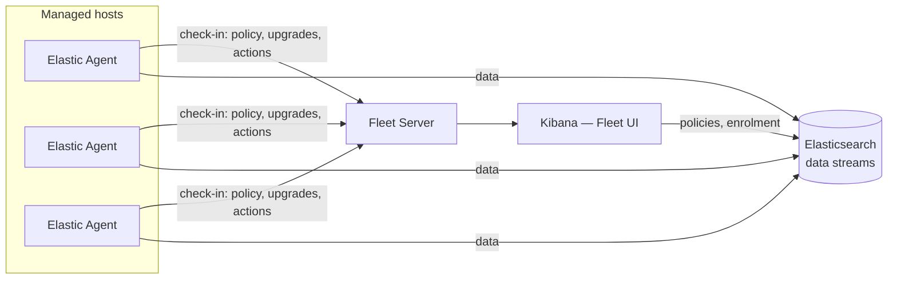

# ELK-01: Collection — Elastic Agent, Fleet and Beats

> **Module type:** Extension module (vendor-specific elective) — part of [EXT-ELK](index.md)
> **Status:** Draft
> **Version:** v0.1
> **Last Reviewed:** 2026-09-13
> **Domain Expert:** _Unassigned — required before Practitioner Approved_
> **Practitioner Reviewer:** _Unassigned — required before Practitioner Approved_

!!! warning "Not a credit-bearing unit"
    See the [series index](index.md). ELK-01 carries no credit points and does not feed
    [`docs/ksat-coverage.md`](../../ksat-coverage.md). Product behaviour is cited to
    Elastic's documentation as read on 2026-09-13 and will drift with releases; the
    [verification table](#verification-status) says what to re-check.

---

## Overview

Every SIEM architecture decision in
[SA-05](../security-architecture/sa-05-logging-and-monitoring-architecture.md) ends in the
same place: an agent, a collector, or a pull job has to exist on or near the source, and
something has to manage thousands of them without a person logging into each. On the
Elastic Stack that something is **Fleet**, and the agent is **Elastic Agent** — "a single,
unified way to add monitoring for logs, metrics, and other types of data to a host", which
also carries endpoint protection and can forward from remote services where an agent
cannot be installed.

This module teaches the collection layer as an engineer has to understand it: what the
agent is and what it replaced (the Beats family), what Fleet's components are and which of
them is on the attack surface, the difference between a Fleet-managed and a standalone
agent and where each belongs, the **data-stream naming contract** every integration
writes to — `type-dataset-namespace` — and why the namespace is a governance lever rather
than a label, and how an *integration* packages templates, pipelines and dashboards into a
unit of onboarding. It closes with the operational side: policy revisions, upgrades and
health, and the parts of that which the free tier does and does not give you.

It does **not** teach log formats and parsing (F06, then ELK-02), detection (ELK-04), or
which sources to collect and for how long — that is SA-05's job, and ELK-01 assumes you
arrive with its register in hand. Primary sources: Elastic's *Fleet and Elastic Agent*
documentation and the subscriptions comparison; the lab dataset from `labs/`.

---

## Where this module fits

| Unit / module | Relationship |
|---|---|
| [OC02 — Security Monitoring & SIEM](../../../core/units/OC02-security-monitoring-siem.md) | **Prerequisite.** The vendor-neutral SIEM pipeline; ELK-01 is the collection stage of it on one platform. |
| [F06 — Data & Log Analysis](../../../core/units/F06-data-log-analysis.md) | **Prerequisite.** Log sources and formats. |
| [SA-05 — Logging, Monitoring and Detection Architecture](../security-architecture/sa-05-logging-and-monitoring-architecture.md) | Supplies the *what* and *where*: source register (Lab 2), forwarding topology (Topic 5), intermittent sites (Topic 6). ELK-01 implements them. |
| [DE02 — Data Sources & Log Engineering](../../../degrees/operational/detection-engineering/DE02-data-sources-log-engineering.md) | Logging configuration and constraints (Topic 5); the generation precondition an agent cannot fix. |
| [EXT-ANS — Ansible for Security Operations](../ansible-security-automation.md) | Topic 1 (the control plane as a security system) and Topic 8 (deploying and verifying telemetry) — the same argument ELK-01 Topic 5 makes about Fleet. |
| [EXT-SPL SPL-06](../splunk/spl-06-enterprise-admin.md) | Forwarders and the deployment server: the Splunk counterpart of agent and Fleet, worked on the same dataset. |
| [ELK-02](elk-02-ingest-pipelines-ecs-data-streams.md) | Successor: what happens to the documents the agent ships. |

---

## Prerequisites

- [OC02 — Security Monitoring & SIEM](../../../core/units/OC02-security-monitoring-siem.md) (hard)
- [F06 — Data & Log Analysis](../../../core/units/F06-data-log-analysis.md) (hard)
- [SA-05](../security-architecture/sa-05-logging-and-monitoring-architecture.md) Labs 1–2 (recommended — the labs here reuse its estate and register)
- Docker and 8 GB RAM for the runnable labs

---

## Learning outcomes

On completion, a learner can:

1. **Explain** the roles of Elastic Agent, Fleet Server, the Fleet UI, agent policies and
   integrations, and **differentiate** Fleet-managed from standalone operation.
2. **Apply** the `type-dataset-namespace` data-stream naming contract to a source register,
   choosing datasets and namespaces that support access control and retention decisions.
3. **Analyse** the Fleet control plane as an attack surface — enrolment, policy delivery and
   remote actions — and **specify** the controls a deployment needs before an agent reaches a
   production host.
4. **Implement** collection of a labelled multi-source dataset into data streams on a
   free-tier Elastic deployment, and **verify** completeness against the source counts.
5. **Evaluate** managed, standalone and collector-mediated options for a site with
   intermittent connectivity, and **justify** the choice against SA-05 Topic 6.
6. **Assess** an agent-policy set for operability — revisions, upgrades, health and the
   free/paid boundary — and **recommend** changes.

> Bloom's 2–5, consistent with an applied vendor module sitting on the operational core;
> see [`docs/content-standards.md`](../../content-standards.md).

---

## AQF Level 7 Alignment

The module applies a body of platform knowledge to a specified estate, requires analysis
of a control plane as a security system, and asks the learner to justify design choices
to a technical audience — the application-of-knowledge and judgement descriptors at
Level 7.

> This alignment statement is notional. ELK-01 is not credit-bearing, so it has not been
> assessed against AQF descriptors through the accreditation process in
> [`docs/compliance/aqf-teqsa.md`](../../compliance/aqf-teqsa.md).

---

## Framework mappings

> **Provisional pending Framework Custodian review.** These do **not** feed
> [`docs/ksat-coverage.md`](../../ksat-coverage.md).

### NIST NICE DCWF

| Version | Work Role | Code | T-Code | Task | Demonstrated in |
|---|---|---|---|---|---|
| 2023 | Cyber Defense Infrastructure Support | PR-INF-001 | T0335 | (paraphrase) Build, install and maintain monitoring infrastructure | Lab 2, Lab 3 |
| 2023 | Cyber Defense Infrastructure Support | PR-INF-001 | T0420 | (paraphrase) Administer test-bed and evaluate collection tooling | Lab 2 |
| 2023 | System Administrator | OM-ADM-001 | T0431 | (paraphrase) Manage configuration and deployment at scale | Lab 1, Lab 3 |
| 2023 | Security Architect | SP-ARC-002 | T0050 | (paraphrase) Define the security architecture of the collection tier | Lab 1, Summative |

### SFIA 9

| Skill | Code | Level | Demonstrated in |
|---|---|---|---|
| Infrastructure design | IFDN | Level 4 | Lab 1, Summative |
| Information security | SCTY | Level 4 | Topic 5, Lab 3 |
| Data management | DATM | Level 4 | Topic 4, Lab 2 |
| Methods and tools | METL | Level 4 | Lab 2 |

### ASD Cyber Skills Framework

| Domain | Sub-domain | Proficiency | Demonstrated in |
|---|---|---|---|
| Defensive Operations | Monitoring Infrastructure | Practitioner–Advanced | Lab 2, Lab 3 |
| Security Architecture | Platform & Infrastructure Design | Practitioner | Lab 1, Summative |

### Project-local KSATs

| Type | ID | Statement | Demonstrated in |
|---|---|---|---|
| Knowledge | ELK-01-K01 | Knowledge of Elastic Agent, Fleet Server, Fleet UI, agent policies and integrations and how they relate | Topic 2; Lab 3 |
| Knowledge | ELK-01-K02 | Knowledge of Fleet-managed versus standalone operation and their trade-offs | Topic 3; Lab 1 |
| Knowledge | ELK-01-K03 | Knowledge of the `type-dataset-namespace` data-stream naming contract | Topic 4; Lab 2 |
| Knowledge | ELK-01-K04 | Knowledge of what an integration package contributes (templates, pipelines, dashboards) and of the custom-logs path | Topic 6; Lab 2 |
| Knowledge | ELK-01-K05 | Knowledge of the free/paid boundary for collection features | Topic 7; Lab 1 |
| Skill | ELK-01-S01 | Skill in onboarding a multi-source dataset into data streams and verifying completeness | Lab 2 |
| Skill | ELK-01-S02 | Skill in designing an agent-policy and namespace set from a source register | Lab 1 |
| Skill | ELK-01-S03 | Skill in threat-modelling a Fleet deployment and specifying its controls | Lab 3 |
| Ability | ELK-01-A01 | Ability to choose managed, standalone or collector-mediated collection for a constrained site and defend it | Topic 3; Lab 1; Summative |
| Ability | ELK-01-A02 | Ability to recognise a collection outage from data-stream evidence rather than agent status alone | Lab 2; Summative |
| Ability | ELK-01-A03 | Ability to state plainly what the free tier does not provide and design around it | Topic 7; Lab 1 |

---

## Module structure

| Part | Topics | Labs | Notional hours |
|---|---|---|---|
| A — The agent and the control plane | 1–2 | — | 3 |
| B — Managed, standalone, and the naming contract | 3–4 | 1 | 5 |
| C — The control plane as a security system | 5 | 3 | 3 |
| D — Integrations and onboarding | 6 | 2 | 5 |
| E — Operating the fleet | 7–8 | 3 | 2 |
| | | | **~18 hours** |

---

## Topics

### Topic 1: One Agent, and What It Replaced

Before Elastic Agent, collection on this stack meant the **Beats**: Filebeat for files,
Metricbeat for metrics, Winlogbeat for Windows event logs, Packetbeat for wire data,
Auditbeat for audit frameworks — each a separate binary with its own configuration and
its own upgrade cycle. Elastic Agent is Elastic's consolidation of that: one binary per
host, one policy, and the ability to add "monitoring for logs, metrics, and other types of
data" from a central place. The Beats still exist and Kibana's integration browser lists
"Beats integrations" alongside agent integrations, which matters in two cases: estates
that never migrated, and the standalone Filebeat path this module's Lab 2 offers as the
lowest-friction way to get files into the stack.

| | Beats (per-purpose binaries) | Elastic Agent |
|---|---|---|
| Binaries per host | One per data type | One |
| Configuration | Local YAML per Beat | An **agent policy** — centrally managed, or a local file in standalone mode |
| Upgrades | Per binary | Per agent, remotely via Fleet |
| Endpoint protection | Not applicable | Elastic Defend integration (paid tier) |
| Where it still wins | Minimal footprint, file-only sources, air-gapped hosts with no control plane | Everything else |

!!! note "Two things the agent cannot do"
    It cannot create an event the source never generated — DE02 Topic 5's *generation
    precondition* is upstream of it — and it cannot make an unreachable host reachable.
    Both are architecture problems (SA-05 Lab 1's non-participating hosts), and the
    honest answer to them is a collector, a pull, or an out-of-band transfer, not a
    different agent.

### Topic 2: Fleet — Server, UI, Policies, Integrations

Fleet is the control plane. Its parts, in Elastic's own terms:

| Component | What it is | Where it runs |
|---|---|---|
| **Fleet Server** | The connection point between agents and Fleet; "a separate process" that scales horizontally | One or more hosts you designate (it is itself an Elastic Agent running the Fleet Server integration); on Elastic Cloud, hosted for you; not available on-premises for Elastic Cloud Serverless |
| **Fleet UI** | The Kibana application where policies are built, agents enrolled and health watched | Kibana |
| **Agent policy** | The specification of which integrations run on which hosts, with their settings | Stored in Elasticsearch; delivered to agents on check-in |
| **Integration** | A packaged connector for a source — inputs, index templates, ingest pipelines, dashboards | Installed into the stack from the package registry, then added to a policy |

The flow that matters operationally: an agent enrols against a Fleet Server, is assigned a
policy, checks in on a schedule, and receives policy revisions, upgrades and actions on
those check-ins. Agents write to Elasticsearch directly (or to another configured output);
Fleet Server carries control, not data. Draw that distinction on every diagram you make of
the platform, because it decides what breaks when Fleet Server is down: collection
continues, management stops.



### Topic 3: Managed or Standalone — Where Each Belongs

Elastic's documentation is direct: **Fleet mode** is the default, with policy updates
pulled on check-in and no manual distribution; **standalone mode** needs a locally
maintained configuration and is "recommended for advanced users only". For an
architecture module the question is not which is better but which the site can support.

| Situation | Fit | Why |
|---|---|---|
| Ordinary connected estate, hundreds to thousands of hosts | Fleet-managed | Policy revisions and upgrades at scale are the whole point; a local file per host does not survive the third change |
| Host that must never accept inbound policy from outside its enclave | Standalone | The agent then has no control channel — the trade is operability for a smaller attack surface (Topic 5) |
| Site with intermittent connectivity to the centre | Standalone agent, or managed agent behind a **local Fleet Server and output** | A managed agent that cannot reach Fleet Server keeps its last policy and keeps collecting; what it cannot do is reach an Elasticsearch it cannot see — so the SA-05 Topic 6 answer (local tier, store-and-forward) applies to the *output*, not the agent |
| File-only source, no room for an agent runtime | Filebeat | Smallest footprint; the Beats path still exists for this reason |

The intermittent-site row is the one to be able to defend aloud. Elastic Agent does not
turn a disconnected site into a connected one; a local Elasticsearch node (or a Logstash
relay with a persistent queue, which is outside this module) does, and that is a Topic 6
decision made in SA-05, implemented here.

### Topic 4: The Naming Contract — `type-dataset-namespace`

Every integration writes to a **data stream** named `<type>-<dataset>-<namespace>`:
`logs-nginx.access-default`, `metrics-system.cpu-production`. The type is the broad class
(`logs`, `metrics`, `traces`); the dataset identifies the integration's data set; the
**namespace** is yours. Elastic describes data streams as giving "visibility into data
volume sources" and enabling "lifecycle management and permission controls" — and the
namespace is the handle for all three, because index templates, ILM policies and role
privileges all match on the stream name.

That makes the namespace a governance decision, not a tag:

| Namespace strategy | What it buys | What it costs |
|---|---|---|
| One namespace (`default`) | Simplicity | No per-tenant retention or access; every reader sees every source |
| By environment (`prod`, `nonprod`) | Different retention for non-production; cheap | Weak for security data, which is mostly production anyway |
| By sensitivity or tenant (`agency-a`, `hr-adjacent`) | Retention and RBAC follow the data's obligation — the pattern SPL-06 Lab 1 builds with indexes and SA-05 Lab 2's register needs | More templates and policies to maintain; a naming standard has to be enforced at policy-creation time |

Custom sources you onboard without a package get a dataset name you choose. The lab
dataset arrives as `logs-oscd.<source>-lab` so that each of the eight sources is its own
stream and the whole estate is one namespace you can delete in one call.

### Topic 5: The Control Plane Is a Security System

An agent policy is a remote-execution channel: whoever can change a policy can run a new
input on every enrolled host, and whoever can issue an action can upgrade, unenrol or —
with Elastic Defend — isolate a machine. EXT-ANS Topic 1 makes this argument about
Ansible; it is true of Fleet in the same way and for the same reasons.

The surfaces, and the control each needs:

| Surface | Threat | Control |
|---|---|---|
| Enrolment tokens | A leaked token enrols a rogue agent that receives your policies and can write to your streams | Short-lived or per-policy tokens; revoke on suspicion; monitor the agents index for unexpected hosts |
| Fleet Server endpoint | Exposed to every host, so to every attacker on a host | TLS with a CA the agents trust; network placement per SA-04 (it is a collector-tier service, not a public one) |
| Kibana Fleet privileges | Policy change = code execution on the fleet | Least privilege on Fleet and Integrations; change control on policy revisions; audit logging (a paid-tier feature — record that as a gap on Basic) |
| Agent-to-Elasticsearch output credentials | Held by every agent; compromise one host, obtain the write key | API keys scoped to the streams the agent needs; rotate; never a superuser |
| Agent binary on the host | Tampering or removal | Tamper protection is an Elastic Defend capability (paid); on Basic, host integrity comes from the platform, not the agent |

!!! warning "Authorisation boundary"
    Do not enrol a device you do not administer. Every lab here runs on containers you
    own or on the synthetic estate.

### Topic 6: Integrations Are the Unit of Onboarding

An integration is what turns "we should collect X" into a working stream: it installs the
index templates that define the mappings for its data streams, the ingest pipelines that
parse and normalise to ECS (ELK-02), and the dashboards that make the data legible, and it
adds the inputs to a policy. Elastic's docs put it plainly — integrations "ship with
dashboards, visualizations, and data extraction pipelines" — which is why onboarding a
source that *has* an integration is a policy edit, and onboarding one that does not is
engineering.

For sources without a package — the case for most bespoke, OT and legacy systems in SA-05
Lab 1's estate — the **custom logs** path applies: you name the dataset, choose the
parser, and supply the pipeline yourself. The lab dataset is exactly this case, on
purpose: eight JSON sources with an epoch `_time` field rather than `@timestamp`, so the
learner has to write the one processor that makes them valid data-stream documents.

Onboarding checklist, in the order failures actually occur:

1. Generation precondition on the source (DE02 T5) — is the event being produced at all?
2. Reachability and credentials — can the agent read it and can it write out?
3. Dataset and namespace named per the standard (Topic 4).
4. Timestamp parsed to `@timestamp` — without it the document is rejected by the data stream.
5. Count reconciled against the source (Lab 2) — before anyone calls it done.

### Topic 7: Operating the Fleet, and the Free/Paid Line

Fleet's day-two operations are policy **revisions** (every edit increments the policy and
agents pick it up on check-in), **upgrades** issued remotely, and **health** visible per
agent in the UI. Elastic notes that thousands of agents can share a policy and that some
subscription levels add **bulk operations** — selective updates, policy reassignment,
unenrolment across many agents at once. On Basic you have the mechanisms; at scale you
may find yourself scripting against the Fleet API what a paid tier does in the UI.

What Basic gives you for collection, per the subscriptions page as read: Fleet and Elastic
Agent, ingest pipelines, ILM, RBAC and TLS. What it does not: Elastic Defend, audit
logging, SSO, most alerting connectors. Record those as design constraints in Lab 1, not
as surprises in production.

### Topic 8: Collection Outages Are Data Problems, Not Agent Problems

An agent that reports healthy while its stream has stopped is the common case, not the
edge: the source stopped generating, the file rotated under a parser, credentials
expired, a template changed and documents are now being rejected. Health is an agent
statement; completeness is a data statement. The silent-source specification SA-05 Lab 4
asks for is implemented on this platform as a query over `@timestamp` per data stream per
host — and Lab 2 ends by reconciling document counts against the generator's own
`summary.json`, which is the same discipline applied at onboarding.

---

## Labs & exercises

### Lab 1 📄: Design the Agent-Policy and Namespace Set

**Objective:** Turn the SA-05 Lab 2 source register into a policy and namespace design.

**Prerequisites:** SA-05 Labs 1–2 (or the fictional estate brief in SA-05 Lab 1); Topics 3–4, 7.

**Environment:** No tooling required.

**Instructions:**
1. From the register, group sources into agent policies by host class (workstation,
   server, domain controller, collector, OT gateway). State for each policy whether it is
   Fleet-managed, standalone, or collector-mediated, citing the Topic 3 table.
2. Assign a namespace standard. Justify it against retention and access obligations from
   the register; show two sources that would get different namespaces and why.
3. For each source, record whether an integration exists (assume the Elastic package
   registry's common set: Windows, System, Nginx, AWS CloudTrail, and so on) or the
   custom-logs path applies.
4. Mark every design element that depends on a paid feature (Defend, audit logging, SSO,
   bulk operations) and state the Basic-tier alternative or the accepted gap.
5. Write the naming rule as one sentence an engineer can apply without asking you.

**Expected output:** A policy table (policy, host class, mode, integrations), a namespace
standard with justification, and a paid-feature gap list. Marked on whether every source
in the register has a policy, mode and namespace — not on the specific choices.

**Reflection questions:**
1. Which source did you make standalone, and what management task did you give up to do it?
2. Where would a second Fleet Server go, and what fails if you do not have one?
3. Which of your namespaces would an assessor ask to see the retention policy for first?

### Lab 2 ✅: Onboard the Lab Dataset into Data Streams and Reconcile It

**Objective:** Stand up a single-node Elastic deployment on the free tier, collect the
eight-source lab dataset into `logs-oscd.<source>-lab` data streams with a standalone
collector, and prove completeness against the generator's counts.

**Prerequisites:** Topics 4, 6, 8; Docker; the lab dataset (`python3 labs/generator/generate.py`).

**Environment:** `labs/docker/compose.elastic.yml` — Elasticsearch and Kibana (Basic
licence, single node) plus a standalone Filebeat reading `labs/data/events/*.json`. 8 GB
RAM. No paid tier.

**Instructions:**
1. Generate the dataset and start the stack. Confirm Kibana is up and log in.
2. In Kibana Dev Tools, create the ingest pipeline the dataset needs — the one processor
   that makes each document a valid data-stream document:
   ```json
   PUT _ingest/pipeline/oscd-epoch
   {
     "description": "lab dataset: epoch _time -> @timestamp, keep the original",
     "processors": [
       { "date": { "field": "_time", "formats": ["UNIX"], "target_field": "@timestamp" } },
       { "set": { "field": "event.dataset", "value": "oscd.{{{fields.dataset}}}", "ignore_empty_value": true } }
     ],
     "on_failure": [ { "set": { "field": "event.kind", "value": "pipeline_error" } } ]
   }
   ```
3. Start the collector service. It is configured to write each file to
   `logs-oscd.<source>-lab` through that pipeline. Watch the data streams appear.
4. Reconcile. For every source, compare the document count in the stream with
   `labs/data/summary.json` (`files`). Every stream must match exactly; a stream that is
   short has a rejected-document problem — find the `event.kind: pipeline_error`
   documents or the collector's log and fix the cause, then re-collect.
5. Break it on purpose: change the pipeline's date format to `ISO8601`, delete one
   stream, re-collect it, and observe what the collector reports versus what the count
   says. Restore the pipeline.
6. Write the silent-source query: newest `@timestamp` per data stream per `src_host`,
   flagging any older than one hour. Run it and read the result against the generator's
   window.

**Expected output:** A screenshot or export of the eight data streams with counts; the
reconciliation table (stream, expected, observed, match); the step 5 observation in two
sentences — what health said and what the count said; the silent-source query.

**Reflection questions:**
1. The collector said it shipped everything and the count disagreed. Which of the two
   would your operations team have believed, and what would that have cost?
2. You chose one namespace for the whole estate. Which two sources would an Australian
   agency have to separate, and under which obligation?
3. What in this lab would change if the collector were a Fleet-managed agent instead of
   standalone Filebeat, and what would not?

### Lab 3 ✅/📄: Threat-Model the Control Plane, Then Enrol Against It

**Objective:** Produce a control-plane threat model for a Fleet deployment and, where the
environment allows, enrol a managed agent and exercise a policy revision.

**Prerequisites:** Topics 2, 5, 7.

**Environment:** The Lab 2 stack, plus — optionally — a Fleet Server container and one
managed agent container, both from the same image family. The paper half needs nothing.
Fleet Server adds memory and a certificate step; the guide for this module (`labs/guides/elk-01.md`,
arriving with the labs) walks it. If you cannot run it, complete steps 1–3 and 6.

**Instructions:**
1. Draw the Topic 2 diagram for your Lab 1 design, marking every trust boundary an agent's
   check-in and data path cross.
2. For each Topic 5 surface, write the threat, the control, and whether the control is
   available on Basic. Where it is not, write the compensating control or the accepted risk.
3. Specify the enrolment procedure: who mints tokens, their lifetime, and how a rogue
   enrolment would be noticed within one day.
4. *(runnable)* Start Fleet Server, enrol one agent with a per-policy token, and confirm
   it appears healthy with the expected policy revision.
5. *(runnable)* Edit the policy to add one input, watch the revision increment and the
   agent pick it up on check-in; then revoke the enrolment token and confirm no new agent
   can enrol with it.
6. Write the one-paragraph change-control rule for policy edits that your threat model
   implies.

**Expected output:** The annotated diagram, the surface/threat/control table with the
Basic-tier column, the enrolment procedure, and (if run) the revision and revocation
evidence.

**Reflection questions:**
1. Which single credential in this design has the largest blast radius, and how often do
   you rotate it?
2. A policy edit is a change to every host in scope. Who in your organisation would be
   allowed to make one alone?

---

## Assessment

### Formative 1: Read the Stream Name

Given ten data-stream names, state the type, dataset and namespace, and for each say what
retention and access decision the namespace implies. Maps to LO2.

### Formative 2: Managed or Standalone?

Six one-paragraph site descriptions; choose Fleet-managed, standalone or collector-mediated
for each and give the one-sentence reason. Maps to LO1, LO5.

### Summative: Collection Design and Onboarding Evidence

For the SA-05 estate: (1) the agent-policy and namespace design (Lab 1); (2) the control-
plane threat model with Basic-tier gaps (Lab 3); (3) onboarding evidence for the lab
dataset with reconciliation (Lab 2); (4) a one-page operability assessment — revisions,
upgrades, health, silent-source detection — with three recommendations. Maps to LO1–LO6.

| Criterion | Exemplary | Proficient | Developing | Beginning |
|---|---|---|---|---|
| Policy and namespace design | Every source placed, mode justified, namespaces traced to obligations | Every source placed; justifications mostly present | Gaps in placement or unjustified namespaces | Sources missing or a single default namespace with no reasoning |
| Control-plane threat model | All five surfaces with controls and honest Basic-tier gaps | Surfaces covered; gaps partly stated | Some surfaces missing | Threats without controls |
| Onboarding evidence | All eight streams reconcile; the deliberate break is explained | Streams reconcile; break partially explained | Counts present, not reconciled | No reconciliation |
| Operability assessment | Recommendations specific and costed against the free/paid line | Recommendations specific | Generic recommendations | Absent |

| Assessment task | Learning outcomes addressed |
|---|---|
| Formative 1 | LO2 |
| Formative 2 | LO1, LO5 |
| Summative | LO1, LO2, LO3, LO4, LO5, LO6 |

---

## Australian context

ASD's *Best practices for event logging and threat detection* asks for centralised
collection, secure transport, and timely ingestion; on this platform those are Fleet, TLS
between agent and stack, and the reconciliation discipline of Lab 2 respectively. The
namespace strategy of Topic 4 is how an Australian agency separates data that carries
different obligations — personal information under the Privacy Act 1988 (Cth) APP 11,
which requires retention no longer than needed, against security telemetry that ASD's
guidance recommends holding for at least eighteen months — without running two
platforms. SA-05 Lab 2's register supplies the clauses; the namespace is where they land.

Where the stack is hosted matters to a Commonwealth or state entity: Elastic Cloud offers
Australian regions, but Fleet Server placement, the location of Kibana, and the residency
of every backing index are three separate questions, and the ELK-03 Australian context
takes them up. This draft does not assert region availability; see the
[verification table](#verification-status).

For operators of critical infrastructure assets under the Security of Critical
Infrastructure Act 2018 (Cth), the collection tier is itself part of the asset's cyber
security posture: an agent control plane that can execute on every host in an asset is a
system that needs the same authorisation thinking SA-06 applies to the SIEM it feeds.

---

## Verification status

| Item | Status | Action required |
|---|---|---|
| Fleet components, managed vs standalone behaviour, data-stream statements | Verified 2026-09-13 against Elastic's *Fleet and Elastic Agent* documentation | Re-verify at each major release |
| "Bulk operations at some subscription levels" | Verified (docs statement); which levels **not read** | Confirm on the subscriptions page |
| Free-tier feature list (Fleet/Agent, pipelines, ILM, RBAC, TLS) and paid list | Verified 2026-09-13 against the subscriptions comparison as summarised | Re-read the live page before delivery |
| Beats list and "Beats integrations" | Docs mention Beats integrations; the per-Beat list is the author's | Confirm current Beats set |
| Enrolment token lifetimes, API-key scoping, Elastic Defend tamper protection | **Author's knowledge; unverified in this draft** | Verify against Fleet security documentation |
| Elastic Cloud Australian regions | **Unverified** | Confirm before ELK-03 |
| Package-registry offline hosting for isolated sites | **Not covered in this draft** | Add to Topic 3 once verified |
| NICE T-codes (paraphrased), SFIA levels, ASD CSF sub-domains, KSAT IDs | Provisional | Framework Custodian |

---

## Further reading

**Elastic (2026).** *Fleet and Elastic Agent.* https://www.elastic.co/docs/reference/fleet
> Relevance: the primary source for Topics 1–3 and 7; read the enrolment and policy pages before Lab 3.

**Elastic (2026).** *Data streams.* https://www.elastic.co/docs/manage-data/data-store/data-streams
> Relevance: the naming and `@timestamp` requirements Topic 4 and Lab 2 depend on.

**Elastic (2026).** *Ingest pipelines.* https://www.elastic.co/docs/manage-data/ingest/transform-enrich/ingest-pipelines
> Relevance: the `date` and `on_failure` processors used in Lab 2; ELK-02 goes deeper.

**Elastic (2026).** *Subscriptions.* https://www.elastic.co/subscriptions
> Relevance: the free/paid boundary in Topic 7; check it before every design decision that names a paid feature.

**ASD (2024).** *Best practices for event logging and threat detection.* https://www.cyber.gov.au/resources-business-and-government/maintaining-devices-and-systems/system-hardening-and-administration/system-monitoring/best-practices-event-logging-threat-detection
> Relevance: the Australian expectations Lab 2's reconciliation and the namespace strategy answer to.

**ASD.** *Windows event logging and forwarding.* https://www.cyber.gov.au/resources-business-and-government/maintaining-devices-and-systems/system-hardening-and-administration/system-monitoring/windows-event-logging-and-forwarding
> Relevance: the collector-then-agent pattern for Windows estates; the Windows integration replaces the forwarder, not the collector decision.

**Open-source degree (2026).** *EXT-ANS Topic 1 — The Automation Control Plane as a Security System.* [ansible-security-automation.md](../ansible-security-automation.md)
> Relevance: the same argument Topic 5 makes about Fleet, made about Ansible; read the two together.

---

## Module metadata

| Field | Value |
|---|---|
| Module Code | ELK-01 |
| Module Title | Collection — Elastic Agent, Fleet and Beats |
| Module Type | Extension module (vendor-specific elective; **not** credit-bearing) |
| Version | v0.1 |
| Status | Draft |
| Credit Points | 0 CP — outside the 160 CP degree structure |
| Notional Hours | ~18 |
| Extends | OC02; F06; SA-05 (Topics 5–6, Labs 1–2) |
| Related Units | DE02, SE04, EXT-ANS, EXT-SPL SPL-06 |
| Prerequisites | OC02, F06 (hard); SA-05 Labs 1–2 recommended |
| Domain Expert | _Unassigned — required before Practitioner Approved_ |
| Practitioner Reviewer | _Unassigned — required before Practitioner Approved_ |
| Last Reviewed | 2026-09-13 |
| Framework Version — NICE DCWF | 2023 |
| Framework Version — SFIA | SFIA 9 (2023) |
| Framework Version — ASD CSF | 2024 |
| Bloom's Level (range) | 2–5 (Understand, Apply, Analyse, Evaluate) |
| Australian Legislation Referenced | Privacy Act 1988 (Cth) — APP 11; Security of Critical Infrastructure Act 2018 (Cth) |
| Tooling Licence Position | Self-managed Elastic Basic (free); paid features named in Topics 5 and 7, none required |
| Licence | CC BY 4.0 |
