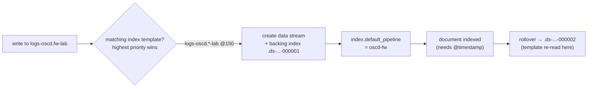

# ELK-02: Ingest Pipelines, ECS and Data Streams

> **Module type:** Extension module (vendor-specific elective) — part of [EXT-ELK](index.md)
> **Status:** Draft
> **Version:** v0.1
> **Last Reviewed:** 2026-09-13
> **Domain Expert:** _Unassigned — required before Practitioner Approved_
> **Practitioner Reviewer:** _Unassigned — required before Practitioner Approved_

!!! warning "Not a credit-bearing unit"
    See the [series index](index.md). ELK-02 carries no credit points and does not feed
    [`docs/ksat-coverage.md`](../../ksat-coverage.md). Product behaviour is cited to
    Elastic's documentation as read on 2026-09-13; the
    [verification table](#verification-status) records what drifts with releases.

---

## Overview

ELK-01 got the documents to Elasticsearch. This module is about what happens in the
milliseconds between arrival and storage, and about the two contracts that make the data
usable afterwards: the **schema** the fields conform to, and the **store** they land in.

An **ingest pipeline** is "a series of configurable tasks called processors" that runs on
an ingest node before a document is indexed — parse, rename, enrich, set — one document
at a time. The **Elastic Common Schema** is "an open source specification" of field names
and datatypes so that a login from Windows, a cloud identity provider and a Linux host all
carry `user.name`, `source.ip` and `event.outcome`, and so that one detection rule can
address all three. A **data stream** is "a layer of abstraction over a set of indices
that are optimized for storing append-only time series data": every document needs a
`@timestamp`, writes go to the newest backing index, and lifecycle policy decides what
happens to the rest.

The module teaches those three together because they fail together. A pipeline that
does not produce `@timestamp` writes nothing to a data stream; a pipeline that produces
the wrong ECS field is invisible to every rule that expects the right one; a template
with the wrong priority quietly hands your stream to Elastic's defaults. The lab dataset
is the worked example throughout: eight sources in a Splunk-style CIM shape that the
learner maps to ECS, categorises, pipelines, tests and reconciles.

It does **not** re-teach normalisation as a concept
([DE02](../../../degrees/operational/detection-engineering/DE02-data-sources-log-engineering.md)
Topic 4), log formats ([F06](../../../core/units/F06-data-log-analysis.md)), or
lifecycle policy (ELK-03). Primary sources: Elastic's *Ingest pipelines*, *Elastic Common
Schema* reference and guidelines, *Data streams* and *Index templates* documentation.

---

## Where this module fits

| Unit / module | Relationship |
|---|---|
| [ELK-01](elk-01-collection-agent-fleet.md) | **Predecessor.** The naming contract (Topic 4) and the `oscd-epoch` pipeline of its Lab 2 are the starting point here. |
| [DE02 — Data Sources & Log Engineering](../../../degrees/operational/detection-engineering/DE02-data-sources-log-engineering.md) | **Prerequisite.** Normalisation and data modelling in the abstract; ECS is one implementation. |
| [F06 — Data & Log Analysis](../../../core/units/F06-data-log-analysis.md) | Log formats, parsing and the difference between index-time and search-time work. |
| [EXT-SPL SPL-02](../splunk/spl-02-power-user.md) | CIM and data models — the Splunk side of the crosswalk in Topic 5. |
| [SA-05 — Logging, Monitoring and Detection Architecture](../security-architecture/sa-05-logging-and-monitoring-architecture.md) | Topic 7's record baseline is what the ECS categorisation fields implement; Lab 2's register decides what gets pipelined. |
| [DE05 — Detection Operations Management](../../../degrees/operational/detection-engineering/DE05-detection-operations-management.md) | Detection-as-code operations; pipelines belong under the same change control (Topic 7). |
| [ELK-03](elk-03-lifecycle-sizing-cluster-architecture.md); [ELK-04](elk-04-detection-rules-eql-security-app.md) | Successors: lifecycle on the streams built here; rules over the fields mapped here. |

---

## Prerequisites

- [ELK-01](elk-01-collection-agent-fleet.md) Lab 2 complete (a running Basic-tier stack with the dataset onboarded)
- [DE02 — Data Sources & Log Engineering](../../../degrees/operational/detection-engineering/DE02-data-sources-log-engineering.md) (hard)
- [F06 — Data & Log Analysis](../../../core/units/F06-data-log-analysis.md) (hard)

---

## Learning outcomes

On completion, a learner can:

1. **Explain** where ingest processing runs, how a pipeline is attached to writes, and
   what a pipeline cannot do (split or aggregate documents).
2. **Apply** the ECS naming and categorisation rules — `event.kind`, `event.category`,
   `event.type`, `event.outcome` — to a multi-source dataset, and **produce** a
   CIM-to-ECS crosswalk with custom fields named to the guidelines.
3. **Implement** per-source ingest pipelines with parsing, timestamp, enrichment and
   failure handling, attached through templates to data streams, and **verify** them with
   the simulate API and post-ingest queries.
4. **Analyse** template precedence and data-stream behaviour to **diagnose** why
   documents are rejected, mis-routed or mis-mapped.
5. **Evaluate** pipeline changes as detection-affecting changes and **justify** a
   change-control and versioning approach.
6. **Assess** data quality on a running stream — completeness, categorisation coverage,
   mapping growth — and **recommend** corrections.

> Bloom's 2–5; see [`docs/content-standards.md`](../../content-standards.md).

---

## AQF Level 7 Alignment

Applies a documented specification to messy real data, requires diagnosis from evidence
(simulate output, rejected documents, template precedence), and asks for justified
operational recommendations — the application and judgement descriptors at Level 7.

> Notional; ELK-02 is not credit-bearing and has not been assessed through
> [`docs/compliance/aqf-teqsa.md`](../../compliance/aqf-teqsa.md).

---

## Framework mappings

> **Provisional pending Framework Custodian review.** These do **not** feed
> [`docs/ksat-coverage.md`](../../ksat-coverage.md).

### NIST NICE DCWF

| Version | Work Role | Code | T-Code | Task | Demonstrated in |
|---|---|---|---|---|---|
| 2023 | Cyber Defense Infrastructure Support | PR-INF-001 | T0335 | (paraphrase) Build and maintain the data-processing tier of monitoring infrastructure | Lab 2, Lab 3 |
| 2023 | Data Analyst | OM-DTA-002 | T0342 | (paraphrase) Develop and implement data standards and normalisation | Lab 1, Lab 2 |
| 2023 | Cyber Defense Analyst | PR-CDA-001 | T0166 | (paraphrase) Perform event correlation across normalised sources | Lab 2, Summative |

### SFIA 9

| Skill | Code | Level | Demonstrated in |
|---|---|---|---|
| Data modelling and design | DTAN | Level 4 | Lab 1 |
| Data management | DATM | Level 4 | Lab 2, Lab 3 |
| Methods and tools | METL | Level 4 | Lab 2 |
| Information security | SCTY | Level 4 | Topic 7, Summative |

### ASD Cyber Skills Framework

| Domain | Sub-domain | Proficiency | Demonstrated in |
|---|---|---|---|
| Defensive Operations | Monitoring Infrastructure | Practitioner–Advanced | Lab 2, Lab 3 |
| Defensive Operations | Threat Detection | Practitioner | Lab 1, Summative |

### Project-local KSATs

| Type | ID | Statement | Demonstrated in |
|---|---|---|---|
| Knowledge | ELK-02-K01 | Knowledge of ingest nodes, processors, pipeline attachment and the one-document limit | Topic 1–2 |
| Knowledge | ELK-02-K02 | Knowledge of ECS core and extended levels, naming rules and mandatory fields | Topic 4; Lab 1 |
| Knowledge | ELK-02-K03 | Knowledge of the ECS categorisation fields and their allowed values | Topic 4; Lab 1 |
| Knowledge | ELK-02-K04 | Knowledge of data-stream mechanics: `@timestamp`, backing indices, write index, rollover, append-only semantics | Topic 6 |
| Knowledge | ELK-02-K05 | Knowledge of composable and component templates, patterns, priority and creation-time application | Topic 6; Lab 2 |
| Skill | ELK-02-S01 | Skill in writing and testing pipelines with grok/dissect, date, set/rename, enrich and `on_failure` | Lab 2, Lab 3 |
| Skill | ELK-02-S02 | Skill in producing a CIM-to-ECS crosswalk with correct categorisation | Lab 1 |
| Skill | ELK-02-S03 | Skill in diagnosing rejected or mis-mapped documents from simulate output and stream evidence | Lab 3 |
| Ability | ELK-02-A01 | Ability to treat a pipeline change as a detection change and place it under version control | Topic 7; Summative |
| Ability | ELK-02-A02 | Ability to decide what stays custom and what maps to ECS, and defend it | Lab 1; Summative |
| Ability | ELK-02-A03 | Ability to measure categorisation coverage and mapping growth on a live stream | Lab 3; Summative |

---

## Module structure

| Part | Topics | Labs | Notional hours |
|---|---|---|---|
| A — Pipelines: where, how, limits | 1–3 | — | 4 |
| B — ECS and the crosswalk | 4–5 | 1 | 6 |
| C — Templates and data streams | 6 | 2 | 6 |
| D — Testing, failure, change control, quality | 7–8 | 3 | 6 |
| | | | **~22 hours** |

---

## Topics

### Topic 1: Where Processing Runs, and What It Cannot Do

Ingest pipelines run on nodes with the `ingest` role — a cluster "must have at least one
node with the `ingest` role", and heavy ingest loads warrant dedicated ones. Processors
run **sequentially** on **one document at a time**. That second point is the one to hold
on to: a pipeline "cannot split one incoming document into multiple documents", and it
cannot aggregate across documents, with the single exception of the `enrich` processor
looking values up from an enrich index. Anything that needs the previous event — session
stitching, rate-based logic, the beacon regularity that SPL-09 computes — is search-time
or rule-time work (ELK-04), not ingest-time.

Where this sits against the alternatives an Elastic estate offers:

| Layer | What it is good for | What it is not |
|---|---|---|
| Elastic Agent / Beats processors | Cheap, host-side shaping: drop, add host metadata, rename before shipping | Not centrally versioned per source the way a pipeline is |
| Ingest pipeline | Central, per-dataset parsing and normalisation; testable with simulate; what integrations ship | One document at a time; runs on the cluster's CPU |
| Logstash | Multi-output routing, buffering, heavier transforms | A separate tier to run; outside this module |

The lab dataset's `oscd-epoch` pipeline from ELK-01 is the minimal case: one `date`
processor and a `set`. This module grows it into per-source pipelines.

### Topic 2: Attaching a Pipeline to Writes

Three ways, and the precedence between them matters when a document surprises you:

| Mechanism | Set where | When it runs |
|---|---|---|
| `pipeline` request parameter | On the index or bulk request (Filebeat's `pipeline:` setting is this) | Overrides the index default |
| `index.default_pipeline` | Index setting, usually from the template | If the request names none |
| `index.final_pipeline` | Index setting | Always, after the default or request pipeline |

Fleet integrations attach their pipelines through the index template of each data stream,
named `logs-<dataset>-default` for the dataset. Two consequences follow. First, the
pipeline runs because the *template* says so, so a stream created before the template
existed keeps whatever it had (Topic 6). Second, the `final_pipeline` is where an
organisation-wide rule — a tenant tag, a residency marker, a redaction — belongs, because
it cannot be bypassed by a request parameter.

### Topic 3: The Processors That Do Security Work

| Processor | Use in security data | Note |
|---|---|---|
| `grok`, `dissect` | Pull fields from unstructured text; dissect is faster and stricter, grok handles variable formats | The lab data is already JSON, so these appear in Lab 3's malformed-input exercise rather than the main path |
| `date` | Parse the source timestamp into `@timestamp`, with `formats` and a `timezone` | The single most common silent defect: the wrong `timezone` shifts every event and every correlation |
| `set`, `rename`, `remove` | Shape fields to ECS names; drop what must not be stored | `remove` is where privacy minimisation is implemented (Australian context) |
| `geoip` | Enrich IPs with location | Only meaningful for public IPs; the lab's `cloud` source already carries coordinates |
| `enrich` | Look up asset and identity context from an enrich index built from the lookups | The Elastic counterpart of SPL-04's asset and identity framework |
| `script` (Painless) | Logic the others cannot express | Last resort; hard to test, easy to slow |
| `pipeline` | Call another pipeline — a common pipeline then a per-source one | The versioning pattern Topic 7 recommends |
| `on_failure`, `ignore_failure` | Recover or continue when a processor fails | Set `event.kind: pipeline_error` on failure — ECS reserves the value for exactly this |

The **simulate API** runs a pipeline against sample documents and returns the result
without indexing. It is the unit test of this discipline and the labs use it before every
attach.

### Topic 4: ECS — Levels, Naming, and the Four Categorisation Fields

ECS distinguishes **core** fields — "most common across all use cases" and "used by
analysis content (searches, visualizations, dashboards, alerts, machine learning jobs,
reports)" — from **extended** fields that "may apply to more narrow use cases" and are
"more likely to change over time". Map the core set first; that is where prebuilt rules
and dashboards look.

The guidelines are specific about documents and names. A document "MUST have the
`@timestamp` field", should carry `ecs.version`, and should "map as many fields as
possible to ECS". Custom fields are permitted — "add them to your events, using custom
field names" — but "field names must be lower case", use underscores between words, use
prefixes "for all fields, except for the base fields", run "from general to specific",
and avoid repetition of the prefix in the name.

ECS classifies an event two ways: *where it is from* (`host.*`, `source.*`,
`user.*`, `process.*` and so on) and *what it is* — the four categorisation fields:

| Field | Purpose | Allowed values (as read 2026-09-13) |
|---|---|---|
| `event.kind` | The high-level nature of the document | `alert` (from a detection rule executing externally to the stack), `asset`, `enrichment`, `event` (the common case), `metric`, `state`, `pipeline_error`, `signal` (alerts created by rules running inside Kibana) |
| `event.category` | The domain the event belongs to; an array, so one event can be two things | `api`, `authentication`, `configuration`, `database`, `driver`, `email`, `file`, `host`, `iam`, `intrusion_detection`, `library`, `malware`, `network`, `package`, `process`, `registry`, `session`, `threat`, `vulnerability`, `web` |
| `event.type` | The sub-classification within the category; each category lists which types it expects | e.g. `authentication` → `start`, `end`, `info`; `network` → `access`, `allowed`, `connection`, `denied`, `end`, `info`, `protocol`, `start`; `intrusion_detection` → `allowed`, `denied`, `info`; `process` → `access`, `change`, `end`, `info`, `start` |
| `event.outcome` | Whether the action succeeded | `success`, `failure`, `unknown` |

The distinction that trips people: `event.kind: alert` is for something *another* system
decided was an alert (an IDS, an EDR); `signal` is what Kibana's own detection rules
write. The lab's `ids` source is therefore `alert`; ELK-04's rule output will be `signal`.

### Topic 5: The Crosswalk — Mapping the Lab Dataset to ECS

The eight lab sources arrive in a CIM-like shape (SPL-02's data models). ECS has a place
for most of it and a naming rule for the rest. Lab 1 builds the full table; the shape of
it, for the fields every source shares:

| Lab field | ECS field | Note |
|---|---|---|
| `_time` (epoch) | `@timestamp` | `date` processor with `UNIX` format; keep the original as `oscd.time_epoch` if the audit trail needs it |
| `user` | `user.name` | On `cloud`, `user.email` may also apply |
| `src` (IP) | `source.ip` | And `source.address` for the unparsed value |
| `src_host` | `host.name` (the host that generated the event) or `source.domain` (a remote party) | Decide per source and write it down |
| `dest` | `destination.domain` (a name) or `destination.ip` (an address) | The lab uses both; the pipeline has to tell them apart |
| `dest_port` | `destination.port` | |
| `bytes_out`, `bytes_in` | `source.bytes`, `destination.bytes` | `network.bytes` is the sum |
| `action` (`allowed`/`blocked`, `success`/`failure`) | `event.action` and, where it is an outcome, `event.outcome` | Do not put `blocked` in `event.outcome` |
| `EventCode` | `event.code` | As a keyword |
| `process_name`, `parent_process_name` | `process.name`, `process.parent.name` | `process` (the command line) → `process.command_line` |
| `query`, `reply_code` | `dns.question.name`, `dns.response_code` | |
| `url`, `http_method`, `status` | `url.full`, `http.request.method`, `http.response.status_code` | |
| `signature`, `signature_id`, `severity` | `rule.name`, `rule.id`, `event.severity` | |
| `category` (proxy), `mfa_result`, `risk_score`, `search_name` | Custom: `oscd.web_category`, `oscd.mfa_result`, `oscd.risk.score`, `oscd.risk.search_name` | Prefixed, lower case, general-to-specific — the guideline's rules |

And the categorisation, per source:

| Source | `event.kind` | `event.category` | `event.type` | `event.outcome` |
|---|---|---|---|---|
| `wineventlog` (4624/4625) | `event` | `authentication` | `start` | `success` / `failure` |
| `sysmon` (EventCode 1) | `event` | `process` | `start` | — |
| `proxy` | `event` | `web`, `network` | `access` | from HTTP status |
| `dns` | `event` | `network` | `protocol` | `success` / `failure` from `reply_code` |
| `cloud` | `event` | `authentication` | `start` | `success` / `failure` |
| `fw` | `event` | `network` | `connection`, and `allowed` or `denied` | — |
| `ids` | `alert` | `intrusion_detection` | `info` (or `allowed` / `denied` where the sensor acted) | — |
| `risk` | `alert` | — (custom `oscd.risk.*`) | — | — |

!!! note "The crosswalk is a design record, not a convenience"
    Every row is a decision a rule author will depend on. Keep it in the repository next
    to the pipelines, and change it under the same control (Topic 7).

### Topic 6: Templates and Data Streams — What Happens at Creation Time

A **data stream** is a name over hidden backing indices, `.ds-<stream>-<yyyy.MM.dd>-<generation>`,
with the newest as the **write index**; a **rollover** creates the next one on age, size
or document count. Writes are append-only: "direct update or delete requests aren't
supported" on the stream — you target a backing index or use update/delete-by-query. For
security telemetry that is the right default: the record is evidence.

A stream is created by an **index template** whose `index_patterns` match the name and
whose `data_stream` object is present; the template "also defines how each backing index
is configured as it is created". Templates compose: **component templates** hold reusable
settings, mappings and aliases; the index template references them and can add its own,
and "configuration from the index template itself takes precedence over component
template settings". When several templates match, the highest **priority** wins.
Elasticsearch ships built-in templates for `logs-*-*`, `metrics-*-*` and others at
priority **100**, and Fleet integrations use priorities up to **200**. So the lab's
`logs-oscd.*-lab` template must sit above 100 to own its streams — and below 200 if it
must not shadow an integration.

The rule that costs the most when forgotten: templates apply **only at creation**. Change
the template and the existing stream's backing indices keep their old mappings and
pipeline setting until the next rollover creates a new one. The learner meets this in
Lab 2 step 5.

### Topic 7: Pipelines Are Detection Code

A pipeline change alters what every downstream rule sees. Renaming a field, changing a
`date` format, tightening a grok pattern — each can silently blind a detection without an
error anywhere. DE05 makes the case for detection-as-code; the same case applies one
layer down:

- **Version** pipelines in the repository and deploy them with the API, not by hand in
  Dev Tools (Dev Tools is for simulate and for emergencies).
- **Compose** a common pipeline (`oscd-common`: timestamp, `ecs.version`, tenant fields)
  called by per-source pipelines (`oscd-fw`, `oscd-dns` …) through the `pipeline`
  processor, so one change lands once.
- **Test** with simulate against a stored sample set per source *before* attach, and with
  a post-ingest categorisation query *after* (Topic 8).
- **Record** the reindex decision: existing documents are untouched by a new pipeline
  ("existing indexed documents require reindexing"), so either reindex or state that
  history remains in the old shape.

### Topic 8: Data Quality on a Running Stream

Three measurements, run after every attach and on a schedule:

| Measurement | Query shape | What a bad number means |
|---|---|---|
| Completeness | documents per stream vs the source's count (ELK-01 Lab 2) | Rejections, usually a missing `@timestamp` or a mapping conflict |
| Categorisation coverage | share of documents with `event.category` set per stream | A source the pipeline does not recognise, or a `set` that never ran |
| Mapping growth | field count per backing index over time | Un-prefixed custom fields or a source that changed shape — the mapping-explosion precursor |

Failures are made visible by design: `on_failure` sets `event.kind: pipeline_error`, so
"how many pipeline errors today, by stream" is one query, and zero is a claim the
architecture can back.

---

## Labs & exercises

### Lab 1 📄: The Crosswalk

**Objective:** Produce the complete CIM-to-ECS crosswalk and categorisation table for the
eight lab sources, with custom fields named to the ECS guidelines.

**Prerequisites:** Topics 4–5; `labs/docs/data-model.md`.

**Environment:** No tooling required; a spreadsheet helps.

**Instructions:**
1. For every field in every source (`labs/docs/data-model.md`), decide: ECS field, custom
   field (named per the guidelines with an `oscd.` prefix), or drop. Record the reason for
   every drop.
2. Assign `event.kind`, `event.category`, `event.type` and `event.outcome` per source, and
   per event variant where a source has more than one (successful vs failed logon; allowed
   vs blocked session).
3. Mark which ECS fields are core and which extended, and note which prebuilt content
   (dashboards, rules) would depend on each core field.
4. Identify three fields where two sources disagree on meaning (for example `dest` as a
   name vs an address) and state the rule that resolves each.

**Expected output:** The crosswalk (source, lab field, ECS or custom field, level, note)
and the categorisation table. Marked on completeness and on whether every custom name
follows the guideline rules.

**Reflection questions:**
1. Which field did you drop, and what investigation would you no longer be able to do?
2. `ids` is `event.kind: alert`, not `signal`. What would go wrong in ELK-04 if you swapped them?
3. Which of your custom fields would you propose to ECS as an extension, and why is it not there already?

### Lab 2 ✅: Pipelines, Templates, Streams — Built Properly

**Objective:** Replace ELK-01's single `oscd-epoch` pipeline with a common pipeline and
eight per-source pipelines, attached through a component template and an index template
that own `logs-oscd.*-lab`, and prove the result.

**Prerequisites:** Lab 1; Topics 1–3, 6; the ELK-01 Lab 2 stack.

**Environment:** `labs/docker/compose.elastic.yml`.

**Instructions:**
1. Write `oscd-common` (timestamp from `_time`, `ecs.version`, `event.kind: event`,
   `oscd.tenant`) and eight per-source pipelines that call it with the `pipeline`
   processor and then implement the Lab 1 crosswalk with `rename`, `set` and `remove`.
2. Simulate each per-source pipeline against three real lines from its file. Fix until
   the output matches the crosswalk exactly.
3. Create a component template with the ECS mappings you rely on (at minimum the
   categorisation fields as keywords and `@timestamp` as date), and an index template at
   priority 150 with `index_patterns: ["logs-oscd.*-lab"]`, `data_stream: {}`, and
   `index.default_pipeline` set per dataset — either eight templates, or one template
   whose pipeline dispatches on `fields.dataset`.
4. Delete the ELK-01 streams, restart the collector, and reconcile counts as in ELK-01.
5. Change the component template's mapping for one field and re-ingest **without**
   deleting the stream. Observe that the running backing index kept the old mapping;
   trigger a rollover and observe the new one. Write two sentences on what this means for
   change windows.
6. Run the Topic 8 categorisation-coverage query per stream. Every stream must be at 100%.

**Expected output:** Pipeline and template JSON committed to a repository; simulate
evidence per source; reconciliation table; the step 5 observation; coverage results.

**Reflection questions:**
1. Where did you put the tenant field — common pipeline or `final_pipeline` — and what does the choice protect against?
2. Which processor failed first in simulate, and what would have happened in production without `on_failure`?

### Lab 3 ✅: Break It, Measure It, Version It

**Objective:** Exercise failure handling and data-quality measurement, then place the
pipeline pack under version control with a test.

**Prerequisites:** Lab 2; Topics 7–8.

**Environment:** As Lab 2; git.

**Instructions:**
1. Append twenty malformed lines to a copy of `fw.json` (a missing `_time`, a string
   where `bytes_out` should be a number, a truncated JSON object). Ingest it. Count the
   `event.kind: pipeline_error` documents and read their `error` fields.
2. Add a `dissect` fallback in `on_failure` that recovers the timestamp from the raw
   line where possible, and show the pipeline-error count fall.
3. Introduce a deliberate regression: rename `source.ip` to `src_ip` in `oscd-fw`.
   Run the coverage query and the reconciliation — both pass. Explain in three sentences
   why neither caught it and what test would have (hint: a golden simulate output).
4. Commit the pipeline pack, the templates, the sample lines and the golden outputs, with
   a script that runs simulate for every source and diffs against the golden files.
5. Measure mapping growth: field count per backing index before and after step 1.

**Expected output:** The pipeline-error analysis, the fallback, the regression
explanation, the repository with its test script, and the mapping-growth figures.

**Reflection questions:**
1. A regression that reconciliation cannot see: who in your organisation would have found it, and when?
2. The `remove` processor deleted a field for privacy. Where is the evidence that it did?

---

## Assessment

### Formative 1: Categorise Fifteen Events

Fifteen sample events across the eight sources; assign the four categorisation fields and
name three ECS "where from" fields each. Maps to LO2.

### Formative 2: Read the Simulate Output

A simulate response with two defects (a timezone shift and a type mismatch); find both and
state the fix. Maps to LO3, LO4.

### Summative: The Pipeline Pack

Deliver, for the lab dataset: (1) the crosswalk and categorisation table; (2) the versioned
pipeline pack with templates and golden-output tests; (3) reconciliation, coverage and
mapping-growth evidence; (4) a one-page change-control note treating pipelines as
detection code. Maps to LO1–LO6.

| Criterion | Exemplary | Proficient | Developing | Beginning |
|---|---|---|---|---|
| Crosswalk and categorisation | Every field decided with reasons; custom names guideline-compliant | Complete; a few names or reasons weak | Gaps or several non-compliant names | Largely missing |
| Pipeline pack | Common + per-source, simulate-tested, templates at correct priority | Works; tests partial | Works for some sources | Does not attach |
| Quality evidence | All three measurements, correct and interpreted | Measurements present | Counts only | Absent |
| Change-control note | Versioning, testing and reindex decision all argued | Two of three | One | Absent |

| Assessment task | Learning outcomes addressed |
|---|---|
| Formative 1 | LO2 |
| Formative 2 | LO3, LO4 |
| Summative | LO1, LO2, LO3, LO4, LO5, LO6 |

---

## Australian context

ASD's *Best practices for event logging and threat detection* asks for a trustworthy,
consistent time source and timestamps in UTC using ISO 8601; on this platform that is the
`date` processor's `timezone` and the `@timestamp` field, and the Topic 3 warning about
timezone shift is the practical form of that guidance. The categorisation fields are how a
single query answers the guidance's demand that logs be centralised *and* searchable
across sources — "every failed authentication in the last hour, from any system" is one
`event.category` filter once the crosswalk is done.

The `remove` processor is where an Australian organisation implements the Privacy Act 1988
(Cth) APP 11 minimisation decision that SA-05 Lab 2's register recorded: fields that carry
personal information the security use case does not need — precise geolocation in the
`cloud` source is the lab's example — can be dropped at ingest, with the pipeline
definition itself as the evidence that they were. Doing it in the `final_pipeline` means
no request can bypass it. The reverse obligation applies too: fields needed for an
incident investigation must survive, and the crosswalk's drop column is the record of what
was decided and why.

Where the stack runs matters less to this module than to ELK-03, but one point belongs
here: `ecs.version` and the categorisation fields travel with the document, so a data
stream moved between regions or between Elastic and OpenSearch (ELK-05) keeps its meaning.

---

## Verification status

| Item | Status | Action required |
|---|---|---|
| Ingest-pipeline behaviour, attachment mechanisms, simulate, limits | Verified 2026-09-13 against Elastic's *Ingest pipelines* documentation | Re-verify at each major release |
| ECS levels, naming rules, `@timestamp`/`ecs.version` requirements | Verified 2026-09-13 against the ECS guidelines page | Confirm ECS version (docs stated 9.5.0) |
| `event.kind` and `event.category` allowed values and expected `event.type` per category | Verified 2026-09-13 against the ECS allowed-values pages | Re-verify per ECS release |
| `event.outcome` values, `event.type` full value list | **Author's knowledge** (page not read) | Verify |
| Data-stream and template behaviour, built-in template priority 100, Fleet up to 200 | Verified 2026-09-13 against *Data streams* and *Index templates* pages | Re-verify |
| Fleet `@custom` pipeline hook and `logs-<dataset>-default` naming | Naming verified from the ingest-pipelines page; the `@custom` hook is **not** relied on in this draft | Add once verified |
| Field-count limit setting and mapping-explosion behaviour | **Author's knowledge** | Verify setting name and default before Lab 3 step 5 is taught as a number |
| ECS crosswalk choices for the lab sources | Module's own design | Practitioner review |
| NICE T-codes (paraphrased), SFIA levels, ASD CSF sub-domains, KSAT IDs | Provisional | Framework Custodian |

---

## Further reading

**Elastic (2026).** *Ingest pipelines.* https://www.elastic.co/docs/manage-data/ingest/transform-enrich/ingest-pipelines
> Relevance: processors, attachment, simulate and failure handling — Topics 1–3 and every lab.

**Elastic (2026).** *Elastic Common Schema reference.* https://www.elastic.co/docs/reference/ecs
> Relevance: the field sets the crosswalk maps to; keep it open while doing Lab 1.

**Elastic (2026).** *ECS guidelines and best practices.* https://www.elastic.co/docs/reference/ecs/ecs-guidelines
> Relevance: levels, naming rules and the mandatory fields — Topic 4.

**Elastic (2026).** *Data streams.* https://www.elastic.co/docs/manage-data/data-store/data-streams
> Relevance: `@timestamp`, backing indices, rollover and append-only semantics — Topic 6.

**Elastic (2026).** *Index templates.* https://www.elastic.co/docs/manage-data/data-store/templates
> Relevance: composable and component templates, priority and creation-time application — Topic 6 and Lab 2.

**ASD (2024).** *Best practices for event logging and threat detection.* https://www.cyber.gov.au/resources-business-and-government/maintaining-devices-and-systems/system-hardening-and-administration/system-monitoring/best-practices-event-logging-threat-detection
> Relevance: the time-source and searchability expectations the Australian context section maps onto pipelines.

**OAIC.** *Australian Privacy Principles guidelines — APP 11.* https://www.oaic.gov.au/privacy/australian-privacy-principles/australian-privacy-principles-guidelines
> Relevance: the minimisation obligation the `remove` processor implements.

---

## Module metadata

| Field | Value |
|---|---|
| Module Code | ELK-02 |
| Module Title | Ingest Pipelines, ECS and Data Streams |
| Module Type | Extension module (vendor-specific elective; **not** credit-bearing) |
| Version | v0.1 |
| Status | Draft |
| Credit Points | 0 CP — outside the 160 CP degree structure |
| Notional Hours | ~22 |
| Extends | ELK-01; DE02 (Topic 4); F06 |
| Related Units | SA-05, DE05, EXT-SPL SPL-02 |
| Prerequisites | ELK-01 Lab 2; DE02; F06 |
| Domain Expert | _Unassigned — required before Practitioner Approved_ |
| Practitioner Reviewer | _Unassigned — required before Practitioner Approved_ |
| Last Reviewed | 2026-09-13 |
| Framework Version — NICE DCWF | 2023 |
| Framework Version — SFIA | SFIA 9 (2023) |
| Framework Version — ASD CSF | 2024 |
| Bloom's Level (range) | 2–5 (Understand, Apply, Analyse, Evaluate) |
| Australian Legislation Referenced | Privacy Act 1988 (Cth) — APP 11 |
| Tooling Licence Position | Self-managed Elastic Basic (free); no paid feature required |
| Licence | CC BY 4.0 |
