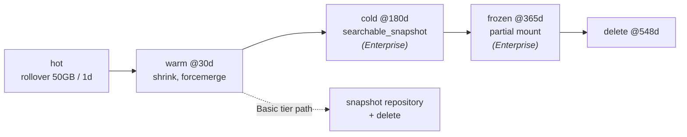

# ELK-03: Lifecycle, Sizing and Cluster Architecture

> **Module type:** Extension module (vendor-specific elective) — part of [EXT-ELK](index.md)
> **Status:** Draft
> **Version:** v0.1
> **Last Reviewed:** 2026-09-13
> **Domain Expert:** _Unassigned — required before Practitioner Approved_
> **Practitioner Reviewer:** _Unassigned — required before Practitioner Approved_

!!! warning "Not a credit-bearing unit"
    See the [series index](index.md). ELK-03 carries no credit points and does not feed
    [`docs/ksat-coverage.md`](../../ksat-coverage.md). Product behaviour and the sizing
    numbers are cited to Elastic's documentation as read on 2026-09-13; the
    [verification table](#verification-status) records what to re-check.

---

## Overview

[SA-05](../security-architecture/sa-05-logging-and-monitoring-architecture.md) decides
how long each source is kept and where; [SPL-07](../splunk/spl-07-architect.md) shows
what those decisions cost on one platform. This module is the Elastic instance of the
same problem, and it is unusually well documented: Elastic publishes the shard sizes it
wants you to hit, the tiers it wants data to age through, and the node roles it expects
each tier to run on. An architect's job on this platform is to turn a retention register
into **index lifecycle policies**, a daily volume into a **shard and node count**, and an
availability requirement into a choice between **replicas, snapshots and cross-cluster
replication** — and to know, for each, whether the answer is in the free tier.

The module teaches the cluster as a structure (nodes, roles, shards, replicas), the
**data tiers** — hot, warm, cold, frozen, content — and the roles and hardware behind
them, **ILM** phases and actions and how a policy reaches a data stream through its
template, Elastic's **sizing guidance** and the arithmetic from daily volume to cluster,
the three **availability** mechanisms and their licence positions, and the method of
reading a vendor's production guidance the way SA-05 Topic 12 reads a validated
architecture: what it decides, what it leaves to you.

It does **not** teach logging architecture (SA-05), pipelines and templates (ELK-02),
or Splunk's equivalents (SPL-07). Primary sources: Elastic's *Index lifecycle
management*, *Data tiers*, *Size your shards*, *Searchable snapshots* and *Cross-cluster
replication* documentation, and the subscriptions comparison.

---

## Where this module fits

| Unit / module | Relationship |
|---|---|
| [ELK-02](elk-02-ingest-pipelines-ecs-data-streams.md) | **Predecessor.** The streams and templates ILM policies attach to. |
| [SA-05 — Logging, Monitoring and Detection Architecture](../security-architecture/sa-05-logging-and-monitoring-architecture.md) | Lab 2's retention register is the input to Topic 3; Topic 12's reading method is applied in Topic 6. |
| [EXT-SPL SPL-07](../splunk/spl-07-architect.md) | The Splunk counterpart: indexer clustering, replication and search factor, SmartStore. Read the two capacity models side by side. |
| [SE04 — Detection & Response Engineering](../../../degrees/strategic/security-engineering/SE04-detection-response-engineering.md) | Platform architecture in the abstract. |
| [SE01 — Secure System Design](../../../degrees/strategic/security-engineering/SE01-secure-system-design.md) | Availability and failure-mode reasoning behind Topic 5. |
| [SA-06 — Assurance, Capability Maturity and System Authorisation](../security-architecture/sa-06-assurance-maturity-and-authorisation.md) | The platform is itself a system to be authorised; Topic 8's controls are its evidence. |
| ELK-04, ELK-05 *(later in this series)* | Rules over the streams sized here; the OpenSearch counterpart (ISM) of Topic 3. |

---

## Prerequisites

- [ELK-02](elk-02-ingest-pipelines-ecs-data-streams.md) (hard)
- [SA-05](../security-architecture/sa-05-logging-and-monitoring-architecture.md) Lab 2 (a retention register to work from)
- [SE01](../../../degrees/strategic/security-engineering/SE01-secure-system-design.md) (recommended, for Topic 5)

---

## Learning outcomes

On completion, a learner can:

1. **Explain** the structure of an Elasticsearch cluster — nodes, roles, shards, replicas,
   data tiers — and **relate** it to the SP 800-92 tier model used in SA-05.
2. **Implement** index lifecycle policies that express a retention register, attached to
   data streams through templates, and **verify** phase transitions.
3. **Produce** a capacity model from daily volume to shard, node and storage counts using
   Elastic's published sizing guidance, with assumptions stated.
4. **Evaluate** replicas, snapshot and restore, and cross-cluster replication against a
   stated availability and recovery requirement, and **justify** a choice including its
   licence position.
5. **Analyse** Elastic's production guidance as a vendor reference — what it decides,
   what it leaves open — and **apply** the result to a stated estate.
6. **Assess** a cluster's own security controls (transport encryption, RBAC, repository
   protection, audit logging) and **recommend** the evidence an authorisation needs.

> Bloom's 2–5; see [`docs/content-standards.md`](../../content-standards.md).

---

## AQF Level 7 Alignment

Requires quantitative modelling with explicit assumptions, evaluation of alternatives
against requirements and cost, and communication of a design to a non-specialist
approver — the analysis and judgement descriptors at Level 7.

> Notional; ELK-03 is not credit-bearing and has not been assessed through
> [`docs/compliance/aqf-teqsa.md`](../../compliance/aqf-teqsa.md).

---

## Framework mappings

> **Provisional pending Framework Custodian review.** These do **not** feed
> [`docs/ksat-coverage.md`](../../ksat-coverage.md).

### NIST NICE DCWF

| Version | Work Role | Code | T-Code | Task | Demonstrated in |
|---|---|---|---|---|---|
| 2023 | Security Architect | SP-ARC-002 | T0050 | (paraphrase) Design system security architecture and supporting infrastructure | Lab 1, Summative |
| 2023 | Enterprise Architect | SP-ARC-001 | T0473 | (paraphrase) Document and address organisational requirements in system design | Lab 1, Lab 3 |
| 2023 | Cyber Defense Infrastructure Support | PR-INF-001 | T0335 | (paraphrase) Build and maintain monitoring infrastructure | Lab 2 |
| 2023 | System Administrator | OM-ADM-001 | T0431 | (paraphrase) Automate lifecycle and capacity administration | Lab 2 |

### SFIA 9

| Skill | Code | Level | Demonstrated in |
|---|---|---|---|
| Infrastructure design | IFDN | Level 5 | Lab 1, Summative |
| Solution architecture | ARCH | Level 5 | Topic 6, Summative |
| Data management | DATM | Level 4 | Lab 2 |
| Information security | SCTY | Level 4 | Topic 8, Lab 3 |

### ASD Cyber Skills Framework

| Domain | Sub-domain | Proficiency | Demonstrated in |
|---|---|---|---|
| Security Architecture | Platform & Infrastructure Design | Advanced | Lab 1, Summative |
| Secure Systems | Resilience & Availability | Practitioner–Advanced | Topic 5, Lab 3 |

### Project-local KSATs

| Type | ID | Statement | Demonstrated in |
|---|---|---|---|
| Knowledge | ELK-03-K01 | Knowledge of cluster structure: node roles, shards, replicas, and the tier model | Topic 1–2 |
| Knowledge | ELK-03-K02 | Knowledge of ILM phases, actions, and policy attachment through templates | Topic 3; Lab 2 |
| Knowledge | ELK-03-K03 | Knowledge of Elastic's published shard and node sizing guidance | Topic 4; Lab 1 |
| Knowledge | ELK-03-K04 | Knowledge of replicas, snapshot and restore, searchable snapshots and CCR, and their licence positions | Topic 5; Lab 3 |
| Knowledge | ELK-03-K05 | Knowledge of the cluster's own security controls and which are free | Topic 8 |
| Skill | ELK-03-S01 | Skill in writing and verifying ILM policies against a retention register | Lab 2 |
| Skill | ELK-03-S02 | Skill in producing a capacity model with explicit assumptions | Lab 1 |
| Skill | ELK-03-S03 | Skill in designing and rehearsing a snapshot-based recovery | Lab 3 |
| Ability | ELK-03-A01 | Ability to defend a sizing and tiering decision to a non-technical approver | Lab 1; Summative |
| Ability | ELK-03-A02 | Ability to choose an availability mechanism for a stated RTO/RPO within licence constraints | Lab 3; Summative |
| Ability | ELK-03-A03 | Ability to separate what a vendor's guidance decides from what the architecture must decide | Topic 6; Summative |

---

## Module structure

| Part | Topics | Labs | Notional hours |
|---|---|---|---|
| A — The cluster and its tiers | 1–2 | — | 4 |
| B — Lifecycle | 3 | 2 | 5 |
| C — Sizing | 4 | 1 | 5 |
| D — Availability and recovery | 5 | 3 | 4 |
| E — Reading the vendor; securing the platform | 6–8 | — | 4 |
| | | | **~22 hours** |

---

## Topics

### Topic 1: The Cluster as a Structure

An Elasticsearch cluster is a set of **nodes**, each with one or more **roles**; an index
is split into **primary shards**, each optionally copied to **replica shards** on other
nodes. Everything in this module is a consequence of those three facts.

| Role | Does | Sizing driver |
|---|---|---|
| Master-eligible | Cluster state; index and shard bookkeeping | Number of indices and shards — Elastic asks for "at least 1GB of heap per 3000 indices" on master nodes |
| Data (`data_content`, `data_hot`, `data_warm`, `data_cold`, `data_frozen`) | Holds shards; serves search and indexing for its tier | Volume, retention, query load per tier |
| Ingest | Runs pipelines (ELK-02) | Ingest rate and pipeline cost |
| Coordinating-only | Routes requests, merges results | Concurrent search load |
| Machine learning | Anomaly jobs (paid rules) | Not required by this series |

Against the SP 800-92 tiers SA-05 uses: agents and collectors are generation and
collection; data nodes across their tiers are analysis and storage; Kibana and the rule
engine are monitoring. The mapping is the one SA-05 Topic 12 makes for a Splunk validated
architecture, and it holds here with one difference — Elastic separates *tiers of the
same data by age* explicitly, which is the subject of the next topic.

### Topic 2: Data Tiers and the Roles Behind Them

Elastic organises time-series data by how it is accessed as it ages, and expects a node
role and a hardware profile per tier:

| Tier | Holds | Role | Depends on |
|---|---|---|---|
| Content | Non-time-series collections — "a product catalog or article archive" | `data_content` | — |
| Hot | "your most-recent, most-frequently-searched time series data"; the write tier | `data_hot` | Fast disk for reads and writes |
| Warm | Data "being queried less frequently than the recently-indexed data" | `data_warm` | Cheaper disk; still local |
| Cold | Infrequently queried; may hold **fully mounted** searchable snapshots, which can "halve the local storage needed" | `data_cold` | Searchable snapshots for the storage saving |
| Frozen | Data "no longer being queried, or being queried rarely"; **partially mounted** indices only, extending capacity "by up to 20 times compared to the warm tier" | `data_frozen` | Searchable snapshots — an **Enterprise** licence feature per the documentation |

Indices land on a tier through `index.routing.allocation.include._tier_preference`, which
"accepts multiple tiers in order of preference"; data-stream indices default to hot. ILM
moves them with the `migrate` action. Two consequences for design: Elasticsearch "assumes
nodes within a data tier share the same hardware profile", so a mixed tier hotspots; and
the cold and frozen savings exist only with a licence, so on Basic the realistic tiers are
hot and warm, and retention beyond warm is a **snapshot repository**, not a tier.

### Topic 3: Lifecycle — ILM and the Retention Register

ILM moves an index through **hot → warm → cold → frozen → delete** on conditions you set
per phase, with actions in each: `rollover` ("creates a new write index when the current
one reaches a certain size, number of docs, or age"), `shrink`, `forcemerge`,
`searchable_snapshot`, `migrate`, `allocate`, `readonly`, `delete` ("permanently remove
an index, including all of its data and metadata"). A policy reaches a data stream through
its index template (ELK-02 Topic 6), and rollover then runs against the backing indices
automatically.

The design input is SA-05 Lab 2's register — a retention per source at three layers — and
the output is one policy per obligation class, applied by namespace:

| Register row | ILM expression |
|---|---|
| Authentication, 18 months central (ASD recommendation), hot 30 days | hot: rollover at 50 GB or 1 day; warm at 30 days with `shrink` and `forcemerge`; delete at 548 days |
| Web proxy, 12 months, investigative | hot: rollover; warm at 14 days; delete at 365 days |
| Personal-information-adjacent, minimise (APP 11) | hot: rollover; delete at the minimum the register justified |
| Snapshot before delete for anything with a legal hold | a snapshot lifecycle policy timed ahead of the ILM delete |

The simpler **data stream lifecycle** exists for estates (and Serverless, where ILM is
unavailable) that need only retention without tier concepts; on a self-managed cluster
with tiers, ILM is the tool.



### Topic 4: Sizing — Elastic's Numbers, and the Arithmetic

Elastic states its targets. Aim for "shard sizes between 10GB and 50GB" with "the number
of documents on each shard below 200 million"; keep under "1000 non-frozen shards per
node, and 3000 frozen shards per dedicated frozen node"; and understand why — "searches
across a large number of shards can deplete a node's search thread pool", and "a small set
of large shards uses fewer resources than many small shards", while "very large shards can
slow down search operations and prolong recovery times". Rollover on
`max_primary_shard_size` is how ILM keeps shards in range without anyone watching.

The capacity model, tier by tier, with every assumption visible:

```
daily_raw          = events_per_day × bytes_per_event           # measured (SA-05 guide, Lab 1)
index_factor       = 1.1                                        # measure on your data; JSON with ECS keys often > 1
daily_indexed      = daily_raw × index_factor
tier_bytes(tier)   = daily_indexed × days_in_tier × (1 + replicas)
shards(tier)       = ceil(tier_bytes / target_shard_size)       # 30 GB target inside the 10–50 GB band
nodes(tier)        = max(ceil(tier_bytes / usable_disk_per_node), ceil(shards / 1000), 2 for replicas)
```

Worked on the lab estate scaled to a modest agency — say 200 GB/day indexed with one
replica: hot at 30 days is 12 TB and 400 shards of 30 GB; warm at 150 further days is 60 TB
and 2,000 shards, so at least three warm nodes on the shard limit alone before disk is
considered. Frozen at 20× the warm density would hold the remaining year on a fraction of
that — and needs the licence. Lab 1 makes the learner do this for their own register.

!!! warning "The two numbers people get wrong"
    Replicas double storage per tier and are not optional for availability; and the
    per-node shard limit binds before disk does on long-retention warm tiers unless
    `shrink` and `forcemerge` are in the policy. Both are in the arithmetic above and both
    are routinely missing from first designs.

### Topic 5: Availability and Recovery — Three Mechanisms, Three Prices

| Mechanism | Protects against | Licence (as read) | Note |
|---|---|---|---|
| **Replica shards** | Loss of a node within the cluster | Free | Doubles storage; the write path continues on the replica's promotion |
| **Snapshot and restore** | Loss of the cluster, corruption, ransomware, mistakes | Free | Point-in-time; repository types include S3, GCS, Azure Blob, HDFS, shared filesystem and read-only HTTP; **the repository's location is a residency decision** |
| **Searchable snapshots** | Not availability — cost. Cold and frozen tiers mounted from the repository | **Enterprise** | "Fully" mounted in cold (comparable performance), "partially" mounted in frozen (local cache of recently searched parts) |
| **Cross-cluster replication** | Loss of a datacentre or region — "continue handling search requests in the event of a datacenter outage" | Paid (Platinum per the subscriptions page) | Active-passive leader/follower, continuous at shard level; "security configuration is not replicated", so the follower cluster's roles and users are a separate build |

The design move is to write the RTO and RPO first (SE01), then choose. Snapshot-and-restore
on Basic meets a great many requirements that people reach for CCR to solve; where it does
not — a search service that must survive a site loss without a restore — CCR is the
answer and the licence is the price. SA-05 Topic 6's relay tier is the *collection-side*
counterpart: it protects the data before it reaches the cluster at all.

### Topic 6: Reading the Vendor's Guidance as a Reference Architecture

Elastic does not publish "validated architectures" as a document the way Splunk does; it
publishes production guidance — shard sizing, tiers, node roles, hardware profiles in its
hosted offering — spread across the documentation. The reading method from SA-05 Topic 12
applies unchanged:

| What Elastic's guidance decides | What it leaves to your architecture |
|---|---|
| Shard size band, documents per shard, shards per node | Which sources exist and how long each is kept (SA-05 Lab 2) |
| Tier semantics and the role per tier | Which tiers you can afford — the licence line runs between warm and cold |
| Rollover as the shard-control mechanism | Namespaces and policies per obligation (ELK-01 Topic 4, Topic 3 here) |
| Availability mechanisms and their behaviour | RTO/RPO, and where the snapshot repository may physically be |
| Hardware assumptions per tier | Residency, the collection tier, and everything upstream of the cluster |

Record the result the way SA-05 asks: a table of decisions the guidance made for you and
decisions it did not, in the architecture description, with the guidance version cited.

### Topic 7: Capacity as an Ongoing Measurement

Sizing is not done at design time. Three numbers to watch and the action each implies:

| Measure | Where | Action when off |
|---|---|---|
| Primary shard size at rollover | ILM explain per stream | Adjust `max_primary_shard_size` or age; shards drifting small means over-rollover |
| Shards per data node vs the 1000 limit | Cluster stats | `shrink` in warm; consolidate streams; add nodes |
| Disk per tier vs retention target | Node stats | Move the delete phase, or move data to a cheaper tier or the repository |

The learner meets the first two in Lab 2 at toy scale — the mechanism is identical.

### Topic 8: The Cluster Is a System to Authorise

The stack's own controls, and where the free tier stops:

| Control | Basic | Note |
|---|---|---|
| Transport (node-to-node) and HTTP encryption | Free | The lab compose turns HTTP TLS off for brevity; production does not |
| Role-based access control, API keys | Free | Streams per namespace make least privilege expressible (ELK-01 Topic 4) |
| Snapshot repository protection | Free (repository side) | Object-store permissions and immutability are outside the cluster and usually outside the security team's view — put them in the evidence pack |
| Audit logging | **Paid** | On Basic, the authorisation evidence for "who changed this policy" comes from Kibana's and the reverse proxy's logs, and that gap is recorded |
| SSO (SAML/OIDC) | **Paid** | Native users or a reverse-proxy identity layer on Basic |

SA-06's evidence pack for this platform therefore includes the ILM policies (retention
proven), the snapshot lifecycle and a restore test (recovery proven), the role definitions
(least privilege proven), and an explicit statement of what audit evidence the licence
does not provide.

---

## Labs & exercises

### Lab 1 📄: The Capacity Model

**Objective:** Produce a sized, tiered design for the SA-05 estate from its retention
register, using Elastic's published sizing guidance, with every assumption stated.

**Prerequisites:** Topics 2–4, 6; SA-05 Lab 2 register; the measured bytes/day per source
from `labs/guides/sa-05.md` Lab 1.

**Environment:** No tooling required beyond a spreadsheet.

**Instructions:**
1. Scale the lab dataset's measured daily volume to the estate (state the multiplier and
   why). Apply an index factor you justify.
2. For each obligation class in the register, set the days in hot, warm and — if you
   assume a licence — cold/frozen, and the delete point. Compute bytes, shards and nodes
   per tier with the Topic 4 model. Show the working.
3. Produce the Basic-tier version (hot, warm, snapshot repository) and the
   Enterprise-tier version (with cold and frozen). State the cost difference in storage
   and node count, and what the licence buys.
4. Write the Topic 6 table for your design: what Elastic's guidance decided, what you
   decided.
5. Write the half-page an approver reads: the number of nodes, the storage, the two
   assumptions that most change the answer, and what happens if daily volume doubles.

**Expected output:** The model with assumptions; the two tier designs; the decisions
table; the approver's half-page. Marked on traceability from register to numbers, not on
the numbers themselves.

**Reflection questions:**
1. Which assumption moved the node count most, and how would you measure it in month one?
2. Where does the per-node shard limit bind before disk, and what in the policy fixes it?
3. Which of your obligation classes would you be unable to satisfy without the licence, honestly?

### Lab 2 ✅: Lifecycle at Toy Scale

**Objective:** Attach ILM policies to the lab data streams and observe every phase and
action on a single-node cluster.

**Prerequisites:** ELK-02 Lab 2; Topic 3, 7.

**Environment:** `labs/docker/compose.elastic.yml` (Basic; single node — so tiers are
simulated by phase age, not by node role).

**Instructions:**
1. Write two policies: `oscd-security` (hot rollover at 20 MB or 10 minutes; warm at 20
   minutes with `forcemerge` to one segment and `shrink` to one shard; delete at 60
   minutes) and `oscd-web` (hot rollover at 20 MB; delete at 30 minutes).
2. Attach them through the ELK-02 templates — `oscd-security` to the authentication, IDS
   and firewall streams, `oscd-web` to proxy and DNS — and re-create the streams.
3. Re-ingest the dataset. Use the ILM explain API to watch each backing index move phase;
   record the time each transition took against the policy.
4. Force a rollover by hand and observe the new backing index and its template settings.
5. Write a snapshot lifecycle policy that snapshots the security streams to a shared-
   filesystem repository every 15 minutes (add `path.repo` to the compose environment
   and a volume for it), and confirm a snapshot lands before the ILM delete would fire.
6. Break it: set a delete phase earlier than the snapshot schedule and show the window in
   which data would be lost. Fix it.

**Expected output:** The two ILM policies and the SLM policy; the phase-transition log;
the rollover observation; the step 6 window and fix.

**Reflection questions:**
1. On one node, what did `shrink` actually do, and what would it do on three warm nodes?
2. Your snapshot ran before delete. Who verifies that in production, and how often?

### Lab 3 ✅/📄: Recovery Rehearsal and the Availability Decision

**Objective:** Restore from a snapshot and time it; then decide, for a stated RTO/RPO,
between replicas, snapshots and CCR, with the licence position stated.

**Prerequisites:** Lab 2; Topic 5, 8.

**Environment:** As Lab 2 for the restore; paper for the decision.

**Instructions:**
1. Delete a security stream. Restore it from the latest Lab 2 snapshot into a renamed
   index, then swap it back into the stream. Time each step.
2. Compute the RPO you actually achieved (snapshot interval) and the RTO (restore time
   scaled to your Lab 1 volumes — show the scaling).
3. For three stated requirements — (a) survive a node loss with no data loss, (b) survive
   a cluster loss with one hour of data loss and four hours of downtime, (c) survive a
   site loss with search available in fifteen minutes — choose the mechanism, state the
   licence, and state what you would tell an approver who wants (c) on Basic.
4. Write the Topic 8 evidence list for your design: which controls are proven by which
   artefact, and which the licence leaves unevidenced.

**Expected output:** Timed restore record; RPO/RTO arithmetic; the three decisions with
licence positions; the evidence list.

**Reflection questions:**
1. The snapshot repository is on a shared filesystem in the lab. Where is it in production, and who can delete it?
2. What did restoring into a renamed index protect you from?

---

## Assessment

### Formative 1: Which Tier, Which Phase?

Ten sources with retention and access patterns; assign tiers, phases and actions, and mark
which need a paid feature. Maps to LO2, LO4.

### Formative 2: Challenge the Sizing

A supplied capacity model with three errors (missing replicas, shards over the per-node
limit, an index factor of 1.0); find them and correct the node count. Maps to LO3.

### Summative: Architecture Design Package

For the SA-05 estate: (1) the tiered capacity model with assumptions (Lab 1); (2) ILM and
SLM policies expressing the register (Lab 2); (3) the availability decision with RTO/RPO
and licence positions (Lab 3); (4) the Topic 6 decisions table; (5) the Topic 8 evidence
list. Maps to LO1–LO6. Deliberately shaped like an SE06 deliverable.

| Criterion | Exemplary | Proficient | Developing | Beginning |
|---|---|---|---|---|
| Capacity model | Traceable, assumptions explicit, both tier variants | Traceable; one variant | Numbers without working | Absent |
| Lifecycle policies | Express every register row; snapshot precedes delete | Express most rows | Generic policies | None |
| Availability decision | RTO/RPO stated, mechanism and licence justified | Mechanism chosen; licence noted | Mechanism without requirement | Absent |
| Vendor-reference reading | Decided / left-open table complete and cited | Table present | Partial | Absent |
| Evidence list | Every control tied to an artefact; gaps named | Most controls tied | Controls listed | Absent |

| Assessment task | Learning outcomes addressed |
|---|---|
| Formative 1 | LO2, LO4 |
| Formative 2 | LO3 |
| Summative | LO1, LO2, LO3, LO4, LO5, LO6 |

---

## Australian context

ASD's *Best practices for event logging and threat detection* recommends retaining logs
long enough to investigate intrusions whose dwell time may be months — the eighteen-month
figure SA-05 uses — and the warm-tier arithmetic in Topic 4 is what that recommendation
costs on this platform. Where the register also carries a Privacy Act 1988 (Cth) APP 11
minimisation obligation, the ILM delete phase is the control, and the snapshot lifecycle
policy must not quietly extend retention past it: a snapshot of deleted personal
information is still a copy.

Residency on this platform is three separate questions, and an Australian entity has to
answer all three: where the hot and warm nodes are; where the **snapshot repository** is,
since every restore and every searchable snapshot reads from it; and, if CCR is used,
where the follower cluster is. Elastic Cloud offers Australian regions — recorded here as
a statement to verify, not a fact this draft has confirmed — but a self-managed cluster
with an object-store repository in another jurisdiction has moved the data whether or not
anyone noticed. Put the repository's location in the architecture description next to
the tier design.

For responsible entities under the Security of Critical Infrastructure Act 2018 (Cth),
the platform's own availability is part of the asset's risk management: a SIEM that
cannot be restored is a detection gap, and Lab 3's timed restore is the evidence that it
can be.

---

## Verification status

| Item | Status | Action required |
|---|---|---|
| ILM phases, actions, template attachment; data stream lifecycle as the Serverless alternative | Verified 2026-09-13 against Elastic's ILM documentation | Re-verify per release |
| Data tiers, node roles, `_tier_preference`, `migrate`, hardware assumption | Verified 2026-09-13 against the *Data tiers* page | Re-verify |
| Shard-sizing numbers (10–50 GB; <200M docs; 1000 non-frozen / 3000 frozen per node; 1 GB master heap per 3000 indices) | Verified 2026-09-13 against *Size your shards* | Re-verify per release — these numbers have changed before |
| Searchable snapshots: fully/partially mounted, repository types, **Enterprise** licence | Verified 2026-09-13 against the searchable-snapshots page | Confirm the tier on the subscriptions page (which lists it under Platinum+) — the two pages differ in wording |
| CCR behaviour; "security configuration is not replicated" | Verified 2026-09-13 | Licence tier taken from the subscriptions page (Platinum+); the CCR page does not state one |
| Snapshot and restore as a free-tier feature | **Author's knowledge** | Confirm on the subscriptions page |
| Index factor 1.1 and the worked example | Module's own illustration | Learners must measure their own |
| Elastic Cloud Australian regions | **Unverified** | Confirm before delivery |
| NICE T-codes (paraphrased), SFIA levels, ASD CSF sub-domains, KSAT IDs | Provisional | Framework Custodian |

---

## Further reading

**Elastic (2026).** *Index lifecycle management.* https://www.elastic.co/docs/manage-data/lifecycle/index-lifecycle-management
> Relevance: phases, actions and policy attachment — Topic 3 and Lab 2.

**Elastic (2026).** *Data tiers.* https://www.elastic.co/docs/manage-data/lifecycle/data-tiers
> Relevance: tier semantics, roles and the searchable-snapshot dependency — Topic 2.

**Elastic (2026).** *Size your shards.* https://www.elastic.co/docs/deploy-manage/production-guidance/optimize-performance/size-shards
> Relevance: the numbers the capacity model uses — Topic 4 and Lab 1.

**Elastic (2026).** *Searchable snapshots.* https://www.elastic.co/docs/deploy-manage/tools/snapshot-and-restore/searchable-snapshots
> Relevance: what cold and frozen actually are, and the licence — Topics 2 and 5.

**Elastic (2026).** *Cross-cluster replication.* https://www.elastic.co/docs/deploy-manage/tools/cross-cluster-replication
> Relevance: the site-loss mechanism and its caveats — Topic 5 and Lab 3.

**Elastic (2026).** *Subscriptions.* https://www.elastic.co/subscriptions
> Relevance: the licence line every design decision in this module crosses or avoids.

**ASD (2024).** *Best practices for event logging and threat detection.* https://www.cyber.gov.au/resources-business-and-government/maintaining-devices-and-systems/system-hardening-and-administration/system-monitoring/best-practices-event-logging-threat-detection
> Relevance: the retention expectation the tier arithmetic is sized to.

**OAIC.** *Australian Privacy Principles guidelines — APP 11.* https://www.oaic.gov.au/privacy/australian-privacy-principles/australian-privacy-principles-guidelines
> Relevance: the minimisation obligation the delete phase and snapshot policy must respect.

---

## Module metadata

| Field | Value |
|---|---|
| Module Code | ELK-03 |
| Module Title | Lifecycle, Sizing and Cluster Architecture |
| Module Type | Extension module (vendor-specific elective; **not** credit-bearing) |
| Version | v0.1 |
| Status | Draft |
| Credit Points | 0 CP — outside the 168 CP degree structure |
| Notional Hours | ~22 |
| Extends | ELK-02; SA-05 (Lab 2, Topic 12); SPL-07 (as counterpart) |
| Related Units | SE01, SE04, SA-06 |
| Prerequisites | ELK-02; SA-05 Lab 2; SE01 recommended |
| Domain Expert | _Unassigned — required before Practitioner Approved_ |
| Practitioner Reviewer | _Unassigned — required before Practitioner Approved_ |
| Last Reviewed | 2026-09-13 |
| Framework Version — NICE DCWF | 2023 |
| Framework Version — SFIA | SFIA 9 (2023) |
| Framework Version — ASD CSF | 2024 |
| Bloom's Level (range) | 2–5 (Understand, Apply, Analyse, Evaluate) |
| Australian Legislation Referenced | Privacy Act 1988 (Cth) — APP 11; Security of Critical Infrastructure Act 2018 (Cth) |
| Tooling Licence Position | Self-managed Elastic Basic (free) for all labs; Enterprise/Platinum features (searchable snapshots, CCR, audit logging, SSO) named and never required |
| Licence | CC BY 4.0 |
