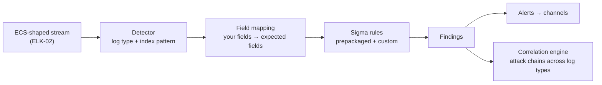

# ELK-05: OpenSearch — the Open Alternative, and Migration

> **Module type:** Extension module (vendor-specific elective) — part of [EXT-ELK](index.md)
> **Status:** Draft
> **Version:** v0.1
> **Last Reviewed:** 2026-09-13
> **Domain Expert:** _Unassigned — required before Practitioner Approved_
> **Practitioner Reviewer:** _Unassigned — required before Practitioner Approved_

!!! warning "Not a credit-bearing unit"
    See the [series index](index.md). ELK-05 carries no credit points and does not feed
    [`docs/ksat-coverage.md`](../../ksat-coverage.md). OpenSearch behaviour is cited to
    the project's documentation and FAQ as read on 2026-09-13; several OpenSearch
    documentation pages could not be read in full for this draft and the
    [verification table](#verification-status) says which claims rest on the author's
    knowledge instead.

---

## Overview

OpenSearch is "a fully open source search and analytics suite" forked from the last
Apache-2.0 releases of Elasticsearch and Kibana — version **7.10.2** — when Elastic
changed its licence. It is governed and released under the Apache License 2.0, which
grants users freedom to "use, modify, extend, monetize, and resell" it, and it ships the
things the fork had to rebuild: security, alerting, anomaly detection, index state
management and — for this series — **Security Analytics**, a detection engine built on
**Sigma** rules rather than on a vendor rule language.

An architect meets OpenSearch in three situations: a procurement or sovereignty
requirement that excludes proprietary licences; a managed offering (several cloud
providers run it) whose licence terms are the point; or an existing Elasticsearch estate
that must decide whether to stay, pay, or move. This module is written for all three. It
teaches the **fork and its consequences** (what is compatible, what is not, and what
"Elastic-licensed features are not included" means in practice), **Security Analytics**
(detectors, log types, field mapping, Sigma rules, findings, alerts, the correlation
engine), **ISM** as the ILM counterpart, **data streams** and the alerting plugin, the
**migration** paths and the questions a migration decision actually turns on, and —
because the series began with EXT-SPL — a three-platform comparison a graduate can carry
into any shop.

It does **not** re-teach Sigma (DE03), detection operations (DE05), or the Elastic
material of ELK-01 to ELK-04, which it assumes. Primary sources: the OpenSearch FAQ,
*Security Analytics*, *Index State Management*, *Data streams* and *Migrate or upgrade*
documentation.

---

## Where this module fits

| Unit / module | Relationship |
|---|---|
| [ELK-04](elk-04-detection-rules-eql-security-app.md) | **Predecessor.** The Elastic detection engine this module compares against. |
| [ELK-03](elk-03-lifecycle-sizing-cluster-architecture.md) | ILM, tiers and snapshots — ISM is the counterpart (Topic 4); snapshot and restore is one migration path (Topic 6). |
| [ELK-02](elk-02-ingest-pipelines-ecs-data-streams.md) | ECS-shaped streams are what Security Analytics field mapping consumes (Topic 3). |
| [DE03 — Writing Detection Logic](../../../degrees/operational/detection-engineering/DE03-writing-detection-logic.md) | **Prerequisite.** Sigma is the rule format Security Analytics runs natively. |
| [SC04 — Vendor & Supply-Chain Risk](../../../core/units/SC04-vendor-supply-chain-risk.md) | Licence, governance and exit as risk inputs (Topic 7). |
| [EXT-SPL](../splunk/index.md) | The third platform in Topic 8's comparison. |
| [SA-06 — Assurance, Capability Maturity and System Authorisation](../security-architecture/sa-06-assurance-maturity-and-authorisation.md) | A migration is a change to an authorised system; Topic 7 lists the evidence. |

---

## Prerequisites

- [ELK-02](elk-02-ingest-pipelines-ecs-data-streams.md), [ELK-03](elk-03-lifecycle-sizing-cluster-architecture.md), [ELK-04](elk-04-detection-rules-eql-security-app.md)
- [DE03 — Writing Detection Logic](../../../degrees/operational/detection-engineering/DE03-writing-detection-logic.md) (Sigma)
- Docker and 8 GB RAM for the runnable labs

---

## Learning outcomes

On completion, a learner can:

1. **Explain** what OpenSearch is, what it was forked from, its licence and governance, and
   **differentiate** what is compatible with Elasticsearch from what is not.
2. **Implement** a Security Analytics detector over ECS-shaped data — log type, index
   pattern, field mapping, Sigma rules, schedule, triggers — and **interpret** findings,
   alerts and correlations.
3. **Apply** ISM policies to data streams to express a retention register, and **compare**
   them with ILM.
4. **Evaluate** the migration paths from Elasticsearch for a stated estate — what moves,
   what does not, and what has to be rebuilt — and **justify** a recommendation.
5. **Analyse** licence, governance and exit as architecture risks and **relate** them to
   Australian procurement and sovereignty requirements.
6. **Assess** the three platforms of this degree's extension series against a stated set
   of requirements and **produce** a defensible comparison.

> Bloom's 2–5; see [`docs/content-standards.md`](../../content-standards.md).

---

## AQF Level 7 Alignment

Requires comparative evaluation of technologies against organisational, legal and
economic criteria, and communication of a recommendation with its risks — the judgement
and communication descriptors at Level 7.

> Notional; ELK-05 is not credit-bearing and has not been assessed through
> [`docs/compliance/aqf-teqsa.md`](../../compliance/aqf-teqsa.md).

---

## Framework mappings

> **Provisional pending Framework Custodian review.** These do **not** feed
> [`docs/ksat-coverage.md`](../../ksat-coverage.md).

### NIST NICE DCWF

| Version | Work Role | Code | T-Code | Task | Demonstrated in |
|---|---|---|---|---|---|
| 2023 | Security Architect | SP-ARC-002 | T0050 | (paraphrase) Design and evaluate system security architecture options | Lab 3, Summative |
| 2023 | Cyber Defense Infrastructure Support | PR-INF-001 | T0335 | (paraphrase) Build and maintain monitoring infrastructure | Lab 1, Lab 2 |
| 2023 | Cyber Defense Analyst | PR-CDA-001 | T0166 | (paraphrase) Perform event correlation to detect intrusions | Lab 2 |

### SFIA 9

| Skill | Code | Level | Demonstrated in |
|---|---|---|---|
| Solution architecture | ARCH | Level 5 | Lab 3, Summative |
| Information security | SCTY | Level 4 | Lab 2 |
| Data management | DATM | Level 4 | Lab 1 |
| Specialist advice | TECH | Level 4 | Topic 7, Summative |

### ASD Cyber Skills Framework

| Domain | Sub-domain | Proficiency | Demonstrated in |
|---|---|---|---|
| Security Architecture | Platform & Infrastructure Design | Advanced | Lab 3, Summative |
| Defensive Operations | Threat Detection | Practitioner | Lab 2 |

### Project-local KSATs

| Type | ID | Statement | Demonstrated in |
|---|---|---|---|
| Knowledge | ELK-05-K01 | Knowledge of the OpenSearch fork, licence, governance and compatibility position | Topic 1; Lab 3 |
| Knowledge | ELK-05-K02 | Knowledge of Security Analytics components: detectors, log types, field mapping, Sigma rules, findings, alerts, correlation, threat intelligence | Topic 3; Lab 2 |
| Knowledge | ELK-05-K03 | Knowledge of ISM policies, states, transitions and actions, and their ILM counterparts | Topic 4; Lab 1 |
| Knowledge | ELK-05-K04 | Knowledge of the migration paths and what each moves | Topic 6; Lab 3 |
| Knowledge | ELK-05-K05 | Knowledge of the three-platform comparison dimensions | Topic 8 |
| Skill | ELK-05-S01 | Skill in standing up OpenSearch with the lab dataset and applying ISM to its streams | Lab 1 |
| Skill | ELK-05-S02 | Skill in building a Security Analytics detector with field mapping and Sigma rules and reading its findings | Lab 2 |
| Skill | ELK-05-S03 | Skill in inventorying an Elastic estate for migration: what moves, what is rebuilt, what is lost | Lab 3 |
| Ability | ELK-05-A01 | Ability to reason about licence and exit as architecture risk | Topic 7; Summative |
| Ability | ELK-05-A02 | Ability to choose a migration path against downtime, data and rebuild constraints | Lab 3; Summative |
| Ability | ELK-05-A03 | Ability to defend a platform choice to a non-technical approver | Summative |

---

## Module structure

| Part | Topics | Labs | Notional hours |
|---|---|---|---|
| A — The fork and its consequences | 1–2 | 1 | 4 |
| B — Security Analytics | 3 | 2 | 6 |
| C — Lifecycle, streams, alerting | 4–5 | 1 | 3 |
| D — Migration and exit | 6–7 | 3 | 5 |
| E — Three platforms | 8 | — | 2 |
| | | | **~20 hours** |

---

## Topics

### Topic 1: The Fork, the Licence and the Governance

The facts, in the project's own words: OpenSearch was forked "from the last Apache 2.0
versions of both Elasticsearch and Kibana", 7.10.2, after Elastic "shifted to proprietary
licensing"; all OpenSearch software is Apache License 2.0; and "Elastic-licensed features
are not included". Kibana users "must upgrade to OpenSearch Dashboards". Contributions to
OpenSearch do not flow back to Elasticsearch.

What that means for an architect is not ideological. Under ALv2 there is no free/paid
line to design around: the security plugin (TLS, RBAC, audit logging), alerting, anomaly
detection, ISM and Security Analytics are all in the one distribution. The cost moves
elsewhere — into the operations skills to run it, into the absence of Elastic's
integrations and prebuilt content, and into the divergence that grows with every release
on both sides. Topic 7 makes that a risk statement.

### Topic 2: Compatibility — What Still Works, What Does Not

| Layer | Position (FAQ as read) | Consequence |
|---|---|---|
| REST APIs, query syntax, responses | "backward compatibility with Elasticsearch 7.10's REST APIs" | Most of ELK-02's pipeline and template work ports; anything added to Elasticsearch after 7.10 does not exist here |
| Indices | "can read indices from Elasticsearch versions 6.0–7.10" | Snapshot and restore from a 7.x cluster is a real path; 8.x indices are not readable |
| Clients and tools | "some clients or tools may include code, such as version checks, that may cause the client or tool to not work with OpenSearch" | Beats and Elastic Agent are the obvious cases — the collection tier is the first thing a migration has to re-plan |
| Kibana content | Dashboards replaces Kibana; saved objects need re-creation or export/import where formats still match | Dashboards, visualisations and Kibana-side rules do not move by themselves |
| Elastic Security app, EQL rules, Fleet | Elastic-licensed; not included | ELK-01's Fleet and ELK-04's rule engine have no like-for-like equivalent — the counterparts are the OpenSearch collection ecosystem and Security Analytics (Topic 3) |

The design rule that follows: **ECS is the portable layer.** A stream shaped to ECS in
ELK-02 means the same query works on both platforms and Security Analytics' field mapping
is short; a stream shaped to a vendor's convenience is the migration's cost.

### Topic 3: Security Analytics — Detectors, Log Types, Sigma, Findings

Security Analytics is OpenSearch's detection engine, "accessible through dedicated UI
sections in OpenSearch Dashboards, with comprehensive API support". Its parts, and the
Elastic counterpart of each:

| Component | What it is | ELK-04 counterpart |
|---|---|---|
| **Log type** | One of 18+ supported source types (Windows, Linux, DNS, AWS CloudTrail, network, and others), each defining the fields its rules expect | Elastic integrations' ECS mappings |
| **Detector** | Log type + index patterns + **field mapping** (your fields → the log type's expected fields) + rules + schedule + triggers | A set of detection rules over a data view |
| **Detection rules** | **Sigma** rules: prepackaged (shipped with the platform) and custom | Prebuilt and custom rules; the format is Sigma, not a vendor language |
| **Findings** | Generated when a rule matches | The alert document |
| **Alerts** | Notifications triggered by findings, by severity, to notification channels | Rule actions and connectors |
| **Correlation engine** | "Connects related findings to identify attack chains" across log types | EQL sequences and, at higher tiers, entity risk |
| **Threat intelligence** | External indicator sources integrated for detection | Indicator-match rules |

Two engineering consequences. First, because the rule format is Sigma, the DE03 discipline
transfers directly: the rule the learner wrote for a Windows event in DE03 is, with a field
mapping, the rule Security Analytics runs. Second, **field mapping is where migrations
fail quietly**: a detector whose expected field is unmapped produces no findings and no
error, which is the ELK-04 source-applicability matrix again, enforced per detector.

### Topic 4: ISM — Lifecycle Without the Licence Line

Index State Management is OpenSearch's mechanism for "automating index lifecycle
operations": a **policy** defines named **states** with **actions** executed
sequentially — `rollover`, `replica_count`, `force_merge`, `read_only`, `delete`,
`snapshot`, `allocation` among them — and **transitions** between states on conditions.
Policies attach through **ISM templates** and index patterns, "enabling automatic
application without manual intervention", and they attach to data streams.

Against ILM (ELK-03 Topic 3) the model is the same shape and the differences are
practical:

| | ILM | ISM |
|---|---|---|
| Structure | Fixed phases (hot/warm/cold/frozen/delete) | Arbitrary named states and transitions |
| Tiering | Data tiers with node roles; cold/frozen need a licence | `allocation` action to node attributes; no licence line, no searchable-snapshot equivalent in the free Elastic sense |
| Attachment | Index template setting | ISM template / index pattern |
| Retention register expression | One policy per obligation class | The same — one policy per obligation class, with a `snapshot` action available inside the policy |

The retention arithmetic of ELK-03 Topic 4 is unchanged; what changes is that the
"Enterprise path" does not exist and the "Basic path" is the only path — warm nodes plus
a snapshot repository — with no per-feature fee to model.

### Topic 5: Data Streams and Alerting

OpenSearch data streams require an index template with `data_stream` enabled, a
`@timestamp` on every document, generate hidden backing indices, roll over on age or
size, and take ISM policies directly — the ELK-02 Topic 6 model, minus the Fleet naming
convention. The lab keeps `logs-oscd.<source>-lab` for comparability.

The **Alerting plugin** is the general-purpose counterpart of Kibana alerting: monitors
over queries or aggregations, triggers with severities, actions to notification
channels. Security Analytics' own alerts sit on top of findings; the general plugin is
what an operations team uses for silent-source detection (SA-05 Lab 4) and pipeline
health — the same jobs Kibana alerting does, without the connector tiers. Its monitor
types and trigger model are recorded in the verification table as author's knowledge,
because the documentation pages did not render for this draft.

### Topic 6: Migration — Paths, and What Each Actually Moves

The project documents three paths: **snapshot and restore**, **rolling upgrade**, and a
**Migration Assistant** tool. Which applies depends on where the source is:

| Source | Path | Moves | Does not move |
|---|---|---|---|
| Elasticsearch 6.x–7.10 | Snapshot and restore into OpenSearch (indices readable) or rolling upgrade at 7.10.2 | Indices, mappings, most templates and pipelines | Kibana objects (re-create in Dashboards); Beats/Agent config (re-plan collection); any 7.x paid feature |
| Elasticsearch 8.x / 9.x | Reindex from remote, or the Migration Assistant; indices are **not** directly readable | Documents, via reindex | Everything above, plus any post-7.10 feature the templates or pipelines used |
| Elastic Security rules (EQL, KQL) | No direct path | — | Rules are rebuilt as Sigma detectors; the ELK-04 crosswalk of scenarios to rule types becomes a crosswalk to Sigma |

The migration decision therefore turns on three inventories, which Lab 3 has the learner
build: **data** (what must be readable on day one, and how much history), **collection**
(every agent and beat, and its replacement), and **content** (pipelines, templates,
dashboards, rules), each marked *moves*, *rebuild*, or *lost*.

### Topic 7: Licence, Governance and Exit as Architecture Risk

SC04 treats vendor risk as a supply-chain question; here it is concrete. Three risks an
architecture description should state for either platform:

| Risk | Elastic | OpenSearch |
|---|---|---|
| Licence change | Has happened once (the reason the fork exists); the free tier's scope is a vendor decision | ALv2 is irrevocable for released versions; the risk is governance, not licence |
| Divergence | Every release adds features OpenSearch lacks (Fleet, EQL, ES\|QL, the Security app) | Every release adds features Elastic lacks; APIs drift from 7.10 compatibility |
| Exit | Snapshot to OpenSearch at 7.x; reindex at 8.x+; rules rebuilt | Snapshot compatible with 7.10-era Elasticsearch only; to Elastic 8.x+ is a reindex; Sigma rules convert to KQL/EQL via DE03's tooling |

An authorised system that migrates platforms is a changed system; SA-06's evidence pack
needs the migration's validation — counts reconciled (ELK-01 Lab 2's discipline), rules
re-proven against ground truth (ELK-04 Lab 3), retention re-expressed and re-tested.

### Topic 8: Three Platforms, One Comparison

The degree now carries extension series for Splunk, Elastic and OpenSearch. The
comparison a graduate should be able to give in an interview or a design review, on the
dimensions that decide real procurements:

| Dimension | Splunk (EXT-SPL) | Elastic | OpenSearch |
|---|---|---|---|
| Licence / cost model | Proprietary; ingest- or workload-priced; Free tier is a 500 MB/day single node with no auth | Elastic License with a free Basic tier; Platinum/Enterprise for ML, frozen, CCR, SSO, audit | Apache 2.0; everything in one distribution; cost is operations and managed-service fees |
| Collection | Universal/heavy forwarders, deployment server | Elastic Agent and Fleet, Beats | Beats-era and third-party collectors; no Fleet equivalent |
| Normalisation | CIM data models | ECS | ECS-compatible mappings by convention; Security Analytics log types |
| Detection | SPL correlation searches, ES, RBA | Seven rule types incl. EQL; prebuilt rules under Elastic License v2 | Sigma detectors, findings, correlation engine |
| Lifecycle | Index buckets hot/warm/cold/frozen; SmartStore | ILM tiers; searchable snapshots (paid) | ISM states; snapshot action |
| Exit | Export; rebuild | Snapshot/reindex; rules rebuilt as Sigma | Snapshot (7.x-compatible) or reindex; Sigma converts |

The honest summary is that the *architecture* — SA-05's decisions about sources,
placement, retention and boundaries — is the same on all three, and the platform decides
only how much of it is paid for, how much is engineered, and how hard it is to leave.

---

## Labs & exercises

### Lab 1 ✅: OpenSearch on the Lab Dataset, with ISM

**Objective:** Stand up single-node OpenSearch and OpenSearch Dashboards, ingest the
eight lab sources into `logs-oscd.<source>-lab` data streams, and apply an ISM policy
expressing the SA-05 retention register.

**Prerequisites:** ELK-02 Lab 2 (for the pipelines you will port); Topics 2, 4, 5.

**Environment:** `labs/docker/compose.opensearch.yml` (arrives with this module's lab
guide; OpenSearch + Dashboards, security plugin on, plus a collector). 8 GB RAM.
Apache 2.0 throughout.

**Instructions:**
1. Port the ELK-02 common and per-source ingest pipelines. Record every processor that
   needed changing (expect few) and every one that does not exist (expect none for the
   set used; note any).
2. Create the index template with `data_stream` and the ECS mappings from ELK-02, and the
   streams. Ingest and reconcile counts exactly as in ELK-01 Lab 2.
3. Write an ISM policy with `hot → warm → delete` states expressing the register's
   authentication class, with a `snapshot` action before delete, and attach it by ISM
   template. Observe transitions at toy scale as in ELK-03 Lab 2.
4. Write the ILM-to-ISM translation table for every policy you had in ELK-03.

**Expected output:** Ported pipelines with the change log; reconciliation table; the ISM
policy and its transition log; the translation table.

**Reflection questions:**
1. Which ECS decision from ELK-02 made the port trivial, and which lab field would have hurt if it had been left vendor-shaped?
2. What in ELK-03's Enterprise path has no ISM equivalent, and what would you do instead?

### Lab 2 ✅: A Security Analytics Detector

**Objective:** Build a detector over the lab streams for at least two scenarios using
prepackaged and custom Sigma rules, read its findings against ground truth, and exercise
the correlation engine.

**Prerequisites:** Lab 1; DE03; Topic 3.

**Environment:** As Lab 1.

**Instructions:**
1. Create a detector for the Windows log type over the `wineventlog` stream. Complete the
   **field mapping** and record every expected field you could not map.
2. Enable the prepackaged rules relevant to authentication; write a custom Sigma rule for
   the password spray (threshold-style logic expressed as Sigma's `count()` where
   supported, or as a query rule plus a trigger); schedule it.
3. Create a second detector for the network or DNS log type over `dns` and `fw` with a
   custom Sigma rule for the DGA lookups.
4. Read the findings; join them to ground truth; compute precision per rule as in
   ELK-04 Lab 3. Compare the numbers with your Elastic rules for the same scenarios.
5. Configure a correlation between the DNS finding and the firewall finding on the same
   host and observe the correlated result.

**Expected output:** Detector definitions; the unmapped-field list; the Sigma rules;
the precision table with the Elastic comparison; the correlation evidence.

**Reflection questions:**
1. Which field went unmapped, and what did the detector do about it — and what did it *not* tell you?
2. The same Sigma rule ran on both platforms. Where did the numbers differ, and was that the rule, the data, or the engine?

### Lab 3 📄: The Migration Decision

**Objective:** For a stated Elasticsearch estate, build the three migration inventories,
choose a path, and write the recommendation with its risks.

**Prerequisites:** Topics 2, 6, 7; SC04.

**Environment:** No tooling required.

**Instructions:**
1. Estate brief: an Elasticsearch 8.x cluster on Basic, 40 TB, Fleet-managed agents on
   3,000 hosts, 120 prebuilt and 30 custom Security rules, 60 dashboards, ILM with a
   warm tier and a snapshot repository; a procurement direction to prefer open-source
   licences; a requirement that eighteen months of history remain searchable throughout.
2. Build the data, collection and content inventories with each row marked *moves*,
   *rebuild* or *lost*, and the effort or loss stated.
3. Choose the path (reindex from remote, Migration Assistant, or stay) and sequence it so
   the history requirement holds — state the period of dual running and its cost.
4. Write the Topic 7 risk table for the estate as it is and as it would be.
5. Write the one-page recommendation for an approver: decision, cost, what is lost, what
   is gained, and the two risks that would change the answer.

**Expected output:** The three inventories; the path and sequence with dual-running
cost; the risk table; the recommendation.

**Reflection questions:**
1. Which single item in the *lost* column is most likely to reverse the decision, and who owns it?
2. If the estate were still 7.10, how would the answer change?

---

## Assessment

### Formative 1: Compatible or Not?

Fifteen statements about an Elasticsearch feature, API or artefact; mark each *works on
OpenSearch*, *rebuild*, or *not available*, with the reason. Maps to LO1.

### Formative 2: Map the Detector

A Security Analytics detector with three unmapped fields and a Sigma rule that never
fires; find the cause. Maps to LO2.

### Summative: Platform Recommendation and Migration Plan

For the Lab 3 estate: (1) the three inventories; (2) the migration path and sequence with
history preserved; (3) the ISM expression of the retention register (Lab 1); (4) a
Security Analytics detection plan for the estate's thirty custom rules, as Sigma, with the
field-mapping risks; (5) the Topic 8 comparison applied to the estate's requirements;
(6) the approver's page. Maps to LO1–LO6.

| Criterion | Exemplary | Proficient | Developing | Beginning |
|---|---|---|---|---|
| Inventories | Every artefact classified with effort or loss stated | Classified; effort partial | Lists without classification | Absent |
| Migration path | Sequenced; history requirement provably held; dual-running costed | Sequenced; history addressed | Path named | Absent |
| Lifecycle and detection plans | ISM policies and Sigma plan complete, mapping risks named | Present; risks partial | Sketches | Absent |
| Comparison and recommendation | Requirements-driven, risks that change the answer named | Requirements-driven | Generic | Absent |

| Assessment task | Learning outcomes addressed |
|---|---|
| Formative 1 | LO1 |
| Formative 2 | LO2 |
| Summative | LO1, LO2, LO3, LO4, LO5, LO6 |

---

## Australian context

Australian public-sector procurement frameworks and the Commonwealth's hosting and
sovereignty expectations make licence terms and the location of data and operators
first-order architecture inputs, not afterthoughts; an Apache-2.0 platform removes the
licence dimension from that assessment and leaves the hosting one, which is identical for
both platforms and is addressed in ELK-03's Australian context. For entities under the
Security of Critical Infrastructure Act 2018 (Cth), a platform migration is a change to
the cyber security posture of the asset and belongs in its risk management program with
the migration validation evidence of Topic 7.

ASD's *Best practices for event logging and threat detection* is platform-neutral by
design; every expectation it states — centralised collection, secure transport, timely
ingestion, consistent time, retention sufficient for investigation — is met or missed
by an architecture, not a licence, and Topic 8's comparison is written to make that
visible. Where an organisation runs a managed OpenSearch service, the shared-
responsibility questions of SE05 apply to the provider's handling of snapshots, security
plugin configuration and upgrades.

This draft makes no claim about specific Australian managed-OpenSearch offerings or
regions; that is a procurement fact to establish at the time.

---

## Verification status

| Item | Status | Action required |
|---|---|---|
| Fork from 7.10.2; Apache 2.0; REST compatibility with ES 7.10; indices readable 6.0–7.10; Elastic-licensed features not included; Dashboards replaces Kibana | Verified 2026-09-13 against the OpenSearch FAQ | Re-verify per release |
| Security Analytics components: detectors, 18+ log types, prepackaged and custom Sigma rules, findings, alerts, correlation engine, threat intelligence; detector creation steps (log type, index patterns, field mapping, rules, schedule, triggers) | Verified 2026-09-13 against the Security Analytics and detector-configuration pages | Confirm the current log-type list and whether Sigma `count()` aggregations are supported |
| ISM policies, states, transitions, actions, ISM templates; data streams with `@timestamp`, rollover, ISM attachment | Verified 2026-09-13 | Re-verify |
| Migration paths: snapshot and restore, rolling upgrade, Migration Assistant | Verified as listed on the migrate-or-upgrade page; **details not read** | Read the path pages; confirm 8.x/9.x handling and Migration Assistant scope |
| Alerting plugin monitor types, triggers, actions, channels | **Author's knowledge** (documentation pages did not render) | Verify |
| Correlation-engine configuration detail (Lab 2 step 5) | **Author's knowledge** | Verify against the correlation documentation |
| OpenSearch Dashboards saved-object import from Kibana | **Author's knowledge** | Verify |
| `labs/docker/compose.opensearch.yml` | **Not yet written** — arrives with the lab guide | Write and syntax-validate; pin a version |
| Three-platform comparison table | Module's own synthesis from EXT-SPL, ELK-01–04 and this module | Practitioner review |
| NICE T-codes (paraphrased), SFIA levels, ASD CSF sub-domains, KSAT IDs | Provisional | Framework Custodian |

---

## Further reading

**OpenSearch Project.** *Frequently asked questions.* https://opensearch.org/faq/
> Relevance: the fork, the licence and the compatibility statements Topics 1–2 rest on.

**OpenSearch Project.** *Security Analytics.* https://docs.opensearch.org/latest/security-analytics/
> Relevance: detectors, log types, Sigma rules, findings and correlation — Topic 3 and Lab 2.

**OpenSearch Project.** *Index State Management.* https://docs.opensearch.org/latest/im-plugin/ism/index/
> Relevance: policies, states, transitions and actions — Topic 4 and Lab 1.

**OpenSearch Project.** *Data streams.* https://docs.opensearch.org/latest/im-plugin/data-streams/
> Relevance: the stream model and ISM attachment — Topic 5.

**OpenSearch Project.** *Migrate or upgrade.* https://docs.opensearch.org/latest/migrate-or-upgrade/
> Relevance: the documented migration paths — Topic 6 and Lab 3.

**SigmaHQ.** *Sigma rule repository and specification.* https://github.com/SigmaHQ/sigma
> Relevance: the rule format Security Analytics runs natively; the DE03 material this module assumes.

**ASD (2024).** *Best practices for event logging and threat detection.* https://www.cyber.gov.au/resources-business-and-government/maintaining-devices-and-systems/system-hardening-and-administration/system-monitoring/best-practices-event-logging-threat-detection
> Relevance: platform-neutral expectations the Topic 8 comparison is measured against.

**Open-source degree (2026).** *SC04 — Vendor & Supply-Chain Risk.* [SC04-vendor-supply-chain-risk.md](../../../core/units/SC04-vendor-supply-chain-risk.md)
> Relevance: the risk framing Topic 7 applies to licence, divergence and exit.

---

## Module metadata

| Field | Value |
|---|---|
| Module Code | ELK-05 |
| Module Title | OpenSearch — the Open Alternative, and Migration |
| Module Type | Extension module (vendor-specific elective; **not** credit-bearing) |
| Version | v0.1 |
| Status | Draft |
| Credit Points | 0 CP — outside the 168 CP degree structure |
| Notional Hours | ~20 |
| Extends | ELK-02, ELK-03, ELK-04; DE03 |
| Related Units | SC04, SE05, SA-05, SA-06, EXT-SPL |
| Prerequisites | ELK-02, ELK-03, ELK-04; DE03 |
| Domain Expert | _Unassigned — required before Practitioner Approved_ |
| Practitioner Reviewer | _Unassigned — required before Practitioner Approved_ |
| Last Reviewed | 2026-09-13 |
| Framework Version — NICE DCWF | 2023 |
| Framework Version — SFIA | SFIA 9 (2023) |
| Framework Version — ASD CSF | 2024 |
| Bloom's Level (range) | 2–5 (Understand, Apply, Analyse, Evaluate) |
| Australian Legislation Referenced | Security of Critical Infrastructure Act 2018 (Cth) |
| Tooling Licence Position | OpenSearch (Apache 2.0) for all runnable labs; no paid feature exists to name |
| Licence | CC BY 4.0 |
