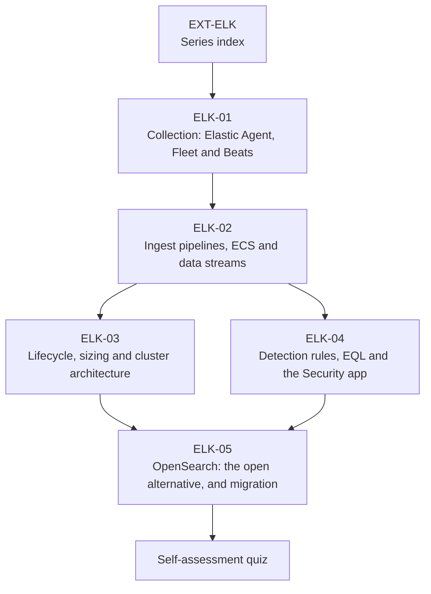

# EXT-ELK: The Elastic and OpenSearch Series — Collection, Schema, Lifecycle, Detection

> **Module type:** Extension module series (vendor-specific elective)
> **Status:** Draft
> **Version:** v0.1
> **Last Reviewed:** 2026-09-13
> **Domain Expert:** _Unassigned — required before Practitioner Approved (Elastic or OpenSearch platform / SecOps)_
> **Practitioner Reviewer:** _Unassigned — required before Practitioner Approved (must run Elastic Security or OpenSearch Security Analytics in production)_

!!! warning "This is an extension series, not credit-bearing units"
    The degree is **66 units / 160 CP** and that structure is fixed (see
    [`docs/structure.md`](../../structure.md); structural changes require the process in
    [`CONTRIBUTING.md`](../../../CONTRIBUTING.md)). EXT-ELK sits **outside** that
    structure. It carries no credit points and does not appear in
    [`docs/ksat-coverage.md`](../../ksat-coverage.md) or the
    [Program Builder](../../program-builder/index.md). If a delivery partner wants to award
    recognition for it, use the Tier 1 badge mechanism in
    [`docs/curriculum/micro-credentials-framework.md`](../../curriculum/micro-credentials-framework.md).

!!! danger "This series is deliberately vendor-specific — read the R3 note below"
    Core rule **R3** forbids vendor lock-in *in core content*. This series is Elastic
    and OpenSearch: the two platforms share an ancestry and most of a query language,
    and the series is honest about where they have diverged. See
    [Why a vendor-specific series exists](#why-a-vendor-specific-series-exists).
    **Nothing in EXT-ELK may be cited as satisfying a core-unit requirement.**

!!! note "Delivered in stages"
    Added one module per pull request, in order, on top of this index. Modules are
    linked from the table below only once their file is in the repository.

---

## Purpose

[EXT-SPL](../splunk/index.md) exists because Splunk is the SIEM a large share of
Australian enterprise and government SOCs run. Elastic is the other one — and OpenSearch,
its Apache-licensed fork, is what a growing number of organisations run when licence
terms or sovereignty requirements rule the first two out. A graduate who can only reason
about one platform's vocabulary is half-employable.

The degree already teaches everything in this series vendor-neutrally: log engineering in
[F06](../../../core/units/F06-data-log-analysis.md) and
[DE02](../../../degrees/operational/detection-engineering/DE02-data-sources-log-engineering.md),
detection logic across Sigma, SPL and KQL in
[DE03](../../../degrees/operational/detection-engineering/DE03-writing-detection-logic.md),
SIEM concepts in [OC02](../../../core/units/OC02-security-monitoring-siem.md), platform
engineering in [SE04](../../../degrees/strategic/security-engineering/SE04-detection-response-engineering.md),
and logging *architecture* — placement, sources, retention, topology — in
[SA-05](../security-architecture/sa-05-logging-and-monitoring-architecture.md).
**EXT-ELK replaces none of them.** It is the vendor-specific deep dive a graduate takes
when their employer runs Elastic or OpenSearch, and it is built so that the same lab
dataset EXT-SPL uses can be worked in both platforms.

---

## Why a vendor-specific series exists

R3 exists so that a graduate is employable at any shop, and so that no learner is priced
out of the core degree. Both hold only for **core content**. This series is bounded the
same way EXT-SPL is:

| R3 concern | How EXT-ELK is bounded |
|---|---|
| Graduates locked to one vendor | Elective and non-credit. Every concept has a vendor-neutral home in a core unit, which is the prerequisite. ELK-05 teaches the *other* implementation of the same ideas, so the learner leaves with two vocabularies, not one. |
| Learner priced out | Elastic's **Basic** tier is free, self-managed, and covers everything the labs need (Kibana, Fleet and Elastic Agent, ingest pipelines, ILM, role-based access control, TLS). OpenSearch is Apache 2.0. No exam, course or paid tier is required by any module. |
| Vendor claims taught as fact | Product behaviour is cited to Elastic's and OpenSearch's own documentation as read on 2026-09-13, and the [verification table](#verification-status) records what changes with releases. |
| Certification pressure | The certifications are listed for orientation. No module lists an exam as an outcome. |

---

## Cost and access reality

State this to learners before they start.

| Item | Cost | Notes |
|---|---|---|
| Elastic Stack, **Basic** ("Free and open") self-managed | **Free** | Kibana, Fleet and Elastic Agent, ingest pipelines, ILM, RBAC and encryption in transit are in the free tier per the subscriptions page. Distributed under the Elastic License, with selected components under SSPL or Apache 2.0. |
| Elastic **Platinum / Enterprise** features | **Paid** | Per the subscriptions page as read: searchable snapshots (frozen tier), cross-cluster replication, machine-learning anomaly detection rules, Elastic Defend endpoint protection, SAML/OIDC SSO, audit logging, and most Kibana alerting connectors. The series names each paid dependency where a topic touches it. |
| Elastic Security **detection engine and prebuilt rules** | **Verify** | Two readings on 2026-09-13: the subscriptions comparison as summarised places prebuilt rules under Platinum; the prebuilt-rules documentation states that installing, enabling and adding exceptions are "available across all subscription levels", with direct editing and update-conflict resolution at Enterprise. ELK-04 follows the more specific page, uses **custom** rules in every lab, and carries the item in its verification table. |
| Elastic Cloud (hosted) | **Paid**, with a free trial | Not required by any module. Australian regions exist; residency is discussed in ELK-03's Australian context. |
| OpenSearch and OpenSearch Dashboards, incl. Security Analytics and ISM | **Free** (Apache 2.0) | No paid tier. The series' fully open path. |
| Elastic certifications (Certified Engineer, Certified Analyst, Certified Observability Engineer, Certified SIEM Analyst) | **Paid** | Names as listed on Elastic's certification page on 2026-09-13; format, duration, prerequisites and cost are on the individual pages and are **not** reproduced here. |

!!! note "The honest summary"
    The entire series is completable at zero cost on self-managed Basic and OpenSearch.
    What money buys is the frozen tier, ML rules, endpoint protection, SSO and audit
    logging — real capabilities, each named where it matters, none required to learn
    the platform.

---

## Series structure

| Module | Title | Focus | Notional hours |
|---|---|---|---|
| [ELK-01](elk-01-collection-agent-fleet.md) | Collection: Elastic Agent, Fleet and Beats | Agent, Fleet Server, policies and integrations; managed vs standalone; the data-stream naming contract; onboarding the lab dataset | ~18 |
| [ELK-02](elk-02-ingest-pipelines-ecs-data-streams.md) | Ingest Pipelines, ECS and Data Streams | Processors, simulate and failure handling; the Elastic Common Schema and its categorisation fields; CIM ↔ ECS; templates, rollover and `@timestamp` | ~22 |
| [ELK-03](elk-03-lifecycle-sizing-cluster-architecture.md) | Lifecycle, Sizing and Cluster Architecture | ILM phases and actions, data tiers and node roles, shards and replicas, what is paid (frozen, CCR); reading Elastic's sizing guidance the way SA-05 Topic 12 reads a validated architecture | ~22 |
| [ELK-04](elk-04-detection-rules-eql-security-app.md) | Detection Rules, EQL and the Security App | The seven rule types, EQL sequences, exceptions, alerts as `event.kind: signal`, cases, MITRE tagging; Sigma to Elastic | ~22 |
| [ELK-05](elk-05-opensearch-alternative-and-migration.md) | OpenSearch: the Open Alternative, and Migration | Security Analytics (detectors, Sigma rules, findings, correlation), ISM, data streams; moving templates, pipelines and rules between the two; when to choose which | ~20 |
| [Quiz](quiz.md) | Self-assessment | 50 questions across the five modules | ~3 |
| | | | **~107 hours** |

**Suggested order.** In sequence. ELK-01 and ELK-02 are the foundation everything else
assumes; ELK-03 and ELK-04 may be taken in either order after them; ELK-05 last, because
it is written as a comparison.

---

## Mapping onto the degree

| Unit / module | Relationship to EXT-ELK |
|---|---|
| [F06 — Data & Log Analysis](../../../core/units/F06-data-log-analysis.md) | Prerequisite. Log formats, parsing and normalisation in the abstract. |
| [OC02 — Security Monitoring & SIEM](../../../core/units/OC02-security-monitoring-siem.md) | Prerequisite. The vendor-neutral SIEM pipeline and SOC operating model. |
| [DE02 — Data Sources & Log Engineering](../../../degrees/operational/detection-engineering/DE02-data-sources-log-engineering.md) | Prerequisite for ELK-02. Data modelling and normalisation; ECS is one implementation. |
| [DE03 — Writing Detection Logic](../../../degrees/operational/detection-engineering/DE03-writing-detection-logic.md) | Prerequisite for ELK-04. Sigma and KQL are taught there; ELK-04 lands them in the Security app. |
| [SE04 — Detection & Response Engineering](../../../degrees/strategic/security-engineering/SE04-detection-response-engineering.md) | Platform architecture in the abstract; ELK-03 is the Elastic-specific instance. |
| [SA-05 — Logging, Monitoring and Detection Architecture](../security-architecture/sa-05-logging-and-monitoring-architecture.md) | Decides *which* sources, *where* they flow and *how long* they are kept; ELK-01/02/03 implement those decisions on this platform. Topic 12 there is the reading method ELK-03 applies to Elastic's sizing guidance. |
| [EXT-SPL](../splunk/index.md) | The sibling series. The same lab dataset; ELK-02's CIM ↔ ECS crosswalk and ELK-05's migration topic are where the two meet. |
| [EXT-ANS](../ansible-security-automation.md) | Deploying agents and verifying telemetry at fleet scale (its Topic 8) is the automation counterpart of ELK-01. |

---

## Lab substrate

The [`labs/`](https://github.com/dev-nobytes-io/Open-source-cybersecurity-degree-australia-/tree/main/labs)
environment built for EXT-SPL supplies the data: a labelled 14-day estate across eight
indexes, with ground truth held out. EXT-ELK works the **same files** through Elastic
Agent (standalone) or Filebeat into a single-node Elasticsearch on the Basic licence, and
in ELK-05 into OpenSearch, so a learner can compare the two platforms on identical
events. The compose file arrives with ELK-01; guides in `labs/guides/elk-*.md` follow the
EXT-SPL pattern and arrive with each module.

| Status | Meaning |
|---|---|
| ✅ **Runs on Basic / OpenSearch** | Works with the lab dataset at no cost |
| 📄 **No platform needed** | Design, analysis or Python exercise |
| 💳 **Paid tier** | The platform behaviour needs Platinum or Enterprise; the guide gives the design and names the blocker |

---

## Safety, authorisation and data handling

Elastic Agent and Elastic Defend can collect from, and act on, hosts. Every lab in this
series runs against the synthetic estate or against containers you own. Do not enrol a
device you do not administer, and do not point an agent at a workplace host without
written authorisation — an agent policy is a remote-execution channel, and ELK-01 says so
in Topic 6.

---

## Verification status

Per **R5**, recorded as unverified or provisional until confirmed.

| Item | Status | Action required |
|---|---|---|
| Product behaviour cited to Elastic documentation | Verified 2026-09-13 against the linked docs pages (current-release documentation) | Re-verify at each Elastic major release; pin the stack version the labs use in the compose file |
| ECS version | Docs state **9.5.0** as of the release read | Confirm at delivery |
| Subscription tier of the Elastic Security detection engine and prebuilt rules | **Unverified** — the subscriptions comparison as read places prebuilt rules under Platinum; the Security docs defer to that page | Confirm against the live subscriptions page before scheduling ELK-04; the labs use custom rules on Basic regardless |
| Elastic certification names, formats and costs | Names verified 2026-09-13; formats and costs **not read** | Read the individual certification pages before advising a learner |
| OpenSearch Security Analytics log-type count and correlation-engine behaviour | Verified at the docs "latest" as read; version not pinned | Pin an OpenSearch version in the ELK-05 compose file |
| Elastic Cloud Australian regions and residency statements | **Unverified** in this draft | Confirm against Elastic Cloud's region list before ELK-03's Australian context is taught |
| Project-local KSAT IDs (`ELK-0n-K01` …), NICE/DCWF T-codes, SFIA levels | Provisional | Framework Custodian review; SFIA codes and ranges are the verified 2026-09-12 set used by EXT-SA |
| MITRE ATT&CK technique IDs on prebuilt rules | Provisional (v19 convention of the repo) | Framework Custodian |

---

## Further reading

- [Elastic — Fleet and Elastic Agent](https://www.elastic.co/docs/reference/fleet) — the collection layer ELK-01 is built on.
- [Elastic — Elastic Common Schema](https://www.elastic.co/docs/reference/ecs) — the schema ELK-02 maps the lab dataset onto.
- [Elastic — Ingest pipelines](https://www.elastic.co/docs/manage-data/ingest/transform-enrich/ingest-pipelines) — processors, simulate and failure handling.
- [Elastic — Data streams](https://www.elastic.co/docs/manage-data/data-store/data-streams) — the append-only store behind every integration.
- [Elastic — Index lifecycle management](https://www.elastic.co/docs/manage-data/lifecycle/index-lifecycle-management) — phases, actions and tiers for ELK-03.
- [Elastic — Create a detection rule](https://www.elastic.co/docs/solutions/security/detect-and-alert/create-detection-rule) — the seven rule types ELK-04 teaches.
- [Elastic — Subscriptions](https://www.elastic.co/subscriptions) — the free/paid boundary; read it before every module that names a paid feature.
- [OpenSearch — Security Analytics](https://docs.opensearch.org/latest/security-analytics/) — detectors, Sigma rules, findings and correlation for ELK-05.
- [OpenSearch — Index State Management](https://docs.opensearch.org/latest/im-plugin/ism/index/) — the ILM counterpart for ELK-05.
- [ASD — Best practices for event logging and threat detection](https://www.cyber.gov.au/resources-business-and-government/maintaining-devices-and-systems/system-hardening-and-administration/system-monitoring/best-practices-event-logging-threat-detection) — the Australian logging expectations every module's Australian context section is written against.

---

## Series Metadata

| Field | Value |
|---|---|
| Series Code | EXT-ELK |
| Series Title | The Elastic and OpenSearch Series — Collection, Schema, Lifecycle, Detection |
| Module Type | Extension module series (vendor-specific elective; **not** credit-bearing) |
| Modules | ELK-01 … ELK-05 + self-assessment quiz |
| Version | v0.1 |
| Status | Draft |
| Credit Points | 0 CP — outside the 160 CP degree structure |
| Notional Hours | ~107 |
| Extends | F06; OC02; DE02; DE03; SE04; SA-05 |
| Related Units | DE01, DE05, OC04, SE05, EXT-SPL, EXT-ANS |
| Prerequisites | F06 and OC02 (hard); DE02 before ELK-02; DE03 before ELK-04 |
| Domain Expert | _Unassigned — required before Practitioner Approved_ |
| Practitioner Reviewer | _Unassigned — required before Practitioner Approved_ |
| Last Reviewed | 2026-09-13 |
| Framework Version — NICE DCWF | 2023 |
| Framework Version — SFIA | SFIA 9 (2023) — codes and ranges verified 2026-09-12 |
| Framework Version — ASD CSF | 2024 |
| Bloom's Level (range) | 3–5 (Apply, Analyse, Evaluate) |
| Australian Legislation Referenced | Privacy Act 1988 (Cth); Security of Critical Infrastructure Act 2018 (Cth) |
| Tooling Licence Position | Self-managed Elastic Basic (free) and OpenSearch (Apache 2.0); paid features named, never required |
| Licence | CC BY 4.0 |
