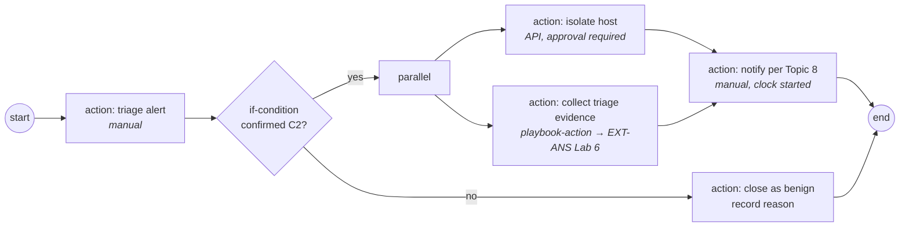

# EXT-IRP: Playbook Engineering — Vendor-Neutral Incident Response Playbooks

> **Module type:** Extension module (elective deep dive)
> **Status:** Draft
> **Version:** v0.1
> **Last Reviewed:** 2026-09-13
> **Domain Expert:** _Unassigned — required before Practitioner Approved (incident response / SOC engineering)_
> **Practitioner Reviewer:** _Unassigned — required before Practitioner Approved (must have run playbooks in a live SOC)_

!!! warning "This is an extension module, not a credit-bearing unit"
    The degree is **66 units / 168 CP** and that structure is fixed (see
    [`docs/structure.md`](../structure.md); structural changes require the
    process in [`CONTRIBUTING.md`](../../CONTRIBUTING.md)). EXT-IRP sits
    **outside** that structure as an optional deep dive that extends
    [OC04](../../core/units/OC04-incident-response-lifecycle.md) and
    [DF05](../../degrees/operational/dfir/DF05-incident-response-operations.md).
    It carries no credit points and does not appear in
    [`docs/ksat-coverage.md`](../ksat-coverage.md) or the
    [Program Builder](../program-builder/index.md). If a delivery partner wants to
    award recognition for it, use the Tier 1 badge mechanism in
    [`docs/curriculum/micro-credentials-framework.md`](../curriculum/micro-credentials-framework.md).

---

## Overview

Every SOC has playbooks. Most are a wiki page someone wrote after an incident, read by
nobody until the next one, and out of date by then. The degree teaches the incident
response lifecycle ([OC04](../../core/units/OC04-incident-response-lifecycle.md)), its
operation under pressure with Australian notification obligations
([DF05](../../degrees/operational/dfir/DF05-incident-response-operations.md)), the
automation decision boundary ([EXT-ANS](ansible-security-automation.md) Topic 6) and one
vendor's playbook tooling ([EXT-SPL SPL-05](splunk/spl-05-soar.md)). What none of them
teaches is the playbook as an **engineered artefact**: a document with a defined
structure, written from the incident response plan, tested before it is trusted,
versioned, shared, and — where it is safe — executed by a machine.

This module teaches that craft, vendor-neutrally, on an open standard. **CACAO Security
Playbooks v2.0** (OASIS, Committee Specification 01, November 2023) defines a playbook as
"a workflow for security orchestration containing a set of steps (security actions) to be
performed based on a logical process", serialised as JSON so that "shared playbooks may
be immediately actionable" — or adapted — across organisations and tools. Its eight
playbook types, its workflow-step model (start, end, action, playbook-action, parallel,
if/while/switch), its agents, targets and commands, and its data markings and signatures
give a playbook the same discipline the degree already applies to detections: structure,
tests, version control, review.

Around the standard, the module teaches where playbooks come from — **NIST SP 800-61
Revision 3** (April 2025), which recasts incident response as "a CSF 2.0 Community
Profile" to be incorporated "throughout ... cybersecurity risk management activities",
and the organisation's cyber incident response plan — how a playbook's **decision
points** and **automation boundary** are chosen, how a playbook is **tested** from
tabletop to drill to automated execution, how it is **measured**, and what an
Australian organisation must build into it (ASD reporting, SOCI and NDB notification
clocks, evidence handling).

It does **not** teach the IR lifecycle or PICERL execution (OC04, DF05), forensics
(DF02–DF04), the automation taxonomy (EXT-ANS Topic 6) or any SOAR product (SPL-05).
Primary sources: the CACAO Security Playbooks v2.0 specification and the NIST SP 800-61r3
publication page, both read on 2026-09-13; the lab dataset's scenarios for the worked
playbooks.

---

## Where This Module Fits

| Unit / module | Relationship |
|---|---|
| [OC04 — Incident Response Lifecycle](../../core/units/OC04-incident-response-lifecycle.md) | **Prerequisite.** The lifecycle a playbook operates inside; its Lab 1 tabletop is the first test in Topic 6. |
| [DF05 — Incident Response Operations](../../degrees/operational/dfir/DF05-incident-response-operations.md) | **Prerequisite.** PICERL execution, Australian notification obligations, case management and decision logging — the playbook encodes them. |
| [EXT-ANS Topic 6 / Lab 5](ansible-security-automation.md) | The automated-response taxonomy and the guarded containment playbook; EXT-IRP's Topic 5 is the decision that precedes them. |
| [EXT-SPL SPL-05](splunk/spl-05-soar.md) | One vendor's playbook development; EXT-IRP is the vendor-neutral artefact a SOAR playbook implements. |
| EXT-ELK ELK-04 *(separate series, in review)* | Alerts and cases as playbook triggers and records on another platform. |
| [SA-06 — Assurance, Capability Maturity and System Authorisation](security-architecture/sa-06-assurance-maturity-and-authorisation.md) | Playbooks are evidence of preparedness in the assurance pack. |
| [OC05 — Threat Intelligence Fundamentals](../../core/units/OC05-threat-intelligence-fundamentals.md) | Sharing playbooks as an intelligence product (CACAO's notification type). |

---

## Prerequisites

- [OC04 — Incident Response Lifecycle](../../core/units/OC04-incident-response-lifecycle.md) (hard)
- [DF05 — Incident Response Operations](../../degrees/operational/dfir/DF05-incident-response-operations.md) (hard)
- [EXT-ANS](ansible-security-automation.md) Topic 6 (recommended before Topic 5 here)
- Familiarity with JSON

---

## Learning Outcomes

On completion, a learner can:

1. **Explain** the CACAO playbook model — types, workflow steps, agents, targets,
   commands, markings, signatures — and **relate** it to the incident response plan and
   lifecycle it serves.
2. **Derive** a set of required playbooks from an incident response plan and a threat
   model, and **justify** their scope and triggers.
3. **Construct** a playbook with explicit decision points, preconditions, evidence
   requirements, hand-offs and exit criteria, serialised as valid CACAO JSON.
4. **Analyse** each step of a playbook against the automation decision boundary and
   **specify** which steps a machine may execute, with what guards and approvals.
5. **Evaluate** a playbook through tabletop, drill and execution, and **revise** it from
   the findings.
6. **Assess** a playbook programme — versioning, sharing, metrics, Australian
   obligations — and **recommend** improvements.

> Bloom's 2–6, weighted to 3–5; see [`docs/content-standards.md`](../content-standards.md).

---

## AQF Level 7 Alignment

Requires design of a structured artefact from requirements, analysis of automation risk,
evaluation through testing, and communication of a programme recommendation — the
application, analysis and judgement descriptors at Level 7.

> Notional; EXT-IRP is not credit-bearing and has not been assessed through
> [`docs/compliance/aqf-teqsa.md`](../compliance/aqf-teqsa.md).

---

## Framework Mappings

> **Provisional pending Framework Custodian review.** These do **not** feed
> [`docs/ksat-coverage.md`](../ksat-coverage.md).

### NIST NICE DCWF

| Version | Work Role | Code | T-Code | Task | Demonstrated in |
|---|---|---|---|---|---|
| 2023 | Cyber Defense Incident Responder | PR-CIR-001 | T0041 | (paraphrase) Coordinate and provide expert technical support to resolve incidents | Lab 2, Summative |
| 2023 | Cyber Defense Incident Responder | PR-CIR-001 | T0233 | (paraphrase) Track and document incidents from detection through resolution | Lab 2 |
| 2023 | Cyber Defense Incident Responder | PR-CIR-001 | T0510 | (paraphrase) Develop and maintain incident response procedures and playbooks | Lab 1, Lab 3, Summative |
| 2023 | Cyber Defense Infrastructure Support | PR-INF-001 | T0335 | (paraphrase) Build and maintain the automation that executes playbook steps | Lab 3 |

### SFIA 9

| Skill | Code | Level | Demonstrated in |
|---|---|---|---|
| Information security | SCTY | Level 4 | Labs 1–3, Summative |
| Business process improvement | BPRE | Level 4 | Topic 7, Summative |
| Methods and tools | METL | Level 4 | Lab 1, Lab 3 |
| Requirements definition and management | REQM | Level 4 | Topic 3, Lab 1 |

### ASD Cyber Skills Framework

| Domain | Sub-domain | Proficiency | Demonstrated in |
|---|---|---|---|
| Defensive Operations | Incident Response | Practitioner–Advanced | Labs 1–3, Summative |
| Defensive Operations | Security Orchestration & Automation | Practitioner | Topic 5, Lab 3 |

### NICE/DCWF KSATs

| Type | ID | Statement | Demonstrated in |
|---|---|---|---|
| Knowledge | EXT-IRP-K01 | Knowledge of the CACAO playbook model: types, workflow steps, agents, targets, commands, markings, signatures | Topic 2; Lab 1 |
| Knowledge | EXT-IRP-K02 | Knowledge of how playbooks derive from the incident response plan and SP 800-61r3's CSF-aligned framing | Topic 3 |
| Knowledge | EXT-IRP-K03 | Knowledge of playbook anatomy: trigger, preconditions, decision points, evidence, hand-offs, exit criteria | Topic 4; Lab 1 |
| Knowledge | EXT-IRP-K04 | Knowledge of the automation decision boundary as applied per step | Topic 5; Lab 3 |
| Knowledge | EXT-IRP-K05 | Knowledge of playbook testing modes and metrics | Topics 6–7; Lab 2 |
| Knowledge | EXT-IRP-K06 | Knowledge of Australian reporting and notification obligations as playbook steps | Topic 8; Lab 1 |
| Skill | EXT-IRP-S01 | Skill in authoring a valid CACAO JSON playbook with explicit decision points | Lab 1 |
| Skill | EXT-IRP-S02 | Skill in executing a manual playbook against real telemetry and logging decisions and evidence | Lab 2 |
| Skill | EXT-IRP-S03 | Skill in converting a step to guarded automation with approval | Lab 3 |
| Ability | EXT-IRP-A01 | Ability to decide which steps may be automated and defend the boundary | Topic 5; Lab 3; Summative |
| Ability | EXT-IRP-A02 | Ability to revise a playbook from tabletop and drill findings | Lab 2; Summative |
| Ability | EXT-IRP-A03 | Ability to build notification clocks and reporting into a playbook so they cannot be missed under pressure | Topic 8; Lab 1 |
| Task | T0510 | (paraphrase) Develop and maintain incident response procedures and playbooks | Lab 1, Lab 3, Summative |

---

## Module Structure

| Part | Topics | Labs | Notional hours |
|---|---|---|---|
| A — Why engineer playbooks; the CACAO model | 1–2 | — | 4 |
| B — From plan to playbook; anatomy | 3–4 | 1 | 6 |
| C — The automation boundary | 5 | 3 | 4 |
| D — Testing, measuring, sharing | 6–7 | 2 | 5 |
| E — Australian obligations | 8 | 1 | 3 |
| | | | **~22 hours** |

---

## Topics

### Topic 1: The Playbook as an Engineered Artefact

A playbook is not documentation of what an analyst did; it is a specification of what an
analyst — or a machine — will do, under stated conditions, with stated evidence, to a
stated end. Treated that way it has the properties the degree already demands of
detections: a structure others can read, tests that show it works, a version history,
and a review path. Treated the other way it is a wiki page.

CACAO's definition carries the engineering stance: a workflow "containing a set of steps
(security actions) to be performed based on a logical process", executed "ad-hoc,
periodically, or triggered by automated/manual events", providing "guidance on how to
address a certain security event, incident, problem, attack, or compromise". The
standard exists so that this can be done "in a structured and standardized way across
organizational boundaries and technological solutions" — which is also the reason a
degree can teach it without choosing a vendor.

| A wiki page | An engineered playbook |
|---|---|
| Prose steps, implicit order | Explicit workflow: sequence, branches, parallel paths |
| "Escalate if serious" | A decision point with a stated condition and both outcomes |
| Assumes tooling | Agents and targets declared; commands typed |
| Edited in place | Versioned, signed, with a changelog |
| Read after the incident | Tested before it, at three levels (Topic 6) |

### Topic 2: The CACAO Model

CACAO v2.0 defines **eight playbook types**: investigation, detection, mitigation,
remediation, prevention, notification, attack and engagement. The first six are the
defender's; attack playbooks orchestrate "penetration testing and adversarial emulation"
(the CE major's territory), engagement covers denial and deception.

A playbook has six structural components — metadata, workflow, agent and target
definitions, extensions, data markings, and digital signatures — and its workflow is a
graph of typed **steps**:

| Step type | Role |
|---|---|
| `start`, `end` | Boundaries of the workflow |
| `action` | Executable commands against targets, run by agents |
| `playbook-action` | Invokes another playbook — composition, the way ELK-02 composes pipelines |
| `parallel` | Branches run simultaneously (collect evidence while containing) |
| `if-condition`, `while-condition`, `switch-condition` | Control flow — the decision points of Topic 4 |

**Agents** execute commands; **targets** are what is acted on; **commands** are typed
(the specification lists shell, PowerShell, HTTP API and manual among others), so a
manual step and an API call are the same object with a different `type` — which is what
makes Topic 5's per-step automation decision expressible in the artefact itself. Data
markings (TLP among them) and signatures make a playbook shareable with its handling
rules and provenance attached.

### Topic 3: Where Playbooks Come From

SP 800-61r3 — "Incident Response Recommendations and Considerations for Cybersecurity
Risk Management: A CSF 2.0 Community Profile", April 2025, superseding the 2012 Revision
2 — reframes incident response as something incorporated "throughout ... cybersecurity
risk management activities" rather than a standalone function. The consequence for
playbooks is that they are derived, not invented: the incident response plan states the
organisation's incident categories, roles, escalation and obligations; the threat model
(OC05's PIRs, DE01's coverage) states which incidents are expected; the playbook set is
the intersection.

The derivation, as a table the learner completes in Lab 1:

| Input | What it contributes to the playbook set |
|---|---|
| Incident response plan (the organisation's CIRP) | Categories and severities; roles and authorities; escalation paths; communications; notification obligations |
| Threat model / PIRs | Which scenarios warrant a dedicated playbook (the lab's eight are a starting set) |
| Detection coverage (DE05, ELK-04 Topic 6) | Which triggers exist — a playbook with no rule that fires it is aspirational |
| Capability register (SA-06) | Which actions are possible: is there an isolation capability, an EDR, a SOAR? |
| Legal and regulatory register (DF05 Topic 3) | The clocks and reports that must appear as steps |

A useful test of a playbook set: every incident category in the plan has at least one,
every playbook has a trigger that exists, and no two playbooks disagree about who
decides what.

### Topic 4: Anatomy of a Good Playbook

Eight parts, in the order an analyst under pressure needs them:

| Part | Content | Failure when missing |
|---|---|---|
| **Trigger** | The alert, report or condition that starts it, by name | The playbook is never invoked, or invoked for the wrong thing |
| **Preconditions** | What must already be true or known (asset criticality, access, authority) | Steps fail mid-way and the analyst improvises |
| **Decision points** | Each branch with its condition, evidence needed to decide, and default when evidence is unavailable | "Escalate if serious" — decided differently every time |
| **Actions** | Typed (manual / automated), with the agent, target and expected result | Ambiguity about who does it and how you know it worked |
| **Evidence** | What is captured at each step, where it goes, chain-of-custody note | Nothing survives to the post-incident review or a court |
| **Hand-offs** | To whom, with what, when — including to the case (ELK-04 Topic 8, DF05 Topic 4) | Work is lost between shifts and teams |
| **Notifications** | The clocks and recipients from Topic 8, as steps with start times | Obligations missed under pressure |
| **Exit criteria** | What "done" is, and the post-incident review trigger | Playbooks run forever or end early |

The decision-point discipline is the heart of it. A decision point states the question,
the evidence that answers it, where that evidence comes from (a query, a person, a
system), the outcome for each answer, and — the part usually missing — what to do when
the evidence cannot be obtained in the time available. That default is the playbook's
risk appetite made explicit.

### Topic 5: The Automation Boundary, Per Step

EXT-ANS Topic 6 gives the taxonomy of automated response actions and the decision
boundary; SPL-05 Topic 4 gives a vendor's view of the same. This module applies the
boundary to each step of a playbook rather than to the playbook as a whole, because the
right answer differs step by step: collecting triage evidence is reversible and cheap to
automate; isolating a domain controller is neither.

| Question for each step | If yes | If no |
|---|---|---|
| Is the action reversible within minutes? | Candidate for automation | Manual, or automated with mandatory approval |
| Is the evidence for the preceding decision machine-verifiable? | Automate the decision too | A human makes the decision; the machine may execute the action |
| Is the blast radius bounded (one host, one account)? | Automate with guards (EXT-ANS Lab 5's pattern) | Manual |
| Would a false positive here cause an outage or a notification? | Approval step before execution | Automate |

In CACAO the result is written into the artefact: a step's command `type` is `manual` or
an API call; an approval is an `action` step with a manual command that gates the next;
guards and rollback are steps, not comments. Lab 3 converts one step and writes the
guards.

### Topic 6: Testing — Tabletop, Drill, Execution

A playbook is tested at three levels, and each finds a different class of defect:

| Level | What runs | Finds |
|---|---|---|
| **Tabletop** (OC04 Lab 1) | People talk through the playbook against a scenario | Missing decision points, unclear authority, wrong assumptions about capability |
| **Drill** | People execute the manual steps against real (or the lab's synthetic) telemetry, with a clock | Steps that cannot be done in the time; evidence that cannot be found; hand-offs that fail |
| **Execution** | Automated steps run against a controlled target (EXT-ANS Lab 5's containers; DE04's simulation) | Guards that do not hold; rollback that does not; approvals that are bypassed |

Every test produces revisions; a playbook that has never been revised has never been
tested. Lab 2 is a drill against the lab dataset's beacon scenario, timed, with the
decisions logged the way DF05 Topic 4 asks.

### Topic 7: Measuring, Versioning and Sharing

Metrics a playbook programme should carry, and what each is for:

| Metric | Use |
|---|---|
| Time from trigger to first decision, and to containment, per playbook | Whether the playbook shortens response, and where it stalls |
| Decision points resolved with the default (evidence unavailable) | Where telemetry or access is missing — feeds SA-05 Lab 2's register |
| Steps executed by machine vs by hand, and approvals granted vs refused | Whether the automation boundary is right |
| Revisions per test | Whether testing is real |

Versioning follows the detection-as-code pattern: JSON in a repository, schema-validated,
reviewed, with a changelog and a signature on release. Sharing is what CACAO was built
for — a playbook can leave the organisation with its TLP marking and signature attached,
which makes it a threat-intelligence product (OC05) as much as an operational one: the
notification type exists precisely to disseminate "information and playbooks about
threats".

### Topic 8: Australian Obligations as Playbook Steps

Three clocks and one reporting relationship belong inside any Australian organisation's
playbooks, as steps with a start time, not as a paragraph in the plan:

| Obligation | Who | Playbook step |
|---|---|---|
| Notifiable Data Breaches scheme — Privacy Act 1988 (Cth) | Entities covered by the Act | An assessment step with its own clock once personal information is plausibly involved; the notification decision as a recorded decision point (DF05 Topic 3) |
| Mandatory cyber incident reporting — Security of Critical Infrastructure Act 2018 (Cth) | Responsible entities for critical infrastructure assets | The reporting step with the statutory window recorded as a clock from the time the entity became aware; the case creation time (ELK-04 Topic 8) is the evidence of awareness |
| Reporting to ASD | Any organisation; expected of Commonwealth entities | A notification step to ASD's reporting channel, with what is provided; ASD's incident response guidance and readiness material are the reference |
| Evidence handling | Everyone | Chain-of-custody steps (OC04 Topic 4) so the playbook's evidence survives a regulator's or a court's scrutiny |

The statutory periods themselves are taught in DF05 Topic 3 and are not restated here;
the engineering point is that a clock the playbook does not start is a clock the
organisation will miss.

!!! warning "Verify the obligations before teaching this topic"
    Statutory reporting windows and the ASD guidance titles referenced above are
    recorded in the [verification table](#verification-status); the ASD pages were not
    retrievable on the authoring date.

---

## Labs & Exercises

### Lab 1 📄: Derive the Set, Write One Playbook

**Objective:** Derive the playbook set for the lab estate from its inputs, then author one
full playbook — the DGA beacon — as valid CACAO v2.0 JSON with every Topic 4 part.

**Prerequisites:** Topics 2–4, 8; the lab dataset's scenario list (`labs/docs/data-model.md`).

**Environment:** A text editor and a JSON validator (any free one). No platform required.

**Instructions:**
1. Build the Topic 3 derivation table for the lab estate: assume a plan with four
   incident categories (malware/C2, credential compromise, data exfiltration, insider),
   the eight scenarios as the threat model, the DE/ELK-04 rules as triggers, and a
   capability register with EDR isolation and no SOAR.
2. List the playbooks the intersection requires, each with its CACAO type and trigger.
   Mark any scenario with no trigger.
3. Author the beacon playbook in CACAO JSON: metadata, workflow with at least two
   decision points and one parallel step, agents and targets, typed commands (all
   `manual` at this stage), a TLP marking. Include the Topic 8 notification steps with
   their clocks.
4. Validate the JSON. Write the one-paragraph "default when evidence is unavailable"
   for each decision point.

**Expected output:** The derivation table; the playbook set list; the beacon playbook
JSON; the decision-point defaults. Marked on structure and completeness, not on the
specific tactical choices.

**Reflection questions:**
1. Which scenario had no trigger, and what does that say about the detection programme?
2. Which decision point's default was hardest to write, and whose risk appetite did you encode?
3. What in your playbook would you not share outside the organisation, and what marking says so?

### Lab 2 ✅: Drill It Against Real Telemetry

**Objective:** Execute the Lab 1 playbook manually against the lab dataset, timed, with
every decision and its evidence logged.

**Prerequisites:** Lab 1; Topic 6; a platform with the lab dataset loaded (EXT-SPL's
Splunk Free or EXT-ELK's Basic-tier compose).

**Environment:** `labs/` dataset in either platform; a stopwatch; the DF05 decision-log
template.

**Instructions:**
1. Start the clock at the beacon alert (SPL-03 Lab 7 or ELK-04 Lab 2 supplies it).
2. Execute each step as written. For each decision point, record the evidence query, the
   evidence found, the decision, and the time. Where evidence cannot be found, apply the
   default and record that too.
3. Perform the "isolate host" step as a simulated action (record what would be sent to
   the EDR) and the evidence-collection step for real (queries over DNS, firewall and
   proxy for the beacon host).
4. Stop the clock at exit criteria. Compute time-to-first-decision and time-to-containment.
5. Revise the playbook from what the drill found: at least one decision point, one
   evidence source and one hand-off should change. Bump the version and write the changelog.

**Expected output:** The timed decision log; the two metrics; the revised playbook with
changelog.

**Reflection questions:**
1. Which step took longest, and was it the playbook or the platform?
2. Which default did you apply, and what would it have cost if the missing evidence had said the opposite?

### Lab 3 ✅/📄: Move One Step Across the Boundary

**Objective:** Convert the evidence-collection step (and, if EXT-ANS Lab 5 has been
done, the isolation step) from manual to guarded automation, with approval, and encode it
in the playbook.

**Prerequisites:** Lab 2; Topic 5; EXT-ANS Topic 6 (Lab 5 optional).

**Environment:** As Lab 2; EXT-ANS's container estate if automating containment.

**Instructions:**
1. Apply the Topic 5 questions to every step of the revised playbook. Record the answers.
2. Convert the evidence-collection step: replace its `manual` command with an API or
   shell command (a saved query or a script), add a guard step that checks the target is
   the expected host, and a step that writes the collected evidence to the case with a
   hash.
3. *(if EXT-ANS Lab 5 is available)* Convert the isolation step with an approval step
   before it, a scope guard and a rollback path, exactly as EXT-ANS's pattern.
4. Execute the automated step(s) in the lab and show the guard refusing a wrong target.
5. Write the boundary statement: which steps are automated, which need approval, which
   stay manual, and why — one paragraph an approver could sign.

**Expected output:** The per-step boundary table; the revised JSON; execution evidence
including the refused guard; the boundary statement.

**Reflection questions:**
1. Which manual step did you most want to automate and could not justify?
2. Who approves the isolation, and how long may the playbook wait for them before the default applies?

---

## Assessment

### Formative 1: Read the Workflow

A CACAO playbook with two defects (a decision point with no default; an automated
irreversible action with no approval); find both and state the fix. Maps to LO1, LO4.

### Formative 2: Derive or Discard

Ten candidate playbooks for a stated plan and threat model; keep, merge or discard each
with a one-line reason. Maps to LO2.

### Summative: The Playbook Pack

For the lab estate: (1) the derivation table and playbook set; (2) three playbooks as
CACAO JSON (the beacon, the password spray, the exfiltration) with all Topic 4 parts and
Topic 8 steps; (3) drill logs and metrics for one; (4) the automation boundary table and
one automated step with guards; (5) a one-page programme note covering versioning,
sharing markings, metrics and the Australian obligations. Maps to LO1–LO6.

| Criterion | Exemplary | Proficient | Developing | Beginning |
|---|---|---|---|---|
| Derivation and set | Every category and scenario covered; triggers real; gaps named | Covered; a gap or two unstated | Partial set | Ad hoc list |
| Playbook artefacts | Valid JSON; every part present; decision defaults written; markings and clocks in | Valid; most parts | Prose with some structure | Prose only |
| Testing and revision | Drill timed and logged; revisions traceable to findings | Drill done; some revisions | Tabletop only | Untested |
| Automation boundary | Per-step reasoning; guards and approvals executed and shown | Reasoning present; partial execution | Boundary asserted | Absent |
| Programme note | Versioning, sharing, metrics and obligations all addressed | Three of four | Two | Absent |

| Assessment task | Learning outcomes addressed |
|---|---|
| Formative 1 | LO1, LO4 |
| Formative 2 | LO2 |
| Summative | LO1, LO2, LO3, LO4, LO5, LO6 |

---

## Australian Context

Topic 8 is the Australian context of this module: the Notifiable Data Breaches scheme
under the Privacy Act 1988 (Cth), mandatory cyber incident reporting for responsible
entities under the Security of Critical Infrastructure Act 2018 (Cth), and reporting to
ASD are built into playbooks as steps with clocks, because the failure mode of every
obligation is the same — nobody started the clock. DF05 Topic 3 teaches the obligations;
this module teaches where in the artefact they live so they cannot be forgotten at 3 am.

ASD publishes incident response guidance for Australian organisations, including plan
and readiness material, and the module directs learners to it for the plan a playbook
set is derived from; the specific titles and their current contents are recorded as items
to verify below because the pages could not be retrieved on the authoring date. Evidence
handling in every playbook follows OC04 Topic 4 so that what a playbook collects is
usable by the AFP, a regulator or a court.

---

## Verification Status

| Item | Status | Action required |
|---|---|---|
| CACAO v2.0: definition, eight types, six components, step types, agents/targets/commands, JSON, markings and signatures; CS01 27 November 2023 | Verified 2026-09-13 against the OASIS specification page | Check for a later Committee Specification or OASIS Standard |
| NIST SP 800-61r3 title, April 2025, CSF 2.0 Community Profile framing, supersedes r2 | Verified 2026-09-13 against the NIST publication page | Read the full document before Topic 3 is taught in depth; the module cites only its framing |
| ASD incident response guidance titles (plan, readiness checklist) and reporting channel | **Unverified** — cyber.gov.au did not respond on the authoring date | Confirm titles and URLs |
| Statutory reporting windows (NDB, SOCI) | Not restated here; taught in DF05 | Confirm DF05 is current |
| CACAO command types beyond those listed (shell, PowerShell, HTTP API, manual) | Partial | Confirm the full list in the specification |
| NICE T-codes (paraphrased), SFIA levels, ASD CSF sub-domains, KSAT IDs | Provisional | Framework Custodian |

---

## Further Reading

**OASIS (2023).** *CACAO Security Playbooks Version 2.0, Committee Specification 01.* https://docs.oasis-open.org/cacao/security-playbooks/v2.0/security-playbooks-v2.0.html
> Relevance: the playbook model this module is built on; Lab 1's JSON follows it.

**NIST (2025).** *SP 800-61 Rev. 3, Incident Response Recommendations and Considerations for Cybersecurity Risk Management: A CSF 2.0 Community Profile.* https://csrc.nist.gov/pubs/sp/800/61/r3/final
> Relevance: where playbooks come from — incident response inside risk management — Topic 3.

**ASD.** *Incident response guidance.* https://www.cyber.gov.au/resources-business-and-government/governance-and-user-education/incident-response
> Relevance: the Australian plan, readiness and reporting material Topic 8 points to (titles to verify).

**OAIC.** *Notifiable Data Breaches scheme.* https://www.oaic.gov.au/privacy/notifiable-data-breaches
> Relevance: the assessment and notification obligation encoded as playbook steps.

**Open-source degree (2026).** *EXT-ANS Topic 6 — Automated Response Actions: Taxonomy and Decision Boundary; Lab 5 — Automated Containment with Guards and Rollback.* [ansible-security-automation.md](ansible-security-automation.md)
> Relevance: the taxonomy Topic 5 applies per step; the guarded containment Lab 3 reuses.

**Open-source degree (2026).** *DF05 — Incident Response Operations.* [DF05-incident-response-operations.md](../../degrees/operational/dfir/DF05-incident-response-operations.md)
> Relevance: PICERL execution, notification obligations and decision logging that the playbook encodes.

**Open-source degree (2026).** *EXT-SPL SPL-05 — SOAR & Security Automation.* [spl-05-soar.md](splunk/spl-05-soar.md)
> Relevance: one vendor's implementation of the artefact this module specifies.

---

## Module Metadata

| Field | Value |
|---|---|
| Module Code | EXT-IRP |
| Module Title | Playbook Engineering — Vendor-Neutral Incident Response Playbooks |
| Module Type | Extension module (elective; **not** credit-bearing) |
| Version | v0.1 |
| Status | Draft |
| Credit Points | 0 CP — outside the 168 CP degree structure |
| Notional Hours | ~22 |
| Extends | OC04; DF05; EXT-ANS (Topic 6, Lab 5) |
| Related Units | OC05, DE04, DE05, SA-06, EXT-SPL SPL-05, EXT-ELK ELK-04 |
| Prerequisites | OC04, DF05 (hard); EXT-ANS Topic 6 recommended |
| Domain Expert | _Unassigned — required before Practitioner Approved_ |
| Practitioner Reviewer | _Unassigned — required before Practitioner Approved_ |
| Last Reviewed | 2026-09-13 |
| Framework Version — NICE DCWF | 2023 |
| Framework Version — SFIA | SFIA 9 (2023) |
| Framework Version — ASD CSF | 2024 |
| Bloom's Level (range) | 2–6 (weighted 3–5) |
| Australian Legislation Referenced | Privacy Act 1988 (Cth) — Notifiable Data Breaches scheme; Security of Critical Infrastructure Act 2018 (Cth) |
| Tooling Licence Position | No platform required for Lab 1; Labs 2–3 use the free lab estate (Splunk Free or Elastic Basic) and EXT-ANS's containers |
| Licence | CC BY 4.0 |
