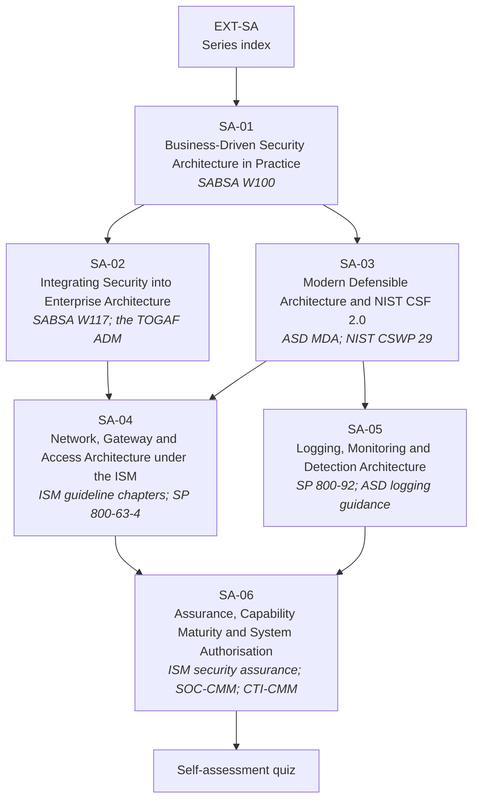

# EXT-SA: The Security Architecture Series — Method, Structure & Assurance

> **Module type:** Extension module series (method-and-practice elective)
> **Status:** Draft
> **Version:** v0.1
> **Last Reviewed:** 2026-09-12
> **Domain Expert:** _Unassigned — required before Practitioner Approved (practising security or enterprise architect)_
> **Practitioner Reviewer:** _Unassigned — required before Practitioner Approved (must have taken a system through authorisation under the ISM)_

!!! warning "This is an extension series, not credit-bearing units"
    The degree is **66 units / 168 CP** and that structure is fixed (see
    [`docs/structure.md`](../../structure.md); structural changes require the process in
    [`CONTRIBUTING.md`](../../../CONTRIBUTING.md)). EXT-SA sits **outside** that
    structure. It carries no credit points and does not appear in
    [`docs/ksat-coverage.md`](../../ksat-coverage.md) or the
    [Program Builder](../../program-builder/index.md), both of which are generated from
    credit-bearing units only. If a delivery partner wants to award recognition for it,
    use the Tier 1 badge mechanism in
    [`docs/curriculum/micro-credentials-framework.md`](../../curriculum/micro-credentials-framework.md).

!!! danger "The degree already teaches security architecture — read this before starting"
    [SC02](../../../core/units/SC02-security-architecture.md) and
    [SE02](../../../degrees/strategic/security-engineering/SE02-security-architecture.md)
    are both called *Security Architecture*, and
    [SE01](../../../degrees/strategic/security-engineering/SE01-secure-system-design.md)
    and [SE06](../../../degrees/strategic/security-engineering/SE06-capstone-architecture-design.md)
    surround them. **EXT-SA does not replace, repeat, or compete with any of them.**
    It goes deeper into the *practice* of business-driven architecture, sideways into
    *enterprise* integration and national reference guidance, and downward into the
    *structural* decisions — network, gateway, access, logging — that the ISM expects an
    architecture to make, then forward into *assurance* and *authorisation*. See
    [What this series is not](#what-this-series-is-not).

!!! note "Delivered in stages"
    This series is being added over several pull requests, in module order, on top of
    this index. **SA-01 is present.** SA-02 to SA-06 and the self-assessment quiz are
    listed below as planned; each is linked from this page only once its file is in the
    repository, so that the site build stays free of dangling links.

---

## Purpose

The degree teaches a graduate how to *choose* a security architecture. It teaches SABSA,
Zero Trust, reference architectures and NIST SP 800-160, and it assesses them by asking
the learner to design a system.

That is roughly the first half of the job. The other half is the part practising
architects spend most of their week on, and which is rarely taught. EXT-SA covers it in
six modules, each built on a small set of named primary documents:

- **Running the SABSA method, not reciting it** (SA-01, from SABSA white paper W100) —
  building a business attributes profile with real stakeholders, giving each attribute a
  metric and a threshold, keeping the chain from driver to control to measure alive as a
  working register, operating the lifecycle as a rhythm, and running a practice through a
  blueprint, a road-map and an Architecture Board.
- **Landing security inside an enterprise architecture function** (SA-02, from SABSA
  white paper W117) — one that already runs the TOGAF Architecture Development Method, has
  a repository and a board, and has its own opinions about where security work belongs.
- **Using national reference guidance as an architecture input** (SA-03, from ASD's
  *Investing in modern defensible architecture* and NIST CSF 2.0, CSWP 29) — deriving
  architecturally significant requirements from the MDA Foundations and from CSF 2.0
  profiles and tiers, and sequencing investment, rather than treating either as a
  compliance checklist.
- **Making the structural decisions the ISM expects** (SA-04, from the ISM guideline
  chapters on networking, gateways and system access, with NIST SP 800-63-4 assurance
  levels as boundary inputs) — segmentation and segregation, gateway and cross-domain
  boundaries, and the access assurance a boundary demands.
- **Deciding where logging lives** (SA-05, from NIST SP 800-92 and ASD's event-logging,
  priority-log and SIEM/SOAR guidance) — which sources, where they are generated,
  forwarded and retained, and in what topology, leaving platform engineering to the units
  that already teach it.
- **Getting it assured and authorised** (SA-06, from the ISM *Guidelines for security
  assurance*, SOC-CMM, CTI-CMM and the Threat Hunting Maturity Model) — what capability
  maturity models actually measure, and what the system-authorisation process asks of the
  system owner and the architect.

EXT-SA is the series a graduate takes when they have been made an architect and
discovered that the design was the easy part.

---

## What this series is not

This table is the scope contract for the series. If a topic appears in the left column,
EXT-SA treats it as **assumed prior knowledge** and links to it rather than re-teaching it.

| Already taught in the degree | Where | EXT-SA relationship |
|---|---|---|
| What security architecture is; principles and patterns; SABSA introduction | [SC02](../../../core/units/SC02-security-architecture.md) T1–T3 | Assumed. SA-01 starts from "you have been asked to build the attributes profile" and goes forward into practice. |
| Applied SABSA; architecture maturity and governance | [SE02](../../../degrees/strategic/security-engineering/SE02-security-architecture.md) T1, T6 | Assumed. SA-02 covers only the **integration problem** with the TOGAF ADM. SA-06 maturity is *capability* maturity (SOC, CTI, hunting), not architecture-programme maturity. |
| Zero Trust architecture | [SC02](../../../core/units/SC02-security-architecture.md) T4; [SE02](../../../degrees/strategic/security-engineering/SE02-security-architecture.md) T2 | Assumed. SA-03 relates it to ASD's Modern Defensible Architecture foundations; it is not re-taught. |
| Cloud security architecture; reference architectures | [SE02](../../../degrees/strategic/security-engineering/SE02-security-architecture.md) T3–T4; [SE05](../../../degrees/strategic/security-engineering/SE05-security-cloud-devsecops.md) | Assumed. SA-04 works from the ISM guideline text rather than from vendor reference architectures. |
| Threat modelling as design; NIST SP 800-160 | [SE01](../../../degrees/strategic/security-engineering/SE01-secure-system-design.md) T3, T5 | Assumed. |
| Identity and access management | [SE03](../../../degrees/strategic/security-engineering/SE03-identity-access-management.md) | Assumed. SA-04 uses NIST SP 800-63-4 assurance levels only as *architectural inputs* to a boundary. |
| NIST CSF 2.0 Govern function; applying CSF 2.0 for compliance; assessing the Essential Eight | [GR01](../../../degrees/strategic/grc/GR01-security-governance-design.md) T2; [GR03](../../../degrees/strategic/grc/GR03-compliance-frameworks.md) T3–T4 | Assumed. SA-03 uses CSF 2.0 profiles and tiers as *architecture* inputs, not as a compliance programme; SA-06 does not assess the Essential Eight. |
| SIEM architecture and pipelines; detection engineering; SOC operating model | [OC02](../../../core/units/OC02-security-monitoring-siem.md); [SE04](../../../degrees/strategic/security-engineering/SE04-detection-response-engineering.md) | Assumed. SA-05 decides *which* sources, *where* they flow and *how long* they are kept; platform engineering stays in SE04 and [EXT-SPL](../splunk/index.md). |
| Technique-to-data-source mapping and coverage auditing | [DE02](../../../degrees/operational/detection-engineering/DE02-data-sources-log-engineering.md) | Assumed. SA-05 links DE02 rather than re-teaching coverage scoring. |
| Audit, control testing, IRAP as an assurance activity | [GR05](../../../degrees/strategic/grc/GR05-audit-assurance.md) | Assumed. SA-06 takes the *system owner's* side of authorisation, not the auditor's. |
| Australian regulatory environment; risk management frameworks | [GR04](../../../degrees/strategic/grc/GR04-australian-regulatory-environment.md); [SC01](../../../core/units/SC01-risk-management-frameworks.md); [GR02](../../../degrees/strategic/grc/GR02-risk-management-in-practice.md) | Assumed. |

**Nothing in EXT-SA may be cited as satisfying a core-unit requirement.**

---

## The series

| Module | Title | Primary sources | Notional hours |
|---|---|---|---|
| [SA-01](sa-01-business-driven-architecture-in-practice.md) | Business-Driven Security Architecture in Practice | SABSA white paper W100 | 24 |
| [SA-02](sa-02-integrating-security-into-enterprise-architecture.md) | Integrating Security into Enterprise Architecture — SABSA and the TOGAF ADM | SABSA white paper W117; the TOGAF ADM cycle | ~24 |
| SA-03 *(planned — arrives in a later PR)* | Modern Defensible Architecture and NIST CSF 2.0 | ASD *Investing in modern defensible architecture*; NIST CSWP 29 (CSF 2.0) | ~24 |
| SA-04 *(planned — arrives in a later PR)* | Network, Gateway and Access Architecture under the ISM | ISM *Guidelines for networking*, *Guidelines for gateways*, *Guidelines for system access*; NIST SP 800-63-4 (assurance levels only) | ~26 |
| SA-05 *(planned — arrives in a later PR)* | Logging, Monitoring and Detection Architecture | NIST SP 800-92; ASD *Priority logs for SIEM ingestion*, *Best practices for event logging and threat detection*, *Windows event logging and forwarding*, *Implementing SIEM and SOAR platforms*; CREST *Cyber Security Monitoring Guide*; one vendor reference-architecture example | ~24 |
| SA-06 *(planned — arrives in a later PR)* | Assurance, Capability Maturity and System Authorisation | ISM *Guidelines for security assurance*; SOC-CMM white papers; CTI-CMM; Threat Hunting Maturity Model | ~24 |
| Quiz *(planned — arrives in a later PR)* | Self-assessment | all modules | ~4 |
| | | | **~150 hours** (146 across the six modules, plus the quiz) |

Hours for SA-01 are taken from the module. Hours for the planned modules are the values
each module is being written to (20–26 each) and are confirmed when the module lands.

**Suggested order.** SA-01 first — everything else assumes its vocabulary. SA-02 and SA-03
may be taken in either order. SA-04 and SA-05 are independent of each other. SA-06 assumes
both. A learner working in an organisation that runs a formal enterprise-architecture
function should take SA-02 early; one whose immediate job is a system authorisation should
take SA-04 and SA-06 together.

---

## Rule positions

### R3 — no vendor lock-in

Every primary source in this series is obtainable without buying a standard or a tool:
SABSA white papers W100 and W117 are distributed by the SABSA Institute through sabsa.org
(access terms, including any registration, not verified); ASD, NIST and CREST guidance
are free to download; SOC-CMM and CTI-CMM are free to use under their own licences.
**No module requires a paid standard, paid course, paid exam or paid tool.** Every lab is
paper-based or uses free tooling.

| R3 concern | How EXT-SA is bounded |
|---|---|
| Learner priced out | No paid document is required to complete any module. Where a topic touches a paid standard (for example ISO/IEC 27001), it is referenced, not taught from. |
| Learner locked to one method | SABSA and TOGAF are named because the source papers are about them, and because an architect cannot be taught "generic" enterprise architecture and then be useful on a real engagement. SA-02 is explicit about when *not* to run a full ADM cycle. |
| Vendor examples | SA-05 cites one vendor's published reference architectures as a single worked example of the genre, links [EXT-SPL](../splunk/spl-07-architect.md) for the vendor-specific depth, and notes that other platform vendors publish equivalents. |
| Certification pressure | The pathway table below is informational. Passing an exam is not a learning outcome of any module. |

### R4 — Australian context

SA-03, SA-04, SA-05 and SA-06 are built primarily on ASD guidance and ISM guideline
chapters and are therefore Australian throughout. SA-01 and SA-02 are built on
international method papers; their Australian context sections connect the method to
ASD's stated expectation, in *Investing in modern defensible architecture*, that
architecture is layered and traceable from business objectives to technical
implementation, and they flag where that connection is interpretive rather than sourced.
No module claims that the ISM or the PSPF mandates a particular architecture method.

---

## Certification and professional pathway

Informational only. This series does not prepare a learner to sit any specific exam, and
no module lists an exam as an outcome.

| Credential | Body | Relationship to EXT-SA | Status |
|---|---|---|---|
| TOGAF Enterprise Architecture (Foundation / Practitioner) | The Open Group | SA-02 covers the ADM from a security perspective, at roughly the depth W117 assumes. It is **not** an exam-preparation course. | Provisional |
| SABSA Chartered Security Architect (Foundation and above) | SABSA Institute | The degree teaches the SABSA method in SC02/SE02; SA-01 and SA-02 deepen practice and integration. Chartered certification requires the Institute's own paid pathway. | Provisional |
| CISSP-ISSAP | ISC2 | Architecture concentration for practising architects; requires an existing CISSP. Domain coverage overlaps SA-01, SA-04 and SA-05. | Provisional |

!!! warning "Verify currency before relying on any pathway detail"
    Certification names, levels and prerequisites change. Every row above is
    **provisional pending Framework Custodian review** and should be checked against the
    awarding body before a learner spends money.

---

## Prerequisites

| Requirement | Why |
|---|---|
| [SC02 — Security Architecture](../../../core/units/SC02-security-architecture.md) | **Hard prerequisite for the series.** Supplies SABSA, Zero Trust and pattern vocabulary. |
| [SC01](../../../core/units/SC01-risk-management-frameworks.md) or [GR02](../../../degrees/strategic/grc/GR02-risk-management-in-practice.md) | SA-01, SA-03 and SA-06 assume a working risk vocabulary; SA-01 requires SC01 for risk appetite and tolerance. |
| [SE01 — Secure System Design](../../../degrees/strategic/security-engineering/SE01-secure-system-design.md) | Security requirements and threat modelling, both inputs to SA-01 and SA-04. |
| [SE02 — Security Architecture](../../../degrees/strategic/security-engineering/SE02-security-architecture.md) | Strongly recommended before SA-01, SA-02, SA-03 and SA-06. |
| [SC05](../../../core/units/SC05-security-program-management.md) and [SC06](../../../core/units/SC06-stakeholder-communication.md) | Recommended before SA-01: metrics theory, and interviewing business stakeholders. |
| [F01 — Networking Fundamentals](../../../core/units/F01-networking-fundamentals.md) | SA-04 assumes routing, segmentation and protocol fundamentals. |
| [OC02](../../../core/units/OC02-security-monitoring-siem.md) or [SE04](../../../degrees/strategic/security-engineering/SE04-detection-response-engineering.md) | Recommended before SA-05. |

---

## Series-level framework mappings

> **Provisional pending Framework Custodian review.** These do **not** feed
> [`docs/ksat-coverage.md`](../../ksat-coverage.md). Per-module mappings, with T-codes tied
> to specific labs and assessments, are in each module.

### NIST NICE DCWF

| Version | Work Role | Code | Covered by |
|---|---|---|---|
| 2023 | Security Architect | SP-ARC-002 | SA-01 … SA-06 (primary role for the series) |
| 2023 | Enterprise Architect | SP-ARC-001 | SA-01, SA-02, SA-03 |
| 2023 | Systems Requirements Planner | SP-SRP-001 | SA-01, SA-03 |
| 2023 | Cyber Defense Infrastructure Support | PR-INF-001 | SA-05 |
| 2023 | Security Control Assessor | SP-RSK-002 | SA-06 |
| 2023 | Authorizing Official / Designating Representative | SP-RSK-001 | SA-06 |
| 2023 | Information Systems Security Manager | OV-MGT-001 | SA-01, SA-06 |

### SFIA 9

Codes and level ranges verified against the SFIA 9 skill pages at sfia-online.org on
2026-09-12. The level assigned to each module is a judgement and remains provisional.

| Skill | Code | Range (SFIA 9) | Level used | Covered by |
|---|---|---|---|---|
| Enterprise and business architecture | STPL | 5–7 | 5–6 | SA-01, SA-02 |
| Solution architecture | ARCH | 4–6 | 5–6 | SA-01, SA-04, SA-05 |
| Business situation analysis | BUSA | 2–6 | 4–5 | SA-01 |
| Requirements definition and management | REQM | 2–6 | 4–5 | SA-01, SA-03 |
| Strategic planning | ITSP | 4–7 | 5 | SA-03 |
| Methods and tools | METL | 2–6 | 4–5 | SA-01, SA-02 |
| Business process improvement | BPRE | 2–7 | 5 | SA-02 |
| Infrastructure design | IFDN | 2–6 | 5 | SA-04, SA-05 |
| Network design | NTDS | 2–6 | 5 | SA-04 |
| Data management | DATM | 2–6 | 4–5 | SA-05 |
| Data modelling and design | DTAN | 2–5 | 4 | SA-05 |
| Information security | SCTY | 2–7 | 5 | Series-wide |
| Information assurance | INAS | 2–7 | 5 | SA-06 |
| Governance | GOVN | 6–7 | 6 | SA-02, SA-06 |
| Specialist advice | TECH | 4–6 | 5 | SA-03, SA-04 |

### ASD Cyber Skills Framework

| Domain | Sub-domain | Proficiency | Covered by |
|---|---|---|---|
| Security Architecture | Architecture Design | Advanced | SA-01, SA-02, SA-03 |
| Security Architecture | Network and Gateway Design | Advanced | SA-04 |
| Defensive Operations | Monitoring Infrastructure | Advanced | SA-05 |
| Governance, Risk and Compliance | System Assurance and Authorisation | Advanced | SA-06 |
| Cyber Governance | Governance Design | Practitioner–Advanced | SA-01, SA-02 |

---

## Verification status

Per **R5**, the following are recorded as unverified or provisional and must be confirmed
before this series moves beyond Draft. Each module carries its own, more detailed table.

| Item | Status | Action required |
|---|---|---|
| Project-local KSAT IDs (`SA-0n-K01` …) | Provisional | Framework Custodian review, consistent with EXT-ANS and EXT-SPL treatment |
| NICE/DCWF work-role codes above and per-module task codes | Provisional | Verify against the current DCWF release |
| SFIA 9 skill codes and level ranges | **Verified** 2026-09-12 against sfia-online.org (SFIA 9 skill pages) | Per-module level assignment remains a Framework Custodian judgement |
| ASD Cyber Skills Framework domain and sub-domain names | Provisional | Verify; sub-domain naming is inferred from existing units |
| SABSA white paper W100 designation and date | **Inferred** | "W100" comes from the file name; the document self-identifies as *White Paper: Enterprise Security Architecture*, copyright 1995–2009 SABSA Limited. Confirm edition and year against sabsa.org |
| SABSA white paper W117 edition and year | **Unverified** | Confirm against sabsa.org when SA-02 lands |
| SABSA copyright holder naming (SABSA Limited vs The SABSA Institute) | Provisional | Confirm current ownership and licensing terms with sabsa.org |
| ASD *Investing in modern defensible architecture* publication date and current version | **Unverified** | Title and licence pages not read; confirm against cyber.gov.au |
| NIST CSF 2.0 (CSWP 29, February 2024) | Verified from the document | None |
| ISM guideline chapters (networking, gateways, system access, security assurance) dated September 2026 | **To be confirmed** | Dates are taken from file names; confirm the release against cyber.gov.au. The ISM is updated regularly, so re-verify every cited control identifier against the live ISM before delivery |
| NIST SP 800-92 edition | **Unverified** | Confirm whether a revision supersedes the edition read |
| SOC-CMM white papers and model version | **Unverified** | Confirm version and licence terms before SA-06 labs reference the assessment structure |
| CTI-CMM version (v1.3, 2026, per file name) and Threat Hunting Maturity Model | **Unverified** | Confirm version and licence terms against cti-cmm.org and the original publication |
| PSPF 2025 zero-trust update | Verified as an ASD footnote only | PSPF policy structure, numbering and release naming not checked |
| Notional hours for SA-02 … SA-06 and the quiz | Planned | Replace with each module's own figure as it lands |
| Series-level legislation list | Provisional | Confirm as each module lands; only SA-01's references are present now |
| Certification pathway rows | Provisional | Check against each awarding body |
| Further-reading URLs | Landing pages only | Link-check before delivery; open a `dead-link` issue if any fail |

!!! danger "Do not teach the Australian regulatory content from this draft"
    SA-04 and SA-06 will describe ISM controls and the system-authorisation process, which
    change without notice. A Practitioner Reviewer with current Australian Government
    assurance experience must confirm them before delivery.

---

## Further reading

- [The SABSA Institute](https://sabsa.org/) — distributor of the SABSA method and of white papers W100 (the primary source for SA-01) and W117 (SA-02).
- [The Open Group — TOGAF Standard](https://www.opengroup.org/togaf) — the Architecture Development Method that SA-02 integrates security into.
- [ASD — Information Security Manual](https://www.cyber.gov.au/resources-business-and-government/essential-cyber-security/ism) — the guideline chapters on networking, gateways, system access and security assurance are the primary text for SA-04 and SA-06.
- [ASD — cyber.gov.au](https://www.cyber.gov.au/) — landing page for *Investing in modern defensible architecture* and its companion *Foundations for modern defensible architecture* (SA-03), the gateway security guidance (SA-04), and the event-logging and SIEM/SOAR guidance (SA-05).
- [NIST — Cybersecurity Framework 2.0](https://www.nist.gov/cyberframework) — CSWP 29, the primary source for the CSF half of SA-03.
- [NIST — SP 800-92, Guide to Computer Security Log Management](https://csrc.nist.gov/pubs/sp/800/92/final) — the log-management infrastructure model used in SA-05.
- [Department of Home Affairs — Protective Security Policy Framework](https://www.protectivesecurity.gov.au/) — the obligations a Commonwealth entity's contextual layer carries as drivers (SA-01, SA-03).
- [SOC-CMM](https://www.soc-cmm.com/) — the SOC capability maturity model and its white papers, used in SA-06.
- [CTI-CMM](https://cti-cmm.org/) — the cyber threat intelligence capability maturity model, used in SA-06.
- [CREST — knowledge sharing](https://www.crest-approved.org/) — practitioner monitoring guide used in SA-05; locate the guide from the CREST knowledge-sharing pages.

---

## Series metadata

| Field | Value |
|---|---|
| Series Code | EXT-SA |
| Series Title | The Security Architecture Series — Method, Structure & Assurance |
| Module Type | Extension module series (elective; **not** credit-bearing) |
| Modules | SA-01 … SA-06 + self-assessment quiz (SA-01 present; remainder planned) |
| Version | v0.1 |
| Status | Draft |
| Credit Points | 0 CP — outside the 168 CP degree structure |
| Notional Hours | ~150 (146 across six modules; ~4 quiz) — planned values for SA-02 … SA-06 |
| Extends | SC02; SE01; SE02; SE06 |
| Related Units | F01, F05, F06, OC02, SC01, SC03, SC04, SC05, SC06, SE03, SE04, SE05, DE02, GR01, GR02, GR03, GR04, GR05, LD02, LD03 |
| Prerequisites | SC02 (hard); SC01 or GR02; SE01, SE02 recommended; SC05, SC06 for SA-01; F01 for SA-04; OC02 or SE04 for SA-05 |
| Domain Expert | _Unassigned — required before Practitioner Approved_ |
| Practitioner Reviewer | _Unassigned — required before Practitioner Approved_ |
| Last Reviewed | 2026-09-12 |
| Framework Version — NICE DCWF | 2023 |
| Framework Version — SFIA | SFIA 9 (2023) |
| Framework Version — ASD CSF | 2024 |
| Bloom's Level (range) | 4–6 (Analyse, Evaluate, Create) |
| Australian Legislation Referenced | Privacy Act 1988 (Cth) (SA-01); Security of Critical Infrastructure Act 2018 (Cth) expected in later modules — confirm as each lands |
| Tooling Licence Position | All labs paper-based or free/open-source; no commercial licence required |
| Licence | CC BY 4.0 |
