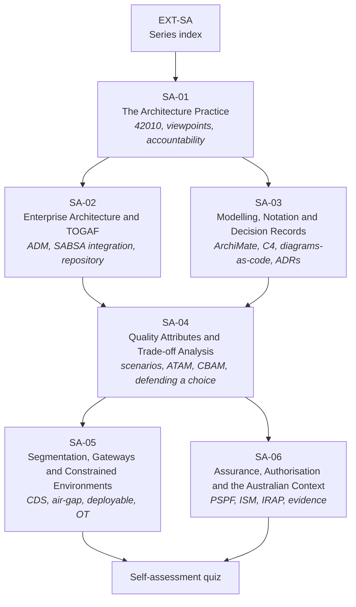

# EXT-SA: The Security Architecture Series — Practice, Method & Assurance

> **Module type:** Extension module series (method-and-practice elective)
> **Status:** Draft
> **Version:** v0.1
> **Last Reviewed:** 2026-09-12
> **Domain Expert:** _Unassigned — required before Practitioner Approved (practising security or enterprise architect)_
> **Practitioner Reviewer:** _Unassigned — required before Practitioner Approved (must have led an architecture engagement to authorisation or accreditation)_

!!! warning "This is an extension series, not credit-bearing units"
    The degree is **66 units / 168 CP** and that structure is fixed (see
    [`docs/structure.md`](../../structure.md); structural changes require the process in
    [`CONTRIBUTING.md`](../../../CONTRIBUTING.md)). EXT-SA sits **outside** that
    structure. It carries no credit points and does not appear in
    [`docs/ksat-coverage.md`](../../ksat-coverage.md) or the
    [Program Builder](../../program-builder/index.md), both of which are generated from
    credit-bearing units only. If a delivery partner wants to award recognition for it,
    use the Tier 1 badge mechanism in
    [`docs/curriculum/micro-credentials-framework.md`](../../curriculum/micro-credentials-framework.md).

!!! danger "The degree already teaches security architecture — read this before starting"
    [SC02](../../../core/units/SC02-security-architecture.md) and
    [SE02](../../../degrees/strategic/security-engineering/SE02-security-architecture.md)
    are both called *Security Architecture*, and
    [SE01](../../../degrees/strategic/security-engineering/SE01-secure-system-design.md)
    and [SE06](../../../degrees/strategic/security-engineering/SE06-capstone-architecture-design.md)
    surround them. **EXT-SA does not replace, repeat, or compete with any of them.**
    It teaches the parts of the architect job the degree deliberately leaves out —
    architecture *description*, *enterprise* integration, *trade-off* method, *constrained*
    environments, and Australian *authorisation*. See
    [What this series is not](#what-this-series-is-not).

---

## Purpose

The degree teaches a graduate how to *choose* a security architecture. It teaches SABSA,
Zero Trust, reference architectures and NIST SP 800-160, and it assesses them by asking
the learner to design a system.

That is roughly the first half of the job. The other half is the part practising
architects spend most of their week on, and which almost no curriculum teaches:

- **Describing** an architecture so that other people can act on it — with stated
  stakeholders, concerns, viewpoints and views, rather than one diagram that means
  something different to everyone who reads it.
- **Landing** security architecture inside an *enterprise* architecture function that
  already has a method, a repository, a governance board, and its own opinions.
- **Choosing between two defensible options** and being able to show the working —
  which quality attributes were traded, at what cost, and on whose authority.
- **Designing for constraint** — segmented, gatewayed, air-gapped, deployable, and
  operational-technology environments, where the elegant pattern is not available.
- **Getting it authorised** — PSPF, the ISM, IRAP, and the evidence an assessor
  actually asks for, in an Australian context.

EXT-SA teaches those five things. It is the series a graduate takes when they have been
made an architect and discovered that the design was the easy part.

---
## What this series is not

This table is the scope contract for the series. If a topic appears in the left column,
EXT-SA treats it as **assumed prior knowledge** and links to it rather than re-teaching it.

| Already taught in the degree | Where | EXT-SA relationship |
|---|---|---|
| What security architecture is; architectural principles and patterns | [SC02](../../../core/units/SC02-security-architecture.md) T1, T3 | Assumed. SA-01 starts from "you have been asked to produce an architecture description" and goes forward. |
| SABSA — layers, business attributes, the matrix | [SC02](../../../core/units/SC02-security-architecture.md) T2; [SE02](../../../degrees/strategic/security-engineering/SE02-security-architecture.md) T1 | Assumed. SA-02 covers only the **integration problem**: how a SABSA engagement coexists with a TOGAF ADM cycle. |
| Zero Trust architecture | [SC02](../../../core/units/SC02-security-architecture.md) T4; [SE02](../../../degrees/strategic/security-engineering/SE02-security-architecture.md) T2 | Assumed. Used as worked material in SA-04 trade-off exercises, not re-taught. |
| Cloud security architecture | [SE02](../../../degrees/strategic/security-engineering/SE02-security-architecture.md) T3; [SE05](../../../degrees/strategic/security-engineering/SE05-security-cloud-devsecops.md) | Assumed. SA-06 adds only the Australian hosting and certification overlay. |
| Reference architectures | [SC02](../../../core/units/SC02-security-architecture.md) T5; [SE02](../../../degrees/strategic/security-engineering/SE02-security-architecture.md) T4 | Assumed. SA-05 addresses what to do when no reference architecture fits. |
| Threat modelling as a design activity | [SE01](../../../degrees/strategic/security-engineering/SE01-secure-system-design.md) T3 | Assumed. SA-04 uses threat-model output as an input to trade-off analysis. |
| NIST SP 800-160 systems security engineering | [SE01](../../../degrees/strategic/security-engineering/SE01-secure-system-design.md) T5 | Assumed. |
| Australian regulatory environment | [GR04](../../../degrees/strategic/grc/GR04-australian-regulatory-environment.md); [F05](../../../core/units/F05-legal-ethics-compliance.md) | Assumed as *law*. SA-06 covers the *architecture assurance* process built on it. |
| Risk management frameworks | [SC01](../../../core/units/SC01-risk-management-frameworks.md); [GR02](../../../degrees/strategic/grc/GR02-risk-management-in-practice.md) | Assumed. |
| Identity and access architecture | [SE03](../../../degrees/strategic/security-engineering/SE03-identity-access-management.md) | Assumed. |

**Nothing in EXT-SA may be cited as satisfying a core-unit requirement.**

---

## The series

| Module | Title | Focus | Notional hours |
|---|---|---|---|
| [SA-01](sa-01-the-architecture-practice.md) | The Architecture Practice | Architecture description, stakeholders, concerns, viewpoints and views; what an architect is accountable for | ~20 |
| [SA-02](sa-02-enterprise-architecture-and-togaf.md) | Enterprise Architecture & TOGAF | The ADM cycle, security in each phase, SABSA–TOGAF integration, the repository and the board | ~24 |
| [SA-03](sa-03-modelling-notation-and-decision-records.md) | Modelling, Notation & Decision Records | ArchiMate, C4, diagrams-as-code, and the architecture decision record as the unit of memory | ~20 |
| [SA-04](sa-04-quality-attributes-and-trade-off-analysis.md) | Quality Attributes & Trade-off Analysis | Quality attribute scenarios, ATAM, CBAM, cost of control, and defending a decision under challenge | ~24 |
| [SA-05](sa-05-segmentation-gateways-and-constrained-environments.md) | Segmentation, Gateways & Constrained Environments | Zones and conduits, gateways, cross-domain solutions, air-gapped, deployable and OT architecture | ~26 |
| [SA-06](sa-06-assurance-authorisation-and-the-australian-context.md) | Assurance, Authorisation & the Australian Context | PSPF, ISM, IRAP, system authorisation, hosting certification, and the evidence pack | ~24 |
| [Quiz](quiz.md) | Self-assessment | 60 questions across the six modules | ~4 |
| | | | **~142 hours** |

**Suggested order.** SA-01 first — everything else assumes its vocabulary. SA-02 and SA-03
may be taken in either order. SA-04 requires both. SA-05 and SA-06 are independent of each
other: a learner heading for Defence or critical infrastructure should prioritise SA-05,
and one heading for Commonwealth or state government SA-06.

---
## Rule positions

### R3 — no vendor lock-in

EXT-SA is **method-neutral where it can be and named where it cannot**. TOGAF, ArchiMate
and SABSA are proprietary bodies of knowledge owned by The Open Group and the SABSA
Institute respectively, and a module that taught "generic enterprise architecture" would
be teaching nothing a learner could use on a real engagement.

The series handles this the way EXT-SPL handles Splunk, with one important difference: the
*specifications* here are free to read.

| R3 concern | How EXT-SA is bounded |
|---|---|
| Learner priced out | The TOGAF Standard and the ArchiMate Specification are readable at no cost from The Open Group library after free registration. C4, ADRs, ATAM and ISO/IEC/IEEE 42010 concepts are covered from open sources. **No module requires a paid course, exam or tool.** |
| Learner locked to one method | SA-01 teaches architecture description in framework-neutral 42010 terms *before* any named method appears. SA-02 explicitly compares the ADM against alternatives and teaches when *not* to run a full cycle. |
| Paid tooling | All labs use free tools — Archi (open source, ArchiMate), Mermaid (already the repository standard), PlantUML/Structurizr Lite, and plain Markdown. |
| Certification pressure | The certification map below is **informational**. Passing an exam is not a learning outcome of any module. |

!!! note "One genuine cost boundary"
    The **ISO/IEC/IEEE 42010** standard itself is a paid ISO document. SA-01 teaches the
    conceptual model — stakeholder, concern, viewpoint, view, architecture description —
    which is publicly described in secondary sources and in the freely available
    documentation of tools that implement it. Learners are **not** required to purchase
    the standard, and no lab depends on its text.

### R4 — Australian context

SA-06 is entirely Australian. SA-05 is substantially Australian (ASD gateway and
cross-domain guidance, Defence and critical-infrastructure contexts). Australian material
in the remaining modules is called out in each module Australian Context section.

---

## Certification and professional pathway

Informational only. This series does not prepare a learner to sit any specific exam, and
no module lists an exam as an outcome.

| Credential | Body | Relationship to EXT-SA |
|---|---|---|
| TOGAF Enterprise Architecture Foundation / Practitioner | The Open Group | SA-02 covers the ADM and the repository at roughly Foundation depth, from a security perspective. It is **not** an exam-prep course. |
| SABSA Chartered Security Architect (Foundation and above) | SABSA Institute | The degree teaches SABSA method in SC02/SE02. SA-02 covers only integration. Chartered certification requires the Institute paid pathway. |
| CISSP-ISSAP | ISC2 | Concentration for practising architects; requires an existing CISSP. Domain coverage overlaps SA-01, SA-04, SA-05. |
| IRAP Assessor | ASD | Not a course outcome. SA-06 teaches what an IRAP assessment *is* and how to prepare for one as the assessed party, which is the position a graduate will be in first. |
| ArchiMate certification | The Open Group | SA-03 teaches the notation for use, not to exam depth. |

!!! warning "Verify currency before relying on any pathway detail"
    Certification names, levels and prerequisites change. Every row above is
    **provisional pending Framework Custodian review** and should be checked against the
    awarding body before a learner spends money.

---

## Prerequisites

| Requirement | Why |
|---|---|
| [SC02 — Security Architecture](../../../core/units/SC02-security-architecture.md) | **Hard prerequisite for the series.** Supplies SABSA, Zero Trust and pattern vocabulary. |
| [SE01 — Secure System Design](../../../degrees/strategic/security-engineering/SE01-secure-system-design.md) | Threat modelling and security requirements, both inputs to SA-04. |
| [SE02 — Security Architecture](../../../degrees/strategic/security-engineering/SE02-security-architecture.md) | Strongly recommended before SA-04, SA-05 and SA-06. |
| [SC01](../../../core/units/SC01-risk-management-frameworks.md) or [GR02](../../../degrees/strategic/grc/GR02-risk-management-in-practice.md) | SA-04 and SA-06 assume a working risk vocabulary. |
| [F01 — Networking Fundamentals](../../../core/units/F01-networking-fundamentals.md) | SA-05 assumes routing, segmentation and protocol fundamentals. |
| [SE05](../../../degrees/strategic/security-engineering/SE05-security-cloud-devsecops.md) | Recommended before SA-06 hosting and cloud content. |

---
## Series-level framework mappings

> **Provisional pending Framework Custodian review.** These do **not** feed
> [`docs/ksat-coverage.md`](../../ksat-coverage.md). Per-module mappings are in each module.

### NIST NICE DCWF

| Version | Work Role | Code | Covered by |
|---|---|---|---|
| 2023 | Security Architect | SP-ARC-002 | SA-01 … SA-06 (primary role for the series) |
| 2023 | Enterprise Architect | SP-ARC-001 | SA-02, SA-03, SA-04 |
| 2023 | Systems Requirements Planner | SP-SRP-001 | SA-01, SA-04 |
| 2023 | Security Control Assessor | SP-RSK-002 | SA-06 |
| 2023 | Authorizing Official / Designating Representative | SP-RSK-001 | SA-06 |
| 2023 | Information Systems Security Developer | SP-SYS-001 | SA-05 |

### SFIA 9

| Skill | Code | Level | Covered by |
|---|---|---|---|
| Enterprise and business architecture | STPL | Level 5–6 | SA-02 |
| Solution architecture | ARCH | Level 5–6 | SA-01, SA-04, SA-05 |
| Information security | SCTY | Level 5 | Series-wide |
| Methods and tools | METL | Level 4–5 | SA-03 |
| Requirements definition and management | REQM | Level 4–5 | SA-01, SA-04 |
| Systems and software life cycle assurance | SURE | Level 5 | SA-06 |
| Governance | GOVN | Level 5 | SA-02, SA-06 |
| Specialist advice | TECH | Level 5 | SA-04 |

### ASD Cyber Skills Framework

| Domain | Sub-domain | Proficiency | Covered by |
|---|---|---|---|
| Security Architecture | Architecture Design & Description | Advanced | SA-01, SA-03 |
| Security Architecture | Enterprise Integration | Advanced | SA-02 |
| Security Architecture | Segregation & Gateway Design | Advanced | SA-05 |
| Governance, Risk & Compliance | System Assurance & Authorisation | Advanced | SA-06 |

---

## Verification status

Per **R5**, the following are recorded as unverified or provisional and must be confirmed
before this series moves beyond Draft.

| Item | Status | Action required |
|---|---|---|
| Project-local KSAT IDs (`SA-0n-K01` …) | Provisional | Framework Custodian review, consistent with EXT-ANS and EXT-SPL treatment |
| NICE/DCWF work-role and task codes | Provisional | Verify against the current DCWF release |
| SFIA 9 skill codes and levels | Provisional | Verify against the SFIA 9 reference |
| ASD Cyber Skills Framework domain names | Provisional | Verify; sub-domain naming is inferred |
| ISO/IEC/IEEE 42010 revision year and clause structure | **Unverified** | Confirm the current revision; SA-01 states 2022 and must be checked |
| TOGAF Standard edition and ADM phase naming | **Unverified** | Confirm the current edition; SA-02 states 10th Edition |
| ArchiMate specification version | **Unverified** | Confirm current version; SA-03 states 3.2 |
| PSPF structure, policy numbering and release naming | **Unverified** | PSPF was restructured recently; SA-06 must be checked against the current release before use |
| ISM control identifiers cited in SA-05 and SA-06 | **Unverified** | ISM is updated quarterly; cite by control topic and verify IDs at review |
| IRAP process detail and assessor obligations | **Unverified** | Confirm against current ASD IRAP policy |
| Hosting Certification Framework status and administering agency | **Unverified** | Confirm current administering agency and certification tiers |
| IEC 62443 part numbering used in SA-05 | **Unverified** | Confirm part and edition references |

!!! danger "Do not teach the Australian regulatory content from this draft"
    SA-06 and parts of SA-05 describe Commonwealth policy instruments that change without
    notice. Every instrument named there is flagged above. A Practitioner Reviewer with
    current IRAP or Commonwealth assurance experience must confirm them before delivery.

---

## Further reading

- [The Open Group — TOGAF Standard](https://www.opengroup.org/togaf) — the ADM and architecture repository; free to read after registration.
- [The Open Group — ArchiMate Specification](https://www.opengroup.org/archimate-forum/archimate-overview) — modelling notation used in SA-03.
- [The SABSA Institute](https://sabsa.org/) — the SABSA method the degree already teaches in SC02/SE02.
- [NIST SP 800-207 — Zero Trust Architecture](https://csrc.nist.gov/pubs/sp/800/207/final) — assumed knowledge; used as trade-off material in SA-04.
- [NIST SP 800-160 Vol. 1 — Engineering Trustworthy Secure Systems](https://csrc.nist.gov/pubs/sp/800/160/v1/r1/final) — assumed via SE01.
- [ASD — Information Security Manual](https://www.cyber.gov.au/resources-business-and-government/essential-cyber-security/ism) — control baseline for SA-05 and SA-06.
- [ASD — Gateway Security Guidance Package](https://www.cyber.gov.au/resources-business-and-government/maintaining-devices-and-systems/gateway-security-guidance-package) — core reading for SA-05.
- [Protective Security Policy Framework](https://www.protectivesecurity.gov.au/) — Commonwealth protective security policy; core reading for SA-06.
- [C4 model](https://c4model.com/) — lightweight software architecture diagramming, used in SA-03.
- [SEI — Architecture Tradeoff Analysis Method](https://insights.sei.cmu.edu/library/architecture-tradeoff-analysis-method-collection/) — method basis for SA-04.

---

## Series metadata

| Field | Value |
|---|---|
| Series Code | EXT-SA |
| Series Title | The Security Architecture Series — Practice, Method & Assurance |
| Module Type | Extension module series (elective; **not** credit-bearing) |
| Modules | SA-01 … SA-06 + self-assessment quiz |
| Version | v0.1 |
| Status | Draft |
| Credit Points | 0 CP — outside the 168 CP degree structure |
| Notional Hours | ~142 |
| Extends | SC02; SE01; SE02; SE06 |
| Related Units | F01, F05, SC01, SC03, SC04, SE03, SE04, SE05, GR01, GR03, GR04, GR05, LD02, LD03 |
| Prerequisites | SC02 (hard); SE01, SE02 recommended; F01 for SA-05 |
| Domain Expert | _Unassigned — required before Practitioner Approved_ |
| Practitioner Reviewer | _Unassigned — required before Practitioner Approved_ |
| Last Reviewed | 2026-09-12 |
| Framework Version — NICE DCWF | 2023 |
| Framework Version — SFIA | SFIA 9 (2023) |
| Framework Version — ASD CSF | 2024 |
| Bloom's Level (range) | 4–6 (Analyse, Evaluate, Create) |
| Australian Legislation Referenced | Security of Critical Infrastructure Act 2018 (Cth); Privacy Act 1988 (Cth); Archives Act 1983 (Cth) |
| Tooling Licence Position | All labs use free or open-source tools; no commercial licence required |
| Licence | CC BY 4.0 |
