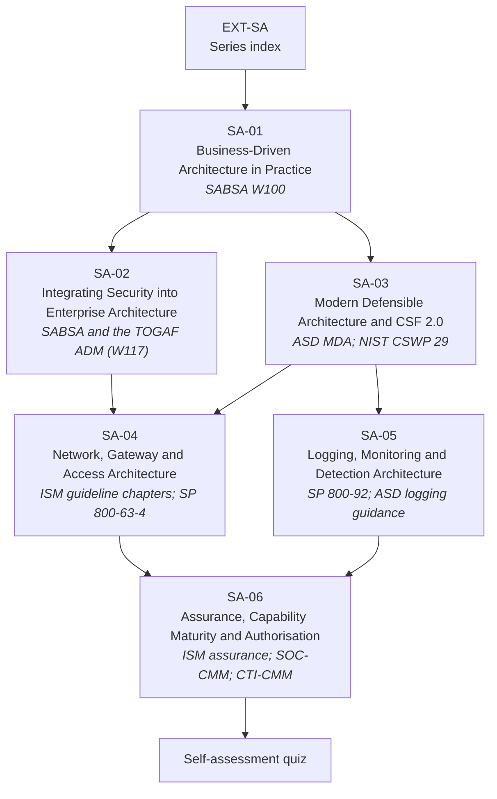

# EXT-SA: The Security Architecture Series — Method, Structure & Assurance

> **Module type:** Extension module series (method-and-practice elective)
> **Status:** Draft
> **Version:** v0.1
> **Last Reviewed:** 2026-09-12
> **Domain Expert:** _Unassigned — required before Practitioner Approved (practising security or enterprise architect)_
> **Practitioner Reviewer:** _Unassigned — required before Practitioner Approved (must have taken a system through authorisation under the ISM)_

!!! warning "This is an extension series, not credit-bearing units"
    The degree is **66 units / 168 CP** and that structure is fixed (see
    [`docs/structure.md`](../../structure.md); structural changes require the process in
    [`CONTRIBUTING.md`](../../../CONTRIBUTING.md)). EXT-SA sits **outside** that
    structure. It carries no credit points and does not appear in
    [`docs/ksat-coverage.md`](../../ksat-coverage.md) or the
    [Program Builder](../../program-builder/index.md), both of which are generated from
    credit-bearing units only. If a delivery partner wants to award recognition for it,
    use the Tier 1 badge mechanism in
    [`docs/curriculum/micro-credentials-framework.md`](../../curriculum/micro-credentials-framework.md).

!!! danger "The degree already teaches security architecture — read this before starting"
    [SC02](../../../core/units/SC02-security-architecture.md) and
    [SE02](../../../degrees/strategic/security-engineering/SE02-security-architecture.md)
    are both called *Security Architecture*, and
    [SE01](../../../degrees/strategic/security-engineering/SE01-secure-system-design.md)
    and [SE06](../../../degrees/strategic/security-engineering/SE06-capstone-architecture-design.md)
    surround them. **EXT-SA does not replace, repeat, or compete with any of them.**
    It goes deeper into the *practice* of business-driven architecture, sideways into
    *enterprise* integration and national reference guidance, and downward into the
    *structural* decisions — network, gateway, access, logging — that the ISM expects an
    architecture to make, then forward into *assurance* and *authorisation*. See
    [What this series is not](#what-this-series-is-not).

!!! note "Delivered in chunks"
    This series is being added one module per pull request, in order, on top of this
    index. Until all six land, the module table below links only the modules present in
    the repository and marks the rest as planned.

---

## Purpose

The degree teaches a graduate how to *choose* a security architecture. It teaches SABSA,
Zero Trust, reference architectures and NIST SP 800-160, and it assesses them by asking
the learner to design a system.

That is roughly the first half of the job. The other half is the part practising
architects spend most of their week on, and which almost no curriculum teaches:

- **Running the method, not reciting it** — building a business attributes profile with
  real stakeholders, keeping traceability from driver to control to metric alive, and
  operating the SABSA lifecycle as a rhythm rather than a diagram.
- **Landing security inside an enterprise architecture function** that already runs the
  TOGAF Architecture Development Method, has a repository and a board, and has its own
  opinions about where security work belongs.
- **Using national reference guidance as an input** — ASD's Modern Defensible
  Architecture and NIST CSF 2.0 profiles and tiers — to derive architecturally significant
  requirements and to sequence investment, rather than treating them as compliance checklists.
- **Making the structural decisions the ISM expects** — network segmentation, gateways
  and cross-domain boundaries, access assurance levels, and where logging is generated,
  forwarded and retained — with the ISM guideline chapters as the primary text.
- **Getting it assured and authorised** — what capability maturity models actually
  measure, and what the system-authorisation process under the ISM asks of the architect.

EXT-SA teaches those five things. It is the series a graduate takes when they have been
made an architect and discovered that the design was the easy part.

---

## What this series is not

This table is the scope contract for the series. If a topic appears in the left column,
EXT-SA treats it as **assumed prior knowledge** and links to it rather than re-teaching it.

| Already taught in the degree | Where | EXT-SA relationship |
|---|---|---|
| What security architecture is; principles and patterns; SABSA introduction | [SC02](../../../core/units/SC02-security-architecture.md) T1–T3 | Assumed. SA-01 starts from "you have been asked to build the attributes profile" and goes forward into practice. |
| Applied SABSA; architecture maturity and governance | [SE02](../../../degrees/strategic/security-engineering/SE02-security-architecture.md) T1, T6 | Assumed. SA-02 covers only the **integration problem** with the TOGAF ADM. |
| Zero Trust architecture | [SC02](../../../core/units/SC02-security-architecture.md) T4; [SE02](../../../degrees/strategic/security-engineering/SE02-security-architecture.md) T2 | Assumed. SA-03 relates it to ASD's Modern Defensible Architecture foundations; it is not re-taught. |
| Cloud security architecture; reference architectures | [SE02](../../../degrees/strategic/security-engineering/SE02-security-architecture.md) T3–T4; [SE05](../../../degrees/strategic/security-engineering/SE05-security-cloud-devsecops.md) | Assumed. SA-04 works from the ISM guideline text rather than from vendor reference architectures. |
| Threat modelling as design; NIST SP 800-160 | [SE01](../../../degrees/strategic/security-engineering/SE01-secure-system-design.md) T3, T5 | Assumed. |
| Identity and access management | [SE03](../../../degrees/strategic/security-engineering/SE03-identity-access-management.md) | Assumed. SA-04 uses NIST SP 800-63-4 assurance levels only as *architectural inputs* to a boundary. |
| NIST CSF 2.0 Govern function; applying CSF 2.0 for compliance; assessing the Essential Eight | [GR01](../../../degrees/strategic/grc/GR01-security-governance-design.md) T2; [GR03](../../../degrees/strategic/grc/GR03-compliance-frameworks.md) T3–T4 | Assumed. SA-03 uses CSF 2.0 profiles and tiers as *architecture* inputs, not as a compliance programme. |
| SIEM architecture and pipelines; detection engineering; SOC operating model | [OC02](../../../core/units/OC02-security-monitoring-siem.md); [SE04](../../../degrees/strategic/security-engineering/SE04-detection-response-engineering.md) | Assumed. SA-05 decides *which* sources, *where* they flow and *how long* they are kept; platform engineering stays in SE04 and [EXT-SPL](../splunk/index.md). |
| Technique-to-data-source mapping and coverage auditing | [DE02](../../../degrees/operational/detection-engineering/DE02-data-sources-log-engineering.md) | Assumed. SA-05 links DE02 rather than re-teaching coverage scoring. |
| Audit, control testing, IRAP as an assurance activity | [GR05](../../../degrees/strategic/grc/GR05-audit-assurance.md) | Assumed. SA-06 takes the *system owner's* side of authorisation, not the auditor's. |
| Australian regulatory environment; risk management frameworks | [GR04](../../../degrees/strategic/grc/GR04-australian-regulatory-environment.md); [SC01](../../../core/units/SC01-risk-management-frameworks.md); [GR02](../../../degrees/strategic/grc/GR02-risk-management-in-practice.md) | Assumed. |

**Nothing in EXT-SA may be cited as satisfying a core-unit requirement.**

---

## The series

| Module | Title | Primary sources | Notional hours |
|---|---|---|---|
| SA-01 *(planned — arrives in a later PR)* | Business-Driven Security Architecture in Practice | SABSA Institute white paper W100 | ~22 |
| SA-02 *(planned — arrives in a later PR)* | Integrating Security into Enterprise Architecture — SABSA and the TOGAF ADM | Open Group / SABSA Institute white paper W117 | ~24 |
| SA-03 *(planned — arrives in a later PR)* | Modern Defensible Architecture and NIST CSF 2.0 as Architecture Inputs | ASD *Investing in modern defensible architecture*; NIST CSWP 29 | ~22 |
| SA-04 *(planned — arrives in a later PR)* | Network, Gateway and Access Architecture under the ISM | ISM *Guidelines for networking*, *for gateways*, *for system access*; NIST SP 800-63-4 | ~26 |
| SA-05 *(planned — arrives in a later PR)* | Logging, Monitoring and Detection Architecture | NIST SP 800-92; ASD *Priority logs for SIEM ingestion*, *Best practices for event logging*, *Windows event logging and forwarding*, *Implementing SIEM and SOAR platforms*; CREST *Cyber Security Monitoring and Logging Guide* | ~24 |
| SA-06 *(planned — arrives in a later PR)* | Assurance, Capability Maturity and System Authorisation | ISM *Guidelines for security assurance*; SOC-CMM; CTI-CMM; Threat Hunting Maturity Model | ~24 |
| Quiz *(planned)* | Self-assessment | all modules | ~4 |
| | | | **~146 hours** |

**Suggested order.** SA-01 first — everything else assumes its vocabulary. SA-02 and SA-03
may be taken in either order. SA-04 and SA-05 are independent of each other. SA-06 assumes
both. A learner working in an organisation that runs a formal enterprise-architecture
function should take SA-02 early; one whose immediate job is a system authorisation should
take SA-04 and SA-06 together.

---

## Rule positions

### R3 — no vendor lock-in

Every primary source in this series is available at no cost: the SABSA Institute publishes
W100 freely; The Open Group publishes W117 freely; ASD, NIST and CREST guidance are free to
download; SOC-CMM and CTI-CMM are free to use under their own licences. **No module
requires a paid standard, paid course, paid exam or paid tool.** Every lab is paper-based
or uses free tooling.

| R3 concern | How EXT-SA is bounded |
|---|---|
| Learner priced out | No paid document is required to complete any module. Where a topic touches a paid standard (for example ISO/IEC 27001), it is referenced, not taught from. |
| Learner locked to one method | SABSA and TOGAF are named because the source papers are about them, and because an architect cannot be taught "generic" enterprise architecture and then be useful on a real engagement. SA-02 is explicit about when *not* to run a full ADM cycle. |
| Vendor examples | SA-05 cites one vendor's published reference architectures as a single worked example of the genre, links [EXT-SPL](../splunk/spl-07-architect.md) for the vendor-specific depth, and notes that other platform vendors publish equivalents. |
| Certification pressure | The pathway table below is informational. Passing an exam is not a learning outcome of any module. |

### R4 — Australian context

SA-03, SA-04, SA-05 and SA-06 are built primarily on ASD guidance and ISM guideline
chapters and are therefore Australian throughout. SA-01 and SA-02 are built on
international method papers; their Australian context sections connect the method to the
ISM's expectation that architecture is business-driven and risk-based, and are flagged
where that connection is interpretive rather than sourced.

---

## Certification and professional pathway

Informational only. This series does not prepare a learner to sit any specific exam, and
no module lists an exam as an outcome.

| Credential | Body | Relationship to EXT-SA |
|---|---|---|
| TOGAF Enterprise Architecture (Foundation / Practitioner) | The Open Group | SA-02 covers the ADM from a security perspective, at roughly the depth W117 assumes. It is **not** an exam-preparation course. |
| SABSA Chartered Security Architect (Foundation and above) | SABSA Institute | The degree teaches SABSA method in SC02/SE02; SA-01 and SA-02 deepen practice and integration. Chartered certification requires the Institute's own paid pathway. |
| CISSP-ISSAP | ISC2 | Architecture concentration for practising architects; requires an existing CISSP. Domain coverage overlaps SA-01, SA-04 and SA-05. |

!!! warning "Verify currency before relying on any pathway detail"
    Certification names, levels and prerequisites change. Every row above is
    **provisional pending Framework Custodian review** and should be checked against the
    awarding body before a learner spends money.

---

## Prerequisites

| Requirement | Why |
|---|---|
| [SC02 — Security Architecture](../../../core/units/SC02-security-architecture.md) | **Hard prerequisite for the series.** Supplies SABSA, Zero Trust and pattern vocabulary. |
| [SE01 — Secure System Design](../../../degrees/strategic/security-engineering/SE01-secure-system-design.md) | Security requirements and threat modelling, both inputs to SA-01 and SA-04. |
| [SE02 — Security Architecture](../../../degrees/strategic/security-engineering/SE02-security-architecture.md) | Strongly recommended before SA-02, SA-03 and SA-06. |
| [SC01](../../../core/units/SC01-risk-management-frameworks.md) or [GR02](../../../degrees/strategic/grc/GR02-risk-management-in-practice.md) | SA-01, SA-03 and SA-06 assume a working risk vocabulary. |
| [F01 — Networking Fundamentals](../../../core/units/F01-networking-fundamentals.md) | SA-04 assumes routing, segmentation and protocol fundamentals. |
| [OC02](../../../core/units/OC02-security-monitoring-siem.md) or [SE04](../../../degrees/strategic/security-engineering/SE04-detection-response-engineering.md) | Recommended before SA-05. |

---

## Series-level framework mappings

> **Provisional pending Framework Custodian review.** These do **not** feed
> [`docs/ksat-coverage.md`](../../ksat-coverage.md). Per-module mappings, with T-codes tied
> to specific labs and assessments, are in each module.

### NIST NICE DCWF

| Version | Work Role | Code | Covered by |
|---|---|---|---|
| 2023 | Security Architect | SP-ARC-002 | SA-01 … SA-06 (primary role for the series) |
| 2023 | Enterprise Architect | SP-ARC-001 | SA-02, SA-03 |
| 2023 | Systems Requirements Planner | SP-SRP-001 | SA-01, SA-03 |
| 2023 | Cyber Defense Infrastructure Support | PR-INF-001 | SA-05 |
| 2023 | Security Control Assessor | SP-RSK-002 | SA-06 |
| 2023 | Authorizing Official / Designating Representative | SP-RSK-001 | SA-06 |

### SFIA 9

| Skill | Code | Level | Covered by |
|---|---|---|---|
| Enterprise and business architecture | STPL | Level 5–6 | SA-02 |
| Solution architecture | ARCH | Level 5–6 | SA-01, SA-04, SA-05 |
| Information security | SCTY | Level 5 | Series-wide |
| Requirements definition and management | REQM | Level 4–5 | SA-01, SA-03 |
| Systems and software life cycle assurance | SURE | Level 5 | SA-06 |
| Governance | GOVN | Level 5 | SA-02, SA-06 |
| Specialist advice | TECH | Level 5 | SA-03, SA-04 |

### ASD Cyber Skills Framework

| Domain | Sub-domain | Proficiency | Covered by |
|---|---|---|---|
| Security Architecture | Architecture Design | Advanced | SA-01, SA-02, SA-03 |
| Security Architecture | Network and Gateway Design | Advanced | SA-04 |
| Defensive Operations | Monitoring Infrastructure | Advanced | SA-05 |
| Governance, Risk and Compliance | System Assurance and Authorisation | Advanced | SA-06 |

---

## Verification status

Per **R5**, the following are recorded as unverified or provisional and must be confirmed
before this series moves beyond Draft.

| Item | Status | Action required |
|---|---|---|
| Project-local KSAT IDs (`SA-0n-K01` …) | Provisional | Framework Custodian review, consistent with EXT-ANS and EXT-SPL treatment |
| NICE/DCWF work-role and task codes | Provisional | Verify against the current DCWF release |
| SFIA 9 skill codes and levels | Provisional | Verify against the SFIA 9 reference |
| ASD Cyber Skills Framework domain and sub-domain names | Provisional | Verify; sub-domain naming is inferred |
| SABSA W100 and W117 edition and publication year | **Unverified** | Confirm against the SABSA Institute and The Open Group libraries |
| ASD *Investing in modern defensible architecture* publication date and current version | **Unverified** | Confirm against cyber.gov.au |
| NIST CSF 2.0 (CSWP 29, February 2024) | Verified from the document | None |
| ISM guideline chapters cited as September 2026 | **Unverified** | The ISM is updated quarterly; re-verify every cited control identifier against the live ISM before delivery |
| NIST SP 800-92 edition | **Unverified** | Confirm whether a revision supersedes the edition read |
| SOC-CMM, CTI-CMM (v1.3) and Threat Hunting Maturity Model versions and licence terms | **Unverified** | Confirm before SA-06 labs reference their assessment structures |
| Certification pathway rows | Provisional | Check against each awarding body |

!!! danger "Do not teach the Australian regulatory content from this draft"
    SA-04 and SA-06 describe ISM controls and the system-authorisation process, which
    change without notice. A Practitioner Reviewer with current Australian Government
    assurance experience must confirm them before delivery.

---

## Further reading

- [The SABSA Institute](https://sabsa.org/) — publisher of the SABSA method and of white paper W100, the primary source for SA-01.
- [The Open Group — TOGAF Standard](https://www.opengroup.org/togaf) — the Architecture Development Method that SA-02 integrates security into; W117 is published through The Open Group library.
- [ASD — Information Security Manual](https://www.cyber.gov.au/resources-business-and-government/essential-cyber-security/ism) — the guideline chapters on networking, gateways, system access and security assurance are the primary text for SA-04 and SA-06.
- [ASD — Gateway Security Guidance Package](https://www.cyber.gov.au/resources-business-and-government/maintaining-devices-and-systems/gateway-security-guidance-package) — companion reading for SA-04.
- [NIST — Cybersecurity Framework 2.0](https://www.nist.gov/cyberframework) — CSWP 29, the primary source for the CSF half of SA-03.
- [NIST — SP 800-92, Guide to Computer Security Log Management](https://csrc.nist.gov/pubs/sp/800/92/final) — the log-management infrastructure model used in SA-05.
- [SOC-CMM](https://www.soc-cmm.com/) — the SOC capability maturity model and its white papers, used in SA-06.
- [CTI-CMM](https://cti-cmm.org/) — the cyber threat intelligence capability maturity model, used in SA-06.
- [CREST — Cyber Security Monitoring and Logging Guide](https://www.crest-approved.org/) — practitioner guide used in SA-05; locate the guide from the CREST knowledge-sharing pages.

---

## Series metadata

| Field | Value |
|---|---|
| Series Code | EXT-SA |
| Series Title | The Security Architecture Series — Method, Structure & Assurance |
| Module Type | Extension module series (elective; **not** credit-bearing) |
| Modules | SA-01 … SA-06 + self-assessment quiz |
| Version | v0.1 |
| Status | Draft |
| Credit Points | 0 CP — outside the 168 CP degree structure |
| Notional Hours | ~146 |
| Extends | SC02; SE01; SE02; SE06 |
| Related Units | F01, F05, F06, OC02, SC01, SC03, SC04, SC06, SE03, SE04, SE05, DE02, GR01, GR03, GR04, GR05, LD02 |
| Prerequisites | SC02 (hard); SE01, SE02 recommended; F01 for SA-04; OC02 or SE04 for SA-05 |
| Domain Expert | _Unassigned — required before Practitioner Approved_ |
| Practitioner Reviewer | _Unassigned — required before Practitioner Approved_ |
| Last Reviewed | 2026-09-12 |
| Framework Version — NICE DCWF | 2023 |
| Framework Version — SFIA | SFIA 9 (2023) |
| Framework Version — ASD CSF | 2024 |
| Bloom's Level (range) | 4–6 (Analyse, Evaluate, Create) |
| Australian Legislation Referenced | Security of Critical Infrastructure Act 2018 (Cth); Privacy Act 1988 (Cth) |
| Tooling Licence Position | All labs paper-based or free/open-source; no commercial licence required |
| Licence | CC BY 4.0 |
