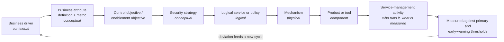
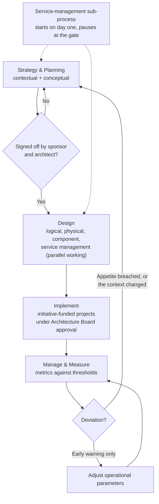
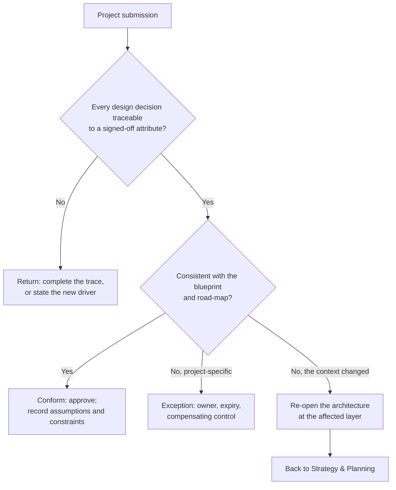

# SA-01: Business-Driven Security Architecture in Practice

> **Module type:** Extension module (elective deep dive) — part of [EXT-SA](index.md)
> **Status:** Draft
> **Version:** v0.1
> **Last Reviewed:** 2026-09-12
> **Domain Expert:** _Unassigned — required before Practitioner Approved_
> **Practitioner Reviewer:** _Unassigned — required before Practitioner Approved_

!!! warning "Not a credit-bearing unit"
    SA-01 is the first module of the [EXT-SA series](index.md), an optional extension that sits outside the 66-unit / 160 CP degree structure. It carries **0 CP** and does not appear in [`docs/ksat-coverage.md`](../../ksat-coverage.md) or the [Program Builder](../../program-builder/index.md), both of which are generated from credit-bearing units only. A delivery partner wanting to recognise it should use the Tier 1 badge mechanism in [`docs/curriculum/micro-credentials-framework.md`](../../curriculum/micro-credentials-framework.md).

---

## Overview

A graduate who has finished [SC02](../../../core/units/SC02-security-architecture.md) knows what SABSA is, can name the layers, and has produced a one-hop table that ties a control to a business attribute. The first month in an architecture role asks different questions. The business has not written its requirements down anywhere. The attributes in the textbook do not quite describe this organisation. A project arrives with a product already chosen and asks for a signature. Someone wants to know why a control exists, and nobody can say. The organisation acquires a competitor, and the architecture that was signed off eighteen months ago is now describing a company that no longer exists. None of that is covered by an introduction.

This module is about SABSA as a **practice** rather than a model. It teaches how a Business Attributes Profile is actually built with stakeholders and validated to the point where a sponsor will sign it; how each attribute gets a metric with a primary and an early-warning threshold; how the chain from business driver to measured control is kept as a working register that answers questions in both directions; how the SABSA lifecycle becomes the operating rhythm of a team rather than a diagram; how the service management layer is used as a design input at every other layer; when a piece of work needs an architecture at all; how a practice is run through a blueprint, a road-map and an Architecture Board; what an architect is accountable for as distinct from designers and engineers; and how assumptions and constraints are recorded so that the next review can test them.

It deliberately does **not** re-teach what SC02 and [SE02](../../../degrees/strategic/security-engineering/SE02-security-architecture.md) already cover: what security architecture is, the SABSA layers as an introduction, principles and patterns, Zero Trust, reference and cloud architectures, evaluating a design against the ISM and Essential Eight, or the fact that review boards and exception processes exist. It does not teach requirements specification at the system level ([SE01](../../../degrees/strategic/security-engineering/SE01-secure-system-design.md)), risk appetite ([SC01](../../../core/units/SC01-risk-management-frameworks.md), [GR02](../../../degrees/strategic/grc/GR02-risk-management-in-practice.md)), KPI and KRI theory ([SC05](../../../core/units/SC05-security-program-management.md)), or security strategy road-mapping ([LD02](../../../degrees/strategic/leadership/LD02-security-strategy-roadmapping.md)). Integration with enterprise architecture methods is the subject of SA-02 (later in this series), and ASD's Modern Defensible Architecture Foundations belong to SA-03 (later in this series).

The primary source is the **SABSA White Paper W100**, *Enterprise Security Architecture* (Sherwood, Clark and Lynas; copyright SABSA Limited, 1995–2009). The Australian framing draws on ASD's *Investing in modern defensible architecture*, which names layered architecture and traceability from business objectives to technical implementation as one of the three ideas the approach rests on, and lightly on the ISM *Guidelines for security assurance*. SABSA® is a registered trademark of SABSA Limited; W100 states that the framework is copyright and not public domain, so this module summarises it in its own words and does not reproduce its matrices, tables, figures or attribute taxonomies. Learners are encouraged to obtain the paper from sabsa.org and read it alongside this module; the labs do not depend on it.

---

## Where this module fits

| Unit / module | Relationship |
|---|---|
| [SC02 — Security Architecture](../../../core/units/SC02-security-architecture.md) | **Hard prerequisite.** Topic 2 and Lab 1 give the SABSA introduction and the one-hop traceability table this module extends into a working practice. |
| [SE02 — Security Architecture](../../../degrees/strategic/security-engineering/SE02-security-architecture.md) | **Direct extension.** SE02 Topic 1 works the layers as a design workflow; Topic 6 says boards, exceptions and maturity exist. SA-01 goes to how the board decides and when the architecture is re-opened. |
| [SE01 — Secure System Design](../../../degrees/strategic/security-engineering/SE01-secure-system-design.md) | System-level requirements engineering is assumed; SA-01 works one level up, at business attributes. |
| [SE06 — Capstone: Architecture Design](../../../degrees/strategic/security-engineering/SE06-capstone-architecture-design.md) | The summative here is shaped like a practice deliverable, not a design deliverable; SE06 remains the design capstone. |
| [SC01](../../../core/units/SC01-risk-management-frameworks.md) · [GR02](../../../degrees/strategic/grc/GR02-risk-management-in-practice.md) | Risk appetite and tolerance. SA-01 uses appetite only as the primary threshold on an attribute metric. |
| [SC05 — Security Program Management](../../../core/units/SC05-security-program-management.md) | KPI versus KRI, leading and lagging indicators. SA-01 designs per-attribute metrics and links out for the theory. |
| [SC06 — Stakeholder Communication](../../../core/units/SC06-stakeholder-communication.md) | Interviewing and presenting to business managers, used throughout Lab 1. |
| [GR01 — Security Governance Design](../../../degrees/strategic/grc/GR01-security-governance-design.md) | Governance structures and RACI; Topic 8 places the architect within them. |
| [GR05 — Audit & Assurance](../../../degrees/strategic/grc/GR05-audit-assurance.md) | The traceability register is the evidence an auditor or IRAP assessor reads; SA-01 hands assurance process off to GR05. |
| [LD02](../../../degrees/strategic/leadership/LD02-security-strategy-roadmapping.md) · [LD03](../../../degrees/strategic/leadership/LD03-communicating-risk-to-executives.md) | Strategy road-map and board dashboards. Topic 9 distinguishes the architecture road-map from the security strategy road-map. |
| SA-02 — Integrating Security into Enterprise Architecture (later in this series) | **Successor.** Takes the practice built here into an enterprise architecture method. |
| SA-03 — Modern Defensible Architecture and NIST CSF 2.0 (later in this series) | Takes the ASD expectation named in Topic 5 and the Australian context section into the MDA Foundations themselves. |
| SA-06 — Assurance, Capability Maturity and System Authorisation (later in this series) | Where the system-owner accountability and system-specific documentation mentioned here are treated properly. |

---

## Prerequisites

- **[SC02 — Security Architecture](../../../core/units/SC02-security-architecture.md)** (required; Topic 2 and Lab 1 in particular)
- **[SC01 — Risk Management Frameworks](../../../core/units/SC01-risk-management-frameworks.md)** (required: risk appetite and tolerance)
- **[SE02 — Security Architecture](../../../degrees/strategic/security-engineering/SE02-security-architecture.md)** (strongly recommended; Topics 1 and 6)
- **[SC05](../../../core/units/SC05-security-program-management.md)** and **[SC06](../../../core/units/SC06-stakeholder-communication.md)** (recommended: metrics, and interviewing business stakeholders)
- The SABSA White Paper W100 from sabsa.org (recommended, not required: every lab is completable from this module's text; access terms not verified for this module, and registration may be required). Read its Business View and contextual columns (pp. 9–11), Table 1 (p. 9) and the SABSA Matrix, Table 3 (p. 16): SC02 introduces the layers only, so the six contextual questions, the matrix and the service-management layer are new material that this module introduces in one sentence each rather than re-teaching

---

## Learning outcomes

On completion, a learner can:

1. **Construct** a Business Attributes Profile with named stakeholders for a described organisation, including an organisation-specific definition and a primary and early-warning threshold for every attribute, and validate it to the point of sponsor sign-off.
2. **Design** a traceability register that links each business driver through attribute, control or enablement objective, strategy, logical service, mechanism, component and service-management activity to a measured metric, and use it to answer both "why does this exist?" and "which requirement is unmet?".
3. **Analyse** the operating rhythm of an architecture practice against the SABSA lifecycle and identify where a sign-off gate, a parallel-working boundary or a manage-and-measure feedback loop is missing.
4. **Evaluate** a project submission from the position of an Architecture Board and justify a conform, exception or re-open decision by tracing it to signed-off attributes and recorded constraints.
5. **Differentiate** what an architect is accountable for from what designers, builders, integrators and service managers own, and apply that boundary to a record of assumptions and constraints.
6. **Assess** how ASD's stated expectation of layered, traceable, business-driven architecture applies to an Australian organisation, stating precisely what current guidance verifiably says and what it does not.

> Bloom's 4–6 (Analyse / Evaluate / Create): at or above the Major-unit expectation (4–5) in [`docs/content-standards.md`](../../content-standards.md) section 3. LO1 and LO2 reach Capstone-level Create because the artefacts are built, not described.

---

## AQF Level 7 Alignment

**Knowledge (AQF 7.1):** specialised knowledge of business-driven security architecture as an operating practice: requirements engineering at the business attribute level, two-way traceability, lifecycle governance and architectural accountability. **Skills (AQF 7.2):** cognitive and communication skills to elicit and validate requirements from non-technical stakeholders, to reason across abstraction layers, and to defend an architectural decision to a board. **Application (AQF 7.3):** applied with initiative and judgement to a realistic Australian organisation, including the judgement to say that a piece of work does not need an architecture, or that an architecture must be re-opened.

> This alignment statement is notional. SA-01 is not credit-bearing, so it has not been through the AQF mapping process in [`docs/compliance/aqf-teqsa.md`](../../compliance/aqf-teqsa.md) and is not assessed against it.

---

## Framework mappings

> **Provisional pending Framework Custodian review.** These do **not** feed [ksat-coverage](../../ksat-coverage.md).

### NIST NICE DCWF

| Version | Work Role | Code | T-Code | Task | Demonstrated in |
|---|---|---|---|---|---|
| 2023 | Security Architect | SP-ARC-002 | T0050 | (paraphrase) Design system security architecture and supporting infrastructure | Lab 2; Summative |
| 2023 | Enterprise Architect | SP-ARC-001 | T0473 | (paraphrase) Document and address organisational requirements in system design | Lab 1; Lab 3 |
| 2023 | Systems Requirements Planner | SP-SRP-001 | T0033 | (paraphrase) Conduct risk, feasibility or trade-off analysis to develop and refine requirements | Lab 1 |
| 2023 | Information Systems Security Manager | OV-MGT-001 | T0149 | (paraphrase) Recommend resource allocations to mitigate identified risks | Lab 3; Summative |

### SFIA 9

| Skill | Code | Level | Demonstrated in |
|---|---|---|---|
| Solution architecture | ARCH | Level 5 | Lab 2; Summative |
| Enterprise and business architecture | STPL | Level 5 | Topic 6; Lab 3 |
| Information security | SCTY | Level 5 | Lab 1; Lab 2 |
| Requirements definition and management | REQM | Level 4 | Lab 1 |
| Business situation analysis | BUSA | Level 5 | Lab 1 |
| Methods and tools | METL | Level 4 | Lab 2; Lab 3 |

### ASD Cyber Skills Framework

| Domain | Sub-domain | Proficiency | Demonstrated in |
|---|---|---|---|
| Security Architecture | Architecture Design | Advanced | Lab 1, Lab 2, Summative |
| Cyber Governance | Governance Design | Practitioner–Advanced | Lab 3 |

### Project-local KSATs

| Type | ID | Statement | Demonstrated in |
|---|---|---|---|
| Knowledge | SA-01-K01 | Knowledge of the three determining factors of an architecture (goals, environment, technical capability) and the concept of enterprise | Topic 1 |
| Knowledge | SA-01-K02 | Knowledge of how a Business Attributes Profile is elicited, selected, customised and validated | Topic 2; Lab 1 |
| Knowledge | SA-01-K03 | Knowledge of per-attribute metrics with primary (appetite) and early-warning thresholds | Topic 3; Lab 1 |
| Knowledge | SA-01-K04 | Knowledge of two-way traceability for completeness and business justification | Topic 5; Lab 2 |
| Knowledge | SA-01-K05 | Knowledge of the SABSA lifecycle, its sign-off gate and its feedback loop as an operating rhythm | Topic 6; Lab 3 |
| Knowledge | SA-01-K06 | Knowledge of ASD's expectation of layered architecture and traceability to business objectives | Topic 5; Summative |
| Skill | SA-01-S01 | Skill in running a contextual-layer stakeholder interview and converting it into attributes | Lab 1 |
| Skill | SA-01-S02 | Skill in building and sweeping a traceability register in both directions | Lab 2 |
| Skill | SA-01-S03 | Skill in recording assumptions, constraints and maintenance triggers against an architecture | Lab 3 |
| Ability | SA-01-A01 | Ability to obtain and hold sponsor sign-off on contextual and conceptual architecture | Lab 1; Summative |
| Ability | SA-01-A02 | Ability to decide conform, exception or re-open for a project submission and defend it | Lab 3; Summative |
| Ability | SA-01-A03 | Ability to state the boundary of architectural accountability against design and engineering | Topic 8; Summative |

---

## Module structure

| Part | Topics | Labs | Notional hours |
|---|---|---|---|
| A — The enterprise and the mandate for architecture | 1 | — | 2 |
| B — Building and validating the attributes profile | 2–4 | 1 | 7 |
| C — Traceability as a working register | 5 | — | 3 |
| D — Lifecycle rhythm and the service-management vertical | 6–7 | 2 | 5 |
| E — Accountability and running the practice | 8–10 | 3 | 5 |
| F — Summative | — | — | 2 |
| | | | **24 hours** |

---

## Topics

### Topic 1: The Enterprise, Complexity, and Whether You Need an Architecture at All

SABSA W100 opens with the building analogy and reduces it to three things that determine any architecture: the goals it must serve, the environment it is built in, and the technical capability available to build and run it. Where the third dominates the first, the paper says, the architecture fails to deliver what the business needs. That is the diagnostic for most of the failure modes in Topic 9, and it is also the shape of the assumptions and constraints record in Topic 10: goals become drivers; environment and capability become constraints.

Two further ideas from W100 decide the scope of a practice before any attribute is written. The first is **enterprise**. Using the word means the organisation is treated as one entity with end-to-end processes rather than a set of cooperating units, and the aim is coherent optimisation of the whole. For risk specifically, W100 frames this as optimising the whole basket of opportunities and threats across the enterprise instead of letting each business unit optimise its own. An architecture practice that only ever sees one business unit's projects is not doing enterprise security architecture, whatever it is called.

The second is **when architecture is needed at all**. W100 is direct: a small, isolated project does not need an architecture, because one designer can hold the whole thing. Architecture becomes necessary when many designers must work as though they were a single design authority, or when a project must fit within a wider set of projects designed at the same time or over years. The tools are layering (attending to one level of abstraction at a time) and modularisation (pieces with defined function and defined interfaces), which W100 notes is also what systems engineering means.

**Key concepts:**

- Goals, environment, technical capability: the three determining factors
- Enterprise as a single entity; the basket of risks
- The test for needing architecture: many designers, one design authority, or many projects, one road-map
- Layering and modularisation as complexity controls, not documentation styles

---

### Topic 2: Building the Business Attributes Profile with Stakeholders

SC02 treats capturing the business attributes as one step. In practice it is the longest step, and W100 is explicit about where the data comes from: "a detailed analysis of the business processes is required, using as source data information gathered by direct interviews with operational business managers" (W100, p. 5). Not the IT team, and not the security team. W100 warns that many technologists believe they already know the requirements while having a poor relationship with the people who could state them.

W100's six contextual-layer questions (what, why, how, who, where, when: the columns of its matrix, pp. 10–11 and Table 3; SC02 introduces the layers only) are used here as the **structure of the interview**. Each conversation must come away with something in every column:

| Column | The interview must come away with | Example prompt to a business manager |
|---|---|---|
| What | The assets they would be embarrassed or ruined to lose, including brand and reputation | "What would the front page of the paper say if this went wrong?" |
| Why | Opportunities and threats in their words, not ours | "What would you do next year if you trusted the systems more?" |
| How | The processes, transactions and communications that carry the business | "Walk me through an order from first contact to cash." |
| Who | Governance, partners, suppliers, outsourcers: the extended enterprise | "Who outside the company has to do their job for you to do yours?" |
| Where | Sites, remote work, jurisdictions, where data and people are | "Where does this happen, and where must it never happen?" |
| When | Deadlines, lifetimes, throughput, time-to-market | "What is the cost of a day late? An hour?" |

ASD's *Investing in modern defensible architecture* offers a parallel list of business-objective questions (objectives for three to five years, mission-critical initiatives, customer-trust commitments, partnerships, jurisdictions and contracts, ways of working, the impact of losing a capability). Lab 1 maps the two lists; they land on the same ground.

From the interviews, the analyst **selects** attributes rather than ticking the whole taxonomy. W100 states that its taxonomies are examples, not comprehensive or mandatory; that a profile should include only attributes that apply, create new ones where there are gaps, and decompose an attribute to finer granularity when the organisation needs it. W100's taxonomies include attributes such as Available, Auditable, Reputable, Supportable, Compliant and Enabling time-to-market; its general business taxonomy groups attributes under Financial, Physical, Human, Process, Strategic and System headings. Every selected attribute then gets an **organisation-specific definition**: Available for a freight booking platform is not Available for a payroll run.

Validation is the part most practices skip. Each attribute must have a business manager who recognises it as theirs, and the profile is not finished until the contextual and conceptual layers are agreed and signed off, W100's natural break in the development process.

!!! note "Copyright"
    W100's two attribute taxonomies (its Figures 4 and 5) are copyright SABSA Limited and are not reproduced here. Naming a handful of attributes with attribution is fair; copying the figures into a lab deliverable is not.

---

### Topic 3: Attribute Metrics and Thresholds as Architecture Artefacts

A profile with no metrics is a list of adjectives. W100 places the selection of metrics and the setting of performance targets inside the profile itself, chosen by the business analysts during Strategy and Planning, so that Manage and Measure has something to measure against. In its service-management overlay, W100 places the definition of the Business Attributes Profile, together with its performance criteria, KPIs and KRIs, at the conceptual layer, which makes metric design an architecture task, not an operations afterthought.

The structural idea is the **two thresholds**. W100 observes that failing a performance goal is a risk event, so a KPI read the other way is a KRI. SABSA practice sets two indicators per attribute: a primary threshold that is the limit of acceptable performance and is therefore an expression of risk appetite, and a secondary threshold that gives early warning while the risk can still be steered back inside the comfort zone. That maps directly onto green, amber and red reporting.

| Attribute | Organisation-specific definition (fragment) | Metric | Primary threshold (appetite) | Early-warning threshold | Owner |
|---|---|---|---|---|---|
| Available | The customer booking portal accepts and confirms bookings during declared trading hours | Portal availability in trading hours, monthly | Below 99.5% | Below 99.8% | Head of Customer Operations |
| Auditable | Every change to a consignment's customs status can be attributed to a person or system and reconstructed for 7 years | Share of status changes with complete attribution | Below 100% in any audit sample | Any unattributed change found in monitoring | Compliance Manager |
| Enabling time-to-market | A new partner integration can be onboarded without an architecture exception | Median partner onboarding, request to production | Above 30 business days | Above 20 business days | Partner Manager |

The rows are illustrative, not SABSA-published. Three practice points follow. A metric nobody will collect is not a metric, so each row names the source of the data and a cadence. The owner is a business manager, because the primary threshold is their appetite, not the architect's. And W100's closing argument applies: success metrics must be quantifiable and expressed in business performance terms, not technical ones. Metric theory, leading versus lagging indicators, and dashboard design stay with [SC05](../../../core/units/SC05-security-program-management.md) and [LD03](../../../degrees/strategic/leadership/LD03-communicating-risk-to-executives.md); this module's concern is that every attribute leaves the conceptual layer with two thresholds and an owner.

---

### Topic 4: Control Objectives, Enablement Objectives and the Opportunity Side of Risk

The most common way a profile fails its business is that every objective derived from it is a control. W100's primary characteristic of the model is that everything derives from business requirements, especially those where security has an **enabling** function that opens new business opportunities, and its risk focus deliberately holds opportunity and threat in balance. Its model of operational risk (W100 Figure 6, described here qualitatively) has two branches from the assets at risk: a threat branch that ends in a loss event, and an opportunity branch that ends in a beneficial event.

At the conceptual layer, the attributes profile is used as a set of proxy assets against which risk is assessed, and from that assessment come **both control objectives and enablement objectives**. W100's own 2009 list of enablement examples (remote access for third parties, online services, outsourcing operations, mobile working) is dated in detail but not in principle: every organisation has things it would do if it trusted its systems more, and those are requirements the architecture can be held to. ASD's *Investing in modern defensible architecture* makes the same point for Australian organisations, describing security objectives as supporting business objectives by mitigating threats and enabling opportunities within the organisation's risk tolerance.

A usable enablement objective has three parts: the business opportunity in the sponsor's words, the attribute or attributes that must hold for the business to take it safely, and the metric that will show whether it was taken. "Enable self-service booking for account customers by Q3, with Authenticated and Available holding at their primary thresholds from launch" is an enablement objective. "Deploy multi-factor authentication" is a mechanism, and it belongs three layers down.

**Key concepts:**

- Proxy assets: risk assessed against the attributes, not against servers
- Control objective and enablement objective as paired outputs of the same assessment
- Writing an enablement objective that names opportunity, attributes and metric
- The reputational cost W100 describes when security is only ever a brake

---

### Topic 5: The Traceability Chain as a Working Register

W100 describes the development process as creating a chain of traceability through every lifecycle phase so that the business mandate is preserved end to end, and gives the matrix two jobs in that chain: **completeness** (every requirement can be followed down to the components that meet it) and **business justification** (every component can be followed back up to the requirement that justifies it). SC02 Lab 1 and SE02 Lab 1 build one hop of that chain. This module keeps the whole chain as a register.

One row of the register, for the Auditable attribute in Topic 3, looks like this:

| Hop | Entry |
|---|---|
| Driver | Customs broker contracts require reconstructable consignment history |
| Attribute | AUD-01 Auditable (definition and thresholds as Topic 3) |
| Objective | Control: every status change attributable and retained 7 years |
| Strategy | Application security and audit logging strategy |
| Logical service | Non-repudiation and integrity protection for status-change events |
| Mechanism | Signed, append-only event log with time source |
| Component | (product selected at component layer; recorded by name and version) |
| Service management | Log integrity monitoring and quarterly sample audit; Compliance Manager |
| Metric | Share of status changes with complete attribution, monthly, two thresholds |

The register earns its keep through two **sweeps**. The backward sweep starts at a component and asks why it exists; if the walk back reaches no driver, the component is an orphan and W100's business justification test has failed. The forward sweep starts at an attribute and asks "which requirement is unmet?"; an attribute with no strategy, or a strategy with no service, is a completeness gap. Both are Lab 2. W100 adds that the existence of such an architecture is one of the ways auditors establish that security is applied systematically, which is why the register, not the diagram, is what [GR05](../../../degrees/strategic/grc/GR05-audit-assurance.md) and SA-06 will treat as evidence.

The Australian expectation is explicit. ASD's *Investing in modern defensible architecture*, under the capabilities it expects of security personnel, asks: "Can the organisation show traceability back to the business objectives and security outcomes?" The register is the artefact that answers yes.

---

### Topic 6: The Lifecycle as an Operating Rhythm

W100 groups the contextual and conceptual work as **Strategy and Planning**, then **Design** (logical, physical, component and service management), then **Implement**, then **Manage and Measure**, in a cycle. Three features of that cycle turn it from a diagram into a calendar.

First, the **sign-off gate**. W100 identifies a natural break once the contextual and conceptual architectures are agreed and signed off. After it, later phases can proceed with considerable parallel working; before it, W100 says it is difficult to make useful progress, and the temptation to go straight to products and tools is the source of many severe operational problems. In practice this means nothing below the conceptual layer is approved for a scope until its profile and objectives are signed.

Second, the **service-management sub-process starts on day one**, because parts of it are needed to build the contextual and conceptual layers, then pauses at the gate and restarts after it (Topic 7).

Third, **Manage and Measure closes the loop**. Targets were set in the profile; once operational, actual performance is measured against them and deviations managed. W100 distinguishes two responses: adjusting operational parameters, or feeding back into a new development cycle. The early-warning threshold from Topic 3 is what tells the practice which response it is looking at.

W100's risk management process (its Figures 7 and 8, described qualitatively) lists the artefacts each phase should leave behind: context, stakeholders, drivers, attributes, appetite, control and enablement objectives in Strategy and Planning; gap analysis, strategies, policies, services, mechanisms and tools in Design; proofs of concept, roll-out, training and testing in Implement; operations, incidents, monitoring, KPIs and KRIs, scorecards and improvement in Manage and Measure. Communicate and Assure run across all four. This module's suggested calendar (not from W100, which gives no cadence): an annual contextual review, a quarterly measure against thresholds, and a board sitting per project.

---

### Topic 7: The Service-Management Layer as a Vertical Working Tool

SC02 teaches the five layers from contextual to component. W100 Table 1 adds the service manager's view as a sixth, and its Figure 1 gives what the paper calls the more helpful picture, placing it **vertically** across the other five, because service-management questions arise at, and have meaning in, every layer. The paper's building analogy is the point: once the architects, designers and builders leave, a facilities manager runs the building, and unless the earlier phases took account of operations the operational phase will be fraught with difficulty.

Used as a working tool, the vertical means asking at every layer: who will run this, how will it be supported, and what will be measured? W100's overlay (its Table 2 and Table 4, summarised rather than reproduced) gives the shape. At the contextual layer, service management is about business drivers, relationships and points of supply. At the conceptual layer it is where the attributes profile gets its performance criteria, where roles, responsibilities and liabilities are defined, and where service levels, the service catalogue and service performance targets are planned. At the logical layer it becomes policy, asset and service-delivery management and reporting against KPIs and KRIs; at the physical layer, operations, job scheduling, incident and event management and monitoring architecture; at the component layer, the tools that do all of the above.

Two consequences for practice. Operability is a requirement, so attributes such as Supportable and Maintainable (both in W100's taxonomy) belong in the profile with thresholds, not in a later operations handover. And the monitoring architecture that will produce the metric data in Topic 3 is designed at the conceptual layer, which is why SA-05 sits downstream of this module rather than beside it.

!!! warning "Currency of the ITIL alignment"
    W100 states that the service-management architecture aligns closely with ITIL v3, which was current in 2009. ITIL has been revised since. Treat the alignment as directional; do not cite ITIL version-specific process names from W100 as current.

---

### Topic 8: Accountability: What the Architect Owns

W100 assigns each layer to a player in the building trade, and the assignments are an accountability map. The business owner states context. The architect creates the conceptual vision: W100 describes the architect as producing broad-brush, high-level descriptions that prepare the way for others to fill in detail, and the conceptual layer as the principles and concepts that guide selection of everything below it. Then the hand-off: "The architect is an artist and visionary, but the designer is an engineer." The designer produces the logical architecture, which must reflect every major strategy from the conceptual layer; the builder produces the physical technology model; the tradesmen (specialist vendors, installers and integrators) supply and fit components; the service manager runs the result.

| View | Accountable for | Signs off | Not accountable for |
|---|---|---|---|
| Business owner (contextual) | Drivers, appetite, the profile being theirs | Contextual and conceptual layers, with the architect | Strategies, services, products |
| Architect (conceptual) | Profile, objectives, strategies, the traceability chain, the blueprint and road-map | Conceptual layer; board decisions | Logical design detail; product selection; operations |
| Designer (logical) | Services, policies, entity and domain models that realise every conceptual strategy | Logical layer | Choosing the strategy; choosing the product |
| Builder (physical) | Mechanisms, infrastructure, data structures | Physical layer | Whether the mechanism was the right strategy |
| Tradesman (component) | Product and tool selection, integration, standards | Bill of materials | Anything above the component layer |
| Service manager | Running, supporting and measuring the result at every layer | Service-management architecture | Setting the thresholds (the business does) |

*The view-to-layer mapping is W100 Table 1; the Signs off and Not accountable for columns are this module's practice synthesis.*

W100 also names two views it does **not** treat as separate layers. The Inspector (audit and assurance) is served by the whole model, and the Governor concentrates on the people and motivation columns. Neither displaces the architect's accountability; both consume the architect's register.

The behaviours W100 attaches to a successful architect follow from the map. Think in business terms at every level, including the nuts and bolts. Expect to be challenged by people who think architecture is about technology, and be able to sell the idea rather than assert it. Secure senior sponsorship early; W100 calls creating that acceptance probably the hardest early task, and its conclusion adds that senior managers must feel their own success is tied to the architecture's. ASD's guidance says the same from the other side: executives provide the authority, set direction, allocate resources and should hold an approved risk appetite statement aligned to security objectives.

---

### Topic 9: Running the Practice: Blueprint, Road-map, Board and Maintenance

W100's implementation section expects an enterprise architecture to be delivered not as one programme but as a **blueprint and road-map** for many initiative-funded projects, with an **Architecture Board** approving each against it so that fragmented delivery does not become piecemeal design. This road-map is the architecture's road-map for projects; the security strategy road-map in [LD02](../../../degrees/strategic/leadership/LD02-security-strategy-roadmapping.md) is a different artefact that should cite it.

SE02 establishes that boards and exception processes exist. What a board actually checks is the register from Topic 5:

The third branch is the one W100 spends most words on. W100 insists that an architecture is not shelf-ware: business requirements sometimes step-change (an acquisition, a divestment, a downturn) and sometimes drift with the market, and technology changes underneath. Either way the contextual layer must be reviewed, which raises two questions the board owns: when does contextual change create enough pressure to change the conceptual and lower layers, and when should a component-layer decision move from one strategic technology to another. W100's answer is a continual review process governed by the board. Its governance process (Figure 10, described qualitatively) runs two tiers, board-and-executive and line-management-and-staff, across the four lifecycle phases, with regulators, shareholders and internal and external auditors outside the loop receiving reports. W100 also notes a SABSA Maturity Profile for benchmarking the practice's own processes; SE02 Topic 6 (SSE-CMM) covers architecture-programme maturity, and SA-06 is capability maturity and does not.

| Failure mode (W100) | How it presents | Practice counter |
|---|---|---|
| Point solutions, unknown total cost | Products bought per requirement; no interoperability; support cost climbing | Board approval against the register; operations cost in the profile |
| Technologists "already know" the requirements | No business interviews; profile written by IT | Lab 1 rule: attributes are owned by named business managers |
| Requirements on the shelf | Profile exists; design ignores it | Sign-off gate; forward sweep before Design starts |
| Straight to products | Project arrives with a vendor chosen | Board returns it: trace or state the new driver |
| Operations an afterthought | Service management designed after go-live | Vertical from day one (Topic 7) |
| Targets never measured | Thresholds set, never reported | Quarterly measure in the rhythm; owner per metric |
| No sponsorship | Architecture challenged and ridiculed, then ignored | Sponsor signs the gate; executive risk appetite statement |
| Shelf-ware architecture | Signed off once, never re-opened | Maintenance triggers register (Lab 3) |
| Checklist mistaken for architecture | Control catalogue compliance presented as design | W100's chain-and-car argument; SC02 Topic 6 for the evaluation itself |

---

### Topic 10: Recording Assumptions and Constraints

!!! note "Module synthesis"
    W100 supplies the inputs for this topic but does not describe an assumptions and constraints register. The record below is this module's own practice synthesis, anchored to W100's three determining factors (pp. 2–3), wider business requirements (pp. 6–7), contextual columns (pp. 10–11) and development process (p. 18). Decision records as a notation are outside this module.

Every signed-off profile rests on things that were true at the time. W100 gives the categories. The three determining factors (goals, environment, technical capability) mean every driver rests on an assumed goal and every strategy on an assumed environment and capability. The contextual Where column carries jurisdictions and the Who column carries the extended enterprise of partners and outsourcers; both change. The generic wider requirements W100 lists (usability, interoperability, supportability, cost scalability, re-use, operations and administration cost, risk-based cost-effectiveness) are constraints that trade off against each other. And the sign-off gate is the moment those assumptions are frozen, which is also the moment they should be written down, so that the maintenance triggers in Topic 9 have something to test.

| Field | Content | Why it is there |
|---|---|---|
| ID and type | ASM-nn (assumption) or CON-nn (constraint) | So the register and the board minutes can cite it |
| Statement | One sentence, in business terms | Testable at the next review |
| Category | Goal, environment, capability, jurisdiction, extended enterprise, wider requirement | W100's three factors and contextual columns |
| Attributes affected | Attribute IDs from the profile | Which thresholds move if this is wrong |
| Frozen at | Gate date and sponsor | Accountability for the assumption |
| Trigger | What observation would falsify it (a new jurisdiction, a partner change, a technology shift) | Feeds the maintenance review |
| Review owner | Named role | Someone re-tests it |

Two rules make the record useful. It is written by the architect but the statements are the business owner's, in their words, and the owner signs them with the gate. And each project approved by the board adds its own rows, so that when the architecture is re-opened the practice knows which projects were built on the assumption that just failed.

---

## Labs & exercises

All three labs are paper-based and need no tooling beyond a text editor or spreadsheet. All three are completable from this module's text; W100 is recommended reading, not a required input. They use a single fictional organisation, **Harbourline Freight**: an Australian freight forwarder with about 900 staff across three states and a small office in New Zealand, a customer booking portal, a partner API used by customs brokers, an outsourced network provider, and a plan to launch a self-service booking app for account customers within twelve months. It holds customer personal information subject to the *Privacy Act 1988* (Cth). Persona cards for six managers may be supplied by an instructor or written by the learner from this description.

!!! warning "Authorisation boundary"
    Use the fictional organisation. Do not use your employer's strategy documents, interview notes, risk appetite statement, architecture or project submissions as lab material, even anonymised; they are not yours to publish and the exercise does not need them.

---

### Lab 1: Build and Validate a Business Attributes Profile

**Objective:** Produce a Business Attributes Profile for Harbourline Freight from scripted stakeholder interviews, with organisation-specific definitions, two thresholds per attribute, named owners and a sign-off memo.

**Prerequisites:** Topics 1–4; SC02 Lab 1; SC06 recommended

**Environment:** No tooling required. A text editor or spreadsheet; ASD *Investing in modern defensible architecture* from cyber.gov.au (free; CC BY 4.0); optionally the SABSA W100 paper from sabsa.org.

**Instructions:**

1. Decide, in one paragraph, whether Harbourline needs an enterprise security architecture at all, using the Topic 1 test (many designers or many projects, one design authority). Name the projects in the scenario that make the case.
2. Write an interview guide of 12–18 prompts structured by the six contextual columns. Then take ASD's business-objective and security-objective question lists and mark each ASD question against the column it serves; note any ASD question that has no column and any column ASD leaves thin. (This step only cross-maps the two lists; running the ASD Stage 1 elicitation itself is SA-03 Lab 1.)
3. Script six interviews (operations manager, customer service lead, finance delegate, partner manager, people and culture lead, and the booking-app product owner), each a page of plausible answers in the manager's own language. If working in a group, role-play them instead.
4. From the transcripts, select 8–12 attributes. Do not tick the taxonomy: every attribute must be traceable to a transcript line. Create at least one attribute because nothing standard fits, and decompose at least one to finer granularity, explaining why.
5. Write an organisation-specific definition for each attribute (two to four sentences), then a metric record with data source, cadence, primary threshold (appetite) and early-warning threshold, and the business owner.
6. Validate: for each attribute, name the manager who would say "that one is mine". Remove any attribute nobody claims and record why it was proposed.
7. Write at least one enablement objective (Topic 4) and one control objective for the self-service app, each naming attributes and metric.
8. Draft a one-page sign-off memo to the sponsor stating what is being signed, what it commits the business to measuring, and what happens below the gate once signed.

**Expected output:** the needs-architecture paragraph; the interview guide with the ASD mapping; six transcripts; a profile of 8–12 attributes each with definition, metric record and owner; the validation log including removed attributes; two objectives; the sign-off memo. Marked on whether every attribute is traceable to a transcript and claimed by an owner, not on the number of attributes.

**Reflection questions:**

1. Which attribute was hardest to give two thresholds, and what does that say about whether the business has an appetite for it at all?
2. Which ASD question had no contextual column, and which column had no ASD question? What does each gap tell you about the two documents' audiences?
3. Your sponsor asks to sign the profile without the metrics "to get moving". What do you lose below the gate if you agree?

---

### Lab 2: The Traceability Register, Both Directions

**Objective:** Build a full-chain traceability register from the Lab 1 profile and use it to find orphans and gaps in both directions.

**Prerequisites:** Lab 1; Topics 5–7

**Environment:** No tooling required. A spreadsheet or CSV file; optionally a Git repository so that changes to the register are versioned.

**Instructions:**

1. Create the register with one column per hop in the Topic 5 chain, plus an ID column for every hop that can be cited (attribute, objective, strategy, service, mechanism, component, service-management activity, metric).
2. Populate it end to end for at least four attributes, including the enablement objective from Lab 1. The component hop may be a placeholder ("product selected at component layer") but must name who selects it and against what criteria.
3. For every row, complete the service-management hop: who runs it, how it is supported, and which metric it feeds. Any row that cannot be completed is a Topic 7 finding; record it.
4. Backward sweep: choose three components (add one deliberately with no driver) and write the "why does this exist?" walk for each. Identify the orphan.
5. Forward sweep: for each attribute, walk down until a hop is missing. Seed at least two gaps yourself (an objective with no strategy; a strategy with no service) and confirm the sweep finds them.
6. Write a one-paragraph finding for each orphan and gap: what it is, which layer owns the fix, and which W100 failure mode it resembles.
7. Answer, with reference to specific register rows, ASD's two questions from Topic 5: can the organisation translate board-level business objectives into measurable security outcomes, and can it show traceability back to them.

**Expected output:** the register (four or more complete chains); the completed service-management column with any findings; three backward walks with the orphan identified; the forward sweep with seeded gaps found; findings paragraphs; the ASD answer with row references.

**Reflection questions:**

1. How long did the backward walk take for a component whose driver you had written yourself? What would it take in an organisation where the driver was written five years ago by someone who has left?
2. Which hop was most often the missing one, and is that a documentation problem or an accountability problem?
3. Your register now shows one attribute served by four mechanisms and another served by none. Which conversation do you have first, and with whom?

---

### Lab 3: Sit the Architecture Board

**Objective:** Decide three project submissions against the blueprint and register, record assumptions and constraints, and produce a maintenance trigger register.

**Prerequisites:** Lab 2; Topics 8–10; SE02 Topic 6 recommended

**Environment:** No tooling required. Works best as a group of three taking the roles of architect, business owner and service manager, but can be done solo.

**Instructions:**

1. Write, or receive from an instructor, three one-page project submissions for Harbourline: (a) a partner API gateway, funded by the customs-broker initiative, with a complete trace to the register; (b) the self-service booking app, arriving with an identity product already selected and no attribute traceability; (c) the outsourced-network renewal, which brings a new provider hosting from a second jurisdiction.
2. Take each submission through the Topic 9 decision flow. For each, record the decision (conform, exception, re-open), the register rows relied on, and the accountable view for the next step using the Topic 8 table.
3. For (b), write the return note: what the project must supply, and what new driver it may legitimately be asserting that the profile missed.
4. For (c), identify which assumption in the Lab 1 profile it falsifies, which layers must be re-opened, and what the Manage and Measure data would need to show before the board could conclude that only operational parameters need adjusting.
5. Write the assumptions and constraints record (Topic 10) for all three submissions, at least two rows each, in the business owner's words.
6. Produce a one-page maintenance trigger register for the whole architecture: step-change triggers, slow-drift signals, and technology-change triggers, each with an observation that would fire it and a review owner.
7. Write the board minutes: decisions, rationale traced to attribute and assumption IDs, and who is accountable for what next.

**Expected output:** three decisions with rationale; the return note for (b); the re-open analysis for (c); the assumptions and constraints record; the maintenance trigger register; the minutes. A decision that cannot be traced to a register row or a recorded assumption is marked as unjustified regardless of whether it was the right call.

**Reflection questions:**

1. Submission (b) had a product chosen before the trace existed. Is the right response always to return it, or is there a case where the board should record an exception and let it proceed? What would that case need to show?
2. The re-open decision for (c) costs the business time it did not plan for. How would you explain, in the sponsor's terms, why adjusting parameters is not enough?
3. Who on your board could not sign anything, and why did they need to be in the room?

---

## Assessment

### Formative 1: Whose Requirement Is This?

Twelve candidate attribute statements from a fictional profile. Some are mechanisms dressed as attributes ("MFA-protected"), some are duplicates at different granularity, some have no plausible business owner, some have a metric with only one threshold, and a few are sound. For each, classify it (sound, mechanism, duplicate, unowned, no appetite), rewrite it if it can be saved, and state which view in Topic 8 should own it. Self-marked against a key that explains why each mechanism belongs three layers down. Assesses **LO1** and **LO5**.

### Formative 2: Find the Break in the Chain

A supplied traceability register of eight chains with five seeded faults: an orphan component, an attribute without a metric, an objective without a strategy, a metric with a single threshold, and an enablement objective written as a control. Identify each fault, name the sweep that found it, and state which lifecycle phase should have caught it. Assesses **LO2** and **LO3**.

### Summative: Architecture Practice Pack

For a fictional Australian organisation supplied as a scenario brief (Harbourline Freight may be reused, or an instructor may supply a public-sector variant), produce the pack a new architecture practice would need on day one:

1. A validated Business Attributes Profile with definitions, metric records, owners and a signed-off memo (LO1).
2. A traceability register with at least six complete chains, both sweeps run, and findings (LO2).
3. An operating rhythm: the practice calendar, the sign-off gate, and the board's terms of reference stating what it checks, its three decision options and its maintenance triggers (LO3, LO4).
4. An accountability matrix in the Topic 8 form, adapted to the organisation's actual roles (LO5).
5. An assumptions and constraints record with at least ten rows (LO5).
6. An Australian context statement: how ASD's expectation of layered, traceable, business-driven architecture applies to this organisation, with a clear line between what current ASD guidance verifiably says and what the pack asserts on its own authority (LO6).
7. A limitations section: what the pack does not yet do and what the first cycle of Manage and Measure must establish.

Item 7 is weighted heavily. A pack presented as complete on day one has not understood W100's point that the architecture is customised by living with it.

**Rubric:**

| Criterion | Exemplary | Proficient | Developing | Beginning |
|---|---|---|---|---|
| **Profile and validation** | Every attribute traceable to a stakeholder statement, owned, defined for this organisation, with two thresholds and a data source; sign-off memo states real commitments | Attributes owned and defined; thresholds present with minor gaps | Attributes selected from the taxonomy without stakeholder trace; some unowned or single-threshold | Attributes listed without definitions, owners or metrics |
| **Traceability register** | Six or more complete chains; both sweeps run; orphans and gaps found and assigned to a layer and owner | Chains complete; sweeps run; findings partly assigned | Chains with missing hops; one sweep only | One-hop table; no sweeps |
| **Operating rhythm and board** | Gate, calendar and board terms of reference are usable as written; maintenance triggers concrete and owned | Rhythm and board defined; triggers general | Lifecycle described, not operationalised | Lifecycle diagram only |
| **Accountability and assumptions** | Boundary between architect and other views is precise and applied; assumptions in the owner's words with falsifying triggers | Boundary stated and mostly applied; assumptions recorded | Boundary asserted; assumptions vague or in the architect's words | Roles conflated; no assumptions recorded |
| **Australian framing** | ASD expectation cited precisely; verified statements separated from module assertions; nothing overclaimed about the ISM or PSPF | Correct citation with minor imprecision | ASD cited loosely; some overclaiming | Absent or wrong |
| **Communication** | Sponsor-ready: business language throughout, including at mechanism level | Clear with lapses into technical language | Technical audience only | Unclear or inaccurate |

**Assessment-to-LO mapping:**

| Assessment task | Learning outcomes addressed |
|---|---|
| Formative 1: Whose Requirement Is This? | LO1, LO5 |
| Formative 2: Find the Break in the Chain | LO2, LO3 |
| Summative item 1: profile and sign-off memo | LO1 |
| Summative item 2: register and sweeps | LO2 |
| Summative item 3: rhythm and board terms of reference | LO3, LO4 |
| Summative items 4–5: accountability matrix, assumptions record | LO5 |
| Summative item 6: Australian context statement | LO6 |
| Summative item 7: limitations | LO3, LO6 |

---

## Australian context

SABSA W100 contains nothing Australian; it is a sector-neutral paper with no jurisdictional content. The Australian expectation of business-driven architecture comes instead from ASD, and it is worth stating exactly what ASD says. *Investing in modern defensible architecture* (ASD's ACSC, 2025, year from the document's copyright page; co-badged with eight international partner agencies) describes MDA as resting on three ideas, the first of which is layered architecture and traceability: a methodical approach that separates security design into distinct levels running from high-level business objectives down to specific technical implementations. It frames cyber threats as a fundamental business risk, says MDA complements rather than replaces the Essential Eight Maturity Model and the ISM, and warns that it cannot be bought off the shelf. Its audience is ICT managers, enterprise architects and cyber security architects building an investment road-map for decision-makers, which is this module's learner.

The same document makes traceability a capability question. Its first road-map stage is to analyse strategic business objectives and identify the complementary security objectives before choosing which Foundations to prioritise; its business-objective and security-objective question lists (Lab 1) cover jurisdictions, regulations, contracts, partnerships, ways of working, documented risk appetite and mandatory reporting; and under security personnel it asks whether the organisation can translate board-level business objectives into measurable security outcomes and show traceability back to them. Under executives it asks whether an approved risk appetite statement exists that aligns with security objectives. Every one of those maps onto a SABSA practice artefact in this module: the contextual interview, the attributes profile, the primary threshold and the register. The MDA Foundations themselves are SA-03 (later in this series).

Two footnotes in the ASD document state that in 2025 the Protective Security Policy Framework was updated to include requirements to embed a zero trust culture, and that the PSPF applies to Australian Government entities and to third-party providers delivering services to them. That is verified as an ASD statement; the PSPF's current policy structure, numbering and release naming were not checked for this module and are flagged below. A practice serving a Commonwealth entity, or a provider to one, should expect its contextual layer to carry PSPF obligations as drivers.

The ISM's *Guidelines for security assurance* (September 2026 release) contain no wording about business-driven or risk-based architecture; they are control statements, and none is relevant to this module, so none is cited. Their further-information section does point to the ISM's guidance on system owners as responsible for having systems assessed, and to system-specific cyber security documentation as the record. The content of those ISM chapters was not reviewed here. The practical consequence holds regardless: the signed-off contextual and conceptual layers and the traceability register are the natural home for the system-owner accountability and the system-specific documentation that authorisation will later demand, which is the subject of SA-06 and [GR05](../../../degrees/strategic/grc/GR05-audit-assurance.md).

On legislation, this module uses only the *Privacy Act 1988* (Cth), because the lab organisation holds customer personal information and the ASD worked example ties a security objective to privacy compliance; the regulator is the Office of the Australian Information Commissioner. Nothing in the sources read supports a claim that the ISM or the PSPF mandates SABSA, business attributes profiling or any particular architecture method, and this module makes no such claim.

---

## Verification status

| Item | Status | Action required |
|---|---|---|
| "W100" designation and 2009 date for the SABSA white paper | **Inferred** | Designation appears in the file name; the document self-identifies as *White Paper: Enterprise Security Architecture*, copyright 1995–2009 SABSA Limited. Confirm edition and year against sabsa.org |
| SABSA copyright holder naming (SABSA Limited vs The SABSA Institute) | **Provisional** | W100 names SABSA Limited; current ownership and licensing terms to be confirmed with sabsa.org |
| ITIL alignment stated in W100 | **Dated** | W100 aligns with ITIL v3 (2009). Do not cite as current |
| *Enterprise Security Architecture: A Business-Driven Approach* publisher and year | **Unverified** | W100 gives title, ISBN 1-57820-318-X and an Elsevier purchase link but no year; SC02 cites CRC Press, 2005. Confirm publisher and year against the book |
| ASD *Investing in modern defensible architecture* version and URL | **Year 2025 and CC BY 4.0 licence verified** from the copyright page | Document version and deep URL unverified; cite via the cyber.gov.au landing page |
| Topic 6 practice calendar (annual contextual review, quarterly measure, board sitting per project) | **Module synthesis** | Not from W100, which gives no cadence; keep flagged as the module's own practice guidance |
| PSPF 2025 zero-trust-culture update | **Verified as an ASD statement only** | PSPF policy structure, numbering and release naming not checked |
| ISM chapters on system owners and system-specific documentation | **Not read** | Referenced only via the assurance chapter's cross-reference; confirm content before relying on it in SA-06 |
| NICE DCWF work roles and T-codes (T0050, T0473, T0033, T0149) | **Provisional** | Codes reused: T0050 and T0473 from SC02, SE02 and EXT-SPL; T0149 from SC01 and F04; T0033/SP-SRP-001 from EXT-SPL SPL-08 only. Task statements are marked (paraphrase): T0050 and T0473 use the EXT-SPL wording, T0149 the SC01/F04 wording, T0033 the SA-03 wording (SPL-08 words it differently); none is verified against the DCWF release. Replace with the DCWF text once verified |
| Series index framework tables versus this module | **Provisional** | The series index lists SP-ARC-001 for SA-02 and SA-03 only, has no OV-MGT-001 row, and lists only *Security Architecture / Architecture Design* under ASD CSF for SA-01. This module's per-lab mapping is the source of truth; add SA-01 to those index rows |
| SFIA 9 skill codes and level ranges | **Verified** against sfia-online.org (SFIA 9 skill pages) 2026-09-12 | None |
| SFIA 9 per-module level assignment | **Provisional** | Framework Custodian judgement |
| ASD Cyber Skills Framework sub-domain names | **Provisional** | *Architecture Design* copied from SE02; *Cyber Governance / Governance Design* copied from GR01; confirm both against the current framework |
| Project-local KSAT IDs SA-01-K01 to A03 | **Provisional** | Pending Framework Custodian review |
| Topic 10 assumptions and constraints record | **Module synthesis** | Not a SABSA-published artefact; keep flagged as the module's own practice guidance |
| Figure-derived W100 content (Figures 2, 3, 6–10) | **Qualitative only** | Reconstructed from a two-column text layer; no arithmetic or layout claims are made |

This module has **not** had practitioner review (R2). It should not be presented to learners as verified content until a Domain Expert and Practitioner Reviewer have signed off.

---

## Further reading

**SABSA Limited / The SABSA Institute (2009, year inferred from copyright line).** *White Paper W100: Enterprise Security Architecture (J. Sherwood, A. Clark and D. Lynas).* https://sabsa.org
> Relevance: The primary source for every topic. Read pages on the development process, lifecycle, attributes profile, implementation and maintenance alongside Topics 2–10. Access terms not verified; registration may be required. Copyright SABSA Limited.

**Sherwood, J., Clark, A. and Lynas, D. (2005; year and publisher as cited in SC02, not checked against the book).** *Enterprise Security Architecture: A Business-Driven Approach.* CRC Press; ISBN 1-57820-318-X. https://sabsa.org
> Relevance: The full treatment W100 summarises, including attribute definitions and metric guidance the white paper only points to. Paywalled (print); W100 points to the publisher's and booksellers' sites for purchase, so the method's landing page is given here. See Verification status.

**Australian Signals Directorate (2025).** *Investing in modern defensible architecture.* ACSC. https://www.cyber.gov.au
> Relevance: The Australian statement that architecture must be layered and traceable from business objectives to technical implementation, and the source of the elicitation questions used in Lab 1 and the capability questions used in Lab 2. Year from the copyright page; published under CC BY 4.0; version unverified (**Australian source**).

**Australian Signals Directorate (year unverified).** *Foundations for modern defensible architecture.* ACSC. https://www.cyber.gov.au
> Relevance: Named in the investment guidance as its companion; the ten Foundations are the subject of SA-03, not this module, but a practice will be asked to trace to them (**Australian source**).

**Australian Signals Directorate (2026).** *Information Security Manual: Guidelines for security assurance.* ACSC. https://www.cyber.gov.au/resources-business-and-government/essential-cyber-security/ism
> Relevance: Establishes the system-owner and system-specific documentation expectations that the signed-off contextual and conceptual layers must be able to feed; treated properly in SA-06 (**Australian source**).

**Department of Home Affairs (2025, unverified).** *Protective Security Policy Framework.* https://www.protectivesecurity.gov.au
> Relevance: The obligations a Commonwealth entity's contextual layer must carry as drivers; the 2025 zero-trust-culture update is known here only through ASD's footnote (**Australian source**).

**Office of the Australian Information Commissioner (current edition, year unverified).** *Australian Privacy Principles guidelines.* https://www.oaic.gov.au
> Relevance: The regulator's guidance behind the one piece of legislation the labs invoke; a source for Privacy-derived drivers and attributes in Lab 1 (**Australian source**).

---

## Module metadata

| Field | Value |
|---|---|
| Module Code | SA-01 |
| Module Title | Business-Driven Security Architecture in Practice |
| Module Type | Extension module (elective; **not** credit-bearing) |
| Version | v0.1 |
| Status | Draft |
| Credit Points | 0 CP — outside the 160 CP degree structure |
| Notional Hours | 24 |
| Extends | SC02 (Security Architecture); SE02 (Security Architecture) |
| Related Units | SE01, SE06, SC01, SC05, SC06, GR01, GR02, GR05, LD02, LD03 |
| Prerequisites | SC02, SC01 (SE02 strongly recommended; SC05 and SC06 recommended) |
| Domain Expert | _Unassigned — required before Practitioner Approved_ |
| Practitioner Reviewer | _Unassigned — required before Practitioner Approved_ |
| Last Reviewed | 2026-09-12 |
| Framework Version — NICE DCWF | 2023 |
| Framework Version — SFIA | SFIA 9 (2023) |
| Framework Version — ASD CSF | 2024 |
| Bloom's Level (range) | 4–6 (Analyse, Evaluate, Create) |
| Australian Legislation Referenced | Privacy Act 1988 (Cth) |
| Tooling Licence Position | No tooling required; all labs paper-based (R3) |
| Licence | CC BY 4.0 |
