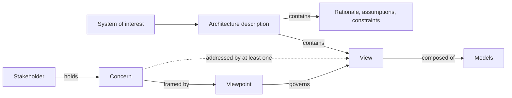

# SA-01: The Architecture Practice — Description, Stakeholders & Accountability

> **Module type:** Extension module (elective deep dive) — part of [EXT-SA](index.md)
> **Status:** Draft
> **Version:** v0.1
> **Last Reviewed:** 2026-09-12
> **Domain Expert:** _Unassigned — required before Practitioner Approved_
> **Practitioner Reviewer:** _Unassigned — required before Practitioner Approved_

!!! warning "Not a credit-bearing unit"
    See the [series index](index.md) for the full extension-module position. SA-01 carries
    no credit points and does not feed [`docs/ksat-coverage.md`](../../ksat-coverage.md).

---

## Overview

A new security architect is usually given a title, a laptop and a system that needs an
architecture. What they are rarely given is the thing the role actually turns on: a shared
answer to *what an architecture description is, who it is for, and what it must contain to
be usable by anyone other than its author*.

Without that, the predictable happens. The architect produces a diagram. The diagram is
beautiful. The network team reads it as a network design, the project manager reads it as a
delivery plan, the assessor reads it as a control statement, and the developer ignores it.
Six months later nobody can say why the gateway is where it is, the person who knew has
left, and the decision gets re-litigated from scratch.

This module fixes the vocabulary problem first. It teaches the **ISO/IEC/IEEE 42010**
conceptual model — stakeholders, concerns, viewpoints, views, models and rationale — which
is the closest thing the discipline has to a neutral standard for what an architecture
description *is*. It then teaches the parts of the practice that surround the artefact:
eliciting concerns from stakeholders who do not know they have any, drawing the line
between architecture, design and engineering, choosing an operating model for the
architecture function, and recognising the failure modes that make architecture teams
unpopular.

SA-01 is deliberately method-free. TOGAF appears in [SA-02](sa-02-enterprise-architecture-and-togaf.md),
notation in [SA-03](sa-03-modelling-notation-and-decision-records.md). Here the question is
only: what are you producing, for whom, and how would anyone know if it was any good?

!!! note "Standard reference — verify before relying on it"
    This module states ISO/IEC/IEEE 42010 as revised in **2022**. That revision year and the
    clause structure are recorded as **unverified** in the
    [series verification table](index.md#verification-status). The *concepts* taught here
    are stable across revisions and are widely described in open secondary sources; the
    ISO text itself is a paid document and **is not required** for any lab.

---

## Where this module fits

| Unit / module | Relationship |
|---|---|
| [SC02 — Security Architecture](../../../core/units/SC02-security-architecture.md) | **Hard prerequisite.** SC02 T1 defines what security architecture is; SA-01 starts after that and asks what the *artefact* is. |
| [SE02 — Security Architecture](../../../degrees/strategic/security-engineering/SE02-security-architecture.md) | Applied architecture method. SA-01 supplies the description discipline SE02 assumes. |
| [SE01 — Secure System Design](../../../degrees/strategic/security-engineering/SE01-secure-system-design.md) | Security requirements (T4) are the main input to concern elicitation here. |
| [SC06 — Stakeholder Communication](../../../core/units/SC06-stakeholder-communication.md) | **Strong complement.** SC06 teaches communicating to an audience; SA-01 teaches structuring an artefact *for* multiple audiences at once. |
| [SA-02](sa-02-enterprise-architecture-and-togaf.md) | Successor — the same artefacts inside an enterprise method. |
| [SA-03](sa-03-modelling-notation-and-decision-records.md) | Successor — how the views are actually drawn and versioned. |
| [SE06 — Capstone: Architecture Design](../../../degrees/strategic/security-engineering/SE06-capstone-architecture-design.md) | The SE06 deliverable is an architecture description. SA-01 is the module that explains what one is. |

---

## Prerequisites

- [SC02 — Security Architecture](../../../core/units/SC02-security-architecture.md) (hard)
- [SE01 — Secure System Design](../../../degrees/strategic/security-engineering/SE01-secure-system-design.md) (recommended)
- [SC06 — Stakeholder Communication](../../../core/units/SC06-stakeholder-communication.md) (recommended)

---

## Learning outcomes

On completion, a learner can:

1. **Explain** the ISO/IEC/IEEE 42010 conceptual model and **differentiate** an
   architecture description from a design document, a control matrix and a network diagram.
2. **Analyse** a system context to identify architecturally significant stakeholders and
   elicit their concerns, including concerns the stakeholder cannot articulate unprompted.
3. **Select** and **justify** a set of viewpoints adequate to address a stated set of
   concerns, and **produce** a concern-to-view traceability matrix.
4. **Evaluate** an existing architecture document against the description criteria and
   **critique** its fitness for its stated audiences.
5. **Assess** candidate operating models for an architecture function against an
   organisational context, and **justify** a recommendation.
6. **Create** an architecture description skeleton — stakeholders, concerns, viewpoints,
   assumptions, constraints and rationale — for a system given only a brief.

> Bloom's 2–6, weighted to 4–6. Consistent with the strategic-layer expectations in
> [`docs/content-standards.md`](../../content-standards.md).

---
## AQF Level 7 Alignment

AQF Level 7 requires broad and coherent knowledge with depth in underlying principles, and
the ability to analyse and transmit knowledge to specialist and non-specialist audiences.
SA-01 addresses this directly: the module is *about* making technical reasoning legible to
distinct audiences with distinct concerns, and the summative requires the learner to defend
viewpoint selection to a non-specialist approver.

> This alignment statement is notional. SA-01 is not credit-bearing, so it has not been
> assessed against AQF descriptors through the accreditation process in
> [`docs/compliance/aqf-teqsa.md`](../../compliance/aqf-teqsa.md).

---

## Framework mappings

> **Provisional pending Framework Custodian review.** These do **not** feed
> [`docs/ksat-coverage.md`](../../ksat-coverage.md).

### NIST NICE DCWF

| Version | Work Role | Code | T-Code | Task | Demonstrated in |
|---|---|---|---|---|---|
| 2023 | Security Architect | SP-ARC-002 | T0050 | Design system security architecture and supporting infrastructure | Lab 1, Summative |
| 2023 | Enterprise Architect | SP-ARC-001 | T0473 | Document and address organisational requirements in system design | Lab 1, Lab 2 |
| 2023 | Systems Requirements Planner | SP-SRP-001 | T0033 | Consult with customers to evaluate functional requirements | Lab 2 |
| 2023 | Systems Requirements Planner | SP-SRP-001 | T0454 | Translate functional requirements into technical solutions | Lab 1 |

### SFIA 9

| Skill | Code | Level | Demonstrated in |
|---|---|---|---|
| Solution architecture | ARCH | Level 5 | Lab 1, Summative |
| Requirements definition and management | REQM | Level 4–5 | Lab 2 |
| Specialist advice | TECH | Level 5 | Summative |
| Stakeholder relationship management | RLMT | Level 4 | Lab 2 |
| Quality assurance | QUAS | Level 4 | Lab 3 |

### ASD Cyber Skills Framework

| Domain | Sub-domain | Proficiency | Demonstrated in |
|---|---|---|---|
| Security Architecture | Architecture Design & Description | Advanced | Lab 1, Summative |
| Security Architecture | Requirements & Stakeholder Engagement | Intermediate–Advanced | Lab 2 |
| Governance, Risk & Compliance | Assurance Review | Intermediate | Lab 3 |

### Project-local KSATs

| Type | ID | Statement | Demonstrated in |
|---|---|---|---|
| Knowledge | SA-01-K01 | Knowledge of the architecture-description conceptual model: stakeholder, concern, viewpoint, view, model kind, correspondence | Topic 1; Lab 1 |
| Knowledge | SA-01-K02 | Knowledge of architecturally significant requirements and how they differ from functional requirements | Topic 2; Lab 2 |
| Knowledge | SA-01-K03 | Knowledge of the boundary between architecture, design and engineering decisions | Topic 4 |
| Knowledge | SA-01-K04 | Knowledge of architecture-function operating models and their failure modes | Topics 5, 7 |
| Knowledge | SA-01-K05 | Knowledge of assumption and constraint recording, and assumption decay | Topic 6; Lab 1 |
| Skill | SA-01-S01 | Skill in eliciting concerns from stakeholders who cannot state them unprompted | Lab 2 |
| Skill | SA-01-S02 | Skill in constructing a concern-to-view traceability matrix | Lab 1, Lab 2 |
| Skill | SA-01-S03 | Skill in auditing an architecture document for description completeness | Lab 3 |
| Ability | SA-01-A01 | Ability to justify viewpoint selection to a non-specialist approver | Summative |
| Ability | SA-01-A02 | Ability to decline a decision that belongs to design or engineering, and say why | Topic 4; Formative 1 |
| Ability | SA-01-A03 | Ability to recognise when an architecture practice is failing and diagnose which failure mode | Topic 7; Formative 2 |

---

## Module structure

| Part | Topics | Labs | Notional hours |
|---|---|---|---|
| A — What an architecture description is | 1 | 1 | 5 |
| B — Stakeholders, concerns and requirements | 2 | 2 | 5 |
| C — Viewpoints and views | 3 | 1, 2 | 4 |
| D — The boundary of the role | 4 | — | 2 |
| E — Operating models and rationale | 5–6 | 1 | 2 |
| F — Failure modes and review | 7 | 3 | 2 |
| | | | **~20 hours** |

---
## Topics

### Topic 1: What an Architecture Description Actually Is

The 42010 conceptual model is small enough to hold in your head, and most architecture
failures are a violation of one of its relationships.

The load-bearing claims:

- **A concern belongs to a stakeholder, not to the architect.** If you cannot name the
  person who holds a concern, it is your preference, and it should not drive the design.
- **A viewpoint is a reusable specification; a view is an instance of it.** "Deployment
  viewpoint" is a template that says what such a view must show and for whom. The
  deployment view of *this* system is the artefact. Confusing the two is why organisations
  end up with thirty incompatible diagrams.
- **Every concern must be addressed by at least one view.** This is the most useful
  completeness test in the discipline, and it is mechanically checkable.
- **Rationale is part of the description, not commentary on it.** An architecture without
  recorded rationale cannot be maintained, only replaced.

**Where this goes wrong in security work.** Security architects habitually produce a
control-mapping spreadsheet and call it an architecture. A control matrix is a *view* — one
that addresses the assessor concern and almost nothing else. It says nothing about
structure, and it cannot answer "what breaks if this component fails".

### Topic 2: Stakeholders, Concerns and Architecturally Significant Requirements

Most stakeholders cannot state a concern. They can state a complaint, a preference, or a
solution they have already chosen. The architect turns those into concerns.

A working stakeholder set for an Australian enterprise or government security architecture:

| Stakeholder | Typical unstated concern | Surfaces as |
|---|---|---|
| System owner | Can this be signed off without career risk | Demands for certainty and a named assurance path |
| CISO | Residual risk landing on their risk register | Requests for more controls, late |
| Delivery manager | Schedule and cost impact of architecture decisions | Pressure to approve before analysis is done |
| Operations team | Who carries the pager for this | Resistance framed as a technical objection |
| Developers | Friction in the inner loop | Workarounds discovered later |
| Assessor (internal audit, IRAP, external) | Evidence availability and traceability | Late-stage rework |
| Data custodian / privacy officer | Where personal information travels and rests | Discovered at privacy assessment, after design freeze |
| End user | Task completion time | Shadow IT |

**Architecturally significant requirements.** A requirement is architecturally significant
if changing it later would force a structural change. That is the whole test. "Must support
MFA" is usually not architecturally significant — it is a component choice. "Must continue
to authenticate when the link to the identity provider is unavailable" is, because it
dictates topology, credential caching and failure behaviour.

> **Practice point.** Ask every stakeholder one question: *what would make you say this
> system had failed, even if it was up?* It produces concerns that requirements workshops
> do not.

### Topic 3: Viewpoints and Views

A viewpoint library is a decision an organisation should make once. Common libraries
overlap heavily; what matters is that each selected viewpoint is tied to a concern somebody
actually holds.

A serviceable default set for security architecture work:

| Viewpoint | Frames which concerns | Typical models |
|---|---|---|
| Context | Scope, external dependencies, edge trust boundaries | System context diagram, actor list |
| Functional / logical | What the system does, decomposition | Component and responsibility models |
| Information | What data exists, its classification, where it rests and travels | Data flow, classification overlay, residency map |
| Deployment / infrastructure | Where things run, failure domains, segmentation | Node and zone diagrams |
| Identity & access | Who can do what, under what assurance | Trust and authorisation models |
| Detection & response | What is observable, and by whom | Telemetry source map, detection coverage overlay |
| Operational | Who runs it, how change happens | Support and change models |
| Assurance | Control coverage, evidence, residual risk | Control mapping, risk register extract |

Two rules that save a great deal of argument:

1. **Do not produce a view nobody has a concern for.** It will not be maintained.
2. **Do not overload one view.** The instinct to put segmentation, data classification and
   identity on a single diagram produces a picture that is unreadable and simultaneously
   wrong for all three audiences.

> **Security-specific note.** The **detection and response viewpoint** is routinely absent
> from general architecture practice, and is the one a security architect most often has to
> add. If nobody has asked what the system will look like to a SOC analyst at 3am, nobody
> has designed for that, and it will be retrofitted expensively. This connects directly to
> [SE04](../../../degrees/strategic/security-engineering/SE04-detection-response-engineering.md)
> and [DE02](../../../degrees/operational/detection-engineering/DE02-data-sources-log-engineering.md).
