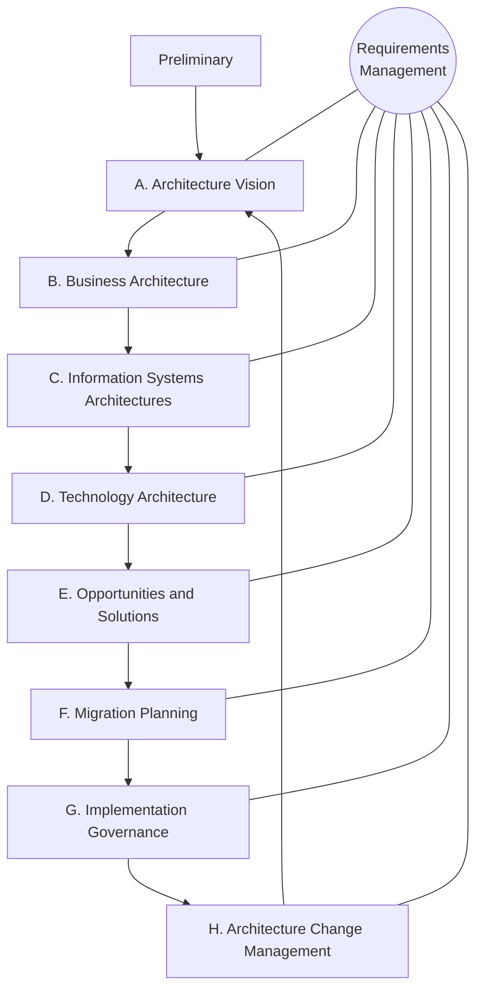
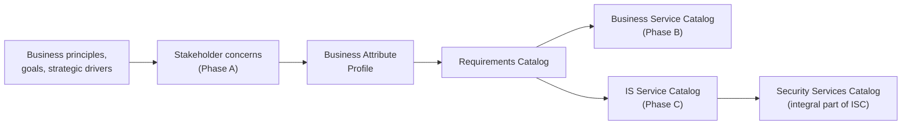
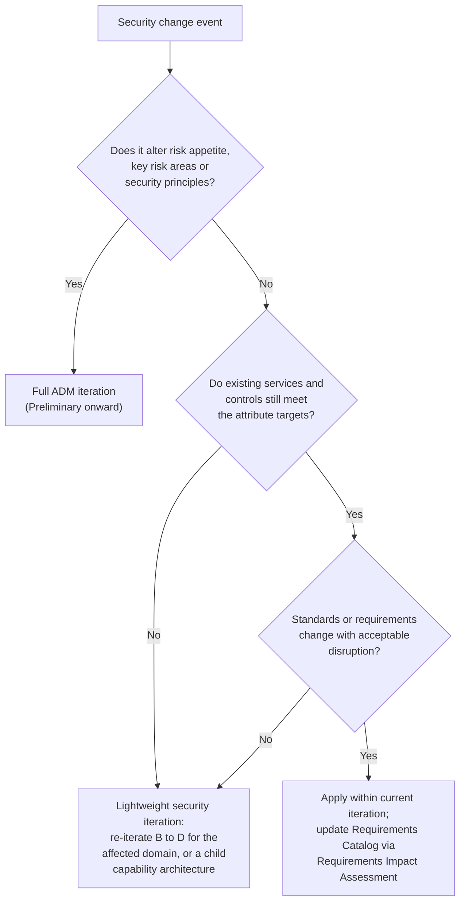

# SA-02: Integrating Security into Enterprise Architecture — SABSA and the TOGAF ADM

> **Module type:** Extension module (elective deep dive) — part of [EXT-SA](index.md)
> **Status:** Draft
> **Version:** v0.1
> **Last Reviewed:** 2026-09-12
> **Domain Expert:** _Unassigned — required before Practitioner Approved_
> **Practitioner Reviewer:** _Unassigned — required before Practitioner Approved_

!!! warning "Not a credit-bearing unit"
    SA-02 is an extension module in the [EXT-SA series](index.md). It carries
    **0 CP**, sits outside the 168 CP degree structure, and does not appear in
    [`docs/ksat-coverage.md`](../../ksat-coverage.md), which is generated from
    credit-bearing units only.

---

## Overview

Most organisations that run an enterprise architecture (EA) function also have a security team, and the two rarely produce one architecture. The security architect writes a separate document, late, and the EA team treats it as an attachment. The Open Group and SABSA Institute white paper *TOGAF and SABSA Integration* (W117, October 2011) describes the cost of that pattern: security bought piecemeal, requirement by requirement, with no traceable link to business goals and no analysis of long-term operational cost (W117 pp.6–7). Its remedy is to express SABSA in TOGAF's own vocabulary, so that security requirements and security services become ordinary artefacts of the Architecture Development Method (ADM) rather than a parallel product.

This module teaches that integration as a working practice: the ADM cycle (Preliminary, Phases A to H, Requirements Management) and the security inputs, activities and outputs W117 places in each phase; how a SABSA Business Attribute Profile becomes the security requirements input to the ADM and where it sits in the TOGAF content metamodel; how SABSA layers and lifecycle phases correspond to ADM phases and TOGAF architecture domains; where security artefacts sit in the architecture catalogues; the governance touchpoints from the security seat; risk-driven versus compliance-driven enterprise security; and how to decide when a change does not warrant a full ADM iteration. The Australian thread runs through the Preliminary Phase (ISM and PSPF obligations as business imperatives) and Phase G (where ISM security-assessment evidence is generated).

It does **not** teach SABSA fundamentals (layers, attributes and traceability), which are assumed from [SC02](../../../core/units/SC02-security-architecture.md) Topic 2 and [SE02](../../../degrees/strategic/security-engineering/SE02-security-architecture.md) Topic 1, with the SABSA matrix, lifecycle and attribute profiling in depth in [SA-01](sa-01-business-driven-architecture-in-practice.md). It does not teach TOGAF generically: only what W117 states about the ADM, the content metamodel and the catalogues is taught, and anything from the wider TOGAF Standard is labelled and listed as unverified. It does not teach ArchiMate or any notation. Policy hierarchy and exceptions belong to [GR01](../../../degrees/strategic/grc/GR01-security-governance-design.md); roadmap and investment-case craft to [LD02](../../../degrees/strategic/leadership/LD02-security-strategy-roadmapping.md); ISM evaluation and IRAP to SE02 Topic 5 and [GR05](../../../degrees/strategic/grc/GR05-audit-assurance.md).

Primary sources: The Open Group and The SABSA Institute, *TOGAF and SABSA Integration* (W117, October 2011); the ADM cycle as published by The Open Group; and ASD *ISM — Guidelines for security assurance* (September 2026) for the Australian context. W117 is written against TOGAF 9 and this module does not attribute later-edition content to it.

---

## Where this module fits

| Unit / module | Relationship |
|---|---|
| [SA-01 — Business-Driven Security Architecture in Practice](sa-01-business-driven-architecture-in-practice.md) | **Predecessor.** Produces the Business Attribute Profile, SABSA matrix and lifecycle traceability that SA-02 places into the ADM. |
| [SC02 — Security Architecture (core)](../../../core/units/SC02-security-architecture.md) | **Hard prerequisite.** SABSA layers, attributes and traceability (Topic 2); architecture review as a continuous practice (Topic 6). |
| [SE02 — Security Architecture (major)](../../../degrees/strategic/security-engineering/SE02-security-architecture.md) | Applied SABSA (Topic 1), Australian regulatory context (Topic 5), review boards and exceptions (Topic 6). SA-02 adds the ADM mechanics SE02 does not cover. |
| [GR01 — Security Governance Design](../../../degrees/strategic/grc/GR01-security-governance-design.md) | Owns policy hierarchy, exception lifecycle and RACI; SA-02 refers to it for the Security Policy Architecture and Security Organization artefacts. |
| [LD02 — Security Strategy & Roadmapping](../../../degrees/strategic/leadership/LD02-security-strategy-roadmapping.md) | Owns roadmap sequencing and the investment case; SA-02 covers only where security risk enters Phase A business cases and Phase E/F ordering. |
| [GR05 — Audit & Assurance](../../../degrees/strategic/grc/GR05-audit-assurance.md) | IRAP as audit (Topic 5); SA-02 covers where Phase G evidence is generated, not the assessment. |
| [SE06 — Capstone: Architecture Design](../../../degrees/strategic/security-engineering/SE06-capstone-architecture-design.md) | The summative is shaped like an SE06 planning deliverable but is not SE06. |
| SA-03 (later module) | **Successor.** Modern defensible architecture and CSF 2.0 as architecture inputs. SA-06 (later module) takes up ISM system authorisation and capability maturity. |

---

## Prerequisites

- [SC02 — Security Architecture](../../../core/units/SC02-security-architecture.md) (required)
- [SA-01 — Business-Driven Security Architecture in Practice](sa-01-business-driven-architecture-in-practice.md) (strongly recommended; labs assume a Business Attribute Profile exists)
- [SE02 — Security Architecture](../../../degrees/strategic/security-engineering/SE02-security-architecture.md) Topics 1, 5 and 6 (recommended)
- [GR01 — Security Governance Design](../../../degrees/strategic/grc/GR01-security-governance-design.md) Topic 3 (recommended)
- [SC01 — Risk Management Frameworks](../../../core/units/SC01-risk-management-frameworks.md) (assumed)

---

## Learning outcomes

On completion, a learner can:

1. **Analyse** the TOGAF ADM cycle from a security perspective and locate the security inputs, activities and artefacts W117 assigns to the Preliminary Phase, Phases A–H and Requirements Management.
2. **Construct** the path from a SABSA Business Attribute Profile to the TOGAF Requirements Catalog and service catalogues, including the metamodel attributes W117 proposes.
3. **Evaluate** a proposed set of security artefacts against an engagement's scope, abstraction level and Security Resource Plan, and **justify** what is omitted.
4. **Differentiate** risk-driven from compliance-driven enterprise security and **critique** a control-objective set that is not justified by business attributes.
5. **Design** the security governance touchpoints for an ADM engagement, including change board membership and the rules for choosing between a within-iteration change, a lightweight security iteration and a full ADM cycle.
6. **Assess** how an ADM-based enterprise security architecture coexists with ISM security-assessment expectations in an Australian organisation, stating what the sources support and what remains unverified.

> Bloom's 4–6 (Analyse / Evaluate / Create), consistent with the strategic-layer
> expectations in [`docs/content-standards.md`](../../content-standards.md).

---

## AQF Level 7 Alignment

The module develops specialised knowledge of how a security architecture method is embedded in an enterprise architecture method (AQF 7.1); analytical skills in mapping artefacts across frameworks, selecting a defensible subset and arguing the iteration decision (AQF 7.2); and application with initiative and judgement to a realistic Australian engagement where the learner is accountable for stating what the architecture does and does not cover (AQF 7.3).

> This alignment statement is notional. SA-02 is not credit-bearing, so it has not been
> through the AQF mapping process in
> [`docs/compliance/aqf-teqsa.md`](../../compliance/aqf-teqsa.md).

---

## Framework mappings

> **Provisional pending Framework Custodian review.** These do **not** feed
> [ksat-coverage](../../ksat-coverage.md).

### NIST NICE DCWF

| Version | Work Role | Code | T-Code | Task | Demonstrated in |
|---|---|---|---|---|---|
| 2023 | Security Architect | SP-ARC-002 | T0050 | (paraphrase) Design system security architecture and supporting infrastructure | Lab 2, Summative |
| 2023 | Enterprise Architect | SP-ARC-001 | T0473 | (paraphrase) Document and address organisational requirements in system design | Lab 1, Summative |

### SFIA 9

| Skill | Code | Level | Demonstrated in |
|---|---|---|---|
| Enterprise and business architecture | STPL | Level 5 | Lab 2, Summative |
| Requirements definition and management | REQM | Level 4 | Lab 1 |
| Governance | GOVN | Level 6 | Lab 3, Summative |
| Information security | SCTY | Level 5 | Topic 8, Summative |

### ASD Cyber Skills Framework

| Domain | Sub-domain | Proficiency | Demonstrated in |
|---|---|---|---|
| Security Architecture | Enterprise Security Architecture | Advanced | Lab 2, Summative |
| Governance, Risk and Compliance | Risk Management | Practitioner–Advanced | Topic 8, Lab 3 |
| Governance, Risk and Compliance | Security Governance | Practitioner | Lab 3 |

### Project-local KSATs

| Type | ID | Statement | Demonstrated in |
|---|---|---|---|
| Knowledge | SA-02-K01 | Knowledge of the ADM phases and the security artefacts W117 assigns to each | Topic 2; Lab 2 |
| Knowledge | SA-02-K02 | Knowledge of how a Business Attribute Profile enters the Requirements Catalog and content metamodel | Topic 3; Lab 1 |
| Knowledge | SA-02-K03 | Knowledge of TOGAF scope levels, SABSA domain modelling and nested architectures | Topic 4; Lab 2 |
| Knowledge | SA-02-K04 | Knowledge of the Phase G and Phase H security governance processes and change drivers | Topic 7; Lab 3 |
| Knowledge | SA-02-K05 | Knowledge of the balanced view of operational risk and primary versus secondary assets | Topic 8; Formative 2 |
| Skill | SA-02-S01 | Skill in producing Requirements Catalog entries with measurement approach, metric and target | Lab 1 |
| Skill | SA-02-S02 | Skill in producing a Security Resource Plan and an artefact-by-phase plan | Lab 2 |
| Skill | SA-02-S03 | Skill in writing a change-board decision memo on iteration scope | Lab 3 |
| Ability | SA-02-A01 | Ability to justify omitting artefacts without weakening the architecture | Lab 2; Summative |
| Ability | SA-02-A02 | Ability to distinguish a justified control objective from a checklist import | Formative 2 (warm-up); Summative |
| Ability | SA-02-A03 | Ability to decide iteration scope under competing risk, cost and disruption | Lab 3; Summative |

---

## Module structure

| Part | Topics | Labs | Notional hours |
|---|---|---|---|
| A — Why integrate, and the ADM as delivery process | 1–2 | — | 4 |
| B — Requirements: the Business Attribute Profile in TOGAF terms | 3 | 1 | 5 |
| C — Scope, abstraction and the Preliminary Phase | 4–5 | 2 | 5 |
| D — Phases B to D: business-level security and the catalogues | 6 | 2 | 3 |
| E — Governance touchpoints and the risk stance | 7–8 | 3 | 4 |
| F — Iteration decisions and where the ADM stops | 9 | 3, Summative | 3 |
| | | | **24 hours** |

---

## Topics

### Topic 1: Why Integrate: Three Cornerstones and One Corollary

W117's diagnosis is one most practitioners recognise. Security is commonly designed and bought piecemeal: a requirement appears, a specification follows, a product is installed. The result is ad hoc, non-interoperable measures with unanalysed operational cost and no traceable link to business goals (W117 pp.6–7). A business-driven enterprise security architecture fixes that only if it is *part of* the enterprise architecture, consuming EA information and feeding information back, which needs a common language. W117 supplies one by describing SABSA in TOGAF terms.

The paper rests on three cornerstones (W117 p.16). **Risk management drives the selection of security measures**, and SABSA's operational-risk approach is business-driven rather than threat-driven: it weighs the opportunity a capability enables as well as the loss it might suffer. **Requirements management is central**; TOGAF is requirements-driven but supplies no technique for writing requirements, and Business Attribute Profiling is that technique. **The ADM is the delivery process**, so the paper shows which security artefacts belong in each phase. The corollary W117 states without hedging is that the security architect must be a member of the enterprise architecture team, not a reviewer consulted at the end.

W117 also sets three mapping rules, because no single mapping satisfies everyone: map an artefact at the highest (enterprise) level where it could appear at several; choose the most obvious of two defensible mappings; and limit the integration to the most important elements (W117 p.16). These explain why some artefacts sit in Phase G at enterprise level but Phase C in a solution architecture (Topic 4). W117 is a 2011 white paper written against TOGAF 9 by a joint working group of The Open Group's Architecture and Security Forums and The SABSA Institute; it is not part of the TOGAF Standard, and this module makes no claim about later editions (see Verification status).

### Topic 2: The ADM as the Security Architect's Delivery Calendar

The ADM is TOGAF's iterative process for developing an architecture, cycling through framework establishment, content development, transition and governance of realisation (W117 p.9, citing TOGAF 9 Chapter 5). The cycle has a Preliminary Phase, eight lettered phases A to H, and Requirements Management at the hub connected to every lettered phase. The diagram below is an original redrawing of that topology.

W117 selects only SABSA artefacts that are security-specific, architecture-related (not individual measures), well defined in the SABSA Blue Book or later public work, and relevant at enterprise level (W117 p.32). Its Figure 16 gives the selected artefact list; this module's reading of the figure text yields 25 entries with 24 distinct names, including Control Objectives and the Security Services Catalog twice (business and information-system level), and the count should be confirmed against a rendered copy. The table below is this module's reading of where each first appears, taken from the per-phase prose (W117 pp.34–47).

| ADM phase | Security artefacts and processes (W117) |
|---|---|
| Preliminary | Business Drivers for Security; Security Principles; Key Risk Areas; Risk Appetite; Security Resource Plan |
| A. Architecture Vision | Security Stakeholders; Business Attribute Profile (basis for views and business case) |
| B. Business Architecture | Business Risk Model; Applicable Law and Regulation; Control Frameworks; Security Domain Model; Trust Framework; Security Organization; Security Policy Architecture; Security Services Catalog (business level) |
| C. Information Systems Architectures | Security Services Catalog (IS level); Classification of Services; Security Rules, Practices and Procedures (solution level) |
| D. Technology Architecture | Security Standards; Security Rules, Practices and Procedures (solution level) |
| E. Opportunities and Solutions | No new artefact; risk owners consulted on roadmap ordering; efficacy of re-used controls verified |
| F. Migration Planning | No new artefact; risks and controls identified per roadmap stage |
| G. Implementation Governance | Security Management; Security Audit; Security Awareness |
| H. Architecture Change Management | Risk Management and Security Architecture Governance (processes, not artefacts) |
| Requirements Management | Requirements Catalog holding security requirements as an integral part; Control Objectives (enablement and control objectives sit in the requirements chain, W117 p.24; the per-phase prose assigns them no single phase) |

The shape of the table matters more than the list. Phases B to D carry almost every new artefact because that is where architecture content is developed; E and F add none because they order and schedule what B to D produced, so the security work there is verification and roadmap placement rather than design. Requirements Management at the hub means security requirements are revisited in every phase, not signed off once in Phase A.

!!! warning "Figure highlighting not verified"
    W117 Figures 17–23 highlight the artefacts applying in each phase graphically. This
    module was prepared from the text; treat the table as an interpretation to be checked
    against the figures.

### Topic 3: From Business Attribute Profile to Requirements Catalog

TOGAF validates and updates requirements in every phase but, as W117 puts it, does not provide a concrete technique for describing or documenting them; it states only the requirements for requirements management (W117 pp.21–22). SABSA supplies the technique. A Business Attribute Profile decomposes a capability into attributes, each redefined for the enterprise and given a measurement approach, specific metric(s) and a performance target (W117 pp.22–23). Because the requirements are quantified, performance can later be monitored against them, which is what makes Manage & Measure possible.

Using only TOGAF artefacts, the flow W117 describes is this (W117 pp.24–26): business principles, goals and strategic drivers are usually defined elsewhere and are validated in Phase A; stakeholder **concerns**, including security, are captured in Phase A and determine acceptability; the profile states the level of protection required per capability; the **Requirements Catalog** stores all architecture requirements with security requirements as an integral part; the Business Service Catalog (Phase B) and Information System Service Catalog (Phase C) hold services; and the Security Services Catalog, defined at the SABSA logical layer, becomes part of the IS Service Catalog.

W117 then proposes a home in the **content metamodel**: the Motivation Extension, at the object *Goal*, which already relates to *Driver* (compare SABSA business driver) and *Objective* (compare SABSA control objective). Goal's existing attributes (ID, Name, Description, Category, Source, Owner) apply, and three are added: measurement approach, specific metric(s), performance target (W117 pp.26–27). The TOGAF Requirements Impact Assessment, run when requirements change (W117 p.22), can then work against measurable security requirements. W117's ambition is broader than security: it suggests the profile could carry all quality requirements and transform TOGAF requirements management (W117 p.25). Producing the profile is SA-01; Lab 1 here is the placement.

### Topic 4: Scope, Abstraction and Nested Architectures

Mapping an artefact to a phase depends on the level at which the architecture is being developed. W117's example is an access-control policy: produced in Phase C of a solution architecture, but too detailed for an enterprise architecture, where it is left to Phase G (W117 p.30). Formally the ADM applies at enterprise level and narrows scope through Strategy, Segment and Capability; W117 states that TOGAF is not equipped for solution architectures, the closest fit, Phase E of a capability architecture, yielding a roadmap rather than a design (W117 p.30). Projects mix the levels in practice, which is why W117 rules that the enterprise level wins (W117 p.32).

SABSA scopes by domain modelling, which covers the whole SABSA lifecycle and so extends beyond the ADM's core phases into solution design and operations (W117 p.31). A domain hierarchy can follow the organisation (extended enterprise down to team), functional roles, or a strategic-to-operational lifecycle view. A security domain is a set of assets sharing similar business attributes, so the domain model also defines where responsibility is exchanged with external parties and where security levels differ (W117 p.39). Appendix B adds nesting: Strategic, Segment and Capability Architectures direct one another, Phase F can spawn child projects, and SABSA nests the same way at Enterprise, Domain and Solution level (W117 pp.54–55), so a narrow security concern can be a child architecture with its own smaller iteration (Topic 9).

The table summarises the correspondence. The layers column is W117's own statement (p.13); the ADM column is this module's reading of the per-phase text and Figure 13, not verified visually.

| SABSA lifecycle phase | SABSA layers (W117 p.13) | ADM phases and TOGAF domains (interpretation) |
|---|---|---|
| Strategy & Planning | Contextual, Conceptual | Preliminary and Phase A (drivers, principles, appetite, profile) |
| Design | Logical, Physical, Component, Service Management | Phases B (Business), C (Information Systems), D (Technology): catalogues and standards |
| Implement | — | Phases E to G: roadmap, migration, implementation governance |
| Manage & Measure | — | Outside the ADM; Phase H and continual requirements validation carry the architecture side (W117 pp.22, 53) |

### Topic 5: The Preliminary Phase: Security Context and the Security Resource Plan

The Preliminary Phase establishes the security context that guides everything after it (W117 p.34). Four artefacts are set here, each folded into the corresponding general deliverable: **Business Drivers for Security** (the subset of business drivers that affect security); **Security Principles** (the subset of business principles addressing security, inside the Architecture Principles); **Key Risk Areas** within scope, related to the opportunities security enables; and **Risk Appetite**, expressible as a boundary on an impact and likelihood grid, as profit-and-loss measures, or qualitatively, with W117's example of zero tolerance for loss of life or regulatory breach (W117 pp.34–35). Appetite can live inside suitably worded principles or stand alone if a key stakeholder must approve it; above the accepted level it names the mitigation strategy.

The fifth artefact is the one that makes later judgement calls possible. The **Security Resource Plan** decides what security resourcing the engagement needs, answered through stakeholder analysis: do influential security or risk stakeholders need specific views; does the architecture touch high-risk areas or a low appetite warranting subject matter expertise; can support be drawn as needed from an existing team or are dedicated security architects required in the EA team; and how many (W117 p.35). W117 then states that during this phase it is decided which security artefacts are really needed and who creates them, that not every artefact may be necessary, and that delivering all of them does not guarantee security is properly addressed. This is the paper's own licence for the right-sizing in Topic 9.

Appendix B restates the phase for SABSA practitioners: decide up front which parts of SABSA to use, the delivery format, and which abstraction layers the architecture will contain (W117 p.51); Figure 24's example uses only three. For Australian public-sector work, the drivers must include what W117's glossary calls **business imperatives**: government and legal obligations an agency must meet even where strategy documents are silent (W117 p.48). See Australian context.

### Topic 6: Phases B to D: Business-Level Security and the Catalogues

Phase B holds business-level trust, risk and controls, independent of any IT system (W117 p.38). The **Business Risk Model** results from a risk assessment on threats, likelihood and impact, with impacts aligned to the business attributes acting as pseudo-assets; classification happens here, every information asset has an owner and a business-approved classification, and the classification sets the maximum acceptable risk while the owner decides what mitigation is enough (W117 p.38). Alongside it sit **Applicable Law and Regulation**, **Control Frameworks**, the **Security Domain Model** (Topic 4), the **Trust Framework** (trust relationships and their basis; technology such as certificates or SAML conveys trust but cannot create it, W117 p.39), the **Security Organization** (risk ownership and the security management processes), and the **Security Policy Architecture**, which here is a placement question: which policy elements are re-used or new, and how the hierarchy maps to ADM stages (W117 p.39). Policy design itself is GR01 Topic 3.

Phase C is where the **Security Services Catalog** becomes concrete: services providing security-specific functionality within the IS architecture, mapped back to principles, drivers, risks and threats for traceability, and produced for both baseline and target if a gap analysis is needed (W117 p.40). It can be seeded from the Blue Book's logical-layer reference list, amended to the project's scope and abstraction level. The services join the TOGAF IS Services Catalog. **Classification of Services** then assigns each service a classification under the enterprise scheme, usually defined in the corporate information security policy (W117 p.41).

Phase D usually needs no separate security artefact. W117's position is that specific technology security artefacts are unnecessary provided the Technology Architecture incorporates the controls defined earlier; the security architect verifies they are present and used effectively (W117 p.42). **Security Standards** (public standards such as Common Criteria, TLS and SAML) are the Phase D artefact, and a stakeholder may request a dedicated technology security view. Security Rules, Practices and Procedures appear in C and D only at solution level (W117 pp.41–42).

### Topic 7: Governance Touchpoints from the Security Seat

Phase G gives assurance that detailed design and implemented systems adhere to the security architecture, so that deviations from Architecture Principles and implementation guidelines create no unacceptable risk (W117 p.44). **Security Management** defines detailed roles and responsibilities, implements security governance and defines key performance and key risk indicators. **Security Audit** comprises reviews of implemented processes, designs and code against policies and requirements, plus functional security testing and penetration testing. **Security Awareness** covers training for correct deployment and operation of security-relevant components and awareness for all users. W117 also prescribes an auditing process, or an extension of an existing internal-control process, using configuration review, audit of design, deployment and operations against objectives and policies, and functional and non-functional testing (W117 pp.44–45). For ISM-scoped systems this is where security-assessment evidence is generated (Australian context).

Phase H produces no tangible artefact but defines two processes W117 treats as essential (W117 p.46). **Risk Management** continuously evaluates the architecture against changes in business opportunity and security threat; if it can no longer mitigate new risk, or constrains the business too much, an architecture-change decision is required. **Security Architecture Governance** makes that decision, either as a minor change within the current iteration or as a completely new iteration. Change drivers include the threat environment, changed compliance requirements and discovered vulnerabilities, and W117 warns that security-driven changes are often more disruptive than incremental ones. Its conclusion is that the architecture change board, or whatever governance structure applies change management, must include suitably security-skilled individuals (W117 p.47). SE02 Topic 6 establishes that boards and exceptions exist; this topic is the decision mechanics inside them.

!!! warning "TOGAF-general governance terms"
    The TOGAF Standard uses terms such as *Architecture Board*, *architecture compliance
    review*, *architecture contract* and *dispensation*. W117 does not; it speaks of the
    architecture change board or any other governance structure, of deviations from
    principles and guidelines, and of the Requirements Impact Assessment. Where this module
    uses the general terms it does so as labels for the same touchpoints; their definitions
    are not verified against the current Standard.

### Topic 8: Risk-Driven versus Compliance-Driven Enterprise Security

W117 traces the industry habit of treating operational risk as threats, vulnerabilities and loss events to the banking-led origins of operational risk management and to the definition carried into ISO/IEC 27005:2011, and contrasts it with standards rooted in corporate governance, which treat risk as uncertainty of outcome balancing opportunity and threat. It names ISO 31000:2009 (with ISO/IEC 31010:2009), M_o_R (2007) and COSO ERM (2004) as the leading standards of that kind, plus The Open Group's FAIR-based Risk Taxonomy standard (2009) for quantitative assessment (W117 pp.17–18; editions as cited in 2011). SABSA embeds the balanced view: enabling benefit from opportunity as well as controlling threat, within the enterprise's risk appetite (W117 p.19).

Two consequences follow. The **primary assets at risk are business capabilities**; information and IT assets are secondary assets supporting them, which inverts the ISO/IEC 27005-style classification (W117 pp.19–20). And the requirements chain admits **enablement objectives** alongside control objectives; control objectives may be drawn from a framework such as ISO/IEC 27001 or COBIT only where the Business Attribute Profile justifies them (W117 p.24). Effective architecture means every driver is supported by a security service; efficient architecture means every service is justified by a driver at minimal cost (W117 p.23).

"Compliance-driven" is this module's label, not W117's, for importing a framework wholesale with nothing traced back to a capability; the checklist-versus-business-need argument itself is SC02 Topic 2 and is not repeated here, and Australian obligations remain non-negotiable inputs in either mode.

| Dimension | Risk-driven (W117 / SABSA) | Compliance-driven (module's label) |
|---|---|---|
| Asset at risk | The capability (primary); information and IT secondary | Information and IT assets |
| Objective types | Enablement and control objectives | Control objectives only |
| Effective vs efficient (W117 p.23) | Every driver supported by a service, and every service justified by a driver at minimal cost | Completeness against the framework is the only test; support of drivers and cost per service go unexamined |
| Failure mode | Effort spent proving traceability | Controls with no owner, no metric and no business reason |

### Topic 9: When a Full ADM Iteration Is Not Warranted

W117 never uses the phrase "lightweight iteration", but four of its statements together define when one is justified. In the **Preliminary Phase** the team decides which artefacts are really needed (W117 p.35). In **Phase E**, the efficacy of controls earmarked for re-use is verified; if unsatisfactory, the choice is remediation in the migration plan or re-iterating Phases B through D (W117 p.43). In **Phase H**, Security Architecture Governance chooses between a minor change within the current iteration and a new one, with due care because a change in enterprise risk appetite, or a seemingly small requirement change, can trigger a full cycle, whereas a change in security standards or requirements can usually be applied within the existing architecture, the trade-off being business improvement against threat against the disruption and cost of the change itself (W117 pp.46–47). And **nested architectures** let a narrow concern be a capability-level child (W117 pp.54–55).

The diagram and the practice below are the module's guidance built on those statements, not W117 content. A lightweight security iteration re-runs the Preliminary decision on artefact subset for the affected domain only; re-validates the attribute targets rather than the whole profile; re-iterates B to D for the domain (Security Domain Model, affected Security Services Catalog entries, classifications); passes through E and F only to re-verify re-used controls and place mitigations on the existing roadmap; and lands in G with the same audit and testing obligations as a full cycle. It never skips Phase G evidence or the change board's security-skilled review, and it always records why the Phase H decision was "within iteration" or "lightweight" rather than "full", because that reasoning is what an assessor will ask for.

Where the ADM stops is part of the decision. SABSA's Manage & Measure phase, monitoring operational performance against attribute targets, is out of scope for the ADM; W117 places it with Phase H and continual requirements validation on the TOGAF side and with the O-ISM3 standard on the operational side, noting that no detailed SABSA-to-O-ISM3 alignment had been attempted (W117 pp.22, 29, 53). Capability maturity is the later SA-06 module.

---

## Labs & exercises

All three labs are paper-based; no tooling is required beyond a text editor or spreadsheet. Each uses the fictional organisation supplied in the lab brief.

!!! warning "Authorisation boundary"
    Do not use your workplace's or a client's architecture repository, risk register,
    policy set or assessment reports in any lab or the summative. Use the fictional
    scenario supplied, or invent one. Real architecture documentation is usually
    classified or commercially sensitive, and reproducing it here is not authorised.

### Lab 1: Place a Business Attribute Profile into the ADM

**Objective:** Convert an existing Business Attribute Profile into TOGAF requirements artefacts with the metamodel attributes W117 proposes, and place the already-traced services into the TOGAF catalogues.

**Prerequisites:** Topics 1–3; a profile of at least eight attributes, with its attribute-to-control trace, from SA-01 or SC02 Lab 1 (SC02 is a prerequisite, so every learner has SC02 Lab 1 output; extend it to eight attributes if needed).

**Environment:** No tooling required; a spreadsheet is convenient.

**Instructions:**

1. For the scenario capability (a citizen-facing online service run by a fictional Australian state agency), write the Phase A stakeholder concerns that relate to security, one line each, naming the stakeholder who holds each.
2. For each attribute, write a Requirements Catalog entry carrying the six *Goal* attributes W117 lists (ID, Name, Description, Category, Source, Owner) plus the three it adds: measurement approach, specific metric(s), performance target (W117 p.27).
3. Take the attribute-to-control trace from SA-01 or SC02 Lab 1 as given. Tag each existing control objective as framework-sourced or attribute-derived, and add at least one enablement objective where the scenario supports it (Topic 8).
4. Assign each traced service a catalogue location (Business Service Catalog, IS Service Catalog or Security Services Catalog) and a catalogue identifier. Do not redraw the trace.
5. Identify any requirement that has a metric but no plausible data source, and note what Manage & Measure would need in order to report it.

**Expected output:** A requirements table of eight or more rows with all nine attributes populated; the objectives list tagged framework-sourced or attribute-derived with enablement objectives added; a catalogue placement table giving each service a location and identifier; and a short list of unmeasurable requirements with reasons.

**Reflection questions:**

1. Which attributes were hardest to give a performance target, and does that say more about the attribute or about the organisation's ability to measure?
2. Where a control objective came from a framework, could you state the justifying attribute without reading the framework's rationale? If not, is it a requirement?
3. W117 suggests the profile could carry all quality requirements. What would change in the EA team's Requirements Catalog if that were adopted?

### Lab 2: Security Resource Plan and Artefact-by-Phase Plan

**Objective:** Size the security involvement for an ADM engagement and decide which security artefacts will be produced, in which phase, by whom, and which will be omitted.

**Prerequisites:** Topics 2, 4–6; Lab 1.

**Environment:** No tooling required.

**Instructions:**

1. From the scenario (a segment architecture for a regulated financial-services entity consolidating three customer platforms), answer W117's four Security Resource Plan questions (W117 p.35) with a one-paragraph justification each.
2. State the scope level (strategic, segment or capability) and describe the SABSA domain model you will use to scope security, as one table or diagram.
3. Using the Figure 16 artefact list (Topic 2), produce a plan with columns: artefact, produce / reuse / omit, ADM phase, owner, host deliverable. Every "omit" must carry a reason and state what covers the gap.
4. Write the risk appetite statement in two forms: qualitatively, and as a boundary on an impact and likelihood grid.
5. Produce a baseline and target Security Services Catalog skeleton for one domain, with a classification column, and list the gap.

**Expected output:** A completed Security Resource Plan; a scope and domain statement; an artefact plan covering every Figure 16 entry with no unexplained omissions; two risk appetite expressions; and a baseline-versus-target catalogue skeleton for one domain.

**Reflection questions:**

1. W117 says delivering every artefact guarantees nothing. Which of your "produce" decisions is there to satisfy a stakeholder rather than a risk?
2. Which artefacts did you fold into a general EA deliverable, and what is lost if the EA team later removes that section without asking you?
3. If the engagement were re-scoped to a single capability, which rows change?

### Lab 3: The Change Board Decides

**Objective:** Apply the Phase H decision rules to a set of security change events and document each decision in a form a change board can act on.

**Prerequisites:** Topics 7–9.

**Environment:** No tooling required.

**Instructions:**

1. The brief supplies six change events for a fictional Australian critical infrastructure operator with an existing ADM-based architecture: a board-approved change in risk appetite; a new ISM release changing several controls; a vulnerability in a re-used authentication service; a new legal obligation on data handling; a proposed pilot processing personal data for a small user group; and a Phase E finding that a re-used logging control misses its attribute target.
2. For each event, outline the Requirements Impact Assessment: which Requirements Catalog entries, attributes and targets are affected.
3. Decide, for each: within iteration, lightweight security iteration, or full ADM cycle. Cite the W117 anchor and state the trade-off between business improvement, threat and disruption.
4. For the pilot, apply W117's Phase F point that a small pilot handling personal data must still be fully compliant (W117 p.43), and state which controls cannot be deferred.
5. For any event that is a significant change to an ISM-scoped system, note that ISM-2118 expects vulnerability assessment and penetration testing before deployment of the change, and place that in Phase G of whichever iteration you chose.
6. Write a one-page change board memo covering all six decisions, and list the skills the board needs present to approve it.

**Expected output:** Six decision records with impact assessment, decision, anchor and trade-off; a one-page memo; and a statement of board composition.

**Reflection questions:**

1. Which event was closest to the line between "within iteration" and "lightweight", and what single fact would have moved it?
2. Did any of your "within iteration" decisions understate disruption to avoid a new cycle?
3. What would you show an assessor to prove the risk appetite change was carried through to the Requirements Catalog?

---

## Assessment

### Formative 1: Which Phase?

**Type:** Placement exercise with answer key. **Maps to:** LO1, LO3.

Fourteen security artefacts and activities drawn from W117, plus four distractors that are either TOGAF-general terms not in W117 or solution-level artefacts. Place each in an ADM phase (or mark it "not an ADM artefact") and state the abstraction level at which the placement holds. The key argues the cases where enterprise and solution level differ.

### Formative 2: Justified or Imported?

**Type:** Critique exercise with answer key. **Maps to:** LO2, LO4.

A twenty-line control-objective set for a fictional organisation, about half traced to business attributes and half imported from a framework with no attribute justification. Warm-up (unassessed): sort justified from imported, the SC02 Lab 1 skill. Assessed: for each objective, name the asset at risk and classify it as a business capability (primary) or an information or IT asset (secondary) per W117 pp.19–20; then identify two enablement objectives the set is missing and state the opportunity each enables.

### Summative: Security Integration Plan for an ADM Engagement

**Type:** Practical planning deliverable. **Maps to:** LO1, LO2, LO3, LO4, LO5, LO6.

For a described Australian organisation (sector, scope level, EA maturity, regulatory obligations and current posture supplied in the brief), produce a 3,000–4,000 word plan with:

1. **Preliminary Phase security context**: drivers for security including business imperatives, security principles, key risk areas, risk appetite and Security Resource Plan.
2. **Requirements**: a Business Attribute Profile excerpt placed into Requirements Catalog entries with the W117 metamodel attributes, control and enablement objectives, and the justification for any framework-sourced objective.
3. **Artefact-by-phase plan**: the Figure 16 list with produce / reuse / omit, phase, owner and host deliverable; omissions justified.
4. **Governance touchpoints**: Phase G management, audit and awareness scope; Phase H risk management and security architecture governance; change board composition; and written decision rules for within-iteration, lightweight and full-cycle changes.
5. **Australian coexistence and limitations**: where ISM security-assessment evidence is produced, how the ISM-2118 significant-change trigger interacts with the Phase H rules, what the plan does not cover (system authorisation is deferred to the later SA-06 module), what remains unverified in its sources, and the residual risk accepted.

| Criterion | Exemplary | Proficient | Developing | Beginning |
|---|---|---|---|---|
| **ADM placement** | Every artefact placed with abstraction level stated and W117 anchor cited; level consequences explained | Placement correct with minor level ambiguities | Several artefacts misplaced or level not stated | Artefacts listed without phases |
| **Requirements integration** | All nine attributes populated; objectives distinguished and justified; catalogue placement complete | Attributes populated; placement mostly complete | Targets or metrics missing; objectives imported without justification | Profile reproduced without TOGAF placement |
| **Right-sizing** | Resource Plan answered from stakeholder analysis; omissions justified with gap coverage | Plan credible; most omissions justified | Produces everything or omits without reason | No Resource Plan |
| **Governance design** | Board composition and decision rules explicit, anchored in W117, applied to worked examples | Rules present and mostly anchored | Rules asserted without anchor or examples | Governance absent |
| **Australian coexistence** | Precise use of ISM assurance material; unverified items flagged; nothing overclaimed about authorisation | Correct and mostly precise | Generic or partly overclaimed | Absent or wrong |
| **Communication** | Readable by an EA lead and a CISO; limitations stated plainly | Clear with minor lapses | Disorganised or over-technical | Unclear |

| Assessment task | Learning outcomes addressed |
|---|---|
| Formative 1: Which Phase? | LO1, LO3 |
| Formative 2: Justified or Imported? | LO2, LO4 (the "critique" half of LO4 assumes SC02 Lab 1) |
| Summative components 1 and 3 (Preliminary context, Resource Plan, artefact plan) | LO1, LO3 |
| Summative component 2 (Requirements integration) | LO2, LO4 |
| Summative component 4 (Governance touchpoints and decision rules) | LO5 |
| Summative component 5 (Australian coexistence and limitations) | LO6 |

---

## Australian context

W117's Phase B artefact **Applicable Law and Regulation** is where Australian obligations enter the architecture as a named, owned artefact rather than an assumption (W117 p.39). The instruments the degree already covers are the ones to name: the *Privacy Act 1988* (Cth) with the Australian Privacy Principles and the Notifiable Data Breaches scheme ([F05](../../../core/units/F05-legal-ethics-compliance.md), [GR04](../../../degrees/strategic/grc/GR04-australian-regulatory-environment.md)); the *Security of Critical Infrastructure Act 2018* (Cth) ([SC01](../../../core/units/SC01-risk-management-frameworks.md)); APRA Prudential Standard CPS 234 for regulated financial entities (GR01 Topic 5); and, for non-corporate Commonwealth entities, the Protective Security Policy Framework (PSPF) administered by the Department of Home Affairs. This module names them only; substance is in those units.

W117's glossary defines **business imperatives** as government and legal obligations an agency must fulfil that may not be explicit in its strategy documents (W117 p.48). ISM and PSPF obligations are imperatives of exactly that kind: they must appear among the Preliminary Phase drivers for security even when the agency's stated strategy never mentions them, and they belong in the Requirements Catalog as owned requirements, not as an appendix. W117's example of a qualitative appetite, zero tolerance for regulatory breach (W117 p.35), is the natural form for an entity answering to the OAIC, APRA or, for ISM matters, ASD; that is an illustration of wording, not a claim about those regulators' expectations.

The ISM *Guidelines for security assurance* (September 2026) describe security assessments as activities providing assurance in the security posture of systems and their operating environments, comprising security control assessments, vulnerability scanning, vulnerability assessments and penetration tests, conducted by suitably skilled personnel independent of the system assessed. That closely matches W117's Phase G Security Audit artefact (W117 p.44), so for an ISM-scoped system the Phase G audit process is where assessment evidence is generated and the independence expectation should shape who performs it. Control ISM-2118 (revision 1, updated September 2026) expects vulnerability assessments and penetration tests before deployment, before deployment of significant changes, and at least every six months thereafter. The significant-change trigger is the ISM-side counterpart to W117's Phase H decision (W117 p.46): whichever iteration scope the change board chooses, an ISM-scoped change still passes through Phase G testing before deployment. The ISM is revised regularly; confirm the control against the current release.

What the sources do **not** support must be stated. The assurance extract points to the *Guidelines for cyber security roles* for system owners' responsibility for security control assessments and to the *Guidelines for cyber security documentation* for system-specific documentation, but the system-authorisation process itself is not in any source read here and is deferred to the later SA-06 module. IRAP is treated by the degree as the assessment framework for systems handling Australian Government data (SE02 Topic 5, GR05 Topic 5); this module says only that an IRAP assessment consumes Phase G-type evidence. Claims about whole-of-government enterprise architecture practice or agency EA boards are unsupported by any source read and are omitted; the only defensible statement is that where a Commonwealth entity runs an EA function, ISM and PSPF obligations must be represented as drivers within it.

---

## Verification status

| Item | Status | Action required |
|---|---|---|
| Project-local KSAT IDs (SA-02-K01…A03) | **Provisional** | Framework Custodian review |
| NICE DCWF T-codes T0050, T0473 | **Provisional** | Verify codes, work-role membership and task wording against DCWF 2023; replace the paraphrased task wording with DCWF text |
| SFIA 9 codes and levels; ASD Cyber Skills Framework domain names | **Provisional** | Author's reading; Framework Custodian review |
| W117 metadata (title, number, October 2011, joint Open Group / SABSA Institute authorship) | **Verified** from the document | None |
| TOGAF edition: W117 is against TOGAF 9; current Standard edition and any adoption of W117 proposals | **Unverified** | Check the current Standard; do not attribute later content to W117 |
| Artefact-by-phase table (Topic 2) and lifecycle-to-ADM table (Topic 4) derived from prose, not Figures 13, 17–23 or 25 | **Interpretation** | Check against the figures in a rendered copy |
| Figure 16 entry count (25 entries, 24 distinct names by text extraction, including Control Objectives, which is placed under Requirements Management) | **Interpretation** | Confirm the count and placement against the rendered figure |
| TOGAF-general governance terms (Architecture Board, compliance review, architecture contract, dispensation) | **Not in W117** | Verify against the current TOGAF Standard or remove |
| TOGAF Architecture Repository partitions | **Not in W117; omitted** | Add only if verified against the Standard |
| Standards editions cited in W117 (ISO 31000:2009, ISO/IEC 31010:2009, ISO/IEC 27005:2011, ISO/IEC 27001:2005, COBIT 4.0, M_o_R 2007, COSO ERM 2004, C081 2009, O-ISM3 C102 2011) | **Historical citations** | Present as "as cited in W117"; several superseded |
| W055 revision status; SABSA Blue Book chapter and page references | **Via W117 only** | Verify against the primary documents if cited directly |
| ISM-2118 (Rev 1, Sep-26) wording and edition | **Verified** from the September 2026 extract | ISM is revised regularly; re-check each release |
| ISM system-authorisation process and terminology | **Not in any source read** | Deferred to SA-06 |
| Commonwealth / whole-of-government EA practice; PSPF policy structure and numbering | **Unsupported — omitted** | Add only with a primary source |
| W117 p.45 statement that documented training shows due diligence "in many jurisdictions" | **Omitted** | Australian applicability unverified; do not add |
| Australian legislation names (Privacy Act 1988 (Cth); SOCI Act 2018 (Cth); APRA CPS 234); PSPF (applies to non-corporate Commonwealth entities; administered by the Department of Home Affairs) | **Repository wording** | Substance verified in F05, GR04, GR01, SC01 and (PSPF) EXT-ANS, not here; confirm PSPF administration at protectivesecurity.gov.au before Practitioner Approved |
| ISM landing URL in Further reading | **Checked 2026-09-12** | Resolved live; the older cyber.gov.au path used elsewhere in the repository redirects to it |

This module has **not** had practitioner review (R2) and must not be presented as verified content until a Domain Expert and Practitioner Reviewer have signed off.

---

## Further reading

**The Open Group and The SABSA Institute (2011).** *TOGAF and SABSA Integration: How SABSA and TOGAF complement each other to create better architectures* (W117). https://www.opengroup.org
> Relevance: The primary source for the whole module. Locate via The Open Group library or
> sabsa.org; the deep link is not reproduced here.

**The Open Group (accessed 2026-09-12).** *The TOGAF Standard.* https://www.opengroup.org/togaf
> Relevance: The ADM, content metamodel and catalogues W117 maps onto. Access terms apply;
> W117 cites TOGAF 9 and the current edition is unverified here.

**The SABSA Institute (accessed 2026-09-12).** *SABSA white papers and publications.* https://sabsa.org
> Relevance: Home of the SABSA White Paper (W100, the basis of SA-01) and the Institute's
> position on W117. Copyright The SABSA Institute.

**Sherwood, J., Clark, A. and Lynas, D. (2005).** *Enterprise Security Architecture: A Business-Driven Approach* (the SABSA Blue Book). Print publication; not freely available. Refer to sabsa.org (as cited in W117 reference 2).
> Relevance: The reference W117 cites for every artefact (domain model, trust framework,
> policy architecture, security services reference list). Paywalled.

**Australian Signals Directorate (2026).** *Information Security Manual — Guidelines for security assurance* (September 2026). https://www.cyber.gov.au/business-government/asds-cyber-security-frameworks/ism
> Relevance: Source of the security-assessment expectations and ISM-2118 used in Topic 7
> and the Australian context. ISM landing page checked 2026-09-12. CC BY 4.0, Commonwealth
> of Australia (**Australian source**).

**Department of Home Affairs (accessed 2026-09-12).** *Protective Security Policy Framework (PSPF).* https://www.protectivesecurity.gov.au
> Relevance: The obligations that must appear as business imperatives among a non-corporate
> Commonwealth entity's drivers for security (**Australian source**).

**Office of the Australian Information Commissioner (accessed 2026-09-12).** *Australian Privacy Principles.* https://www.oaic.gov.au
> Relevance: The privacy obligations named in the Phase B Applicable Law and Regulation
> artefact and behind W117's small-pilot example (**Australian source**).

TOGAF, ArchiMate, COBIT, ITIL, M_o_R and SABSA are trademarks or registered trademarks of their respective owners, as acknowledged in W117.

---

## Module metadata

| Field | Value |
|---|---|
| Module Code | SA-02 |
| Module Title | Integrating Security into Enterprise Architecture — SABSA and the TOGAF ADM |
| Module Type | Extension module (elective; **not** credit-bearing) |
| Version | v0.1 |
| Status | Draft |
| Credit Points | 0 CP — outside the 168 CP degree structure |
| Notional Hours | 24 |
| Extends | SC02 (Security Architecture); SE02 (Security Architecture, major) |
| Related Units | SA-01, SC01, SE06, GR01, GR04, GR05, LD02, F05 |
| Prerequisites | SC02 (required); SA-01 (strongly recommended); SE02 Topics 1, 5, 6 and GR01 Topic 3 (recommended) |
| Domain Expert | _Unassigned — required before Practitioner Approved_ |
| Practitioner Reviewer | _Unassigned — required before Practitioner Approved_ |
| Last Reviewed | 2026-09-12 |
| Framework Version — NICE DCWF | 2023 |
| Framework Version — SFIA | SFIA 9 (2023) |
| Framework Version — ASD CSF | 2024 |
| Bloom's Level (range) | 4–6 (Analyse / Evaluate / Create) |
| Australian Legislation Referenced | Privacy Act 1988 (Cth); Security of Critical Infrastructure Act 2018 (Cth); APRA CPS 234 (prudential standard) |
| Tooling Licence Position | No tooling required; all labs paper-based (R3) |
| Licence | CC BY 4.0 |
