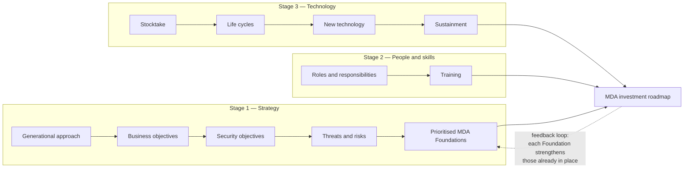
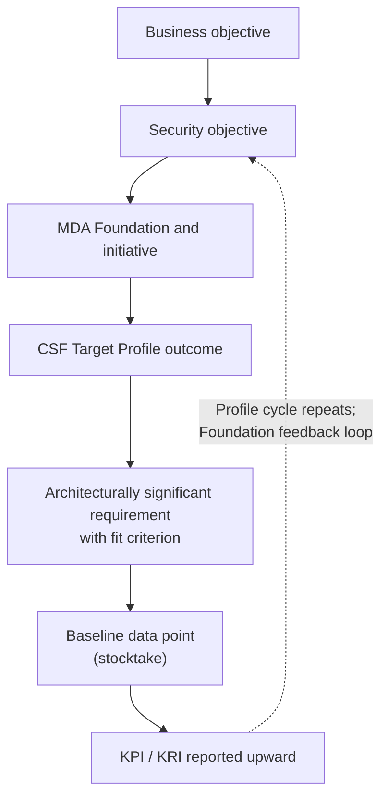

# SA-03: Modern Defensible Architecture and NIST CSF 2.0

> **Module type:** Extension module (elective deep dive) — part of [EXT-SA](index.md)
> **Status:** Draft
> **Version:** v0.1
> **Last Reviewed:** 2026-09-12
> **Domain Expert:** _Unassigned — required before Practitioner Approved_
> **Practitioner Reviewer:** _Unassigned — required before Practitioner Approved_

!!! warning "Not a credit-bearing unit"
    SA-03 is part of the [EXT-SA series](index.md), an optional extension of the degree's architecture units. It carries **0 CP**, sits outside the 66-unit / 160 CP structure described in [`docs/structure.md`](../../structure.md), and does not appear in [`docs/ksat-coverage.md`](../../ksat-coverage.md) or the [Program Builder](../../program-builder/index.md), which are generated from credit-bearing units only. Recognition, if a delivery partner wants it, uses the Tier 1 badge mechanism in [`docs/curriculum/micro-credentials-framework.md`](../../curriculum/micro-credentials-framework.md).

---

## Overview

An architect who has finished SC02 can draw a layered architecture, explain Zero Trust and evaluate a design against the ISM. What that graduate usually cannot yet do is turn a board's three-year strategy into a funded, sequenced programme of architectural change, and then show, two budget cycles later, that the money bought the outcomes it was meant to buy. That is the gap this module addresses. It is a gap that shows up in Australian organisations in a specific form: a security roadmap that lists products, a control framework that lists controls, and no traceable line between the two and the business.

The module is built on two documents. The first is ASD's *Investing in modern defensible architecture* (2025), the ACSC's guidance on building a Modern Defensible Architecture (MDA) investment roadmap from organisational strategy, people and skills, and technology. The second is NIST's *The NIST Cybersecurity Framework (CSF) 2.0* (NIST CSWP 29, 2024). The module treats both as **inputs to architecture**: MDA supplies the method for deriving and prioritising what to build, and the CSF 2.0 Core, Organizational Profiles and Tiers supply a vocabulary of outcomes from which architecturally significant requirements, target states and measures can be derived and communicated.

The module teaches: the MDA three-stage investment roadmap exactly as ASD describes it; the generational approach as a transition-state model; Stage 1 elicitation from business objectives through security objectives to MDA Foundations; threat-informed prioritisation of Foundations; deriving architecturally significant requirements from CSF 2.0 Core outcomes; Current and Target Organizational Profiles and Tiers as a way to sequence and justify architecture investment; people, skills, technology lifecycle, procurement and sustainment as architecture constraints; and a measurement chain from business objective to CSF-aligned indicator.

It does **not** teach the things the degree already covers. Zero Trust architecture is assumed from [SC02 Topic 4](../../../core/units/SC02-security-architecture.md) and [SE02 Topic 2](../../../degrees/strategic/security-engineering/SE02-security-architecture.md); secure-by-design and security requirements from threat models from [SE01](../../../degrees/strategic/security-engineering/SE01-secure-system-design.md); the CSF 2.0 Govern function from [GR01 Topic 2](../../../degrees/strategic/grc/GR01-security-governance-design.md); applying CSF 2.0 for compliance assessment, Essential Eight assessment and control crosswalks from [GR03](../../../degrees/strategic/grc/GR03-compliance-frameworks.md); and SABSA layering and attribute profiling from SC02 and [SA-01](sa-01-business-driven-architecture-in-practice.md). Where MDA touches those topics, this module links rather than re-teaches.

---

## Where this module fits

| Unit / module | Relationship |
|---|---|
| [SA-01 — Business-Driven Security Architecture in Practice](sa-01-business-driven-architecture-in-practice.md) | **Series predecessor.** SA-01 derives requirements from business attributes (SABSA); SA-03 derives them from strategy, threats and CSF outcomes. Both feed the same traceability chain. |
| [SA-02 — Integrating Security into Enterprise Architecture](sa-02-integrating-security-into-enterprise-architecture.md) | Series module on SABSA and the TOGAF ADM; the MDA roadmap in SA-03 is one input an ADM cycle would consume. |
| [SC02 — Security Architecture](../../../core/units/SC02-security-architecture.md) | **Hard prerequisite.** Topics 2 (layering and traceability), 4 (Zero Trust) and 6 (evaluation against ISM and Essential Eight) are assumed and linked, not repeated. |
| [SE02 — Security Architecture (major)](../../../degrees/strategic/security-engineering/SE02-security-architecture.md) | Applied SABSA, applied ZTA and Australian regulatory context. SA-03 sits after SE02 Topic 6 (architecture governance) and supplies the investment logic that unit does not. |
| [SE01 — Secure System Design](../../../degrees/strategic/security-engineering/SE01-secure-system-design.md) | Secure-by-design (one of MDA's three bases) and threat-derived requirements (Topic 4). SA-03 Topic 5 derives requirements from CSF outcomes instead, and shows how the two sets reconcile. |
| [GR01 — Security Governance Design](../../../degrees/strategic/grc/GR01-security-governance-design.md) | Owns the Govern function. SA-03 consumes GV outcomes (context, risk appetite, supply chain) as architecture inputs only. |
| [GR03 — Compliance Frameworks](../../../degrees/strategic/grc/GR03-compliance-frameworks.md) | Owns applying CSF 2.0 for compliance posture, Essential Eight assessment and crosswalks. SA-03 uses Profiles and Tiers to sequence architecture investment, not to assess compliance. |
| [LD02 — Security Strategy & Roadmapping](../../../degrees/strategic/leadership/LD02-security-strategy-roadmapping.md) | The leadership view of the same roadmap. LD02 builds the investment case; SA-03 supplies the architectural content and measures that case needs. |
| [SC04 — Vendor & Supply Chain Risk](../../../core/units/SC04-vendor-supply-chain-risk.md) | MDA Stage 3 procurement questions and CSF GV.SC / ID.RA-09 / ID.RA-10 assume this unit. |
| [SE06 — Capstone: Architecture Design](../../../degrees/strategic/security-engineering/SE06-capstone-architecture-design.md) | The summative here is shaped like an SE06 deliverable but is scoped to the investment roadmap and requirements package, not the full design. |
| Later series modules | SA-04 (network, gateway and access architecture under the ISM), SA-05 (logging and monitoring architecture) and SA-06 (assurance and authorisation) take the requirements derived here into specific architecture domains. Not yet published. |

---

## Prerequisites

- [SC02 — Security Architecture](../../../core/units/SC02-security-architecture.md) (required; Topics 2, 4 and 6 in particular)
- [SE02 — Security Architecture](../../../degrees/strategic/security-engineering/SE02-security-architecture.md) (strongly recommended; Topics 2, 5 and 6)
- [GR01 — Security Governance Design](../../../degrees/strategic/grc/GR01-security-governance-design.md) Topic 2 (the CSF 2.0 Govern function) (assumed)
- [SA-01 — Business-Driven Security Architecture in Practice](sa-01-business-driven-architecture-in-practice.md) (recommended; the attribute-based traceability chain this module complements)
- [LD02 — Security Strategy & Roadmapping](../../../degrees/strategic/leadership/LD02-security-strategy-roadmapping.md) Topics 4–5 (recommended; the cost-benefit and metrics method Lab 3 relies on)
- Access to the two source documents (both free): ASD *Investing in modern defensible architecture* and NIST CSWP 29

---

## Learning outcomes

On completion, a learner can:

1. **Analyse** an organisation's business objectives, security objectives, threats and risks using the MDA Stage 1 method, and trace each security objective to the MDA Foundations it requires.
2. **Evaluate** competing architecture initiatives against ASD's stated prioritisation factors (leverage of existing technology, attack-surface reduction, skills, resources, cost, value and outcomes) and **justify** a sequenced investment roadmap.
3. **Formulate** architecturally significant requirements with testable fit criteria from NIST CSF 2.0 Core outcomes, distinguishing outcomes that constrain structure from those that constrain process.
4. **Design** Current and Target Organizational Profiles scoped to a single system or platform, and use CSF Tiers to justify multi-year architecture investment to decision-makers.
5. **Assess** the people, skills, technology lifecycle, procurement and sustainment constraints on an architecture roadmap and **recommend** how each is resourced.
6. **Construct** a measurement chain from business objective to CSF-aligned key performance and key risk indicators that reports architecture investment progress upward.

> Bloom's 4–6 (Analyse / Evaluate / Create), consistent with the strategic-layer expectations
> in [`docs/content-standards.md`](../../content-standards.md) for a module that extends
> major-level architecture units.

---

## AQF Level 7 Alignment

**Knowledge (AQF 7.1):** Develops specialised knowledge of how an Australian architecture position (MDA) and an international outcome taxonomy (CSF 2.0) are converted into requirements, target states and investment sequencing. **Skills (AQF 7.2):** Develops the cognitive skills to elicit and prioritise under uncertainty, to write requirements that can be tested, and to communicate architecture progress in the risk language executives use. **Application (AQF 7.3):** Applies these with judgement to a realistic Australian organisation with constrained budgets, legacy technology and skills gaps, and takes responsibility for stating what the roadmap does not deliver.

> This alignment statement is notional. SA-03 is not credit-bearing, so it has not been
> through the AQF mapping process in
> [`docs/compliance/aqf-teqsa.md`](../../compliance/aqf-teqsa.md) and is not assessed
> against it.

---

## Framework mappings

> **Provisional pending Framework Custodian review.** These do **not** feed
> [ksat-coverage](../../ksat-coverage.md).

### NIST NICE DCWF

| Version | Work Role | Code | T-Code | Task | Demonstrated in |
|---|---|---|---|---|---|
| 2023 | Security Architect | SP-ARC-002 | T0050 | Design system security architecture and supporting infrastructure | Lab 2, Summative |
| 2023 | Enterprise Architect | SP-ARC-001 | T0473 | Document and address organisational requirements in system design | Lab 1, Lab 2 |
| 2023 | Systems Requirements Planner | SP-SRP-001 | T0033 | Conduct risk, feasibility or trade-off analysis to develop and refine requirements | Lab 1, Lab 2 |
| 2023 | Security Control Assessor | SP-RSK-002 | T0177 | Perform security reviews and identify gaps in security architecture for the risk mitigation strategy | Lab 3 |
| 2023 | Cyber Policy and Strategy Planner | OV-SPP-002 | T0001 | Acquire and manage the resources, including leadership support, financial resources and key personnel, needed to support security goals | Lab 3, Summative |

### SFIA 9

| Skill | Code | Level | Demonstrated in |
|---|---|---|---|
| Solution architecture | ARCH | Level 5 | Lab 2, Summative |
| Strategic planning | ITSP | Level 5 | Lab 1, Lab 3, Summative |
| Requirements definition and management | REQM | Level 4 | Lab 2 |
| Information security | SCTY | Level 5 | Lab 1, Lab 3 |
| Business situation analysis | BUSA | Level 4 | Lab 1, Lab 3 (measurement baseline) |

### ASD Cyber Skills Framework

| Domain | Sub-domain | Proficiency | Demonstrated in |
|---|---|---|---|
| Security Architecture | Architecture Strategy & Roadmapping | Advanced | Lab 1, Lab 3, Summative |
| Security Architecture | Security Requirements | Advanced | Lab 2 |
| Governance, Risk & Compliance | Risk-Informed Investment | Practitioner–Advanced | Lab 3, Summative |

### Project-local KSATs

| Type | ID | Statement | Demonstrated in |
|---|---|---|---|
| Knowledge | SA-03-K01 | Knowledge of MDA's three bases, the 10-Foundation structure, and its stated relationship to the ISM and Essential Eight | Topic 1 |
| Knowledge | SA-03-K02 | Knowledge of the MDA three-stage investment roadmap and the generational approach | Topic 2; Lab 3 |
| Knowledge | SA-03-K03 | Knowledge of the CSF 2.0 Core, Organizational Profiles, Community Profiles and Tiers as defined in CSWP 29 | Topics 5–7 |
| Knowledge | SA-03-K04 | Knowledge of which CSF 2.0 Categories carry architectural weight (ID.AM, PR.AA, PR.PS, PR.IR, DE.CM, RC.RP, GV.SC) | Topic 5; Lab 2 |
| Knowledge | SA-03-K05 | Knowledge of ASD's people, skills, lifecycle, procurement and sustainment questions as roadmap constraints | Topics 8–9; Lab 3 |
| Skill | SA-03-S01 | Skill in eliciting business and security objectives and building a threat picture with the MDA Stage 1 question sets | Lab 1 |
| Skill | SA-03-S02 | Skill in writing architecturally significant requirements with fit criteria traced to CSF Subcategories | Lab 2 |
| Skill | SA-03-S03 | Skill in constructing Current/Target Profiles and a Tier justification scoped to one platform | Lab 3 |
| Ability | SA-03-A01 | Ability to prioritise Foundations and initiatives against ASD's factors and defend the sequence | Lab 1; Formative 1 |
| Ability | SA-03-A02 | Ability to distinguish a control gap from technology age when making lifecycle decisions | Topic 9; Lab 3 |
| Ability | SA-03-A03 | Ability to build and present a measurement chain from objective to indicator | Topic 10; Summative |
| Task | T0050 | Design system security architecture and supporting infrastructure | Lab 2; Summative |
| Task | T0033 | Conduct risk, feasibility or trade-off analysis to develop and refine requirements | Lab 1; Lab 2 |

---

## Module structure

| Part | Topics | Labs | Notional hours |
|---|---|---|---|
| A — MDA as an architecture position | 1–2 | — | 3 |
| B — Stage 1: from strategy to prioritised Foundations | 3–4 | 1 | 6 |
| C — CSF 2.0 outcomes as requirements | 5 | 2 | 5 |
| D — Profiles and Tiers as sequencing and justification | 6–7 | — | 3 |
| E — People, skills, technology and measurement | 8–10 | 3 | 5 |
| F — Assessment | — | — | 2 |
| | | | **24 hours** |

---

## Topics

### Topic 1: What MDA Is, and What It Is Not

ASD describes modern defensible architecture as the name of the ACSC's mission to get organisations considering and applying secure design and architecture in their strategy, resilience planning and implementations. Its premise is that some elements of enterprise architecture are common to any organisation that values security. The guidance is co-sealed by international partners (listed under Australian context), so it can be presented as an internationally endorsed position rather than a domestic compliance artefact (ASD, *Investing in modern defensible architecture*, 2025).

MDA rests on three bases, all of which the degree has already taught: **layered architecture and traceability** (SC02 Topic 2, SA-01), **zero trust principles** implemented through zero trust architecture components (SC02 Topic 4, SE02 Topic 2), and **secure-by-design practices** for development and procurement (SE01 Topic 1). What is new is how ASD packages them: into **10 core Foundations** described in a separate companion publication, *Foundations for modern defensible architecture*, with a board-level companion, *Modern defensible architecture for senior decision-makers*.

Two statements in the source matter more than any other for an Australian architect. First, on scope: ASD says MDA "cannot be bought off the shelf as a single product or specific toolset" (ASD, 2025, p. 5). For many organisations it is a generational effort woven into systems, budgets, operational plans, hiring and training, which is why this module names no products. Second, on the ISM and the Essential Eight: ASD states that MDA complements and strengthens other mitigation strategies and control frameworks, including the Essential Eight Maturity Model and the ISM, and that organisations should harden and protect existing systems in parallel with implementing MDA. That is the entire stated relationship: no ISM control identifiers, no maturity-level mapping, no crosswalk, and this module invents none.

!!! note "Foundation names are only partly verifiable from the source read"
    The investment guidance names high-confidence authentication (F2), contextual authorisation (F3), reliable asset inventory (F4) and secure endpoint (F5) in its worked example, and "reduce attack surface" in an initiative table that a later table labels Foundation 6. F1 and F7–F10 are never named. Confirm all ten against *Foundations for modern defensible architecture* before relying on any name; see Verification status.

### Topic 2: The Investment Roadmap and the Generational Approach

ASD's ACSC recommends developing an investment roadmap to implement the Foundations, in three stages. **Stage 1, map organisation strategy to MDA Foundations:** plan for a generational approach; analyse business and security objectives, threats and risks; prioritise Foundations. **Stage 2, identify people and skills:** determine the people, skills and training required. **Stage 3, assess technology:** stocktake existing technology, assess its lifecycles, determine new technology requirements, and develop a sustainment plan. The stages are presented in order but are interlinked, all three are necessary, and each must feed the roadmap (ASD, 2025, pp. 6–7). Every step carries a set of "questions to consider" that ASD is explicit are non-exhaustive and must be supplemented with organisation-specific questions and risk assessment.

The generational approach is where MDA departs from a compliance refresh. ASD frames implementation as a long-term strategy aligned with business resilience, digital transformation and operational scalability, funded through continued investment rather than short-term compliance objectives or technology refreshes, and asks whether the architecture can evolve as objectives evolve without being rebuilt, whether investment builds the human capability to support it, and whether the visibility overheads of new data sources and technologies have been costed (ASD, 2025, p. 9). Figure 4 of the source illustrates uplift across a notional environment in five coverage states, which this module uses as a transition-state model:

ASD stresses that each organisation starts in its own highest-priority area; the systems-before-end-user order is ASD's illustration, not a mandate. A second structural point supports sequencing: each new Foundation provides a positive feedback loop to Foundations already established, further enhancing control effectiveness (ASD, 2025, p. 7). Architecturally, early Foundations such as asset inventory and authentication produce the data and enforcement points that later Foundations consume, which is why the order of a roadmap is itself a design decision.

### Topic 3: Stage 1 as Requirements Elicitation

Stage 1 begins from an honest premise: no two organisations start from the same point, because prior ICT investment has already shaped their posture, and existing strategies, people, skills and technologies should be leveraged rather than discarded (ASD, 2025, p. 8). The Stage 1 question sets are therefore best used as **structured elicitation instruments**, in the way SA-01 uses attribute profiling, but driven by investment and threat rather than by attribute.

ASD's business-objective questions ask, in summary, what the top objectives are over the next three to five years, which digital initiatives are mission-critical, what commitments have been made to customers and partners, which systems, services and data the organisation is responsible for and how users reach them, which jurisdictions, regulations and contracts apply, and how people work (remote, mobile, BYOD). Security objectives are then derived to support those business objectives within acceptable risk tolerance. ASD's security-objective prompts include whether availability disruption affects business objectives, whether classified data is held, which external systems depend on the organisation's data integrity, whether risk appetite is documented, whether one domain (protection, detection, recovery) has been historically over-resourced, which third parties implement parts of the strategy, and which contractual, regulatory, legislative and mandatory-reporting requirements apply (ASD, 2025, pp. 11–12).

The output is a traceability chain. ASD's own example uses field-sales mobility; this module uses a different scenario throughout, so the pattern rather than the example is what is learned:

| Link in the chain | Freight operator scenario (fictional) |
|---|---|
| Business objective | Consolidate three acquired warehouse-management systems (WMS) onto one platform within 24 months and expose a partner API so carriers and customers can book, track and reconcile consignments in real time. |
| Security objectives | Preserve the integrity of consignment and inventory data through the migration; keep the partner API available through seasonal peaks; protect consignee personal information; control and evidence all third-party and integrator access. |
| MDA Foundations required | Reliable asset inventory (F4), because the migration cannot be sequenced without knowing what exists; high-confidence authentication (F2) and contextual authorisation (F3) for engineer, integrator and partner access; reduce attack surface (F6, provisional numbering) to isolate and retire the three legacy systems. |

Two of ASD's security-objective prompts are worth pausing on in an Australian setting. "Does the organisation hold classified data" and "does the organisation have mandatory reporting requirements" are Australian in flavour without naming any statute. The document names none; an architect answering them for a real organisation will reach for the *Privacy Act 1988* (Cth), the *Security of Critical Infrastructure Act 2018* (Cth) or APRA CPS 234 as taught in GR01, GR04 and F05, but should record that the mapping is theirs, not ASD's.

### Topic 4: Threat-Informed Prioritisation and the Initiative Register

Once objectives are understood, ASD directs the organisation to analyse the threats and risks to them, drawing on the cyber risk register, sector threat intelligence, likely threat sources (advanced persistent threats, malicious insiders, third- and fourth-party supply chain), past incidents, and a detailed examination of the current attack surface: completeness of the asset inventory, whether it records allowed connections and pathways, known visibility and control gaps, unmanaged vulnerabilities, legacy and unsupported technology, and real-time detect-and-respond capability (ASD, 2025, p. 13). The results are consolidated into areas of significant risk that determine which Foundations to invest in first. The CSF counterparts are ID.RA-02 through ID.RA-06 (threat intelligence, threats recorded, likelihood and impact, inherent risk, responses prioritised), which is where GR02 and SC01 have already taken the learner.

ASD's example threat picture is a six-column table. The columns are reused here with an original scenario; the rows are this module's, not ASD's:

| Threat | Security objective at risk | Likelihood | Impact | Residual risk | Current controls |
|---|---|---|---|---|---|
| Credential phishing of engineers holding migration privileges | Integrity of consignment data | High | High | Extreme | Password plus SMS code on the VPN only; nothing on the WMS consoles |
| Partner API key leakage from carrier scripts | Confidentiality of consignee personal information | Medium | High | High | Static API keys rotated annually on request |
| Exploitation of an out-of-support legacy WMS during the 18-month coexistence period | Availability and integrity of inventory data | Medium | High | High | Perimeter firewall; no internal segmentation |
| Integrator with standing administrative access across all three WMS | Integrity and confidentiality | Medium | Medium | Medium-High | Contract clause; no session monitoring |

ASD's prioritisation rule is then applied. Initial investment should focus on leveraging and enhancing existing technologies and reducing attack surfaces; over the longer term the organisation works toward uplift across all Foundations, because combined they give the most complete outcomes. Prioritisation is driven by business opportunities and threats, weighed against the availability and compatibility of technology, current workforce skills, resources, cost, value and outcomes (ASD, 2025, p. 15). The output is an initiative register that maps each initiative to a Foundation, the threats it treats, its effort and the reasoning:

| Initiative | MDA Foundation | Threats treated | Effort / cost | Reasoning |
|---|---|---|---|---|
| Authoritative asset and data-flow inventory across the three WMS and every integration | F4 reliable asset inventory | 3, 4 | Medium | Prerequisite for migration sequencing and legacy retirement; produces the data every later Foundation consumes |
| Phishing-resistant MFA for all migration and administrative identities; short-lived partner credentials issued by the identity provider | F2 high-confidence authentication | 1, 2 | Medium | Removes the highest residual risk; contextual access has nothing to evaluate without it |
| Time-bound, context-evaluated authorisation for partner API and integrator sessions | F3 contextual authorisation | 2, 4 | Medium-High | Converts standing third-party access to just-in-time and evidences it |
| Isolate the legacy WMS to defined flows and retire them on dated milestones | F6 reduce attack surface (provisional) | 3 | High | Cannot be patched; exposure must be reduced until retirement |

The register is the artefact a funding decision is made on. Note that the sequence is not "worst risk first": the inventory initiative treats lower-rated threats but is placed first because ASD's rule favours what existing technology can be extended to do, and because the feedback loop means the authentication and authorisation initiatives depend on it.

### Topic 5: Deriving Architecturally Significant Requirements from CSF 2.0 Outcomes

The CSF 2.0 Core is a taxonomy of outcomes arranged as Functions, Categories and Subcategories. NIST is explicit that the outcomes are not a checklist of actions, that their order and size imply neither sequence nor importance, that they apply to all ICT including IT, IoT and OT and to cloud, mobile and AI environments, and that the Core is forward-looking (NIST CSWP 29, pp. 3–5). That neutrality is what makes the Core usable as a requirements source: an outcome can be restated as a requirement on structure without committing to any product or environment. This is different from what GR03 Topic 3 does with the same Core (assess posture) and from what SE01 Topic 4 does (derive requirements from a threat model); the three sets should reconcile, and reconciling them is Lab 2.

This module's method, which is the module author's and not NIST's, sorts Subcategories into two classes. A **structural** outcome constrains how a system is composed, connected or placed, so it must be satisfied by the architecture and is expensive to retrofit. A **procedural** outcome constrains what people do and can usually be met by process on any architecture. The most structural Subcategories are ID.AM-03 and ID.AM-08 (data flows; asset lifecycle), PR.AA-01 to PR.AA-05 (identity, authentication, assertions, least-privilege authorisation), PR.DS-01/02/10 (data at rest, in transit, in use), PR.PS-01 to PR.PS-05 (configuration, maintenance, removal, logging, execution control), PR.IR-01 to PR.IR-04 (the only Category whose text names security architectures), DE.CM-01/-06/-09 (monitoring of networks, providers, computing environments), RC.RP-03 (backup integrity) and GV.SC-09/-10 (supply chain through and beyond the product lifecycle). Each is then rewritten as an **architecturally significant requirement (ASR)** with a fit criterion that can be tested:

| CSF Subcategory | ASR for the freight-operator platform | Fit criterion |
|---|---|---|
| ID.AM-03 | The platform shall maintain a machine-readable representation of authorised data flows between itself, partner API consumers and each legacy WMS, regenerated every release | Quarterly comparison of observed flows to the representation finds no undocumented production flow |
| PR.AA-03, PR.AA-04 | Human and service identities using migration tooling shall authenticate with phishing-resistant credentials; assertions to the API gateway shall be signed and verified | Zero password-only administrative sessions; every gateway request carries a verified assertion |
| PR.AA-05 | Partner and integrator authorisations shall be time-bound and evaluated per request against tenancy and device-health context | No third-party grant with a lifetime above 24 hours; denial on missing context evidenced in logs |
| PR.PS-02, PR.PS-03 | Each legacy WMS shall be confined to enumerated flows and retired by a dated milestone in the roadmap | Enumerated flow count per legacy system; retirement milestones in the funded plan |
| PR.IR-01 | Environments shall be segmented so that compromise of a legacy WMS cannot reach the target platform's control plane | Segmentation test from each legacy segment fails to reach control-plane endpoints |
| PR.IR-03, PR.IR-04 | The partner API shall meet its peak-period availability target with one availability zone lost | Load test at 1.5 times forecast peak with a zone withdrawn meets the target |
| DE.CM-01, DE.CM-06, DE.AE-03 | Gateway, identity provider and integrator session activity shall be delivered to a single correlation point | Named sources onboarded; correlation across gateway and identity events demonstrated |
| RC.RP-03 | Backups and restoration assets shall be isolated from production identities and integrity-verified before use | Restore exercise from isolated copy completes with verified hashes |

!!! warning "Informative References and Implementation Examples are hints, not requirements"
    NIST states that Informative References can be narrower or broader than a Subcategory and that Implementation Examples are notional, not comprehensive and not a baseline of required actions (NIST CSWP 29, p. 9). Use them as design hints and control candidates. A requirements register that copies an Implementation Example as a requirement has confused an illustration with an obligation.

### Topic 6: Organizational Profiles as Current and Target Architecture States

A CSF Organizational Profile describes current and/or target cybersecurity posture in terms of Core outcomes, considering mission objectives, stakeholder expectations, threat landscape and requirements. A **Current Profile** records which outcomes are being achieved and to what extent; a **Target Profile** records the outcomes selected and prioritised, and explicitly considers anticipated changes including new requirements, new technology adoption and threat intelligence trends. A **Community Profile** is a published sector, technology or threat-type baseline an organisation may adopt as its Target Profile's basis (NIST CSWP 29, p. 6). The phrase "new technology adoption" matters: a Target Profile is, among other things, a target architecture expressed as outcomes.

The five-step Profile cycle itself (scope, gather, create, analyse gaps, implement and update) is taught in [GR03 Topic 3](../../../degrees/strategic/grc/GR03-compliance-frameworks.md); what changes here is scope. NIST permits a Profile to cover the whole enterprise, a set of systems, or one threat against those systems, and names a risk register, risk detail report or Plan of Action and Milestones as the form the gap-closing action plan may take (NIST CSWP 29, pp. 6–7). Section 5 adds the sentence that makes the Profile an architecture instrument: actions to close Current-to-Target gaps provide key inputs into system-level plans (NIST CSWP 29, p. 11).

The practical consequence is scoping. An enterprise-scoped Profile is a governance artefact and belongs to GR01 and GR03. A Profile scoped to the freight operator's partner API platform becomes the **requirements envelope** for that platform: its Target Profile selects the Subcategories from Topic 5, its gap analysis yields the ASRs not yet met, and its action plan is the platform's architecture backlog. NIST adds that a Target Profile can express requirements and expectations to suppliers and third parties as a target for them to achieve (NIST CSWP 29, p. 7), which is how the freight operator hands its integrators an outcome-based specification rather than a product list.

### Topic 7: Tiers as Investment Justification, Not Maturity Scoring

CSF Tiers characterise the rigour of an organisation's cybersecurity risk governance and management practices and can inform Current and Target Profiles (NIST CSWP 29, pp. 7–8). Tier definitions and their use as programme maturity are assumed from [GR01 Topic 6](../../../degrees/strategic/grc/GR01-security-governance-design.md) and [GR03 Topic 3](../../../degrees/strategic/grc/GR03-compliance-frameworks.md); this module uses them for one narrow purpose, and it is the sentence NIST supplies for it: "Progression to higher Tiers is encouraged when risks or mandates are greater or when a cost-benefit analysis indicates a feasible and cost-effective reduction of negative cybersecurity risks" (NIST CSWP 29, p. 8).

Appendix B's notional descriptors, paraphrased below, contain the architecture argument. Two of them map directly onto MDA's generational, lifecycle-integrated investment case:

| Tier | What the descriptor implies for architecture investment (module author's reading) |
|---|---|
| 1 Partial | Prioritisation is not formally based on objectives or threat environment. Architecture spend is reactive; a roadmap cannot be defended because there is nothing to trace it to. |
| 2 Risk Informed | Prioritisation is informed by risk objectives, threats or business requirements, but practices are not organisation-wide and assessment is not repeatable. A Stage 1 chain exists for some systems; the roadmap is a list of projects, not a programme. |
| 3 Repeatable | Practices are policy, reviewed and regularly updated for changes in business requirements, threats and the technological landscape; personnel are skilled for their roles; supplier risk is acted on through written agreements and governance. This is the Tier at which MDA's refresh-cycle integration and skills register become normal practice. |
| 4 Adaptive | Executive oversight treats cyber risk alongside financial risk, and budgets follow the present and forecast risk environment and the organisation's tolerance for it. This is the Tier at which a multi-year generational roadmap is funded as a matter of course rather than argued each year. |

Used this way, a Tier statement in a business case says: "the organisation's mandate (for example, a supply-chain requirement from a government customer) and its threat exposure warrant Tier 3 practices for this platform; the Current Profile shows Tier 2; the cost of the Target Profile actions is X; the risk reduction is Y; here is the cost-benefit analysis." That is the whole use. Scoring the enterprise's maturity belongs to GR01.

### Topic 8: People, Skills and Roles as Architecture Inputs

ASD's Stage 2 treats people and skills as a business risk and opportunity in their own right. Achieving Foundation outcomes requires teams from significantly different technical fields working to common goals with a consistent technical language and taxonomy; the organisation must plan to acquire and build skills, keep knowledge current, and be sure its procurement and change-management processes can handle the technologies chosen (ASD, 2025, p. 16). Two of ASD's security-personnel questions are architecture-governance questions in disguise: can the organisation translate board-level business objectives into measurable security outcomes, and can it show traceability back to business objectives and security outcomes (ASD, 2025, p. 17). Answering "no" to either is a finding against the architecture function, not the workforce.

The Annex to the source is a roles-by-Foundation matrix. Read as text, the Cyber Security Architect is the only role listed against all ten Foundations, with the Enterprise Architect against seven and the Compliance and Risk Officer against six; specialist roles (identity, PKI, endpoint, network, DevSecOps, application security, vulnerability management, SOC) cluster around one to three Foundations each (ASD, 2025, p. 28). The teaching point is the architect as the integrating role across every Foundation, which is also why the architect owns the consistent taxonomy ASD asks for.

!!! note "Annex matrix recovered from text extraction"
    The column assignments in the roles-by-Foundation matrix were read from a text extraction of the source PDF and reconciled against row counts, not verified visually. Treat per-Foundation role claims as provisional until checked against the rendered document.

Executives supply authority, resources and an approved risk appetite; employees need training on the "why" behind change; customer demand for secure products is itself a business case (ASD, 2025, pp. 18–20). ASD calls a dedicated training and upskilling budget in the roadmap a strategic necessity (ASD, 2025, p. 20). In CSF terms these are GV.RR-03 and PR.AT-02, consumed as inputs rather than taught. For the freight operator, the practical entries are a skills register for the identity provider and API gateway, a named backup for each critical technology, and a training line in every initiative's budget.

### Topic 9: Technology Stocktake, Lifecycles, Procurement and Sustainment

Stage 3 begins by acknowledging technical debt. Greenfield builders have it easier, but MDA can be implemented iteratively: the transition is a journey rather than a project, the hardest problem is where to start, and implementation is phased across discrete projects in the security roadmap (ASD, 2025, p. 21).

The **stocktake** assesses current technology against current and future security objectives: asset visibility across cloud, hardware and software, whether current technologies achieve Foundation outcomes, vendor roadmap support, and the risk of keeping or replacing each (ASD, 2025, p. 22). ASD records the current state as data points; the freight operator's invented baseline is three directories and one SaaS identity silo, 78 per cent of administrative logins password-only, one device in three and one cloud service in four registered, and integrator access reviewed once at onboarding. Topic 10 builds on these.

**Lifecycles** are where MDA meets budget reality. ASD's rule is to build the transition into standard refresh cycles, prioritising by vendor support lifetime, and asking which legacy systems cannot be enhanced within their remaining life (ASD, 2025, p. 23). One row of ASD's example table carries a label worth adopting as a lens: **"control gap, not technology age."** Asking only how old something is replaces supported technology that is merely misconfigured and keeps unsupported technology that is quietly critical.

| Asset (freight operator) | Lifecycle finding | Age problem or control gap? | Security action |
|---|---|---|---|
| Legacy WMS A | Vendor support ended; last patch 30 months ago | Age | Isolate to enumerated flows; retire at migration wave 2 |
| Identity provider | Fully supported; only password and SMS factors enabled | Control gap | Enable phishing-resistant factors now; no replacement needed |
| API gateway | Supported; static keys because no one built the token flow | Control gap | Configure short-lived credentials; training line item |
| Integrator jump host | Unsupported OS; no session recording | Both | Replace with a brokered, recorded access path in wave 1 |

**New technology** must never carry risk above the organisation's thresholds, even where it supports objectives (ASD, 2025, p. 24). For procurement ASD points to its *Choosing Secure and Verifiable Technologies* guidance, asking whether products are verified to a standard meeting risk appetite and whether plans include resourcing, training and support (ASD, 2025, p. 25) (CSF ID.RA-09/-10 and GV.SC-09/-10; see SC04). **Sustainment** asks which critical technologies only one or two people understand, which defensive tools go unused for lack of training, and whether key staff have successors (ASD, 2025, p. 26). ASD's capability-mapping example names the failure modes: lock-in when architects leave before juniors are certified, reversion to spreadsheets when register skills are lost, and scripts that break when their sole author leaves (ASD, 2025, p. 27). None appears on a diagram.

### Topic 10: Measuring Architecture Investment Against CSF Outcomes

The two ASD questions from Topic 8 (measurable outcomes; traceability to business objectives) and the CSF's communication model together define what "measuring architecture investment" means. NIST describes a bidirectional flow: executives supply priorities, resources and risk direction; managers work with practitioners to create risk-informed Profiles; practitioners implement the target state, measure changes in operational risk, and provide key performance indicators and key risk indicators so leaders can maintain or adjust strategy; updates then re-enter the next Profile cycle (NIST CSWP 29, pp. 10–11). The architect sits between the manager's Target Profile and the practitioner's system-level plan, and is the person who can keep the chain intact from objective to indicator.

The chain becomes a table. Every row must be readable from either end: a board member should be able to start at the indicator and reach the objective, and an engineer should be able to start at the objective and reach the number they are accountable for.

| Business objective | Security objective | Initiative (Foundation) | CSF outcome | Baseline | 12-month target | Indicator type |
|---|---|---|---|---|---|---|
| WMS consolidation on time | Integrity of consignment data | Phishing-resistant MFA (F2) | PR.AA-03 | 78% of admin logins password-only | 0% | KRI |
| Partner API live for carriers | Evidenced third-party access | Contextual, time-bound authorisation (F3) | PR.AA-05 | Standing integrator access, reviewed once | No grant older than 24 h; 100% sessions recorded | KPI |
| Retire three legacy WMS | Reduced exposure during coexistence | Isolation and retirement (F6, provisional) | PR.PS-03, PR.IR-01 | Flat network; all systems reachable | Enumerated flows only; WMS A retired | KPI |
| Confidence in what is being migrated | Complete inventory | Asset and flow inventory (F4) | ID.AM-01/02/03 | ~1 in 3 devices, ~1 in 4 services listed | 95% coverage; flows regenerated per release | KPI |

Three practice points. First, choose indicators that the stocktake already measured, so the baseline is real rather than reconstructed. Second, distinguish KPIs (progress toward a Target Profile outcome) from KRIs (exposure that remains while the outcome is unmet); a board that only sees KPIs will fund the roadmap once and then stop. Third, when an indicator reaches its target, the Profile cycle repeats: the Target Profile is revised, and the feedback loop between Foundations means the next initiative's baseline is now visible in the data the previous one produced. This is what SC02 Topic 6 calls architecture review as a continuous practice, expressed in numbers an executive will act on. LD02 Topic 5 covers the executive presentation of these same metrics.

---

## Labs & exercises

All three labs are paper-based and need no tooling beyond a word processor or spreadsheet (LibreOffice or any free equivalent) and the two free source documents. No commercial licence and no cloud account is required.

!!! warning "Authorisation boundary"
    Every lab uses the fictional freight-operator scenario or another fictional organisation you construct. Do not use your own organisation's or a client's objectives, risk register, asset inventory or roadmap. Even where that material seems harmless, it is likely to be confidential and may be subject to contractual or PSPF handling obligations. A submission that identifies a real organisation's posture will not be marked.

### Lab 1: Stage 1 Elicitation and a Prioritised Initiative Register

**Objective:** Apply the MDA Stage 1 method end to end: elicit business and security objectives, build a threat picture, and produce a prioritised Foundation-mapped initiative register with reasoning that survives challenge.

**Prerequisites:** Topics 1–4; SC02 Topic 6.

**Environment:** No tooling required. The scenario brief is supplied by the facilitator or constructed by the learner (a fictional Australian organisation of 500 to 5,000 staff with at least one legacy system, one third-party dependency and one regulated data holding).

**Instructions:**

1. Read ASD's Stage 1 question sets in full from the source document (pp. 9–13). Select the eight business-objective and eight security-objective questions most relevant to the scenario and record, in one sentence each, why the others were less relevant.
2. Answer the selected questions for the scenario. Write two business objectives with a three-to-five-year horizon and the security objectives that support each, in the objective-to-objective-to-Foundation chain format from Topic 3.
3. Build a threat picture using ASD's six columns (threat, objective at risk, likelihood, impact, residual risk, current controls) with at least five original rows. At least one row must be a supply-chain threat and one must arise from the attack-surface questions.
4. Apply ASD's prioritisation rule and factors. Produce an initiative register (initiative, Foundation, threats treated, effort/cost, reasoning) with at least five initiatives, and place them in sequence.
5. For the sequence, write a half-page justification that names which ASD factor dominated each placement and where the Foundation feedback loop changed the order you would otherwise have chosen.
6. Mark every Foundation reference as "named in source" (F2–F5) or "provisional".

**Expected output:** The selected question set with exclusions justified; two complete objective chains; a five-row threat picture; a sequenced five-row initiative register; the justification. Marked on traceability and on the quality of reasoning, not on which Foundations were chosen.

**Reflection questions:**

1. Which of your initiatives would ASD's rule place first even though it treats a lower-rated threat, and how would you explain that to a risk owner who expects "worst first"?
2. Which security-objective question could you not answer from the scenario, and what would you ask the executive sponsor to supply before funding is sought?
3. Where does your chain differ from an attribute-based chain from SA-01 for the same organisation, and which would you show a board?

### Lab 2: From CSF 2.0 Outcomes to an Architecturally Significant Requirements Register

**Objective:** Scope a CSF Organizational Profile to one platform, classify its Subcategories as structural or procedural, and write testable ASRs with fit criteria that reconcile with a threat-derived requirement set.

**Prerequisites:** Topic 5; Lab 1; SE01 Topic 4.

**Environment:** NIST CSWP 29 Appendix A (free PDF) or the free NIST CSF 2.0 Reference Tool; a spreadsheet. No tooling required beyond that.

**Instructions:**

1. Scope a Profile to a single platform from your Lab 1 scenario (for example, the partner API platform). Write the scoping statement NIST's step 1 calls for: facts, assumptions, boundaries, and the threat or use case the Profile addresses.
2. Walk every Subcategory in ID, PR, DE, RS and RC (GV is consumed, not classified; take GV.OC, GV.RM and GV.SC statements as given inputs). Classify each in-scope Subcategory as structural, procedural or out of scope, with a one-line reason. Expect roughly 25 to 35 structural outcomes.
3. For at least twelve structural Subcategories, write an ASR in "shall" form with a fit criterion that a tester could pass or fail. Trace each ASR to the Lab 1 security objective it serves.
4. Take three Implementation Examples from the online CSF resources for Subcategories you selected. For each, state whether it is a design hint, a control candidate, or a requirement, and defend the classification against NIST's own description of Examples as notional.
5. Reconcile: build a two-column table of your ASRs against a set of at least six threat-derived requirements written the SE01 way for the same platform. Mark each pair as duplicate, complementary, or conflicting, and resolve any conflict.
6. Record every Subcategory identifier exactly as printed in Appendix A. Do not fill numbering gaps; NIST states they are intentional.

**Expected output:** A scoping statement; a classified Subcategory list; a twelve-row ASR register with fit criteria and traces; the Implementation Example analysis; the reconciliation table. An ASR without a fit criterion is not an ASR and is marked as missing.

**Reflection questions:**

1. Which Subcategory did you find hardest to classify, and does the difficulty tell you something about the platform or about the outcome?
2. Where a CSF-derived ASR and a threat-derived requirement conflicted, which one did you change, and who in the organisation should have made that call?
3. PR.IR is the only Category whose text names security architectures. Does that make PR.IR more important to an architect, or does it just make it more obvious?

### Lab 3: Current and Target Profiles, Tier Justification and the Measurement Baseline

**Objective:** Turn Labs 1 and 2 into the artefacts an investment decision is made on: a Current and Target Profile for the scoped platform, a Tier-based justification, a lifecycle and sustainment assessment, and a measurement chain with baselines.

**Prerequisites:** Topics 6–10; Labs 1 and 2.

**Environment:** No tooling required beyond a spreadsheet.

!!! warning "Authorisation boundary"
    Baseline figures must be invented for the fictional scenario. Do not populate this lab with metrics from a real environment.

**Instructions:**

1. Profile mechanics are assumed from GR03 Topic 3; marks are for the scoping and the backlog. Build a Current Profile and Target Profile for the platform from Lab 2. For each selected Subcategory, record the extent currently achieved (invented but plausible), the target, and the gap. Consider whether a published Community Profile for the sector would have been a sensible base, and say why or why not. Record the gap-closing action plan as the platform's architecture backlog, tagging each action to the Lab 2 ASR it satisfies and marking any Target Profile entry that exists only because of planned new technology adoption.
2. Write a one-page Tier justification in the form set out in Topic 7: the mandate or threat that warrants the target Tier for this platform, the Tier the Current Profile evidences, the cost of the Target Profile actions, the risk reduction, and the cost-benefit conclusion. Use NIST's Tier descriptors, paraphrased, not a scoring template. Use the cost-benefit method from LD02 Topic 4; this step is marked on the Tier and Profile linkage, not on the financial modelling.
3. Build a technology lifecycle table (asset, lifecycle finding, age problem or control gap, security action) for at least six assets, ensuring at least two are control gaps on supported technology.
4. Build a capability-to-procurement-sustainment-skills table for the top three initiatives, naming the single-point-of-knowledge, lock-in or reversion risk for each and how the roadmap resources it (including a training line).
5. Construct the measurement chain table from Topic 10 for at least four rows, with baseline data points from your stocktake, twelve-month targets, and an indicator type (KPI or KRI) for each.
6. Write a quarter-page "what this roadmap does not deliver" statement.

**Expected output:** Current and Target Profiles for one platform, with the architecture backlog traced to Lab 2 ASRs; the Tier justification; the lifecycle table; the sustainment and skills table; the measurement chain; the limitations statement. Marked on whether an executive could fund it from these pages alone and whether an engineer could be held to the numbers.

**Reflection questions:**

1. Which gap in your Profile would be closed by process alone, and did it belong in an architecture roadmap at all?
2. Your Tier justification cites a cost-benefit analysis. What would have to be true for a competent CFO to reject it, and is that true of your scenario?
3. Which of your KRIs would still be red after every initiative is delivered, and what does that say about the Target Profile you chose?

---

## Assessment

### Formative 1: Which Foundation, and Why?

**Type:** Short-answer exercise with answer key.

**Description:** Six one-paragraph objective statements from fictional Australian organisations (a regional council, a private hospital group, a software-as-a-service provider to Commonwealth entities, a university, a mining services contractor, a superannuation administrator). For each, the learner writes the supporting security objective, names the Foundations required (marking which are named in the source and which are provisional), and states which of ASD's prioritisation factors would dominate the sequencing. Two statements are written so that the obvious Foundation is not the one ASD's "leverage existing technology first" rule would fund.

**Learning outcomes assessed:** LO1, LO2.

**Feedback mechanism:** Answer key with the reasoning for each statement, including the two where practitioners legitimately differ.

### Formative 2: Structural or Procedural?

**Type:** Classification exercise with answer key.

**Description:** Fifteen CSF 2.0 Subcategories drawn from ID, PR, DE and RC, presented with their outcome statements. The learner classifies each as structural or procedural for a stated platform, writes an ASR with a fit criterion for each structural one, and identifies the two items in the set that are Implementation Examples presented as if they were Subcategories.

**Learning outcomes assessed:** LO3.

**Feedback mechanism:** Answer key with reasoning, and a note on why the two planted Examples are the most common error in outcome-derived requirements registers.

### Summative: MDA Investment Roadmap and Architecture Requirements Package

**Type:** Practical deliverable with an executive summary.

**Description:** For a fictional Australian organisation supplied as a scenario brief (a mid-sized entity with a legacy estate, a significant third-party dependency, a regulated data holding, and a strategic digital initiative), the learner produces the package an architecture function would take to an investment committee:

1. **Stage 1 analysis:** objective chains, a threat picture, and a sequenced initiative register mapped to MDA Foundations with justification against ASD's factors.
2. **Requirements:** a Current and Target Profile scoped to the initiative's primary platform, and an ASR register of at least fifteen requirements with fit criteria traced to CSF Subcategories and to security objectives.
3. **Investment justification:** a Tier-based justification for the platform and a phased, generational roadmap expressed as transition states, integrated with the organisation's refresh cycles. The cost-benefit method is LD02 Topic 4's; marks are for the Tier and Profile linkage, not the financial modelling.
4. **Constraints:** a roles-and-skills assessment with training budget line, a lifecycle table applying the control-gap-versus-age lens, and a sustainment and skills-risk table with procurement considerations that reference ASD's *Choosing Secure and Verifiable Technologies* guidance.
5. **Measurement:** a measurement chain with baselines, targets and indicator types, and a reporting cadence upward.
6. **Executive summary (one page)** and a **limitations statement** of what the roadmap does not deliver and the residual risk accepted.

Item 6 is weighted heavily. A roadmap presented without limitations is treated as not understood, the same standard SE06 applies.

**Learning outcomes assessed:** LO1, LO2, LO3, LO4, LO5, LO6.

**Rubric:**

| Criterion | Exemplary | Proficient | Developing | Beginning |
|---|---|---|---|---|
| **Stage 1 traceability** | Every initiative traces through a security objective to a business objective; sequencing justified against ASD's factors and the feedback loop | Chains complete; sequencing justified for most initiatives | Chains incomplete or sequencing asserted without ASD's factors | Initiatives listed without objectives or reasoning |
| **Requirements quality** | All ASRs testable, traced to Subcategory and objective; structural/procedural distinction applied consistently; Examples treated as hints | ASRs mostly testable and traced; minor classification errors | Several ASRs untestable or untraced; Implementation Examples copied as requirements | Requirements absent or restate outcomes verbatim |
| **Profile and Tier use** | Profile scoped tightly; Target Profile reflects new technology adoption; Tier justification follows NIST's cost-benefit rule with numbers | Profile and justification sound; some scoping looseness | Profile scoped to the enterprise; Tier used as a score | No Profile, or Tiers misrepresented as maturity levels |
| **Constraints and sustainment** | Lifecycle lens distinguishes control gaps from age; skills, procurement and sustainment risks named and resourced | Constraints identified and mostly resourced | Constraints listed but not connected to the roadmap or budget | Technology treated as unconstrained |
| **Measurement chain** | Every row readable from both ends; baselines from the stocktake; KPIs and KRIs distinguished | Chain complete with minor gaps | Indicators without baselines or without objectives | No measurement |
| **Australian framing and accuracy** | ISM/Essential Eight relationship stated exactly as ASD does; PSPF and legislation cited precisely; provisional items flagged | Correct with minor imprecision | Invents an MDA-to-ISM mapping or misattributes legislation to ASD | Absent or inaccurate |
| **Communication and limitations** | Executive summary fundable on its own; limitations candid and specific | Clear; limitations present | Overly technical or limitations generic | Unclear; no limitations |

**Assessment-to-LO mapping:**

| Assessment task | Learning outcomes addressed |
|---|---|
| Formative 1: Which Foundation, and Why? | LO1, LO2 |
| Formative 2: Structural or Procedural? | LO3 |
| Summative item 1: Stage 1 analysis and initiative register | LO1, LO2 |
| Summative item 2: Profiles and ASR register | LO3, LO4 |
| Summative item 3: Tier justification and generational roadmap | LO2, LO4 |
| Summative item 4: constraints, lifecycle and sustainment | LO5 |
| Summative item 5: measurement chain | LO6 |
| Summative item 6: executive summary and limitations | LO2, LO4, LO6 |

---

## Australian context

The Australian context of this module is intrinsic rather than added. Modern Defensible Architecture is an ASD publication (Commonwealth of Australia 2025, released under Creative Commons Attribution 4.0 with the exception of the Coat of Arms), produced by the ACSC and co-sealed by partner agencies in Canada, New Zealand, Germany, Japan, the Republic of Korea and Czechia. An architect in an Australian organisation who builds a roadmap using MDA is therefore using the national authority's own method, and can say so to a board.

The relationship between MDA and the frameworks Australian organisations are actually assessed against is stated by ASD in one place and this module repeats it without addition: MDA complements and strengthens the Essential Eight Maturity Model and the ISM, and organisations should harden and protect existing systems in parallel with implementing MDA. No ISM control identifiers, maturity levels or mappings appear in the source, and none are supplied here. Evaluating an architecture against the ISM and Essential Eight is taught in SC02 Topic 6; Essential Eight assessment in GR03 Topic 4; the ISM and IRAP in SE02 Topic 5. ASD also names its *Choosing Secure and Verifiable Technologies* guidance as the reference for procuring new technology under Stage 3.

ASD's investment guidance carries a footnote that in 2025 the Australian Government's Protective Security Policy Framework (PSPF) was updated to include requirements to embed a zero trust culture, that the PSPF applies to Australian Government entities and to third-party service providers delivering services to them, and that implementing MDA will assist organisations to meet these requirements. The footnote gives no PSPF release name, policy or direction number, so this module cites it at exactly that level of precision; the current PSPF text should be consulted at protectivesecurity.gov.au before any claim is made about specific requirements.

Several of ASD's security-objective prompts are Australian in flavour without naming a statute: holding classified data, mandatory reporting requirements, and the worked example's reference to complying with relevant privacy acts. For an Australian organisation those prompts naturally surface the *Privacy Act 1988* (Cth) and the Notifiable Data Breaches scheme administered by the OAIC, the *Security of Critical Infrastructure Act 2018* (Cth) for responsible entities, and APRA CPS 234 for regulated financial entities, all taught in GR01 Topic 5, GR04 and F05. The ASD document names none of these, and a learner who cites them should attribute the mapping to themselves.

NIST CSF 2.0 is explicitly not country-specific and may be adopted voluntarily or through governmental policies and mandates. That is why an Australian organisation can use Organizational Profiles and Tiers as architecture inputs while its assessed control baseline remains the ISM and Essential Eight: the CSF supplies an outcome vocabulary for requirements and communication, and the ISM supplies the controls. Keeping the two roles distinct is the difference between a defensible roadmap and a second, competing compliance framework.

---

## Verification status

Consistent with R5, the following items are provisional or unverified and must be resolved before this module is promoted beyond Draft.

| Item | Status | Action required |
|---|---|---|
| Project-local KSAT IDs (SA-03-K01 to A03) | **Provisional** | Pending Framework Custodian review; do not feed ksat-coverage |
| NICE DCWF work roles and T-codes (T0050, T0473, T0033, T0177, T0001) | **Provisional** | Author's assignment; confirm against the current DCWF release |
| SFIA 9 skill codes and level ranges (ARCH 4–6, ITSP 4–7, REQM 2–6, SCTY 2–7, BUSA 2–6) | **Verified against sfia-online.org 2026-09-12** | None |
| SFIA 9 per-module level assignment | **Provisional** | Author's assignment; pending Framework Custodian review |
| ASD Cyber Skills Framework domain and sub-domain names | **Provisional** | Sub-domain labels are descriptive; confirm against the current framework |
| MDA Foundation names and numbers F1–F10 | **Partly unverified** | Only F2–F5 named in the source read; F6 inferred; F1, F7–F10 unnamed. Confirm against ASD *Foundations for modern defensible architecture* |
| Roles-by-Foundation matrix (Annex, p. 28) | **Provisional** | Recovered from text extraction; verify column assignments against the rendered PDF |
| Publication month of ASD *Investing in modern defensible architecture* | **Unverified** | Copyright page says 2025; PDF metadata suggests late 2025; no month printed in the body |
| PSPF 2025 zero trust culture requirement | **Unverified detail** | Source gives no release, policy or direction number; confirm at protectivesecurity.gov.au |
| ASD *Choosing Secure and Verifiable Technologies* (year, URL) | **Unverified** | Named in source without year; link via cyber.gov.au landing page |
| ASD companion publications (Foundations; senior decision-makers) | **Unverified (year, URL)** | Named in source; locate on cyber.gov.au |
| ISM edition year in Further reading | **Unverified** | Not dated by any source read; confirm current release at cyber.gov.au |
| NIST supporting publications named in CSWP 29 (IR 8286 series, SP 800-221, SP 800-37, SP 800-30, SP 800-53, SP 800-161r1) | **Cited by name only** | Years and revisions not given in the source read |
| Structural versus procedural classification of Subcategories (Topic 5) | **Module author's method** | Not a NIST classification; state as such in delivery |
| "Framework Version — ASD CSF (2024)" in metadata | **Repository convention** | Not a claim about the ASD document; keep consistent with other modules |
| Any MDA-to-ISM control or Essential Eight maturity mapping | **Deliberately omitted** | Unsupported by the source; must not be added without a new source |

This module has **not** had practitioner review (R2) and must not be presented to learners as verified content until a Domain Expert and Practitioner Reviewer have signed off.

---

## Further reading

**Australian Signals Directorate (2025).** *Investing in modern defensible architecture.* ACSC. https://www.cyber.gov.au/resources-business-and-government
> Relevance: The primary source for Topics 1–4 and 8–10: the three-stage investment roadmap, the generational approach, the question sets and the worked examples. Landing page linked; locate the publication under ASD's architecture guidance (**Australian source**).

**Australian Signals Directorate (n.d.).** *Foundations for modern defensible architecture.* ACSC. https://www.cyber.gov.au/resources-business-and-government
> Relevance: The companion that enumerates the 10 MDA Foundations this module refers to by number. Required to resolve the Foundation-name items in Verification status. Publication year not given in the source read (**Australian source**).

**Australian Signals Directorate (n.d.).** *Choosing Secure and Verifiable Technologies.* ACSC. https://www.cyber.gov.au/resources-business-and-government
> Relevance: Named by ASD as the procurement reference for new technology under Stage 3 (Topic 9). Publication year not given in the source read (**Australian source**).

**Australian Signals Directorate (n.d.; updated periodically).** *Information Security Manual (ISM).* ACSC. https://www.cyber.gov.au/resources-business-and-government/essential-cyber-security/ism
> Relevance: The control catalogue MDA is stated to complement; the place an Australian architect takes the ASRs from Topic 5 for control selection (**Australian source**).

**National Institute of Standards and Technology (2024).** *The NIST Cybersecurity Framework (CSF) 2.0.* NIST CSWP 29. https://doi.org/10.6028/NIST.CSWP.29
> Relevance: The primary source for Topics 5–7 and 10: the Core, Organizational Profiles, Tiers, Appendix A Subcategories and Appendix B Tier descriptors. Public domain; cite with the DOI.

**National Institute of Standards and Technology (n.d.).** *NIST Cybersecurity Framework website.* (Quick-Start Guides, Informative References, Implementation Examples, CSF 2.0 Reference Tool.) https://www.nist.gov/cyberframework
> Relevance: The online resources CSWP 29 points to. The Reference Tool is the free source for Lab 2, and the Organizational Profile templates support Lab 3.

**National Institute of Standards and Technology (n.d.).** *NIST IR 8286 series: Integrating Cybersecurity and Enterprise Risk Management.* https://csrc.nist.gov/publications
> Relevance: Named in CSWP 29 Section 5.2 for integrating CSF outcomes with enterprise risk management; the natural home for the KRI reporting in Topic 10. Landing page linked; series years not given in the source read.

**Australian Government (n.d.).** *Protective Security Policy Framework (PSPF).* https://www.protectivesecurity.gov.au
> Relevance: The framework ASD's footnote says was updated in 2025 to embed a zero trust culture for Australian Government entities and their service providers; consult for the exact requirement (**Australian source**).

---

## Module metadata

| Field | Value |
|---|---|
| Module Code | SA-03 |
| Module Title | Modern Defensible Architecture and NIST CSF 2.0 |
| Module Type | Extension module (elective; **not** credit-bearing) |
| Version | v0.1 |
| Status | Draft |
| Credit Points | 0 CP — outside the 160 CP degree structure |
| Notional Hours | 24 |
| Extends | SC02 (Security Architecture); SE02 (Security Architecture, major) |
| Related Units | SE01, SE06, GR01, GR03, LD02, SC04, SA-01 |
| Prerequisites | SC02 (required); SE02, SA-01 and LD02 Topics 4–5 recommended; GR01 Topic 2 assumed |
| Domain Expert | _Unassigned — required before Practitioner Approved_ |
| Practitioner Reviewer | _Unassigned — required before Practitioner Approved_ |
| Last Reviewed | 2026-09-12 |
| Framework Version — NICE DCWF | 2023 |
| Framework Version — SFIA | SFIA 9 (2023) |
| Framework Version — ASD CSF | 2024 |
| Bloom's Level (range) | 4–6 (Analyse, Evaluate, Create) |
| Australian Legislation Referenced | Privacy Act 1988 (Cth); Security of Critical Infrastructure Act 2018 (Cth); APRA CPS 234 (as prompted by ASD's questions, not named by ASD); PSPF (2025 zero trust update, detail unverified) |
| Tooling Licence Position | No tooling required; all source documents free; no commercial licence (R3) |
| Licence | CC BY 4.0 |
