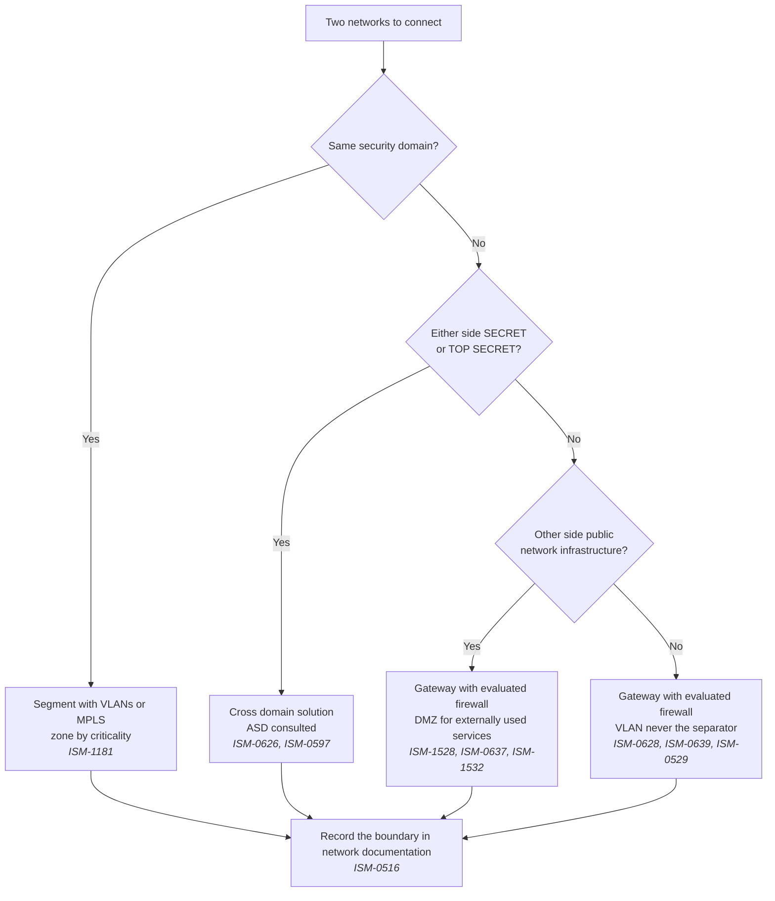
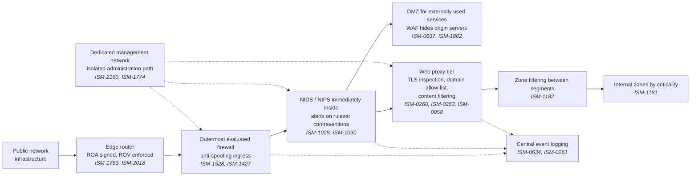
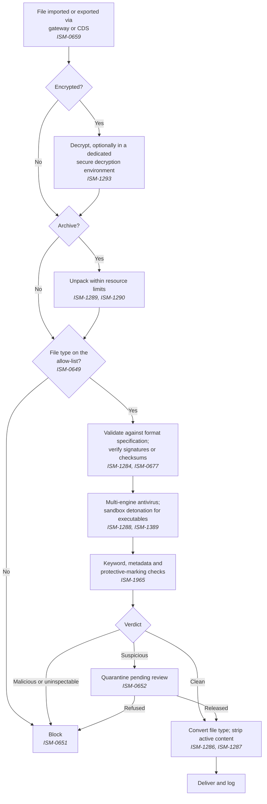

# SA-04: Network, Gateway and Access Architecture under the ISM

> **Module type:** Extension module (elective deep dive) — part of [EXT-SA](index.md)
> **Status:** Draft
> **Version:** v0.1
> **Last Reviewed:** 2026-09-12
> **Domain Expert:** _Unassigned — required before Practitioner Approved_
> **Practitioner Reviewer:** _Unassigned — required before Practitioner Approved_

!!! warning "Not a credit-bearing unit"
    SA-04 belongs to the [EXT-SA series](index.md), an optional extension outside the fixed
    66-unit / 168 CP degree structure. It carries 0 CP and does not appear in
    [`docs/ksat-coverage.md`](../../ksat-coverage.md), which is generated from credit-bearing units only.

---

## Overview

The degree teaches what a DMZ is, what segmentation does and how Zero Trust reframes the perimeter.
None of that tells an architect in an Australian organisation where the ISM says the intrusion sensor
must sit, who may administer a gateway between two security domains, when a gateway is no longer
enough and a cross domain solution becomes mandatory, or what the access architecture must record for
the life of a system. Those are the questions an IRAP assessor asks, and they are specific.

This module reads three chapters of the Australian Government Information Security Manual as
statements about structure. ASD's *Guidelines for networking*, *Guidelines for gateways* and
*Guidelines for system access* (September 2026 extracts) are treated as placement, separation,
administration and assurance rules, and every control's intent is restated in the module's own words
with its identifier. NIST SP 800-63-4 (July 2025) supplies the vocabulary of identity, authentication
and federation assurance levels, used only to decide what assurance a boundary demands of a user group.

It does not teach networking fundamentals ([F01](../../../core/units/F01-networking-fundamentals.md)
owns firewalls, VLANs and the north-south / east-west distinction), architecture patterns or Zero
Trust ([SC02](../../../core/units/SC02-security-architecture.md),
[SE02](../../../degrees/strategic/security-engineering/SE02-security-architecture.md)), identity and
access management, PAM, federation or MFA
([SE03](../../../degrees/strategic/security-engineering/SE03-identity-access-management.md)), or
cloud architecture ([SE05](../../../degrees/strategic/security-engineering/SE05-security-cloud-devsecops.md)).
Logging topology and system authorisation belong to SA-05 and SA-06 and appear only as hand-offs.

---

## Where this module fits

| Unit / module | Relationship |
|---|---|
| [SC02 — Security Architecture](../../../core/units/SC02-security-architecture.md) | **Hard prerequisite.** Supplies the DMZ, tiered and Zero Trust patterns this module places ISM requirements on top of. |
| [F01 — Networking Fundamentals](../../../core/units/F01-networking-fundamentals.md) | Assumed. Firewalls, ACLs, VLANs, segmentation and sensor placement are not re-explained. |
| [SE02 — Security Architecture](../../../degrees/strategic/security-engineering/SE02-security-architecture.md) | Applied ZTA, cloud architecture and the generic "ISM as regulatory frame" are assumed; SA-04 adds chapter-specific structure. |
| [SE03 — Identity & Access Management](../../../degrees/strategic/security-engineering/SE03-identity-access-management.md) | Owns IAM, PAM, federation and MFA. SA-04 states what a boundary demands and links SE03 for how to build it. SE03 cites SP 800-63 revision 3; this module uses revision 4. |
| [SE05 — Security in Cloud & DevSecOps](../../../degrees/strategic/security-engineering/SE05-security-cloud-devsecops.md) | Owns cloud architecture; ISM cloud-hosting and CDN controls appear here only as placement constraints. |
| [GR05 — Audit & Assurance](../../../degrees/strategic/grc/GR05-audit-assurance.md) | IRAP as an audit process; SA-04 adds only the gateway-specific cadence. |
| [DE02 — Data Sources & Log Engineering](../../../degrees/operational/detection-engineering/DE02-data-sources-log-engineering.md) | The gateway, proxy and device log sources this module's designs must expose. |
| [SA-01](sa-01-business-driven-architecture-in-practice.md) · [SA-02](sa-02-integrating-security-into-enterprise-architecture.md) · [SA-03](sa-03-modern-defensible-architecture-and-csf.md) | Predecessors. Topic 2 places ISM documentation on the SABSA layers SA-01/SA-02 use; SA-03 gives the "why" of defensible architecture, this module the ISM's "where". |
| SA-05, SA-06 | Successors (plain-text reference). SA-05 designs the topology of the log sources fixed here; SA-06 turns the assessment cadence into a system authorisation. |

---

## Prerequisites

- [SC02 — Security Architecture](../../../core/units/SC02-security-architecture.md) (required)
- [F01 — Networking Fundamentals](../../../core/units/F01-networking-fundamentals.md) (required)
- [SA-03 — Modern Defensible Architecture and NIST CSF 2.0](sa-03-modern-defensible-architecture-and-csf.md) (recommended)
- [SE03 — Identity & Access Management](../../../degrees/strategic/security-engineering/SE03-identity-access-management.md) (recommended before Topics 8–9)
- Access to the current ISM chapters on cyber.gov.au and to NIST SP 800-63-4 (both free)

---

## Learning outcomes

On completion, a learner can:

1. **Analyse** any pair of connected networks to determine which ISM boundary pattern (VLAN
   segmentation, gateway with evaluated firewall, DMZ, cross domain solution) applies, and **justify**
   the choice from security domain and classification.
2. **Design** a gateway and management-plane architecture that places the ISM's named components
   (firewalls, NIDS/NIPS, web proxy, content filters, WAF, protective DNS, isolated administration
   path) correctly and records the flows the ISM expects.
3. **Construct** a content-filtering pipeline for files crossing a gateway or cross domain solution,
   sequencing the ISM's techniques with block, quarantine and release paths.
4. **Evaluate** an access architecture against the ISM's identification, authorisation-record,
   privileged-separation and machine-identity expectations, and identify the structural gaps.
5. **Assess** the identity, authentication and federation assurance (IAL, AAL, FAL per NIST
   SP 800-63-4) each boundary demands of each user group, and record it in a per-boundary ledger.
6. **Explain** how ISM applicability tags, Essential Eight maturity tags and evaluated-product tiers
   change which controls bind a particular boundary.

> Bloom's 4–6 for LO1–LO5, with one level-2 outcome (LO6) the rest depend on; consistent with the
> strategic-layer expectations in [`docs/content-standards.md`](../../content-standards.md).

---

## AQF Level 7 Alignment

The module develops specialised knowledge of a national control catalogue as a design constraint
(AQF 7.1), the cognitive skill of translating control intent into structure and judging when a
stronger pattern is mandated rather than preferred (AQF 7.2), and the application of that judgement
to a realistic Australian estate under the accountability an IRAP assessment imposes (AQF 7.3).

> This alignment statement is notional. SA-04 is not credit-bearing, so it has not been through the
> AQF mapping process in [`docs/compliance/aqf-teqsa.md`](../../compliance/aqf-teqsa.md).

---

## Framework mappings

> **Provisional pending Framework Custodian review.** These do **not** feed
> [ksat-coverage](../../ksat-coverage.md).

### NIST NICE DCWF

| Version | Work Role | Code | T-Code | Task | Demonstrated in |
|---|---|---|---|---|---|
| 2023 | Security Architect | SP-ARC-002 | T0050 | Design system security architecture and supporting infrastructure | Lab 2, Summative |
| 2023 | Enterprise Architect | SP-ARC-001 | T0473 | Document and address organisational requirements in system design | Lab 1, Lab 3 |
| 2023 | Security Control Assessor | SP-RSK-002 | T0177 | Assess controls against frameworks and identify gaps | Formative 2, Summative |

### SFIA 9

| Skill | Code | Level | Demonstrated in |
|---|---|---|---|
| Solution architecture | ARCH | Level 5 | Lab 2, Summative |
| Network design | NTDS | Level 5 | Lab 1, Lab 2 |
| Information security | SCTY | Level 5 | Lab 3, Summative |
| Information assurance | INAS | Level 4 | Formative 2, Summative |
| Requirements definition and management | REQM | Level 4 | Lab 3 |

### ASD Cyber Skills Framework

| Domain | Sub-domain | Proficiency | Demonstrated in |
|---|---|---|---|
| Security Architecture | Network & Gateway Design | Advanced | Lab 1, Lab 2, Summative |
| Security Architecture | Identity & Access Architecture | Practitioner–Advanced | Lab 3 |
| Secure Systems | Cross Domain & High Assurance | Practitioner | Topic 6, Formative 1 |

### Project-local KSATs

| Type | ID | Statement | Demonstrated in |
|---|---|---|---|
| Knowledge | SA-04-K01 | Knowledge of ISM security domains, classification applicability and Essential Eight tags as architectural inputs | Topic 1; Formative 1 |
| Knowledge | SA-04-K02 | Knowledge of the ISM's network documentation and criticality-based zoning expectations | Topic 2; Lab 1 |
| Knowledge | SA-04-K03 | Knowledge of the ISM's management-plane and gateway-administration structure | Topic 3; Lab 2 |
| Knowledge | SA-04-K04 | Knowledge of ISM gateway component placement and content-filtering techniques | Topics 4–5; Lab 2 |
| Knowledge | SA-04-K05 | Knowledge of the cross domain solution pattern and its evaluated / high-assurance tiers | Topic 6; Formative 1 |
| Knowledge | SA-04-K06 | Knowledge of NIST SP 800-63-4 IAL/AAL/FAL definitions, scope and initial selection steps | Topic 9; Lab 3 |
| Skill | SA-04-S01 | Skill in classifying network boundaries with the ISM decision ladder | Lab 1 |
| Skill | SA-04-S02 | Skill in producing a gateway placement design with ISM traceability | Lab 2 |
| Skill | SA-04-S03 | Skill in building a per-boundary assurance ledger from per-user-group impact | Lab 3 |
| Ability | SA-04-A01 | Ability to justify a boundary pattern from control intent rather than control text | Lab 1; Summative |
| Ability | SA-04-A02 | Ability to detect placement and administration errors in a gateway design | Formative 2; Summative |
| Ability | SA-04-A03 | Ability to state where the xAL vocabulary stops and ISM-derived assurance statements take over | Lab 3; Summative |

---

## Module structure

| Part | Topics | Labs | Notional hours |
|---|---|---|---|
| A — Domains, documentation and zoning | 1–2 | 1 | 4 |
| B — Management plane and network access control | 3, 7 | 2 | 4 |
| C — Gateway anatomy and content filtering | 4–5 | 2 | 6 |
| D — Cross domain solutions | 6 | Formative 1 | 2 |
| E — Access architecture and assurance levels | 8–9 | 3 | 6 |
| F — Summative design package | all | — | 2 |
| | | | **24 hours** |

---

## Topics

### Topic 1: Security domains and the boundary decision ladder

The networking and gateways chapters share one organising idea, the **security domain**. A gateway,
in the ISM's sense, is whatever securely manages flows between networks in different security
domains, and it takes on the highest sensitivity or classification of the domains it joins (ASD
*Guidelines for gateways*, Context). Almost every structural decision in this module reduces to two
questions about a pair of networks: are they in the same domain, and what is the highest
classification on either side?

Read the control line before the control. Each carries an identifier, a revision, an update month, an
applicability list across the Australian classification scale (non-classified, OFFICIAL: Sensitive,
PROTECTED, SECRET, TOP SECRET) and an Essential Eight maturity tag. These are inputs, not metadata: a
control tagged only S, TS binds SECRET and TOP SECRET boundaries and nothing else, and a control
tagged ML1–ML3 is simultaneously an Essential Eight requirement that
[GR03](../../../degrees/strategic/grc/GR03-compliance-frameworks.md) assesses. The ladder, restated:

| Relationship between the two networks | What the ISM expects (intent restated) | Identifiers |
|---|---|---|
| Same security domain | VLANs (MPLS treated as equivalent) are acceptable; zones follow the criticality of servers, services and data | ISM-1181 |
| Different domains, neither SECRET or TOP SECRET | A gateway with an evaluated firewall; VLANs are never the separation mechanism | ISM-0628, ISM-0639, ISM-0529 |
| Organisation network to public network infrastructure | Evaluated firewall; a DMZ wherever external parties consume services; VLANs never the separation | ISM-1528, ISM-0637, ISM-1532 |
| Organisation network to a provider or partner network | Segregated; where privately interconnected, each side runs its own independent firewall | ISM-1577, ISM-0639 |
| At least one side SECRET or TOP SECRET | A cross domain solution, with ASD consulted and its directions followed | ISM-0626, ISM-0597 |

Where an organisation risk-manages VLANs between different domains at the same classification, the
networking chapter attaches conditions: the switches carrying them are administered from the
highest-trust domain they serve, trunks are not shared across domains, and each domain's VLANs land
on separate physical interfaces (ISM-0530, ISM-0535, ISM-1364). A tolerated exception, not a pattern.

!!! warning "Re-verify every identifier"
    The ISM is revised several times a year and identifiers, applicability and wording move between
    releases. Every `ISM-nnnn` reference here comes from the September 2026 extracts and **must be
    re-verified against the live ISM on cyber.gov.au** before it is quoted to an assessor or relied on
    in a design. Identifiers at Revision 0 in that release (ISM-2160 to ISM-2167, ISM-2133 to
    ISM-2148) are the most likely to move.

### Topic 2: Network documentation and zoning by criticality

The ISM treats network documentation as a security artefact: it exists for troubleshooting and
incident response, and because it is equally useful to an attacker it must be protected (ASD
*Guidelines for networking*, Network documentation). It is produced, applied and kept current
(ISM-0518), and four artefact classes follow from it:

| Artefact class | ISM intent | SABSA layer (SA-01 / SA-02) | Primary consumer |
|---|---|---|---|
| Connection-level diagram (ISM-0516) | Every external connection into the organisation's networks visible | Conceptual / logical | Gateway assessor, incident responder |
| Logical asset diagram (ISM-0516) | Critical servers, high-value servers, network devices and security appliances and their relationships | Logical | Architect, IRAP assessor (ISM-0100) |
| Device configuration record (ISM-1912) | Settings for the same asset classes, protected | Physical / component | Operations, baseline verification (ISM-2161) |
| Third-party extract (ISM-1178) | Trimmed to what the third party or tender respondent needs | Derived | Vendors, tender respondents |

Zoning is the second expectation. Networks are divided into zones by the criticality of the servers,
services and data in them (ISM-1181), and the rationale goes further: administrative infrastructure
for critical, high-value and ordinary servers should be kept apart from each other and from
everything else. The organisation's networks are segregated from its providers' networks (ISM-1577);
internet connectivity is confined to devices that need it (ISM-2068); servers stay functionally
separate and minimise server-to-server communication at network and file-system level (ISM-0385,
ISM-1479); and everything carried over network infrastructure is encrypted with ASD-approved
cryptography even inside secure areas (ISM-1781). The difference from SC02's generic trust zones is
the axis: the ISM zones by **criticality**, which the architect must defend asset by asset.

### Topic 3: The management plane

The clearest structural statement in the September 2026 networking chapter is about administration.
Management interfaces of servers and network devices are not exposed directly to the internet
(ISM-1863) and, in a control new in that release, are reachable only from a dedicated management
network that neither the general network nor the internet can reach (ISM-2160). The gateways chapter
says the same for gateways: management traffic never traverses a network the gateway connects
(ISM-1774), and where a gateway joins two domains any shared component is administered by the higher
domain's administrators or a mutually agreed third party (ISM-0629).

The protocols on that plane are constrained. Management traffic is protected from unauthorised
access (ISM-1006); SMB version 1 is absent (ISM-1962); SNMP versions 1 and 2 are not used, default
community strings are changed and write access removed (ISM-1311, ISM-1312); and the RADIUS exchange
between authenticators and the authentication server is wrapped in RADIUS over IPsec or over TLS
(ISM-1454). The authentication-server tier is therefore part of the management plane.

The system access chapter adds the identity side: privileged accounts are kept off the internet, email
and web except under explicit, narrow authorisation, privileged people hold a dedicated account for
that work, and at Essential Eight Maturity Level Three administration is just-in-time (ISM-1175,
ISM-1883, ISM-0445, ISM-1649). Read architecturally, that is an internet-isolated administrative zone
entered through a distinct identity; SE03 Topic 3 covers the PAM tooling inside it and this module
fixes only where the zone sits.

Gateway administrators are a personnel control with a structural consequence. Screening and clearance
scale with the gateway's sensitivity, the chapter's example being that administrators of a gateway
between OFFICIAL: Sensitive and PROTECTED networks need a baseline clearance (ISM-1520); they hold
minimum privileges (ISM-0611), work under separation of duties so no one administrator can abuse the
gateway alone (ISM-0616), and are formally trained (ISM-0612). A design with a sole administrator for
a two-domain gateway has already failed the chapter.

### Topic 4: Gateway anatomy and control placement

[SC02](../../../core/units/SC02-security-architecture.md) taught the DMZ and tiered patterns; the
gateways chapter says what goes inside them and where. Every gateway passes only explicitly
authorised flows (ISM-0631), inspects at the transport layer and above rather than on headers alone
(ISM-1192), and drops spoofed source addresses on ingress (ISM-1427). Externally consumed services
live in a DMZ (ISM-0637). The networking chapter adds the most precise placement rule in either
document: a NIDS or NIPS is present in every gateway to networks the organisation does not manage,
sits immediately inside the outermost firewall, and alerts on any traffic a firewall rule should have
stopped, so a failed or misconfigured firewall is detected rather than assumed (ISM-1028, ISM-1030).

Egress has a mandatory choke point. Web traffic leaves through the proxy tier and internal servers get
no exemption (ISM-0260); proxies log address, time, user, bytes each way and both IP addresses
centrally (ISM-0261). TLS crossing the gateway is decrypted and inspected, with privacy exceptions such
as internet banking allowed (ISM-0263). Outbound HTTP and HTTPS is governed by an approved domain or
category allow-list (ISM-0958); malicious, dynamic and anonymously registrable domains are blocked
(ISM-1236); browsing to bare IP addresses is blocked (ISM-1171); harmful content is filtered in both
directions and client-side active content confined to approved domains (ISM-0963, ISM-1237, ISM-0961);
and anonymity-network connections are blocked in and out, with logging as the alternative for public
sites that choose to serve anonymous visitors (ISM-1627, ISM-1628).

Two edge expectations are not drawn: CDN-fronted high-availability sites follow the WAF's
origin-hiding pattern (ISM-1438, ISM-1439), and DNS is encrypted with ASD-approved cryptography and
filtered by a protective DNS service (ISM-2017, ISM-1782). The routing edge in the diagram needs valid
ROA records and routers that reject or deprioritise mis-originated or over-long RPKI-registered
prefixes (ISM-1783, ISM-2018; the gateways chapter points to the Asia Pacific Network Information
Centre for RPKI and ROA guidance). Gateway log sources are fixed here and their topology is SA-05's
problem (ISM-0634). Gateways are tested after configuration change and at least every six months
(ISM-1037), which the design must make cheap to do.

!!! note "Mail gateway placement is provisional"
    The gateways chapter mentions email gateways only as an example of file-type allow-listing
    (ISM-0649). The ISM email guidelines were not a source, so mail gateway position is not taught here.

### Topic 5: The content-filtering pipeline

Content filtering is the part of the ISM most absent from the degree, and it is a pipeline design
problem. The gateways chapter lists the techniques to consider (antivirus scanning, automated dynamic
analysis, file extension, format and header checks, keyword, metadata and protective-marking checks,
and manual inspection for content-rich files; ASD *Guidelines for gateways*, Content filtering) and
the controls turn that catalogue into an ordered flow with three exits: deliver, quarantine, or block.

Each node restates one control's intent and carries its identifier. A cross domain solution's filter
is additionally tested to prove it cannot be bypassed (ISM-1524). The design decisions are which steps
run in parallel, where the quarantine store sits (reachable by reviewers, not by the untrusted side),
and what happens when a step fails open.

### Topic 6: Cross domain solutions and assurance tiers

A cross domain solution (CDS) is a system of security-enforcing functions built for the specific risks
of accessing or moving data between different security domains; it may be one appliance but is more
often discrete hardware and software sub-systems (ASD *Guidelines for gateways*, Cross domain
solutions). A **Transfer CDS** moves data one way or both ways between domains; an **Access CDS**
lets a user reach several domains from one device without moving data between them. The section
extends the gateways section, so every Topic 4 expectation still applies.

| Property | Gateway (Topic 4) | Cross domain solution |
|---|---|---|
| Trigger | Any two different security domains, or public infrastructure | At least one side SECRET or TOP SECRET (ISM-0626) |
| Directionality | Bidirectional, flows explicitly authorised | Upward and downward paths isolated (ISM-0635) |
| Enforcement | Shared inspection stack | Independent functions per direction; protocol break per layer (ISM-1522, ISM-1521) |
| External oversight | IRAP every 24 months; ASD assessors at TOP SECRET (ISM-0100, ISM-2019) | ASD consulted and directs the design (ISM-0597) |
| Operational check | Six-monthly configuration testing (ISM-1037) | Plus quarterly sampled transfer-policy review (ISM-1523); filter tested for bypass (ISM-1524) |

Three operational controls sit beside the table: users are trained before access (ISM-0610), security
events including configuration changes are centrally logged (ISM-0670), and a sample of data-transfer
policy events is checked against the CDS security policy at least quarterly (ISM-1523). That quarterly
loop is an architecture requirement: the design must make the sample easy to pull.

Two component classes carry their own assurance ladder. Diodes control unidirectional gateways and are
evaluated products in every case (ISM-0643, ISM-1157); where the one-way path leaves a SECRET or TOP
SECRET network the diode must have completed a high assurance evaluation (ISM-0645, ISM-1158).
Peripheral switches shared between systems are evaluated (ISM-0591), preferably high-assurance between
SECRET and TOP SECRET domains (ISM-1457), and mandatorily high-assurance between a SECRET or TOP
SECRET system and any other (ISM-1480). The **evaluated** tier recurs for firewalls, 802.1X components
and certificate authorities (ISM-1528, ISM-0639, ISM-1322, ISM-1324); whether a **high assurance
evaluation** is also required for those components at SECRET and TOP SECRET is decided in the ISM's
evaluated-product guidelines, not a source here.

### Topic 7: Network access control and the link layer

Network access control appears in the ISM at two levels: keeping unauthorised devices and equipment
off the network, which also stops staff accidentally bridging two networks (ISM-0520), and limiting
flows within and between segments to what business purposes need (ISM-1182). The admission mechanism
is 802.1X with EAP-TLS for mutual authentication and key exchange, every other EAP method disabled on
supplicants and authentication servers (ISM-1321), with identity privacy used where available
(ISM-1711). Supplicants, authenticators and authentication servers are evaluated products (ISM-1322).
Both devices and human users hold X.509 certificates (ISM-1323), since device-only certificates
attribute actions only to devices. Certificates come from an evaluated certificate authority or HSM
(ISM-1324) and are protected logically, physically and by encryption, with user certificates requiring
authentication before use (ISM-1327). The gateways chapter closes the loop: users and IT equipment
authenticate to any network reached through a gateway (ISM-0619, ISM-0622), which makes machine
identity a boundary control.

Wireless rides the same 802.1X, RADIUS and PKI tier. Public or guest wireless is segregated from every
other organisational network because shared infrastructure is an entry point (ISM-0536);
WPA3-Enterprise 192-bit mode protects all wireless traffic (ISM-1332); access-point administration is
unavailable over the wireless interface (ISM-1315); and 802.11r fast transition is disabled unless
inter-authenticator links use an ASD-Approved Cryptographic Protocol (ISM-1712). Three things do not
help: hiding the SSID, which enables evil-twin credential theft (ISM-1318), MAC filtering (ISM-1320)
and static addressing (ISM-1319). At SECRET and TOP SECRET, RF shielding limits wireless range beyond
the controlled area (ISM-1013).

Two link-layer items shape structure. MACsec, new in September 2026, runs in confidentiality mode with
a GCM-AES suite, preferably 256-bit, and with pre-shared-key fallback disabled because it weakens the
EAP path (ISM-2163, ISM-2167). IPv6 and dual-stack networks need IPv6-capable security appliances,
tunnelling disabled unless required and blocked at external boundaries, and stateful DHCPv6 with lease
data sent to central logging (ISM-1186, ISM-1428, ISM-1429, ISM-1430).

### Topic 8: System access architecture under the ISM

The system access chapter's Context states that its identification, authentication, authorisation and
monitoring controls apply equally to non-human users: services, applications, workloads and AI
agents, which widens the access architecture's scope. Every user is uniquely identifiable (ISM-0414);
shared accounts are tightly controlled with users still individually identifiable (ISM-0415);
contractors are flagged (ISM-1583); on systems handling AUSTEO, AGAO or REL data, foreign nationals
are flagged with nationality (ISM-0420); and each AI agent has its own identity, distinct from the
people it acts for and from other agents, recorded in a register holding its owner, purpose,
identities, credentials and reachable tools, permissions and data (ISM-2133, ISM-2134, ISM-2135).

Access requirements for each system live in its system security plan (ISM-0432); a secure record kept
for the life of the system holds, per human user, identifier, signed usage agreement, authoriser,
date, level, reviews and withdrawal (ISM-0407); and an emergency access method is documented and
tested (ISM-1610). The ISM also fixes the access-lifecycle timers (removal when the need ends, 45-day
inactivity, 12-month privileged revalidation: ISM-0430, ISM-1404, ISM-1648, ISM-1647) that SE03
Topic 2's lifecycle design implements. Authentication precedes access (ISM-1546) and, new in
September 2026, access decisions weigh device, credential, privilege and behavioural signals rather
than the presented credential alone (ISM-2136), the ISM's nearest statement to a policy decision point.

The chapter's MFA controls bind by service, user class and Essential Eight maturity level (ISM-1504,
ISM-1679, ISM-1173, ISM-0974, ISM-1682, ISM-1872, ISM-1505, ISM-1894, ISM-2011, ISM-1919); SE03
Topic 5 teaches those tiers. This module records only which identifier applies to each boundary, in
the Topic 9 ledger.

Machine and token identity are new boundary controls in this release. Workloads prefer short-lived,
dynamically issued credentials, static credentials live in a central secrets solution, and no
credential is shared across workloads or environments (ISM-2141, ISM-2142, ISM-2143). ISM-2137 to
ISM-2140, ISM-2147 and ISM-2148 place an OAuth consent control point, consent review and logging, a
constrained device-code flow and device-bound, revocable tokens on the federation boundary; SE03
Topic 4 covers the token handling.

!!! note "Remote access architecture is not in the supplied chapter"
    The ISM places jump servers and remote administration in the *Guidelines for system management*,
    not a source here. Remote access is covered only through ISM-0619, ISM-0622, ISM-1774 and ISM-2160.

### Topic 9: IAL, AAL and FAL as boundary requirements

NIST SP 800-63-4 (July 2025) requires an organisation to select, per online service, an Identity
Assurance Level for proofing, an Authentication Assurance Level for authentication and a Federation
Assurance Level where a relying party reaches an identity provider through a federated protocol
(Sec. 1.2); each has three levels and together they are the xALs (Sec. 1.2, footnote 1). Its SHALL
statements bind US agencies; here it is a shared vocabulary for what a boundary demands, never an
Australian obligation (see Australian context).

The selection method is the useful part. The relying party partitions a service's users into **user
groups** by transaction and privilege and assesses impact per group against at least five harm
categories (Sec. 3.1–3.2). Effective impact maps to initial levels: Low to IAL1, AAL1, FAL1; Moderate
to IAL2, AAL2, FAL2; High to IAL3, AAL3 and FAL2 or FAL3 (Sec. 3.3.3). For High impact, the FAL
choice turns on whether a compromised IdP sits inside or outside the enterprise boundary
(Sec. 3.3.3.3), the document's one link between placement and assurance. Two further statements
matter: a service may be partitioned so less sensitive functions run at a lower level (Sec. 1.3),
making assurance level a legitimate zoning driver; and xAL controls augment but do not replace
system-level controls (Sec. 1.3.1), so identity assurance sits on top of Topics 1–7, never instead of
them. Tables 1–3 profile AAL3 and IAL3 users as privileged and administrator access, the rationale
for Topic 3's separate management plane.

| Boundary | User groups crossing it | Who governs assurance | Initial xAL (worked example, provisional) |
|---|---|---|---|
| Internet-facing customer service | Customers; staff operators | SP 800-63-4 per group; ISM-1504, ISM-1681, ISM-1892, ISM-1872; ISM-1919 once MFA is in place | Customers IAL1/AAL2/FAL2; staff AAL2 phishing-resistant (ISM-1872) |
| Partner interconnect | Partner staff; partner systems | Humans via xALs; systems via ISM-0622, ISM-0639 | Humans AAL2/FAL2; systems: ISM-derived statement, no xAL |
| Management network | Administrators only | ISM-1173, ISM-0974, ISM-1682, ISM-2011, ISM-1175; AAL3 profile | AAL3; IAL2 or IAL3 at credential issue (ISM-1593) |
| Cross domain interface | Cleared transfer users | ISM CDS controls; ASD direction (ISM-0597) | Transfer path outside xAL scope; users AAL3 |

The last column shows where the vocabulary stops. SP 800-63-4 does not explicitly address
machine-to-machine authentication, IoT devices or API access on a subject's behalf (Sec. 1.1), so
gateway-to-gateway, service-to-service and device-admission boundaries need an ISM-derived assurance
statement instead; labelling each boundary with its governing vocabulary is the discipline Lab 3
practises. Two ISM parallels help: credential issuance and reset require identity verification
(ISM-1593), an IAL-like event, and password minimums step up from PROTECTED to SECRET to TOP SECRET
(ISM-1559, ISM-1560, ISM-1561 with MFA; ISM-0421, ISM-1557, ISM-0422 single-factor), so the ISM
parameterises by classification where NIST parameterises by impact. Both are provisional readings.

---

## Labs & exercises

All three labs are paper-based or use free diagramming (Mermaid in any Markdown editor, or draw.io).

!!! warning "Authorisation boundary"
    Use the fictional estate supplied in each lab. Do not reproduce any real organisation's network
    documentation, gateway configuration or access records; ISM-1178 exists because that material is
    useful to an attacker, and it may be classified or commercially confidential.

### Lab 1: Boundary register and decision ladder

**Objective:** Classify every boundary in a fictional estate with the Topic 1 ladder and produce the
connection-level documentation the ISM expects.

**Prerequisites:** Topics 1–2

**Environment:** No tooling required (Mermaid or draw.io optional)

**Instructions:**

1. Read the supplied estate: an OFFICIAL: Sensitive corporate network; a PROTECTED enclave; a public
   web service; a privately interconnected partner network; guest wireless; a service provider's
   monitoring network; and an administrative team.
2. List every pair of networks that connect, directly or through shared infrastructure (at least eight).
3. For each, answer the two ladder questions and assign the pattern: VLAN, gateway with evaluated
   firewall, DMZ, or cross domain solution. Cite the identifier whose intent drives the choice.
4. Where a VLAN is proposed between different domains, state the device-level conditions the ISM
   attaches if it is retained.
5. Draw the high-level connection diagram (ISM-0516 intent) and mark what a partner would receive
   under ISM-1178. Add a re-verification note listing every identifier and its ISM release.

**Expected output:** A boundary register (network pair, domain answer, classification answer, pattern,
identifiers), a connection-level diagram, a partner extract, and the re-verification note.

**Reflection questions:**

1. Which boundary was hardest to classify, and what fact about the estate would have settled it?
2. Guest wireless shares physical switches with the corporate network. Which identifier makes that a
   finding, and what changes?
3. If the PROTECTED enclave were re-classified SECRET, which rows change pattern and who must be consulted?

### Lab 2: Gateway and management-plane placement design

**Objective:** Design the internet gateway and the management plane for the Lab 1 estate with every
ISM-named component placed and traced.

**Prerequisites:** Lab 1; Topics 3–5, 7

**Environment:** Mermaid or draw.io (both free)

**Instructions:**

1. Draw the internet gateway: edge router, outermost firewall, NIDS/NIPS, DMZ, WAF, proxy tier, content
   filter, zone filtering and internal zones. Place the NIDS/NIPS exactly where ISM-1030 requires.
2. Draw the dedicated management network and the isolated administration path to every gateway
   component (ISM-2160, ISM-1774), showing where the authentication server sits and how its traffic is
   protected (ISM-1454).
3. Produce a placement checklist: one row per component, the identifiers whose intent it satisfies,
   and the flow it must log (ISM-0634, ISM-0261).
4. Design the content-filtering pipeline for files arriving through the web proxy as a flowchart with
   block, quarantine and deliver exits (Topic 5).
5. Write the administration section: screening and clearance for the gateway's classification,
   separation of duties, and who administers any component shared with the partner gateway (ISM-1520,
   ISM-0616, ISM-0629). State the six-monthly test and 24-month IRAP cadence the design must support
   (ISM-1037, ISM-0100).

**Expected output:** Two diagrams (gateway, management plane), a placement checklist, a content-filter
flowchart, an administration section, and an assessment-cadence note.

**Reflection questions:**

1. Your NIDS alerts on traffic the firewall should have dropped. What has actually happened, and who is paged?
2. Which component would you co-locate with another to save cost, and which identifier stops you?
3. The partner insists on managing the shared component. What does ISM-0629 allow, and what goes in the contract?

### Lab 3: Per-boundary assurance ledger

**Objective:** Map supplied per-user-group impact ratings to initial IAL, AAL and FAL for the Lab 1
estate, overlay the ISM's access identifiers, and record where the xAL vocabulary does not apply.

**Prerequisites:** Labs 1–2; Topics 8–9; SE03 recommended

**Environment:** No tooling required

**Instructions:**

1. Use the supplied impact ratings (the Sec. 3.1–3.2 assessment is not repeated): public web service
   anonymous browsers Low, registered customers Moderate, staff operators High; management network
   administrators High; partner interconnect partner staff Moderate, partner systems not assessed.
2. Map each group's effective impact to initial IAL, AAL and FAL (Sec. 3.3.3). For any High-impact
   group, perform the FAL2-versus-FAL3 assessment and state where the IdP sits relative to the
   enterprise boundary.
3. Overlay the ISM: for each group cite the access identifier whose intent applies (Topic 8; Topic 9
   ledger) and note where the ISM already demands more than the initial xAL.
4. Mark every boundary SP 800-63-4 does not explicitly address (machine-to-machine, device admission,
   API on a subject's behalf) and write an ISM-derived assurance statement instead (ISM-0622,
   ISM-1323, ISM-2141).
5. Record the result as a Digital Identity Acceptance Statement-style table per boundary (Sec. 3.4.4),
   including any compensating or supplemental control and its rationale.

**Expected output:** A ledger with one row per boundary and user group: supplied impact, initial
xALs, ISM overlay, governing vocabulary, compensating or supplemental controls, rationale.

**Reflection questions:**

1. Which supplied impact rating would you challenge first, and which ledger cells move if it changes
   by one level?
2. Where did the ISM demand more than the xAL mapping, and what does that say about classification
   versus impact as the parameter?
3. Which boundary had no applicable xAL at all, and what did you write instead?

---

## Assessment

### Formative 1: Which pattern does the ISM require?

Ten pairs of networks described in one sentence each, from "two VLANs in the same OFFICIAL: Sensitive
domain" to "a SECRET network and a partner's PROTECTED network". For each, name the pattern, the
deciding identifier, and whether ASD must be consulted. Self-marked against a key that explains each
intent. Assesses LO1 and LO6.

### Formative 2: Find the placement error

An annotated gateway and management-plane diagram with at least five deliberate errors: a NIDS outside
the outermost firewall, a management interface on a user VLAN, a sole administrator for a two-domain
gateway, servers browsing without a proxy, and OAuth consent left to end users. Identify each, cite the
identifier whose intent it breaks, and propose the correction. Assesses LO2, LO4 and LO6.

### Summative: Boundary and access architecture package

For a described Australian organisation (a PROTECTED enclave, an OFFICIAL: Sensitive corporate
network, an internet-facing customer service, a privately connected partner and a small administrative
team), produce:

1. A boundary register with pattern and identifiers for every boundary (Lab 1 form).
2. Gateway and management-plane designs with a placement checklist (Lab 2 form).
3. A content-filtering pipeline for one inbound and one outbound path.
4. An access architecture: identification structure including AI agents and workloads, authorisation
   record location, privileged-access zoning, and a per-boundary assurance ledger (Lab 3 form;
   user-group impact ratings are supplied with the scenario).
5. An ISM traceability matrix with a re-verification note per identifier.
6. A limitations statement: what the design does not cover (mail gateway, remote access, logging
   topology, authorisation) and where those are decided.

Item 6 is weighted heavily. A package that presents provisional identifiers as verified, or claims
coverage of a chapter it did not use, does not reach Proficient.

**Rubric:**

| Criterion | Exemplary | Proficient | Developing | Beginning |
|---|---|---|---|---|
| **Boundary classification** | Every boundary correctly patterned from domain and classification; tolerated exceptions stated with conditions | Boundaries correct; minor omissions in conditions | Some boundaries mis-patterned; ladder applied inconsistently | Patterns asserted without reference to security domain |
| **Gateway placement** | All ISM-named components placed and traced; NIDS, proxy and origin-hiding rules exact; log sources named | Placement sound with one or two untraced components | Key rules (NIDS position, proxy for servers) missed | Generic DMZ with no ISM specifics |
| **Management plane and administration** | Dedicated management network, isolated gateway path, protected authentication tier, personnel controls and shared-component ownership all present | Management network and gateway path present; personnel controls thin | Management plane reachable from user zones or the internet | No distinct management plane |
| **Access architecture and assurance ledger** | Supplied impact ratings mapped to initial xALs, ISM overlay and out-of-scope boundaries all recorded with rationale | Ledger complete with minor gaps in rationale | xALs assigned per service not per user group; ISM overlay missing | MFA "everywhere" with no assurance reasoning |
| **ISM traceability and verification discipline** | Every identifier restated as intent, traced and flagged for re-verification; no control text reproduced | Identifiers traced; re-verification note present | Identifiers cited without intent, or control text pasted | Identifiers absent or invented |
| **Communication and limitations** | Clear, assessor-ready, with an honest limitations statement naming hand-offs | Clear with a limitations statement | Disorganised or limitations perfunctory | Claims completeness it does not have |

**Assessment-to-LO mapping:**

| Assessment task | Learning outcomes addressed |
|---|---|
| Formative 1 | LO1, LO6 |
| Formative 2 | LO2, LO4, LO6 |
| Summative: boundary register | LO1, LO6 |
| Summative: gateway and management-plane designs | LO2 |
| Summative: content-filtering pipeline | LO3 |
| Summative: access architecture and assurance ledger | LO4, LO5 |
| Summative: traceability matrix and limitations statement | LO1, LO2, LO4, LO5 |

---

## Australian context

The three chapters are extracts of the Australian Government Information Security Manual, published by
the Australian Signals Directorate and each headed "Last updated: September 2026". Every control
carries applicability across the Australian classification scale and an Essential Eight maturity tag,
and those two tags are the primary Australian architectural input in this module: they decide whether
a control binds a boundary at all and whether it is simultaneously an Essential Eight requirement that
[GR03](../../../degrees/strategic/grc/GR03-compliance-frameworks.md) assesses. The gateways chapter
directs anyone planning, designing, implementing or assessing gateways to ASD's Gateway security
guidance package and, where applicable, to the Department of Home Affairs' Protective Security Policy
Framework and its associated Australian Government Gateway Security Standard; current titles should be
confirmed on cyber.gov.au and protectivesecurity.gov.au before citing them.

At SECRET and TOP SECRET the ISM ties gateway administration and system custody to nationality.
Gateways onto caveated networks are run by Australians, AGAO networks admitting seconded foreign
nationals as well (ISM-0613, ISM-1773); custody of any system holding AUSTEO or AGAO data rests with an
Australian acting for the Australian Government (ISM-0078); and that data is reached only from systems
the Australian Government solely controls, inside facilities it has authorised (ISM-0854). The
consequence is structural: offshore hosting and outsourced administration are excluded before
technical design starts.

Assurance cadence is set by the ISM and summarised in the Topic 6 table: IRAP assessment of gateways
at least every 24 months, ASD assessors at TOP SECRET, six-monthly gateway testing, and a cross domain
solution designed with ASD at every SECRET or TOP SECRET boundary (ISM-0100, ISM-2019, ISM-1037,
ISM-0626, ISM-0597). [GR05](../../../degrees/strategic/grc/GR05-audit-assurance.md) covers IRAP as an
audit; SA-06 takes the system-owner side of authorisation. The networking chapter's rationale also
notes a no-cost ASD protective DNS service for a subset of critical Australian systems (programme name
not given, not asserted here) and makes ASD-approved cryptography the default wherever encryption is
required.

NIST SP 800-63-4 is a US federal guideline that Australian organisations adopt voluntarily; the
binding sources are the ISM and, for Commonwealth entities, the PSPF. Its privacy references are US
instruments; Privacy Act 1988 (Cth) obligations for identity data are taught in
[SE03](../../../degrees/strategic/security-engineering/SE03-identity-access-management.md) Topic 6,
and Australian Privacy Principles and OAIC guidance are not drawn from this module's sources.

---

## Verification status

Consistent with **R5 (accuracy over speed)**, the following require verification before this module
is relied on for delivery or promoted beyond Draft:

| Item | Status | Action required |
|---|---|---|
| ISM edition: chapter extracts headed "Last updated: September 2026" | **Provisional** | Confirm this is the current release on cyber.gov.au at publication; identifiers move between releases |
| ISM licence: chapter PDFs state CC BY 4.0 (Commonwealth of Australia 2026); [`docs/content-standards.md`](../../content-standards.md) §9 treats ASD material as Crown Copyright | **Provisional** | Confirm on the live ISM page; restatement-only practice applies either way |
| Networking chapter identifiers cited: ISM-0518, 0516, 1912, 1178, 1181, 1577, 1532, 0529, 0530, 0535, 1364, 2068, 1863, 2160, 0385, 1479, 1781, 1186, 1428, 1429, 1430, 0520, 1182, 1321, 1711, 1322, 1323, 1324, 1327, 1454, 1006, 1962, 1311, 1312, 1028, 1030, 1627, 1628, 2017, 1782, 2161, 0536, 1315, 1318, 1319, 1320, 1332, 1712, 1013, 2163, 2167, 1438, 1439 | **Provisional** | Re-verify each against the live ISM; ISM-2160, 2161, 2163 and 2167 are Revision 0 in September 2026 |
| Gateways chapter identifiers cited: ISM-0628, 0637, 0631, 1192, 1427, 1520, 0613, 1773, 0611, 0616, 0612, 1774, 0629, 0619, 0622, 1783, 2018, 0634, 1037, 0100, 2019, 0626, 0597, 0635, 1522, 1521, 0610, 0670, 1523, 1528, 0639, 1862, 0643, 0645, 1157, 1158, 0260, 0261, 0963, 0961, 1237, 0263, 0958, 1236, 1171, 0659, 0651, 0652, 1524, 1293, 1289, 1290, 1288, 1389, 0649, 1284, 1965, 1286, 1287, 0677, 0591, 1457, 1480 | **Provisional** | Re-verify each against the live ISM; ISM-2019 and ISM-0610 were revised in September 2026 |
| System access chapter identifiers cited: ISM-0432, 0414, 0415, 1583, 0420, 2133, 2134, 2135, 1175, 1883, 1649, 0445, 0407, 0430, 1404, 1648, 1647, 1610, 0078, 0854, 1546, 2136, 1504, 1679, 1173, 0974, 1505, 1872, 1682, 1894, 2011, 1919, 1681, 1892, 2141, 2142, 2143, 2137, 2138, 2139, 2140, 2147, 2148, 1593, 1559, 1560, 1561, 0421, 1557, 0422 | **Provisional** | Re-verify each against the live ISM; ISM-2133 to ISM-2148 are Revision 0 in September 2026 |
| Essential Eight maturity tags on the cited MFA and privileged-access identifiers | **Provisional** | Confirm against the live ISM and current Essential Eight Maturity Model |
| High assurance evaluation for firewalls, 802.1X components and certificate authorities at SECRET and TOP SECRET | **Not determined** | Not in the supplied chapters; confirm in the ISM's evaluated-product guidelines before asserting either way |
| "Gateway security guidance package" and "Australian Government Gateway Security Standard" titles | **Provisional** | Confirm current titles and location on cyber.gov.au and protectivesecurity.gov.au |
| ASD free protective DNS service (networking chapter rationale) | **Stated as in source** | Programme name and eligibility not in source; do not name without verification |
| Mail gateway placement; remote access and jump-server architecture | **Not covered** | ISM email guidelines and *Guidelines for system management* were not sources; add when read |
| NIST SP 800-63-4 edition (July 2025), section and table numbers | **Verified from the document** | Companion volumes 800-63A/B/C revision-4 dates not read; cite without dates |
| Worked xAL assignments in the Topic 9 ledger and the two ISM parallels (ISM-1593; password minimums by classification) | **Provisional (author's reading)** | Practitioner review; SP 800-63-4 sections 3.5.1 onward were not read |
| SE03 Further reading cites SP 800-63 revision 3 | **Noted** | SE03 is not edited by this module; a separate PR should update the link |
| Commonwealth Digital ID Act 2024 and TDIF as Australian analogues to IAL/AAL | **Omitted, unverified** | Suggested future addition if verified from an authoritative source |
| NICE DCWF T-codes (T0050, T0473, T0177); Task column is paraphrased, not the published task statements | **Provisional** | Pending Framework Custodian verification against the published NICE/DCWF task text |
| SFIA 9 codes and ranges | **Verified against sfia-online.org 2026-09-12** | Per-module level assignment provisional pending Framework Custodian review |
| ASD Cyber Skills Framework rows; KSAT IDs SA-04-K01 to A03 | **Provisional** | Pending Framework Custodian review |
| Undated ASD and Home Affairs pages in Further reading | **Provisional** | Record access dates and confirm titles before promotion |

This module has **not** had practitioner review (R2).

---

## Further reading

**Australian Signals Directorate (2026).** *Information Security Manual — Guidelines for networking.* https://www.cyber.gov.au/resources-business-and-government/essential-cyber-security/ism
> Relevance: Primary source for Topics 1–4 and 7: documentation, segmentation, management interfaces,
> 802.1X, NIDS placement, DNS and device integrity (**Australian source**).

**Australian Signals Directorate (2026).** *Information Security Manual — Guidelines for gateways.* https://www.cyber.gov.au/resources-business-and-government/essential-cyber-security/ism
> Relevance: Primary source for Topics 4–6: gateway implementation and administration, cross domain
> solutions, firewalls, diodes, proxies and content filtering (**Australian source**).

**Australian Signals Directorate (2026).** *Information Security Manual — Guidelines for system access.* https://www.cyber.gov.au/resources-business-and-government/essential-cyber-security/ism
> Relevance: Primary source for Topic 8: identification, authorisation records, privileged access, MFA
> identifiers, workload and token controls (**Australian source**).

**National Institute of Standards and Technology (2025).** *NIST SP 800-63-4, Digital Identity Guidelines.* https://csrc.nist.gov/pubs/sp/800/63/4/final
> Relevance: Base volume defining IAL, AAL, FAL and the Digital Identity Risk Management process used
> in Topic 9 and Lab 3. US public domain; supersedes revision 3.

**Australian Signals Directorate (n.d.).** *Introduction to Cross Domain Solutions.* https://www.cyber.gov.au
> Relevance: The first of two ASD publications the gateways chapter names for CDS planners; Topic 6 is
> only an entry point to them (**Australian source**; locate via the site's publications list).

**Australian Signals Directorate (n.d.).** *Fundamentals of Cross Domain Solutions.* https://www.cyber.gov.au
> Relevance: The second ASD publication the gateways chapter names for CDS planners (**Australian
> source**; locate via the site's publications list).

**Australian Signals Directorate (n.d.).** *Implementing network segmentation and segregation.* https://www.cyber.gov.au
> Relevance: Named in the networking chapter's further information; the practical companion to
> Topic 2's criticality-based zoning (**Australian source**).

**Department of Home Affairs (n.d.).** *Protective Security Policy Framework.* https://www.protectivesecurity.gov.au
> Relevance: Governs Commonwealth entities' clearances and, per the gateways chapter, carries the
> Australian Government Gateway Security Standard (**Australian source**; title to be confirmed).

---

## Module metadata

| Field | Value |
|---|---|
| Module Code | SA-04 |
| Module Title | Network, Gateway and Access Architecture under the ISM |
| Module Type | Extension module (elective; **not** credit-bearing) |
| Version | v0.1 |
| Status | Draft |
| Credit Points | 0 CP — outside the 168 CP degree structure |
| Notional Hours | 24 |
| Extends | SC02 (Security Architecture); SE02 (Security Architecture, major) |
| Related Units | F01, SE03, SE05, GR03, GR05, DE02; EXT-SA SA-01, SA-02, SA-03 |
| Prerequisites | SC02, F01 (SA-03 and SE03 recommended) |
| Domain Expert | _Unassigned — required before Practitioner Approved_ |
| Practitioner Reviewer | _Unassigned — required before Practitioner Approved_ |
| Last Reviewed | 2026-09-12 |
| Framework Version — NICE DCWF | 2023 |
| Framework Version — SFIA | SFIA 9 (2023) |
| Framework Version — ASD CSF | 2024 |
| Bloom's Level (range) | 4–6 (Analyse, Evaluate, Create), with one level-2 outcome |
| Australian Legislation Referenced | None taught directly; Privacy Act 1988 (Cth) referenced via SE03; PSPF and ISM are policy instruments, not legislation |
| Tooling Licence Position | Paper-based and free diagramming only; no commercial licence required (R3) |
| Licence | CC BY 4.0 |
