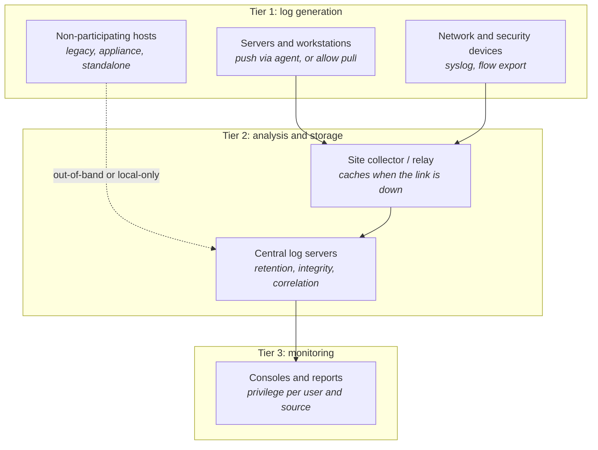
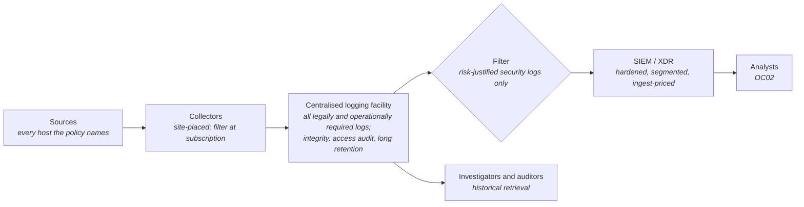
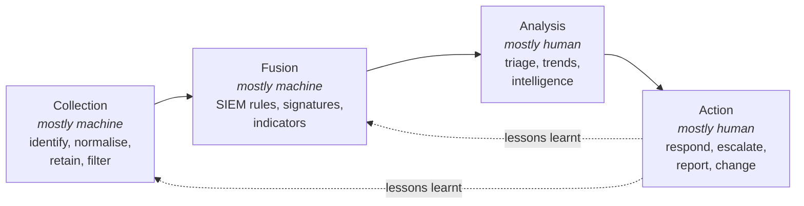
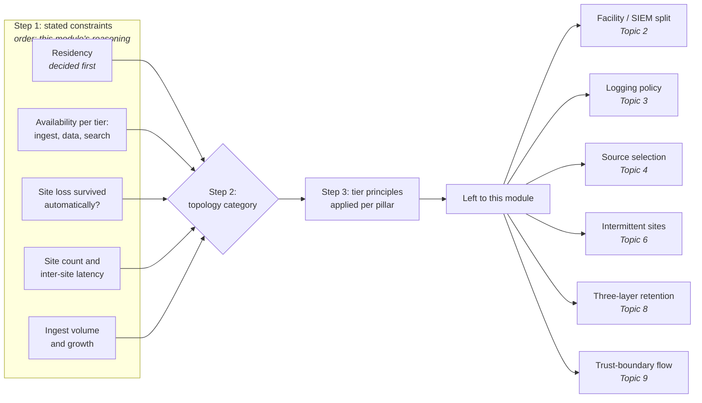

# SA-05: Logging, Monitoring and Detection Architecture

> **Module type:** Extension module (elective deep dive) — part of [EXT-SA](index.md)
> **Status:** Draft
> **Version:** v0.1
> **Last Reviewed:** 2026-09-12
> **Domain Expert:** _Unassigned — required before Practitioner Approved_
> **Practitioner Reviewer:** _Unassigned — required before Practitioner Approved_

!!! warning "Not a credit-bearing unit"
    SA-05 is one module of the [EXT-SA series](index.md). It carries **0 CP**, sits outside the 168 CP degree structure, and does not appear in [`docs/ksat-coverage.md`](../../ksat-coverage.md), which is generated from credit-bearing units only. Recognition, if any, is via the Tier 1 badge mechanism in [`docs/curriculum/micro-credentials-framework.md`](../../curriculum/micro-credentials-framework.md).

---

## Overview

ASD's *Windows event logging and forwarding* opens with a finding that recurs across its investigations: organisations lack sufficient visibility of what their workstations and servers were doing when an intrusion occurred. The failure is rarely a missing detection rule. It is architectural: the event was never generated because the audit policy was left at default; it was overwritten because the local log was 20 MB; it went to a collector no one sized; or everything was poured into a SIEM priced by ingest until someone turned half of it off. This module is about the decisions that produce those outcomes, and how to make them deliberately.

The module treats logging and monitoring as an **architecture problem with four dimensions**: *placement* (which tier performs which function, and where collectors, central stores and analytic platforms sit relative to the network and each other), *selection* (which sources are generated, forwarded and analysed, in what order, and why), *flow* (how events cross sites, trust boundaries and providers, with what protection and buffering) and *retention* (how long each copy lives at each layer, and what that costs). It is built on NIST SP 800-92 *Guide to Computer Security Log Management* (2006) for the tiered infrastructure model; four ASD publications for the Australian requirements, *Best practices for event logging and threat detection* (2024), *Priority logs for SIEM ingestion: Practitioner guidance* (2025), *Implementing SIEM and SOAR platforms: Executive guidance* (2025) and *Windows event logging and forwarding* (2021, hereafter WELF); CREST's *Cyber Security Monitoring and Logging Guide* (2015) for structuring the capability; and, as one worked vendor example only, *Splunk Validated Architectures* (2021) for reading a validated architecture as a design input (Topic 12).

It does **not** teach what the degree already covers. SIEM platform engineering (ingest pipelines, storage tiers, SOAR, XDR) is [SE04](../../../degrees/strategic/security-engineering/SE04-detection-response-engineering.md) and, for one product, [EXT-SPL](../splunk/index.md). SIEM operation, detection content, triage and the SOC operating model are [OC02](../../../core/units/OC02-security-monitoring-siem.md). Technique-to-data-source mapping, coverage auditing and normalisation technique are [DE02](../../../degrees/operational/detection-engineering/DE02-data-sources-log-engineering.md). Log formats, parsing, correlation mechanics and analysis are [F06](../../../core/units/F06-data-log-analysis.md). Where this module reaches one of those boundaries it links and stops.

The Australian framing is intrinsic rather than appended: the logging baseline used throughout is the Australian-led *Best practices* publication, and the ASD SIEM/SOAR suite is written for Australian executives and practitioners. Retention, sovereignty and sourcing are treated in those terms from the first topic.

---

## Where this module fits

| Unit / module | Relationship |
|---|---|
| [EXT-SA index](index.md) | Series positioning, verification status and reading order. |
| [SA-01 — Business-Driven Security Architecture in Practice](sa-01-business-driven-architecture-in-practice.md) | Traceability discipline: every placement and retention decision here traces to a policy requirement, as SA-01 traces controls to business attributes. |
| [SA-03 — Modern Defensible Architecture and NIST CSF 2.0](sa-03-modern-defensible-architecture-and-csf.md) | The Detect function this module structures the telemetry for. |
| [SA-04 — Network, Gateway and Access Architecture under the ISM](sa-04-network-gateway-and-access-architecture.md) | **Immediate predecessor.** The segments, gateways and boundaries SA-04 designs are the trust boundaries log flow must cross in Topic 9. |
| SA-06 — Assurance, Capability Maturity and System Authorisation | **Successor** (plain-text reference). Takes the validation regime from Topic 11 and the residual-risk record from Topic 6 into system authorisation and capability maturity. |
| [SC02 — Security Architecture](../../../core/units/SC02-security-architecture.md) | **Hard prerequisite** for the series. Architecture method assumed. |
| [SE02 — Security Architecture (major)](../../../degrees/strategic/security-engineering/SE02-security-architecture.md) | Applied SABSA, reference architectures and the Australian regulatory context are assumed, not repeated. |
| [SE04 — Detection & Response Engineering](../../../degrees/strategic/security-engineering/SE04-detection-response-engineering.md) | **Boundary.** SE04 builds the platform; SA-05 decides what feeds it, from where, and for how long. |
| [OC02 — Security Monitoring & SIEM](../../../core/units/OC02-security-monitoring-siem.md) | **Boundary.** SIEM operation, detection content and the SOC operating model. |
| [DE02 — Data Sources & Log Engineering](../../../degrees/operational/detection-engineering/DE02-data-sources-log-engineering.md) | **Boundary.** Technique-driven source mapping and coverage auditing; Topic 4 supplies the asset-criticality view that complements it. |
| [F06 — Data & Log Analysis](../../../core/units/F06-data-log-analysis.md) | Formats, parsing, time basics and analysis assumed. |
| [SPL-07 — Architecture & Deployment](../splunk/spl-07-architect.md) | Splunk-specific depth behind the vendor validated-architecture example read in Topic 12; not repeated here. |
| [EXT-ANS](../ansible-security-automation.md) | Lab 7 there builds the silent-host check and breaks forwarding three ways; Lab 4 here specifies the interval and evidence that check must meet. |
| [SC04 — Vendor & Supply Chain Risk](../../../core/units/SC04-vendor-supply-chain-risk.md) | The sourcing decision in Topic 10 is a supplier-risk decision. |
| [GR05 — Audit & Assurance](../../../degrees/strategic/grc/GR05-audit-assurance.md) | IRAP-as-audit for the logging estate; this module designs what the assessor will examine. |

---

## Prerequisites

- [SC02 — Security Architecture](../../../core/units/SC02-security-architecture.md) (required; series prerequisite)
- [OC02 — Security Monitoring & SIEM](../../../core/units/OC02-security-monitoring-siem.md) (required; SIEM pipeline and SOC model assumed)
- [F06 — Data & Log Analysis](../../../core/units/F06-data-log-analysis.md) (required; formats, parsing and time basics assumed)
- [SA-04](sa-04-network-gateway-and-access-architecture.md) (recommended; the boundaries Topic 9 crosses)
- [SE04](../../../degrees/strategic/security-engineering/SE04-detection-response-engineering.md) or [DE02](../../../degrees/operational/detection-engineering/DE02-data-sources-log-engineering.md) (recommended)
- A Linux shell, a text editor and enough comfort with a syslog daemon to read its configuration

---

## Learning outcomes

On completion, a learner can:

1. **Analyse** an organisation's logging estate against the NIST SP 800-92 three-tier model and ASD's two-stage centralisation pattern, identifying where each function executes, what the SIEM should and should not hold, and which hosts cannot participate.
2. **Design** a source-selection register that orders sources by asset criticality and source category, records each source's purpose, volume, analytical value and reliability, and sequences onboarding incrementally.
3. **Design** a collection and forwarding topology — collector placement and ceilings, filtering points, relay buffering, transport protection and pipeline-health telemetry — that generalises across operating systems and sites.
4. **Evaluate** a retention schedule across source buffer, collector archive and central store against investigation dwell times, Australian obligations and storage allocation.
5. **Justify** the executive decisions a monitoring capability requires — sourcing model, ingest-cost exposure, SIEM-before-SOAR sequencing and testing — in terms of risk, cost and obligation.
6. **Create** a validation regime that proves the architecture generates, forwards, retains and protects the events its policy mandates, including the specification of silent-source detection.

> Bloom's 4–6 (Analyse / Evaluate / Create), consistent with the strategic-layer expectations in [`docs/content-standards.md`](../../content-standards.md).

---

## AQF Level 7 Alignment

**Knowledge (AQF 7.1):** specialised knowledge of log management infrastructure models, Australian event-logging baselines and the economic and legal constraints on retention and sourcing. **Skills (AQF 7.2):** cognitive skills to analyse an estate against a reference model and to design placement, flow and retention under stated constraints; communication skills to defend those designs to executives. **Application (AQF 7.3):** applies these with initiative and judgement to a realistic Australian organisation, taking responsibility for stating what the design does not achieve.

> This alignment statement is notional. SA-05 is not credit-bearing and has not been through the AQF mapping process in [`docs/compliance/aqf-teqsa.md`](../../compliance/aqf-teqsa.md).

---

## Framework mappings

> **Provisional pending Framework Custodian review.** These do **not** feed [ksat-coverage](../../ksat-coverage.md).

### NIST NICE DCWF

| Version | Work Role | Code | T-Code | Task | Demonstrated in |
|---|---|---|---|---|---|
| 2023 | Security Architect | SP-ARC-002 | T0050 | Design system security architecture and supporting infrastructure | Lab 1, Summative |
| 2023 | Enterprise Architect | SP-ARC-001 | T0473 | Document and address organisational requirements in system design | Lab 2, Formative 2 |
| 2023 | Cyber Defense Infrastructure Support | PR-INF-001 | T0335 | Build and maintain monitoring infrastructure | Lab 3, Lab 4 |
| 2023 | Security Control Assessor | SP-RSK-002 | T0177 | Assess controls against frameworks and identify gaps | Lab 4, Summative |

### SFIA 9

| Skill | Code | Level | Demonstrated in |
|---|---|---|---|
| Solution architecture | ARCH | Level 5 | Lab 1, Summative |
| Infrastructure design | IFDN | Level 5 | Lab 3, Summative |
| Requirements definition and management | REQM | Level 4 | Lab 2, Formative 2 |
| Data management | DATM | Level 4 | Lab 2 (retention register) |
| Information assurance | INAS | Level 4 | Lab 4 |
| Specialist advice | TECH | Level 5 | Summative (executive brief) |

### ASD Cyber Skills Framework

| Domain | Sub-domain | Proficiency | Demonstrated in |
|---|---|---|---|
| Security Architecture | Monitoring and logging architecture | Practitioner–Advanced | Lab 1, Lab 3, Summative |
| Defensive Operations | Monitoring Infrastructure | Advanced | Lab 3, Lab 4 |
| Governance, Risk and Compliance | Security Governance | Practitioner | Formative 2, Summative |

### Project-local KSATs

| Type | ID | Statement | Demonstrated in |
|---|---|---|---|
| Knowledge | SA-05-K01 | Knowledge of the NIST SP 800-92 three-tier infrastructure model and its second-tier topology variants | Topic 1; Lab 1 |
| Knowledge | SA-05-K02 | Knowledge of ASD's two-stage pattern (centralised facility, then SIEM) and the filter between them | Topic 2; Lab 1 |
| Knowledge | SA-05-K03 | Knowledge of the mandatory contents of an enterprise-approved logging policy | Topic 3; Formative 2 |
| Knowledge | SA-05-K04 | Knowledge of ASD's asset-criticality and source-category priority orders and per-source assessment criteria | Topic 4; Lab 2 |
| Knowledge | SA-05-K05 | Knowledge of collector ceilings, placement rules, subscription filtering and relay buffering | Topic 5; Lab 3 |
| Knowledge | SA-05-K06 | Knowledge of layered retention sizing and the ASD 18-month recommendation | Topic 8; Lab 2 |
| Knowledge | SA-05-K07 | Knowledge of the local-retention, bounded store-and-forward, synchronisation-order and local-analysis decisions a site with intermittent connectivity requires, and which of them are source positions versus design inference | Topic 6; Lab 3 |
| Knowledge | SA-05-K08 | Knowledge of what a vendor validated architecture decides (platform topology category by scale, availability and disaster recovery; collection mechanism per data origin) and which logging-architecture decisions it leaves open | Topic 12; Lab 1 (reflection 4) |
| Skill | SA-05-S01 | Skill in mapping an estate's sources onto tiers, stores and non-participating classes | Lab 1 |
| Skill | SA-05-S02 | Skill in producing a per-source assessment and an incremental onboarding sequence | Lab 2 |
| Skill | SA-05-S03 | Skill in building and validating a buffered, encrypted two-hop forwarding path and specifying its silent-source detection | Lab 3; Lab 4 |
| Skill | SA-05-S04 | Skill in selecting a validated-architecture topology category from stated ingest, availability, site and residency constraints and recording the decisions it leaves to the logging architecture | Topic 12; Lab 1 (reflection 4) |
| Ability | SA-05-A01 | Ability to justify a placement, retention or sourcing decision to an executive in terms of risk, cost and obligation | Summative |
| Ability | SA-05-A02 | Ability to design log flow across an OT, cloud or provider trust boundary | Topic 9; Summative |
| Ability | SA-05-A03 | Ability to design a validation regime that proves the logging architecture works as its policy claims | Lab 4; Summative |
| Ability | SA-05-A04 | Ability to size and justify the logging architecture of a site whose link to the central tier is intermittent, including the drop policy, synchronisation order and the visibility gap accepted as residual risk | Topic 6; Lab 3; Summative |

---

## Module structure

| Part | Topics | Labs | Notional hours |
|---|---|---|---|
| A — Reference models and placement | 1–2 | 1 | 3 |
| B — Policy and source selection | 3–4 | 2 | 5 |
| C — Flow: forwarding, intermittent connectivity, function placement, integrity | 5–7 | 3 | 6 |
| D — Retention and trust boundaries | 8–9 | — | 2 |
| E — Capability structure, capacity, assurance and vendor reference architectures | 10–12 | 4 | 5 |
| F — Assessment | — | Formatives, Summative | 3 |
| | | | **24 hours** |

---

## Topics

### Topic 1: The Three-Tier Reference Model

NIST SP 800-92 names the problem every architecture must solve: "effectively balancing a limited quantity of log management resources with a continuous supply of log data" (ES-1). Its three tiers are **log generation** (hosts pushing entries through an agent, or letting a server pull them), **log analysis and storage** (collectors receiving data in real time or batches) and **log monitoring** (consoles, reports and management functions, with privilege limitable per user and source).

The second tier is where placement decisions live. NIST describes four shapes:

| Second-tier shape | Use it when | Cost |
|---|---|---|
| Single server | Small estate, one site, no availability need | Single point of failure |
| Specialised servers: collect and analyse on one, store long term on another | Retention and analysis have different storage profiles | Two systems to keep in step |
| Multiple servers with failover, each serving a subset of generators | Generators must survive a server outage | Cross-server sharing for estate-wide analysis |
| Two levels: first-level servers forward to a central level | Multiple sites, unreliable or Internet-only links, or a central tier that must not be directly reachable | Two hops of latency; first-level caches to size and protect |

The two-level shape matters most: first-level **caching servers** buffer when the link is down and shield the central tier from direct attack (3-2). It is the ancestor of every relay design in Topic 5.

Two further decisions belong here. **Transport**: NIST recommends a separate logging network for high-volume devices and server-to-server transfer, since the production network may be saturated during the very incident that generates the logs; encryption is the fallback (3-2). **Scope**: large organisations run several infrastructures that need not interoperate, split by organisational structure, system type, log type or facility (3-1, fn 21); how many exist, and which hosts can join none, precedes any product choice.

!!! note "NIST's regulatory drivers are American"
    SP 800-92 motivates retention with FISMA, HIPAA, SOX, GLBA and PCI DSS, none of which applies in Australia; substitute the obligations in the Australian context section.

### Topic 2: Centralised Facility, Then SIEM

ASD's *Priority logs for SIEM ingestion* reshapes the NIST second tier with a **two-stage** premise: stage one creates, collects and transfers logs to a centralisation point; stage two ingests logs into the SIEM, directly from sources or from that point (p. 5). ASD warns against treating the SIEM as the repository for every log. Law and regulation will require many sources to be logged; the SIEM should hold only the security logs the organisation's risk profile justifies.

*Best practices for event logging and threat detection* reaches the same split from the other side: aggregate everything in a hardened central facility (a data lake is its example) and pass a filtered, higher-value subset to the SIEM or XDR, which it treats as both the analytic engine and a potential single point of failure that must be hardened and segmented (pp. 11–12). The *Executive guidance* supplies the economics: most SIEM pricing is keyed to ingested volume, uncapped products can run up very large bills, and a log management tool may be cheaper where centralisation is the primary need (p. 4).

In NIST terms both the facility and the SIEM are second-tier components, and the filter is NIST's *event filtering* function placed between them rather than at the console. The split of responsibilities:

| Concern | Centralised facility | SIEM / XDR |
|---|---|---|
| What it holds | Everything policy, law or operations require, from every participating source | The subset with a stated detection or investigation use case |
| Retention | The long layer (Topic 8) | Working retention for correlation; older data retrieved from the facility |
| Primary controls | Integrity, restricted access, audit of access, backup, segmentation | Hardening, segmentation, content governance (OC02, SE04) |
| Cost driver | Storage volume and media | Ingest volume and licence |
| Failure mode | Loss of evidence | Loss of detection |

Small organisations may collapse the two into one platform, provided the SIEM's ingest is a chosen subset, not an accident of history.

### Topic 3: The Logging Policy as the Governing Artefact

Every decision in this module should trace to a document someone with authority approved. ASD's first key factor for logging best practice is an **enterprise-approved event logging policy** (*Best practices*, p. 4), whose contents it keeps compact: which events are logged, which facilities are used, how logs are monitored, how long they are kept, when to reassess what is worth collecting, and any responsibilities shared with service providers (p. 5).

NIST SP 800-92 makes those contents precise by separating mandatory requirements from recommendations across four areas (4-3 to 4-5): **generation** (which hosts, components, event types and fields, how often), **transmission** (which hosts forward what, over which protocols, with what protection in transit), **storage and disposal** (rotation, protection, retention at system and infrastructure level, disposal, preservation requests) and **analysis** (frequency at each level, who may access logs, how access is logged, what happens on anomaly). Policy must also say who may establish an infrastructure, and procurement and custom development must carry logging requirements. CREST adds that it must explicitly cover outsourced and cloud systems (2015, p. 16).

NIST's method is iterative: draft the policy, attempt a design that satisfies it, find the elements that make the design infeasible, and revise the policy while still meeting legal requirements, expecting several cycles (4-9). More is not better: enabling every auditable event can cripple a host and overwrite entries faster than they can be read (4-7). Mandate only the most important data; recommend the rest as resources permit.

!!! warning "Consult before you collect"
    NIST notes that logs capture passwords and message content, that storing such content long term may breach the organisation's own retention policy, and that privacy officers must be consulted where logs contain personal information (2-1 fn 2, 4-7). Treat legal and privacy review as a policy input, not a post-deployment check.

Policy is reviewed on triggers (audits, legal change, administrator feedback); NIST's example of cutting host-firewall scan logging by blocking scans at the perimeter (4-7) shows that policy and topology move together.

### Topic 4: Selecting Sources

The sources supply two orders. *Best practices* orders by **asset criticality**, weighing likelihood of targeting, impact and usefulness for exposing living-off-the-land activity (p. 8), from critical systems, internet-facing services and identity infrastructure down to user computers and legacy assets (pp. 8–9). *Priority logs* orders by **source category**: endpoint detection and response, then network devices, directory services, endpoints, virtualisation, OT, cloud, containers and databases (pp. 7–33): which assets, then which channels on each.

Neither order is binding: *Priority logs* asks for a per-source assessment before onboarding, reorderable for reliability, visibility, ingest performance and cost (p. 5):

| Assessment field | Question the architect answers | Source |
|---|---|---|
| Purpose | Why the source is in the design; logging for its own sake is discouraged | *Priority logs* p. 5 |
| Priority | Onboarding order; top sources first, health-checked regularly | *Priority logs* p. 5 |
| Volume | Expected and peak rate; whether it overshadows value | *Priority logs* p. 5; NIST 4-9 |
| Analytical value | What it detects alone or corroborates | *Priority logs* p. 5; NIST 2-6 |
| Reliability | Could host or transport let an attacker alter entries | NIST 2-7; *Priority logs* p. 5 |
| Generation precondition | Audit setting or agent that must exist first | *Priority logs* annex pp. 34–37 |
| Known blind spots | Events deliberately not forwarded, and where they remain | WELF pp. 7–11 |

**Generation is part of the architecture**: many high-value channels exist only once an audit policy enables them, so the *Priority logs* annex of audit settings is a design input. **Value and noise are separate axes**: ASD rates each Windows event category on both, process tracking high on both and PowerShell low value but high noise (WELF, pp. 3–5); the matrix transfers to any operating system. **Onboard incrementally** (*Priority logs*, p. 4), health-checking high-priority sources regularly (p. 5).

CREST's top-down complement runs business objective, use case, scenario, then the few logs serving many scenarios (2015, p. 22); its source tiering is dated and not reused. The technique-driven view is DE02's.

### Topic 5: Collection and Forwarding Topology

WELF is a worked example of a forwarding tier whose rules generalise to any operating system and any agent or syslog design. Events reach a collector by **push** (ASD's choice) or pull; **subscriptions** define which events, from which hosts, how often; and the collector forwards onward to a centralised facility or holds enough disk for archival and backup (p. 12). Those are four decisions: initiation direction, filter definition, collector-to-centre path, and collector retention.

**Ceilings and placement.** ASD, citing Microsoft guidance, limits a commodity collector to about 10,000 hosts and under 10,000 events per second, scaling by directing groups of hosts to their nearest collector through policy, placed by location and WAN bandwidth (pp. 12–13). Generalised: every collector class has a stated ceiling, collectors are placed by site and link capacity, and sources are routed by policy, not by hand.

**Filtering at the subscription.** Subscriptions forward valuable events and drop noisy ones, and ASD is candid about the cost: Kerberos logon events are dropped for volume, which may obscure ticket misuse even though the data stays on each host; system-account object access and routine scheduled-task changes likewise (pp. 7, 10–11). A sound architecture **documents its blind spots** and where the un-forwarded data remains.

**Surges and collector posture.** A new subscription by default reads each host's existing archive, producing a burst when hosts first forward (p. 16); any agent rollout does the same. The collector is hardened as a security system: dedicated, firewall-restricted, remote shell disabled, archives protected because they expose sensitive data and invite tampering (pp. 13–17).

**Transport.** NIST's syslog baseline: the original protocol has no delivery assurance, access control or encryption; TCP, TLS and message digests answer each, and access lists limit who may send (3-5 to 3-8). Rate limiting protects the server but discards the flooding source's messages during the very event that produced them (3-8). Hosts that cannot participate (standalone, legacy, security-limited appliances) get out-of-band transfer to write-once media or local-only management (3-2, 4-8 to 4-9); intermittently or low-bandwidth connected hosts remain in scope but may need the design to minimise what they transmit (3-2, 4-8), which Topic 6 takes up.

### Topic 6: Logging Architecture Under Intermittent Connectivity

Some sites lose their central link for hours or days: remote sites, vessels, field operations, OT plants, disaster response. SP 800-92 accepts that such hosts may be able to take only a limited part in the infrastructure while insisting their logs matter no less (3-2). This module's reading of that position: **a site that is cut off must still generate, keep and be able to inspect its own logs** (NIST's footnote on local management at the source, 3-2, and its system-level storage option, 5-2, point the same way).

**Sizing local retention.** NIST's caching servers hold logs until connectivity permits (3-2). WELF requires a non-forwarding collector to hold adequate disk, archive not overwrite, and monitor disk (pp. 12, 16–17). Neither gives a formula; this module's reasoning: **local retention = expected outage × peak ingest rate + margin** for surges.

**Bounded store-and-forward.** The queue is bounded, with a documented behaviour at the bound. NIST lists the choices a log source offers when its local log fills: overwrite oldest or stop the generator, with alerts at 80–90 percent full (5-3 to 5-4). Applying that choice set to the relay queue, and adding drop newest, is this module's reasoning.

**Prioritised synchronisation** (this module's reasoning). When the link returns, send alerts and summaries first, then priority sources, then raw bulk; ASD's timely-ingestion principle (*Best practices*, p. 12) motivates the order.

**Content down as well as data up.** Collection configuration and detection content reach the site by the same intermittent path or offline media, versioned against stale rules (this module's reasoning; WELF pushes configuration centrally, pp. 13, 15).

**Time.** NIST has administrators ensure each system's clock is synchronised to a common time source (5-10). A cut-off site needs a local holdover source, its accepted drift recorded (this module's reasoning).

**Residual risk** (this module's reasoning). The centre is blind to the site for the outage. Record the visibility lost as accepted residual risk in the assurance pack (none of the sources addresses the gap); SA-06, later in this series, takes that record into system authorisation.

| Design decision | Source position | This module's reasoning | Evidence for the assurance pack |
|---|---|---|---|
| Local retention size | Caching servers and system-level copies (NIST 3-2, 5-2); size on peak volume (4-9); adequate collector disk, archive not overwrite (WELF pp. 12, 16–17) | Outage duration × peak rate + margin | Sizing arithmetic; disk allocation; 80–90 percent alert |
| Queue bound and drop policy | NIST's choices for a full local log and its near-full alert (5-3 to 5-4) | Same choice set applied to the relay queue, plus drop newest; policy stated per source class and recorded as a blind spot | Queue configuration; the written policy |
| Synchronisation order | Timely ingestion (*Best practices*, p. 12) | Alerts and summaries, then priority sources, then raw | Forwarder priority configuration; catch-up test record |
| Local analysis functions | System-level analysis and local log infrastructure (NIST 5-7, 4-8 to 4-9) | Parsing, filtering, viewing, reporting; integrity and correlation if defended locally | Local console access; local review record |
| Content distribution | Configuration pushed centrally (WELF pp. 13, 15) | Versioned offline distribution of configuration and detection content | Content version at site against centre |
| Time | Common source (NIST 5-10); trustworthy, multiple, UTC (*Best practices*, p. 7; WELF, p. 1) | Local holdover source; accepted drift recorded | Time-source configuration; drift check |
| Visibility gap | Not addressed in the sources | Accepted residual risk, stated in the package | Residual-risk entry carried into SA-06 |

### Topic 7: Function Placement, Integrity and Time

NIST SP 800-92 catalogues fourteen infrastructure functions, from parsing and filtering to correlation, reporting and clearing, under one constraint: the original logs are never altered, which is what makes copies usable as evidence (3-3 to 3-5). Placement follows the collection model: agent-based collection filters, aggregates and normalises on the host, cutting transfer and central load at the price of an agent lifecycle; agentless collection does it centrally, at the cost of bandwidth and a server holding credentials for every host (3-9).

ASD places **normalisation at the point of centralisation**, structured and automated because software and SaaS formats change without notice (*Best practices*, p. 7); the record baseline it relays from US OMB M-21-31 (p. 6), from accurate timestamp through device, session and user identifiers to command executed and a unique event identifier, is a requirement the architecture imposes on sources. How to normalise is DE02; where is here.

**Integrity and segregation.** *Best practices* recommends secure mechanisms such as TLS 1.3 and cryptographic verification in transit and at rest, least-privilege and audited access with deletion limited to a justified few, storage on a separate or segmented network, and redundant backup (pp. 11–12). NIST adds the source side: append-only access, secured generating processes and configuration, and defined behaviour on logging failure, up to suspending the function that cannot be logged (5-4 to 5-5). Separation of duties is a driver in itself: independent review of an administrator's logs is what creates the demand to forward them (4-2).

**Pipeline-health telemetry** is a distinct function: ASD's event-collection category forwards audit-policy changes, log clearing, logging failures and forwarding errors so suppression is visible (WELF, pp. 3, 7). Every collector class needs its equivalent.

**Time** is the correlation key. ASD asks for trustworthy time used consistently, with multiple sources so a degraded primary does not break correlation; UTC in ISO 8601 with milliseconds; and one-way synchronisation, OT taking time from IT and never the reverse (*Best practices*, p. 7). Organisations that believe their logs are synchronised often are not (CREST, 2015, p. 16). F06 teaches the mechanics; the architecture decides sources and direction.

### Topic 8: Retention as a Three-Layer Sizing Problem

Retention is not one number: every event has up to three copies with different lifetimes, each sized by the architecture.

| Layer | What ASD says | What NIST adds |
|---|---|---|
| **Source buffer** | Defaults are small and overwrite; ASD's Windows example raises the Security log to 2 GB, accepting defaults only where logs are forwarded (WELF, p. 2). Generically: local journal size and rotation, set to outlive the longest expected forwarding outage | Choose full-log behaviour: stop (rarely acceptable), overwrite oldest (forwarded, lower-priority sources) or halt (logging-critical systems); alert at 80–90 percent full (5-3 to 5-4) |
| **Collector archive** | About 2 GB in ASD's example; if not forwarded onward, archive rather than overwrite, monitor disk, and back up and protect archives (pp. 14, 16–17) | First-level caches absorb link outages (3-2); archive filtering reduces media (5-4 fn 58) |
| **Central store** | At least 18 months, per *Strategies to Mitigate Cyber Security Incidents*, longer where regulation requires (p. 1); risk-based, since discovery can take 18 months and malware dwells 70 to 200 days; longer for intrusion-confirming logs; hot and cold tiers (*Best practices*, pp. 6, 8) | Separate routine **retention** from **preservation** (3-3); choose a durable format, migrate media, verify by digest, store off site, destroy per policy (5-9 to 5-10) |

NIST's Table 4-1 scales these settings by impact level, from short retention and optional integrity checking (low) to long retention, frequent transfer, mandatory integrity checking and encryption (high) (4-6 to 4-7). The 2006 values are not to be adopted; the *shape*, settings keyed to impact, is the reusable artefact, keyed in Australia to the organisation's own classification and obligations.

!!! note "Dual-location storage is a design principle, not redundancy"
    NIST keeps entries at both system and infrastructure level because either side can fail, because attackers who alter host logs usually cannot reach the central copy and the difference shows what they wanted hidden, and because local administrators need local copies (5-2 to 5-3). ASD agrees: aggregation exists because actors modify or delete local logs to evade detection (*Best practices*, p. 11).

### Topic 9: Log Flow Across Trust Boundaries

Each boundary SA-04 designs is one logs must cross, with its own pattern.

**Operational technology.** Most OT devices run constrained embedded software; heavy logging can degrade them and many cannot log in detail, so sensors, out-of-band channels, logs derived from error codes and data historians supplement them (*Best practices*, pp. 7–8), and where devices cannot log, or log in non-standard formats, the network traffic around them is logged instead (p. 10). *Priority logs* gives the flow options: a dedicated OT SIEM, which doubles the systems staff must know; ICS monitoring products that parse OT-native protocols and emit contextual logs; and, where security supersedes other requirements, data diodes moving logs from OT to the IT SIEM without exposing OT (p. 21). Direct logging from OT assets must be conservative and tested because of safety-critical deterministic messaging (pp. 9–10).

**Cloud.** Logging may be off by default and each service may have its own format or none. Responsibility shifts with the service model, IaaS leaving most with the tenant and SaaS with the provider, so shared responsibility is a design input, and where privacy and sovereignty laws apply the provider's location shapes priorities (*Priority logs*, p. 22; *Best practices*, pp. 10–11). The recurring pattern is control-plane audit, sign-ins including service principals, network flow, storage access and breakglass use, restated per tenancy, not copied from a vendor table.

**Enterprise mobility.** Proxies, organisation-operated DNS, device posture, sign-ins, VPN and MDM/MAM events lead; some monitoring (signalling exploitation, SIM swapping, downgrade attacks) is only possible with the telecommunications provider; and legal advice is required on what may be logged from personally owned devices enrolled in MDM (*Best practices*, p. 10).

**Providers and shared services.** CREST's survey found organisations waiting days for events held by outsourced and cloud providers (2015, p. 45), and a gap between what a provider should disclose for an investigation and what the buyer is contractually entitled to, settled in tenders, SLAs and cloud terms (pp. 48–52). NIST's shared-application pattern, the host managing the logs while each member reviews its own users' entries (2-5 fn 8), is the compact tenancy-boundary design.

### Topic 10: Structuring the Capability and Choosing Where It Lives

CREST's 2015 guide is dated in its standards references but not its models: "Being fully compliant with standards is still likely to leave you exposed to cyber security incidents" (CREST, 2015, p. 14). Monitoring takes two inputs, **events** (internal, external-provider and large datasets) and **intelligence**, fused with context into indicators and incidents (p. 6), so the collection tier must accept external-provider logs and intelligence feeds.

The four-phase cycle (pp. 28–29) fixes which phases the architecture automates and where analysts sit; fusion was the phase respondents found hardest. CREST's prerequisites are architecture inputs: agree scope, locate critical assets, identify external touch points, describe what an attack on them would look like, and minimise attack paths (pp. 26–27); each trigger must be investigable by time, address, port, domain, file and system (pp. 34–35). SOC operating model, tiers and escalation are OC02 Topic 6; capability maturity is SA-06.

**Where the capability lives** is a placement decision for the analysis and storage tiers; CREST's five approaches (2015, pp. 46–47), restated:

| Approach | What the organisation keeps | What it gives up |
|---|---|---|
| Appliance or SaaS | Low cost and effort; compliance coverage | Flexibility, context, depth |
| Bundled with an IT outsourcer | Existing contract; 24/7 cover | Security as first priority; context |
| Managed security provider | Specialists; 24/7; integrated response | Cost growth, lock-in, context, flexibility |
| Captive hybrid | Choice of solution and provider; custom SLAs | Price advantage at small scale |
| In-house | Control, integration, business knowledge, privacy | Highest cost; skills retention; upgrades |

Buyers' top concerns were control of and access to their own data, incident response support, business context and analyst location (pp. 48–50). ASD's *Executive guidance* frames it for Australian executives: sensitive or critical-service organisations may need to stay in-house; outsourcing risks visibility gaps, duplicated work and communication difficulties; a provider is assessed for round-the-clock cover, security posture and foreign storage; and the contract fixes how effectiveness and legislative compliance are verified, what visibility is returned and how liability divides (p. 4). [SC04](../../../core/units/SC04-vendor-supply-chain-risk.md) supplies the supplier-risk method.

### Topic 11: Capacity, Reference Topologies and Assuring the Architecture

**Design for the bad day.** NIST requires the infrastructure to handle peaks (malware outbreaks, penetration tests, vulnerability scans) as well as expected volumes; excess volume is a logging denial of service (2-10, 4-9). Its design factors are typical and peak volume and bandwidth, online and archival storage including backup and disposal time, encryption overhead and analyst time (4-9 to 4-10). Administrators must be able to turn logging down when a worm floods it and up to capture a particular activity, telling the infrastructure administrators so central analysis adjusts (4-8, 5-8). *Best practices* adds latency: delay anywhere in the pipeline delays incident identification (p. 12).

**Reference topologies.** Vendors publish topology ladders keyed to stated thresholds of ingest, availability, disaster recovery and geography. Topic 12 reads one such document as a worked example of how to use a validated architecture as an input to this module's decisions rather than as a substitute for them.

**Executive decisions.** Beyond sourcing (Topic 10), ASD's *Executive guidance* names four more: examine hidden costs, especially ingest pricing and caps (p. 4); plan for sustained costs such as training and ask vendors about cheaper logging options; get the SIEM alerting accurately before adding SOAR; and test alerting internally, then externally once mature (p. 5).

**Assurance.** NIST's validation methods are the architect's proof. **Passive** review samples logging configuration, logs and archives; **active** testing generates events on sample systems (a scan, a penetration test, a remote logon) and confirms the expected data exists and was handled per policy; it needs management approval, and unannounced it doubles as an incident-handling test (5-10 to 5-11). Operations monitor every source's logging status so a silent host is noticed, plus rotation, free space, patching and clock synchronisation (5-10); the infrastructure is audited periodically and the design reviewed on software change or volume growth (5-11). CREST's maintain stage asks for the same independent review (2015, p. 58). SA-06 takes this evidence into system authorisation and capability maturity.

### Topic 12: Splunk Validated Architectures as a Worked Vendor Reference

A **validated architecture** is a platform topology the vendor publishes as proven and repeatable (p. 2). *Splunk Validated Architectures* (January 2021) is organised in three parts: indexing and search topologies, data-collection components, and design principles graded against five pillars (pp. 2–3). Its topology ladder and the cost of climbing it are [SPL-07](../splunk/spl-07-architect.md) Topic 2 and are not restated here. What matters for this module is what it declines to do, which is to supply implementation technology, sizing or any approval of your design (p. 4), and its three-step selection: define requirements, choose a topology, apply tier principles (p. 44).

**Reading it as an input** (this module's reasoning). NIST's tiers (Topic 1) map onto the document's four deployment tiers (p. 39): generation and the first hop are its collection tier, whose optional intermediary forwarders are NIST's first-level caching servers; analysis and storage is its indexing tier; monitoring is its search tier; its management tier NIST folds into administration. So it says how the platform is arranged, not what is logged, from where, for how long or across which boundary; the table records the rest.

| What the validated architecture decides | What it leaves to this module's architecture | Where that decision is made (Topic) |
|---|---|---|
| Indexing and search topology category by ingest, availability and disaster recovery (pp. 5–20) | Whether the platform is the centralised facility, the SIEM or both, and the filter between them | Topic 2 |
| Nothing: it is not a prescriptive approval (p. 4) | The enterprise-approved logging policy every decision traces to | Topic 3 |
| Collection mechanism per data origin: agent, syslog collector, HTTP collector, API node (pp. 23–38) | Which sources, in what order, with what generation precondition and blind spots | Topic 4 |
| When an intermediary forwarding tier is justified and how to keep it redundant (pp. 30–31) | Collector ceilings, filter point, documented blind spots, pipeline-health telemetry | Topics 5, 7 |
| Platform availability and disaster recovery across nodes and sites (pp. 15–20, 38) | Local retention, drop policy and synchronisation order for a site that loses its link | Topic 6 |
| Indexing-tier storage model, file system or object store, keyed to retention length and search profile (pp. 21–22) | Retention at source buffer, collector archive and central store, traced to obligations | Topic 8 |
| Encrypted transit and source authentication between platform components (p. 24; collection-tier recommendation 3, p. 42) | Which trust boundaries the flow crosses and the pattern for each: OT, cloud, provider | Topic 9 |
| Nothing: sizing is excluded (pp. 4, 44) | Peak-volume capacity and the executive cost decisions; platform sizing is SPL-07 | Topics 10–11 |

**Selecting a category** (the order is this module's reasoning; the document's step 1 is only "define requirements", p. 44). Take the constraints in order: residency first, since the vendor-hosted option has its topology chosen by the vendor and confines data to a single vendor-supported region (pp. 5, 7; [Australian context](#australian-context)); then per-tier availability; then whether a site loss must be survived automatically; then site count and inter-site latency; then volume. *Example (this module's invention):* a state agency, two data centres, 150 GB a day, no loss of indexed data or search on a node failure, a site loss tolerated for 24 hours, all data held in Australia. Volume fits one server (p. 8); the data requirement forces a clustered design; the search requirement adds a clustered search tier; the accepted 24-hour recovery makes multi-site unnecessary. Topics 3, 4, 6, 8 and 9 still need answering; none changes with the vendor.

**Vendor neutrality.** Elastic- and OpenSearch-class vendors publish equivalent validated or reference architectures; read them the same way: the requirement behind each step, the stated limitations, what the document declines to decide. The method, not the product, is the outcome. [SPL-07](../splunk/spl-07-architect.md) Topic 2 holds the Splunk-specific ladder and its Lab 1 the sizing the SVA excludes.

**Evidence for the assurance pack** (this module's reasoning): the requirement statement behind the category; the category with the vendor's stated limitations in the residual-risk register; the residency decision dated before the topology; the pillar principles applied and not applied; the separate sizing model; the table above.

---

## Labs & exercises

All labs use free or open-source tooling, or none. No lab requires a paid platform, a cloud account or a trial licence.

!!! note "Runnable guide"
    [`labs/guides/sa-05.md`](../../../labs/guides/sa-05.md) is the how-to for these four labs: measured inputs for Labs 1 and 2 from the lab dataset, and a three-node rsyslog/TLS relay estate (`labs/docker/compose.syslog-relay.yml`) for Labs 3 and 4, plus the onboarding of the sources Topics 4–7 name.

### Lab 1: Map an Estate onto the Tiers and the Two Stages

**Objective:** Take a described estate and produce its logging placement model: which tier each component occupies, which store each source feeds, where the filter sits, and which hosts cannot participate.

**Prerequisites:** Topics 1–2; SC02

**Environment:** No tooling required. Paper, or any diagramming tool that exports Mermaid or an image.

!!! warning "Authorisation boundary"
    Use the supplied fictional estate. Do not model a real organisation's environment without written permission; a logging placement model is a map of where an organisation is blind.

**Instructions:**

1. Read the fictional estate brief: a state-government service delivery agency with two metropolitan sites and six regional offices on constrained WAN links, a hybrid cloud tenancy, an outsourced payroll SaaS, a small OT footprint in a depot, and a legacy records system that cannot run an agent.
2. Draw the NIST three tiers for the estate. Place every named component. Mark which second-tier shape (Topic 1 table) you have chosen for each site and why.
3. Classify every source into one of NIST's four storage options: not stored, system-level only, both system and infrastructure, or infrastructure only. Justify each "both".
4. Apply the two-stage pattern. Mark what goes to the centralised facility, what passes the filter into the SIEM, and state the filter rule in one sentence per source category.
5. Identify the non-participating hosts and assign each an out-of-band or local-only pattern with a transfer expectation.
6. Decide how many log management infrastructures the estate actually has (Topic 1 scope axes) and where they do not interoperate.
7. Write a half-page note on what the model does not show: the trust boundaries you have deferred to Lab 2 and Topic 9.

**Expected output:** A tiered placement diagram; a storage-option table for every source with justification; a one-page filter statement; a non-participating-host register; and the deferrals note. Marked on whether every component has a stated tier and store, not on the specific choices.

**Reflection questions:**

1. Which source did you most want to send straight to the SIEM, and what did the two-stage pattern make you say about it instead?
2. The legacy records system cannot forward. What does your out-of-band pattern cost per week, and who pays it?
3. If the SIEM were lost for a day, which of your sources would still be recoverable, and from where?
4. Read your placement model against a vendor validated architecture (Topic 12): which topology category do the estate's sites, links and availability needs point to, and which of the decisions you made in steps 3 to 6 would that document not have made for you?

### Lab 2: Source Selection and Retention Register

**Objective:** Produce a per-source assessment register that orders the Lab 1 estate's sources for onboarding and assigns each a three-layer retention, traced to policy.

**Prerequisites:** Lab 1; Topics 3, 4 and 8

**Environment:** No tooling required beyond a spreadsheet (LibreOffice Calc or any free equivalent).

!!! warning "Authorisation boundary"
    As Lab 1: fictional estate only. A retention register discloses evidentiary reach.

**Instructions:**

1. Build the register with the seven assessment fields from the Topic 4 table plus three retention columns (source buffer, collector archive, central store) and a policy-clause column.
2. Populate it for at least twenty sources spanning all three ASD priority lists (enterprise, OT, cloud) and the mobility list. Order by asset criticality first, then by source category within each asset.
3. For each source record the generation precondition: the audit setting, agent or provider configuration that must exist before the event does.
4. Record each source's known blind spots, following the WELF practice of stating what is not forwarded and where it remains.
5. Assign retention at each layer. Justify the central-store figure against the ASD 18-month recommendation and the dwell-time reasoning in *Best practices*; mark any source given longer retention because it confirms intrusion.
6. Sequence onboarding in waves of no more than five sources, with a health check defined for each wave before the next begins.
7. Draft the policy clauses (Topic 3 structure) that each register row traces to. Where no clause exists, write it; where the register contradicts the draft policy, revise one.

**Expected output:** The register with all columns populated for twenty or more sources; the onboarding wave plan with health checks; the traced policy clauses; and a short note on the two sources whose priority you moved away from ASD's published order and why.

**Reflection questions:**

1. Which source has the highest volume and the lowest analytical value in your register, and where does it go: facility, SIEM, both or neither?
2. Your 18-month central retention has a storage cost. State it in one sentence an executive could repeat, and name what is lost if it is halved.
3. Where does a technique-driven audit (DE02) disagree with your asset-driven order, and which view wins for onboarding wave one?

### Lab 3: Build a Buffered Two-Hop Forwarding Path

**Objective:** Stand up the generic collector-and-relay pattern from Topics 5 to 7 with free tooling: sources forward over TLS to a site relay that buffers to disk, the relay forwards to a central receiver, filtering happens at the relay, and originals are never altered. The lab proves the Topic 5–7 topology decisions (buffer sizing, ceiling, filter point, blind spot, originals unaltered); parsing, enrichment and data-quality engineering remain SE04 Topic 3 and are not exercised here.

**Prerequisites:** Lab 1; Topics 5–7; F06 (syslog basics)

**Environment:**

- Three Linux VMs or containers (source, relay, central), Ubuntu 22.04 LTS or similar
- `rsyslog` or `syslog-ng` (both free; either can act as source, relay and receiver); Fluent Bit or Vector are acceptable substitutes
- `openssl` for a lab certificate authority; `auditd` on the source
- Minimum hardware: 6 GB RAM / 2 vCPU / 20 GB disk across the three nodes
- Optional: a Windows host forwarding to the relay via native event forwarding, if one is available; not required and no paid licence is assumed

**Instructions:**

1. Create a lab CA and issue certificates to all three nodes. Configure the source to forward `auditd` and system logs to the relay over TCP with TLS, and the relay to forward to the central receiver the same way. Confirm with a packet capture that nothing crosses either hop in cleartext.
2. Configure the relay with a disk-assisted queue sized to hold at least one hour of the source's peak volume. Record the sizing arithmetic.
3. Configure the central receiver to write each source's events to its own file, append only, with a nightly rotation and a digest recorded for each rotated file.
4. Implement filtering **at the relay**, not at the source: drop one named noisy facility before it crosses the WAN, and document it as a blind spot with the location where the full data remains.
5. Generate a burst: write 50,000 events on the source in under a minute. Measure the relay queue depth and the end-to-end latency to the central file.
6. Stop the central receiver for ten minutes while the source keeps generating. Restart it. Prove from digests and counts that nothing was lost and nothing was reordered.
7. Add pipeline-health telemetry: forward the relay's and receiver's own daemon logs to the central store, and confirm the outage in step 6 is visible there.
8. Point a second source at the relay and estimate, from measured per-source rate, how many such sources the relay could carry before it hits the ceiling you set.

**Expected output:** Working configurations for all three nodes committed to a repository (no private keys); the queue-sizing arithmetic; the packet capture excerpt showing TLS-only transport; the blind-spot note; burst and outage measurements with digest evidence of zero loss; the health-telemetry evidence; and the per-relay ceiling estimate.

**Reflection questions:**

1. Your relay buffered a ten-minute outage. What is the longest outage your queue sizing tolerates, and what happens at that limit: drop oldest, drop newest, or block the source?
2. You filtered at the relay. Argue for filtering at the source instead, then state which NIST or ASD principle decides it.
3. If an attacker owned the relay, what could they alter, and which digest or copy would reveal it?
4. Re-size the relay queue for a site whose link is down for 72 hours at the peak rate you measured in step 5 (Topic 6). State the disk required, the drop or overwrite policy you would document, what you would send first when the link returns, and how the visibility lost during the outage would be recorded as residual risk.

### Lab 4: Validate the Architecture

**Objective:** Design and run a NIST-style passive and active validation of the Lab 3 path, and specify the silent-source detection the architecture must support.

**Prerequisites:** Lab 3; Topic 11

**Environment:** As Lab 3.

**Instructions:**

1. Write the validation plan first: for each policy clause from Lab 2 that the Lab 3 path implements, state the passive check (configuration or archive review) and the active check (an event you will generate and the evidence you expect at the central store).
2. Run the passive checks and record findings, including any configuration drift from the committed repository.
3. Run the active checks: perform a remote logon, a privilege escalation and a file permission change on the source. For each, record the time generated, the time it appeared centrally, and whether every field of the Topic 7 record baseline is present.
4. Specify silent-source detection as a design deliverable: for each source class in the Lab 2 register, the interval after which silence is a finding, the evidence the central store must hold to decide it, and who is alerted. Building the check and breaking forwarding three ways is [EXT-ANS](../ansible-security-automation.md) Lab 7; do not repeat it here.
5. Break the architecture in four ways EXT-ANS does not cover: fill the relay's disk queue, skew the relay's clock by ten minutes, expire the relay-to-receiver certificate, and make the receiver's nightly rotation fail. Record which failures the pipeline-health telemetry from Lab 3 step 7 surfaces, how long each takes, and which a silent-source check alone would miss.
6. Write the assurance note an authorising officer would read: what was proven, what was not tested, and which findings would block authorisation.

**Expected output:** The validation plan; passive and active results with latencies and field completeness; the silent-source specification; the four failure records; and the assurance note. A plan without a stated "not tested" section is incomplete.

**Reflection questions:**

1. Which of the four failures took longest to surface, which would a silent-source check alone have missed, and what architectural change would shorten the longest?
2. NIST notes an unannounced active test doubles as an incident-handling test. Who must approve that in your organisation, and what could go wrong without approval?

---

## Assessment

### Formative 1: Which Tier, Which Store?

Twelve short descriptions of sources and components from a fictional estate — a boundary firewall on a saturated link, a SaaS payroll system, a PLC, a domain controller, a contractor's laptop, a monitoring server with privileged access, and so on. For each, state its NIST tier, its storage option, whether it passes the SIEM filter, and the single generation precondition that must be true. Self-marked against a key that argues both sides for the four genuinely contested cases. **Assesses LO1, LO2.**

### Formative 2: Critique the Policy

A two-page draft logging policy for a fictional Australian entity containing at least six defects: a mandatory clause that is infeasible at the stated volume, a retention figure with no basis, a missing shared-responsibility clause for the cloud provider, no preservation procedure, no statement of who may access logs, and a transfer frequency the WAN cannot carry. Identify each defect, cite the NIST or ASD principle it violates, and propose the revision. Marked on whether the revision keeps the policy feasible without abandoning the obligation. **Assesses LO2, LO4, LO5.**

### Summative: Logging and Monitoring Architecture Package

For a described Australian organisation — stated sites and links including at least one site with intermittent connectivity, cloud services, an OT footprint, an outsourced provider, a classification scheme, an incident-discovery history and a budget ceiling — produce:

1. A **placement model**: tiers, second-tier shapes per site, the two-stage split, and the non-participating-host register (Lab 1 pattern).
2. A **source-selection register** with onboarding waves and health checks (Lab 2 pattern), including the two trust boundaries the organisation actually has.
3. A **forwarding topology**: collector placement with stated ceilings, filtering points with documented blind spots, buffering, transport protection and pipeline-health telemetry, and for any intermittently connected site the local retention sizing, drop policy and synchronisation order (Topic 6).
4. A **retention schedule** across all three layers with the storage arithmetic and the obligation each figure traces to.
5. A **sourcing recommendation** (in-house, hybrid or provider) with the contractual provisions the *Executive guidance* requires, and a one-page executive brief covering ingest-cost exposure and SIEM-before-SOAR sequencing.
6. A **validation plan** (Lab 4 pattern) naming what will be proven, how, and what will not be tested.
7. **A statement of what the design does not do** and the residual risk accepted.

Item 7 mirrors the residual-risk register in [SE06](../../../degrees/strategic/security-engineering/SE06-capstone-architecture-design.md) and is weighted heavily here. The package is shaped like an SE06 deliverable but is scoped to logging and monitoring only. **Assesses LO1–LO6.**

**Rubric:**

| Criterion | Exemplary | Proficient | Developing | Beginning |
|---|---|---|---|---|
| **Placement and flow** | Every component has a stated tier, store and path; two-stage split and filter explicit; non-participating hosts handled with costed patterns | Tiers and split present; minor gaps in non-participating hosts | SIEM treated as the only store; filter implied, not stated | No tier model; sources point at a product |
| **Source selection** | Both ASD orders applied and reconciled; per-source assessment complete; generation preconditions and blind spots recorded; waves with health checks | Ordered register with most fields; onboarding sequenced | Unordered list; volume or value missing | Sources chosen by availability |
| **Retention and protection** | Three layers sized with arithmetic and traced obligations; preservation distinguished; integrity, segmentation and access audit designed | Three layers present; obligations named | One retention figure for everything; protection asserted | Defaults accepted without comment |
| **Trust boundaries and sourcing** | OT, cloud and provider flows each use a sourced pattern; sourcing decision justified with contractual provisions | Boundaries identified with workable patterns; sourcing justified | Boundaries named but flows undesigned | Boundaries ignored |
| **Australian obligations** | Retention, sovereignty and privacy handled with named instruments and honest flags on inference | Correct framing with minor imprecision | Generic compliance language | Absent |
| **Validation and candour** | Plan proves policy claims, specifies silent-source detection and has a "not tested" section; residual risk stated plainly | Plan present; limitations stated | Validation is a re-statement of design | No validation; no limitations |
| **Communication** | Executive brief genuinely usable; technical package reviewable by a stranger | Clear with minor lapses | Disorganised or audience-mismatched | Unclear |

**Assessment-to-LO mapping:**

| Assessment task | Learning outcomes addressed |
|---|---|
| Formative 1: Which Tier, Which Store? | LO1, LO2 |
| Formative 2: Critique the Policy | LO2, LO4, LO5 |
| Summative items 1 and 3: placement model and forwarding topology | LO1, LO3 |
| Summative item 2: source-selection register and trust boundaries | LO2 |
| Summative item 4: retention schedule | LO4 |
| Summative item 5: sourcing recommendation and executive brief | LO5 |
| Summative items 6 and 7: validation plan and limitations statement | LO6 |

---

## Australian context

**The baseline is Australian-led.** *Best practices for event logging and threat detection* was developed by ASD's ACSC with agencies of the United States, United Kingdom, Canada, New Zealand, Japan, the Republic of Korea, Singapore and the Netherlands (p. 4), and its four key factors (an enterprise-approved logging policy, centralised access and correlation, secure storage and integrity, and a detection strategy) are the spine of Topics 2, 3, 7 and 8. WELF exists because ASD's own investigations kept finding organisations without visibility of their workstations and servers (p. 1). All four ASD documents direct incident reporting to cyber.gov.au and 1300 CYBER1.

**Retention and the Essential Eight.** ASD's recommended retention of at least 18 months is stated in WELF as coming from *Strategies to Mitigate Cyber Security Incidents*, with longer periods where regulation requires (p. 1). The *Executive guidance* states that SIEM and SOAR platforms assist with the Essential Eight Maturity Model, which requires log data to be collected and centralised (p. 2), and *Best practices* points to the ISM's *Guidelines for System Monitoring* for the event details to record (p. 7). This module cites **no ISM control identifiers**; learners take control intent from the current ISM edition, and Essential Eight assessment is [GR03](../../../degrees/strategic/grc/GR03-compliance-frameworks.md).

**Sovereignty and providers.** Both ASD practitioner documents state that where privacy and data sovereignty laws apply, the location of a provider's infrastructure may shape cloud logging priorities (*Priority logs*, p. 22; *Best practices*, p. 11), and the *Executive guidance* asks executives to consider whether a monitoring provider is bound by foreign data-storage requirements or located abroad, and to contract for verification of compliance with the organisation's legislative and regulatory requirements (p. 4). The principle for the logging estate is *residency before topology*. Naming the Australian instruments that bite, the *Privacy Act 1988* (Cth) and its cross-border disclosure principle, the Hosting Certification Framework for government hosting and the PSPF for non-corporate Commonwealth entities, is this module's inference, not a statement in the sources, and is flagged below. [SPL-07](../splunk/spl-07-architect.md) treats residency for one platform; [GR04](../../../degrees/strategic/grc/GR04-australian-regulatory-environment.md) is the regulatory home.

**Personal information in logs.** *Best practices* calls for legal advice on what may be logged from personally owned devices enrolled in MDM, giving GPS location as the example (p. 10), and priority protection for logs that must record sensitive data (p. 11); NIST requires privacy officers in the planning (2-1 fn 2). Logs routinely contain personal information, so the Australian Privacy Principles, administered by the OAIC, apply to every copy at every layer of Topic 8, and a compromise of the logging estate is assessable under the Notifiable Data Breaches scheme the OAIC also administers. That reading is an inference consistent with how [F06](../../../core/units/F06-data-log-analysis.md) and [OC02](../../../core/units/OC02-security-monitoring-siem.md) frame the scheme, and is flagged as such.

**Critical infrastructure and proportionality.** *Best practices* is addressed in part to critical infrastructure providers (p. 5), and its OT guidance applies directly to Australian responsible entities; the connection to obligations under the *Security of Critical Infrastructure Act 2018* (Cth) is an inference the sources do not make, and [SE04](../../../degrees/strategic/security-engineering/SE04-detection-response-engineering.md) covers the reporting side. At the other end of the scale, the *Executive guidance* is explicit that a SIEM is not the only option: log management tools may be more cost-effective where centralisation is the main need, and CISA's Logging Made Easy is named as a no-cost platform for small and medium organisations without a SOC (p. 5, endnote 2). CREST's 2015 intelligence-source table names AUSCERT among CERT services (p. 33); nothing further about AUSCERT is stated in the sources.

---

## Verification status

| Item | Status | Action required |
|---|---|---|
| Project-local KSAT IDs SA-05-K01 to K08, S01 to S04 and A01 to A04 | **Provisional** | Framework Custodian review |
| NICE DCWF T-codes T0050, T0473, T0335, T0177 and work-role assignments | **Provisional** | Reused from existing repository units; Framework Custodian verification |
| SFIA 9 skill codes and level ranges (ARCH 4–6, IFDN 2–6, REQM 2–6, DATM 2–6, INAS 2–7, TECH 4–6) | **Verified against sfia-online.org 2026-09-12** | Per-module level assignment provisional; Framework Custodian review |
| ASD Cyber Skills Framework domain, sub-domain and proficiency wording | **Provisional** | Confirm against the published framework; sub-domain names aligned with SPL-07 and index.md |
| ISM references: no control identifiers cited; edition year in Further reading (2026) | **Unverified** | *Guidelines for System Monitoring* is named by title only (per *Best practices* p. 7); any identifiers must come from the current ISM edition; confirm the edition year against cyber.gov.au |
| Retention of at least 18 months attributed to *Strategies to Mitigate Cyber Security Incidents* | **Attributed via WELF p. 1** | Confirm the current *Strategies* publication still states it |
| Collector ceiling of about 10,000 hosts and 10,000 EPS | **ASD citing Microsoft (WELF p. 12)** | Do not present as ASD's own figure; confirm current Microsoft guidance |
| ASD publication dates, co-authoring agencies and currency (*Best practices* 2024, *Priority logs* 2025, *Executive guidance* 2025, WELF 2021) | **Unverified** | *Priority logs* and *Executive guidance* show Commonwealth copyright 2025 only; confirm months, partners and any later revisions on cyber.gov.au; WELF platform minimums are dated |
| NIST SP 800-92 edition | **2006 edition read** | Rev. 1 (*Cybersecurity Log Management Planning Guide*) is referenced by *Best practices* p. 16 but was not read; no Rev. 1 content is cited |
| *Splunk Validated Architectures* (January 2021 edition; page numbers in Topic 12 are the printed page numbers of that edition) and the statement that other vendors publish equivalents | **Edition read; equivalents unverified** | Thresholds and topology categories may be superseded, cited for method only; confirm the current edition on splunk.com and vendor documentation before naming any equivalent |
| Topic 12: the mapping of NIST SP 800-92 tiers onto the SVA deployment tiers, the ordering of constraints in the selection paragraph and diagram (residency, availability, site loss, sites and latency, volume), the "what it leaves to this module" column of the table, the worked selection example and the list of SVA-derived assurance-pack artefacts | **This module's own reasoning** | Not stated in the SVA or SP 800-92; practitioner review before promoting beyond Draft |
| CREST guide (2015) standards references (ISO 27002 clause, SANS control numbering, PCI DSS v3.1) | **Dated in source; not repeated** | None |
| Privacy Act 1988 / APP and OAIC, Hosting Certification Framework, PSPF and SOCI Act 2018 connections | **Author's inference** | Not stated in the sources; confirm with GR04/F05 material before promoting beyond Draft |
| Essential Eight Maturity Model logging requirements | **Executive guidance p. 2 statement only** | Maturity-level wording not verified; learners consult the current model |
| CISA Logging Made Easy availability, licence and publication year; ASD Windows Event Logging repository URL | **Unverified** | Confirm before recommending as lab tooling; no publication year appears in the sources read |
| Topic 6 design recommendations: the retention formula (outage × peak rate + margin), "drop newest" as a queue option, the synchronisation order, the list of tier functions required locally, offline distribution of configuration and detection content, the local holdover time source, and the treatment of the outage visibility gap as accepted residual risk | **This module's own reasoning** | Not stated in SP 800-92 or the ASD publications; only the caching-server, system-level-copy, peak-volume-factor, full-log-option, system-level-analysis, collector-disk, central-configuration, timely-ingestion and time-source statements are source positions (cited inline); practitioner review before promoting beyond Draft |
| Links to index.md, SA-01, SA-03 and SA-04 | **Depend on earlier PRs in the stack** | Series is delivered as stacked PRs; each target must exist before `mkdocs build --strict` |
| MITRE ATT&CK technique IDs | **None cited** | Detection content is out of scope; no v19 pin required |

This module has **not** had practitioner review (R2).

---

## Further reading

**National Institute of Standards and Technology (2006).** *SP 800-92: Guide to Computer Security Log Management.* https://csrc.nist.gov/pubs/sp/800/92/final
> Relevance: The tiered infrastructure model, function catalogue, policy structure, impact-keyed settings pattern and validation methods in Topics 1, 3, 5, 6, 7, 8 and 11. Public domain; attribution requested.

**Australian Signals Directorate (2024).** *Best practices for event logging and threat detection.* https://www.cyber.gov.au/resources-business-and-government
> Relevance: The Australian-led baseline: policy contents, priority orders, hot and cold tiering, retention reasoning, secure storage and integrity, and time architecture (**Australian source**).

**Australian Signals Directorate (2025).** *Priority logs for SIEM ingestion: Practitioner guidance.* https://www.cyber.gov.au/resources-business-and-government
> Relevance: The two-stage architecture premise, the per-source assessment criteria, the source-category order and the OT and cloud flow options in Topics 2, 4 and 9 (**Australian source**).

**Australian Signals Directorate (2025).** *Implementing SIEM and SOAR platforms: Executive guidance.* https://www.cyber.gov.au/resources-business-and-government
> Relevance: The executive decision set in Topics 10 and 11: in-house versus outsourced, ingest-based pricing, sequencing and testing (**Australian source**).

**Australian Signals Directorate (2021).** *Windows event logging and forwarding.* https://www.cyber.gov.au/resources-business-and-government
> Relevance: The worked forwarding topology generalised in Topic 5, the collector-disk and time-source statements used in Topic 6, the value-and-noise matrix, and the source-buffer and collector-archive sizing in Topic 8 (**Australian source**).

**Australian Signals Directorate (2026).** *Information Security Manual — Guidelines for System Monitoring.* https://www.cyber.gov.au/resources-business-and-government/essential-cyber-security/ism
> Relevance: The control catalogue *Best practices* points to for event details to record; consult the current edition for control intent (**Australian source**; edition year flagged above).

**CREST (2015).** *Cyber Security Monitoring and Logging Guide.* https://www.crest-approved.org
> Relevance: The four-phase monitoring cycle, capability prerequisites and the sourcing-model trade-offs in Topic 10. Copyright CREST; restated, not reproduced.

**Splunk (2021).** *Splunk Validated Architectures.* https://www.splunk.com
> Relevance: The single worked vendor example in Topic 12 of reading a validated architecture as an input to logging architecture, read alongside [SPL-07](../splunk/spl-07-architect.md). Vendor document (copyright Splunk); landing page only; other platform vendors publish equivalents.

**Cybersecurity and Infrastructure Security Agency (n.d.).** *Logging Made Easy.* https://www.cisa.gov
> Relevance: The no-cost centralised logging platform the ASD *Executive guidance* names for small and medium organisations; publication year, availability and licence to be confirmed before use in a lab.

---

## Module metadata

| Field | Value |
|---|---|
| Module Code | SA-05 |
| Module Title | Logging, Monitoring and Detection Architecture |
| Module Type | Extension module (elective; **not** credit-bearing) |
| Version | v0.1 |
| Status | Draft |
| Credit Points | 0 CP — outside the 168 CP degree structure |
| Notional Hours | 24 |
| Extends | SC02 (Security Architecture); SE04 (Detection & Response Engineering); OC02 (Security Monitoring & SIEM) |
| Related Units | SA-01, SA-03, SA-04, SA-06, SE02, SE06, DE02, F06, SC04, GR03, GR04, GR05, EXT-SPL (SPL-07), EXT-ANS |
| Prerequisites | SC02, OC02, F06 (SA-04 and SE04 or DE02 recommended) |
| Domain Expert | _Unassigned — required before Practitioner Approved_ |
| Practitioner Reviewer | _Unassigned — required before Practitioner Approved_ |
| Last Reviewed | 2026-09-12 |
| Framework Version — NICE DCWF | 2023 |
| Framework Version — SFIA | SFIA 9 (2023) |
| Framework Version — ASD CSF | 2024 |
| Bloom's Level (range) | 4–6 (Analyse, Evaluate, Create) |
| Australian Legislation Referenced | Privacy Act 1988 (Cth) — Australian Privacy Principles and NDB scheme, administered by the OAIC (inference, flagged); Security of Critical Infrastructure Act 2018 (Cth) (inference, flagged) |
| Tooling Licence Position | All lab tooling free/open-source (rsyslog or syslog-ng, Fluent Bit or Vector, auditd, openssl); no commercial licence required (R3). Windows event forwarding is optional, not required |
| Licence | CC BY 4.0 |
