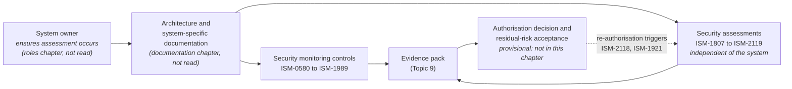
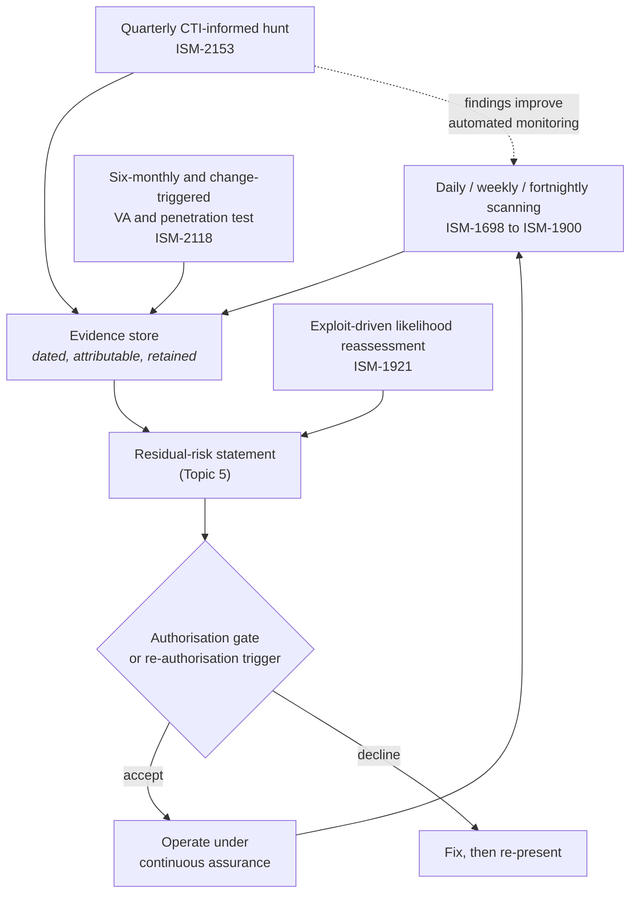
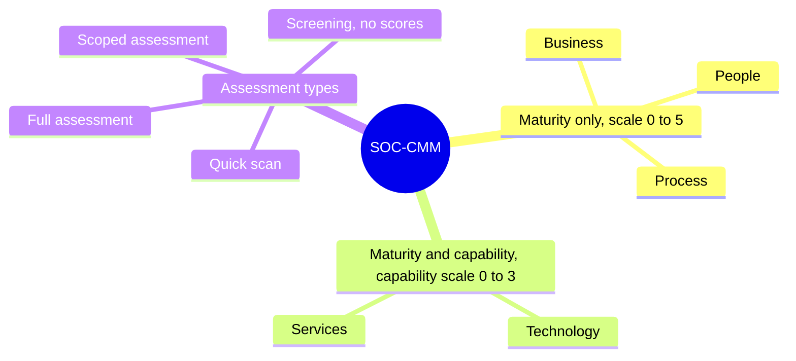
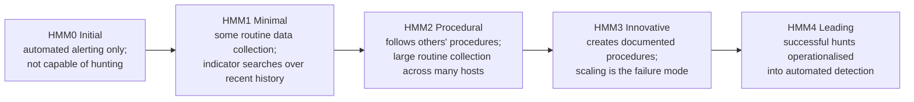

# SA-06: Assurance, Capability Maturity and System Authorisation

> **Module type:** Extension module (elective deep dive) — part of [EXT-SA](index.md)
> **Status:** Draft
> **Version:** v0.1
> **Last Reviewed:** 2026-09-12
> **Domain Expert:** _Unassigned — required before Practitioner Approved_
> **Practitioner Reviewer:** _Unassigned — required before Practitioner Approved_

!!! warning "Not a credit-bearing unit"
    SA-06 is the final module of the [EXT-SA series](index.md). It carries **0 CP**, sits outside the fixed 66-unit / 168 CP structure in [`docs/structure.md`](../../structure.md), and does not appear in [`docs/ksat-coverage.md`](../../ksat-coverage.md) or the [Program Builder](../../program-builder/index.md), both of which are generated from credit-bearing units only. Recognition, if a delivery partner wants it, uses the Tier 1 badge mechanism in [`docs/curriculum/micro-credentials-framework.md`](../../curriculum/micro-credentials-framework.md).

---

## Overview

An architecture that cannot be assured is a drawing. At some point a system owner has to put their name to a decision that the system may operate with the risk that remains, and an assessor has to be able to see, in evidence rather than assertion, that the controls the design claims are present and working. Most architects meet this moment late, when the assessment is already booked, and discover that the design produced no evidence of its own and that the operating capability behind it has never been measured. This module is about arriving at that moment prepared.

It works from the system-owner and architect side. First, it reads the ASD *Information security manual* (ISM) *Guidelines for security assurance* chapter (September 2026) as a requirements source: each security-monitoring and security-assessment control is restated as the design property it imposes and the evidence artefact an assessor will ask for. Second, it treats capability maturity models as architecture inputs. The SOC-CMM assessment tool whitepaper (2024), the SOC target operating model whitepaper (2022) and the 2025 paper on advancing SOC capability and maturity supply the method for writing a target capability that the architecture must support and for sequencing investment towards it; CTI-CMM v1.3 (2026) and the Hunting Maturity Model (2015) supply the vocabulary for the intelligence and hunting capabilities the monitoring architecture exists to serve; and the CREST Cyber Security Incident Response Maturity Assessment Tool (2025 workbook, structure only) supplies a worked example of evidence-per-question discipline in Topic 9. Third, it shows how to assemble the evidence pack, how continuous assurance differs from a point-in-time assessment, and how an authorisation decision relates to residual-risk acceptance.

Three things this module deliberately does not do. It does not teach audit method, control testing or IRAP as an assessment engagement; that is [GR05](../../../degrees/strategic/grc/GR05-audit-assurance.md). It does not assess the Essential Eight or build framework crosswalks; that is [GR03](../../../degrees/strategic/grc/GR03-compliance-frameworks.md). It does not teach governance maturity ([GR01](../../../degrees/strategic/grc/GR01-security-governance-design.md)), architecture-programme maturity ([SE02](../../../degrees/strategic/security-engineering/SE02-security-architecture.md) Topic 6) or SOC operations ([OC02](../../../core/units/OC02-security-monitoring-siem.md)). The degree's register of maturity models and its cross-walk to CSF, NICE roles and KSATs lives in [`docs/maturity-models.md`](../../maturity-models.md); this module links it and adds what that register does not cover: how the models score, what a score is worth as evidence, and how to derive a target from ambition rather than from the top of the scale.

One finding shapes the whole module and is stated up front. The ISM assurance chapter as read contains **no authorisation controls**. It covers security monitoring and security assessments, and delegates responsibility for ensuring an assessment happens to the system-owner section of the roles chapter, and the documentation an assessment needs to the documentation chapter. Neither was among the sources read. The authorisation and residual-risk material here is therefore written generically, marked provisional, and anchored to GR05 Lab 2, which already frames residual risks as the input to the authorising officer's decision.

---

## Where this module fits

| Unit / module | Relationship |
|---|---|
| [EXT-SA index](index.md) | Series positioning; SA-06 is the closing module. |
| [SA-05 — Logging, Monitoring and Detection Architecture](sa-05-logging-and-monitoring-architecture.md) | **Direct predecessor.** SA-05 places and selects log sources; SA-06 shows what an assessor expects that design to evidence. |
| [SA-04 — Network, Gateway and Access Architecture](sa-04-network-gateway-and-access-architecture.md) | Gateway and identity boundaries whose logs and CTI integrations appear in the evidence pack. |
| [SA-03 — Modern Defensible Architecture and CSF 2.0](sa-03-modern-defensible-architecture-and-csf.md) | SOC-CMM's CSF question mapping lets capability scores be re-expressed as CSF outcome evidence. |
| [SA-01](sa-01-business-driven-architecture-in-practice.md) · [SA-02](sa-02-integrating-security-into-enterprise-architecture.md) | Traceability discipline and the architecture description that heads the evidence pack. |
| [SC02 — Security Architecture](../../../core/units/SC02-security-architecture.md) | Hard prerequisite for the series. |
| [SE02 — Security Architecture (major)](../../../degrees/strategic/security-engineering/SE02-security-architecture.md) | Topic 5 evaluates an architecture against the ISM; Topic 6 covers architecture-programme maturity. SA-06 covers neither. |
| [GR05 — Audit and Assurance](../../../degrees/strategic/grc/GR05-audit-assurance.md) | The assessor's side: audit method, control testing, IRAP, ASAE 3402. Lab 2 there ends where this module begins. |
| [GR03 — Compliance Frameworks](../../../degrees/strategic/grc/GR03-compliance-frameworks.md) | Essential Eight assessment and crosswalk method; SA-06 uses the ISM's Essential Eight column only as a coverage-sizing signal. |
| [GR01 — Security Governance Design](../../../degrees/strategic/grc/GR01-security-governance-design.md) | Governance maturity, RACI and policy hierarchy; the SOCTOM backlog's RACI and policy items link here. |
| [OC02 — Security Monitoring and SIEM](../../../core/units/OC02-security-monitoring-siem.md) | SOC operating model and coverage measurement; its coverage outputs are evidence-pack inputs. |
| [SE04 — Detection and Response Engineering](../../../degrees/strategic/security-engineering/SE04-detection-response-engineering.md) | Platform engineering for the TIP/SIEM/SOAR integrations a CTI-CMM target implies. |
| [DE02](../../../degrees/operational/detection-engineering/DE02-data-sources-log-engineering.md) · [TH01](../../../degrees/operational/threat-hunting/TH01-hunting-methodology-process.md) · [CT01](../../../degrees/operational/cti/CT01-intelligence-tradecraft.md) | Coverage auditing, hunting method and intelligence tradecraft; SA-06 uses their models only as target-state vocabulary. |
| [SC01](../../../core/units/SC01-risk-management-frameworks.md) · [SC04](../../../core/units/SC04-vendor-supply-chain-risk.md) · [LD02](../../../degrees/strategic/leadership/LD02-security-strategy-roadmapping.md) | Risk register, provider shared responsibility, and the roadmap that consumes maturity targets. |
| [EXT-ANS](../ansible-security-automation.md) | Lab 9 there builds an Essential Eight evidence pack from automation output; a useful companion to Lab 3 here. |
| [`docs/maturity-models.md`](../../maturity-models.md) | The degree's maturity-model register and cross-walk. Linked, not repeated. |

---

## Prerequisites

- [SC02 — Security Architecture](../../../core/units/SC02-security-architecture.md) (required)
- [SA-05](sa-05-logging-and-monitoring-architecture.md) (strongly recommended; Lab 1 builds on its logging architecture)
- [OC02 — Security Monitoring and SIEM](../../../core/units/OC02-security-monitoring-siem.md) (assumed)
- [GR05 — Audit and Assurance](../../../degrees/strategic/grc/GR05-audit-assurance.md) Topics 3 and 5 (recommended, for the assessor's view of evidence)
- Familiarity with [`docs/maturity-models.md`](../../maturity-models.md)

---

## Learning outcomes

On completion, a learner can:

1. **Analyse** the ISM *Guidelines for security assurance* as a requirements source, deriving for each cited control the design property it imposes and the evidence an assessor will expect.
2. **Design** a continuous assurance schedule, using the scanning, hunting, reassessment and testing cadences the ISM fixes, so that authorisation evidence is a by-product of operation rather than a point-in-time exercise.
3. **Evaluate** capability maturity outputs from SOC-CMM, CTI-CMM and the Hunting Maturity Model for evidential quality, separating self-assessed claims from independently verified results and maturity statements from control compliance.
4. **Create** a target capability profile and a risk-sequenced investment backlog using the SOC target operating model method, including a cross-model coherence check.
5. **Construct** an assurance evidence pack (architecture description, control mapping, monitoring evidence, maturity statement, residual-risk statement) fit for an authorisation decision.
6. **Justify** a residual-risk statement and its re-authorisation triggers to a system owner, stating plainly what the pack evidences and what it only asserts.

> Bloom's 4–6 (Analyse / Evaluate / Create), consistent with the strategic-layer expectations in [`docs/content-standards.md`](../../content-standards.md).

---

## AQF Level 7 Alignment

The module develops specialised knowledge of the Australian assurance expectations that a security architecture must satisfy (AQF 7.1), the cognitive skill to translate a control catalogue and three capability maturity models into design properties, targets and evidence (AQF 7.2), and the judgement to present residual risk honestly to an accountable decision maker under the accountability expectations of system authorisation (AQF 7.3).

> This alignment statement is notional. SA-06 is not credit-bearing, so it has not been through the AQF mapping process in [`docs/compliance/aqf-teqsa.md`](../../compliance/aqf-teqsa.md) and is not assessed against it.

---

## Framework mappings

> **Provisional pending Framework Custodian review.** These do **not** feed [ksat-coverage](../../ksat-coverage.md).

### NIST NICE DCWF

| Version | Work Role | Code | T-Code | Task | Demonstrated in |
|---|---|---|---|---|---|
| 2023 | Security Architect | SP-ARC-002 | T0050 | Define and document how a system's implementation affects the security posture of the environment | Lab 1; Summative |
| 2023 | Security Control Assessor | SP-RSK-002 | T0177 | Perform security reviews and identify gaps in the security architecture for the risk mitigation strategy | Lab 1; Lab 3 |
| 2023 | Authorizing Official | SP-RSK-001 | T0221 | Review authorisation and assurance documents to confirm risk is within acceptable limits | Lab 3; Summative |
| 2023 | Enterprise Architect | SP-ARC-001 | T0473 | Document and address organisational security requirements through the life cycle | Lab 2 |
| 2023 | Information Systems Security Manager | OV-MGT-001 | T0089 | Ensure security improvement actions are evaluated, validated and implemented | Lab 2; Summative |

### SFIA 9

| Skill | Code | Level | Demonstrated in |
|---|---|---|---|
| Information assurance | INAS | Level 5 | Lab 1; Lab 3; Summative |
| Solution architecture | ARCH | Level 5 | Lab 2; Summative |
| Information security | SCTY | Level 5 | Lab 1; Topic 2–4 |
| Requirements definition and management | REQM | Level 4 | Lab 2 |
| Strategic planning | ITSP | Level 5 | Lab 2 (target state and horizon) |
| Business process improvement | BPRE | Level 5 | Lab 2 (improvement backlog) |
| Specialist advice | TECH | Level 5 | Summative |

> Codes and level ranges verified against sfia-online.org on 2026-09-12; the per-module level assignment is the author's reading and is provisional.

### ASD Cyber Skills Framework

| Domain | Sub-domain | Proficiency | Demonstrated in |
|---|---|---|---|
| Security Architecture | Assurance and Authorisation Design | Advanced | Lab 1; Lab 3; Summative |
| Governance, Risk and Compliance | Security Assessment and Risk Acceptance | Practitioner–Advanced | Lab 3; Formative 1 |
| Defensive Operations | Capability Planning and Maturity | Practitioner | Lab 2; Formative 2 |

### Project-local KSATs

| Type | ID | Statement | Demonstrated in |
|---|---|---|---|
| Knowledge | SA-06-K01 | Knowledge of the ISM security assurance chapter's structure, scope and cross-references to the roles and documentation chapters | Topic 1; Lab 1 |
| Knowledge | SA-06-K02 | Knowledge of the centralised-logging, event-detail, monitoring, hunting and retention control intents and the design properties they impose | Topic 2; Topic 3; Lab 1 |
| Knowledge | SA-06-K03 | Knowledge of ISM scanning, exploit-driven reassessment and assessment cadences as continuous-assurance feeds | Topic 4; Lab 3 |
| Knowledge | SA-06-K04 | Knowledge of SOC-CMM's maturity and capability scales, domains, assessment types and improvement cycle | Topic 6; Lab 2 |
| Knowledge | SA-06-K05 | Knowledge of the SOCTOM method, CTI-CMM domains and levels, and HMM levels as target-state vocabulary | Topic 7; Topic 8; Lab 2 |
| Knowledge | SA-06-K06 | Knowledge of evidence-pack composition and the distinction between maturity, compliance and residual risk | Topic 9; Lab 3 |
| Skill | SA-06-S01 | Skill in tracing a control to a design property and an evidence artefact | Lab 1 |
| Skill | SA-06-S02 | Skill in constructing a current-versus-target capability profile with a cross-model coherence check | Lab 2 |
| Skill | SA-06-S03 | Skill in assembling an assurance evidence pack and residual-risk statement | Lab 3; Summative |
| Ability | SA-06-A01 | Ability to judge the evidential weight of a self-assessed maturity score | Formative 1; Lab 2 |
| Ability | SA-06-A02 | Ability to sequence capability investment by risk rather than by lowest score | Lab 2; Summative |
| Ability | SA-06-A03 | Ability to defend a residual-risk statement and re-authorisation triggers to a system owner | Lab 3; Summative |

---

## Module structure

| Part | Topics | Labs | Notional hours |
|---|---|---|---|
| A — The assurance chapter as a requirements source | 1–3 | 1 | 6 |
| B — Continuous assurance and authorisation gates | 4–5 | — | 6 |
| C — Capability maturity as an architecture input | 6–8 | 2 | 7 |
| D — The evidence pack | 9 | 3 | 5 |
| | | | **24 hours** |

---

## Topics

### Topic 1: What the assurance chapter covers, and what it delegates

The ISM *Guidelines for security assurance* (September 2026) has two sections: security monitoring and security assessments. The first opens by limiting itself to security-relevant event logs and excluding performance logs, which is the architect's licence to scope the central logging facility to security sources rather than everything the estate emits. It then lists seventeen event-log source types with the kind of compromise each helps reveal; SA-05 covers source selection, so here that list is read as the assessor's checklist of what an organisation actually collects. The second section defines security assessments as activities that give assurance about the posture of systems and their environments, names four kinds (security control assessments, vulnerability scanning, vulnerability assessments, penetration tests), and states an independence expectation: whoever assesses, internal or external, should be independent of the system so that no conflict of interest exists or appears to. No control identifier is attached to that expectation, but it is the chapter's own statement of the principle behind assessor independence, and it means the architect must not score their own design.

What the chapter does not contain matters as much. It defines no authorising officer, no authorisation decision, no system security plan and no residual-risk acceptance. Instead it points, by section name, to the system-owner section of the *Guidelines for cyber security roles* for who must ensure a security control assessment happens, to the *Guidelines for procurement and outsourcing* for assessing managed and cloud providers, to the *Guidelines for gateways* (an SA-04 source) for gateway assessments, and to the system-specific documentation section of the *Guidelines for cyber security documentation* for what an assessment needs to see. The chain an Australian architect works within is therefore:

!!! warning "Verify against the live ISM"
    Every identifier, revision and update date in this module was transcribed from a chapter dated September 2026. The ISM is revised regularly and identifiers change between releases. Before relying on any row, confirm it at cyber.gov.au and record what you checked; the Verification status table lists every identifier cited.

### Topic 2: Control, design property, evidence: the collection tier

An ISM control line carries an identifier, a revision number, an update date, applicability markers (NC, OS, P, S, TS on every control in this chapter) and an Essential Eight column. An architect reads each control three times: once for its intent, once for the design property that intent imposes, and once for the artefact that would let an assessor confirm the property without taking the architect's word for it. The security monitoring policy control sits above the rest. Its context says the policy should cover which event types are logged, which facilities are used, how logs are monitored and how long they are kept, and should reflect shared responsibilities between providers and customers. It is the document that binds the monitoring architecture to declared obligations, and the first thing an assessor asks for.

| Control (revision, updated) | Intent, restated | Design property imposed | Evidence artefact |
|---|---|---|---|
| ISM-0580 (Rev 8, Jun-26) | A security monitoring policy exists, is implemented and kept current | Architecture bound to declared scope, facilities, monitoring method, retention and provider split | The policy, its review date, a provider responsibility matrix |
| ISM-1405 (Rev 4, Dec-24) | One central facility captures and manages logs from many sources | A central collection tier (SIEM, SOAR or both) with defined ingestion paths | Architecture diagram; source-to-facility inventory |
| ISM-1983 (Rev 1, Jun-26) | Logs reach the facility promptly after the event | Bounded forwarding latency; no batch-only paths for security sources | Measured latency per source class |
| ISM-1984 (Rev 1, Jun-26) | Log transport to the facility is protected with ASD-approved cryptography | Approved transport encryption on every forwarding hop, collectors included | Transport configuration export; cipher inventory |
| ISM-1985 (Rev 0, Dec-24) | Stored logs are shielded from unauthorised reading | Role-based access to the store; platform administration separated from analysis | Access matrix; access review record |
| ISM-1815 (Rev 1, Dec-23; E8 ML2, ML3) | Stored logs cannot be altered or removed without authority | Append-only or write-once storage; protected retention settings | Immutability configuration; integrity check output |
| ISM-0988 (Rev 7, Sep-24) | All logging shares an accurate, consistent clock | Time-source hierarchy reaching every source and the facility | Time hierarchy diagram; drift monitoring |
| ISM-0585 (Rev 7, Dec-25) | Each record carries enough context to be useful: when, who or what, which file, what happened, which equipment | Field-presence requirement per source class, enforced at onboarding | Field-presence report per source |
| ISM-1959 (Rev 0, Sep-24) | Logs are held in a consistent, structured form wherever practicable | Normalisation to a common schema at ingestion | Schema definition; parse-failure rate |

Two observations follow. The revision and update fields are what an assessor uses to check that a control mapping is current, so the evidence pack's mapping must record them, not just the identifier. And the artefact column is mostly operational output, which means the design has to produce it. A collection tier that cannot report its own forwarding latency or field presence has failed ISM-1983 and ISM-0585 in evidence even if it satisfies them in fact. OC02 Topic 1 teaches the pipeline and common information model; here the schema is simply the thing that makes ISM-1959 demonstrable.

### Topic 3: Monitoring capability, timeliness classes, hunting and retention

The chapter frames event-log monitoring as timely analysis by trained personnel with adequate tooling for manual and automated analysis. Three controls address capability rather than data: ISM-0120 (Rev 6, Jun-26) expects security personnel to have sufficient tools to detect events and identify incidents; ISM-2116 (Rev 0, Jun-26) expects cyber threat intelligence services to support that detection; ISM-2117 (Rev 0, Jun-26) expects suitable AI models to augment it. The last two are new and undefined in the chapter, so an assessor may now ask how CTI feeds and AI-assisted analytics are integrated, and the architect must define "suitable" and evidence it. Topic 8 uses CTI-CMM to give that integration a target.

Timeliness is then set per asset class. Each control's intent is that logs from the named class are analysed promptly to detect events; the Essential Eight column shows an escalating coverage expectation which an architect reads as a sizing input and a signal of which controls will also surface in an Essential Eight assessment. The assessment method itself belongs to GR03 Topic 4.

| Asset class | Control (revision, updated) | Essential Eight column | Architectural consequence |
|---|---|---|---|
| Critical servers | ISM-1986 (Rev 0, Dec-24) | N/A | A defined critical-server list must exist; coverage is independent of exposure |
| Internet-facing servers | ISM-1906 (Rev 0, Dec-23) | ML2, ML3 | First class to reach timely analysis; surfaces in Essential Eight assessment from ML2 |
| Non-internet-facing servers | ISM-1907 (Rev 0, Dec-23) | ML3 | Coverage expands inward at ML3 |
| Workstations | ISM-0109 (Rev 9, Dec-23) | ML3 | Largest volume class; the main sizing driver at ML3 |
| Security products | ISM-1987 (Rev 0, Dec-24) | N/A | Product telemetry is a source class in its own right |
| Internet-facing network devices | ISM-1960 (Rev 0, Sep-24) | N/A | Gateway and edge logs from SA-04 must reach the facility |
| Non-internet-facing network devices | ISM-1961 (Rev 0, Sep-24) | N/A | Internal switching and routing telemetry in scope |
| Detected events, to incidents | ISM-1228 (Rev 3, Mar-22) | ML2, ML3 | Triage capacity is assessed, not only collection |

Threat hunting is an assurance control in its own right. ISM-2153 (Rev 0, Sep-26) expects hunts informed by current strategic and sector-specific CTI at least every three months; the context positions hunting as the complement to automated monitoring for actors who have persistence but never tripped an alert, suggests scoping to indicators and tradecraft in current ASD alerts and advisories, and expects findings to be documented, actioned and fed back into automated monitoring. Architecturally that requires searchable history, query capability and a path from hunt output to detection content, and it generates recurring evidence four times a year. Retention closes the section with two overlapping regimes: ISM-1988 (Rev 0, Dec-24) expects logs to remain searchable for at least twelve months, and ISM-1989 (Rev 0, Dec-24) expects retention to also satisfy the class-based minima in the National Archives of Australia's AFDA Express Version 2. The architect must design storage tiering and disposal so that both are met and both can be evidenced; the records regime can be longer than the security minimum and varies by record class.

### Topic 4: Continuous assurance: the cadences the ISM already fixes

The security assessments section reads as a schedule. Its context explains the logic: discover assets automatically, scan from internal and external perspectives so exposure is reflected, and scan at roughly twice the frequency at which patches must be applied (the worked example is weekly scanning for a fortnightly patch window). The controls then fix minimum cadences per asset class, add an event-driven reassessment, and set the lifecycle gates for deeper testing. Read together, these are not a compliance burden bolted on to the architecture; they are the mechanism by which the architecture produces evidence continuously, provided the scanning, hunting and testing outputs are captured as artefacts.

| Activity | Minimum cadence in the chapter | Controls (revision, updated) | Evidence produced |
|---|---|---|---|
| Automated asset discovery feeding scanning | Fortnightly | ISM-1807 (Rev 0, Dec-22; E8 ML1–3) | Discovery run log; asset delta |
| Scanner vulnerability database kept current | No cadence fixed; database must be up to date | ISM-1808 (Rev 0, Dec-22; E8 ML1–3) | Scanner update log |
| Scan online services; OS of internet-facing servers and network devices | Daily | ISM-1698 (Rev 1, Sep-23); ISM-1701 (Rev 1, Sep-23); both E8 ML1–3 | Scan schedule; coverage report |
| Scan productivity suites, browsers and extensions, email clients, PDF applications, security products | Weekly | ISM-1699 (Rev 2, Jun-25; E8 ML1–3) | Scan schedule; coverage report |
| Scan other applications; OS of workstations, non-internet-facing servers and devices; other IT equipment OS; drivers; firmware | Fortnightly | ISM-1700 (Rev 3, Jun-25; ML2–3); ISM-1702 (Rev 2, Dec-23; ML1–3); ISM-1752 (Rev 4, Jun-24); ISM-1703 (Rev 2, Dec-23; ML3); ISM-1900 (Rev 0, Dec-23; ML3) | Scan schedule; coverage report |
| Reassess likelihood of compromise while a working exploit exists for an unmitigated vulnerability | Event-driven, frequent | ISM-1921 (Rev 0, Jun-24) | Dated risk reassessment record |
| CTI-informed threat hunt | At least quarterly | ISM-2153 (Rev 0, Sep-26) | Hunt report; detections improved |
| Vulnerability assessment and penetration test | Before deployment, before significant change, at least six-monthly | ISM-2118 (Rev 1, Sep-26); AI augmentation ISM-2119 (Rev 0, Jun-26) | Test report; remediation tracker |

Point-in-time assessment still has a place: the security control assessment and the pre-deployment test are moments when an independent party looks at the whole. The difference is that a system under continuous assurance arrives at those moments with a year of dated artefacts rather than a fortnight of preparation. SOC-CMM's improvement cycle (Topic 6) supplies the capability-level analogue: scoped re-validation of only the parts that changed, rather than a full re-assessment every time.

### Topic 5: Authorisation gates, re-authorisation and residual-risk acceptance

!!! warning "Provisional: the authorisation process is not in the source read"
    The ISM assurance chapter defines the assessment cadences but not the authorisation decision. Terms such as authorising officer, authorisation to operate, system security plan and plan of action are not in any source read for this module and are used here generically. Confirm the current terminology and process in the live ISM roles and documentation chapters before using this topic in delivery, and see GR05 Topic 5 for the Australian Government assurance context.

What the chapter does fix is the timing. ISM-2118 names three moments at which a system must be tested: before deployment, before a significant change is deployed, and at least every six months thereafter. Those are, in effect, the authorisation and re-authorisation gates: at each, residual risk is restated and accepted again. ISM-1921 adds an out-of-cycle trigger: while a working exploit exists for an unmitigated vulnerability, the likelihood of compromise is reassessed frequently, so an authorisation that assumed no known exploit must be revisited when that assumption fails. An architect can therefore write the re-authorisation triggers for a system directly from these two controls, and add two more from the capability side: a material change in the organisation's threat profile (CTI-CMM RISK and SITUATION domains, Topic 8) and a change to the target capability state the architecture was authorised against (SOCTOM, Topic 7).

A residual-risk statement fit for that decision has a definable shape. It names the threats considered, with the date and source of the threat picture; lists unmitigated findings from the most recent assessments with their compensating controls; states each accepted risk with an owner and an expiry; records the assumptions the acceptance depends on (no known exploit, provider controls operating, retention in place); and lists the triggers that reopen it. GR05 Lab 2 approaches the same document from the assessor's side; Lab 3 here writes it from the owner's side.

Independence is the design rule, for the chapter's reason (Topic 1) and for SOC-CMM's: its 2025 paper reports self-assessed maturity scores running markedly above third-party scores. So the person who drew the architecture neither scores the maturity of the capability behind it nor tests the controls within it, and the pack records who did.

### Topic 6: SOC-CMM: maturity, capability and what a score is worth

The 2024 SOC-CMM whitepaper positions maturity measurement as a management tool that reveals strengths and weaknesses, measures growth and demonstrates return on investment. Those properties also make a score usable as authorisation evidence, within limits. Of its five domains, Business, People and Process are scored for maturity only; Technology and Services for maturity and capability. The 2025 paper defines the difference: maturity is a property of internal processes (standardised, repeatable, demonstrable, continuously improved), capability a property of output (efficient, effective delivery with reliable outcomes), and capability not underpinned by maturity is neither reliable nor continuous, and so not trustworthy.

The maturity scale runs from 0 (non-existent) through initial, managed, defined and quantitatively managed to 5 (optimising); the capability scale from 0 (incomplete) through performed and managed to 3 (defined, meaning optimised and documented). The model is continuous rather than staged: scores are numeric and an aspect can sit between levels, so fractional interim targets are possible; element scores aggregate to aspect and domain scores. An advanced version adds weighting; the 2024 whitepaper warns it can compromise objectivity and advises the basic version when in doubt, so for scores headed to an assessor use the basic version or document every weight.

Three more points bear on evidential quality. Assessment type: a full assessment covers all aspects through document review and structured staff discussions, a quick scan repeats it at high level, a scoped assessment re-validates only what changed, and a screening produces no scores. Assessor: a workshop with several SOC roles present and someone outside the team guiding and challenging inputs. Outputs: a results table, a radar chart per aspect and domain charts of current against target, citable in an evidence pack only with scope, date, model version, assessor and weighting choice. Each question was evaluated for CSF relevance and mapped where relevant (CSF 1.1 and 2.0), so a result can be expressed as CSF outcome evidence alongside the SA-03 profile. The SOCTOM whitepaper (2022) concedes one limit: the model measures use cases, data-source visibility and ATT&CK coverage but does not itself do threat modelling; Topic 8 places that in CTI-CMM.

### Topic 7: Deriving the target state with the SOCTOM method

The SOC target operating model whitepaper (2022) builds on a paywalled 2020 research note, known here only as SOC-CMM summarises it, with three areas: align, invest and measure. It maps those to SOC-CMM aspects (a solid but incomplete fit) and sets out a method an architect can reuse. Its first principle matters most: a maturity level is not the ambition, it is derived from the ambition. The 2025 paper agrees the top level is not right for every SOC: targets should reflect risk, budget and resources, with critical-infrastructure and service-provider SOCs generally needing more.

The method has five steps: determine goals, success criteria and ambition, aligned with organisational goals and ideally in a senior-approved charter; set the horizon, which drives roadmap pace and resourcing (one target at staged horizons is allowed); establish the current state from a recent assessment or a peer-verified quick scan; define the target in concrete terms (maturity levels, specific capabilities, documentation, staffing) with detail proportional to how soon each element is due; obtain senior approval, normally with a business case. The paper's tool records current and target state per element, reuses SOC-CMM scores, and lets rows be marked not applicable with an explanation, recommended over deletion because the result is more auditable.

Operationalising the target is where architecture meets delivery: a gap analysis per element, a backlog of epics, features and tasks with a named owner who tracks progress and escalates blockers, embedded in the continuous-improvement process, and periodic re-measurement that checks the target is still right. Typical backlog items include a service architecture, a technology architecture, an extended RACI, a sourcing strategy, process descriptions and policies; several are architecture outputs, and RACI and policy belong to GR01. Sequencing follows risk, not score: the 2024 whitepaper says a lower-scoring domain may be deprioritised when a higher-scoring one carries more direct risk, while warning that insufficient maturity anywhere eventually becomes a risk (its example: a missing sourcing process, invisible until analysts become scarce). The 2025 paper adds the delivery discipline: small increments, explicit capacity for change, reuse of existing practice, senior commitment, and a third party for objectivity.

### Topic 8: CTI-CMM and the Hunting Maturity Model as architecture requirements

CTI-CMM v1.3 (2026) measures a CTI programme by the value it delivers to each stakeholder domain rather than as a property of the CTI team. Its eleven domains (ASSET, THREAT, RISK, ACCESS, SITUATION, RESPONSE, THIRD-PARTIES, FRAUD, WORKFORCE, ARCHITECTURE, PROGRAM) decompose into use cases and practices graded CTI0 (nothing performed), CTI1 (basic, mostly undocumented, reactive), CTI2 (mostly documented, standardised, automated at scale, proactive) and CTI3 (prescriptive, business-aligned, continuously improved, metrics reported). Practices are cited as DOMAIN-Objective.Practice, the form for a traceability table. The model calls itself descriptive, not prescriptive; never present its levels to an assessor as control compliance.

Separate practices with an architectural dependency (data access, integration, automation, retention) from organisational ones. THREAT use case 1 is the clearest example: indicators emailed ad hoc; then feed ingestion straight into the SIEM or firewall with a pruning strategy; then at-scale automated delivery with measured false positives and indicators wired into playbooks. ARCHITECTURE is a two-way contract: at CTI2 the architecture function can expect established channels (ARCHITECTURE-1.b), regular reports on cross-cutting threats (ARCHITECTURE-2.b) and advance notice of changes to CTI infrastructure and their likely effect (ARCHITECTURE-3.c); at CTI3, contextualised trend reporting on a regular cadence (ARCHITECTURE-2.d). Routine threat modelling, the gap SOCTOM concedes (Topic 6), is THREAT-2.d (CTI3) and the frame of ARCHITECTURE use case 2. SITUATION-1.d (CTI2) expects a systematic process producing routine threat-landscape reports, the cadence behind a residual-risk statement's threat picture. RISK at CTI3 puts a Cyber Threat Profile into risk dashboards, making that statement threat-informed, not generic.

The Hunting Maturity Model (2015) supplies the hunting half; its author defines hunting as "the collective name for any manual or machine-assisted techniques used to detect security incidents", and rates hunting ability on data quality, tools and analyst skill, describing data collected rather than tools.

The post recommends HMM2 as the first target and says no platform buys HMM4. A target profile then imposes concrete requirements:

| Target | What the architecture must supply | Hand-off |
|---|---|---|
| HMM2 | Routine collection of many data types across many hosts; searchable history (ISM-1988 helps); analyst query tooling | SA-05; TH01 for method |
| HMM4 | A path from hunt output to production detection; automation hooks | OC02 Topic 6; DE units |
| CTI2 in THREAT | Feed delivery straight into SIEM or firewall with pruning; routine threat profiling for detection gap analysis | SE04 |
| CTI3 in THREAT and ACCESS | Playbook-integrated low-regret blocking (THREAT-1.j); mechanisms to contain a user's access on intelligence of suspected compromise (ACCESS-1.i); TTP-informed detection of anomalous account and access activity (ACCESS-1.f) | SE04; SA-04 |
| CTI3 in RISK | Threat profile integrated into risk reporting | SC01 |
| SOC-CMM Technology and Services capability 2–3 | Consistently delivered, documented technology and service aspects | SA-05; SE04 |

Before committing a target, check coherence: HMM4 hunting cannot sit on CTI1 intelligence or HMM1 data collection, and CTI2 automation at scale cannot sit on SOC-CMM Technology capability 1 (Lab 2 and Formative 2).

### Topic 9: Assembling the evidence pack

None of the sources read defines an assurance evidence pack or a residual-risk statement as a named artefact; the ISM defers to its documentation chapter, and the SOCTOM paper's backlog list is the closest inventory. What follows is this module's synthesis, to be reconciled with the live ISM documentation chapter before use. The organising idea is that each section answers one question an independent assessor will ask.

| Section | Contents | Built from | Assessor's question |
|---|---|---|---|
| Architecture description | Boundaries, tiers, data flows, trust zones, provider responsibilities | SA-01 to SA-05 | What am I assessing? |
| Control mapping | Each in-scope control: identifier, revision, update date, restated intent, design property, evidence pointer, claim status | Lab 1 | Which controls does the design claim, and where is the proof? |
| Monitoring evidence | Forwarding latency, field presence, immutability and access records, retention configuration, hunt reports, scan coverage | Topics 2–4 | Is it operating, not just designed? |
| Assessment results | Independent test reports, scan results, control-assessment findings and their remediation state | Topic 4; GR05 | What did an independent party find? |
| Capability maturity statement | Model and version, scope, assessor and independence, date, weighting choice, current against target, scoped re-validation results | Topics 6–8; Lab 2 | Can the operating capability sustain the controls? |
| Residual-risk statement | Named threats with date and source, unmitigated findings, accepted risks with owner and expiry, assumptions, re-authorisation triggers | Topic 5; Lab 3 | What am I being asked to accept? |
| Decision log | Priority decisions written down with outcomes | CTI-CMM implementation step 3 | Why is it this way? |
| Limitations | What the pack does not evidence | This topic | What must I not infer? |

Two sources supply structure worth borrowing. CTI-CMM's implementation process observes that most priority decisions in CTI programmes are made implicitly, producing an assumption-driven environment that cannot be measured year on year, and recommends documenting decisions and outcomes in writing; that written record is directly reusable as the decision log. The CREST Cyber Security Incident Response Maturity Assessment Tool (2025 workbook, structure only) organises its questions across three phases and fifteen steps, sets target maturity by a criticality profile, and carries an "evidence supplied" column against every question, which is a reminder that a maturity score without its evidence column is a questionnaire.

The pack's metrics should measure capability, not effort. CTI-CMM's Appendix C, which its authors call representational rather than definitive, offers per-domain examples such as the share of mandated framework controls with documented CTI processes and artefacts, the reduction in time to detect at-risk assets, and the count of risk decisions prioritised on the threat profile; it warns that most organisations produce throughput metrics that show activity rather than growth. Finally, the limitations section is the one an assessor reads first. A maturity score is a claim about process, a control mapping is a claim about design, and only the monitoring evidence and independent assessment results are claims about operation; the pack should say which is which.

---

## Labs & exercises

All three labs are paper-based and need no paid tooling. The SOC-CMM and SOCTOM spreadsheets are free downloads that open in LibreOffice Calc; the ISM chapter and CTI-CMM are free PDFs. Self-check with the series quiz.

!!! warning "Authorisation boundary"
    Work only from the scenario supplied, from your own earlier lab outputs, or from material you own. Do not use a real organisation's security monitoring policy, assessment reports, authorisation documents or maturity results, even anonymised. Those are exactly the documents whose disclosure an authorisation process exists to control.

### Lab 1: Control-to-evidence traceability for a monitoring architecture

**Objective:** Turn the ISM security monitoring section into a traceability table that names, for each control, the design property the architecture meets it with and the artefact that proves it.

**Prerequisites:** Topics 1–3; the logging architecture from SA-05 (or the scenario below).

**Environment:** No tooling required. The current ISM *Guidelines for security assurance* from cyber.gov.au (free).

**Instructions:**

1. Download the current chapter. Compare every identifier, revision and update date against Topic 2, Topic 3 and Topic 4 of this module and record any difference. This is the first maintenance step of any control mapping and is assessed.
2. Use your SA-05 architecture, or this scenario: a state-government service provider with a central SIEM, collectors in two data centres and one cloud tenancy, 90 days of hot and nine months of cold retention, workstation logs not yet collected, and a managed service provider monitoring after hours.
3. For each of the 23 security-monitoring controls, complete a row: identifier; revision and update date; intent in your own words; the design property that meets it; the evidence artefact; the owner of that artefact; and a claim status of claimed, evidenced, gap or not applicable, where evidenced means the named artefact exists and is dated, not that the control was tested. Give a one-line justification for every not-applicable row. The status here is the owner's claim; testing it is GR05's method.
4. Classify each gap as an architecture gap, an evidence gap (the artefact is not produced) or a documentation gap.
5. Write the shared-responsibility split for the managed provider against ISM-0580's context and note which artefacts you would need from the provider.
6. Produce a half-page "first five things an assessor will ask for" list, ordered by how long each would take to obtain today.

**Expected output:** A 23-row traceability table with no unjustified not-applicable rows, a gap classification, a provider responsibility split, the assessor's first-five list, and a record of any identifier drift found in step 1.

**Reflection questions:**

1. Which controls did your architecture satisfy in fact but not in evidence? What would the design have to emit to close that gap?
2. The scenario's nine months of cold retention meets neither ISM-1988 nor, potentially, ISM-1989. Which do you fix first, and what evidence would show both are met?
3. Which of your artefacts could an assessor obtain without asking you? Is that a strength?

### Lab 2: Target capability profile and risk-sequenced backlog

**Objective:** Derive a target capability state from a stated ambition using the SOCTOM method, express it across SOC-CMM, CTI-CMM and HMM, check it for coherence, and sequence the investment by risk.

**Prerequisites:** Topics 6–8; Lab 1.

**Environment:** SOC-CMM basic assessment tool and SOCTOM tool (free from soc-cmm.com; open in LibreOffice Calc), CTI-CMM v1.3 PDF (free from cti-cmm.org). Paper alternative acceptable.

**Instructions:**

1. Scenario: a mid-sized Australian utility's security operations function, in-house by day with an outsourced overnight service, an eighteen-month horizon and a senior-approved ambition of "detect and contain a persistent intrusion in the operational network before it affects service". Supplied current state, all self-assessed by the SOC lead: SOC-CMM quick-scan maturity Business 2.1, People 2.4, Process 1.8, Technology 2.6 (capability 1), Services 2.2 (capability 1); CTI-CMM THREAT CTI1, RISK CTI0, SITUATION CTI1, ARCHITECTURE CTI1; HMM1.
2. Write the ambition, success criteria and horizon as the SOCTOM method requires. Derive, do not choose, the maturity implied.
3. Record the supplied current state, label every score as self-assessed and note who produced it; state what an assessor may and may not infer from it.
4. Define the target state: maturity for all five domains, capability for Technology and Services, CTI-CMM target levels for the four domains, an HMM target. Mark rows not applicable with an explanation rather than deleting them.
5. Run the coherence check from Topic 8 and adjust any target that depends on a lower one that is not being raised in time.
6. Perform the gap analysis and convert it to a backlog of epics with a named owner. Rank the epics by risk to the ambition, not by lowest score, and justify any case where a higher-scoring domain is prioritised.
7. Separate the epics with an architectural dependency (data, integration, automation, retention) from the organisational ones, and write a one-line hand-off for each of the former to SA-04, SA-05 or SE04.
8. Write the independence plan for the first full assessment: who assesses, who facilitates, which roles attend, and whether weighting is used.

**Expected output:** A current-against-target profile across three models with every score attributed, a coherence-check record, a risk-ranked backlog with owners, the architecture-dependency hand-offs, and the independence plan.

**Reflection questions:**

1. The supplied quick-scan scores are self-assessed. Which single artefact would move the Technology capability score from a claim to evidence?
2. Where did deriving maturity from ambition give a lower target than instinct suggested?
3. Which single backlog epic, if not delivered, invalidates the most other epics?

### Lab 3: Evidence pack and residual-risk statement for an authorisation gate

**Objective:** Assemble the evidence pack for a pre-deployment gate, write the residual-risk statement and its re-authorisation triggers, and design the continuous-assurance schedule that keeps the pack current.

**Prerequisites:** Topics 4–5 and 9; Labs 1 and 2.

**Environment:** No tooling required; consumes Lab 1 and Lab 2 outputs.

**Instructions:**

1. Define the gate as the pre-deployment moment in ISM-2118 for the Lab 1 system, and state who the accountable decision maker is in generic terms (marking the terminology provisional as Topic 5 does).
2. Assemble the eight pack sections from Topic 9, using the Lab 1 table as the control mapping and the Lab 2 profile as the capability maturity statement, with model version, scope, assessor, date and weighting recorded.
3. Build the continuous-assurance schedule from the Topic 4 table for this system, naming the artefact each cadence deposits and where it is stored.
4. Write the residual-risk statement: named threats with the date and source of the threat picture; unmitigated findings with compensating controls; accepted risks with owner and expiry; assumptions; and re-authorisation triggers drawn from ISM-2118, ISM-1921, a threat-profile change and a target-state change.
5. Write the limitations section, separating claims about design, process and operation.
6. Prepare a ten-minute walkthrough for the decision maker, then have a peer play the role and ask "what are you asking me to accept, and what would make you come back early?"

**Expected output:** A complete pack with all eight sections, a continuous-assurance schedule, a residual-risk statement with triggers, a limitations section, and notes from the walkthrough including any question the pack could not answer.

**Reflection questions:**

1. Which section of your pack is a claim rather than evidence, and did your limitations section say so?
2. A working exploit is published for an unmitigated finding two weeks after authorisation. Walk through what your triggers cause to happen and who acts.
3. What did the walkthrough reveal that the written pack did not?

---

## Assessment

### Formative 1: Evidence or claim?

Twelve statements drawn from a fictional evidence pack, such as "the SOC self-assessed at SOC-CMM maturity 3.2", "logs are immutable", "CTI-CMM THREAT is at CTI2", "the penetration test found no critical issues" and "all controls in the mapping are met". For each, classify it as independently verified evidence, self-assessed claim, design claim or control compliance, name the artefact that would move it up a class, and note whether it belongs in the residual-risk statement. Self-marked against a key that argues the borderline cases. Assesses LO3 and LO6.

### Formative 2: The incoherent target profile

A target profile proposes HMM4 hunting, CTI1 in THREAT, SOC-CMM Technology capability 1, three months of searchable retention and a twelve-month horizon. Identify every dependency the profile violates, propose a coherent profile for the same ambition and horizon, and state which changes are architectural. Assesses LO2 and LO4.

### Summative: Assurance and authorisation package

For a described Australian organisation (a regulated entity with a mixed on-premises and cloud estate, an outsourced monitoring component, a stated ambition and an eighteen-month horizon), produce:

1. A control-to-evidence traceability table for the ISM security monitoring and security assessments sections, with identifier drift recorded against the live ISM.
2. A continuous-assurance schedule with the artefact each cadence produces.
3. A target capability profile across SOC-CMM, CTI-CMM and HMM with a coherence check and a risk-ranked backlog, with architectural dependencies handed off.
4. The evidence pack with all eight sections.
5. A residual-risk statement with re-authorisation triggers and a limitations section.
6. A two-page briefing for the accountable decision maker that states what is being accepted, what is evidenced and what is asserted.

Item 5 carries disproportionate weight. A package that presents self-assessed maturity as verified capability, or a maturity level as control compliance, does not reach Proficient. Assesses LO1, LO2, LO3, LO4, LO5 and LO6.

| Criterion | Exemplary | Proficient | Developing | Beginning |
|---|---|---|---|---|
| **Control traceability** | Every control restated in own words with design property, artefact, owner and claim status; drift against the live ISM recorded; no unjustified not-applicable rows | Complete mapping with minor gaps in artefacts or ownership | Mapping present but intents copied or artefacts vague | Identifiers listed without design properties or evidence |
| **Continuous assurance design** | All chapter cadences scheduled with named artefacts and storage; hunt-to-detection feedback shown | Cadences scheduled; artefacts mostly named | Cadences listed without artefacts | Point-in-time assessment only |
| **Target derivation and sequencing** | Maturity derived from ambition; coherence check passed; backlog risk-ranked with justified exceptions; hand-offs precise | Sound target and backlog; sequencing mostly risk-based | Target chosen rather than derived; sequencing by lowest score | Top-of-scale target with no gap analysis |
| **Evidential judgement** | Every statement in the pack classed as evidence, claim or compliance; assessor independence recorded; weighting documented | Classes mostly correct; provenance recorded | Self-assessed scores presented without caveat | Maturity presented as compliance |
| **Residual risk and triggers** | Threat-informed, dated, owned, expiring; triggers drawn from ISM-2118, ISM-1921 and capability change; limitations candid | Complete statement with adequate triggers | Generic risk rating; triggers incomplete | Absent or asserts no residual risk |
| **Communication** | Briefing usable by a non-technical decision maker; asks a clear question | Clear with minor lapses | Technical or disorganised | Unclear or inaccurate |

| Assessment task | Learning outcomes addressed |
|---|---|
| Formative 1: Evidence or claim? | LO3, LO6 |
| Formative 2: The incoherent target profile | LO2, LO4 |
| Summative item 1: traceability table | LO1 |
| Summative item 2: continuous-assurance schedule | LO2 |
| Summative item 3: target profile and backlog | LO3, LO4 |
| Summative items 4–5: evidence pack, residual risk, limitations | LO5, LO6 |
| Summative item 6: decision-maker briefing | LO6 |

---

## Australian context

The whole of Part A and Part B is Australian by construction: the *Guidelines for security assurance* chapter is issued by the Australian Signals Directorate as part of the ISM, and every control in it carries applicability markers (NC, OS, P, S, TS) and an Essential Eight column. The same monitoring and scanning controls therefore apply across the classification range, with some gated at Essential Eight Maturity Level 2 or 3. The meaning of the NC marker is not defined in the chapter and is flagged below. The chapter is Commonwealth copyright released under CC BY 4.0, which is why this module can restate control intent with attribution; it still never reproduces control text.

Two controls tie the architecture to other Australian instruments. ISM-1989 binds event-log retention to the class-based minima in the National Archives of Australia's AFDA Express Version 2, a records-management overlay that has no equivalent in the international logging guidance SA-05 draws on, and one that can require longer retention than the twelve-month security minimum in ISM-1988. ISM-1984 requires ASD-approved cryptography for log transport, which points to the ISM *Guidelines for cryptography*, not among the sources read. The Archives Act 1983 is not named in the chapter and is not relied on here.

Threat intelligence in the chapter is national and sector-specific. ISM-2153 expects hunts to be informed by current strategic and sector-specific intelligence and suggests scoping them to indicators and tradecraft in current ASD alerts and advisories; the chapter also notes ASD's Cyber Threat Intelligence Sharing service for ASD Cyber Security Network Partners. For an Australian architect this means the CTI-CMM target for the THREAT and SITUATION domains has a concrete national feed to integrate, and CTI-CMM itself observes that stakeholder scope expands for government bodies because of collaboration with other government entities and national security policy. The chapter's further-information list names the ASD practitioner publications an Australian assessor will treat as the expected baseline (event logging best practice, priority logs for SIEM ingestion, Windows event logging and forwarding, SIEM and SOAR implementation guidance, ASD's guidance on AI models in security monitoring, Active Directory compromise detection); several are SA-05 sources and are linked rather than repeated here.

The assurance chain is Australian too. The chapter locates responsibility for ensuring a security control assessment with system owners, and the documentation an assessment needs in the documentation chapter; the independence expectation it states is the principle behind IRAP assessor independence, though IRAP itself is not mentioned in the chapter and is taught in GR05 Topic 5. SOC-CMM's observation that critical-infrastructure SOCs generally need higher maturity is the module author's bridge to the *Security of Critical Infrastructure Act 2018* (Cth) obligations that OC02 and SPL-07 already name; SOC-CMM does not mention that Act and the connection is an inference, not a sourced claim. The PSPF and the relation between it and ISM authorisation were not in any source read and are left to GR04 and GR05.

---

## Verification status

| Item | Status | Action required |
|---|---|---|
| Chapter title *Guidelines for security assurance* and its two-section structure (security monitoring; security assessments) | **Provisional** | Confirm the chapter title and structure have not changed in the live ISM |
| Security monitoring identifiers: ISM-0580 (Rev 8, Jun-26); ISM-1405 (Rev 4, Dec-24); ISM-1983 (Rev 1, Jun-26); ISM-1984 (Rev 1, Jun-26); ISM-1985 (Rev 0, Dec-24); ISM-1815 (Rev 1, Dec-23); ISM-0988 (Rev 7, Sep-24); ISM-0585 (Rev 7, Dec-25); ISM-1959 (Rev 0, Sep-24); ISM-0120 (Rev 6, Jun-26); ISM-2116 (Rev 0, Jun-26); ISM-2117 (Rev 0, Jun-26) | **Transcribed from the September 2026 chapter; re-verify** | Check identifier, revision and update date at cyber.gov.au before delivery |
| Timeliness, hunting and retention identifiers: ISM-1986 (Rev 0, Dec-24); ISM-1906 (Rev 0, Dec-23); ISM-1907 (Rev 0, Dec-23); ISM-0109 (Rev 9, Dec-23); ISM-1987 (Rev 0, Dec-24); ISM-1960 (Rev 0, Sep-24); ISM-1961 (Rev 0, Sep-24); ISM-1228 (Rev 3, Mar-22); ISM-2153 (Rev 0, Sep-26); ISM-1988 (Rev 0, Dec-24); ISM-1989 (Rev 0, Dec-24) | **Transcribed; re-verify** | As above; ISM-2153 is Revision 0 dated Sep-26 and most likely to change |
| Security assessments identifiers: ISM-1807 (Rev 0, Dec-22); ISM-1808 (Rev 0, Dec-22); ISM-1698 (Rev 1, Sep-23); ISM-1699 (Rev 2, Jun-25); ISM-1700 (Rev 3, Jun-25); ISM-1701 (Rev 1, Sep-23); ISM-1702 (Rev 2, Dec-23); ISM-1752 (Rev 4, Jun-24); ISM-1703 (Rev 2, Dec-23); ISM-1900 (Rev 0, Dec-23); ISM-1921 (Rev 0, Jun-24); ISM-2118 (Rev 1, Sep-26); ISM-2119 (Rev 0, Jun-26) | **Transcribed; re-verify** | As above; ISM-2118 (Rev 1, Sep-26) and ISM-2116/2117/2119 are recent |
| Essential Eight maturity-level column per control (ISM-1815, 1906, 1228 at ML2–3; 1907, 0109, 1703, 1900 at ML3; 1807, 1808, 1698, 1699, 1701, 1702 at ML1–3; 1700 at ML2–3) | **Provisional** | Verify against the live ISM and the current Essential Eight Maturity Model; assessment method is GR03's |
| Meaning of applicability markers NC, OS, P, S, TS | **Unverified** | Not defined in the chapter; confirm in the ISM front matter before use |
| National Archives of Australia AFDA Express Version 2 title and currency | **Provisional** | Confirm at naa.gov.au; the Archives Act 1983 is not named in the chapter |
| ASD-approved cryptography for ISM-1984 | **Not read** | The ISM *Guidelines for cryptography* was not a source; link SA-04/SA-05 or the live ISM |
| Authorisation-process terminology (authorising officer, authorisation to operate, system security plan, plan of action) and any controls in the roles or documentation chapters | **Provisional / generic** | Not in any source read; confirm current terms and controls in the live ISM before delivery |
| IRAP statements | **Via GR05 only** | IRAP is not mentioned in the assurance chapter |
| Evidence-pack structure (Topic 9) | **Module synthesis** | Reconcile with the ISM documentation chapter's system-specific documentation section |
| SOC-CMM model version and aspect count (2024 whitepaper: v2.3, 26 aspects; 2025 paper: v2.4, 27 aspects) | **Provisional** | Confirm current version at soc-cmm.com; module names domains only |
| SOC-CMM capability-level definitions | **Provisional** | 2025 paper's capability table is mislabelled; 2024 whitepaper definitions used |
| Gartner 2020 research note on SOC target operating models | **Second-hand** | Paywalled; cited only as summarised by the SOCTOM whitepaper |
| "SOC maturity report 2025" and SOC-CMM certification roles | **Unverified** | Cited in the 2025 paper and infographic only; do not deep-link |
| Publication years: SOC-CMM whitepaper 2024, SOCTOM 2022, Advancing SOC capability 2025 | **From document footers** | Confirm on soc-cmm.com |
| CTI-CMM v1.3 (January 2026); v2.0 targeted Q3 2026 | **Verified from the PDF** | Re-check cti-cmm.org; practice lettering may shift in v2.0 |
| CTI-CMM level names CTI0–CTI3 and eleven domain names | **Verified from the PDF** | None; ARCHITECTURE use-case titles differ between contents and section headings in the source |
| TaHiTI and ENISA threat-landscape methodology | **Not read** | Referenced via CTI-CMM footnotes only; not cited in Further reading |
| Hunting Maturity Model post (11 October 2015, updated 15 October 2015) and its URL | **Verified from the printout** | Confirm the URL still resolves; `docs/maturity-models.md` writes HM0–HM4 where the source uses HMM0–HMM4 (maintainer note, not edited here) |
| CREST IR Maturity Assessment Tool (2025 workbook) | **Structure read only** | Sheet layout, phases, steps and evidence column read from the workbook; year taken from the filename; confirm at crest-approved.org |
| Security of Critical Infrastructure Act 2018 link to SOC-CMM maturity guidance | **Author inference** | Not a sourced claim; SOC-CMM does not mention the Act |
| NICE DCWF work roles and T-codes (T0050, T0177, T0221, T0473, T0089) | **Provisional** | Pending Framework Custodian verification |
| SFIA 9 codes and ranges (INAS 2–7, ARCH 4–6, SCTY 2–7, REQM 2–6, ITSP 4–7, BPRE 2–7, TECH 4–6) | **Verified against sfia-online.org 2026-09-12** | Per-module level assignment provisional |
| ASD Cyber Skills Framework domain and sub-domain names | **Unverified — sub-domain names are placeholders** | Replace with the framework's own sub-domain names on Framework Custodian review |
| Project-local KSAT IDs SA-06-K01 to A03 | **Provisional** | Phase 4 item |

This module has **not** had practitioner review (R2) and should not be presented to learners as verified content until a Domain Expert and Practitioner Reviewer have signed off.

---

## Further reading

**Australian Signals Directorate (2026).** *Information security manual: Guidelines for security assurance.* https://www.cyber.gov.au/resources-business-and-government/essential-cyber-security/ism
> Relevance: The primary source for Parts A and B; every control cited in Topics 2–5 is restated from this chapter. Commonwealth copyright under CC BY 4.0 (**Australian source**).

**Australian Signals Directorate (2024).** *Best practices for event logging and threat detection.* https://www.cyber.gov.au
> Relevance: Named in the chapter's further-information list as the practitioner baseline an assessor expects behind the monitoring controls; an SA-05 source, linked here for the assurance framing only (**Australian source**).

**National Archives of Australia (n.d.).** *AFDA Express Version 2.* https://www.naa.gov.au
> Relevance: The records-management retention minima that ISM-1989 binds event-log retention to; the second of the two retention regimes in Topic 3. Landing page only; title and currency flagged for verification (**Australian source**).

**SOC-CMM (2024).** *SOC-CMM Assessment Tool: Measuring Capability Maturity in Security Operations Centers.* https://www.soc-cmm.com
> Relevance: The maturity and capability scales, assessment types, weighting caution, risk-based improvement rule and CSF mapping in Topic 6. Restated, not reproduced.

**SOC-CMM (2022).** *Defining and operationalising a SOC Target Operating Model using the SOC-CMM.* https://www.soc-cmm.com
> Relevance: The five-step target-state method, the not-applicable-with-explanation rule and the backlog artefact list in Topic 7 and Lab 2. Licensed CC BY-SA 4.0; restated only.

**SOC-CMM (2025).** *Advancing SOC capability and maturity.* https://www.soc-cmm.com
> Relevance: The maturity-versus-capability definitions, the continuous model, the improvement cycle and the self-assessment objectivity finding in Topics 5–7. CC BY-SA 4.0.

**CTI-CMM (2026).** *Cyber Threat Intelligence Capability Maturity Model, v1.3.* https://cti-cmm.org
> Relevance: The eleven domains, CTI0–CTI3 levels, practice identifier scheme, ARCHITECTURE domain and the written-decision practice used in Topics 8–9. All rights reserved; paraphrased and cited by identifier only.

**Bianco, D. (2015).** *A Simple Hunting Maturity Model.* Enterprise Detection & Response blog. https://detect-respond.blogspot.com/2015/10/a-simple-hunting-maturity-model.html
> Relevance: HMM0–HMM4, the three factors of hunting ability and the data-collection requirements that a hunting target imposes on the logging architecture (Topic 8). Confirm the URL resolves.

**CREST (2025).** *Cyber Security Incident Response Maturity Assessment Tool.* https://www.crest-approved.org
> Relevance: A worked example of an assessment tool whose structure (phases, steps, criticality-based targets and an evidence column per question) illustrates the evidence discipline in Topic 9. Structure only; landing page.

---

## Module metadata

| Field | Value |
|---|---|
| Module Code | SA-06 |
| Module Title | Assurance, Capability Maturity and System Authorisation |
| Module Type | Extension module (elective; **not** credit-bearing) |
| Version | v0.1 |
| Status | Draft |
| Credit Points | 0 CP — outside the 168 CP degree structure |
| Notional Hours | 24 |
| Extends | SC02 (Security Architecture); SE02 (Security Architecture, major); GR05 (Audit and Assurance) |
| Related Units | SA-01 to SA-05; OC02; SE04; GR01; GR03; DE02; TH01; CT01; SC01; SC04; LD02; EXT-ANS |
| Prerequisites | SC02 (required); SA-05 strongly recommended; OC02 assumed; GR05 Topics 3 and 5 recommended |
| Domain Expert | _Unassigned — required before Practitioner Approved_ |
| Practitioner Reviewer | _Unassigned — required before Practitioner Approved_ |
| Last Reviewed | 2026-09-12 |
| Framework Version — NICE DCWF | 2023 |
| Framework Version — SFIA | SFIA 9 (2023) |
| Framework Version — ASD CSF | 2024 |
| Bloom's Level (range) | 4–6 (Analyse, Evaluate, Create) |
| Australian Legislation Referenced | Security of Critical Infrastructure Act 2018 (Cth) (author inference, see Verification status); Archives Act 1983 (Cth) not relied on |
| Tooling Licence Position | All labs paper-based or on free downloads (SOC-CMM and SOCTOM spreadsheets, CTI-CMM PDF, ISM chapter); no commercial licence required (R3) |
| Licence | CC BY 4.0 |
