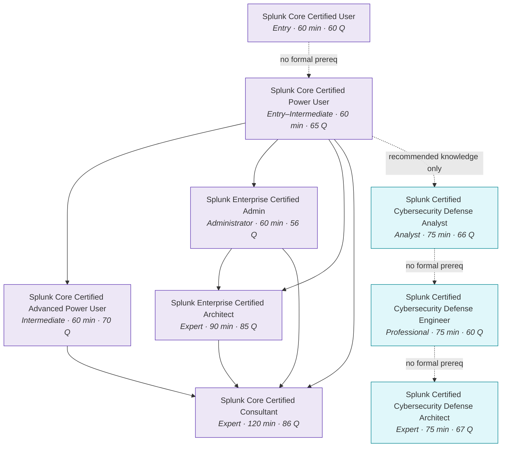

# EXT-SPL: The Splunk Series — Certification Pathway & Module Map

> **Module type:** Extension module series (vendor-specific elective)
> **Status:** Draft
> **Version:** v0.1
> **Last Reviewed:** 2026-09-09
> **Domain Expert:** _Unassigned — required before Practitioner Approved (Splunk platform / SecOps)_
> **Practitioner Reviewer:** _Unassigned — required before Practitioner Approved (must hold Enterprise Certified Architect or Core Certified Consultant)_

!!! warning "This is an extension series, not credit-bearing units"
    The degree is **66 units / 168 CP** and that structure is fixed (see
    [`docs/structure.md`](../../structure.md); structural changes require the process in
    [`CONTRIBUTING.md`](../../../CONTRIBUTING.md)). EXT-SPL sits **outside** that
    structure. It carries no credit points and does not appear in
    [`docs/ksat-coverage.md`](../../ksat-coverage.md) or the
    [Program Builder](../../program-builder/index.md), both of which are generated from
    credit-bearing units only. If a delivery partner wants to award recognition for it,
    use the Tier 1 badge mechanism in
    [`docs/curriculum/micro-credentials-framework.md`](../../curriculum/micro-credentials-framework.md).

!!! danger "This series is deliberately vendor-specific — read the R3 note below"
    Core rule **R3** forbids vendor lock-in *in core content*. This series is Splunk
    and only Splunk: there are no OpenSearch or Elastic substitutions, because a
    certification pathway cannot be taught vendor-neutrally without ceasing to be the
    thing it teaches. See [Why a vendor-specific series exists](#why-a-vendor-specific-series-exists).
    **Nothing in EXT-SPL may be cited as satisfying a core-unit requirement.**

---

## Purpose

This series maps the **Splunk certification ladder** onto the degree, and teaches the
platform knowledge each rung actually requires. It exists because Splunk is the SIEM a
large share of Australian enterprise and government SOCs actually run, and because the
certification track has a **prerequisite chain with real gates** — coursework you must
complete, exams you must pass in order, and in one case an authorisation email you must
send before you are allowed to sit the exam at all. Learners routinely discover those
gates late and at cost. Mapping them is the first deliverable.

The degree teaches SIEM concepts vendor-neutrally in
[OC02 — Security Monitoring & SIEM](../../../core/units/OC02-security-monitoring-siem.md),
detection logic across SPL/KQL/Sigma in
[DE03 — Writing Detection Logic](../../../degrees/operational/detection-engineering/DE03-writing-detection-logic.md),
and data/log engineering in
[F06](../../../core/units/F06-data-log-analysis.md) and
[DE02](../../../degrees/operational/detection-engineering/DE02-data-sources-log-engineering.md).
**EXT-SPL does not replace any of them.** It is the vendor-specific deep dive a graduate
takes when their employer runs Splunk and their career plan includes the certification.

---

## Why a vendor-specific series exists

R3 exists so that a graduate is employable at any shop, not just one that bought a
particular product — and so that no learner is priced out of the core degree. Both of
those hold only for **core content**. This series is honest about being the exception:

| R3 concern | How EXT-SPL is bounded |
|---|---|
| Graduates locked to one vendor | EXT-SPL is elective and non-credit. Every concept it uses has a vendor-neutral home in a core unit, which is the prerequisite. A learner who skips EXT-SPL entirely loses nothing from the degree. |
| Learners priced out | The core degree remains free. EXT-SPL is explicit about cost — see [Cost and access reality](#cost-and-access-reality) — and marks which modules can be completed at zero cost and which cannot. |
| Curriculum captured by a vendor | The series teaches *against* the certification blueprints as published, not from vendor courseware, and flags where Splunk's own gating (not pedagogy) drives the sequence. |
| Content rots when the vendor changes | Every exam fact in this series carries a verification date and a source URL. Splunk moved to Cisco ownership and the certification exam-authorisation address is now a `@cisco.com` address — the track is actively changing, and this series is written to be re-verified, not trusted. |

The transferable content is still real: **data onboarding and normalisation, search
language proficiency, index and retention design, distributed-search and clustering
architecture, and capacity/sizing judgement**. Those skills move to any log platform.
The syntax does not.

---

## Cost and access reality

State this to learners before they start, not after.

| Item | Cost | Notes |
|---|---|---|
| Splunk free eLearning (Intro to Splunk, Using Fields, Search Under the Hood, Intro to Dashboards, Introduction to Enterprise Security, SOC Essentials, SPL2 fundamentals, and others) | **Free** | Self-paced. Covers most of the Core User and a meaningful part of the Power User and CDA blueprints. |
| Splunk Enterprise **Free licence** | **Free** | 500 MB/day indexing. **No authentication, no users or roles, no alerting, no distributed search, no ingest actions.** Single standalone instance only. See [lab substrate](#lab-substrate-what-you-can-actually-build) — this is the hard constraint on the whole series. |
| Splunk Enterprise **trial** | Free for a limited period | Full-feature evaluation; the only free way to touch clustering and distributed search. Time-boxed, so architecture labs must be planned around it. |
| Any exam attempt (every certification in this series) | **US$130 per attempt** | Delivered by Pearson VUE. |
| Instructor-led prerequisite coursework (Architect and Consultant tracks) | **Paid, and substantial** | Not published as a fixed figure here because it varies by region and delivery mode. Treat the Architect and Consultant tracks as employer-sponsored, not self-funded. |
| `Core Consultant Labs` and `Services: Core Implementation` | **Paid and access-restricted** | Widely reported to be oriented to Splunk partners and employees. **Verify eligibility before planning a Consultant pathway** — see [SPL-06](spl-06-consultant.md). |

!!! note "The honest summary"
    Everything up to and including **Cybersecurity Defense Analyst** is realistically
    self-fundable: free courseware, a free licence, and one or two US$130 exams. From
    **Enterprise Admin** upward the mandatory coursework makes the track
    employer-sponsored in practice. EXT-SPL teaches the knowledge at every rung
    regardless; it cannot remove the paywall on the credential.

---

## The certification ladder

Splunk runs **two parallel tracks** that share a common base. The user-facing core track
(Core User → Power User → Advanced Power User) feeds both.

**Solid arrows are enforced prerequisites. Dotted arrows are recommended sequence only** —
Splunk lists no formal prerequisite certification for them, so you may sit those exams in
any order. That distinction matters commercially: the entire Cybersecurity Defense track
is gate-free, which makes it the fastest credential for a SOC analyst, while the
Architect and Consultant track is the most heavily gated in the Splunk portfolio.

---

## Verified prerequisite chains

All rows verified **2026-09-09** against the linked official pages. Every exam in the
table is US$130 per attempt and delivered by Pearson VUE.

| Certification | Level | Prerequisite certification(s) | Prerequisite coursework | Length | Questions |
|---|---|---|---|---|---|
| [Core Certified User](https://www.splunk.com/en_us/training/certification-track/splunk-core-certified-user.html) | Entry | None | None | 60 min | 60 |
| [Core Certified Power User](https://www.splunk.com/en_us/training/certification-track/splunk-core-certified-power-user.html) | Entry | None | None | 60 min | 65 |
| [Core Certified Advanced Power User](https://www.splunk.com/en_us/training/certification-track/splunk-core-certified-advanced-power-user.html) | Intermediate | Core Certified Power User | None published | 60 min | 70 |
| [Enterprise Certified Admin](https://www.splunk.com/en_us/training/certification-track/splunk-enterprise-certified-admin.html) | Administrator | Core Certified Power User | None published | 60 min | 56 |
| [Enterprise Certified Architect](https://www.splunk.com/en_us/training/certification-track/splunk-enterprise-certified-architect.html) | Expert | Core Certified Power User **and** Enterprise Certified Admin | **4 courses — all mandatory** (see below) | 90 min | 85 |
| [Core Certified Consultant](https://www.splunk.com/en_us/training/certification-track/splunk-core-certified-consultant.html) | Expert | Power User **and** Advanced Power User\* **and** Enterprise Admin **and** Enterprise Architect | **2 courses mandatory for registration**, 6 in the published track (see below) | 120 min | 86 |
| [Cybersecurity Defense Analyst](https://www.splunk.com/en_us/training/certification-track/splunk-certified-cybersecurity-defense-analyst.html) | Analyst | **None** (Power User–level knowledge recommended) | None | 75 min | 66 |
| [Cybersecurity Defense Engineer](https://www.splunk.com/en_us/training/certification-track/splunk-certified-cybersecurity-defense-engineer.html) | Professional | **None published** | None published | 75 min | 60 |
| [Cybersecurity Defense Architect](https://www.splunk.com/en_us/training/certification-track/splunk-certified-cybersecurity-defense-architect.html) | Expert | **None published** | None published | 75 min | 67 |

\* **The Advanced Power User substitution.** Splunk's Consultant track flowchart states
that *in lieu of* earning the Advanced Power User certification, candidates may instead
complete **all 14 courses recommended for the Advanced Power User certification**. This
is the only published substitution anywhere in the ladder.

### The two hard gates

These are the facts learners most often miss, and the reason this index exists.

=== "Architect — automatic authorisation"

    **All four** of these courses are required to qualify for exam registration:

    1. `Architecting Splunk Enterprise Deployments`
    2. `Troubleshooting Splunk Enterprise`
    3. `Splunk Cluster Administration`
    4. `Splunk Enterprise Deployment Practical Lab`

    A candidate who **already holds Enterprise Certified Admin** and has completed all
    four **automatically receives exam authorisation within 5–7 business days of
    receiving their passing lab results**. No email required.

    !!! note "Naming variance"
        Splunk's exam page names course 4 *Splunk Enterprise Deployment Practical Lab*;
        the track flowchart names it *Splunk Deployment Practical Lab*. Same course.

=== "Consultant — manual authorisation by email"

    Only **two** courses are mandatory to qualify for exam registration:

    1. `Core Consultant Labs`
    2. `Services: Core Implementation`

    The full published track also lists `Indexer Cluster Implementation`,
    `Distributed Search Migration`, `Implementation Fundamentals`, and
    `Architect Implementation 1–3`.

    **Authorisation is not automatic.** Candidates who are Splunk Enterprise Certified
    Architects and have completed the required coursework **must email
    `splunk_certification@cisco.com` to request their Core Consultant exam
    authorisation**.

    !!! warning "Access constraint"
        `Core Consultant Labs` is reported to require the Architect certification as a
        precondition, and the Consultant track as a whole is oriented toward Splunk
        partners and employees. A learner outside that channel may be unable to
        register at any price. **Confirm eligibility before committing.**

---

## Series structure

Six modules. Each maps to one rung (or one pair of rungs) of the ladder.

| Module | Covers | Ladder rung | Zero-cost achievable? |
|---|---|---|---|
| [SPL-01 — Search Fundamentals](spl-01-core-user.md) | SPL basics, time, fields, reporting | Core Certified User | **Yes** |
| [SPL-02 — Power User & Advanced Power User](spl-02-power-user.md) | Knowledge objects, data models, `tstats`, SPL2 | Core Certified Power User → Advanced Power User | **Yes** |
| [SPL-03 — Cybersecurity Defense Analyst](spl-03-cyber-defense-analyst.md) | Enterprise Security, notables, risk-based alerting, threat hunting | Cybersecurity Defense Analyst | **Partly** — ES needs a trial |
| [SPL-04 — Enterprise Administration](spl-04-enterprise-admin.md) | Indexes, inputs, forwarders, apps, users/roles, licensing | Enterprise Certified Admin | **Partly** — Free licence has no auth |
| [SPL-05 — Architecture & Deployment](spl-05-architect.md) | Sizing, index/search clustering, distributed search, troubleshooting, capacity | Enterprise Certified Architect (+ Cybersecurity Defense Architect) | **No** — clustering needs a trial |
| [SPL-06 — Consultant Practice](spl-06-consultant.md) | Base configs, implementation method, migration, client engagement | Core Certified Consultant | **No** — gated coursework |

**Notional total: ~180 hours** across the series, excluding exam preparation and vendor
coursework. This is a series, not a unit; hours are indicative only and have not been
through the AQF mapping process in
[`docs/compliance/aqf-teqsa.md`](../../compliance/aqf-teqsa.md).

---

## Mapping onto the degree

EXT-SPL modules assume the corresponding core unit as prerequisite knowledge. The core
unit teaches the concept; the EXT-SPL module teaches the Splunk expression of it.

| EXT-SPL module | Assumed core units | Relationship |
|---|---|---|
| SPL-01 | [F06 — Data & Log Analysis](../../../core/units/F06-data-log-analysis.md) | F06 teaches log structure and query thinking; SPL-01 is the SPL dialect. |
| SPL-02 | [F06](../../../core/units/F06-data-log-analysis.md), [DE02](../../../degrees/operational/detection-engineering/DE02-data-sources-log-engineering.md) | DE02 teaches normalisation and data modelling; SPL-02 is CIM and Splunk data models. |
| SPL-03 | [OC02](../../../core/units/OC02-security-monitoring-siem.md), [OC04](../../../core/units/OC04-incident-response-lifecycle.md), [TH01](../../../degrees/operational/threat-hunting/TH01-hunting-methodology-process.md), [DE03](../../../degrees/operational/detection-engineering/DE03-writing-detection-logic.md) | OC02 teaches SIEM operation and OC04 the IR lifecycle, vendor-neutrally; TH01 supplies PEAK (a Splunk/SURGe model already cited in [`docs/maturity-models.md`](../../maturity-models.md)); SPL-03 is ES, notables and RBA. |
| SPL-04 | [F02 — Operating Systems](../../../core/units/F02-operating-systems.md), [DE02](../../../degrees/operational/detection-engineering/DE02-data-sources-log-engineering.md) | Platform administration and data onboarding. |
| SPL-05 | [SE01](../../../degrees/strategic/security-engineering/SE01-secure-system-design.md), [SE02 — Security Architecture](../../../degrees/strategic/security-engineering/SE02-security-architecture.md), [SE04](../../../degrees/strategic/security-engineering/SE04-detection-response-engineering.md) | **The architecture module.** SE02 teaches architecture method (SABSA, Zero Trust); SPL-05 applies it to a distributed log platform under real capacity and failure constraints. |
| SPL-06 | [SE06 — Capstone: Architecture Design](../../../degrees/strategic/security-engineering/SE06-capstone-architecture-design.md), [LD](../../../degrees/strategic/leadership/README.md) units | Consulting practice: requirements, stakeholder management, and defensible design under commercial constraint. |

### Certification bridges already claimed elsewhere

[`docs/structure.md`](../../structure.md) and
[`docs/compliance/workforce-frameworks.md`](../../compliance/workforce-frameworks.md)
already list *"Splunk Core Certified"* as a certification bridge for the Detection
Engineering major. That claim is now precise: the bridge is **Core Certified Power
User**, taught in [SPL-02](spl-02-power-user.md). Those documents should be updated to
name the specific credential — tracked in [`docs/TODO.md`](../../TODO.md).

---

## Lab substrate: what you can actually build

This is where the vendor-specific reality bites hardest, and where the series must not
pretend.

**The Splunk Free licence (500 MB/day) disables the features half this series is
about.** No authentication, no users or roles, no alerting, no distributed search, no
ingest actions, single standalone instance only. You are dropped into Splunk Web as an
admin-level user with no login. It also permits a bulk load well above the daily cap
only twice in any 30-day period, and if you exceed the limit too often it keeps indexing
but **disables search**.

Consequences for the series:

| Capability | Free licence | Workaround |
|---|---|---|
| SPL search, fields, reporting, dashboards | ✅ Works | None needed — SPL-01 and most of SPL-02 run entirely on Free. |
| Knowledge objects, data models, CIM | ✅ Works | None needed. |
| Users, roles, RBAC, authentication | ❌ Absent | Enterprise trial. **This is a core Enterprise Admin exam topic** — SPL-04 cannot be fully completed on Free. |
| Alerting / scheduled searches | ❌ Absent | Enterprise trial. |
| Enterprise Security, notables, RBA | ❌ Absent | Enterprise trial (ES is a separate premium app). |
| Distributed search, index/search-head clustering | ❌ Absent | Enterprise trial only. **SPL-05 is trial-gated end to end.** |

**Planning guidance:** do SPL-01, SPL-02 and the vendor-neutral parts of SPL-03 on the
Free licence at leisure. Then start a trial and run SPL-04 and SPL-05 *inside the trial
window* as a single continuous block. Starting the trial early is the most common
avoidable mistake.

**Public datasets.** Splunk publishes the *Boss of the SOC* (BOTS) datasets and the
`attack_range` project for generating attack telemetry, and the Splunk Security Content
/ ESCU repository for detection content. These are the realistic source of security data
for SPL-03 and SPL-05 labs. **Licence terms and current availability must be confirmed
by the Domain Expert before these are made assessable** — see
[Verification status](#verification-status).

---

## Safety, authorisation and data handling

Read before any lab in this series.

1. **Labs run only against infrastructure you own or have written authorisation to
   test.** Same boundary as [F05](../../../core/units/F05-legal-ethics-compliance.md)
   and [CE01](../../../degrees/operational/cte/CE01-offensive-foundations-ethics.md).
2. **Never onboard real production or personal data into a lab instance.** A Free-licence
   Splunk instance has *no authentication* — anyone who can reach the port is an
   administrator. Bind it to localhost or an isolated lab network. Treat an exposed
   Free instance as a data-breach event under the *Privacy Act 1988* (Cth) Notifiable
   Data Breaches scheme if it ever holds real personal information.
3. **Attack-telemetry generation (`attack_range` and similar) is offensive tooling.**
   It runs only in an isolated lab. The *Criminal Code Act 1995* (Cth) Part 10.7
   offences turn on unauthorised access and impairment.
4. **Do not commit licence keys, API tokens, `.splunk` credentials, or BOTS data** to
   lab repositories.

---

## Verification status

Consistent with **R5 (accuracy over speed)**, this series separates what has been
verified from what has not.

### Verified 2026-09-09 against official Splunk pages

- Exam level, length, question count, price (US$130) and Pearson VUE delivery for all
  nine certifications in the ladder table.
- Architect prerequisite certifications and all four mandatory courses.
- Architect automatic exam authorisation, 5–7 business days after passing lab results.
- Consultant prerequisite certifications (all four) and the two registration-mandatory
  courses, plus the four additional published track courses.
- Consultant manual authorisation via `splunk_certification@cisco.com`.
- The Advanced Power User 14-course substitution for the Consultant track.
- Cybersecurity Defense Analyst has **no** formal prerequisite certification.
- Splunk Free licence limits and disabled features.

### Not verified — Phase 4 items

| Item | Why it is provisional |
|---|---|
| Exam codes (`SPLK-xxxx`) | Not published on the current certification-track pages. Third-party sources are unreliable. **Not stated anywhere in this series.** |
| Prerequisite coursework for Power User, Advanced Power User and Enterprise Admin | Pages publish no mandatory coursework; recommended-course lists exist but are not authoritative for registration. |
| Cybersecurity Defense Engineer and Architect prerequisites | Published as "none". Given they sit above CDA in the marketing sequence, confirm whether an unpublished gate exists. |
| Instructor-led course pricing, and AUD pricing | Varies by region and delivery partner; deliberately not quoted. |
| `Core Consultant Labs` / `Services: Core Implementation` eligibility | Partner/employee restriction is reported by practitioners, not stated on the exam page. **Must be confirmed before any learner is advised to pursue the Consultant track.** |
| BOTS dataset and `attack_range` licence terms | Must be confirmed before lab content is made assessable. |
| Test blueprint contents | Each certification has a published test blueprint PDF. Topic lists in SPL-01…SPL-06 are the module author's reading of the platform, **not** a transcription of any blueprint, and have not been reconciled against them. |
| Framework mappings (NICE/DCWF, SFIA 9, ASD, ATT&CK v19) and project-local KSAT IDs | Provisional pending Framework Custodian review, as everywhere else in the repository. |

!!! danger "Re-verification is mandatory, not optional"
    Splunk is now under Cisco ownership and the certification programme is actively
    changing — the exam-authorisation address is already a `@cisco.com` address. Treat
    every fact in this series as **stale after 6 months**. Re-verification is scheduled
    in [`docs/quality/annual-review-schedule.md`](../../quality/annual-review-schedule.md).

---

## Further reading

- [Splunk certification tracks](https://www.splunk.com/en_us/training/certification-track.html) — the authoritative index of all tracks and their current status.
- [Splunk free courses](https://www.splunk.com/en_us/training/free-courses.html) — the free self-paced eLearning catalogue.
- [Splunk Core Certified Consultant track flowchart (PDF)](https://www.splunk.com/en_us/pdfs/training/splunk-core-certified-consultant-track.pdf) — the source for the Consultant gating and the Advanced Power User substitution.
- [Splunk Enterprise Certified Architect track flowchart (PDF)](https://www.splunk.com/en_us/pdfs/training/splunk-enterprise-certified-architect-track.pdf) — the source for the Architect automatic-authorisation rule.
- [About Splunk Free](https://help.splunk.com/en/splunk-enterprise/administer/admin-manual/10.4/configure-splunk-licenses/about-splunk-free) — licence limits and disabled features.
- [Splunk Common Information Model documentation](https://docs.splunk.com/Documentation/CIM) — the normalisation standard used throughout SPL-02 onward.
- [PEAK threat hunting framework](https://www.splunk.com/en_us/blog/security/peak-threat-hunting-framework.html) — Splunk/SURGe, already cited in [`docs/maturity-models.md`](../../maturity-models.md).

---

## Series Metadata

| Field | Value |
|---|---|
| Series Code | EXT-SPL |
| Series Title | The Splunk Series — Certification Pathway & Module Map |
| Status | Draft |
| Type | Extension module series (non-credit, vendor-specific) |
| Modules | SPL-01 … SPL-06 |
| Notional Hours | ~180 (indicative, not AQF-mapped) |
| Vendor-neutrality | **Exempt by design** — see [Why a vendor-specific series exists](#why-a-vendor-specific-series-exists). Not valid as core-unit content under R3. |
| Facts verified | 2026-09-09 |
| Re-verification due | 2027-03-09 |
| Licence | CC BY 4.0 |
