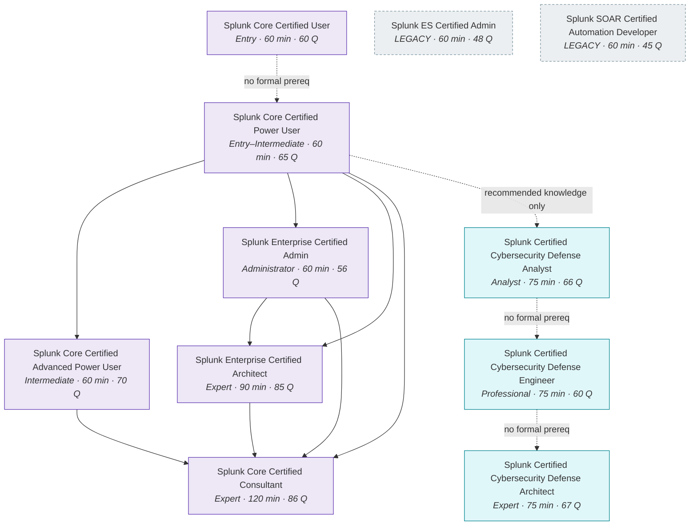

# EXT-SPL: The Splunk Series — Certification Pathway & Module Map

> **Module type:** Extension module series (vendor-specific elective)
> **Status:** Draft
> **Version:** v0.1
> **Last Reviewed:** 2026-09-09
> **Domain Expert:** _Unassigned — required before Practitioner Approved (Splunk platform / SecOps)_
> **Practitioner Reviewer:** _Unassigned — required before Practitioner Approved (must hold Enterprise Certified Architect or Core Certified Consultant)_

!!! warning "This is an extension series, not credit-bearing units"
    The degree is **66 units / 160 CP** and that structure is fixed (see
    [`docs/structure.md`](../../structure.md); structural changes require the process in
    [`CONTRIBUTING.md`](../../../CONTRIBUTING.md)). EXT-SPL sits **outside** that
    structure. It carries no credit points and does not appear in
    [`docs/ksat-coverage.md`](../../ksat-coverage.md) or the
    [Program Builder](../../program-builder/index.md), both of which are generated from
    credit-bearing units only. If a delivery partner wants to award recognition for it,
    use the Tier 1 badge mechanism in
    [`docs/curriculum/micro-credentials-framework.md`](../../curriculum/micro-credentials-framework.md).

!!! danger "This series is deliberately vendor-specific — read the R3 note below"
    Core rule **R3** forbids vendor lock-in *in core content*. This series is Splunk
    and only Splunk: there are no OpenSearch or Elastic substitutions, because a
    certification pathway cannot be taught vendor-neutrally without ceasing to be the
    thing it teaches. See [Why a vendor-specific series exists](#why-a-vendor-specific-series-exists).
    **Nothing in EXT-SPL may be cited as satisfying a core-unit requirement.**

---

## Purpose

This series maps the **Splunk certification ladder** onto the degree, and teaches the
platform knowledge each rung actually requires. It exists because Splunk is the SIEM a
large share of Australian enterprise and government SOCs actually run, and because the
certification track has a **prerequisite chain with real gates** — coursework you must
complete, exams you must pass in order, and in one case an authorisation email you must
send before you are allowed to sit the exam at all. Learners routinely discover those
gates late and at cost. Mapping them is the first deliverable.

The degree teaches SIEM concepts vendor-neutrally in
[OC02 — Security Monitoring & SIEM](../../../core/units/OC02-security-monitoring-siem.md),
detection logic across SPL/KQL/Sigma in
[DE03 — Writing Detection Logic](../../../degrees/operational/detection-engineering/DE03-writing-detection-logic.md),
and data/log engineering in
[F06](../../../core/units/F06-data-log-analysis.md) and
[DE02](../../../degrees/operational/detection-engineering/DE02-data-sources-log-engineering.md).
**EXT-SPL does not replace any of them.** It is the vendor-specific deep dive a graduate
takes when their employer runs Splunk and their career plan includes the certification.

---

## Why a vendor-specific series exists

R3 exists so that a graduate is employable at any shop, not just one that bought a
particular product — and so that no learner is priced out of the core degree. Both of
those hold only for **core content**. This series is honest about being the exception:

| R3 concern | How EXT-SPL is bounded |
|---|---|
| Graduates locked to one vendor | EXT-SPL is elective and non-credit. Every concept it uses has a vendor-neutral home in a core unit, which is the prerequisite. A learner who skips EXT-SPL entirely loses nothing from the degree. |
| Learners priced out | The core degree remains free. EXT-SPL is explicit about cost — see [Cost and access reality](#cost-and-access-reality) — and marks which modules can be completed at zero cost and which cannot. |
| Curriculum captured by a vendor | The series teaches *against* the certification blueprints as published, not from vendor courseware, and flags where Splunk's own gating (not pedagogy) drives the sequence. |
| Content rots when the vendor changes | Every exam fact in this series carries a verification date and a source URL. Splunk moved to Cisco ownership and the certification exam-authorisation address is now a `@cisco.com` address — the track is actively changing, and this series is written to be re-verified, not trusted. |

The transferable content is still real: **data onboarding and normalisation, search
language proficiency, index and retention design, distributed-search and clustering
architecture, and capacity/sizing judgement**. Those skills move to any log platform.
The syntax does not.

---

## Cost and access reality

State this to learners before they start, not after.

| Item | Cost | Notes |
|---|---|---|
| Splunk free eLearning (Intro to Splunk, Using Fields, Search Under the Hood, Intro to Dashboards, Introduction to Enterprise Security, SOC Essentials, SPL2 fundamentals, and others) | **Free** | Self-paced. Covers most of the Core User and a meaningful part of the Power User and CDA blueprints. |
| Splunk Enterprise **Free licence** | **Free** | 500 MB/day indexing. **No authentication, no users or roles, no alerting, no distributed search, no ingest actions.** Single standalone instance only. See [lab substrate](#lab-substrate-what-you-can-actually-build) — this is the hard constraint on the whole series. |
| Splunk Enterprise **trial** | Free for a limited period | Full-feature evaluation; the only free way to touch clustering and distributed search. Time-boxed, so architecture labs must be planned around it. |
| Any exam attempt (every certification in this series) | **US$130 per attempt** | Delivered by Pearson VUE. |
| Instructor-led prerequisite coursework (Architect and Consultant tracks) | **Paid, and substantial** | Not published as a fixed figure here because it varies by region and delivery mode. Treat the Architect and Consultant tracks as employer-sponsored, not self-funded. |
| `Core Consultant Labs` and `Services: Core Implementation` | **Paid and access-restricted** | Widely reported to be oriented to Splunk partners and employees. **Verify eligibility before planning a Consultant pathway** — see [SPL-08](spl-08-consultant.md). |

!!! note "The honest summary"
    Everything up to and including **Cybersecurity Defense Analyst** is realistically
    self-fundable: free courseware, a free licence, and one or two US$130 exams. From
    **Enterprise Admin** upward the mandatory coursework makes the track
    employer-sponsored in practice. EXT-SPL teaches the knowledge at every rung
    regardless; it cannot remove the paywall on the credential.

---

## The certification ladder

Splunk runs **two parallel tracks** that share a common base. The user-facing core track
(Core User → Power User → Advanced Power User) feeds both.

**Greyed, dashed nodes are Legacy Certifications** — still valid, no longer refreshed with
product releases. They sit outside the chain because neither publishes a prerequisite and
neither is a prerequisite for anything.

**Solid arrows are enforced prerequisites. Dotted arrows are recommended sequence only** —
Splunk lists no formal prerequisite certification for them, so you may sit those exams in
any order. That distinction matters commercially: the entire Cybersecurity Defense track
is gate-free, which makes it the fastest credential for a SOC analyst, while the
Architect and Consultant track is the most heavily gated in the Splunk portfolio.

---

## Verified prerequisite chains

All rows verified **2026-09-09** against the linked official pages. Every exam in the
table is US$130 per attempt and delivered by Pearson VUE.

| Certification | Level | Prerequisite certification(s) | Prerequisite coursework | Length | Questions |
|---|---|---|---|---|---|
| [Core Certified User](https://www.splunk.com/en_us/training/certification-track/splunk-core-certified-user.html) | Entry | None | None | 60 min | 60 |
| [Core Certified Power User](https://www.splunk.com/en_us/training/certification-track/splunk-core-certified-power-user.html) | Entry | None | None | 60 min | 65 |
| [Core Certified Advanced Power User](https://www.splunk.com/en_us/training/certification-track/splunk-core-certified-advanced-power-user.html) | Intermediate | Core Certified Power User | None published | 60 min | 70 |
| [Enterprise Certified Admin](https://www.splunk.com/en_us/training/certification-track/splunk-enterprise-certified-admin.html) | Administrator | Core Certified Power User | None published | 60 min | 56 |
| [Enterprise Certified Architect](https://www.splunk.com/en_us/training/certification-track/splunk-enterprise-certified-architect.html) | Expert | Core Certified Power User **and** Enterprise Certified Admin | **4 courses — all mandatory** (see below) | 90 min | 85 |
| [Core Certified Consultant](https://www.splunk.com/en_us/training/certification-track/splunk-core-certified-consultant.html) | Expert | Power User **and** Advanced Power User\* **and** Enterprise Admin **and** Enterprise Architect | **2 courses mandatory for registration**, 6 in the published track (see below) | 120 min | 86 |
| [Cybersecurity Defense Analyst](https://www.splunk.com/en_us/training/certification-track/splunk-certified-cybersecurity-defense-analyst.html) | Analyst | **None** (Power User–level knowledge recommended) | None | 75 min | 66 |
| [Cybersecurity Defense Engineer](https://www.splunk.com/en_us/training/certification-track/splunk-certified-cybersecurity-defense-engineer.html) | Professional | **None published** | None published | 75 min | 60 |
| [Cybersecurity Defense Architect](https://www.splunk.com/en_us/training/certification-track/splunk-certified-cybersecurity-defense-architect.html) | Expert | **None published** | None published | 75 min | 67 |
| [ES Certified Admin](https://www.splunk.com/en_us/training/certification-track/splunk-es-certified-admin.html) **(Legacy)** | Professional | **None listed** | None specified | 60 min | 48 |
| [SOAR Certified Automation Developer](https://www.splunk.com/en_us/training/certification-track/splunk-soar-certified-automation-developer.html) **(Legacy)** | Professional | **None listed** | None specified | 60 min | 45 |

\* **The Advanced Power User substitution.** Splunk's Consultant track flowchart states
that *in lieu of* earning the Advanced Power User certification, candidates may instead
complete **all 14 courses recommended for the Advanced Power User certification**. This
is the only published substitution anywhere in the ladder.

### The two hard gates

These are the facts learners most often miss, and the reason this index exists.

=== "Architect — automatic authorisation"

    **All four** of these courses are required to qualify for exam registration:

    1. `Architecting Splunk Enterprise Deployments`
    2. `Troubleshooting Splunk Enterprise`
    3. `Splunk Cluster Administration`
    4. `Splunk Enterprise Deployment Practical Lab`

    A candidate who **already holds Enterprise Certified Admin** and has completed all
    four **automatically receives exam authorisation within 5–7 business days of
    receiving their passing lab results**. No email required.

    !!! note "Naming variance"
        Splunk's exam page names course 4 *Splunk Enterprise Deployment Practical Lab*;
        the track flowchart names it *Splunk Deployment Practical Lab*. Same course.

=== "Consultant — manual authorisation by email"

    Only **two** courses are mandatory to qualify for exam registration:

    1. `Core Consultant Labs`
    2. `Services: Core Implementation`

    The full published track also lists `Indexer Cluster Implementation`,
    `Distributed Search Migration`, `Implementation Fundamentals`, and
    `Architect Implementation 1–3`.

    **Authorisation is not automatic.** Candidates who are Splunk Enterprise Certified
    Architects and have completed the required coursework **must email
    `splunk_certification@cisco.com` to request their Core Consultant exam
    authorisation**.

    !!! warning "Access constraint"
        `Core Consultant Labs` is reported to require the Architect certification as a
        precondition, and the Consultant track as a whole is oriented toward Splunk
        partners and employees. A learner outside that channel may be unable to
        register at any price. **Confirm eligibility before committing.**

---

## Programme changes you must know before planning a pathway

Two changes to the Splunk Certification programme, both verified 2026-09-09 against
Splunk's own certification-changes FAQ. Either can invalidate a learner's plan.

=== "Legacy Certifications — from 1 January 2026"

    Splunk introduced a **Legacy Certification** category on **1 January 2026**. Legacy
    credentials **remain valid and recognised**, but they are **no longer refreshed with
    product updates or releases**.

    Reclassified as Legacy (verified on their own exam pages):

    | Certification | Module that teaches the content |
    |---|---|
    | Splunk Enterprise Security Certified Admin | [SPL-04](spl-04-enterprise-security.md) |
    | Splunk SOAR Certified Automation Developer | [SPL-05](spl-05-soar.md) |
    | Splunk IT Service Intelligence Certified Admin | *(not covered — out of scope)* |

    **Products are being retired on the same pattern.** **Splunk UBA** (the standalone
    User Behavior Analytics appliance) reached **End of Sale in December 2025** and
    **End of Support in January 2027**; UEBA capability is now native to **ES Premier**.
    Verified 2026-09-09. [SPL-09](spl-09-detection-analytics.md) teaches the underlying
    methods rather than the product for exactly this reason.

    **Splunk names no replacement for any of them.** The series' position — clearly marked
    as a reading, not a Splunk statement — is that a learner starting today should target
    the **Cybersecurity Defense** track (Analyst → Engineer → Architect) for security work.

    **The content is not legacy even where the credential is.** ES and SOAR are the
    products Australian SOCs run. SPL-04 and SPL-05 teach them regardless of exam status.

=== "Recertification — from 1 March 2026"

    Splunk **no longer offers recertification through coursework completion**.

    Certifications operate on a **three-year lifecycle**, running from the date the
    **highest-level** certification was achieved.

    Two practical consequences:

    1. A learner on the Architect or Consultant track is committing to a **renewal
       obligation**, not a one-off purchase. Say so before they start.
    2. Because the clock runs from the highest-level certification, earning a higher rung
       resets the whole stack — which changes the optimal ordering for anyone holding
       several credentials.

!!! danger "This is exactly why the series carries a 6-month staleness window"
    Both changes landed inside the last nine months, and the Consultant exam-authorisation
    address is now a `@cisco.com` address. Treat every fact here as **stale after
    2027-03-09** and re-verify.

---

## Series structure

Eight modules across two tracks that share a common foundation. **SPL-01 and SPL-02 are
prerequisites for everything else.**

| Module | Topics | Covers | Ladder rung | Zero-cost? |
|---|---|---|---|---|
| **Foundation** | | | | |
| [SPL-01 — Search Fundamentals](spl-01-core-user.md) | 15 | The execution model, time, the command set, field extraction, reporting, the job inspector | Core Certified User | **Yes** |
| [SPL-02 — SPL Mastery & Knowledge Objects](spl-02-power-user.md) | 25 | Every knowledge-object type, the full `eval` function library, the `stats` family, multivalue, subsearches and the `join` rewrite, CIM, data models, acceleration and `tstats`, **Simple XML dashboards, tokens and drilldowns (33% of the APU exam)** | Power User → Advanced Power User | **Yes** |
| **Security track** | | | | |
| [SPL-03 — SOC Analysis & Threat Detection](spl-03-cyber-defense-analyst.md) | 17 | Analysis methods (Diamond, ACH, Pyramid of Pain, bias), triage, investigation by data source, analytical technique, PEAK hunting, reporting | Cybersecurity Defense Analyst | **Partly** — ES needs a trial |
| [SPL-04 — Enterprise Security Engineering](spl-04-enterprise-security.md) | 14 | Deploying ES, the dependency stack, Asset & Identity, correlation searches, adaptive response, the risk framework, threat intel, content lifecycle, ES capacity | ES Certified Admin **(Legacy)** → Cybersecurity Defense Engineer | **No** — premium app |
| [SPL-05 — SOAR & Security Automation](spl-05-soar.md) | 15 | Playbooks, the automation decision boundary, apps and custom actions, case management, measuring automation, defending the platform | SOAR Certified Automation Developer **(Legacy)** | **No** — licensed product |
| **Platform track** | | | | |
| [SPL-06 — Platform Administration](spl-06-enterprise-admin.md) | 17 | CLI and REST, `.conf` files and precedence, indexes and retention, all input types, parsing, forwarders, deployment server, RBAC, licensing, filtering, KV Store, monitoring | Enterprise Certified Admin | **Partly** — Free licence has no auth |
| [SPL-07 — Architecture & Deployment](spl-07-architect.md) | 17 | Tiers, SVAs, index and search head clustering, distributed search, capacity and sizing, SmartStore, tuning, troubleshooting, multi-site and DR, residency and cloud, ingest architecture, platform security, cost | Enterprise Certified Architect (+ Cybersecurity Defense Architect) | **No** — mandatory coursework |
| **Advanced analytics (cross-cutting, not certification-aligned)** | | | | |
| [SPL-09 — Detection Analytics & Risk Scoring](spl-09-detection-analytics.md) | 28 | The detection artefact decision framework; base rates and FDR; risk decay as an ODE; score calibration by regularised logistic regression; cost- and capacity-constrained thresholds; Mahalanobis/PCA/graph methods and UEBA; entropy and sketches; AITK, DSDL and custom Python; SPL optimisation as map-reduce | **None** — beyond every blueprint | **Partly** |
| **Apex** | | | | |
| [SPL-08 — Implementation & Consulting Practice](spl-08-consultant.md) | 22 | Discovery, base configurations, implementation and cluster method, migration, health assessment, use-case value, unwelcome communication, handover, operating model, professional practice | Core Certified Consultant | **No** — gated coursework |

**Notional total: ~969 hours** (170 topics, 69 labs) across the series, excluding exam preparation and vendor
coursework. This is a series, not a unit; hours are indicative only and have not been
through the AQF mapping process in
[`docs/compliance/aqf-teqsa.md`](../../compliance/aqf-teqsa.md).

!!! note "Why the two tracks are separate"
    The security track (SPL-03 → SPL-04 → SPL-05) and the platform track
    (SPL-06 → SPL-07) are **different jobs**, and Splunk's own certification structure
    reflects that: the security track publishes no prerequisites at all, while the platform
    track is the most heavily gated in the portfolio. A SOC analyst does not need SPL-06; a
    platform engineer does not need SPL-04. Only [SPL-08](spl-08-consultant.md) assumes
    both.

---

## Mapping onto the degree

EXT-SPL modules assume the corresponding core unit as prerequisite knowledge. The core
unit teaches the concept; the EXT-SPL module teaches the Splunk expression of it.

| EXT-SPL module | Assumed core units | Relationship |
|---|---|---|
| SPL-01 | [F06 — Data & Log Analysis](../../../core/units/F06-data-log-analysis.md) | F06 teaches log structure and query thinking; SPL-01 is the SPL dialect. |
| SPL-02 | [F06](../../../core/units/F06-data-log-analysis.md), [DE02](../../../degrees/operational/detection-engineering/DE02-data-sources-log-engineering.md) | DE02 teaches normalisation and data modelling; SPL-02 is CIM and Splunk data models. |
| SPL-03 | [OC02](../../../core/units/OC02-security-monitoring-siem.md), [OC04](../../../core/units/OC04-incident-response-lifecycle.md), [TH01](../../../degrees/operational/threat-hunting/TH01-hunting-methodology-process.md), [DE03](../../../degrees/operational/detection-engineering/DE03-writing-detection-logic.md) | OC02 teaches SIEM operation and OC04 the IR lifecycle, vendor-neutrally; TH01 supplies PEAK (a Splunk/SURGe model already cited in [`docs/maturity-models.md`](../../maturity-models.md)); SPL-03 is ES, notables and RBA. |
| SPL-04 | [SE04 — Detection & Response Engineering](../../../degrees/strategic/security-engineering/SE04-detection-response-engineering.md), [DE05](../../../degrees/operational/detection-engineering/DE05-detection-operations-management.md), [DE06](../../../degrees/operational/detection-engineering/DE06-capstone-detection-library.md) | SE04 teaches detection and response engineering vendor-neutrally; SPL-04 is the ES implementation, including content lifecycle as a software-delivery problem. |
| SPL-05 | [SE04](../../../degrees/strategic/security-engineering/SE04-detection-response-engineering.md), [OC04](../../../core/units/OC04-incident-response-lifecycle.md), [F03](../../../core/units/F03-scripting-automation.md) | Response automation. Shares its blast-radius and reversibility reasoning with [EXT-ANS](../ansible-security-automation.md) rather than repeating it. |
| SPL-06 | [F02 — Operating Systems](../../../core/units/F02-operating-systems.md), [F03](../../../core/units/F03-scripting-automation.md), [DE02](../../../degrees/operational/detection-engineering/DE02-data-sources-log-engineering.md) | Platform administration and data onboarding. |
| SPL-07 | [SE01](../../../degrees/strategic/security-engineering/SE01-secure-system-design.md), [SE02 — Security Architecture](../../../degrees/strategic/security-engineering/SE02-security-architecture.md), [SC02](../../../core/units/SC02-security-architecture.md), [SE05](../../../degrees/strategic/security-engineering/SE05-security-cloud-devsecops.md) | **The architecture module.** SE02 teaches architecture method (SABSA, Zero Trust); SPL-07 applies it to a distributed log platform under real capacity and failure constraints. |
| SPL-09 | [DE01 — Detection Theory & Philosophy](../../../degrees/operational/detection-engineering/DE01-detection-theory-philosophy.md), [DE05](../../../degrees/operational/detection-engineering/DE05-detection-operations-management.md), [F06](../../../core/units/F06-data-log-analysis.md) | **The analytics module.** DE01 supplies the detection philosophy; SPL-09 supplies the mathematics that makes it quantitative. Not aligned to any blueprint. |
| SPL-08 | [SE06 — Capstone: Architecture Design](../../../degrees/strategic/security-engineering/SE06-capstone-architecture-design.md), [SC06](../../../core/units/SC06-stakeholder-communication.md), [LD](../../../degrees/strategic/leadership/README.md) units | Consulting practice: requirements, stakeholder management, and defensible design under commercial constraint. |

### Certification bridges already claimed elsewhere

[`docs/structure.md`](../../structure.md) and
[`docs/compliance/workforce-frameworks.md`](../../compliance/workforce-frameworks.md)
already list *"Splunk Core Certified"* as a certification bridge for the Detection
Engineering major. That claim is now precise: the bridge is **Core Certified Power
User**, taught in [SPL-02](spl-02-power-user.md). Those documents should be updated to
name the specific credential — tracked in [`docs/TODO.md`](../../TODO.md).

---

## Lab substrate: what you can actually build

This is where the vendor-specific reality bites hardest, and where the series must not
pretend.

**The Splunk Free licence (500 MB/day) disables the features half this series is
about.** No authentication, no users or roles, no alerting, no distributed search, no
ingest actions, single standalone instance only. You are dropped into Splunk Web as an
admin-level user with no login. It also permits a bulk load well above the daily cap
only twice in any 30-day period, and if you exceed the limit too often it keeps indexing
but **disables search**.

Consequences for the series:

| Capability | Free licence | Workaround |
|---|---|---|
| SPL search, fields, reporting, dashboards | ✅ Works | None needed — SPL-01 and most of SPL-02 run entirely on Free. |
| Knowledge objects, data models, CIM | ✅ Works | None needed. |
| Users, roles, RBAC, authentication | ❌ Absent | Enterprise trial. **This is a core Enterprise Admin exam topic** — SPL-06 cannot be fully completed on Free. |
| Alerting / scheduled searches | ❌ Absent | Enterprise trial. |
| Enterprise Security, notables, RBA | ❌ Absent | Enterprise trial. ES is a separate premium app — **SPL-04 is gated end to end**. |
| Distributed search, index/search-head clustering | ❌ Absent | Enterprise trial only. **SPL-07 is trial-gated end to end.** |

**Planning guidance:** do SPL-01, SPL-02 and the vendor-neutral parts of SPL-03 on the
Free licence at leisure. Then start a trial and run SPL-06 and SPL-07 *inside the trial
window* as a single continuous block. Starting the trial early is the most common
avoidable mistake.

### The lab environment, and the path with no licence at all

The table above says what a licence gets you. It is not the whole picture, and read
alone it makes the series look far more gated than it is.

**[`labs/`](../../../labs/README.md)** provides a reproducible synthetic estate — about
130,000 labelled events across authentication, endpoint, web, DNS, cloud, firewall, IDS and risk, with
227 identities and 260 assets — plus a verification harness and Docker environments. It
exists because ground truth is the thing BOTS cannot give you: with labels you can
compute a real positive predictive value, which is what
[SPL-09](spl-09-detection-analytics.md) Part B is arithmetic about.

The **[lab guides](../../../labs/guides/README.md)** cover all 69 labs, one guide per
module. Each states plainly what it needs.

!!! important "Most of this series needs no Splunk instance, and that is not a compromise"
    A great deal of what these certifications assess is **paperwork**: configuration
    files written and defended, capacity models with traceable assumptions, index and
    retention design against a real obligation, risk arithmetic, ACH tables, coverage
    assessments that route telemetry gaps correctly, operating models, decision
    registers.

    Counted honestly across the series: **21 of the 69 labs need no platform by
    nature**, and the whole of [SPL-09](spl-09-detection-analytics.md) runs in
    standard-library Python against the dataset files. The paper path is written as the
    primary route in every guide, not as a consolation for people without a licence.

    Where a lab genuinely requires Enterprise Security or SOAR, the guide **names the
    blocker and gives the paper equivalent** rather than inventing a workaround. Five
    labs are in that position. They are specified anyway, because the capability is real
    and the exam blueprints test it.

Self-assessment across the whole series: the **[52-question quiz](quiz.md)** — single
answer and multiple selection, with the reasoning revealed per question.

**Public datasets.** Splunk publishes the *Boss of the SOC* (BOTS) datasets and the
`attack_range` project for generating attack telemetry, and the Splunk Security Content
/ ESCU repository for detection content. These are a realistic source of security data
for SPL-03, SPL-04 and SPL-07 labs, and complement rather than replace
[`labs/`](../../../labs/README.md): BOTS is real traffic without labels, the lab
generator is synthetic traffic with them, and the two support different exercises. **Licence terms and current availability must be confirmed
by the Domain Expert before these are made assessable** — see
[Verification status](#verification-status).

---

## Safety, authorisation and data handling

Read before any lab in this series.

1. **Labs run only against infrastructure you own or have written authorisation to
   test.** Same boundary as [F05](../../../core/units/F05-legal-ethics-compliance.md)
   and [CE01](../../../degrees/operational/cte/CE01-offensive-foundations-ethics.md).
2. **Never onboard real production or personal data into a lab instance.** A Free-licence
   Splunk instance has *no authentication* — anyone who can reach the port is an
   administrator. Bind it to localhost or an isolated lab network. Treat an exposed
   Free instance as a data-breach event under the *Privacy Act 1988* (Cth) Notifiable
   Data Breaches scheme if it ever holds real personal information.
3. **Attack-telemetry generation (`attack_range` and similar) is offensive tooling.**
   It runs only in an isolated lab. The *Criminal Code Act 1995* (Cth) Part 10.7
   offences turn on unauthorised access and impairment.
4. **Do not commit licence keys, API tokens, `.splunk` credentials, or BOTS data** to
   lab repositories.

---

## Verification status

Consistent with **R5 (accuracy over speed)**, this series separates what has been
verified from what has not.

### Verified 2026-09-09 against official Splunk pages

- Exam level, length, question count, price (US$130) and Pearson VUE delivery for all
  nine certifications in the ladder table.
- Architect prerequisite certifications and all four mandatory courses.
- Architect automatic exam authorisation, 5–7 business days after passing lab results.
- Consultant prerequisite certifications (all four) and the two registration-mandatory
  courses, plus the four additional published track courses.
- Consultant manual authorisation via `splunk_certification@cisco.com`.
- The Advanced Power User 14-course substitution for the Consultant track.
- Cybersecurity Defense Analyst has **no** formal prerequisite certification.
- Splunk Free licence limits and disabled features.
- **ES 8 renamed the detection vocabulary**: correlation search → **detection**, notable →
  **finding**, risk notable/risk event → **intermediate finding**; `risk_object` →
  `entity`. Risk factors are **multipliers**.
- **MLTK is now the Splunk AI Toolkit (AITK)**; **DLTK is now DSDL** (5.2.4, May 2026).
- **Splunk UBA: End of Sale December 2025, End of Support January 2027.**
- **All eleven published test blueprints retrieved and reconciled** (2026-09-09). Each
  module now carries a *Blueprint alignment* section mapping its topics to the examined
  domains and weightings, and stating what it covers beyond the blueprint.
- **ES Certified Admin** (Professional, 60 min, 48 Q) and **SOAR Certified Automation
  Developer** (Professional, 60 min, 45 Q) are both marked **Legacy Certification**, both
  publish no prerequisites, and **neither names a replacement**.
- The Legacy Certification category began **1 January 2026**; legacy credentials stay valid
  but are not refreshed with product releases.
- Recertification through coursework completion ends **1 March 2026**; certifications run a
  **three-year lifecycle** from the date the highest-level certification was achieved.

### What the blueprints changed

Reconciling against the published blueprints corrected three things that a reading of the
marketing pages alone got wrong. Recorded here because the same trap will catch the next
person.

1. **[SPL-08](spl-08-consultant.md) was mis-framed.** The Core Certified Consultant
   blueprint contains **no consulting-practice content**: it is ~90% technical mastery
   (Indexer Clustering 18%, Data Collection 15%, Indexing 14%, Search 14%, SHC 10%).
   The module now teaches the examined technical domains *and* the practice the job
   requires, clearly separated.
2. **A third of the Advanced Power User exam is dashboard development.** Domains
   17.0–22.0 — Simple XML, forms and tokens, drilldowns, base/post-process searches, event
   annotations, event handlers — total **33%**, more than acceleration, subsearches,
   multivalue and transactions combined. [SPL-02](spl-02-power-user.md) had almost none of
   it.
3. **Two topics sat in the wrong module.** Lookups are examined in the *Core User*
   blueprint (6%), not just Power User; and distributed search is examined in the
   *Enterprise Admin* blueprint (10%), not only at Architect level. Both moved down.

Weightings also reset the emphasis inside modules — troubleshooting is **30%** of the
Architect exam, and detection engineering **40%** of the Cybersecurity Defense Engineer
exam.

!!! note "On reproducing blueprint content (R6)"
    The alignment tables use **domain titles and percentage weightings only**, with a link
    to each source PDF. Sub-objective text is not reproduced. Weightings are facts
    necessary for curriculum alignment, not creative content, and every table cites its
    source.

### Not verified — Phase 4 items

| Item | Why it is provisional |
|---|---|
| Exam codes (`SPLK-xxxx`) | Not published on the current certification-track pages. Third-party sources are unreliable. **Not stated anywhere in this series.** |
| Prerequisite coursework for Power User, Advanced Power User and Enterprise Admin | Pages publish no mandatory coursework; recommended-course lists exist but are not authoritative for registration. |
| Cybersecurity Defense Engineer and Architect prerequisites | Published as "none". Given they sit above CDA in the marketing sequence, confirm whether an unpublished gate exists. |
| Successors to the Legacy certifications | Splunk names **no replacement** for ES Certified Admin or SOAR Certified Automation Developer. The series' position — that the Cybersecurity Defense track is the successor for security work — is **this series' reading, not a Splunk statement**. Confirm before advising a learner. |
| Splunk SOAR availability for learning use | Community/trial edition availability and licence terms are **unverified**. [SPL-05](spl-05-soar.md) labs are written so the highest-value ones run as design exercises without a platform, but availability must be confirmed before the module is scheduled. |
| ES and SOAR product versions | Neither [SPL-04](spl-04-enterprise-security.md) nor [SPL-05](spl-05-soar.md) is pinned to a product version, and both products change feature names and UI locations materially between releases. Version pinning must be fixed at review. |
| Instructor-led course pricing, and AUD pricing | Varies by region and delivery partner; deliberately not quoted. |
| `Core Consultant Labs` / `Services: Core Implementation` eligibility | Partner/employee restriction is reported by practitioners, not stated on the exam page. **Must be confirmed before any learner is advised to pursue the Consultant track.** |
| BOTS dataset and `attack_range` licence terms | Must be confirmed before lab content is made assessable. |
| ITSI (IT Service Intelligence) | The Architect blueprint examines ITSI sizing and topology (domain 4.5). ITSI is **out of scope** for this series and is a known gap. The ITSI Certified Admin credential is also **Legacy**. |
| Framework mappings (NICE/DCWF, SFIA 9, ASD, ATT&CK v19) and project-local KSAT IDs | Provisional pending Framework Custodian review, as everywhere else in the repository. |

!!! danger "Re-verification is mandatory, not optional"
    Splunk is now under Cisco ownership and the certification programme is actively
    changing — the exam-authorisation address is already a `@cisco.com` address. Treat
    every fact in this series as **stale after 6 months**. Re-verification is scheduled
    in [`docs/quality/annual-review-schedule.md`](../../quality/annual-review-schedule.md).

---

## Further reading

- [Splunk certification tracks](https://www.splunk.com/en_us/training/certification-track.html) — the authoritative index of all tracks and their current status.
- [Splunk free courses](https://www.splunk.com/en_us/training/free-courses.html) — the free self-paced eLearning catalogue.
- [Splunk Core Certified Consultant track flowchart (PDF)](https://www.splunk.com/en_us/pdfs/training/splunk-core-certified-consultant-track.pdf) — the source for the Consultant gating and the Advanced Power User substitution.
- [Splunk Enterprise Certified Architect track flowchart (PDF)](https://www.splunk.com/en_us/pdfs/training/splunk-enterprise-certified-architect-track.pdf) — the source for the Architect automatic-authorisation rule.
- [About Splunk Free](https://help.splunk.com/en/splunk-enterprise/administer/admin-manual/10.4/configure-splunk-licenses/about-splunk-free) — licence limits and disabled features.
- [Splunk Common Information Model documentation](https://docs.splunk.com/Documentation/CIM) — the normalisation standard used throughout SPL-02 onward.
- [PEAK threat hunting framework](https://www.splunk.com/en_us/blog/security/peak-threat-hunting-framework.html) — Splunk/SURGe, already cited in [`docs/maturity-models.md`](../../maturity-models.md).

---

## Series Metadata

| Field | Value |
|---|---|
| Series Code | EXT-SPL |
| Series Title | The Splunk Series — Certification Pathway & Module Map |
| Status | Draft |
| Type | Extension module series (non-credit, vendor-specific) |
| Modules | SPL-01 … SPL-09 (two tracks, apex, plus a cross-cutting analytics module) |
| Notional Hours | ~969 (indicative, not AQF-mapped) |
| Vendor-neutrality | **Exempt by design** — see [Why a vendor-specific series exists](#why-a-vendor-specific-series-exists). Not valid as core-unit content under R3. |
| Facts verified | 2026-09-09 |
| Re-verification due | 2027-03-09 |
| Licence | CC BY 4.0 |
