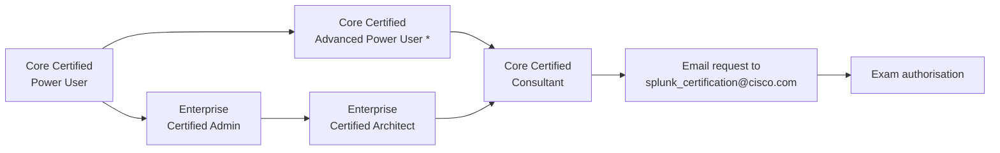

# SPL-08: Implementation & Consulting Practice — Splunk Core Certified Consultant

> **Part of:** [EXT-SPL — The Splunk Series](index.md)
> **Status:** Draft · **Version:** v0.1 · **Last Reviewed:** 2026-09-09
> **Domain Expert:** _Unassigned_ · **Practitioner Reviewer:** _Unassigned — must hold Core Certified Consultant_

!!! warning "Non-credit, vendor-specific"
    See the [series index](index.md) for the R3 carve-out. Nothing here satisfies a
    core-unit requirement.

---

## Target certification

| Field | Value | Verified |
|---|---|---|
| Certification | [Splunk Core Certified Consultant](https://www.splunk.com/en_us/training/certification-track/splunk-core-certified-consultant.html) | 2026-09-09 |
| Level | **Expert** — the top of the platform ladder | 2026-09-09 |
| Prerequisite certifications | **All four**: Core Certified Power User, Core Certified Advanced Power User\*, Enterprise Certified Admin, Enterprise Certified Architect | 2026-09-09 |
| Prerequisite coursework | **2 mandatory for registration**; 6 in the published track (below) | 2026-09-09 |
| Length | 120 minutes | 2026-09-09 |
| Format | 86 multiple choice questions | 2026-09-09 |
| Price | US$130 per attempt | 2026-09-09 |
| Delivery | Pearson VUE | 2026-09-09 |

!!! note "Naming"
    The certification is **Splunk Core Certified Consultant**. "Splunk Certified
    Consultant" is a common informal shortening and will not find the official page.

### The prerequisite chain in full

This is the most heavily gated credential in the Splunk portfolio. The chain is
cumulative, not alternative:

\* **The one published substitution in the entire ladder.** *In lieu of* earning the
Advanced Power User certification, candidates may instead complete **all 14 courses
recommended for the Advanced Power User certification**. No other rung offers a
substitution.

### The coursework gate

**Required to qualify for exam registration — both:**

1. `Core Consultant Labs`
2. `Services: Core Implementation`

**Also named in the published track:** `Indexer Cluster Implementation`,
`Distributed Search Migration`, `Implementation Fundamentals`, `Architect Implementation 1–3`.

!!! danger "Authorisation is manual, and eligibility may be restricted"
    Unlike [Architect](spl-07-architect.md), where authorisation arrives automatically,
    **Consultant authorisation must be requested**. Candidates who are Splunk Enterprise
    Certified Architects and have completed the required coursework **must email
    `splunk_certification@cisco.com`** to request their Core Consultant exam
    authorisation.

    **`Core Consultant Labs` is reported to require the Architect certification as a
    precondition, and the Consultant track as a whole is oriented toward Splunk partners
    and employees.** A learner outside that channel may be unable to register at any
    price. This is reported by practitioners rather than stated on the exam page — see
    [Verification status](#verification-status).

    **Confirm eligibility before committing time or money to this track.** Advising a
    learner to pursue a credential they cannot register for is the worst failure mode
    available to this series.

**Zero-cost achievable: no.** Four prerequisite certifications, mandatory paid coursework
at two levels, restricted-access labs, and manual authorisation. This is an
employer-sponsored track for people working at Splunk or a Splunk partner.

---

## Overview

!!! info "Read this module even if you will never sit the exam"
    The credential is gated. **The content is not.** Implementation discipline —
    standardised base configurations, requirements you can actually verify, migrations
    that can be rolled back, and telling a client something they do not want to hear — is
    the most transferable material in the entire series. It applies to any platform
    engagement, and it is genuinely useful to a graduate who will never touch the exam.

    Treat SPL-08 as the capstone of the series. The exam is optional; the practice is not.

Every module before this one asked *can you build it?* This one asks *can you build it for
someone else, on their estate, against their constraints, and leave them able to run it?*

That is a different discipline, and three things characterise it.

**Standardisation beats cleverness.** The single most valuable artefact in Splunk
consulting is the **base configuration** — a standardised, documented set of `.conf`
settings applied consistently across every deployment. Splunk's own consultant courseware
centres on this, including the props-and-transforms settings practitioners refer to as the
"Great 8". A bespoke deployment that only its author understands is a liability handed to
the client, however elegant it is.

**Requirements are extracted, not received.** Clients ask for a SIEM and mean a compliance
artefact, or a dashboard for an executive, or a fix for an incident that already happened.
The consultant's first job is to find the requirement behind the request, and the second is
to say when the stated budget cannot buy the stated outcome. That conversation is where
consulting engagements are won or lost, and it is the same stakeholder-communication skill
[SC06](../../../core/units/SC06-stakeholder-communication.md) teaches.

**You leave.** An engagement ends. Everything you built must survive your departure:
documented, handed over, and operable by people who were not in the room. Design decisions
that depend on the designer are defects.

---

## Where this module fits

| Unit / module | Relationship |
|---|---|
| [SPL-07](spl-07-architect.md) | **Enforced prerequisite** (via the Architect certification), and the design skills applied here. |
| [SPL-02](spl-02-power-user.md) | **Enforced prerequisite** (via Power User and Advanced Power User). Base configs are largely knowledge-layer and parsing standardisation. |
| [SE06 — Capstone: Architecture Design](../../../degrees/strategic/security-engineering/SE06-capstone-architecture-design.md) | **Closest degree analogue.** A defensible design delivered to a stakeholder under constraint. |
| [SC06 — Stakeholder Communication](../../../core/units/SC06-stakeholder-communication.md) | **Directly relevant.** Requirements elicitation, difficult conversations, and reporting to non-technical audiences. |
| [SC04 — Vendor & Supply Chain Risk](../../../core/units/SC04-vendor-supply-chain-risk.md) | The client's side of the engagement: you *are* the third party. |
| [SC05 — Security Program Management](../../../core/units/SC05-security-program-management.md) | Scoping, sequencing and delivering work that outlives the engagement. |
| [Leadership major](../../../degrees/strategic/leadership/README.md) | Professional practice, influence without authority, and client relationship management. |

---

## Learning outcomes

On completion, a learner can:

1. **Elicit** requirements from a client whose stated request differs from their actual
   need, and **document** them in verifiable form.
2. **Design** and **apply** a standardised base configuration, and **justify** deviation
   from it where a client constraint genuinely requires one.
3. **Plan** and **execute** an implementation or migration with staged validation and
   rollback at each stage.
4. **Evaluate** an existing deployment against good practice and **produce** a prioritised,
   costed remediation roadmap.
5. **Communicate** a technical recommendation — including an unwelcome one — to a
   non-technical decision-maker.
6. **Create** handover documentation sufficient for a team that was not present to operate
   the deployment.

> Bloom's 4–6, expert level.

---

## Framework mappings

> **Provisional pending Framework Custodian review.** These do **not** feed
> [`docs/ksat-coverage.md`](../../ksat-coverage.md).

### NIST NICE DCWF

| Version | Work Role | Code | T-Code | Task | Demonstrated in |
|---|---|---|---|---|---|
| 2023 | Enterprise Architect | SP-ARC-001 | T0473 | Document and address organisational requirements in system design | Lab 1, Lab 5 |
| 2023 | Security Architect | SP-ARC-002 | T0050 | Design system security architecture and supporting infrastructure | Lab 2, Lab 4 |
| 2023 | Systems Requirements Planner | SP-SRP-001 | T0033 | Define baseline system security requirements | Lab 1 |
| 2023 | Systems Requirements Planner | SP-SRP-001 | T0454 | Translate functional requirements into technical solutions | Lab 1, Lab 4 |
| 2023 | System Administrator | OM-ADM-001 | T0431 | Automate and standardise system administration | Lab 2 |

### SFIA 9

| Skill | Code | Level | Demonstrated in |
|---|---|---|---|
| Consultancy | CNSL | Level 5 | Lab 1, Lab 5 |
| Requirements definition and management | REQM | Level 5 | Lab 1 |
| Solution architecture | ARCH | Level 5 | Lab 4 |
| Configuration management | CFMG | Level 5 | Lab 2 |
| Release and deployment | RELM | Level 4–5 | Lab 3 |
| Stakeholder relationship management | RLMT | Level 5 | Lab 5 |

### ASD Cyber Skills Framework

| Domain | Sub-domain | Proficiency | Demonstrated in |
|---|---|---|---|
| Security Architecture | Platform & Infrastructure Design | Advanced | Lab 2, Lab 4 |
| Governance & Risk | Advice & Assurance | Advanced | Lab 1, Lab 5 |

### Project-local KSATs

| Type | ID | Statement | Demonstrated in |
|---|---|---|---|
| Knowledge | SPL-08-K01 | Knowledge of base-configuration methodology and standardised parsing settings | Topic 2; Lab 2 |
| Knowledge | SPL-08-K02 | Knowledge of implementation methodology and staged validation | Topic 3; Lab 3 |
| Knowledge | SPL-08-K03 | Knowledge of migration patterns and their rollback constraints | Topic 4; Lab 3 |
| Knowledge | SPL-08-K04 | Knowledge of health-assessment method for an existing deployment | Topic 5; Lab 4 |
| Skill | SPL-08-S01 | Skill in eliciting and documenting verifiable requirements | Lab 1 |
| Skill | SPL-08-S02 | Skill in applying and defending a standardised base configuration | Lab 2 |
| Skill | SPL-08-S03 | Skill in producing operable handover documentation | Lab 5 |
| Ability | SPL-08-A01 | Ability to tell a client their stated budget cannot buy their stated outcome | Lab 5; Summative |
| Ability | SPL-08-A02 | Ability to prioritise remediation by risk and cost rather than by ease | Lab 4 |
| Ability | SPL-08-A03 | Ability to design so the deployment survives the consultant's departure | Lab 5; Summative |

---

## Module structure

| Part | Topics | Labs | Notional hours |
|---|---|---|---|
| **A — Blueprint technical mastery** | **1–9** | **6** | **60** |
| B — The engagement and discovery | 10–11 | 1 | 14 |
| C — Standardisation | 12 | 2 | 14 |
| D — Implementation and migration | 13–15 | 3, 6 | 22 |
| E — Assessment and value | 16–18 | 4 | 20 |
| F — Communication, handover, practice | 19–22 | 5, 7 | 26 |
| | | | **~156 hours** |

---

## Blueprint alignment

!!! danger "The exam and the job are different things — this module teaches both"
    Splunk's published [Core Certified Consultant test blueprint](https://www.splunk.com/en_us/pdfs/training/splunk-test-blueprint-consultant.pdf)
    (retrieved 2026-09-09) contains **no consulting-practice content at all**. It is a
    **technical mastery exam** spanning the whole platform — the deepest one Splunk
    publishes. Roughly 90% of it is architecture, clustering, data collection, indexing
    and search internals.

    The *job*, and the prerequisite lab courses, are about implementation and client
    delivery. Both are taught here. **Part A is what the exam tests; Parts B–F are what
    the work requires.** Do not confuse the two — an earlier draft of this module covered
    only the second and would have left a candidate unprepared.

| Blueprint domain | Weight | Covered by |
|---|---|---|
| 1.0 Deploying Splunk (SVA, standalone→distributed, HA vs DR) | 5% | Topic 1 |
| 2.0 Monitoring Console | **8%** | Topic 2 |
| 3.0 Access and Roles (LDAP, SAML/SSO, role-based data security) | **8%** | Topic 3 |
| 4.0 Data Collection (ingestion methods, S2S, input types, troubleshooting) | **15%** | Topic 4 |
| 5.0 Indexing (artifacts, pipelines, parsing, retention) | **14%** | Topic 5 |
| 6.0 Search (job inspection, search types, efficiency, subsearches) | **14%** | Topic 6 |
| 7.0 Configuration Management (deployment apps and server) | **8%** | Topic 7 |
| 8.0 Indexer Clustering (buckets, failure modes, multisite, migration) | **18%** | Topic 8 |
| 9.0 Search Head Clustering (deployer, captain, RAFT election) | **10%** | Topic 9 |

**Beyond the blueprint** — Topics 10–22 cover discovery, base configurations, health
assessment, communication, handover, operating model and professional practice. None of
it is examined. All of it is the job, and it is what the prerequisite lab courses
(`Implementation Fundamentals`, `Architect Implementation 1–3`, `Services: Core
Implementation`) exist to develop.

!!! note "Prerequisite coursework — a source discrepancy"
    The blueprint names the prerequisite courses as **`Indexer Cluster Implementation
    Lab`, `Distributed Search Migration Lab`, `Implementation Fundamentals Lab`,
    `Architect Implementation Labs (1-3)`, and `Services: Core Implementation`**.

    The exam page and track flowchart name **`Core Consultant Labs`** as one of the two
    registration-mandatory courses; the blueprint **does not list it at all**. Both
    sources were retrieved the same day. Resolve with Splunk Education before advising a
    learner — recorded in [`docs/TODO.md`](../../TODO.md).

---

## Topics

## Part A — Blueprint technical mastery

> These nine topics carry the exam. Each is a *deeper* revisit of material introduced in
> [SPL-06](spl-06-enterprise-admin.md) and [SPL-07](spl-07-architect.md) — the Consultant
> exam expects you to explain mechanisms, not just operate them.

### Topic 1: Deployment Models, SVAs and HA versus DR

Splunk Validated Architectures: the pillar model, the topology categories, and selecting
one from stated requirements.

Articulating **how and why** a deployment grows from standalone to distributed to
clustered — the thresholds, not the preferences.

**High availability versus disaster recovery**, which the blueprint calls out explicitly
and which candidates routinely conflate. HA is surviving component loss without service
interruption; DR is recovering the service after loss of a site or the data itself. They
are addressed by different mechanisms in Splunk (clustering and replication factor versus
multisite, backup and frozen archive), and a design that provides one does not provide the
other.

### Topic 2: The Monitoring Console in Depth

Which instance is suitable to host the MC, and why it should not be a busy search head.
Configuring the MC for standalone versus distributed mode. Server roles and groups, and
how the MC uses them to know what to check.

**MC health checks**: how they run, what they cover, and how to extend them with custom
health checks — the part that separates operating the MC from configuring it.

### Topic 3: Authentication, Roles and Securing Data

Authentication methods and their trade-offs. **LDAP** concepts and configuration —
strategies, group mapping, and the failure modes when a bind account expires. **SAML and
SSO** options, and multifactor.

Roles as the data-security mechanism: capabilities, `srchIndexesAllowed`, and **search
filters (`srchFilter`)** for row-level restriction within an index. Role inheritance and
the resulting effective-permission problem, which is genuinely hard to reason about and
is a favourite exam target.

### Topic 4: Data Collection and S2S

The full set of ingestion paths onto an indexer, and choosing between them.

**Splunk-to-Splunk (S2S)**: how one Splunk instance actually talks to another — the
protocol, the cooked versus raw distinction, compression, TLS, and indexer acknowledgement.
This is the mechanism underneath every forwarder topology and the blueprint asks about it
directly.

Input types and configuration in depth, and **troubleshooting data inputs**: the ordered
method for "the data is not arriving" — check the forwarder, check S2S connectivity, check
the queue, check the index, check the search.

### Topic 5: Indexing Internals

**Indexing artifacts and their locations:** what a bucket directory actually contains —
the rawdata journal, `tsidx` files, bloom filters, and the metadata files — and why each
exists.

Event processing and the data pipelines: the parsing, merging, typing and indexing queues,
what each does, and reading a blocked queue as a diagnostic.

The **underlying text parsing and indexing process**: segmentation, how terms enter the
index, and how that determines which searches are fast. Data retention controls end to end.

### Topic 6: Search Internals

**Search job inspection** and explaining the inner workings of a search — the blueprint
phrases this as explaining the mechanism, not reading the numbers.

Search types: streaming, transforming, generating, orchestrating, dataset-processing — and
the centralised versus distributable streaming distinction that determines where work runs.

Maximising search efficiency: filtering, index/sourcetype specificity, TERM, and
`tstats`. **How subsearches work** — execution order, the result and time limits, and the
silent truncation that returns a wrong answer.

### Topic 7: Configuration Management at Consultant Depth

Deployment apps, how the deployment server works internally (phoning home, checksums,
reload versus restart), deployment system configuration, and managing a deployment server
at scale — including when the deployment server itself becomes the bottleneck.

### Topic 8: Indexer Clustering — The Largest Domain

**18% of the exam.** Deployment and component configuration: manager node, peers, search
heads, and the cluster bundle.

**The life cycle of data using buckets** — hot → warm → cold → frozen, bucket naming, and
what replication does at each stage. Primary versus searchable copies.

**Failure modes and recovery processes**: peer loss, bucket fix-up, what goes
non-searchable and for how long, manager node loss, and the recovery path for each.

**Multisite clustering**: site replication and search factors, site affinity, and how
failover behaves across sites. **Migration procedures** — single-site to multisite, and
cluster upgrade ordering.

### Topic 9: Search Head Clustering and RAFT

Managing and deploying a search head cluster. **When a SHC is needed and — the blueprint
asks this explicitly — when it is *not* recommended**: a small deployment with modest
search concurrency is worse off with a SHC than without one.

Content management using the **deployer**, and why direct member edits are lost.

The role of members and the **captain**, and **how captain election works (RAFT)** —
quorum, terms, and why a cluster that cannot reach quorum stops serving rather than
splitting. Captaincy transfer, member addition and decommissioning.

---

## Part B — Implementation and consulting practice

> Not examined. This is the work the prerequisite lab courses develop, and the reason the
> credential exists.

### Topic 10: The Engagement and the Real Requirement

Scoping, statements of work, and the gap between what a client asks for and what they need.
Common patterns: the compliance-driven deployment where nobody will read the alerts, the
executive dashboard as the actual deliverable, the "we bought Splunk, now what" engagement,
and the rescue of a deployment someone else abandoned.

Turning requirements into something **verifiable**. "Improve our security monitoring" is not
a requirement; "detect and alert on privileged account creation across all domain
controllers within five minutes, with evidence retained twelve months" is. The second can be
tested at handover. The first can be argued about forever, which is how engagements go bad.

Scope creep, change control, and the observation that the most expensive words in consulting
are "while we're in there".

### Topic 11: Discovery and Assessment

The structured intake at the start of an engagement: current-state architecture, data
inventory, licence position, use cases and their owners, existing content, team capability,
and the organisational constraints nobody writes down.

Interviewing across levels — the SOC analyst, the platform owner, the security manager and
the executive sponsor will describe different problems, and all four descriptions are data.
Reconciling them is the consultant's first analytical act.

Producing a current-state assessment the client recognises as accurate. Getting this wrong
poisons everything downstream, because a client who does not recognise their own environment
in your assessment will not trust your recommendation.

### Topic 12: Base Configurations and Standardisation

The consultant's core artefact. A standardised, documented, version-controlled set of
configurations applied consistently: `props.conf` and `transforms.conf` settings for correct
parsing, index definitions, forwarder outputs, and the deployment apps that carry them.

Splunk's consultant courseware centres on this and on the parsing settings practitioners
call the **"Great 8"**. The principle generalises well beyond Splunk: **set the things that
matter explicitly rather than relying on inference**, because inference works until the day
the data changes shape. The specific settings are the ones from
[SPL-06](spl-06-enterprise-admin.md) Topic 6 — line breaking, timestamp recognition,
truncation, charset — applied as a mandatory standard rather than a per-source decision.

Layering: how a base config, a client-specific layer and a source-specific layer compose
without fighting each other, and how precedence
([SPL-06](spl-06-enterprise-admin.md) Topic 3) determines whether that layering works.

Why standardisation wins: it is reviewable, transferable between engagements, makes defects
diagnosable, and means the client's estate looks like every other client's estate to the
next consultant. Deviation is allowed — but it must be justified and documented, or it is
just drift with a better story.

### Topic 13: Implementation Method

Sequencing a build: infrastructure, cluster, data onboarding, knowledge layer, content,
handover. Validation gates between stages, and the discipline of not proceeding past a
failed gate because the schedule says so.

Onboarding at scale: the standard process from [SPL-06](spl-06-enterprise-admin.md)
Topic 5–6 applied to fifty sources with a prioritisation order, driven by which detections
the client actually needs — which is [SPL-03](spl-03-cyber-defense-analyst.md)'s two-gap
distinction used as a planning input rather than an assessment output.

Working in someone else's change-management process, with someone else's approvals, on
someone else's production estate.

### Topic 14: Cluster and Distributed Implementation

The implementation-specific content of the consultant track: **indexer cluster
implementation** and **distributed search migration** as named procedures rather than
concepts.

Building a cluster to a standard: cluster manager configuration, peer provisioning, RF/SF
to the design from [SPL-07](spl-07-architect.md), indexer discovery, and validation that
replication actually works before declaring completion.

Migrating a standalone deployment to distributed, and a distributed deployment to
clustered, with data intact and a rollback at each stage.

### Topic 15: Migration and Consolidation

Version upgrades, single-site to multi-site, self-managed to Splunk Cloud, and consolidation
after an acquisition.

Data migration constraints, index compatibility, and knowledge-object portability. The
recurring problem: the knowledge layer is what makes the data useful, and it is the part
that migrates worst.

**Rollback planning at each stage**, and identifying the point of no return honestly.

### Topic 16: Health Assessment of an Existing Deployment

The engagement type most consultants meet most often: an estate that grew organically for
five years and now underperforms.

A structured assessment method: configuration hygiene (`btool` at estate scale), index and
retention correctness, data-onboarding quality and CIM compliance, knowledge-layer debt (the
audit from [SPL-02](spl-02-power-user.md) Lab 5), search and scheduler performance, capacity
headroom against the model from [SPL-07](spl-07-architect.md) Topic 6, detection-content
health from [SPL-03](spl-03-cyber-defense-analyst.md) Topic 15, and licence position.

Producing a **prioritised, costed roadmap** — ordered by risk and value, not by what is
easiest to fix or most interesting to the consultant. Distinguishing what must be fixed now,
what can be deferred, and what should simply be accepted and documented as residual risk.

### Topic 17: Use-Case Development and Value Realisation

The commercial reality behind most engagements: the client bought a platform and cannot
demonstrate value from it.

Use-case workshops that produce implementable requirements. Mapping use cases to data
sources to detections to outcomes, and being honest when a desired use case requires
telemetry the organisation does not collect and will not fund.

Prioritising by value and feasibility rather than by enthusiasm. Measuring and reporting
realised value in terms the sponsor recognises — which is rarely "number of dashboards".

### Topic 18: Performance and Troubleshooting on a Client Estate

Applying [SPL-07](spl-07-architect.md) Topics 9–10 under consulting conditions: incomplete
information, limited access, a client team that has already formed a theory, and production
systems you may not restart.

The diplomatic dimension: the person who built the thing you are diagnosing is usually in
the room. Diagnosing without assigning blame, because a defensive client team withholds the
information you need.

### Topic 19: Communicating the Unwelcome

The skill that most distinguishes a senior consultant, and the one vendor courseware teaches
least.

- Telling a client their deployment is badly built, without making an enemy of the person
  who built it — who will implement your recommendations.
- Telling a client their budget cannot buy their outcome, with the options that follow:
  reduce scope, increase budget, or accept the risk explicitly.
- Presenting to executives: what to include, what to leave out, and the discipline of
  leading with the decision required rather than the analysis performed.
- Writing a recommendation that survives being forwarded without you attached to it.
- Managing the client who wants a different answer and keeps asking.

Grounded in [SC06](../../../core/units/SC06-stakeholder-communication.md).

### Topic 20: Documentation, Handover and Leaving Well

Documentation that is actually operable: runbooks, the base config and its rationale, the
decision register, known limitations, and the things you would fix with more time.

Knowledge transfer to a team that was not present for the decisions. Enablement rather than
dependency: a deployment that requires a consultant on retainer to remain healthy is a
failed engagement, even though it is a profitable one.

**The decision register** is the highest-value handover artefact and the one most often
skipped: not what was built, but *why it was built that way and what was rejected*. Without
it, the next person to touch the estate will re-litigate every decision from scratch,
usually badly.

### Topic 21: Operating Model and Managed Services

Designing the client's ongoing operating model: who owns the platform, who owns content, who
owns detection, and what the RACI looks like when those are three different teams.

Run-books versus tribal knowledge. Capacity for growth. The support model, and the honest
question of whether the client should be running this themselves at all — which sometimes has
an uncomfortable commercial answer for the consultant.

### Topic 22: Professional Practice

The parts of consulting that are not technical.

Time and expectation management. Working within a delivery methodology. Ethics: the
recommendation that is right for the client but reduces your firm's revenue, and what you
do about it. Conflicts of interest where the consultant's firm resells the product. Knowing
the limits of your competence and saying so.

Australian professional context, and the fact that this is a small market where reputation
compounds — see [Australian context](#australian-context).

---

## Labs & exercises

!!! note "These labs are mostly not technical"
    Labs 1, 4 and 5 need no Splunk instance at all and are the most valuable in the module.
    Labs 2 and 3 need a lab deployment — reuse the [SPL-07](spl-07-architect.md) cluster
    inside the same trial window.

    Because the certification's own labs are access-restricted, these are written to be
    runnable **outside** Splunk's partner channel. They do not substitute for
    `Core Consultant Labs` for registration purposes and cannot — see
    [the coursework gate](#the-coursework-gate).

### Lab 1: Find the Real Requirement

Given a client brief that states the wrong requirement (provided scenario, or role-played
with a peer), conduct requirements elicitation and produce a verifiable requirements
document.

**Deliverable:** the requirements, each with a stated acceptance test, plus a short note on
**what the client asked for, what they actually need, and how you established the
difference**. That note is the assessed artefact.

### Lab 2: Build a Base Configuration

Produce a documented, version-controlled base configuration: index definitions, parsing
standards with the key `props.conf` settings explicit, forwarder outputs, and deployment
apps to carry them. Apply it to a lab deployment and onboard three dissimilar sources
using only the standard.

**Deliverable:** the base config in version control with a README explaining every
non-obvious setting, plus one documented, justified deviation.

### Lab 3: Staged Migration with Rollback

Migrate a lab deployment (e.g. single-site to clustered, or a version upgrade across a
cluster). Define stages, validation gates and rollback procedures **before** starting.

Then have a peer inject a failure at a stage of their choosing, and execute the rollback.

**Deliverable:** the plan, evidence of the executed rollback, and an honest account of what
the plan did not anticipate.

### Lab 4: Health Assessment and Roadmap

Given an intentionally degraded deployment (or a documented case study), conduct a
structured health assessment and produce a prioritised, costed remediation roadmap.

**Deliverable:** findings with evidence, a roadmap ordered by risk and value with effort
estimates, and an explicit "accept and document" category. A roadmap where everything is
priority one is a failed roadmap.

### Lab 5: Deliver the Bad News, Then Hand Over

Two parts, both assessed on communication.

1. Present the Lab 4 findings to a role-played client stakeholder whose team built the
   deployment you are criticising, and to an executive who wants to know why it will cost
   more than expected.
2. Produce the handover pack: runbooks, decision register, known limitations.

**Deliverable:** the presentation (or a recording), the handover pack, and a reflection on
what you would say differently. The decision register is weighted most heavily.

---

### Lab 6: Implement a Cluster to a Standard

Build an indexer cluster to a written specification — RF/SF from a stated tolerance,
indexer discovery, and your Lab 2 base configuration applied throughout.

The deliverable is not "a cluster exists". It is a **validated** cluster: evidence that
replication occurred, that the base config applied on every peer, and that a peer failure
behaves as the specification says it should.

**Deliverable:** the build procedure as a repeatable runbook, the validation evidence, and
the completion criteria you would sign against on a client engagement.

### Lab 7: Design the Operating Model — *no platform required*

For the organisation in Lab 4, design the ongoing operating model: RACI across platform,
content and detection ownership; the run-book set; the growth plan; and the support model.

Then answer the uncomfortable question honestly: should this client be running this
themselves, or is a managed service the right recommendation even though it reduces your
firm's implementation revenue?

**Deliverable:** the operating model, and a written recommendation on the build-versus-manage
question with the reasoning shown — including the commercial conflict of interest, stated
plainly.

---

## Assessment

### Formative 1: Rewrite the Requirement

Given six vague client statements, rewrite each as a verifiable requirement with an
acceptance test, and name the question you would have to ask the client to do so honestly.

### Formative 2: What Would You Not Fix?

Given a health-assessment finding list, select the items you would recommend **accepting**
rather than remediating, and defend each. Assesses proportionality — the consultant failure
mode is recommending everything.

### Summative: Engagement Package

For a described Australian client with a stated budget, a compliance driver, an existing
degraded deployment and an unrealistic expectation:

1. Verifiable requirements, with the gap between stated request and actual need made explicit.
2. Target architecture with a base-configuration standard.
3. Implementation or migration plan with staged validation and rollback.
4. Prioritised, costed roadmap including an accepted-risk category.
5. An executive communication delivering at least one unwelcome message.
6. A handover pack including a decision register.
7. **A statement of what you recommended against, and why.**

Items 5 and 7 carry disproportionate weight. A package that gives the client everything
they asked for, within a budget that cannot support it, and without a single documented
disagreement, is marked as a failure of professional judgement — not rewarded as
customer service.

---

## Australian context

- **Professional and contractual liability.** A consultant's design advice carries
  obligations under Australian Consumer Law and the engagement contract. Recommendations
  should be recorded, and so should the client's decision to reject one. The decision
  register in Topic 7 is a professional-protection artefact as much as a technical one.
- **The client's third-party risk obligations are your engagement conditions.** Under
  **APRA CPS 234** a regulated entity must ensure information-security capability of
  third parties handling its information assets, and **CPS 230** adds operational-risk and
  service-provider management requirements. The **SOCI Act 2018 (Cth)** imposes analogous
  expectations for critical-infrastructure responsible entities. When you consult for these
  organisations, you are the third party in someone's risk register — which is
  [SC04](../../../core/units/SC04-vendor-supply-chain-risk.md) viewed from the other side.
- **Consultant access to client data is a privacy exposure.** Building and troubleshooting
  a Splunk deployment means searching real production logs containing personal information
  under the **Privacy Act 1988 (Cth)**. Access scope, duration and offshore access by
  distributed delivery teams all need to be settled in the engagement, not assumed.
- **IRAP and government engagements.** Consulting on Australian Government systems brings
  personnel security-clearance requirements, the **Hosting Certification Framework** for
  hosting arrangements, and ISM-aligned assessment. These constrain who may perform the
  work, not just how.
- **Essential Eight and ISM as the usual compliance driver.** Most Australian Splunk
  engagements have a compliance trigger behind them. The consulting skill is delivering
  genuine monitoring capability *and* the evidence artefact, while being honest that the
  two are not the same thing — and that a client who only wants the second is buying
  something that will not detect an intrusion.
- **The market reality.** The Australian Splunk consulting market is small and
  relationship-driven. Reputation compounds, and so does the consequence of a deployment
  handed over in a state only its author understands.

---

## Verification status

- **Verified 2026-09-09:** all exam facts above, against the linked official page and the
  [Consultant track flowchart](https://www.splunk.com/en_us/pdfs/training/splunk-core-certified-consultant-track.pdf) —
  Expert level, 120 minutes, 86 questions, US$130, Pearson VUE.
- **Verified 2026-09-09:** the prerequisite chain is **cumulative** — all four
  certifications, not one of them. An earlier reading of the HTML page as "one of the
  following" was contradicted by the track flowchart, which lists all four under
  *Prerequisite Certification(s)*; the flowchart is treated as authoritative here.
- **Verified 2026-09-09:** `Core Consultant Labs` and `Services: Core Implementation` are
  the two courses required to qualify for exam registration; the four additional track
  courses; manual authorisation via `splunk_certification@cisco.com`; and the
  14-course substitution for Advanced Power User.
- **NOT VERIFIED — and consequential.** The restriction of `Core Consultant Labs` /
  `Services: Core Implementation` to Splunk partners and employees, and the report that
  `Core Consultant Labs` requires the Architect certification as a precondition, come from
  **practitioner community reports, not from Splunk's published exam page**. Splunk does
  not publish eligibility criteria for these courses.

    !!! danger "Confirm before advising any learner"
        This must be confirmed with Splunk Education directly before a learner is advised
        to pursue the Consultant track. If the restriction holds, the credential is
        unavailable to learners outside the partner channel regardless of ability, and
        this module should be presented as **content without a reachable credential**.

- **Not verified:** the exam code is not published and is deliberately not stated. Course
  pricing varies by region and is deliberately not quoted. The "Great 8" props settings
  are named as practitioner terminology; the exact set has **not** been verified against
  current courseware and no specific settings are listed here. Topic coverage
  **has now been reconciled against the published test blueprint** — see
  [Blueprint alignment](#blueprint-alignment). Sub-objective wording is not reproduced;
  the mapping uses domain titles and weightings only.
- **Correction made 2026-09-09.** An earlier draft of this module covered only consulting
  practice. The published blueprint is a **technical mastery exam** with no
  consulting-practice content, so Part A (Topics 1–9) was added to cover the nine examined
  domains. Anyone who reviewed the earlier draft should re-read the module structure.
- **Source discrepancy on prerequisite coursework.** The blueprint names
  `Indexer Cluster Implementation Lab`, `Distributed Search Migration Lab`,
  `Implementation Fundamentals Lab`, `Architect Implementation Labs (1-3)` and
  `Services: Core Implementation`. The exam page and track flowchart name
  **`Core Consultant Labs`** as registration-mandatory, and the blueprint does not list it.
  Both retrieved 2026-09-09. Unresolved — recorded in [`docs/TODO.md`](../../TODO.md).
- **Requires a currently-certified reviewer.** This module must not reach Practitioner
  Approved without review by someone holding a **current** Core Certified Consultant
  certification, who can confirm both the eligibility question and the base-configuration
  content.
- Framework mappings and KSAT IDs are provisional per the
  [series verification status](index.md#verification-status).

---

## Further reading

- [Core Certified Consultant track](https://www.splunk.com/en_us/training/certification-track/splunk-core-certified-consultant.html) — official exam page and test blueprint.
- [Consultant track flowchart (PDF)](https://www.splunk.com/en_us/pdfs/training/splunk-core-certified-consultant-track.pdf) — the source for the cumulative prerequisite chain, the coursework gate, the email authorisation, and the 14-course substitution.
- [Core Consultant Labs course description (PDF)](https://www.splunk.com/en_us/pdfs/training/core-consultant-labs-course-description.pdf) — course content and stated preconditions.
- [Core Implementation training course description (PDF)](https://www.splunk.com/en_us/pdfs/training/core-implementation-training-course-description.pdf) — the second mandatory course.
- [Splunk Validated Architectures](https://www.splunk.com/en_us/pdfs/tech-brief/splunk-validated-architectures.pdf) — Splunk's own reference topologies; the standardisation argument in Topic 2 applied to whole deployments.
- [Splunk Enterprise Admin Manual — configuration file precedence](https://docs.splunk.com/Documentation/Splunk/latest/Admin/Wheretofindtheconfigurationfiles) — the mechanics underneath base configurations.
- [APRA CPS 234](https://www.apra.gov.au/information-security) and [CPS 230](https://www.apra.gov.au/operational-risk-management) — the client-side obligations that become engagement conditions.

---

## Module metadata

| Field | Value |
|---|---|
| Module Code | SPL-08 |
| Module Title | Implementation & Consulting Practice — Splunk Core Certified Consultant |
| Series | [EXT-SPL](index.md) |
| Status | Draft |
| Bloom's Level | 4–6 (Analyse / Evaluate / Create) |
| Notional Hours | ~156 |
| Zero-cost achievable | **No** — four prerequisite certifications, mandatory paid coursework, restricted-access labs, manual authorisation |
| Credential reachable outside the partner channel? | **Unconfirmed — see [Verification status](#verification-status)** |
| Facts verified | 2026-09-09 |
| Licence | CC BY 4.0 |
