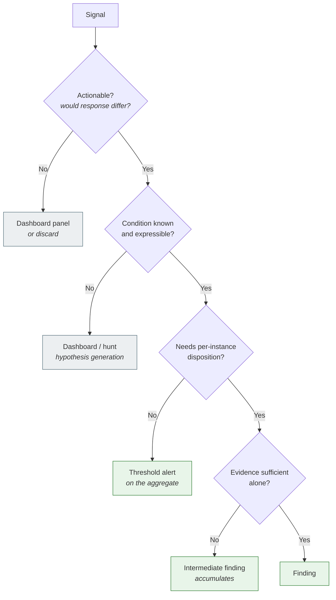

# SPL-09: Detection Analytics, Risk Scoring & the Mathematics Behind Them

> **Part of:** [EXT-SPL — The Splunk Series](index.md)
> **Status:** Draft · **Version:** v0.1 · **Last Reviewed:** 2026-09-09
> **Domain Expert:** _Unassigned_ · **Practitioner Reviewer:** _Unassigned — requires production RBA/UEBA experience_

!!! warning "Non-credit, vendor-specific"
    See the [series index](index.md) for the R3 carve-out. Nothing here satisfies a
    core-unit requirement.

!!! info "This module is deliberately **not** certification-aligned"
    Every other module in EXT-SPL maps to a published test blueprint. **This one does
    not.** No Splunk exam tests the mathematics of risk scoring, and the blueprints treat
    machine learning as a naming exercise.

    That gap is the reason the module exists. A SOC that deploys risk-based alerting
    without understanding decay dynamics, base rates or score calibration will build
    something that fires constantly and means nothing — and will pass the certification
    exams while doing it.

    It is a **cross-cutting advanced module** serving the security track
    ([SPL-03](spl-03-cyber-defense-analyst.md) → [SPL-04](spl-04-enterprise-security.md)
    → [SPL-05](spl-05-soar.md)), and it draws on the platform track for the optimisation
    material in Part G.

!!! danger "Terminology: ES 8 renamed almost everything in this module"
    Splunk Enterprise Security 8 changed the vocabulary that SPL-03 and SPL-04 use, and
    that most published material still uses:

    | Pre-ES 8 term | ES 8 term | Where it lives |
    |---|---|---|
    | Correlation search | **Detection** | — |
    | Notable / notable event | **Finding** | `notable` index |
    | Risk notable | **Finding** (from a risk incident rule) | `notable` index |
    | Risk event / risk modifier | **Intermediate finding** | `risk` index |
    | `risk_object`, `risk_object_type` | `entity`, `entity_type` | `risk` index |

    Verified 2026-09-09 against Splunk's ES 8.6 risk-scoring documentation. **This module
    uses the ES 8 terms and gives the legacy term on first use**, because most of the
    field, most blogs, and both relevant exam blueprints still say "notable". Field names
    in particular differ by ES version — check before copying any SPL here into a
    production estate.

---

## Audience and prerequisites

Written for **junior through senior technical cyber defence analysts**, and for the
detection engineers who build what they triage. The maths is developed from stated
first principles, but it moves quickly.

**Assumed mathematically:** differentiation and integration in one variable; matrix
multiplication, eigenvalues, and what an inner product is; probability, conditional
probability and Bayes' theorem; the idea of a distribution and its moments. A first-year
university sequence in calculus, linear algebra and probability is sufficient.

**Not assumed:** measure theory, functional analysis, or any prior machine learning. Where
a result needs heavier machinery, the result is stated, the intuition given, and the
derivation cited rather than reproduced.

!!! note "On the mathematics that is *not* here"
    You were promised only what earns its place. Two honest exclusions, both explained
    where they arise:

    - **Partial differential equations** have one genuinely defensible use in this
      domain — the graph heat kernel for risk propagation (Topic 18) — and essentially
      none beyond it. Security telemetry is discrete, irregularly sampled and
      non-stationary; continuous PDE machinery has little purchase on it. Anyone selling
      you more than that is padding.
    - **Number theory** does not appear in risk functions at all. It appears in the
      *data structures* that make analytics tractable at scale — Bloom filters, HyperLogLog,
      MinHash, universal hash families — which is a real and load-bearing role (Topic 21),
      just not the one people expect.

| Assumed module | Why |
|---|---|
| [SPL-02](spl-02-power-user.md) | `stats`/`eventstats`/`streamstats`, `eval` functions, data models, `tstats`, acceleration. Part G assumes Topics 8, 14 and 20 of that module. |
| [SPL-03](spl-03-cyber-defense-analyst.md) | The analyst workflow, ATT&CK, the two-gap distinction. |
| [SPL-04](spl-04-enterprise-security.md) | ES frameworks, detections, adaptive response, the risk framework as configured. This module is the *theory* under SPL-04's *practice*. |
| [F03](../../../core/units/F03-scripting-automation.md) | Python. Parts D–F assume you can read and write it. |
| [DE01](../../../degrees/operational/detection-engineering/DE01-detection-theory-philosophy.md), [DE05](../../../degrees/operational/detection-engineering/DE05-detection-operations-management.md) | Detection theory and detection operations, vendor-neutral. |

---

## Overview

There is a question underneath every detection estate that most SOCs never answer
explicitly:

> **Given that this condition occurred, what is the probability that something bad is
> happening, and is that probability high enough to be worth a human's time?**

Everything in this module is an attempt to answer that question honestly. It has three
parts, and they are usually confused with one another:

1. **A modelling problem.** What function of the observable data best separates
   adversary behaviour from normal behaviour? This is statistics, information theory,
   linear algebra and — occasionally, genuinely — machine learning.
2. **A decision problem.** Given a score, where do you put the threshold? This is
   optimisation under constraint: your constraint is analyst hours, and it binds.
3. **A design problem.** What *artefact* should the result be — a finding, an
   intermediate finding, a threshold alert, or a panel on a dashboard? This is
   doctrine, and getting it wrong wastes the other two.

Part A settles the design problem first, because it determines what the maths is for. A
score that will become a dashboard panel is optimised very differently from one that will
page someone at 3am.

**The organising claim of this module:** most SOC alerting failures are not detection
failures. They are **base-rate failures** — a detection with an excellent true positive
rate and an unremarkable false positive rate, pointed at a population where the event is
vanishingly rare, produces a queue that is almost entirely noise. No amount of tuning
logic fixes an arithmetic problem. Topic 5 does the arithmetic.

---

## Where this module fits

| Unit / module | Relationship |
|---|---|
| [SPL-04](spl-04-enterprise-security.md) | **Primary partner.** SPL-04 configures the risk framework; SPL-09 explains what the numbers mean and how to choose them. |
| [SPL-03](spl-03-cyber-defense-analyst.md) | Topics 1–4 sharpen SPL-03's triage doctrine into an explicit artefact decision. |
| [SPL-05](spl-05-soar.md) | Part A's decision framework determines what is worth automating; SPL-05's decision boundary determines whether it may be. |
| [SPL-07](spl-07-architect.md) | Part G is the analytics-specific view of SPL-07's search and capacity material. |
| [DE01 — Detection Theory & Philosophy](../../../degrees/operational/detection-engineering/DE01-detection-theory-philosophy.md) | **The core unit this applies.** Pyramid of Pain, detection-as-code, the philosophy this module quantifies. |
| [DE03](../../../degrees/operational/detection-engineering/DE03-writing-detection-logic.md), [DE05](../../../degrees/operational/detection-engineering/DE05-detection-operations-management.md) | Detection authoring and alert-quality management, vendor-neutral. |
| [F06](../../../core/units/F06-data-log-analysis.md) | Statistical log analysis at foundation level. |

---

## Learning outcomes

On completion, a learner can:

1. **Select** the correct detection artefact — finding, intermediate finding, threshold
   alert, or dashboard — for a stated requirement, and **justify** the choice against an
   explicit decision rule.
2. **Compute** the positive predictive value of a detection from its operating
   characteristics and the base rate, and **derive** the false positive rate required to
   meet a stated alert-quality target.
3. **Model** risk accumulation and decay as a first-order linear system, **solve** for
   steady state, and **choose** a half-life and threshold that are consistent with each
   other.
4. **Calibrate** risk weights against historical dispositions using regularised logistic
   regression, and **evaluate** the resulting scores for calibration as well as
   discrimination.
5. **Derive** the optimal alerting threshold under a stated cost model, and **allocate**
   a fixed alert budget across competing detections by equalising marginal yield.
6. **Apply** linear-algebraic and graph methods — Mahalanobis distance, PCA reconstruction
   error, spectral partitioning, heat-kernel propagation — to entity behaviour data.
7. **Implement** analytics in Splunk using SPL, the AI Toolkit, and custom Python, and
   **judge** which of those is appropriate for a given workload.
8. **Optimise** an analytic search by reasoning about where each command executes in the
   distributed search model.

> Bloom's 4–6 throughout. This module has no content below *Analyse*.

---

## Framework mappings

> **Provisional pending Framework Custodian review.** These do **not** feed
> [`docs/ksat-coverage.md`](../../ksat-coverage.md).

### NIST NICE DCWF

| Version | Work Role | Code | T-Code | Task | Demonstrated in |
|---|---|---|---|---|---|
| 2023 | Cyber Defense Analyst | PR-CDA-001 | T0166 | Engineer correlation and automated response | Lab 3, Lab 4 |
| 2023 | Cyber Defense Analyst | PR-CDA-001 | T0258 | Provide timely detection and reporting of anomalous activity | Lab 2, Lab 5 |
| 2023 | Data Analyst | DA-ANL-001 | T0342 | Analyse data sources to produce actionable information | Lab 5, Lab 6 |
| 2023 | Systems Developer | SP-SYS-002 | T0014 | Design and develop analytic data structures | Lab 6, Lab 7 |
| 2023 | Threat/Warning Analyst | AN-TWA-001 | T0748 | Monitor and report adversary activity and trends | Lab 5 |
| 2023 | Security Architect | SP-ARC-002 | T0050 | Design detection architecture and supporting infrastructure | Lab 8; Summative |

### SFIA 9

| Skill | Code | Level | Demonstrated in |
|---|---|---|---|
| Data science | DATS | Level 5 | Labs 5–7 |
| Security operations | SCAD | Level 5 | Labs 1–4 |
| Data modelling and design | DTAN | Level 5 | Lab 6 |
| Numerical analysis | NUAN | Level 5 | Labs 3, 4 |
| Measurement | MEAS | Level 4–5 | Lab 2; Summative |
| Systems & software life cycle / assurance | SURE | Level 4 | Lab 7 |

### ASD Cyber Skills Framework

| Domain | Sub-domain | Proficiency | Demonstrated in |
|---|---|---|---|
| Defensive Operations | Detection Engineering | Advanced | Labs 3–5 |
| Defensive Operations | Monitoring & Analysis | Advanced | Labs 1–2 |
| Secure Systems | Data Engineering & Analytics | Advanced | Labs 6–8 |

### Project-local KSATs

| Type | ID | Statement | Demonstrated in |
|---|---|---|---|
| Knowledge | SPL-09-K01 | Knowledge of the detection artefact taxonomy and its selection criteria | Topics 1–4; Lab 1 |
| Knowledge | SPL-09-K02 | Knowledge of base-rate effects on predictive value in rare-event detection | Topic 5; Lab 2 |
| Knowledge | SPL-09-K03 | Knowledge of multiple-comparison effects across entity populations | Topic 6; Lab 2 |
| Knowledge | SPL-09-K04 | Knowledge of risk accumulation and decay as a first-order linear system | Topic 10; Lab 3 |
| Knowledge | SPL-09-K05 | Knowledge of score aggregation semantics: additive, multiplicative and log-odds | Topics 11–12; Lab 3 |
| Knowledge | SPL-09-K06 | Knowledge of cost-sensitive and capacity-constrained threshold selection | Topic 14; Lab 4 |
| Knowledge | SPL-09-K07 | Knowledge of distance, projection and graph methods for entity behaviour | Topics 15–18; Lab 6 |
| Knowledge | SPL-09-K08 | Knowledge of the distributed execution model of a Splunk search | Topics 26–28; Lab 8 |
| Skill | SPL-09-S01 | Skill in computing and reporting predictive value from measured operating characteristics | Lab 2 |
| Skill | SPL-09-S02 | Skill in implementing decayed risk aggregation in SPL | Lab 3 |
| Skill | SPL-09-S03 | Skill in fitting and regularising risk weights against disposition labels | Lab 4 |
| Skill | SPL-09-S04 | Skill in implementing analytics via AITK and custom Python | Labs 6–7 |
| Skill | SPL-09-S05 | Skill in rewriting an analytic search to maximise distributable work | Lab 8 |
| Ability | SPL-09-A01 | Ability to choose the correct artefact for a detection requirement | Lab 1; Formative 1 |
| Ability | SPL-09-A02 | Ability to reject a detection on arithmetic rather than aesthetic grounds | Lab 2; Formative 2 |
| Ability | SPL-09-A03 | Ability to defend a scoring scheme as calibrated rather than plausible | Lab 4; Summative |
| Ability | SPL-09-A04 | Ability to judge when a model's opacity disqualifies it from production | Topic 25; Summative |

---

## Module structure

| Part | Topics | Labs | Notional hours |
|---|---|---|---|
| A — The detection artefact decision framework | 1–4 | 1 | 14 |
| B — The statistics of detection | 5–9 | 2 | 24 |
| C — The mathematics of risk scoring | 10–14 | 3, 4 | 30 |
| D — Linear algebra, graphs and UEBA | 15–18 | 6 | 24 |
| E — Information theory and discrete methods | 19–21 | 5 | 16 |
| F — Machine learning inside Splunk | 22–25 | 7 | 22 |
| G — SPL optimisation as a distributed-systems problem | 26–28 | 8 | 18 |
| | | | **~148 hours** |

---

## Topics

## Part A — The detection artefact decision framework

### Topic 1: Four Artefacts, Four Jobs

Splunk gives you four ways to express "something is worth knowing about". They are not
interchangeable, and most detection-estate dysfunction is one of them being used for
another's job.

| Artefact | ES 8 name | What it asserts | Lifecycle |
|---|---|---|---|
| **Finding** | finding (was *notable*) | "A known, actionable condition occurred. A human must decide what to do." | Owned, triaged, dispositioned, audited |
| **Intermediate finding** | intermediate finding (was *risk event*) | "Something mildly suspicious happened. It is not worth a human alone, but it counts." | Accumulates against an entity; no individual triage |
| **Threshold alert** | scheduled alert | "An aggregate crossed a line." | Fires; usually no per-instance record |
| **Dashboard panel** | — | "Here is the shape of something. Look at it." | Pulled by a human, not pushed |

The distinction that does the most work: a **finding is a claim about a specific thing that
requires a specific response**, and it carries a state machine and an audit trail because
somebody will later ask what you did about it. An **intermediate finding is evidence**. It
is not a claim, it is a contribution to one.

Conflating them produces the two classic estates:

- **All findings, no intermediate findings.** Every weak signal pages someone. The queue
  is 95% noise, analysts close by reflex, and the one real detection is closed at 04:12
  in a batch of forty.
- **All intermediate findings, no findings.** Everything accumulates and nothing ever
  fires, because the threshold was set by intuition and never calibrated. The SOC has
  excellent telemetry and no detections.

### Topic 2: The Decision Rule

Your working heuristic — *if it generally requires action and is known, it should be a
finding* — is correct, and it is worth making precise, because the two qualifiers are
doing different work and each has an exception.

Ask four questions in order:

**1. Is it actionable?** Is there a response a human would take, that differs depending on
this signal? If the honest answer is "we would look at it and then do nothing", it is not
a finding. *This is the question that kills most candidate detections.*

**2. Is the condition known and expressible?** Can you write the condition down? If you
can, it can be a detection. If you can only say "something looks off", you need a
dashboard or a hunt, because you cannot alert on an unarticulated condition.

**3. Does each instance need individual disposition?** Findings are per-instance and carry
audit obligations. If you would only ever act on the *aggregate* — "more than twenty of
these in an hour" — the individual events are intermediate findings and the aggregate is
the finding.

**4. Is the evidence sufficient on its own?** If yes, finding. If the signal is real but
weak — genuinely suspicious, routinely benign — it is an intermediate finding, and
sufficiency is reached by accumulation (Part C).



**Two exceptions worth knowing.**

*Known and actionable but deliberately not a finding:* a condition so frequent that it
would swamp the queue, where the aggregate is what matters. Failed authentication is the
canonical case — individually meaningless, collectively diagnostic.

*Not individually actionable but still a finding:* where a **statutory or contractual
obligation** attaches to the individual event. Under the **Privacy Act 1988 (Cth)**
Notifiable Data Breaches scheme, or **SOCI Act** incident reporting, the obligation is
per-event and needs a per-event record. Compliance can promote a weak signal to a finding
even when the analytics say otherwise — and when it does, say so in the detection's
description, so the next engineer does not "fix" it.

### Topic 3: What Dashboards Do That Findings Cannot

The question is sharper than it looks, because the naive answer — "dashboards show you
things" — does not explain why mature SOCs keep building them alongside a working
detection estate.

A finding is a **point assertion, pushed, about a known condition**. Everything a
dashboard does better follows from negating one of those three properties.

**1. Distribution and trajectory, not points.** A finding tells you an event occurred. It
cannot tell you whether that is normal. "This host transferred 4 GB" is meaningless
without the distribution of host transfers; the dashboard carries the baseline that makes
the point interpretable. Formally: a finding reports a sample, a dashboard reports the
empirical distribution the sample is drawn from.

**2. Unknown-unknowns.** Detections encode conditions you have already thought of. A
dashboard supports the case where you cannot yet state the condition — which is precisely
[SPL-03](spl-03-cyber-defense-analyst.md) Topic 13's hunting loop. **Dashboards are how
hypotheses are generated; detections are how confirmed hypotheses are operationalised.**
A hunt finding that stays a dashboard has failed to close the loop.

**3. Negative space — the absence of expected activity.** This one is genuinely hard to
express as a finding and is the most under-appreciated answer to your question. Detections
fire on events; the absence of an event produces nothing. A dashboard of expected-versus-
observed data sources shows a silence immediately. You *can* build an absence detection
(and [SPL-06](spl-06-enterprise-admin.md) Topic 14 argues you must), but it requires
enumerating what *should* be there — a lookup that must be maintained — whereas the
dashboard degrades gracefully when the inventory is stale.

**4. Comparison across a population.** Ranking, peer comparison, "which of my 400 servers
is the odd one out". A finding is about one entity; the interesting question is often
relative.

**5. Situational awareness under load.** During an incident, a queue is the wrong
interface. You want a live composite view. Findings serialise; incidents do not.

**6. Meta-monitoring.** Detection coverage, firing rates, dead detections, tuning debt —
the health of the detection estate itself. This is monitoring the monitor, and it is
dashboard-shaped because the consumer is an engineer doing periodic review, not an analyst
responding now.

**7. Communication to people who are not analysts.** Glass tables and executive views.
The audience cannot triage a finding and should not be given one.

!!! danger "The failure mode: the dashboard as a control"
    A dashboard nobody is looking at is not a detection. If a condition requires action
    within a bounded time, it must **push** — a finding, an alert, a page. Wall-mounted
    dashboards in a SOC are useful for orientation and useless as an alerting mechanism,
    because the time-to-detect is bounded below by "when someone next glances up".

    Test any dashboard panel with one question: **what happens if nobody looks at this for
    a week?** If the answer is "we miss something that mattered", it is a mis-filed
    detection.

    The converse is equally real. A finding created for something nobody will act on is
    worse than useless: it consumes the attention budget that the real findings need,
    which is the resource Topic 14 shows is genuinely scarce.

### Topic 4: Threshold Alerts, and Why Most Are Wrong

The threshold alert — "fire when this count exceeds \(k\)" — is the oldest and most
abused artefact in monitoring.

Its legitimate uses are narrow and worth naming: **hard policy breaches** where the
threshold is defined externally rather than statistically (any use of a break-glass
account; any authentication from an embargoed jurisdiction); **capacity and health**
conditions ([SPL-06](spl-06-enterprise-admin.md) Topic 14); and **aggregate conditions**
where the individual events are genuinely uninteresting.

Everything else usually deserves a fitted threshold instead, because the fixed threshold
carries three defects:

- **It has no stated error rate.** "More than 10 failed logins" implies a false positive
  rate nobody has computed. Topic 7 fixes this.
- **It ignores heterogeneity.** A threshold appropriate for a workstation is absurd for a
  domain controller or a CI runner. Per-entity baselines (Topic 8) do better.
- **It ignores seasonality.** Monday 09:00 and Sunday 03:00 are different populations, and
  a single threshold is wrong for both — too noisy in one, too deaf in the other.

**The log-event pattern.** A threshold alert that only sends an email leaves no searchable
record, which makes it impossible to tune later: you cannot compute a false positive rate
for something that left no trace. The fix is the **log event** alert action, which writes
the alert back into an index as a searchable event. Examined in the Advanced Power User
blueprint (domains 4.1 and 4.5), and the same architectural idea as RBA: **a detection
that writes an indexed event rather than paging a human is both a durable record and an
input to further analytics.** Intermediate findings in the `risk` index are exactly this
pattern, applied systematically.

Make every detection leave a trace, whether or not it pages anyone. You cannot tune what
you did not record.

---

## Part B — The statistics of detection

### Topic 5: Base Rates and Why SOCs Drown

This is the most important arithmetic in the module. If a learner takes one thing from
SPL-09, take this.

Let \(D\) be the event "the detection fires" and \(M\) the event "this really is malicious".
Write the base rate (prevalence) \(\pi = P(M)\), the true positive rate
\(\mathrm{TPR} = P(D \mid M)\) and the false positive rate \(\mathrm{FPR} = P(D \mid \neg M)\).

Bayes gives the quantity an analyst actually cares about — the **positive predictive
value**, the probability that a given alert is real:

\[
\mathrm{PPV} \;=\; P(M \mid D) \;=\; \frac{\mathrm{TPR}\,\pi}{\mathrm{TPR}\,\pi + \mathrm{FPR}\,(1-\pi)}
\]

Now put numbers in it. Take a detection evaluated over user-days, with
\(\pi = 10^{-5}\) (one user-day in a hundred thousand involves genuine compromise — an
optimistic figure for most enterprises), an excellent \(\mathrm{TPR} = 0.90\), and a
respectable \(\mathrm{FPR} = 10^{-3}\):

\[
\mathrm{PPV} = \frac{0.9 \times 10^{-5}}{0.9\times10^{-5} + 10^{-3}\times(1-10^{-5})}
\approx \frac{9\times10^{-6}}{1.009\times10^{-3}} \approx 0.0089
\]

**Roughly 0.9%. About one alert in 112 is real.** The detection is not bad — 90% sensitivity
and a 0.1% false positive rate would be creditable in most fields. The population defeats
it.

Invert the formula to get the engineering requirement. For a target predictive value \(q\):

\[
\mathrm{FPR} \;\le\; \frac{\mathrm{TPR}\,\pi\,(1-q)}{q\,(1-\pi)}
\]

For \(q = 0.5\) — a coin flip, which most SOCs would consider luxurious — with the same
\(\pi\) and TPR, you need \(\mathrm{FPR} \le 9\times10^{-6}\). Since \(\pi \ll 1\), the
requirement is approximately

\[
\mathrm{FPR} \lesssim \pi\,\mathrm{TPR}\,\frac{1-q}{q}
\]

**The false positive rate must be of the same order as the base rate.** That is the whole
lesson, and it explains three things at once: why generic anomaly detection disappoints;
why narrowing the population (scoping a detection to servers, or to privileged accounts)
is often more valuable than improving the logic, because it raises \(\pi\); and why
risk-based alerting works at all — accumulating several weak signals multiplies evidence
in a way that a single rule cannot (Topic 11).

!!! warning "Report predictive value, not accuracy"
    Accuracy is meaningless at these base rates: a detector that never fires is
    99.999% accurate. Report **PPV, recall, and alert volume per day**. When comparing
    detectors on rare events, use **precision–recall AUC**, not ROC-AUC — ROC-AUC is
    dominated by the vast true-negative mass and will rate a useless detector highly.

### Topic 6: Alert Budgets, Multiple Comparisons and FDR

Topic 5 was one detection against one population. Now run \(N\) entities through \(J\)
detections every day.

If detection \(j\) has per-entity daily false positive probability \(\alpha_j\), expected
false alerts per day is

\[
E[\text{false alerts}] = \sum_{j=1}^{J} N_j \alpha_j
\]

With 10,000 users and \(\alpha = 10^{-3}\), a single detection yields 10 false alerts a
day. Twenty such detections yield 200. This is the **multiple comparisons problem**, and
a SOC is one of the largest simultaneous-testing environments in industry — millions of
implicit hypothesis tests per day.

Two classical corrections, and one reframing that matters more than either.

**Family-wise error rate (Bonferroni).** To hold \(P(\text{any false alert}) \le a\), test
each at \(\alpha' = a/N\). For \(N = 10^4\) and \(a = 0.05\), \(\alpha' = 5\times10^{-6}\).
Correct, and far too conservative — you would detect nothing.

**False discovery rate (Benjamini–Hochberg).** Order the \(p\)-values
\(p_{(1)} \le \cdots \le p_{(N)}\), find the largest \(k\) with

\[
p_{(k)} \le \frac{k}{N} q
\]

and reject hypotheses \(1 \ldots k\). This controls the expected proportion of false
discoveries at \(q\) under independence (and under positive dependence).

**The reframing.** Look at what FDR actually is: the expected fraction of your alerts that
are wrong. That is exactly \(1 - \mathrm{PPV}\).

\[
\mathrm{FDR} = 1 - \mathrm{PPV}
\]

So a SOC that says "we want at least one in four alerts to be real" has stated
\(q = 0.75\) in the multiple-testing sense, whether it knows it or not. **Alert quality
targets and false discovery rate control are the same problem in two vocabularies**, and
the statistical literature on the latter is considerably more developed than the SOC
literature on the former. Benjamini–Hochberg gives you a principled way to set per-entity
thresholds adaptively rather than fixing them by hand.

### Topic 7: Choosing a Threshold

Four approaches, in increasing order of defensibility.

**Fixed value.** "Alert above 100." No stated error rate. Use only for externally-defined
policy limits.

**Empirical quantile.** Alert above the 99.9th percentile of the historical distribution.
Honest and simple: it *defines* the alert rate — the 99.9th percentile of a per-entity
daily statistic over 10,000 entities yields about 10 alerts a day by construction. **Set
the quantile from the alert budget, not from an aesthetically pleasing number of nines.**

**Parametric tail.** Fit a distribution and threshold on its quantile. Security data is
rarely normal — bytes transferred, session durations and connection counts are typically
heavy-tailed and often approximately log-normal, so work on \(\log x\). For counts, use
Poisson or (when overdispersed) negative binomial. The gain over the empirical quantile is
extrapolation: you can set a \(10^{-5}\) threshold without \(10^{5}\) observations.

**Extreme value theory.** The principled tail method. The Pickands–Balkema–de Haan theorem
says that for a broad class of distributions, exceedances over a high threshold \(u\)
converge to the **generalised Pareto distribution**

\[
G_{\xi,\sigma}(y) = 1 - \left(1 + \frac{\xi y}{\sigma}\right)^{-1/\xi}, \qquad y > 0
\]

Fit \((\xi, \sigma)\) to the exceedances (peaks-over-threshold), then invert for the level
exceeded once per period of your choosing. This is the right tool for "what value would we
expect to see once a month if nothing were wrong?"

!!! warning "The stationarity assumption, and why it usually fails"
    Every method above assumes the historical distribution describes the future. Security
    data violates this constantly: weekly and daily seasonality, month-end batch jobs,
    deployments, and organisational change.

    **Deseasonalise before you fit.** Decompose the series into trend, seasonal and
    residual components (STL, or `x11` in SPL) and threshold the *residual*. A threshold
    fitted to a raw series with strong weekly seasonality is simultaneously too tight on
    Monday morning and too loose at 3am Sunday — it will generate noise and miss attacks
    in the same week.

### Topic 8: Robust Statistics and the Contaminated Baseline

The standard outlier rule — more than three standard deviations from the mean — fails in
this domain for two independent reasons, and the second is specific to security.

**Reason one: the mean and standard deviation are not robust.** Their breakdown point is
\(0\): a single arbitrarily large observation moves both without limit. Since the thing
you are hunting *is* the large observation, it inflates the very statistic meant to detect
it — masking.

Use the median (breakdown point \(1/2\)) and the **median absolute deviation**:

\[
\mathrm{MAD} = \operatorname{median}_i\left(\left|x_i - \operatorname{median}_j(x_j)\right|\right)
\]

For normally distributed data \(\mathrm{MAD} \to \Phi^{-1}(0.75)\,\sigma \approx 0.6745\,\sigma\),
so \(\hat{\sigma} = 1.4826 \times \mathrm{MAD}\) is a consistent estimator of \(\sigma\).
The **modified z-score** (Iglewicz–Hoaglin) follows:

\[
M_i = \frac{0.6745\,(x_i - \tilde{x})}{\mathrm{MAD}}, \qquad \text{flag } |M_i| > 3.5
\]

```
| eventstats median(bytes_out) as med by user
| eval abs_dev = abs(bytes_out - med)
| eventstats median(abs_dev) as mad by user
| eval mod_z = 0.6745 * (bytes_out - med) / mad
| where mad > 0 AND mod_z > 3.5
```

**Reason two, and this is the security-specific argument: your baseline may already
contain the adversary.** Every "learn normal, alert on deviation" system trains on a
window that, in a real compromise, includes the attacker's activity. A non-robust
estimator absorbs that activity into "normal" and the attacker is thereby defined as
unremarkable. Robust estimators resist up to 50% contamination.

This is not hypothetical: it is the standard failure of naive UEBA deployments against
adversaries with long dwell time. **Prefer robust estimators not merely because the data
is dirty, but because the dirt may be adversarial and adaptive.**

### Topic 9: Counting Processes, Overdispersion and Bursts

Much of security telemetry is counts per entity per interval, and treating counts as
approximately normal is a common and avoidable error.

Model a stationary benign process as Poisson with rate \(\lambda\): \(P(X=k) = e^{-\lambda}\lambda^k/k!\),
with \(E[X] = \operatorname{Var}(X) = \lambda\). Threshold at the smallest \(k\) with
\(P(X \ge k) < \alpha\). For large \(\lambda\) the normal approximation
\(z = (k-\lambda)/\sqrt{\lambda}\) is adequate; the variance-stabilising transform
\(\sqrt{X}\) (or Anscombe's \(2\sqrt{X + 3/8}\)) is better for moderate \(\lambda\).

**Real count data is almost always overdispersed** — \(\operatorname{Var}(X) > E[X]\) —
because the rate itself varies across entities and time. Assuming Poisson when the data is
overdispersed **understates the tail and over-alerts**. The fix is the negative binomial,
which arises exactly as a Poisson whose rate is Gamma-distributed:

\[
X \mid \Lambda \sim \mathrm{Poisson}(\Lambda), \quad \Lambda \sim \mathrm{Gamma}(r, \theta)
\;\;\Longrightarrow\;\; X \sim \mathrm{NegBin}(r, p)
\]

Diagnose overdispersion by computing the variance-to-mean ratio per entity; if it is
consistently above 1, your Poisson thresholds are wrong.

**Burst detection.** Attacks are often bursty rather than voluminous — a short spike within
an unremarkable daily total. The daily count hides it. Two workable approaches: sliding
windows with `streamstats` over a time window, and inter-arrival analysis (under a Poisson
process, gaps are \(\mathrm{Exponential}(\lambda)\); an implausibly short run of gaps
indicates a burst). Beaconing is the mirror image — *too regular* — and is better detected
by low variance of inter-arrival times than by any count.

```
| streamstats time_window=5m count as burst_count by src_ip
| eventstats avg(burst_count) as mu, stdev(burst_count) as sd by src_ip
| eval vmr = pow(sd,2)/mu
| where burst_count > mu + 4*sd AND vmr > 1.5
```

---

## Part C — The mathematics of risk scoring

### Topic 10: Risk as a Dynamical System

Risk-based alerting accumulates evidence against an entity. The first question nobody asks
until it is too late: **what stops it accumulating forever?**

Without decay, every entity's score is monotonically non-decreasing. Given enough time,
everyone crosses any fixed threshold. A production RBA deployment without decay does not
alert on suspicious entities; it alerts on *old* entities.

Model the risk \(R(t)\) of an entity as a first-order linear ODE — accumulation from an
input rate \(s(t)\), continuous exponential decay at rate \(\lambda\):

\[
\frac{dR}{dt} = -\lambda R + s(t)
\]

**Homogeneous case** (\(s = 0\), the entity goes quiet):

\[
R(t) = R_0 e^{-\lambda t}
\]

so the **half-life** is \(t_{1/2} = \ln 2/\lambda\), and you should parameterise by
half-life rather than by \(\lambda\), because half-life is the quantity a security manager
can reason about. Choosing \(t_{1/2}\) is a policy statement: *how long should a piece of
evidence continue to count against an entity?* Tie it to the dwell time you are trying to
catch. A seven-day half-life says evidence from a fortnight ago carries a quarter of its
original weight.

**Constant input** \(s(t) = s\). Solving with the integrating factor \(e^{\lambda t}\):

\[
R(t) = \frac{s}{\lambda} + \left(R_0 - \frac{s}{\lambda}\right)e^{-\lambda t}
\;\;\xrightarrow[t\to\infty]{}\;\; R^{*} = \frac{s}{\lambda} = \frac{s\,t_{1/2}}{\ln 2}
\]

**This steady state is the single most useful result in Part C.** An entity generating risk
at a constant benign rate \(s\) settles at \(s/\lambda\). If your alerting threshold \(T\)
is below the steady state of ordinary behaviour, **every entity eventually alerts and stays
alerting**, and the SOC concludes that RBA does not work.

A worked example. Suppose a busy administrator legitimately triggers low-severity
intermediate findings worth about 8 risk points per day, and you have set a 7-day
half-life so \(\lambda = \ln 2/7 \approx 0.099\,\text{day}^{-1}\):

\[
R^{*} = \frac{8}{0.099} \approx 81
\]

A threshold of 75 alerts on this administrator permanently. A threshold of 150 requires
roughly double the baseline rate before it fires. **Set \(T\) from the observed
distribution of \(R^{*}\) across your population, not from a round number.**

**The discrete implementation.** Splunk stores intermediate findings as timestamped events,
so the continuous solution becomes an exact discrete sum over contributions \(r_i\) at
times \(t_i\):

\[
R(t) = \sum_{i:\,t_i \le t} r_i\, e^{-\lambda (t - t_i)}
\]

```
index=risk earliest=-30d@d
| eval half_life_days = 7
| eval lambda = ln(2) / half_life_days
| eval age_days = (now() - _time) / 86400
| eval decayed = risk_score * exp(-lambda * age_days)
| stats sum(decayed) as R,
        dc(search_name) as n_detections,
        values(risk_message) as evidence
        by entity, entity_type
| where R >= 150 AND n_detections >= 3
```

!!! warning "`ln()` is the natural log; `log()` is base 10"
    In SPL, `ln(x)` is \(\log_e x\) while `log(x)` defaults to \(\log_{10} x\). Using
    `log(2)` here gives a half-life about 3.3× longer than intended — a silent,
    plausible-looking error that will not raise a single exception. Verified against
    Splunk's evaluation-function reference, 2026-09-09.

The `n_detections >= 3` guard is not decoration. It is the operational fix for the
dominant RBA failure: one noisy detection firing repeatedly drives an entity over the
threshold alone. Requiring breadth across *distinct* detections is a crude but effective
independence proxy — and Topic 11 explains why it is only a proxy.

**Beyond exponential decay.** Exponential decay is memoryless, which is mathematically
convenient and occasionally wrong: it says a single event five days ago and five events
five days ago decay identically in *shape*. Where you need evidence to persist at full
weight for a fixed window and then drop, a **sliding window** is the honest choice; where
you want heavy-tailed persistence, a power law \(r_i (1 + \Delta t)^{-\beta}\) decays more
slowly at long lag. Exponential is the right default because it has one interpretable
parameter and a closed-form steady state — but say which one you chose and why.

### Topic 11: Aggregation — Why Summing Scores Is Usually Wrong

RBA sums risk scores. It is worth being clear about what that assumes, because it is
assuming something quite strong.

Suppose each detection \(k\) firing gives evidence about the hypothesis \(M\) that the
entity is compromised. The correct Bayesian combination works in **log-odds**. Write the
prior odds \(O_0 = \pi/(1-\pi)\). For conditionally independent evidence \(E_1,\dots,E_n\):

\[
\log O(M \mid E_1,\dots,E_n) = \log O_0 + \sum_{k=1}^{n} \underbrace{\log \frac{P(E_k \mid M)}{P(E_k \mid \neg M)}}_{\text{weight of evidence } w_k}
\]

This is the naive Bayes / weight-of-evidence decomposition (Good's *weight of evidence*,
measured in bans or decibans). **Additive score accumulation is exactly correct if and only
if each detection's score is its log-likelihood ratio and the detections are conditionally
independent given \(M\).** That is the hidden assumption in every RBA deployment.

Two consequences that matter operationally:

**Correlated detections double-count.** Three detections that all fire on the same
underlying Sysmon event are not three pieces of evidence; they are one, counted thrice.
Summing them overstates the log-odds substantially. This is why breadth across ATT&CK
tactics is a better signal than depth within one — different tactics are far closer to
conditionally independent than different rules watching the same telemetry. Mitigate by
grouping correlated detections and taking the maximum within a group before summing across
groups, or by explicitly modelling the dependence.

**Scores should be log-scaled, not linear.** If a detection's score is meant to represent
strength of evidence, doubling the score should mean squaring the likelihood ratio.
Assigning 20 to one detection and 80 to another asserts that the second is \(e^{60}\) times
more diagnostic if read as log-odds, or 4× if read linearly — and almost nobody who set
those numbers knows which they meant.

**The practical recommendation.** You do not need to abandon additive scoring; it is
well-supported, transparent and computable in SPL. You need to *choose the numbers so that
addition is meaningful* — which is what Topic 13 does by fitting them. In the meantime,
state the interpretation explicitly in your scoring standard: are these log-odds
contributions or arbitrary points? If arbitrary, the threshold has no probabilistic
meaning and must be set empirically by alert volume (Topic 7).

A log-odds implementation, where each detection supplies a calibrated \(p_k\):

```
index=risk earliest=-7d
| eval w = ln(p_malicious / (1 - p_malicious))
| eval decayed_w = w * exp(-(ln(2)/7) * (now()-_time)/86400)
| stats sum(decayed_w) as total_woe by entity
| eval prior_odds = 0.00001/(1-0.00001)
| eval posterior_odds = exp(ln(prior_odds) + total_woe)
| eval p_compromised = posterior_odds/(1+posterior_odds)
| where p_compromised > 0.25
```

The threshold is now a probability, which a manager can reason about and an analyst can
prioritise by. That is worth the extra work.

### Topic 12: Risk Factors as Multipliers, and Dimensional Consistency

ES applies **risk factors** as *multipliers* on the base score, conditioned on context —
the entity's criticality, whether the identity is privileged, time of day. Verified against
Splunk's ES 8.6 risk-scoring documentation, 2026-09-09.

\[
r_{\text{effective}} = r_{\text{base}} \times \prod_{m} f_m
\]

Note what this does in log space:

\[
\log r_{\text{effective}} = \log r_{\text{base}} + \sum_m \log f_m
\]

**Multiplicative factors are additive contributions to the logarithm.** So if your scores
are log-odds (Topic 11), a multiplicative risk factor is *not* adding a constant weight of
evidence — it is scaling the evidence, which is a different and usually unintended claim.
If your scores are arbitrary points, multipliers are fine and intuitive.

This is a genuine dimensional-consistency trap: mixing additive log-odds semantics with
multiplicative context factors produces a score that is not interpretable under either
reading. **Pick one semantics and hold it.**

The defensible readings:

- **Points semantics.** Scores are arbitrary, factors multiply, thresholds are set by
  alert volume. Simple, honest, no probabilistic claim. Most deployments should do this
  and say so.
- **Log-odds semantics.** Scores are weights of evidence and add. Context enters as a
  *prior* adjustment — a critical asset has higher \(\pi\), so higher prior odds — rather
  than as a multiplier on the evidence. This is more correct and requires calibration.

The second is right in principle: an asset's criticality changes the *consequence* and the
*prior*, not the diagnosticity of the evidence. A failed login is equally indicative of
brute force on a test box and on a domain controller; what differs is what it means for
the business. Consider carrying **risk (probability) and impact (consequence) separately**
and combining only at the prioritisation step — which is the standard risk-management
decomposition from [SC01](../../../core/units/SC01-risk-management-frameworks.md), and
which ES's single blended score quietly collapses.

### Topic 13: Calibrating Weights Against Your Own Dispositions

The universal question — "what score should this detection give?" — has an empirical
answer that almost nobody uses, and the data is already sitting in your `notable` index.

**Your analysts' dispositions are labels.** Every closed finding is a labelled example.
Fit the weights instead of guessing them.

Set up the standard logistic model. For entity-window \(i\), let \(x_i \in \mathbb{R}^K\)
count (or indicate) each detection's firings, and \(y_i \in \{0,1\}\) be the disposition
(true positive = 1). Model

\[
P(y_i = 1 \mid x_i) = \sigma(w^{\top} x_i + b), \qquad \sigma(z) = \frac{1}{1+e^{-z}}
\]

and maximise the penalised log-likelihood

\[
\ell(w) = \sum_{i=1}^{n} \Big[ y_i \log \sigma(z_i) + (1-y_i)\log\big(1-\sigma(z_i)\big) \Big] - \frac{\lambda_2}{2}\|w\|_2^2 - \lambda_1 \|w\|_1
\]

with \(z_i = w^\top x_i + b\). The gradient and Hessian of the unpenalised term are

\[
\nabla \ell = X^{\top}\big(y - \sigma(Xw)\big), \qquad
H = -X^{\top} S X, \quad S = \operatorname{diag}\big(\sigma_i(1-\sigma_i)\big)
\]

\(H\) is negative semi-definite, so the problem is **concave** — a unique global maximum,
reachable by Newton/IRLS or any first-order method. This is the whole reason logistic
regression remains the right default here: it is convex, it converges, and its coefficients
*are* the weights of evidence from Topic 11.

**Why the regularisation matters operationally**, not just statistically:

- **L2** shrinks correlated detections' weights together instead of letting one dominate
  arbitrarily — directly addressing the double-counting problem of Topic 11.
- **L1** drives weights to exactly zero, giving you a *sparse* scoring scheme. A model that
  uses 12 detections instead of 300 is one an analyst can read, and interpretability is an
  operational requirement here, not an aesthetic one (Topic 25).

```python
# Fit risk weights from exported disposition data.
# X: (n_windows, n_detections) counts;  y: 1 = true positive disposition
import numpy as np
from sklearn.linear_model import LogisticRegressionCV
from sklearn.calibration import CalibratedClassifierCV
from sklearn.metrics import average_precision_score, brier_score_loss

model = LogisticRegressionCV(
    Cs=np.logspace(-3, 2, 20),
    penalty="l1", solver="saga",
    class_weight="balanced",      # rare positives
    scoring="average_precision",  # PR-AUC, not ROC-AUC (Topic 5)
    cv=5, max_iter=5000,
).fit(X_train, y_train)

weights = dict(zip(detection_names, model.coef_[0]))
kept = {k: round(v, 3) for k, v in weights.items() if abs(v) > 1e-6}

p = model.predict_proba(X_test)[:, 1]
print("PR-AUC :", average_precision_score(y_test, p))   # discrimination
print("Brier  :", brier_score_loss(y_test, p))          # calibration
print("kept   :", len(kept), "of", len(weights))
```

!!! danger "Your labels are biased, and you must say so"
    This is the honest limitation, and it is not small. You only have dispositions for
    events that **already alerted**. Nothing was labelled in the region below your current
    threshold, so the fit is conditioned on the existing detection estate — a textbook
    **selection-bias / censoring** problem. The fitted model is well-calibrated on the
    alerted population and extrapolates poorly outside it.

    Partial mitigations, in ascending order of effort: sample and label a small random
    slice of *non-alerting* entity-windows to recover some unbiased signal; treat it as
    **positive-unlabelled** learning rather than clean binary classification; and re-fit
    after any change to the estate, because the censoring boundary moved.

    Report the model's PR-AUC **and** its Brier score. Discrimination without calibration
    gives you a good ranking with meaningless probabilities — fine for triage order,
    useless for a threshold with a stated error rate.

### Topic 14: Choosing the Threshold — Cost and Capacity

Two formulations. The first is classical; the second is the one that matches how a SOC
actually fails.

**Cost-sensitive thresholding.** Assign \(c_{FN}\) to a missed compromise and \(c_{FP}\) to
a wasted investigation. Expected cost at operating point \(t\):

\[
C(t) = c_{FN}\,\pi\,\big(1 - \mathrm{TPR}(t)\big) + c_{FP}\,(1-\pi)\,\mathrm{FPR}(t)
\]

Differentiate and set to zero:

\[
\frac{d\,\mathrm{TPR}}{d\,\mathrm{FPR}} = \frac{c_{FP}(1-\pi)}{c_{FN}\,\pi}
\]

The optimum is where the **ROC curve's slope equals the cost ratio scaled by the odds
against**. With \(\pi = 10^{-5}\) and a cost ratio \(c_{FN}/c_{FP} = 10^{4}\), the required
slope is \(\approx 10\) — you should operate far up the steep part of the ROC curve, i.e.
be much more conservative than intuition suggests. **Rare events plus finite investigation
cost pushes the optimum toward high precision**, even when misses are very expensive.

**Capacity-constrained allocation.** The formulation that matters more, because analyst
hours are the binding constraint. You run \(J\) detections; detection \(j\) at threshold
\(t_j\) yields \(TP_j(t_j)\) true positives and \(A_j(t_j)\) alerts. Analyst capacity is
\(C\) alerts per day:

\[
\max_{t_1,\dots,t_J} \sum_j TP_j(t_j) \quad \text{subject to} \quad \sum_j A_j(t_j) \le C
\]

Lagrangian \(\mathcal{L} = \sum_j TP_j - \mu\left(\sum_j A_j - C\right)\); stationarity in
each \(t_j\) gives

\[
\frac{dTP_j}{dA_j} = \mu \quad \text{for all } j
\]

**Equalise the marginal true positives per alert across every detection.** The shadow price
\(\mu\) is the value of one more alert of capacity — which is also exactly what you should
quote when arguing for another analyst.

The operational reading is immediate and rarely acted on: if detection A returns 0.4 true
positives per additional alert and detection B returns 0.02, you are misallocating. Tighten
B, loosen A, and total detections rise **with no change in workload**. Most estates have
order-of-magnitude spreads in marginal yield because thresholds were set independently, by
different people, at different times, and never revisited jointly.

```
index=notable earliest=-90d
| stats count as alerts,
        sum(eval(if(disposition IN ("true_positive","benign_positive"),1,0))) as tps
        by search_name
| eval ppv = round(tps/alerts, 4)
| eval analyst_hours = alerts * 0.25
| sort - ppv
| eventstats sum(alerts) as total_alerts, sum(tps) as total_tps
| eval share_of_load = round(alerts/total_alerts, 3),
       share_of_value = round(tps/total_tps, 3)
| table search_name alerts tps ppv analyst_hours share_of_load share_of_value
```

Any detection whose share of load materially exceeds its share of value is a candidate for
tightening or deletion. This table is the single most useful artefact a detection engineer
can put in front of a SOC manager, and it takes one search.

---

## Part D — Linear algebra, graphs and UEBA

!!! danger "Splunk UBA is end-of-sale; UEBA moved into ES"
    **Splunk User Behavior Analytics (UBA)** — the standalone appliance — reached
    **End of Sale in December 2025**, with **End of Support in January 2027**. Its
    successor capability is **UEBA built natively into Splunk ES Premier**. Verified
    2026-09-09.

    The consequence for this module: do not teach UBA as the answer to behavioural
    analytics. **Teach the methods.** They are implementable in ES with SPL and the AI
    Toolkit, they survive the product transition, and — unlike a black-box appliance — you
    can explain them to an analyst who has to act on the output.

### Topic 15: Feature Spaces and Mahalanobis Distance

Behavioural analytics starts by representing an entity's behaviour in a window as a vector
\(x \in \mathbb{R}^p\): bytes out, distinct destinations, off-hours fraction, distinct
processes, failed-auth count, and so on.

Euclidean distance from the mean is the naive anomaly score and it is wrong, because
features have different scales and are correlated. The correct distance accounts for the
covariance structure:

\[
d^2_M(x) = (x-\mu)^{\top}\,\Sigma^{-1}\,(x-\mu)
\]

This is the **Mahalanobis distance**. Geometrically it whitens the space — rescaling and
rotating so that the covariance becomes the identity — and measures ordinary Euclidean
distance there. It is scale-invariant and correlation-aware, which is exactly what you want
when "500 MB out" means something different for a backup server than for a laptop.

**Why it gives you a threshold for free.** If \(x \sim \mathcal{N}_p(\mu, \Sigma)\), then

\[
d^2_M(x) \sim \chi^2_p
\]

so the threshold at false positive rate \(\alpha\) is the \(\chi^2_p\) upper quantile.
No percentile guessing: for \(p = 6\) features at \(\alpha = 0.001\), threshold
\(\chi^2_{6,0.999} \approx 22.46\). **State the false positive rate, derive the
threshold** — which is Topic 7's discipline made concrete.

Three practical cautions, all of which bite in real data:

- **Normality is assumed and usually false.** Transform first — \(\log(1+x)\) for counts
  and volumes — or the \(\chi^2\) threshold is optimistic.
- **\(\Sigma\) must be estimated, and \(\Sigma^{-1}\) may be ill-conditioned** when
  features are near-collinear or \(n\) is not \(\gg p\). Use shrinkage (Ledoit–Wolf) or
  the pseudo-inverse.
- **\(\Sigma\) and \(\mu\) are non-robust** (Topic 8). Use the **Minimum Covariance
  Determinant** estimator when the baseline may be contaminated.

```python
from sklearn.covariance import MinCovDet
from scipy.stats import chi2
import numpy as np

X = np.log1p(features)                      # stabilise heavy tails
robust = MinCovDet(support_fraction=0.75).fit(X)   # resists ~25% contamination
d2 = robust.mahalanobis(X)

alpha = 1e-3
threshold = chi2.ppf(1 - alpha, df=X.shape[1])
anomalies = np.where(d2 > threshold)[0]
```

### Topic 16: PCA, Reconstruction Error and Peer Groups

Let \(X \in \mathbb{R}^{n \times p}\) be centred entity-behaviour data. The singular value
decomposition \(X = U\Sigma V^{\top}\) gives the principal directions in the columns of
\(V\), with variance explained proportional to \(\sigma_i^2\).

Project onto the top \(k\) components and reconstruct:

\[
\hat{X} = U_k \Sigma_k V_k^{\top}, \qquad
e_i = \left\| x_i - \hat{x}_i \right\|_2^2
\]

The **reconstruction error** \(e_i\) is an anomaly score: an entity whose behaviour lies
in the low-variance subspace — the directions the population does not normally vary in —
is behaving unusually *in a way that is not simply "more of the usual"*. That distinction
is the reason to prefer reconstruction error over raw magnitude: a very busy but typical
server has a large \(\|x\|\) and a small \(e\).

**Peer-group analysis** is the security-relevant application. Build a user × resource
access matrix \(A\), where \(A_{ur}\) counts user \(u\)'s accesses to resource \(r\).
Then:

- **Cosine similarity** \(\cos(u,v) = \frac{\langle a_u, a_v\rangle}{\|a_u\|\|a_v\|}\)
  groups users with similar access patterns — a *behavioural* peer group, which is
  frequently more accurate than the HR org chart.
- A user whose access pattern departs from their peer group's centroid is a candidate for
  entitlement creep or account misuse.
- **Non-negative matrix factorisation** \(A \approx WH\) with \(W,H \ge 0\) decomposes
  access into interpretable "roles" — the non-negativity constraint is what makes the
  factors additive and readable, which plain SVD does not give you. This is role mining,
  and it feeds directly into [SE03](../../../degrees/strategic/security-engineering/SE03-identity-access-management.md).

In Splunk, PCA is available directly:

```
| tstats count from datamodel=Authentication by Authentication.user Authentication.dest
| `drop_dm_object_name(Authentication)`
| eval logcount = ln(1+count)
| xyseries user dest logcount
| fillnull value=0
| fit PCA k=5 * into peer_pca
| apply peer_pca
```

### Topic 17: The Authentication Graph and Spectral Methods

Lateral movement is a *graph* phenomenon, and treating it as a per-event problem is why it
is so often missed.

Build the directed authentication graph \(G = (V,E)\): vertices are accounts and hosts,
edges are authentications, weights are counts. Then:

**Degree and centrality.** Betweenness centrality identifies accounts that bridge
otherwise-separate parts of the estate — exactly the accounts an adversary wants and a
sensible architecture would not have. PageRank on the reversed graph highlights hosts
reachable from many places.

**Spectral partitioning.** Let \(A\) be the adjacency matrix, \(D\) the diagonal degree
matrix, and define the graph Laplacian

\[
L = D - A, \qquad L_{\text{sym}} = I - D^{-1/2} A D^{-1/2}
\]

\(L\) is symmetric positive semi-definite, and the multiplicity of eigenvalue \(0\) equals
the number of connected components. The eigenvector of the second-smallest eigenvalue —
the **Fiedler vector** — partitions the graph into two weakly-connected communities by the
sign of its entries, and \(\lambda_2\) (algebraic connectivity) measures how separable they
are.

**The security reading is direct.** Communities in an authentication graph should
correspond to administrative or business boundaries: workstations, the server estate, the
DMZ, the finance segment. **An authentication edge that crosses a community boundary and
has no precedent is a lateral-movement candidate.** This converts an architectural
expectation into a computable quantity, and — unlike a threshold on failed logins — it is
robust to the attacker moving slowly, because the structure is what is anomalous, not the
rate.

```python
import networkx as nx, numpy as np
from scipy.sparse.linalg import eigsh

G = nx.from_pandas_edgelist(auth_df, "src", "dst",
                            edge_attr="count", create_using=nx.Graph)
L = nx.normalized_laplacian_matrix(G).astype(float)
vals, vecs = eigsh(L, k=4, which="SM")     # smallest eigenvalues
fiedler = vecs[:, 1]                        # second-smallest -> partition
community = {n: int(fiedler[i] > 0) for i, n in enumerate(G.nodes())}

crossing = [(u, v) for u, v in G.edges() if community[u] != community[v]]
```

### Topic 18: Risk Propagation and the Graph Heat Kernel

This is the one place in SOC analytics where continuous-PDE machinery genuinely earns its
place, and it is worth being precise about why.

A compromised host raises the probability that its neighbours are compromised. That is a
diffusion process on a graph. The graph analogue of the heat equation
\(\partial u/\partial t = \Delta u\) is

\[
\frac{du}{dt} = -L\,u, \qquad u(0) = u_0
\]

where \(L\) is the graph Laplacian from Topic 17 (the discrete Laplace operator) and
\(u_0\) seeds risk on known-compromised nodes. The solution is the **heat kernel**:

\[
u(t) = e^{-Lt}u_0 = \sum_{i} e^{-\lambda_i t}\,\langle u_0, v_i\rangle\, v_i
\]

using the eigendecomposition \(L v_i = \lambda_i v_i\). The spectral form shows exactly
what the diffusion does: high-frequency components (large \(\lambda_i\)) decay fastest, so
risk spreads along the graph's smooth, well-connected structure and dies off across
bottlenecks. The parameter \(t\) controls locality — small \(t\) confines risk to immediate
neighbours, large \(t\) smears it across the component.

This gives a defensible answer to "which hosts should I look at next?" that is neither
"all of them" nor "only the one that alerted".

```python
import numpy as np, scipy.sparse.linalg as sla
L = nx.laplacian_matrix(G).astype(float)
u0 = np.zeros(G.number_of_nodes()); u0[compromised_idx] = 1.0
u_t = sla.expm_multiply(-L * 0.5, u0)      # t = 0.5; tune to graph diameter
ranked = sorted(zip(G.nodes(), u_t), key=lambda kv: -kv[1])[:25]
```

!!! note "The honest scope of PDEs here"
    That is the extent of it. The heat kernel is legitimate because a graph Laplacian is a
    genuine discrete Laplace operator and diffusion is the right model for
    neighbour-influences-neighbour risk.

    Beyond it, the continuous PDE toolkit — Fokker–Planck for score densities, reaction–
    diffusion for propagation dynamics — can be *written down* for security data but adds
    no decision-relevant information over the discrete methods already covered, while
    demanding stationarity and smoothness assumptions the data does not satisfy. If you
    encounter a vendor or a paper claiming otherwise, ask what decision changes as a
    result of the extra machinery.

---

## Part E — Information theory and discrete methods

### Topic 19: Entropy, n-grams and Domain Scoring

**Shannon entropy** of a string over alphabet \(\mathcal{A}\), from its character
frequencies \(p_c\):

\[
H = -\sum_{c \in \mathcal{A}} p_c \log_2 p_c
\]

with maximum \(\log_2|\mathcal{A}|\) for a uniform distribution. High entropy indicates
randomness, which is why it is the standard first pass for **domain generation algorithm**
detection, encoded payloads and random filenames.

```
| rex field=query "(?<sld>[^.]+)\.[^.]+$"
| eval chars = split(lower(sld), "")
| mvexpand chars
| stats count by query, sld, chars
| eventstats sum(count) as total by query
| eval p = count/total, term = -p*ln(p)/ln(2)
| stats sum(term) as entropy, first(sld) as sld by query
| where len(sld) > 8 AND entropy > 3.8
```

**Entropy alone is a weak detector**, and it is worth knowing why: it is invariant to
character *order*. `google` and `oogleg` have identical entropy. It flags CDN hostnames,
base64 fragments and legitimately random identifiers at least as readily as DGA domains,
so its precision at realistic base rates (Topic 5) is poor.

**The better tool is a language model over character n-grams.** Estimate \(P(c_i \mid
c_{i-1}, \ldots, c_{i-n+1})\) from a corpus of benign domains, then score a candidate by
its mean log-likelihood:

\[
S(d) = \frac{1}{|d|}\sum_{i} \log P(c_i \mid c_{i-n+1:i-1}),
\qquad \text{perplexity } = 2^{-S(d)}
\]

This *does* use order, so it distinguishes pronounceable-but-unregistered from
algorithmically-generated, and it substantially outperforms entropy in the published DGA
literature. Smooth the estimates (add-\(k\) or Kneser–Ney) so unseen n-grams do not send
the log-likelihood to \(-\infty\).

**Retain the explainability advantage.** An n-gram score can be explained to an analyst —
"this domain contains character sequences that essentially never occur in your baseline" —
which a neural classifier's output cannot. Topic 25 argues this is a production
requirement, not a preference.

### Topic 20: Divergence and Behavioural Drift

To answer "has this entity's behaviour changed?" you need a distance between
*distributions*, not between points.

**Kullback–Leibler divergence** from \(Q\) to \(P\):

\[
D_{\mathrm{KL}}(P \parallel Q) = \sum_{i} P(i)\,\log\frac{P(i)}{Q(i)}
\]

It is not symmetric, not a metric, and undefined where \(Q(i) = 0\) but \(P(i) > 0\) —
which happens constantly in security data the moment an entity does something new. For
drift detection prefer the **Jensen–Shannon divergence**:

\[
\mathrm{JSD}(P \parallel Q) = \tfrac{1}{2}D_{\mathrm{KL}}(P \parallel M) + \tfrac{1}{2}D_{\mathrm{KL}}(Q \parallel M),
\qquad M = \tfrac{1}{2}(P+Q)
\]

which is symmetric, always finite, and bounded by \(\log 2\) (nats) — so \(\sqrt{\mathrm{JSD}}\)
is a genuine metric and the raw value is comparable across entities.

Applications that work: a host's destination-port distribution this week versus its
four-week baseline; a user's process-name distribution; an application's HTTP status-code
mix. This detects **shape change** even when volume is flat, which is precisely the
signature of a host repurposed for exfiltration or C2 while its overall traffic stays
unremarkable.

Same tool, second use: **monitor your own models for drift** (Topic 25) by tracking the
JSD between the training feature distribution and the current one.

### Topic 21: Sketches — Where Number Theory Actually Lives

Distinct counting, set membership and similarity at estate scale are infeasible exactly,
and the approximations that make them feasible rest on number-theoretic constructions.
This is the honest home of number theory in detection analytics.

**Universal hashing.** A family \(\mathcal{H}\) is universal if for \(x \ne y\),
\(P_{h \in \mathcal{H}}[h(x)=h(y)] \le 1/m\). The standard construction is Carter–Wegman:

\[
h_{a,b}(x) = \big((a x + b) \bmod p\big) \bmod m, \qquad p \text{ prime},\; p > |U|,\; a \ne 0
\]

The primality of \(p\) is what makes \(\mathbb{Z}_p\) a field, which is what makes the
pairwise-independence proof work. Every structure below depends on it.

**Bloom filters.** \(m\) bits, \(k\) hash functions, \(n\) inserted items. False positive
probability

\[
\left(1 - e^{-kn/m}\right)^{k}, \qquad \text{minimised at } k^{*} = \frac{m}{n}\ln 2
\]

No false negatives, ever. **Splunk uses per-bucket Bloom filters to skip buckets that
cannot contain a search term** — the single most important reason a well-formed keyword
search is fast, and the mechanism underneath the `TERM()` optimisation in Part G.

**HyperLogLog.** Estimates cardinality in \(O(m)\) space with relative error
\(\approx 1.04/\sqrt{m}\), using the position of the leading one-bit in hashed values.
Splunk's `estdc` uses this class of estimator; it is why counting distinct users across a
month costs kilobytes rather than gigabytes. Know its error bound before you threshold on
its output — a 2% error on a distinct count is fine for a trend and fatal for an exact
comparison.

**MinHash and locality-sensitive hashing.** For sets \(A, B\), \(P[\min h(A) = \min h(B)]
= J(A,B)\), the Jaccard similarity. Averaging over \(k\) hashes estimates \(J\) with
standard error \(1/\sqrt{k}\). Useful for near-duplicate detection over command lines,
user-agent strings and script content — finding the *variants* of a known-bad artefact
rather than exact matches, which moves you up the Pyramid of Pain.

**Count–Min sketch.** Frequency estimation in sublinear space, with a one-sided error
bound. Suitable for heavy-hitter detection in high-cardinality streams.

!!! note "That is the whole of number theory's role here"
    It is a real and load-bearing role — without these structures, several analytics in
    this module are computationally impossible at estate scale — but it is confined to the
    *data structures*, not the risk function. No risk score in this module depends on a
    number-theoretic property, and any curriculum claiming otherwise is padding a syllabus.

---

## Part F — Machine learning inside Splunk

### Topic 22: The AI Toolkit — `fit`, `apply` and the Model Lifecycle

!!! note "Naming, verified 2026-09-09"
    The **Machine Learning Toolkit (MLTK)** has been renamed the **Splunk AI Toolkit
    (AITK)**. Splunk's own documentation currently uses both names interchangeably, and
    the SPL commands are unchanged. This module says AITK and notes MLTK where a learner
    will meet the old name.

AITK wraps scikit-learn behind two SPL commands, and the wrapping is the point: models
become searchable, schedulable knowledge objects rather than scripts on someone's laptop.

```
| fit  <Algorithm> <target> from <fields> [options] into <model_name>
| apply <model_name>
| summary <model_name>
```

Models persist as lookups (`__mlspl_<name>`), which means they replicate through the
knowledge bundle, are subject to the permissions model from
[SPL-02](spl-02-power-user.md) Topic 18, and — importantly — should be **version
controlled like any other content** ([SPL-04](spl-04-enterprise-security.md) Topic 10).

**Algorithms relevant to detection**, from the current documented set:

| Task | Algorithms |
|---|---|
| Anomaly / outlier | `DensityFunction`, `LocalOutlierFactor`, `OneClassSVM`, `MultivariateOutlierDetection` |
| Classification | `LogisticRegression`, `RandomForestClassifier`, `GradientBoostingClassifier`, `DecisionTreeClassifier`, `MLPClassifier`, `GaussianNB`, `BernoulliNB`, `AutoPrediction` |
| Clustering | `KMeans`, `DBSCAN`, `SpectralClustering`, `BirchClustering` |
| Dimensionality reduction | `PCA`, `KernelPCA`, `TSNE` |
| Forecasting | `StateSpaceForecast`, `ARIMA` |
| Preprocessing | `StandardScaler`, `RobustScaler`, `FieldSelector`, `TFIDF`, `HashingVectorizer` |

`DensityFunction` is the workhorse for security work: it fits a probability density per
group and returns outliers with an interpretable boundary, which satisfies the
explainability constraint in Topic 25.

```
| tstats sum(All_Traffic.bytes_out) as bytes_out
    from datamodel=Network_Traffic
    by All_Traffic.src _time span=1h
| `drop_dm_object_name(All_Traffic)`
| eval log_bytes = ln(1+bytes_out)
| eval hour = strftime(_time, "%H"), dow = strftime(_time, "%w")
| eval segment = src . ":" . if(dow>=1 AND dow<=5 AND hour>=8 AND hour<18, "core", "offpeak")
| fit DensityFunction log_bytes by segment dist=auto threshold=0.001
      into df_egress_baseline
```

Note what the `by segment` clause is doing: it fits a **separate density per host per
time-regime**, which is the deseasonalisation from Topic 7 expressed as model structure
rather than as preprocessing. `threshold=0.001` states the false positive rate explicitly,
so the alert volume is predictable from the population size.

Apply it, and convert the outcome into an intermediate finding rather than a page:

```
| apply df_egress_baseline
| where 'IsOutlier(log_bytes)' = 1
| eval risk_score = round(20 * min(1, (log_bytes - LowerBound)/(UpperBound - LowerBound + 0.001)), 0)
| eval entity = src, entity_type = "system",
       risk_message = "Egress volume outside fitted density for " . segment
| collect index=risk
```

### Topic 23: DSDL, Containers and Real Python

When AITK's algorithm set is insufficient, the **Splunk App for Data Science and Deep
Learning (DSDL)** — formerly the Deep Learning Toolkit (DLTK), current release 5.2.4 as of
May 2026 — provides containerised Python with Jupyter, PyTorch and TensorFlow, CPU or GPU.
Verified 2026-09-09.

The development loop is genuinely good, and it is the only sanctioned path to arbitrary
model code that still executes from SPL:

1. `| fit MLTKContainer mode=stage algo=my_model ...` pushes a data sample into the
   container.
2. Develop interactively in Jupyter against that sample, implementing the four required
   hooks — `init`, `fit`, `apply`, `summary`.
3. `| fit MLTKContainer mode=production ...` runs the finished model from SPL.

Use DSDL when you need graph algorithms (Topics 17–18), sequence models over event
streams, embeddings, or anything requiring a library AITK does not ship. Do **not** use it
to run a logistic regression you could have fitted with AITK — you inherit container
lifecycle, GPU scheduling and dependency management for no gain.

### Topic 24: Custom Search Commands, and Where Python Actually Runs

The most general option is a **custom search command** in Python via `splunklib`, using
the v2 (chunked) protocol.

```python
# bin/riskdecay.py  — computes decayed risk in-pipeline
import sys, math, time
from splunklib.searchcommands import (
    dispatch, StreamingCommand, Configuration, Option, validators
)

@Configuration()
class RiskDecayCommand(StreamingCommand):
    half_life = Option(doc="Half-life in days", require=False,
                       default=7.0, validate=validators.Float(0.01))

    def stream(self, records):
        lam = math.log(2.0) / self.half_life
        now = time.time()
        for r in records:
            try:
                age_days = (now - float(r["_time"])) / 86400.0
                r["decayed_score"] = float(r["risk_score"]) * math.exp(-lam * age_days)
            except (KeyError, ValueError, TypeError):
                r["decayed_score"] = None
            yield r

dispatch(RiskDecayCommand, sys.argv, sys.stdin, sys.stdout, __name__)
```

```
index=risk earliest=-30d | riskdecay half_life=7 | stats sum(decayed_score) as R by entity
```

**The architectural point, and it is the one that catches data scientists:** a custom
search command is Python running in a subprocess. Unless the app is deployed to the
indexers *and* the command is genuinely distributable streaming, **it executes on the
search head**, single-threaded, on data already shipped across the network. That makes it
a reduce-phase bottleneck — precisely what Part G tells you to avoid.

Choose deliberately, cheapest first:

| Option | Where it runs | Use when |
|---|---|---|
| `eval` functions | Indexers (distributable) | The computation is expressible in SPL. **Almost always try this first.** |
| `tstats` + `stats` | Indexers, map-reduce | Aggregation over indexed/modelled fields |
| AITK `fit`/`apply` | Search head | Standard ML on aggregated data |
| Custom search command | Search head (usually) | Bespoke per-event logic SPL cannot express |
| DSDL container | Container, GPU optional | Heavy models, deep learning, embeddings |
| External pipeline | Outside Splunk | Very large training jobs; results returned via HEC or lookup |

The last row is under-used and frequently correct: train externally on exported data,
score in batch, and write scores back as a lookup or via HEC. This keeps expensive
computation off the search tier entirely and makes the model's provenance auditable.

### Topic 25: Drift, Evaluation and the Explainability Constraint

**Evaluate on the right metric.** At the base rates of Topic 5, accuracy is meaningless and
ROC-AUC is misleading because the true-negative mass dominates. Use **precision–recall
AUC** for discrimination and the **Brier score** or a reliability diagram for calibration.
A model can rank well and still be badly calibrated, which is fine for triage ordering and
useless for a threshold with a stated error rate.

**Validate temporally, never randomly.** Random k-fold cross-validation on time-series
security data leaks the future into the past and produces optimistic nonsense. Use
forward-chaining: train on weeks 1–4, test on week 5; train on 1–5, test on 6.

**Monitor for drift.** Estates change: new applications, new hardware, reorganisations.
Track the JSD (Topic 20) between the training feature distribution and the live one, and
retrain on a schedule tied to observed drift rather than to the calendar. Record which
model version scored which event, or post-incident review of an automated decision is
impossible.

!!! danger "The explainability constraint is operational, not philosophical"
    **An analyst cannot triage a score.** Given "user X: 0.87", the analyst's next question
    is "why?", and if the system cannot answer, the only available responses are to
    escalate everything or ignore everything. Both are failures.

    This is a real constraint on model selection, and it is why this module has spent more
    space on `DensityFunction`, robust z-scores, n-gram likelihoods and reconstruction
    error than on gradient-boosted ensembles. Each of those yields a human-readable reason:
    *this value lies outside the fitted density for this host's off-peak regime*; *this
    domain contains character sequences absent from your baseline*; *this user's access
    pattern diverges from their behavioural peer group in these three resources*.

    Where a complex model is genuinely justified, pair it with attribution (SHAP or
    permutation importance) and **surface the top contributing features in the finding
    itself**. A model whose output cannot be explained to the person who must act on it
    does not belong in production, however good its PR-AUC.

    In Australia this is also a governance position: **APRA CPS 234** requires regulated
    entities to demonstrate that controls operate effectively, and an unexplainable
    automated control is difficult to evidence to an auditor.

---

## Part G — SPL optimisation as a distributed-systems problem

### Topic 26: The Map-Reduce Model of a Splunk Search

Search performance stops being folklore once you see the execution model. A distributed
Splunk search is **map-reduce**: search peers (indexers) are mappers, the search head is
the reducer.

Command classes, and where each runs:

| Class | Where it runs | Examples |
|---|---|---|
| **Distributable streaming** | **Indexers, in parallel** | `eval`, `rex`, `where`, `fields`, `rename`, `spath`, `lookup`\* |
| **Centralised streaming** | Search head, in order | `streamstats`, `transaction`, `head` (order-dependent) |
| **Transforming** | Search head (reduce) | `stats`, `chart`, `timechart`, `top`, `rare` |
| **Dataset-processing** | Search head, needs full set | `sort`, `eventstats`, `dedup` (some modes) |
| **Generating** | First in pipeline | `tstats`, `inputlookup`, `makeresults`, `metadata`, `rest` |

\* distributable if the lookup is replicated to the peers.

**The governing rule:** everything before the **first non-distributable command** runs in
parallel across \(N\) indexers. Everything after it runs single-threaded on one search
head, on data that has crossed the network.

So the first centralised or transforming command is a **barrier**, and your optimisation
objective is to do as much filtering and reduction as possible before reaching it. If a
search reduces \(10^9\) events to \(10^3\) rows, you want that reduction to happen on the
indexers; if the pipeline forces it onto the search head, you have serialised a parallel
workload.

`stats` is special and worth understanding: it has a **partial-aggregation
decomposition**. Indexers compute partial aggregates, the search head combines them — the
map-reduce structure that makes `stats count by x` scale near-linearly in indexers.
`dedup` and `sort` have no such decomposition, which is why they behave badly at volume
and why the `stats`-based rewrites in [SPL-02](spl-02-power-user.md) Topic 10 are faster
as well as more correct.

`tstats` goes further: it reads pre-computed `tsidx` summaries, so the map phase is
reading an index rather than decompressing events. This is why analytics built on
accelerated data models can run every five minutes while the equivalent raw search cannot
run at all.

### Topic 27: The Filtering Cascade and a Cost Model

A search filters through stages of increasing cost. Understanding the order is what makes
someone good at optimisation rather than superstitious about it.

1. **Time range** → selects buckets. Cheapest possible filter; nothing else compares.
2. **Index, sourcetype, host** → bucket metadata; skips whole buckets.
3. **Bloom filter** (Topic 21) → per bucket, skips buckets that cannot contain a term.
4. **`tsidx` lookup** → term-to-event-offset resolution.
5. **Rawdata decompression** → reads and decompresses the journal. **This dominates.**
6. **Search-time field extraction** → regex per event.
7. **Distributable streaming commands** → per event, on the indexer.
8. **Network transfer** to the search head.
9. **Reduce** on the search head.

Approximate cost:

\[
\text{cost} \;\approx\; \underbrace{B \cdot c_{\text{meta}}}_{\text{stages 1–4}} \;+\; \underbrace{E_{\text{scanned}} \cdot \big(c_{\text{decomp}} + c_{\text{extract}} + c_{\text{stream}}\big)}_{\text{stages 5–7}} \;+\; \underbrace{E_{\text{matched}} \cdot c_{\text{net}}}_{\text{stage 8}} \;+\; \underbrace{R \cdot c_{\text{reduce}}}_{\text{stage 9}}
\]

with \(B\) buckets scanned, \(E_{\text{scanned}}\) events decompressed, \(R\) rows reduced.
Since \(c_{\text{decomp}} \gg c_{\text{meta}}\), **the whole optimisation game is reducing
\(E_{\text{scanned}}\)** — and the levers are the time range and term selectivity, both of
which act before decompression.

Practical consequences that follow directly:

- **`TERM()`** forces matching against an indexed term, engaging the Bloom filter and
  `tsidx` path for values containing minor segmenters (IP addresses, GUIDs, paths).
  `TERM(192.168.1.100)` is dramatically faster than the bare string.
- **A leading wildcard defeats stages 3–4 entirely.** `*.exe` cannot use the index and
  forces a full scan; `svchost.*` can.
- **Filtering on an extracted field** (stage 6) happens *after* decompression, so
  `| where user="alice"` is far more expensive than `user=alice` in the base search where
  it can be indexed.
- **`fields` early** reduces stage 8 volume.

### Topic 28: Optimising Analytic Workloads Specifically

Analytics workloads have a characteristic shape — wide time ranges, aggregation by entity,
scheduled to run often — that makes some techniques disproportionately valuable.

**Do the aggregation in `tstats`.** Behavioural baselines are aggregations over long
windows. If the underlying data is in an accelerated data model, `tstats` reduces stages
1–6 to an index read.

```
| tstats summariesonly=t count, sum(All_Traffic.bytes_out) as bytes
    from datamodel=Network_Traffic
    where earliest=-30d
    by All_Traffic.src, _time span=1h
```

Note `summariesonly=t`: results come only from completed acceleration summaries. That is a
correctness/performance trade — it is fast and it silently omits unaccelerated data, which
matters if the model is behind. Use `summariesonly=f` when completeness is required and
accept the cost.

**Precompute with summary indexing.** For expensive baselines used by several detections,
compute once on a schedule and `collect` to a summary index. The detections then read the
summary. This is the standard pattern for anything with a 30-day baseline evaluated every
5 minutes, and it converts a repeated \(O(\text{month})\) scan into a repeated
\(O(\text{rows})\) read.

**Keep the map phase distributable.** A common and costly anti-pattern:

```
index=proxy earliest=-7d
| eval domain_len = len(query)
| streamstats count by src                 <-- BARRIER: search head, in order
| stats avg(domain_len) by src
```

`streamstats` forces every event to the search head. If the running count is not actually
required, `stats` alone keeps the reduce distributed:

```
index=proxy earliest=-7d
| fields src query
| eval domain_len = len(query)
| stats avg(domain_len) as avg_len, count as n by src
```

**Push the work to ingest when the computation is stable.** A field computed identically on
every search is a candidate for an ingest-time calculated field or an indexed field — the
permanent, expensive index-time trade from [SPL-06](spl-06-enterprise-admin.md) Topic 11.
Justified only when the field is queried constantly and its definition is stable.

**Measure, do not guess.** The job inspector reports where time went per phase and per
command. Every claim in this topic is verifiable on your own estate in minutes, and on a
sufficiently unusual dataset some of them will be wrong. Check.

---

## Labs & exercises

!!! tip "Lab guide: how to actually run these"
    **[SPL-09 lab guide](../../../labs/guides/spl-09.md)** gives the setup, the commands and the
    verification for every lab below — against the
    **[lab environment](../../../labs/README.md)**, a reproducible synthetic estate of
    ~101k labelled events with ground truth, so you can measure a real positive
    predictive value rather than estimate one.

    The split of responsibility: **this page says why each lab exists and what to
    deliver; the guide says how to run it.** Marking criteria stay here.

    **Every lab in this module can be completed without a Splunk instance.** The dataset is JSONL and CSV; the guide's implementations are standard-library Python with no numpy, no pandas and no `pip install`, so the arithmetic stays visible.

    Self-assess with the **[52-question quiz](quiz.md)**.

!!! note "Licensing and environment"
    Labs 1, 2 and 4 are **analytical and need no Splunk instance** — they are the highest
    value in the module and can be run entirely on paper and in Python. Labs 3 and 8 need
    Splunk (Free licence sufficient for 8; Lab 3 wants the `risk` index, so ES on a
    trial, or a simulated risk index you populate yourself). Labs 5–7 need Python, and
    Lab 7 needs AITK or DSDL.

    Where ES is unavailable, **generate a synthetic `risk` index** — this is a legitimate
    substitute and arguably better pedagogy, because you control ground truth.

Observe the [series safety rules](index.md#safety-authorisation-and-data-handling).

### Lab 1: Classify Twenty Signals — *no platform required*

Given twenty candidate detection requirements spanning authentication, endpoint, network,
cloud and compliance triggers, classify each as finding, intermediate finding, threshold
alert, or dashboard panel using the Topic 2 decision rule.

At least three must be genuinely ambiguous, and at least one must be a compliance-driven
promotion (Topic 2's second exception).

**Deliverable:** the classification with a one-sentence justification per item naming the
question in the decision rule that settled it; and for every dashboard-classified item, an
answer to *"what happens if nobody looks at this for a week?"*

### Lab 2: Do the Arithmetic on Your Own Detections — *no platform required*

For three real detections (or three from a provided case study), gather measured alert
counts and dispositions over 90 days. Compute the observed PPV, infer the implied FPR
given an estimated base rate, and compute the FPR each would need to reach PPV = 0.25.

Then compute the estate-wide expected false alert volume (Topic 6) and compare it to the
SOC's stated capacity.

**Deliverable:** the worked arithmetic, and a **recommendation to delete at least one
detection on arithmetic grounds** — with the argument stated so a SOC manager who does not
know Bayes' theorem can follow it. Full marks require the second half; being right
privately is not the skill.

### Lab 3: Build and Calibrate a Decayed Risk Model

Implement decayed risk aggregation over the `risk` index (real or synthetic) with an
explicit half-life. Then:

1. Measure the empirical distribution of steady-state \(R^{*}\) across your entity
   population.
2. Choose a threshold from that distribution and a target alert volume, **not** from a
   round number.
3. Vary the half-life across {1, 7, 30} days and record how the alerting population
   changes.
4. Add the `n_detections` breadth guard and measure its effect on precision.

**Deliverable:** the SPL, the \(R^{*}\) distribution, a justified (half-life, threshold)
pair, and a short note on which entities alert under a 30-day half-life that do not under
a 1-day one — and whether that is desirable.

### Lab 4: Fit Your Weights and Allocate Your Budget — *no platform required*

Using an exported (or provided) disposition dataset:

1. Fit L1-regularised logistic regression to obtain risk weights (Topic 13).
2. Report PR-AUC **and** Brier score; produce a reliability diagram.
3. Compare the fitted weights against the hand-assigned scores currently in use.
4. Compute marginal true positives per alert for each detection and apply the
   capacity-constrained allocation (Topic 14) to reallocate a fixed alert budget.

**Deliverable:** the fitted model, the comparison table, the reallocation with projected
change in total true positives at constant workload, and — required — an explicit
statement of the **selection bias** in your labels and what it means for the result.

### Lab 5: Entropy Versus a Language Model

Implement both DGA scorers over a domain corpus: character entropy, and an n-gram
log-likelihood model trained on a benign baseline.

Evaluate both against labelled DGA and benign sets. Plot precision–recall curves for each.

**Deliverable:** both implementations, the PR curves, the measured precision of each at a
fixed alert budget of 50/day, and an explanation of the specific failure cases where
entropy misfires and the n-gram model does not.

### Lab 6: Peer Groups and the Authentication Graph

Build a user × resource matrix from authentication data. Then:

1. Compute behavioural peer groups by cosine similarity; compare against the org chart.
2. Score users by distance from their peer-group centroid.
3. Build the authentication graph, compute the Laplacian, and partition by the Fiedler
   vector.
4. Identify community-crossing edges without precedent.
5. Seed the heat kernel from a simulated compromised host and rank the next hosts to
   examine.

**Deliverable:** the peer groups with at least one case where behavioural and
organisational grouping disagree (and an assessment of which is *right*), the crossing
edges, and the heat-kernel ranking with a justification for the chosen \(t\).

### Lab 7: A Density Model That an Analyst Can Read

Fit a `DensityFunction` egress baseline segmented by host and time regime. Convert
outliers into intermediate findings with a computed `risk_score`.

Then do the part that matters: for five flagged events, write the explanation an analyst
would see. Have a peer who did not build the model attempt triage using only that
explanation.

**Deliverable:** the model, the intermediate-finding generation, the five explanations, and
your peer's feedback on which were actionable. **Any explanation your peer could not act on
is a model defect, not an analyst deficiency** — state what you would change.

### Lab 8: Make an Analytic Search Fast

Take a deliberately badly-written analytic search over ≥7 days. Profile it in the job
inspector. Then optimise it by:

1. Tightening the time range and adding index/sourcetype constraints.
2. Applying `TERM()` and removing leading wildcards.
3. Moving filters before the first barrier command.
4. Replacing a centralised-streaming command with a distributable equivalent.
5. Rewriting against an accelerated data model with `tstats`.

**Deliverable:** a table of the six versions with job-inspector timings and events scanned,
plus a statement, for each change, of **which stage of the Topic 27 cascade it acted on**.
A speedup you cannot attribute to a stage does not count.

---

## Assessment

### Formative 1: Finding, Intermediate Finding, Threshold or Dashboard?

Twelve terse detection requirements. Classify each and name the deciding question. Two
should be defensible either way — the assessed skill is recognising and stating the
ambiguity rather than resolving it confidently.

### Formative 2: Find the Error

Six worked analyses, each containing exactly one defect: a base-rate error, `log` used
where `ln` was meant, a threshold set on a non-stationary series, ROC-AUC reported for a
rare-event detector, additive aggregation of strongly correlated detections, and a random
train/test split on time-series data. Identify and correct each.

### Summative: A Defensible Detection Analytic

Choose one real use case. Deliver:

1. **Artefact decision** with justification against the Topic 2 rule.
2. **The analytic** — the model or score, with its mathematics stated and its assumptions
   named.
3. **Threshold derivation** from a stated error rate or cost model, not a percentile
   chosen by feel.
4. **Predicted alert volume and PPV** at the chosen operating point, with the base rate you
   assumed and where it came from.
5. **Implementation** in SPL and/or Python, with a note on where each stage executes.
6. **The analyst-facing explanation** a triaging analyst would receive.
7. **A monitoring plan** for drift and for silent failure.
8. **A statement of what this analytic cannot detect, and the conditions under which it
   would become wrong.**

Items 4 and 8 carry disproportionate weight. An analytic presented without a predicted
false-positive volume is not engineered, it is hoped for; and every model in this module is
wrong under conditions the author should be able to name.

---

## Australian context

- **Risk-scoring a named person is workplace surveillance.** RBA on user entities builds a
  persistent, cumulative behavioural profile of identified employees. This engages the
  **Privacy Act 1988 (Cth)** — the risk index is personal information, and APP 11 applies
  to it, including retention — and state surveillance legislation such as the NSW
  *Workplace Surveillance Act 2005*, which imposes notice requirements. Decide the risk
  index's retention period deliberately; "forever, because storage is cheap" is a position
  you will have to defend.
- **Automated decisions need to be explicable.** **APRA CPS 234** requires regulated
  entities to demonstrate that information-security controls operate effectively. A
  detection whose output cannot be explained is difficult to evidence, and Topic 25's
  explainability constraint is therefore a compliance argument as well as an operational
  one. **CPS 230** extends this to operational-risk management of the tooling itself.
- **Thresholds are a risk-appetite statement.** Topic 14's cost model makes explicit what
  is usually implicit: choosing \(c_{FN}/c_{FP}\) is choosing how much undetected
  compromise the organisation accepts. Under the **SOCI Act 2018 (Cth)** risk-management
  program obligations, responsible entities for critical infrastructure assets should be
  able to articulate that trade-off, not merely inherit a vendor default. Frame it using
  [SC01](../../../core/units/SC01-risk-management-frameworks.md).
- **Missed detections have statutory clocks.** A finding suppressed by a badly-set
  threshold can mean a missed **Notifiable Data Breaches** assessment or a missed SOCI
  reporting deadline. The mathematics in Part C has legal consequences at the tail.
- **Data residency constrains the analytics architecture.** Exporting telemetry to an
  external training pipeline (Topic 24) moves data — potentially offshore. For
  IRAP-assessed and government workloads this is an architectural decision governed by the
  **ISM** and the **Hosting Certification Framework**, not a convenience. See
  [SPL-07](spl-07-architect.md) Topic 12.
- **Scale reality.** Most Australian organisations outside the largest enterprises run
  small security teams. The capacity constraint in Topic 14 binds harder here than the
  vendor literature assumes, which makes the marginal-yield allocation more valuable, not
  less. An analytic that requires a dedicated data scientist to maintain is not deployable
  in a five-person SOC, and that is a legitimate reason to prefer the robust z-score over
  the ensemble.

---

## Verification status

Consistent with **R5 (accuracy over speed)**.

### Verified 2026-09-09

- **SPL function semantics:** `ln()` is the natural logarithm; `log()` defaults to base 10.
  Checked against Splunk's evaluation-functions reference. This distinction is load-bearing
  in Topic 10.
- **ES 8 terminology and risk model:** detections produce **intermediate findings** in the
  `risk` index; risk incident rules aggregate them into **findings** in the `notable`
  index. Intermediate findings carry `entity`, `entity_type`, `risk_score`,
  `risk_message`. **Risk factors are multipliers.** Checked against ES 8.6 risk-scoring
  documentation.
- **MLTK is now the Splunk AI Toolkit (AITK)**; documentation uses both names. Algorithm
  names in Topic 22 are from the current documented set.
- **DSDL** (formerly DLTK) is current at **5.2.4** (May 2026) and extends AITK with
  containerised TensorFlow/PyTorch and Jupyter workflows.
- **Splunk UBA is End of Sale (December 2025), End of Support (January 2027)**; UEBA
  capability is native to ES Premier.

### Not verified — Phase 4 items

| Item | Status |
|---|---|
| Field names across ES versions | `risk_object`/`entity` naming differs by ES major version. Every SPL example here is written for ES 8 and **must be checked against the target deployment**. |
| AITK algorithm availability | The algorithm set differs by AITK version and between Splunk Enterprise and Splunk Cloud. Topic 22's table is not version-pinned. |
| Custom search command distribution | The claim that custom commands execute on the search head "unless deployed to indexers and genuinely distributable streaming" is correct in outline but **version- and configuration-dependent**. Verify before relying on it for a performance argument. |
| Splunk's internal use of Bloom filters and HLL | Bloom filters at bucket level and HyperLogLog-class estimation for `estdc` are well-established in Splunk's published material, but the **exact internal parameters are not documented** and are not stated here. |
| Base-rate figures | \(\pi = 10^{-5}\) in Topic 5 is illustrative. **No organisation should use it as an estimate.** Derive your own from incident history, and expect it to be uncertain by an order of magnitude. |
| Framework mappings, ATT&CK v19 pin, KSAT IDs | Provisional per the [series verification status](index.md#verification-status). |

### Mathematical review required

Every derivation here has been checked for internal consistency, but this module has
**not** been reviewed by a second mathematician, and it makes claims (the FDR/PPV identity
in Topic 6, the capacity-allocation result in Topic 14, the heat-kernel argument in
Topic 18) that would benefit from one. **This module must not reach Practitioner Approved
without review by someone with a graduate-level applied statistics or optimisation
background** — in addition to the practitioner reviewer.

The results are standard and the derivations are short enough to check. Check them.

---

## Further reading

**Detection theory and SOC practice**

- [Splunk Enterprise Security risk-scoring documentation](https://help.splunk.com/en/splunk-enterprise-security-8/administer/8.6/risk-based-alerting/risk-scoring-in-splunk-enterprise-security) — the ES 8 model, terminology and risk factors.
- [Splunk Lantern — Implementing risk-based alerting](https://lantern.splunk.com/Security_Use_Cases/Threat_Investigation/Implementing_risk-based_alerting) — the practitioner-facing RBA guide.
- [Splunk Security Content / ESCU](https://research.splunk.com/) — the delivered detection library, and a good corpus for studying how weights are assigned in practice.
- [PEAK threat hunting framework](https://www.splunk.com/en_us/blog/security/peak-threat-hunting-framework.html) — Splunk/SURGe; the hunting loop this module quantifies.

**Statistics and machine learning**

- Hastie, Tibshirani & Friedman, *The Elements of Statistical Learning* — logistic regression, regularisation, model assessment. The standard reference for Topics 13 and 25.
- Benjamini & Hochberg (1995), *Controlling the False Discovery Rate* — the basis of Topic 6, and the paper worth reading in full given how directly FDR maps to alert quality.
- Iglewicz & Hoaglin, *How to Detect and Handle Outliers* — the modified z-score of Topic 8.
- Coles, *An Introduction to Statistical Modeling of Extreme Values* — peaks-over-threshold and the generalised Pareto distribution for Topic 7.
- Rousseeuw & Van Driessen (1999) — the Minimum Covariance Determinant estimator used in Topic 15.

**Information theory, graphs and algorithms**

- Cover & Thomas, *Elements of Information Theory* — entropy and divergence, Topics 19–20.
- Chung, *Spectral Graph Theory* — the Laplacian, Fiedler vector and heat kernel behind Topics 17–18.
- Broder & Mitzenmacher, *Network Applications of Bloom Filters* — Topic 21.
- Flajolet et al. (2007), *HyperLogLog* — the cardinality estimator behind `estdc`.

**Splunk platform**

- [Splunk AI Toolkit algorithms](https://docs.splunk.com/Documentation/MLApp/latest/User/Algorithms) — the current algorithm reference for Topic 22.
- [Splunk App for Data Science and Deep Learning](https://docs.splunk.com/Documentation/DSDL/latest/User/IntroDSDL) — DSDL, Topic 23.
- [Splunk Search Reference](https://docs.splunk.com/Documentation/Splunk/latest/SearchReference) — command classification (distributable streaming, transforming, generating) for Part G.
- [Splunk `TERM()` and search optimisation](https://docs.splunk.com/Documentation/Splunk/latest/Search/Usetheterm) — Topic 27.

**Australian context**

- [ACSC Essential Eight Maturity Model](https://www.cyber.gov.au/resources-business-and-government/essential-cyber-security/essential-eight/essential-eight-maturity-model) and the [ISM](https://www.cyber.gov.au/resources-business-and-government/essential-cyber-security/ism).
- [OAIC — Australian Privacy Principles](https://www.oaic.gov.au/privacy/australian-privacy-principles) — APP 11 and the risk index.
- [APRA CPS 234](https://www.apra.gov.au/information-security) — demonstrating that controls operate.

---

## Module metadata

| Field | Value |
|---|---|
| Module Code | SPL-09 |
| Module Title | Detection Analytics, Risk Scoring & the Mathematics Behind Them |
| Series | [EXT-SPL](index.md) |
| Status | Draft |
| Type | **Cross-cutting advanced module — not certification-aligned** |
| Bloom's Level | 4–6 (Analyse / Evaluate / Create) |
| Notional Hours | ~148 |
| Zero-cost achievable | **Partly** — Labs 1, 2, 4 need no platform; Labs 5–7 need only Python; Labs 3 and 8 need Splunk |
| Mathematical prerequisites | First-year university calculus, linear algebra, probability |
| Additional review required | Graduate-level applied statistics / optimisation reviewer, in addition to a practitioner |
| Facts verified | 2026-09-09 |
| Licence | CC BY 4.0 |
