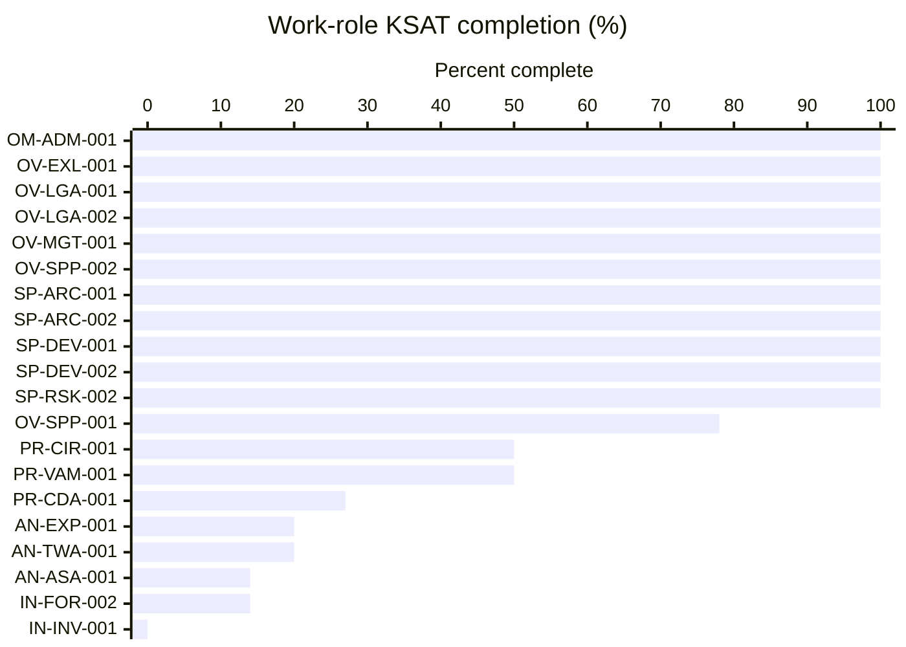
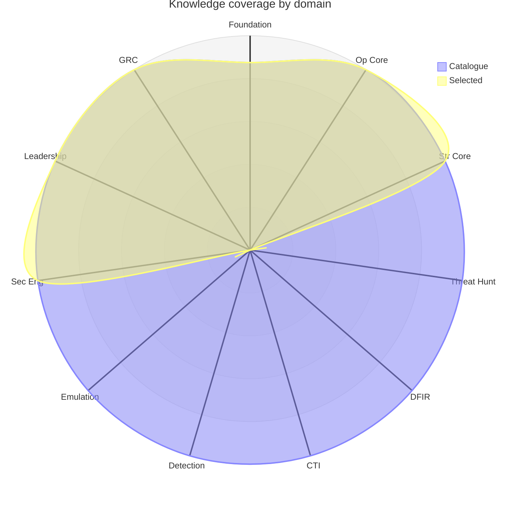
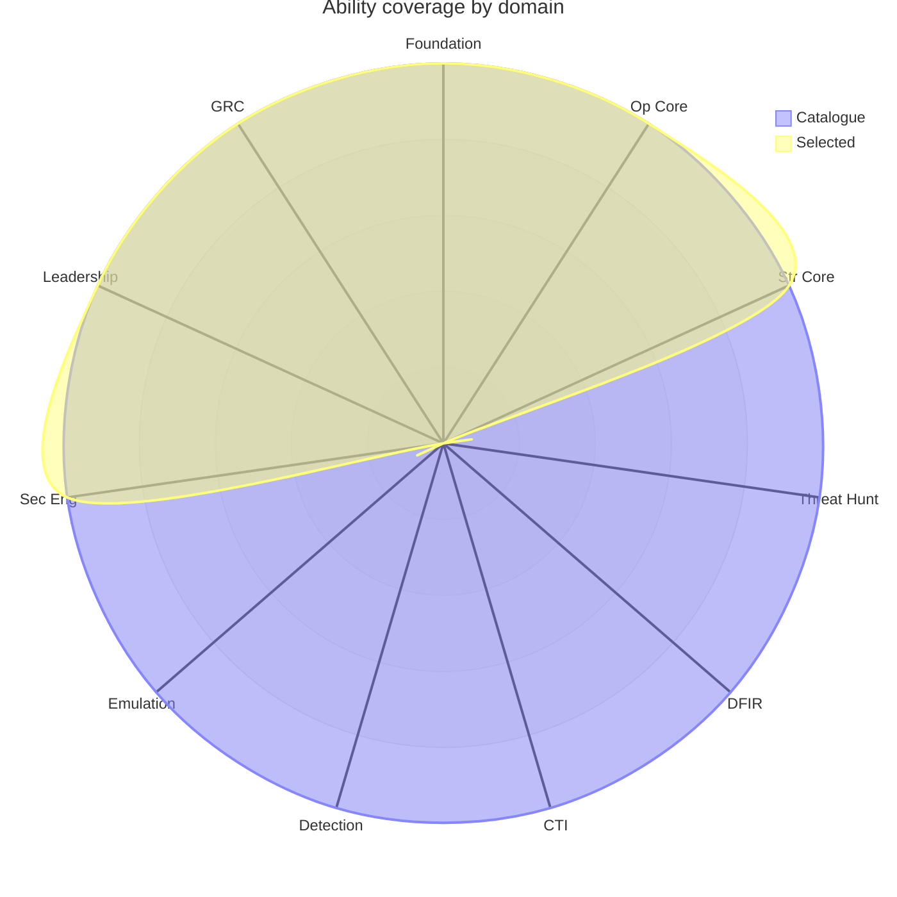
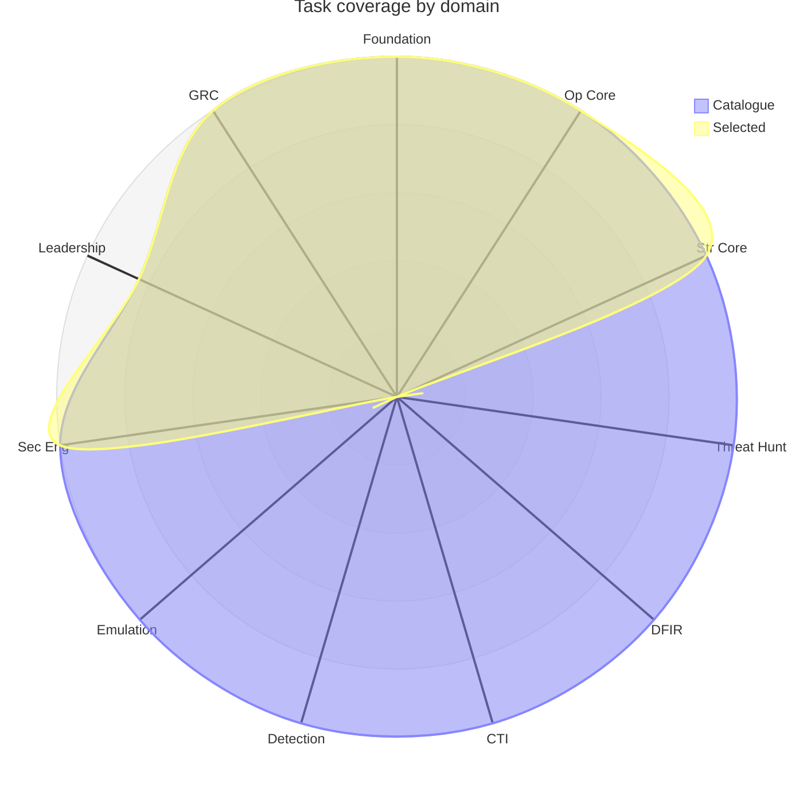
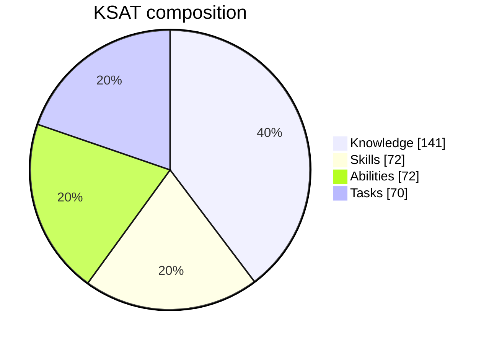

# Program: Bachelor of Cybersecurity Strategy (full degree)

> **Generated** by `.github/scripts/program_builder.py`. Do not edit by hand.
> KSAT IDs are project-local (provisional) pending Framework Custodian
> mapping to official NICE/DCWF identifiers. Charts use Mermaid radar
> (v11.6+) and xychart (v10.3+); each is backed by a table below it.

Shared core plus all three strategic majors — the complete strategic degree surface.

**Selection:** 36 of 66 units · **355** KSAT items (141 K · 72 S · 72 A · 70 T) · **54%** of the full catalogue (655 items).

## Selected courses

| Domain | Units |
|---|---|
| Foundation | F01, F02, F03, F04, F05, F06 |
| Operational Core | OC01, OC02, OC03, OC04, OC05, OC06 |
| Strategic Core | SC01, SC02, SC03, SC04, SC05, SC06 |
| Security Engineering | SE01, SE02, SE03, SE04, SE05, SE06 |
| Leadership & CISO | LD01, LD02, LD03, LD04, LD05, LD06 |
| Governance, Risk & Compliance | GR01, GR02, GR03, GR04, GR05, GR06 |

## NICE/DCWF work-role completion

Percentage of each work role's catalogue KSATs delivered by this selection (a role's KSAT universe is the sum of KSATs across every unit that develops it).



| Work role | Code | Covered | Catalogue | % |
|---|---|---|---|---|
| System Administrator | OM-ADM-001 | 29 | 29 | 100% |
| Executive Cyber Leadership | OV-EXL-001 | 38 | 38 | 100% |
| Cyber Legal Advisor | OV-LGA-001 | 20 | 20 | 100% |
| Privacy Officer/Privacy Compliance Manager | OV-LGA-002 | 20 | 20 | 100% |
| Information Systems Security Manager | OV-MGT-001 | 118 | 118 | 100% |
| Cyber Workforce Developer/Manager | OV-SPP-002 | 10 | 10 | 100% |
| Enterprise Architect | SP-ARC-001 | 30 | 30 | 100% |
| Security Architect | SP-ARC-002 | 70 | 70 | 100% |
| Software Developer | SP-DEV-001 | 10 | 10 | 100% |
| Secure Software Assessor | SP-DEV-002 | 20 | 20 | 100% |
| Security Control Assessor | SP-RSK-002 | 80 | 80 | 100% |
| Cyber Policy & Strategy Planner | OV-SPP-001 | 70 | 90 | 78% |
| Cyber Defense Incident Responder | PR-CIR-001 | 20 | 40 | 50% |
| Vulnerability Assessment Analyst | PR-VAM-001 | 10 | 20 | 50% |
| Cyber Defense Analyst | PR-CDA-001 | 67 | 247 | 27% |
| Exploitation Analyst | AN-EXP-001 | 10 | 50 | 20% |
| Threat/Warning Analyst | AN-TWA-001 | 20 | 100 | 20% |
| All-Source Analyst | AN-ASA-001 | 10 | 70 | 14% |
| Cyber Defense Forensics Analyst | IN-FOR-002 | 10 | 70 | 14% |
| Cyber Crime Investigator | IN-INV-001 | 0 | 20 | 0% |

## KSAT coverage by domain (spider charts)

Each axis is a degree domain. The **Catalogue** curve is everything on offer; the **Selected** curve is what this program delivers. The gap between them is the breadth not taken.

### Knowledge



### Skill


### Ability



### Task



**Domain × type — Selected / Catalogue**

| Domain | Knowledge | Skills | Abilities | Tasks |
|---|---|---|---|---|
| Foundation | 21 / 21 | 12 / 12 | 12 / 12 | 12 / 12 |
| Operational Core | 24 / 24 | 12 / 12 | 12 / 12 | 12 / 12 |
| Strategic Core | 24 / 24 | 12 / 12 | 12 / 12 | 12 / 12 |
| Threat Hunting | 0 / 24 | 0 / 12 | 0 / 12 | 0 / 12 |
| DFIR | 0 / 24 | 0 / 12 | 0 / 12 | 0 / 12 |
| Cyber Threat Intelligence | 0 / 24 | 0 / 12 | 0 / 12 | 0 / 12 |
| Detection Engineering | 0 / 24 | 0 / 12 | 0 / 12 | 0 / 12 |
| Cyber Threat Emulation | 0 / 24 | 0 / 12 | 0 / 12 | 0 / 12 |
| Security Engineering | 24 / 24 | 12 / 12 | 12 / 12 | 12 / 12 |
| Leadership & CISO | 24 / 24 | 12 / 12 | 12 / 12 | 10 / 10 |
| Governance, Risk & Compliance | 24 / 24 | 12 / 12 | 12 / 12 | 12 / 12 |

## KSAT composition of this program



## Program structure

```mermaid
flowchart LR
  P([Bachelor of Cybersecurity Strategy (full degree)])
  P --> D0["Foundation<br/>6 units"]
  P --> D1["Operational Core<br/>6 units"]
  P --> D2["Strategic Core<br/>6 units"]
  P --> D8["Security Engineering<br/>6 units"]
  P --> D9["Leadership & CISO<br/>6 units"]
  P --> D10["Governance, Risk & Compliance<br/>6 units"]
```

---

_Build your own: `python3 .github/scripts/program_builder.py --help`._
