# Degree Structure

> 🧭 **Assemble your own pathway interactively:** the
> [Program Builder](program-builder/index.md) lets you tick courses (grouped by
> degree → year → major) and instantly see the NICE/DCWF work-role and KSAT
> coverage your selection delivers — no scripts required.

---

## Architecture Overview

The degree system is built in three layers:

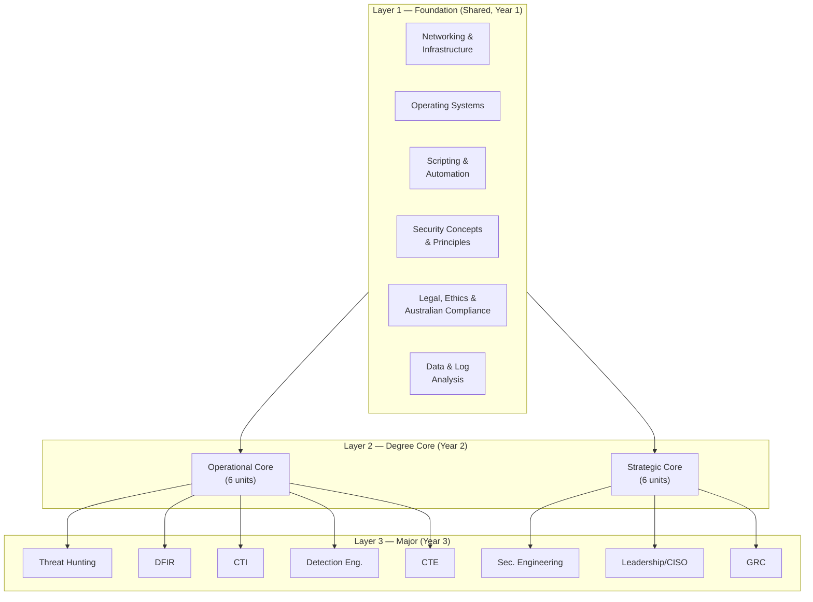

---

## Credit Structure

| Layer | Units | Credit Points | Year |
|---|---|---|---|
| Foundation (shared) | 6 | 48 CP | Year 1 |
| Degree Core (operational or strategic) | 6 | 48 CP | Year 2 |
| Major | 6 | 48 CP | Year 3 |
| Capstone | 1 | 24 CP | Year 3 |
| **Total** | **19** | **168 CP** | **3 years** |

> Credit point structure follows AQF Level 7 Bachelor Degree conventions (typically 144–192 CP for a 3-year degree at Australian universities).

---

## Foundation Year — Units (Shared)

These units are completed by all students regardless of which degree or major they pursue.

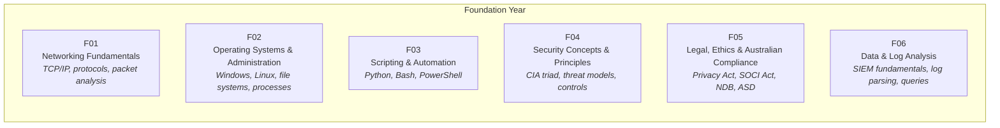

### Foundation Unit Descriptions

#### F01 — Networking Fundamentals
**AQF Learning Outcomes:**
- Explain the OSI and TCP/IP models and their role in network communication
- Analyse packet captures to identify protocols, anomalies, and communication flows
- Configure and troubleshoot basic network services (DNS, DHCP, HTTP/S)

**Tools:** Wireshark, tcpdump, nmap
**Framework Mapping:** NIST NICE K0001, K0010, K0011, K0034; SFIA NTAS; DCWF 511

---

#### F02 — Operating Systems & Administration
**AQF Learning Outcomes:**
- Administer Windows and Linux systems at a command-line level
- Describe OS internals including processes, memory, file systems, and authentication
- Identify OS artefacts relevant to security investigations

**Tools:** Windows CLI, PowerShell, Bash, Sysinternals
**Framework Mapping:** NIST NICE K0117, K0167, K0187; SFIA ITOP; DCWF 511, 521

---

#### F03 — Scripting & Automation
**AQF Learning Outcomes:**
- Write Python, Bash, and PowerShell scripts to automate security tasks
- Parse and manipulate structured data (JSON, CSV, XML) programmatically
- Build basic tooling for log analysis, file processing, and API interaction

**Tools:** Python 3, Bash, PowerShell, VS Code
**Framework Mapping:** NIST NICE K0068, S0266; SFIA PROG; DCWF 531

---

#### F04 — Security Concepts & Principles
**AQF Learning Outcomes:**
- Apply the CIA triad and fundamental security principles to system design
- Construct threat models using STRIDE or similar methodologies
- Explain the categories of security controls (preventive, detective, corrective)

**Tools:** Microsoft Threat Modelling Tool, draw.io
**Framework Mapping:** NIST CSF 2.0 (all functions); NIST NICE K0004, K0007; SFIA SCAD

---

#### F05 — Legal, Ethics & Australian Compliance
**AQF Learning Outcomes:**
- Identify obligations under the Privacy Act 1988 and Notifiable Data Breaches scheme
- Explain the scope and intent of the Security of Critical Infrastructure Act 2018
- Describe the role of Australian regulators: ASD/ACSC, APRA, OAIC, AFP
- Apply ethical frameworks to cybersecurity decision-making

**Framework Mapping:** NIST NICE K0003; ASD Essential Eight context; APRA CPS 234 overview; SFIA CNSL

---

#### F06 — Data & Log Analysis
**AQF Learning Outcomes:**
- Ingest, parse, and query log data from multiple source types
- Identify patterns and anomalies in event data
- Write basic detection logic and alert rules

**Tools:** Splunk Free / OpenSearch / Elastic Stack, Sigma
**Framework Mapping:** NIST NICE K0058, S0173; DCWF 511; NIST CSF 2.0 DE.AE

---

## Operational Degree — Year 2 Core

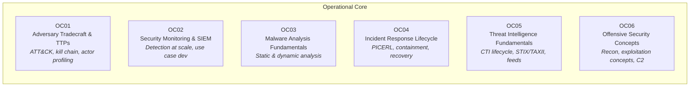

---

## Strategic Degree — Year 2 Core

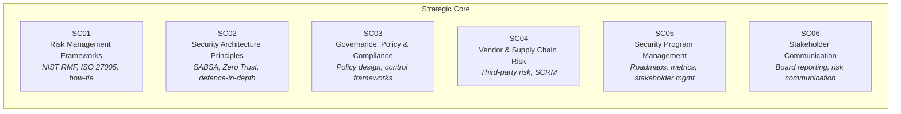

---

## Operational Majors — Year 3

### Major 1: Threat Hunting

> Proactive, hypothesis-driven search for threats that have evaded automated detection.

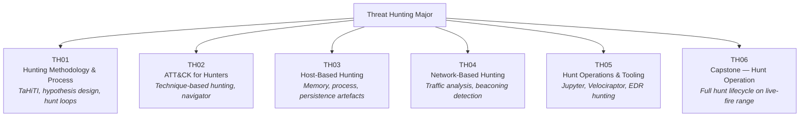

**Role Alignment:** Threat Hunter, Detection Analyst, SOC Tier 3
**Framework Mapping:** NIST NICE TH-INV; ASD CSF; MITRE ATT&CK; SFIA INAS
**Certification Bridges:** GIAC GCIH, eCTHP, BTL2

---

### Major 2: Digital Forensics & Incident Response (DFIR)

> Responding to and investigating security incidents through systematic evidence collection and analysis.

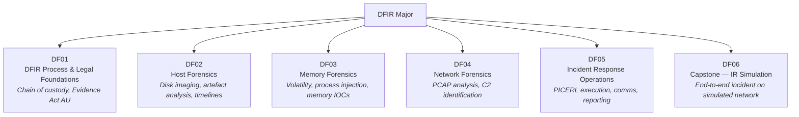

**Role Alignment:** DFIR Analyst, Incident Responder, Forensic Investigator
**Framework Mapping:** PICERL, NIST SP 800-61, DCWF 212/221, DoD 8140, SFIA SURE
**Certification Bridges:** GIAC GCFE, GCFA, GCIH, eCIR, eCDFP

---

### Major 3: Cyber Threat Intelligence (CTI)

> Collecting, processing, analysing, and disseminating intelligence about adversaries to support decision-making.

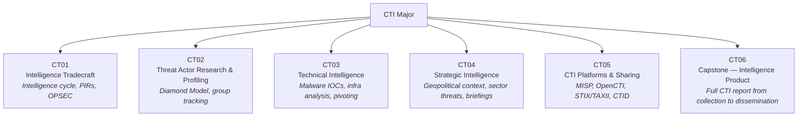

**Role Alignment:** CTI Analyst, Threat Intelligence Manager
**Framework Mapping:** MITRE CTID, STIX 2.1, Diamond Model, NIST NICE IN-001; SFIA INAS
**Certification Bridges:** GIAC GCTI, CREST CCTIM, eCTHP

---

### Major 4: Detection Engineering

> Designing, building, and maintaining detection logic that converts threat knowledge into reliable alerts.

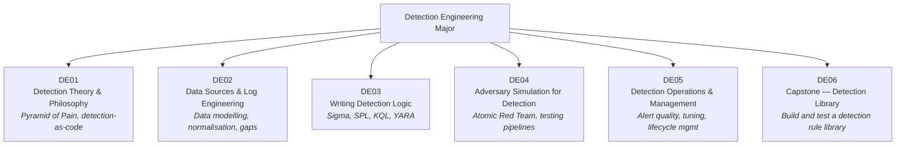

**Role Alignment:** Detection Engineer, Security Content Engineer, SOC Content Developer
**Framework Mapping:** MITRE ATT&CK, NIST CSF 2.0 DE.*, Sigma, NIST NICE; SFIA SCAD
**Certification Bridges:** GIAC GDAT, Splunk Core Certified, Elastic Engineer

---

### Major 5: Cyber Threat Emulation (CTE)

> Simulating adversary behaviour to test and improve defensive controls and team readiness.

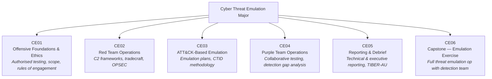

**Role Alignment:** Red Team Operator, Purple Team Lead, Adversary Emulation Engineer
**Framework Mapping:** MITRE ATT&CK, MITRE CTID, TIBER-EU/AU, NIST NICE PR-CDA; SFIA PENT
**Certification Bridges:** GIAC GPEN, GRTOP, eCPTX, OSCP

---

## Strategic Majors — Year 3

### Major 6: Security Engineering

> Designing and implementing secure systems, architectures, and tooling at a technical level.

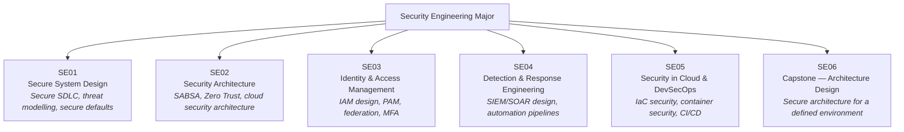

**Role Alignment:** Security Architect, Security Engineer, Principal Security Consultant
**Framework Mapping:** NIST SP 800-160, NIST CSF 2.0, SABSA, SFIA ARCH; Zero Trust (NIST SP 800-207)
**Certification Bridges:** SABSA SCF, AWS Security Specialty, CISSP ISSAP

---

### Major 7: Leadership & CISO

> Building the knowledge and skills required for executive cybersecurity leadership.

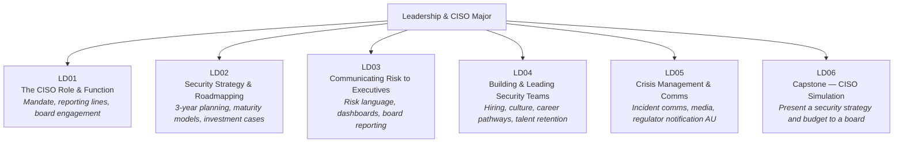

**Role Alignment:** CISO, Security Director, VP Security
**Framework Mapping:** NIST CSF 2.0 GV.*, NIST NICE OV-MGT; SFIA MANA; CISM domains
**Certification Bridges:** CISM, CISSP, GIAC GSLC

---

### Major 8: GRC (Governance, Risk & Compliance)

> Designing and managing the governance structures, risk processes, and compliance programs that underpin organisational security.

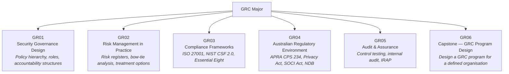

**Role Alignment:** GRC Analyst, Risk Manager, Compliance Manager, Security Auditor
**Framework Mapping:** NIST CSF 2.0 GV.* & ID.*, ISO 27001/27002, APRA CPS 234, ASD Essential Eight, NIST SP 800-37 (RMF); SFIA IRMG
**Certification Bridges:** CISM, ISO 27001 Lead Implementer, CRISC, IRAP Assessor pathway

---

## Capstone Structure

Each major culminates in a capstone unit (the 6th unit in each major). Capstone projects are:

- **Practical** — completed in a lab or simulated environment
- **Integrated** — requires knowledge from all units in the major
- **Documented** — includes a written report suitable for a professional portfolio
- **Community-reviewed** — submissions are reviewed by at least one practitioner volunteer

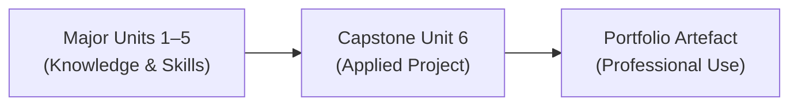

---

## Prerequisite Pathways

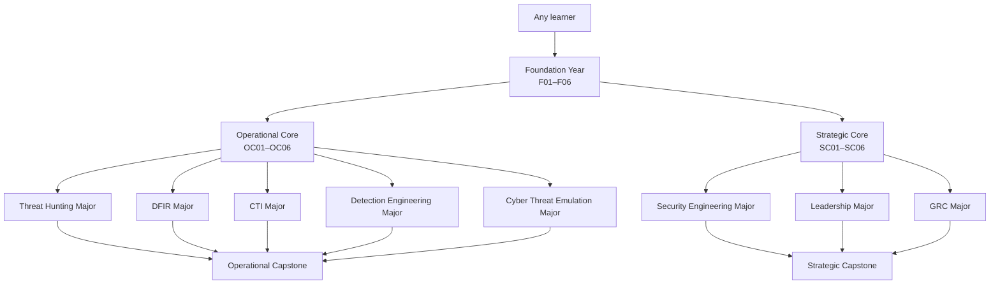

> **Cross-pathway note:** Security Engineering benefits from Operational Core exposure. Learners pursuing the Strategic degree are encouraged to complete at least two Operational Core units as electives.
