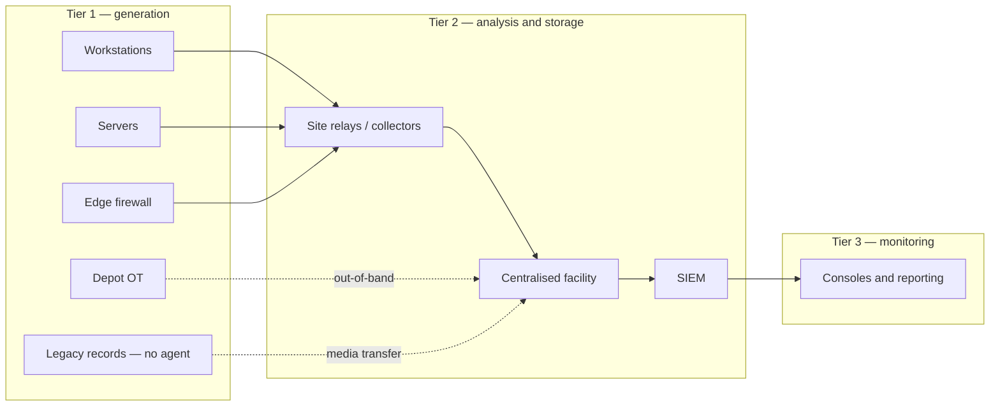

# SA-05 lab guide — Logging, Monitoring and Detection Architecture

**Module:** [SA-05](../../docs/modules/security-architecture/sa-05-logging-and-monitoring-architecture.md) ·
4 labs: 2 📄 design labs fed by measured numbers from the dataset, 2 ✅ on a
three-node syslog relay path that runs without Splunk.

The module's labs are architecture labs: Lab 1 places an estate onto the tiers,
Lab 2 builds the source and retention register, Lab 3 stands up a buffered
two-hop forwarding path, and Lab 4 validates it. The module says *why* and
*what to deliver*; this guide says *how*, and supplies the parts the module
deliberately leaves open — a runnable relay estate, the arithmetic, and the
onboarding of the sources the module's Topics 4–7 name (Windows event
forwarding, Linux audit over TLS, firewall and IDS, cloud audit).

```bash
# Labs 1, 2 and the onboarding section: the dataset (firewall and IDS included)
python3 generator/generate.py --days 14
python3 harness/verify.py data

# Labs 3 and 4: the relay path — no Splunk needed
sh docker/rsyslog/mkcerts.sh
docker compose -f docker/compose.syslog-relay.yml up -d
```

!!! note "What was and was not run to write this"
    The relay path is written to rsyslog 8 syntax and each container refuses to
    start unless `rsyslogd -N1` accepts its configuration, so a syntax error
    fails fast and visibly. The compose file was validated but the containers
    were not executed on the author's machine (no Docker engine available), so
    your first `up -d` is the integration test. Step 1 of Lab 3 tells you exactly
    what to look for; if it fails, `docker logs <container>` shows why.

---

## Lab 1 📄 — Map an Estate onto the Tiers and the Two Stages

Paper lab, but not a guessing lab: the dataset gives you *measured* rates to
place the estate with, which is what stops the second-tier choice being a
matter of taste.

**Measure the estate you have.** Events per day and bytes per day per source,
straight from the generated files:

```bash
python3 - <<'PY'
import json, os, glob
days = json.load(open('data/summary.json'))['window_days']
print(f"{'index':12} {'events/day':>11} {'bytes/day':>12} {'B/event':>8}")
for path in sorted(glob.glob('data/events/*.json')):
    name = os.path.basename(path)[:-5]
    n = sum(1 for _ in open(path, encoding='utf-8'))
    b = os.path.getsize(path)
    print(f"{name:12} {n/days:11,.0f} {b/days:12,.0f} {b/max(n,1):8.0f}")
PY
```

Read the `fw` row against the `proxy` row: the firewall is the same egress seen
twice, so the two together are the cost of *one* decision (Topic 1's scope
axes), not two independent sources. That is the kind of observation step 6 of
the lab wants written down.

**Draw it.** Start from this skeleton and place every component the brief names
(two metro sites, six regional offices on constrained WAN, hybrid cloud, payroll
SaaS, the depot's OT footprint, the legacy records system):



**Storage options.** For every source, one of NIST's four: not stored,
system-level only, both, infrastructure only. Use this table shape and justify
every "both" in the last column — the marks are there:

| Source | Option | Where the copy lives | Why "both" (if both) |
|---|---|---|---|
| Domain controllers — security log | both | host + facility | authentication is the highest-value stream and the host copy survives a facility outage |
| Regional office workstations | infrastructure only | site relay → facility | no local retention obligation; the relay buffers the WAN |
| Depot OT historian | system-level only | historian | cannot be reached by the collector; weekly export |

**Non-participating hosts.** The legacy records system and the OT historian go
in a register with a transfer expectation: what leaves them, how, how often,
and who carries it. Reflection question 2 asks what that costs per week —
answer it in hours of somebody's time, because that is what it is.

---

## Lab 2 📄 — Source Selection and Retention Register

**Register columns.** The seven assessment fields from Topic 4 plus three
retention layers and a policy clause:

```
source, asset_criticality, priority_list, detection_value, volume_per_day,
generation_precondition, known_blind_spots, retention_buffer, retention_collector,
retention_central, policy_clause
```

**The retention arithmetic, at 18 months.** ASD recommends 18 months of central
retention as a floor for intrusion investigation; the register has to say what
that costs per source. Feed the measured bytes/day into it:

```bash
python3 - <<'PY'
import json, os, glob
days = json.load(open('data/summary.json'))['window_days']
MONTHS, COMPRESSION = 18, 0.5          # central store compression: measure yours; 0.5 is conservative
rows = []
for path in sorted(glob.glob('data/events/*.json')):
    name = os.path.basename(path)[:-5]
    per_day = os.path.getsize(path) / days
    rows.append((name, per_day, per_day * 30.4 * MONTHS * COMPRESSION / 1e9))
print(f"{'index':12} {'MB/day raw':>11} {'GB at 18 months (compressed)':>30}")
for name, pd, gb in sorted(rows, key=lambda r: -r[2]):
    print(f"{name:12} {pd/1e6:11.2f} {gb:30.2f}")
print(f"{'TOTAL':12} {sum(r[1] for r in rows)/1e6:11.2f} {sum(r[2] for r in rows):30.2f}")
PY
```

Then do what the lab actually asks: order by asset criticality first, mark the
generation precondition for every row (the audit policy, the agent, the
provider setting — no event exists until it is set), and write the blind-spot
column the way ASD's forwarding guidance does: *what is not forwarded, and
where it remains*. The `fw` rows have a ready-made blind spot to record — DNS
does not traverse the edge firewall, so there is no session per lookup.

**Waves.** No more than five sources per wave, each wave with a health check
that must pass before the next starts. A health check is a query and a
threshold, not a feeling: *"`index=fw` shows ≥ 95% of `index=proxy` count per
hour for 24 hours"* is one. Reconciliation as a health check is the subject of
the onboarding section below.

---

## Lab 3 ✅ — Build a Buffered Two-Hop Forwarding Path

The estate: `src-01` tails an auditd-format stream and forwards over TLS to
`relay-01`, which buffers to a disk-assisted queue, drops one noisy facility,
and forwards over TLS to `central-01`, which writes originals unaltered to one
file per host per day. Configs are in `docker/rsyslog/`; the source stream is
`generator/auditd_stream.py` (containers cannot run the real `auditd`, so the
file has its shape and framing — record types, `msg=audit(ts:serial)`, a
monotonic serial).

### Step 1 — bring it up and prove TLS-only transport

```bash
sh docker/rsyslog/mkcerts.sh
docker compose -f docker/compose.syslog-relay.yml up -d
docker compose -f docker/compose.syslog-relay.yml logs --tail 20      # any "rsyslogd -N1" failure shows here

# Events are arriving centrally:
docker exec central-01 sh -c 'ls -R /var/log/central; tail -2 /var/log/central/src-01/*.log'
```

Packet capture on the relay, both hops. You should see TLS records and no
readable `type=USER_LOGIN` text:

```bash
docker exec relay-01 sh -c 'apk add -q tcpdump && timeout 10 tcpdump -i eth0 -A -c 40 port 6514' | grep -c 'type=USER_LOGIN'
# expected: 0   (repeat without the grep to eyeball the ciphertext)
```

x509/name authentication is on at every hop (`StreamDriverAuthMode="x509/name"`,
`PermittedPeer`), so a host with a valid lab certificate but the wrong CN is
refused — that is the difference between *encrypted* and *authenticated*
transport, and Lab 4's certificate failure rides on it.

### Step 2 — size the relay queue on purpose

The relay's queue holds messages in memory to `queue.highwatermark` and spills
to disk up to `queue.maxdiskspace`. Size it to one hour of the source's peak,
then record the arithmetic — the number is not the point, the working is:

```bash
python3 - <<'PY'
RATE_PEAK = 20 * 12          # events/s: LAB_RATE (20/s) with a 12x burst allowance — substitute your measured peak
BYTES     = 380              # bytes/event: measure with  wc -c audit.log / wc -l audit.log  on src-01
for hours in (1, 24, 72):
    gb = RATE_PEAK * BYTES * 3600 * hours / 1e9
    print(f"{hours:3}h at {RATE_PEAK} ev/s x {BYTES} B = {gb:7.2f} GB on the relay's disk")
print("relay.conf: queue.maxdiskspace=512m covers about",
      round(512e6 / (RATE_PEAK * BYTES) / 60), "minutes at that peak -- raise it or lower the peak")
PY
```

Change `queue.maxdiskspace` in `docker/rsyslog/relay.conf` to the 1-hour figure
you computed, and restart the relay. The 72-hour row is reflection question 4
(Topic 6): the same arithmetic, an order of magnitude more disk, and a
documented decision about what happens at the limit — `queue.discardmark`
with `queue.discardseverity` (drop *newest below a severity*), or a full queue
that blocks the source. Neither is wrong; an undocumented one is.

### Step 3 — append-only per-host files, rotated, with digests

`central.conf` already writes `/var/log/central/<host>/<date>.log` from
`%rawmsg-after-pri%`, so the bytes are the originals. Rotation is by the date
in the filename; the digest is yours to take each night:

```bash
docker exec central-01 sh -c 'cd /var/log/central && sha256sum src-01/*.log | tee -a /var/log/central/DIGESTS'
```

A digest taken *before* rotation and one *after* that differ is evidence of
alteration; that is reflection question 3.

### Step 4 — filter at the relay, and document the blind spot

`relay.conf` drops facility `local7` — the source's debug stream — before the
WAN. Prove it exists on the source and not centrally:

```bash
docker exec src-01 sh -c 'tail -1 /var/log/lab/debug.log'
docker exec central-01 sh -c 'grep -c labdebug /var/log/central/src-01/*.log || true'   # expected 0
```

Blind-spot note (one paragraph): *facility local7 from src-01 is dropped at
relay-01 rule `stop`; the full stream remains in `/var/log/lab/debug.log` on
the source with the source's own retention; recoverable by … within …*.

### Step 5 — burst, and measure

```bash
docker exec src-01 python3 /lab/auditd_stream.py --out /var/log/audit/audit.log --burst 50000 --start 1000000
# queue depth on the relay while it drains:
docker exec relay-01 sh -c 'ls -l /var/spool/rsyslog/'
# end-to-end: when does serial 1049999 land centrally?
docker exec central-01 sh -c 'grep -c "audit(.*:10[0-9]\{5\})" /var/log/central/src-01/*.log'
```

Record: burst size, seconds to drain, peak queue file size. That peak is the
measured input to the step 2 arithmetic.

### Step 6 — stop the receiver for ten minutes, prove zero loss and order

```bash
docker stop central-01; sleep 600; docker start central-01
```

Then check serial continuity over everything received. Serials are monotonic
per streamer run, so a gap is loss and a decrease is reordering:

```bash
docker exec central-01 sh -c 'cat /var/log/central/src-01/*.log' \
  | python3 -c "
import re, sys
s = [int(m.group(1)) for m in re.finditer(r'audit\(\d+\.\d+:(\d+)\)', sys.stdin.read())]
runs, prev, gaps, back = [], None, 0, 0
for x in s:
    if prev is not None:
        if x < prev: back += 1
        elif x != prev + 1: gaps += 1
    prev = x
print(f'{len(s)} records, {gaps} gaps, {back} out-of-order')"
```

The relay's queue carried the outage. Note what `docker logs relay-01` said
while central was down (retry, then resume) — that is the pipeline-health
telemetry step 7 wants centralised.

### Step 7 — pipeline-health telemetry

The relay's and receiver's own daemon messages already ride the path (`*.* call
relay` / `*.* call store`). Confirm the outage from step 6 is visible in the
central store, not only in `docker logs`:

```bash
docker exec central-01 sh -c 'grep -h "rsyslogd" /var/log/central/relay-01/*.log | tail -5'
```

If the receiver's *own* failure is only visible in its own file on its own
disk, the telemetry does not help you when that disk is the problem — Lab 4
failure 4 makes that point.

### Step 8 — a second source, and the relay's ceiling

Add `src-02` to `mkcerts.sh`'s host list, re-run it, and add a `src-02` service
to the compose file (copy `src-01`, change `hostname` and the certificate
paths). `relay.conf` already permits it (`PermittedPeer=["src-01", "src-02"]`).
Then estimate the ceiling from measurement: if one source at your measured peak
drained at *N* events/s through the relay, the relay carries roughly
`N / per-source-peak` such sources before the queue grows without bound.
Write that as a number with its assumptions, not as "it depends".

---

## Lab 4 ✅ — Validate the Architecture

Same estate. The lab's shape is NIST's: passive checks (is it configured and
kept as designed), active checks (generate an event, watch it arrive with every
field), then break it and see what the telemetry tells you.

**Passive.** Configuration drift against the committed repository:

```bash
for n in src-01 relay-01 central-01; do
  docker exec $n cat /etc/rsyslog.conf | diff -q - docker/rsyslog/${n%-01}.conf && echo "$n: matches repo"
done
```

**Active.** The streamer emits the three event kinds the lab names — a remote
logon (`USER_LOGIN`), a privilege escalation (`USER_CMD` via sudo) and a file
permission change (`PATH` with `mode=`). Generate a small labelled burst and
time its arrival:

```bash
docker exec src-01 python3 /lab/auditd_stream.py --out /var/log/audit/audit.log --burst 60 --start 9000000
sleep 5
docker exec central-01 sh -c 'grep -h "audit(.*:900[0-9]\{4\})" /var/log/central/src-01/*.log' | grep -oE 'type=(USER_LOGIN|USER_CMD|PATH)' | sort | uniq -c
```

Latency is `audit(<ts>:…)` (generation) against the file's mtime (arrival).
For field completeness, check each line against the Topic 7 record baseline
(time, host, source, event type, subject, outcome): `USER_LOGIN` carries all
six; `PATH` carries no subject or outcome on its own — it needs its `SYSCALL`
sibling with the same serial, which is exactly the kind of correlation the
record baseline exists to make explicit.

**Silent-source specification.** A design deliverable, not a build (the build
is EXT-ANS Lab 7). One row per source class:

| Source class | Silence interval that is a finding | Evidence the central store must hold | Alerted |
|---|---|---|---|
| Authentication (DC, cloud IdP) | 15 min | last `_time` per host per sourcetype | SOC on-call |
| Endpoint (workstations) | 24 h per host; 1 h for the population | per-host last-seen; population count per hour | Endpoint platform owner |
| Site relay | 5 min | relay's own daemon messages present | Network operations |

**Four failures.** Break it and record what surfaced, where, and how long it
took:

| # | Failure | How to cause it | Where it surfaces |
|---|---|---|---|
| 1 | Relay queue fills | `docker stop central-01`, then a burst larger than `queue.maxdiskspace` | relay `docker logs`: discard messages once `queue.discardmark` is reached; centrally, a serial gap after restart |
| 2 | Relay clock skewed 10 min | add `cap_add: [SYS_TIME]` to `relay-01` in the compose file, then `docker exec relay-01 date -s "$(date -d '-10 min')"` (if your Docker host forbids it, note that the container shares the host clock and describe the symptom instead) | central per-day files split on the wrong date boundary; reception timestamps disagree with `audit(ts)` by 600 s |
| 3 | Relay→central certificate expired | reissue `central-01.pem` with `-days 0` in `mkcerts.sh` (or a wrong CN), restart central | relay `docker logs`: TLS handshake / peer name failure; queue grows; nothing new centrally |
| 4 | Central rotation/write fails | `docker exec central-01 chmod 000 /var/log/central/src-01` | **not** in the central store — only in `docker logs central-01`. The telemetry for the store cannot live in the store. |

**The assurance note** is the deliverable an authorising officer reads. Three
headings, in this order: *proven*, *not tested*, *would block authorisation*.
Failure 4 belongs under the third heading unless you fixed it.

---

## Onboarding the other sources

The module's Topics 4–7 name four integrations. Two run on the dataset as
generated, one runs on the relay estate, one is paper with a runnable partner.

### Windows event forwarding (WEF/WEC) 📄 + ✅

**Paper — the collector.** ASD's forwarding guidance is the source for the
subscription model and for sizing the collector's own log store. A minimal
source-initiated subscription, which is what you register on the collector:

```xml
<Subscription xmlns="http://schemas.microsoft.com/2004/06/03/Subscription">
  <SubscriptionId>OSCD-Security</SubscriptionId>
  <SubscriptionType>SourceInitiated</SubscriptionType>
  <Query><![CDATA[<QueryList><Query Id="0" Path="Security">
    <Select Path="Security">*[System[(EventID=4624 or EventID=4625 or EventID=4672 or EventID=4688)]]</Select>
  </Query></QueryList>]]></Query>
  <ReadExistingEvents>false</ReadExistingEvents>
  <ContentFormat>RenderedText</ContentFormat>
  <AllowedSourceNonDomainComputers/>
  <AllowedSourceDomainComputers>O:NSG:NSD:(A;;GA;;;DC)</AllowedSourceDomainComputers>
</Subscription>
```

Collector sizing is the Lab 2 arithmetic again: per-host events/day × hosts ×
bytes/event × days the collector must hold when the forwarder behind it is
down. Set the `ForwardedEvents` log to *archive when full*, not overwrite —
that is the guidance's position and the one Topic 6 relies on.

**Runnable — the forwarder behind the collector.** On the estate the collected
Windows stream is `wineventlog`. `docker/compose.forwarders.yml` puts a
universal forwarder in front of it with a deployment server, which is the
collector-then-forwarder pattern:

```bash
docker compose -f docker/compose.single.yml -f docker/compose.forwarders.yml up -d
```

### Linux `auditd` / `journald` → rsyslog over TLS ✅

Lab 3 *is* this integration. On a real host the two changes from the lab are
that `auditd` writes the file itself (the `imfile` input stays the same) and
that `journald` is read with `imjournal` rather than `imuxsock`. Keep the
relay's filter and queue exactly as they are.

### Firewall, IDS and proxy — onboard, then reconcile ✅

The dataset's `fw` and `ids` streams are derived from the same traffic as
`proxy`, so a correct onboarding *reconciles* and an incorrect one does not.
That makes reconciliation the health check Lab 2's waves need:

```bash
python3 - <<'PY'
import json, collections
load = lambda n: [json.loads(l) for l in open(f'data/events/{n}.json', encoding='utf-8')]
proxy, fw, ids = load('proxy'), load('fw'), load('ids')
allowed = [e for e in fw if e['action'] == 'allowed' and e['direction'] == 'outbound']
print(f"web events {len(proxy):,}  |  firewall outbound allowed {len(allowed):,}  |  ratio {len(allowed)/len(proxy):.3f}")
blocked = collections.Counter(e['src_host'] for e in fw if e['action'] == 'blocked')
print(f"blocked sessions on {len(blocked)} hosts; busiest holds {max(blocked.values())/sum(blocked.values()):.1%}")
sev1 = collections.Counter(e['src_host'] for e in ids if e['severity'] == 1)
print("severity-1 IDS alerts by host:", dict(sev1.most_common(3)), "-- of", len(ids), "alerts across",
      len({e['src_host'] for e in ids}), "hosts")
PY
```

Three things a learner should take from the output: the two logs agree to
within a few percent (onboarding is correct); `action=blocked` is spread across
the estate and identifies nothing on its own; the severity-1 alerts sit on one
host inside a stream that is mostly severity-3 noise. In Splunk the same
reconciliation is one search:

```spl
| tstats count where index=proxy by _time span=1h
| join _time [ | tstats count as fw where index=fw action=allowed direction=outbound by _time span=1h ]
| eval ratio = round(fw / count, 3)
```

**Now onboard it wrong, on purpose.** Add a `local/props.conf` in the
`oscd_lab` app that overrides the firewall timestamp:

```conf
[oscd:fw]
TIME_FORMAT = %d/%m/%Y %H:%M:%S
```

Restart, re-ingest, re-run the reconciliation. Every firewall event now lands
at index time rather than event time, the hourly ratio collapses, and nothing
in the ingestion path reports an error. The health check caught what the
platform did not — which is the argument for reconciliation-as-health-check,
and the reason the `fw` stream was built to mirror `proxy` exactly.

### Cloud audit ✅

`oscd:cloud` is a cloud identity-provider sign-in log: `user`, `action`,
`src_country`, `authentication_method`, `mfa_result`. ASD's priority list for
cloud puts identity events first, and the module's Topic 4 order agrees. The
onboarding question for a real tenancy is not the format but the *pull*: cloud
audit is fetched by the collection tier on a schedule, so its latency and its
gaps look different from a pushed syslog stream. Put that in the Lab 2 register
as the generation precondition (diagnostic setting enabled, retention in the
tenancy, export configured) and as a blind spot (events older than the export
window that were never pulled).

---

## What this guide does not do

It does not parse, enrich or data-model any of these sources — that is SE04
Topic 3 and EXT-SPL; it does not build the silent-source check — EXT-ANS Lab 7;
and it does not design an end-to-end monitoring capability for a permanently
air-gapped site, which the module's Topic 6 scopes to the intermittent case.
